# Introduction

Script to analyze patterns of extortion victimization against Mexican businesses.

# Set up, data input and pre-process

## Session info

We first check details of the session and system, and for reproducibility, we set the random seed.


```r
starttime <- proc.time()
date()
```

```
## [1] "Mon Jun 19 19:52:24 2017"
```

```r
sessionInfo()
```

```
## R version 3.4.0 (2017-04-21)
## Platform: x86_64-pc-linux-gnu (64-bit)
## Running under: Red Hat Enterprise Linux Server 7.2 (Maipo)
## 
## Matrix products: default
## BLAS/LAPACK: /shared/ucl/apps/openblas/0.2.14/gnu-4.9.2/lib/libopenblasp-r0.2.14.so
## 
## locale:
##  [1] LC_CTYPE=en_GB.UTF-8       LC_NUMERIC=C              
##  [3] LC_TIME=en_GB.UTF-8        LC_COLLATE=en_GB.UTF-8    
##  [5] LC_MONETARY=en_GB.UTF-8    LC_MESSAGES=en_GB.UTF-8   
##  [7] LC_PAPER=en_GB.UTF-8       LC_NAME=C                 
##  [9] LC_ADDRESS=C               LC_TELEPHONE=C            
## [11] LC_MEASUREMENT=en_GB.UTF-8 LC_IDENTIFICATION=C       
## 
## attached base packages:
## [1] stats     graphics  grDevices utils     datasets  methods   base     
## 
## loaded via a namespace (and not attached):
## [1] compiler_3.4.0 magrittr_1.5   tools_3.4.0    stringi_1.1.5 
## [5] knitr_1.16     stringr_1.2.0  evaluate_0.10
```

```r
set.seed(42)
options(scipen=0)
```

## Load packages and functions

Install custom package, requires `devtools`.


```r
# devtools::install_github("prestevez/victim")
```

Next we load the packages that we will use.


```r
library(victim)
library(foreign)
library(ggplot2)
library(Cairo)
library(knitr)
library(texreg)
```

```
## Version:  1.36.23
## Date:     2017-03-03
## Author:   Philip Leifeld (University of Glasgow)
## 
## Please cite the JSS article in your publications -- see citation("texreg").
```

```r
library(lme4)
```

```
## Loading required package: Matrix
```

```r
library(glmmADMB)
```

```
## Loading required package: MASS
```

```
## 
## Attaching package: 'glmmADMB'
```

```
## The following object is masked from 'package:MASS':
## 
##     stepAIC
```

```
## The following object is masked from 'package:stats':
## 
##     step
```

```r
library(classInt)
library(dplyr)
```

```
## 
## Attaching package: 'dplyr'
```

```
## The following object is masked from 'package:MASS':
## 
##     select
```

```
## The following objects are masked from 'package:stats':
## 
##     filter, lag
```

```
## The following objects are masked from 'package:base':
## 
##     intersect, setdiff, setequal, union
```

```r
library(reshape2)
library(lmtest)
```

```
## Loading required package: zoo
```

```
## 
## Attaching package: 'zoo'
```

```
## The following objects are masked from 'package:base':
## 
##     as.Date, as.Date.numeric
```

```r
library(car)
```

```
## 
## Attaching package: 'car'
```

```
## The following object is masked from 'package:dplyr':
## 
##     recode
```

```r
library(pscl)
```

```
## Loading required package: lattice
```

```
## Classes and Methods for R developed in the
```

```
## Political Science Computational Laboratory
```

```
## Department of Political Science
```

```
## Stanford University
```

```
## Simon Jackman
```

```
## hurdle and zeroinfl functions by Achim Zeileis
```

```r
sessionInfo()
```

```
## R version 3.4.0 (2017-04-21)
## Platform: x86_64-pc-linux-gnu (64-bit)
## Running under: Red Hat Enterprise Linux Server 7.2 (Maipo)
## 
## Matrix products: default
## BLAS/LAPACK: /shared/ucl/apps/openblas/0.2.14/gnu-4.9.2/lib/libopenblasp-r0.2.14.so
## 
## locale:
##  [1] LC_CTYPE=en_GB.UTF-8       LC_NUMERIC=C              
##  [3] LC_TIME=en_GB.UTF-8        LC_COLLATE=en_GB.UTF-8    
##  [5] LC_MONETARY=en_GB.UTF-8    LC_MESSAGES=en_GB.UTF-8   
##  [7] LC_PAPER=en_GB.UTF-8       LC_NAME=C                 
##  [9] LC_ADDRESS=C               LC_TELEPHONE=C            
## [11] LC_MEASUREMENT=en_GB.UTF-8 LC_IDENTIFICATION=C       
## 
## attached base packages:
## [1] stats     graphics  grDevices utils     datasets  methods   base     
## 
## other attached packages:
##  [1] pscl_1.4.9        lattice_0.20-35   car_2.1-4        
##  [4] lmtest_0.9-35     zoo_1.8-0         reshape2_1.4.2   
##  [7] dplyr_0.5.0       classInt_0.1-24   glmmADMB_0.8.3.3 
## [10] MASS_7.3-47       lme4_1.1-13       Matrix_1.2-9     
## [13] texreg_1.36.23    knitr_1.16        Cairo_1.5-9      
## [16] ggplot2_2.2.1     foreign_0.8-67    victim_0.0.0.9000
## 
## loaded via a namespace (and not attached):
##  [1] Rcpp_0.12.11       compiler_3.4.0     nloptr_1.0.4      
##  [4] R2admb_0.7.15      plyr_1.8.4         class_7.3-14      
##  [7] tools_3.4.0        evaluate_0.10      tibble_1.3.0      
## [10] nlme_3.1-131       gtable_0.2.0       mgcv_1.8-17       
## [13] DBI_0.6-1          parallel_3.4.0     SparseM_1.77      
## [16] coda_0.19-1        e1071_1.6-8        stringr_1.2.0     
## [19] MatrixModels_0.4-1 nnet_7.3-12        grid_3.4.0        
## [22] R6_2.2.1           minqa_1.2.4        magrittr_1.5      
## [25] scales_0.4.1       splines_3.4.0      pbkrtest_0.4-7    
## [28] assertthat_0.2.0   colorspace_1.3-2   quantreg_5.33     
## [31] stringi_1.1.5      lazyeval_0.2.0     munsell_0.4.3
```


## Data input

Load the data for the study.


```r
enve_all <- read.dbf("enve2014cuest_ciega_2014.dbf")
cat_entidades <- read.csv("cat_entidades.csv", head=TRUE)
area_level_tmp <- read.csv("state_level_data.csv", header=TRUE)
area_level <- merge(area_level_tmp, cat_entidades, by="CVE_ENT", all.x=TRUE)
scode <- read.csv("secode.csv", head=TRUE)
scode$Code <- scode$Code*10000
```


Quick overview of all the variables in the dataset


```r
summary(enve_all)
```

```
     P26_10        CVE_ENT     ID_ESTRATO      P33       SECTOR_FIN
 1      : 109   13     : 100   1:589      1      : 135   C:809     
 2      :  46   11     :  95   2:633      2      :  54   I:825     
 3      :  32   14     :  95   3:618      3      :  34   S:866     
 4      :  25   19     :  87   4:660      4      :  21             
 5      :  19   9      :  85              5      :  11             
 (Other):  66   21     :  84              (Other):  27             
 NA's   :2203   (Other):1954              NA's   :2218             
     P1_1B            P3         CVE_UNICA      P25_10   P29_1    P30_1   
 263010 :   4   2005   :  68   Min.   :    60   1: 297   1: 282   1: 282  
 383510 :   4   1982   :  66   1st Qu.: 10220   2:2153   2:2168   2:2168  
 390810 :   4   2008   :  66   Median : 19849   9:  50   9:  50   9:  50  
 419710 :   4   2013   :  66   Mean   : 32087                             
 589710 :   4   1991   :  65   3rd Qu.: 53126                             
 631010 :   4   2009   :  64   Max.   :100000                             
 (Other):2476   (Other):2105                                              
 P31_1    P32_1      ID_CONSECU    
 1: 282   1: 282   Min.   :    60  
 2:2168   2:2168   1st Qu.: 10220  
 9:  50   9:  50   Median : 19849  
                   Mean   : 32087  
                   3rd Qu.: 53126  
                   Max.   :100000  
                                   
```

Now select only the relevant variables


```r
enve_test <- data.frame(extortions=as.integer(as.character(enve_all$P26_10)))

enve_test$extortion_victim <- enve_all$P25_10
enve_test$extortions[enve_test$extortion_victim == 2] <- 0

summary(enve_test$extortions)
```

```
   Min. 1st Qu.  Median    Mean 3rd Qu.    Max.    NA's 
 0.0000  0.0000  0.0000  0.5808  0.0000 33.0000      50 
```

```r
table(enve_test$extortions)
```

```

   0    1    2    3    4    5    6    7    8    9   10   11   12   13   14 
2153  109   46   32   25   19    8    5    4    5    4    2    5    4    6 
  15   19   20   21   22   23   25   27   29   32   33 
   5    2    4    2    1    2    1    1    1    3    1 
```

```r
enve_test$extortions_nas <- enve_test$extortions
enve_test$extortions[is.na(enve_test$extortions)] <- 0

summary(enve_test$extortions)
```

```
   Min. 1st Qu.  Median    Mean 3rd Qu.    Max. 
 0.0000  0.0000  0.0000  0.5692  0.0000 33.0000 
```

```r
table(enve_test$extortions)
```

```

   0    1    2    3    4    5    6    7    8    9   10   11   12   13   14 
2203  109   46   32   25   19    8    5    4    5    4    2    5    4    6 
  15   19   20   21   22   23   25   27   29   32   33 
   5    2    4    2    1    2    1    1    1    3    1 
```

```r
levels(enve_test$extortion_victim) <- c("yes", "no", "dk")
enve_test$extortion_victim <- relevel(enve_test$extortion_victim, ref = "no")

enve_test$rep_extortion_victim <- factor(enve_test$extortions)
levels(enve_test$rep_extortion_victim) <- c(0, 0,
                    rep(1, length(levels(enve_test$rep_extortion_victim)) - 2))

summary(enve_test$rep_extortion_victim)
```

```
   0    1 
2312  188 
```

```r
summary(enve_test)
```

```
   extortions      extortion_victim extortions_nas    rep_extortion_victim
 Min.   : 0.0000   no :2153         Min.   : 0.0000   0:2312              
 1st Qu.: 0.0000   yes: 297         1st Qu.: 0.0000   1: 188              
 Median : 0.0000   dk :  50         Median : 0.0000                       
 Mean   : 0.5692                    Mean   : 0.5808                       
 3rd Qu.: 0.0000                    3rd Qu.: 0.0000                       
 Max.   :33.0000                    Max.   :33.0000                       
                                    NA's   :50                            
```


```r
enve_test$bribes <- as.integer(as.character(enve_all$P33))
summary(enve_test$bribes)
```

```
   Min. 1st Qu.  Median    Mean 3rd Qu.    Max.    NA's 
  1.000   1.000   2.000   2.486   3.000  16.000    2218 
```

```r
# 4 bribe cats
enve_test$bribe1 <- enve_all$P29_1
enve_test$bribe2 <- enve_all$P30_1
enve_test$bribe3 <- enve_all$P31_1
enve_test$bribe4 <- enve_all$P32_1

enve_test$bribes[with(enve_test,
                        bribe1 == 2 &
                        bribe2 == 2 &
                        bribe3 == 2 &
                        bribe4 == 2)] <- 0

summary(enve_test$bribes)
```

```
   Min. 1st Qu.  Median    Mean 3rd Qu.    Max.    NA's 
 0.0000  0.0000  0.0000  0.2861  0.0000 16.0000      50 
```

```r
enve_test$bribe_victim[enve_test$bribes > 0] <- 1
enve_test$bribe_victim[with(enve_test,
                        bribe1 == 2 &
                        bribe2 == 2 &
                        bribe3 == 2 &
                        bribe4 == 2)] <- 0

enve_test$bribe_victim[with(enve_test,
                        bribe1 == 9 &
                        bribe2 == 9 &
                        bribe3 == 9 &
                        bribe4 == 9)] <- 9

enve_test %>%
    mutate(bribe_victim = as.factor(bribe_victim)) -> enve_test

levels(enve_test$bribe_victim) <- c("no", "yes", "dk")

bribecols <- c("bribe1",
               "bribe2",
               "bribe3",
               "bribe4")

colindbribe <- which(names(enve_test) %in% bribecols)

enve_test <- enve_test[,-colindbribe]

enve_test$bribes_nas <- enve_test$bribes

enve_test$bribes[is.na(enve_test$bribes)] <- 0


summary(enve_test)
```

```
   extortions      extortion_victim extortions_nas    rep_extortion_victim
 Min.   : 0.0000   no :2153         Min.   : 0.0000   0:2312              
 1st Qu.: 0.0000   yes: 297         1st Qu.: 0.0000   1: 188              
 Median : 0.0000   dk :  50         Median : 0.0000                       
 Mean   : 0.5692                    Mean   : 0.5808                       
 3rd Qu.: 0.0000                    3rd Qu.: 0.0000                       
 Max.   :33.0000                    Max.   :33.0000                       
                                    NA's   :50                            
     bribes        bribe_victim   bribes_nas     
 Min.   : 0.0000   no :2168     Min.   : 0.0000  
 1st Qu.: 0.0000   yes: 282     1st Qu.: 0.0000  
 Median : 0.0000   dk :  50     Median : 0.0000  
 Mean   : 0.2804                Mean   : 0.2861  
 3rd Qu.: 0.0000                3rd Qu.: 0.0000  
 Max.   :16.0000                Max.   :16.0000  
                                NA's   :50       
```


```r
enve_test$CVE_UNICA <- as.integer(as.character(enve_all$ID_CONSECU))

enve_test$CVE_ENT <- as.integer(as.character(enve_all$CVE_ENT))

enve_test$size <- enve_all$ID_ESTRATO
levels(enve_test$size) <- c("Large", "Medium", "Small", "Micro")

enve_test$sector <- enve_all$SECTOR_FIN

# subsector
enve_test$tempsub <- as.integer(as.character(enve_all$P1_1B))
enve_test$subsector <- cut(enve_test$tempsub, scode$Code, right=FALSE)
levels(enve_test$subsector) <- scode$Sector
enve_test$subsector <- droplevels(enve_test$subsector)
enve_test$subsector <- relevel(enve_test$subsector, ref="Retail")
levels(enve_test$subsector)
```

```
 [1] "Retail"         "Mining"         "Utilities"      "Construction"  
 [5] "Manufacturing"  "Wholesale"      "Transport"      "Media"         
 [9] "Finance"        "Real estate"    "Prof. services" "Corporate"     
[13] "Maintenance"    "Education"      "Health"         "Leisure"       
[17] "HotelsRestBar"  "Other"         
```

```r
enve_test$years <- 2013 - as.numeric(as.character(enve_all$P3))
intyears <- classIntervals(enve_test$years, 5, style="quantile")
enve_test$yearsquant <- cut(enve_test$years, intyears$brks, right=TRUE,
                            include.lowest = TRUE)

intyears_deciles <- classIntervals(enve_test$years, 10, style="quantile")
enve_test$years_deciles <- cut(enve_test$years, intyears_deciles$brks, right=TRUE,
                            include.lowest = TRUE)


enve_test <- merge(enve_test, area_level, by="CVE_ENT", all.x=TRUE)

length(enve_test$extortions[is.na(enve_test$extortions)])
```

```
[1] 0
```

```r
length(enve_test$bribes[is.na(enve_test$bribes)])
```

```
[1] 0
```

```r
### To exclude the subsectors with very few observations

summary(enve_test)
```

```
    CVE_ENT        extortions      extortion_victim extortions_nas   
 Min.   : 1.00   Min.   : 0.0000   no :2153         Min.   : 0.0000  
 1st Qu.: 9.00   1st Qu.: 0.0000   yes: 297         1st Qu.: 0.0000  
 Median :16.00   Median : 0.0000   dk :  50         Median : 0.0000  
 Mean   :16.56   Mean   : 0.5692                    Mean   : 0.5808  
 3rd Qu.:24.00   3rd Qu.: 0.0000                    3rd Qu.: 0.0000  
 Max.   :32.00   Max.   :33.0000                    Max.   :33.0000  
                                                    NA's   :50       
 rep_extortion_victim     bribes        bribe_victim   bribes_nas     
 0:2312               Min.   : 0.0000   no :2168     Min.   : 0.0000  
 1: 188               1st Qu.: 0.0000   yes: 282     1st Qu.: 0.0000  
                      Median : 0.0000   dk :  50     Median : 0.0000  
                      Mean   : 0.2804                Mean   : 0.2861  
                      3rd Qu.: 0.0000                3rd Qu.: 0.0000  
                      Max.   :16.0000                Max.   :16.0000  
                                                     NA's   :50       
   CVE_UNICA          size     sector     tempsub      
 Min.   :    60   Large :589   C:809   Min.   :212410  
 1st Qu.: 10220   Medium:633   I:825   1st Qu.:361710  
 Median : 19849   Small :618   S:866   Median :511160  
 Mean   : 32087   Micro :660           Mean   :511102  
 3rd Qu.: 53126                        3rd Qu.:658810  
 Max.   :100000                        Max.   :812910  
                                                       
         subsector       years         yearsquant  years_deciles
 Manufacturing:484   Min.   : 0.00   [0,8]  :552   [0,4]  :299  
 Health       :391   1st Qu.:10.00   (8,16] :454   (25,30]:297  
 HotelsRestBar:367   Median :21.00   (16,25]:507   (16,21]:288  
 Construction :356   Mean   :20.94   (25,34]:525   (4,8]  :253  
 Maintenance  :206   3rd Qu.:31.00   (34,43]:462   (34,39]:248  
 Transport    :135   Max.   :43.00                 (12,16]:232  
 (Other)      :561                                 (Other):883  
   Prevalence       Incidence     Concentration   log_bribe_vic     
 Min.   : 19.00   Min.   : 29.0   Min.   :1.163   Min.   :-1.05294  
 1st Qu.: 45.00   1st Qu.: 63.0   1st Qu.:1.340   1st Qu.:-0.39616  
 Median : 59.00   Median :103.0   Median :1.606   Median :-0.16564  
 Mean   : 69.97   Mean   :115.7   Mean   :1.658   Mean   :-0.09983  
 3rd Qu.: 83.00   3rd Qu.:144.0   3rd Qu.:1.820   3rd Qu.: 0.27829  
 Max.   :180.00   Max.   :286.0   Max.   :2.709   Max.   : 0.92312  
                                                                    
   log_deaths       rt_deaths_wpn      log_drug_crim    
 Min.   :-2.72796   Min.   :-37.1168   Min.   :-2.6561  
 1st Qu.:-1.19062   1st Qu.: -8.1226   1st Qu.:-1.5849  
 Median :-0.09826   Median :  3.7713   Median :-1.0359  
 Mean   :-0.49642   Mean   :  0.2107   Mean   :-0.6768  
 3rd Qu.: 0.16603   3rd Qu.:  8.8654   3rd Qu.: 0.1148  
 Max.   : 1.53441   Max.   : 27.5815   Max.   : 1.9593  
                                                        
  log_oc_crim        log_wpn_crim        log_pop           log_nbus       
 Min.   :-3.23988   Min.   :-2.8933   Min.   :-1.6674   Min.   :-0.50020  
 1st Qu.:-0.46729   1st Qu.:-0.8466   1st Qu.:-0.7611   1st Qu.:-0.16721  
 Median : 0.12742   Median :-0.2070   Median :-0.2470   Median :-0.04958  
 Mean   : 0.02588   Mean   :-0.3763   Mean   :-0.2396   Mean   :-0.03664  
 3rd Qu.: 0.74911   3rd Qu.: 0.4458   3rd Qu.: 0.2893   3rd Qu.: 0.08738  
 Max.   : 1.92491   Max.   : 1.0703   Max.   : 1.4868   Max.   : 0.63217  
                                                                          
   law_index           comp_index                   NOM_ENT    
 Min.   :-33.02134   Min.   :-22.4096   HIDALGO         : 100  
 1st Qu.: -4.29495   1st Qu.: -5.1176   GUANAJUATO      :  95  
 Median :  1.13880   Median :  1.3520   JALISCO         :  95  
 Mean   :  0.03519   Mean   :  0.1425   NUEVO LEON      :  87  
 3rd Qu.:  7.76001   3rd Qu.:  5.0020   DISTRITO FEDERAL:  85  
 Max.   : 24.00707   Max.   : 20.1805   PUEBLA          :  84  
                                        (Other)         :1954  
    NOM_ABR    
 HGO.   : 100  
 GTO.   :  95  
 JAL.   :  95  
 NL     :  87  
 DF     :  85  
 PUE.   :  84  
 (Other):1954  
```

```r
nrow(enve_test)
```

```
[1] 2500
```

```r
enve_test %>%
    filter(subsector != "Utilities") %>%
    filter(subsector != "Corporate") -> enve_test_2

enve_test_2$subsector <- droplevels(enve_test_2$subsector)

levels(enve_test_2$subsector)
```

```
 [1] "Retail"         "Mining"         "Construction"   "Manufacturing" 
 [5] "Wholesale"      "Transport"      "Media"          "Finance"       
 [9] "Real estate"    "Prof. services" "Maintenance"    "Education"     
[13] "Health"         "Leisure"        "HotelsRestBar"  "Other"         
```

```r
nrow(enve_test_2)
```

```
[1] 2412
```

```r
enve_test <- enve_test_2

####

## Summary of final dataset
summary(enve_test)
```

```
    CVE_ENT        extortions      extortion_victim extortions_nas   
 Min.   : 1.00   Min.   : 0.0000   no :2079         Min.   : 0.0000  
 1st Qu.: 9.00   1st Qu.: 0.0000   yes: 285         1st Qu.: 0.0000  
 Median :16.00   Median : 0.0000   dk :  48         Median : 0.0000  
 Mean   :16.47   Mean   : 0.5688                    Mean   : 0.5804  
 3rd Qu.:24.00   3rd Qu.: 0.0000                    3rd Qu.: 0.0000  
 Max.   :32.00   Max.   :33.0000                    Max.   :33.0000  
                                                    NA's   :48       
 rep_extortion_victim     bribes        bribe_victim   bribes_nas     
 0:2231               Min.   : 0.0000   no :2090     Min.   : 0.0000  
 1: 181               1st Qu.: 0.0000   yes: 274     1st Qu.: 0.0000  
                      Median : 0.0000   dk :  48     Median : 0.0000  
                      Mean   : 0.2786                Mean   : 0.2843  
                      3rd Qu.: 0.0000                3rd Qu.: 0.0000  
                      Max.   :13.0000                Max.   :13.0000  
                                                     NA's   :48       
   CVE_UNICA          size     sector     tempsub      
 Min.   :    60   Large :568   C:776   Min.   :212410  
 1st Qu.: 10225   Medium:611   I:792   1st Qu.:365310  
 Median : 19849   Small :597   S:844   Median :510610  
 Mean   : 32109   Micro :636           Mean   :514704  
 3rd Qu.: 53297                        3rd Qu.:665310  
 Max.   :100000                        Max.   :812910  
                                                       
         subsector       years        yearsquant  years_deciles
 Manufacturing:484   Min.   : 0.0   [0,8]  :539   [0,4]  :293  
 Health       :391   1st Qu.:10.0   (8,16] :433   (25,30]:289  
 HotelsRestBar:367   Median :21.0   (16,25]:487   (16,21]:279  
 Construction :356   Mean   :20.9   (25,34]:510   (4,8]  :246  
 Maintenance  :206   3rd Qu.:31.0   (34,43]:443   (34,39]:241  
 Transport    :135   Max.   :43.0                 (30,34]:221  
 (Other)      :473                                (Other):843  
   Prevalence       Incidence     Concentration   log_bribe_vic    
 Min.   : 19.00   Min.   : 29.0   Min.   :1.163   Min.   :-1.0529  
 1st Qu.: 45.00   1st Qu.: 63.0   1st Qu.:1.340   1st Qu.:-0.3962  
 Median : 59.00   Median :103.0   Median :1.606   Median :-0.1656  
 Mean   : 69.83   Mean   :115.4   Mean   :1.658   Mean   :-0.1035  
 3rd Qu.: 83.00   3rd Qu.:144.0   3rd Qu.:1.820   3rd Qu.: 0.2783  
 Max.   :180.00   Max.   :286.0   Max.   :2.709   Max.   : 0.9231  
                                                                   
   log_deaths       rt_deaths_wpn      log_drug_crim    
 Min.   :-2.72796   Min.   :-37.1168   Min.   :-2.6561  
 1st Qu.:-1.19062   1st Qu.: -8.1226   1st Qu.:-1.5849  
 Median :-0.09826   Median :  3.7713   Median :-1.0359  
 Mean   :-0.49289   Mean   :  0.2984   Mean   :-0.6757  
 3rd Qu.: 0.16603   3rd Qu.:  8.8654   3rd Qu.: 0.1148  
 Max.   : 1.53441   Max.   : 27.5815   Max.   : 1.9593  
                                                        
  log_oc_crim        log_wpn_crim        log_pop           log_nbus       
 Min.   :-3.23988   Min.   :-2.8933   Min.   :-1.6674   Min.   :-0.50020  
 1st Qu.:-0.46729   1st Qu.:-0.8466   1st Qu.:-0.7611   1st Qu.:-0.19996  
 Median : 0.12742   Median :-0.2070   Median :-0.2470   Median :-0.04958  
 Mean   : 0.02994   Mean   :-0.3723   Mean   :-0.2404   Mean   :-0.03879  
 3rd Qu.: 0.74911   3rd Qu.: 0.4458   3rd Qu.: 0.2893   3rd Qu.: 0.08738  
 Max.   : 1.92491   Max.   : 1.0703   Max.   : 1.4868   Max.   : 0.63217  
                                                                          
   law_index           comp_index                       NOM_ENT    
 Min.   :-33.02134   Min.   :-22.4096   HIDALGO             :  98  
 1st Qu.: -4.29495   1st Qu.: -5.1176   GUANAJUATO          :  93  
 Median :  1.13880   Median :  1.3520   JALISCO             :  93  
 Mean   : -0.00842   Mean   :  0.1609   DISTRITO FEDERAL    :  82  
 3rd Qu.:  7.76001   3rd Qu.:  5.0020   NUEVO LEON          :  82  
 Max.   : 24.00707   Max.   : 20.1805   COAHUILA DE ZARAGOZA:  80  
                                        (Other)             :1884  
    NOM_ABR    
 HGO.   :  98  
 GTO.   :  93  
 JAL.   :  93  
 DF     :  82  
 NL     :  82  
 COAH.  :  80  
 (Other):1884  
```
## Incident module

Add data from the incident module to briefly, **briefly**, analyse the distributions of extortion according to modus operandi.


```r
enve_incidents_all <- read.dbf("enve2014delitos_ciega_2014.dbf")

# Selecting only those relevant for extortion (code 10)
enve_incidents_all$delito <- as.integer(as.character(enve_incidents_all$ID_DELITO))
enve_incidents <- enve_incidents_all[enve_incidents_all$delito == 10,]

incident_df <- data.frame(CVE_UNICA=as.integer(as.character(enve_incidents$ID_CONSECU)))

incident_df$delito <- enve_incidents$delito

incident_df$type <- as.character(enve_incidents$M5_1)
incident_df$type <- as.factor(incident_df$type)
levels(incident_df$type) <- c("Telephone", "Internet", "Street",
                                        "Premises", "Cobro de piso", "Other")

incident_df$simp <- incident_df$type
levels(incident_df$simp) <- c("Remote", "Remote", "In person",
                                        "In person", "In person", "Other")

# Transform the factors into dummy variables

type_dummy <- data.frame(model.matrix( ~ type -1 , data = incident_df))

simple_dummy <- data.frame(model.matrix( ~ simp -1 , data = incident_df))

incident_df <- cbind(incident_df, type_dummy, simple_dummy)

summary(incident_df)
```

```
   CVE_UNICA         delito              type             simp     
 Min.   :   24   Min.   :10   Telephone    :6207   Remote   :6245  
 1st Qu.: 7108   1st Qu.:10   Internet     :  38   In person: 290  
 Median :11730   Median :10   Street       : 207   Other    : 120  
 Mean   :11935   Mean   :10   Premises     :  52                   
 3rd Qu.:17428   3rd Qu.:10   Cobro de piso:  31                   
 Max.   :23385   Max.   :10   Other        : 120                   
 typeTelephone     typeInternet       typeStreet      typePremises     
 Min.   :0.0000   Min.   :0.00000   Min.   :0.0000   Min.   :0.000000  
 1st Qu.:1.0000   1st Qu.:0.00000   1st Qu.:0.0000   1st Qu.:0.000000  
 Median :1.0000   Median :0.00000   Median :0.0000   Median :0.000000  
 Mean   :0.9327   Mean   :0.00571   Mean   :0.0311   Mean   :0.007814  
 3rd Qu.:1.0000   3rd Qu.:0.00000   3rd Qu.:0.0000   3rd Qu.:0.000000  
 Max.   :1.0000   Max.   :1.00000   Max.   :1.0000   Max.   :1.000000  
 typeCobro.de.piso    typeOther         simpRemote     simpIn.person    
 Min.   :0.000000   Min.   :0.00000   Min.   :0.0000   Min.   :0.00000  
 1st Qu.:0.000000   1st Qu.:0.00000   1st Qu.:1.0000   1st Qu.:0.00000  
 Median :0.000000   Median :0.00000   Median :1.0000   Median :0.00000  
 Mean   :0.004658   Mean   :0.01803   Mean   :0.9384   Mean   :0.04358  
 3rd Qu.:0.000000   3rd Qu.:0.00000   3rd Qu.:1.0000   3rd Qu.:0.00000  
 Max.   :1.000000   Max.   :1.00000   Max.   :1.0000   Max.   :1.00000  
   simpOther      
 Min.   :0.00000  
 1st Qu.:0.00000  
 Median :0.00000  
 Mean   :0.01803  
 3rd Qu.:0.00000  
 Max.   :1.00000  
```

Next we merge both incident-level and victim-level tables, and produce a new business-level table with counts based on the incident module.


```r
enve_incvic <- merge(incident_df, enve_test, by="CVE_UNICA", all.y = TRUE)

summary(enve_incvic)
```

```
   CVE_UNICA          delito                type             simp     
 Min.   :    60   Min.   :10     Telephone    :1431   Remote   :1437  
 1st Qu.:  9352   1st Qu.:10     Internet     :   6   In person:  85  
 Median : 18014   Median :10     Street       :  62   Other    :  31  
 Mean   : 29764   Mean   :10     Premises     :  16   NA's     :1175  
 3rd Qu.: 47945   3rd Qu.:10     Cobro de piso:   7                   
 Max.   :100000   Max.   :10     Other        :  31                   
                  NA's   :1175   NA's         :1175                   
 typeTelephone     typeInternet      typeStreet      typePremises   
 Min.   :0.0000   Min.   :0.0000   Min.   :0.0000   Min.   :0.0000  
 1st Qu.:1.0000   1st Qu.:0.0000   1st Qu.:0.0000   1st Qu.:0.0000  
 Median :1.0000   Median :0.0000   Median :0.0000   Median :0.0000  
 Mean   :0.9214   Mean   :0.0039   Mean   :0.0399   Mean   :0.0103  
 3rd Qu.:1.0000   3rd Qu.:0.0000   3rd Qu.:0.0000   3rd Qu.:0.0000  
 Max.   :1.0000   Max.   :1.0000   Max.   :1.0000   Max.   :1.0000  
 NA's   :1175     NA's   :1175     NA's   :1175     NA's   :1175    
 typeCobro.de.piso   typeOther      simpRemote     simpIn.person   
 Min.   :0.0000    Min.   :0.00   Min.   :0.0000   Min.   :0.0000  
 1st Qu.:0.0000    1st Qu.:0.00   1st Qu.:1.0000   1st Qu.:0.0000  
 Median :0.0000    Median :0.00   Median :1.0000   Median :0.0000  
 Mean   :0.0045    Mean   :0.02   Mean   :0.9253   Mean   :0.0547  
 3rd Qu.:0.0000    3rd Qu.:0.00   3rd Qu.:1.0000   3rd Qu.:0.0000  
 Max.   :1.0000    Max.   :1.00   Max.   :1.0000   Max.   :1.0000  
 NA's   :1175      NA's   :1175   NA's   :1175     NA's   :1175    
   simpOther       CVE_ENT        extortions      extortion_victim
 Min.   :0.00   Min.   : 1.00   Min.   : 0.0000   no :2359        
 1st Qu.:0.00   1st Qu.: 9.00   1st Qu.: 0.0000   yes: 318        
 Median :0.00   Median :16.00   Median : 0.0000   dk :  51        
 Mean   :0.02   Mean   :16.53   Mean   : 0.5788                   
 3rd Qu.:0.00   3rd Qu.:24.00   3rd Qu.: 0.0000                   
 Max.   :1.00   Max.   :32.00   Max.   :33.0000                   
 NA's   :1175                                                     
 extortions_nas    rep_extortion_victim     bribes        bribe_victim
 Min.   : 0.0000   0:2527               Min.   : 0.0000   no :2352    
 1st Qu.: 0.0000   1: 201               1st Qu.: 0.0000   yes: 323    
 Median : 0.0000                        Median : 0.0000   dk :  53    
 Mean   : 0.5898                        Mean   : 0.2969               
 3rd Qu.: 0.0000                        3rd Qu.: 0.0000               
 Max.   :33.0000                        Max.   :13.0000               
 NA's   :51                                                           
   bribes_nas          size     sector     tempsub      
 Min.   : 0.0000   Large :646   C:883   Min.   :212410  
 1st Qu.: 0.0000   Medium:686   I:877   1st Qu.:366210  
 Median : 0.0000   Small :678   S:968   Median :510010  
 Mean   : 0.3028   Micro :718           Mean   :514770  
 3rd Qu.: 0.0000                        3rd Qu.:665310  
 Max.   :13.0000                        Max.   :812910  
 NA's   :53                                             
         subsector       years         yearsquant  years_deciles
 Manufacturing:561   Min.   : 0.00   [0,8]  :623   [0,4]  :342  
 Health       :444   1st Qu.: 9.00   (8,16] :494   (25,30]:318  
 HotelsRestBar:413   Median :21.00   (16,25]:546   (16,21]:309  
 Construction :395   Mean   :20.74   (25,34]:571   (4,8]  :281  
 Maintenance  :229   3rd Qu.:31.00   (34,43]:494   (34,39]:273  
 Transport    :155   Max.   :43.00                 (30,34]:253  
 (Other)      :531                                 (Other):952  
   Prevalence       Incidence     Concentration   log_bribe_vic    
 Min.   : 19.00   Min.   : 29.0   Min.   :1.163   Min.   :-1.0529  
 1st Qu.: 45.00   1st Qu.: 64.0   1st Qu.:1.340   1st Qu.:-0.3962  
 Median : 59.00   Median :103.0   Median :1.589   Median :-0.1656  
 Mean   : 69.83   Mean   :115.2   Mean   :1.653   Mean   :-0.1099  
 3rd Qu.: 83.00   3rd Qu.:144.0   3rd Qu.:1.820   3rd Qu.: 0.2783  
 Max.   :180.00   Max.   :286.0   Max.   :2.709   Max.   : 0.9231  
                                                                   
   log_deaths       rt_deaths_wpn      log_drug_crim    
 Min.   :-2.72796   Min.   :-37.1168   Min.   :-2.6561  
 1st Qu.:-1.19062   1st Qu.: -8.1226   1st Qu.:-1.5849  
 Median :-0.09826   Median :  3.7713   Median :-1.0359  
 Mean   :-0.46750   Mean   :  0.6495   Mean   :-0.6592  
 3rd Qu.: 0.16603   3rd Qu.: 11.6003   3rd Qu.: 0.1148  
 Max.   : 1.53441   Max.   : 27.5815   Max.   : 1.9593  
                                                        
  log_oc_crim        log_wpn_crim        log_pop           log_nbus       
 Min.   :-3.23988   Min.   :-2.8933   Min.   :-1.6674   Min.   :-0.50020  
 1st Qu.:-0.46729   1st Qu.:-0.8466   1st Qu.:-0.7611   1st Qu.:-0.16721  
 Median : 0.12742   Median :-0.2070   Median :-0.2470   Median :-0.04958  
 Mean   : 0.05638   Mean   :-0.3454   Mean   :-0.2286   Mean   :-0.03787  
 3rd Qu.: 0.74911   3rd Qu.: 0.4458   3rd Qu.: 0.2893   3rd Qu.: 0.08738  
 Max.   : 1.92491   Max.   : 1.0703   Max.   : 1.4868   Max.   : 0.63217  
                                                                          
   law_index         comp_index            NOM_ENT        NOM_ABR    
 Min.   :-33.021   Min.   :-22.410   JALISCO   : 118   JAL.   : 118  
 1st Qu.: -4.556   1st Qu.: -5.118   HIDALGO   : 109   HGO.   : 109  
 Median :  1.109   Median :  1.352   GUANAJUATO: 108   GTO.   : 108  
 Mean   : -0.132   Mean   :  0.157   OAXACA    : 102   OAX.   : 102  
 3rd Qu.:  7.760   3rd Qu.:  5.002   NUEVO LEON:  97   NL     :  97  
 Max.   : 24.007   Max.   : 20.181   CHIHUAHUA :  95   CHIH.  :  95  
                                     (Other)   :2099   (Other):2099  
```

```r
nrow(enve_incvic)
```

```
[1] 2728
```

```r
nrow(enve_test)
```

```
[1] 2412
```

```r
length(unique(enve_incvic$CVE_UNICA))
```

```
[1] 2412
```

```r
enve_incvic %>%
    group_by(CVE_UNICA) %>%
    summarise(typeTelephone = sum(typeTelephone),
              typeInternet = sum(typeInternet),
              typeStreet = sum(typeStreet),
              typePremises = sum(typePremises),
              typeCobro.de.piso = sum(typeCobro.de.piso),
              typeOther = sum(typeOther),
              simpRemote = sum(simpRemote),
              simpIn.person = sum(simpIn.person),
              simpOther = sum(simpOther)) -> enve_type_counts

enve_type_counts[(is.na(enve_type_counts))] <- 0

nrow(enve_type_counts)
```

```
[1] 2412
```

```r
enve_type_counts %>%
    mutate(cap_count = simpRemote + simpIn.person + simpOther,
           propTel = typeTelephone/cap_count,
           propInternet = typeInternet/cap_count,
           propStreet = typeStreet/cap_count,
           propPremises = typePremises/cap_count,
           propPiso = typeCobro.de.piso/cap_count,
           propOther = typeOther/cap_count,
           propRemote = simpRemote/cap_count,
           propIn.person = simpIn.person/cap_count) -> enve_type_counts_and_props

enve_type_counts_and_props[is.na(enve_type_counts_and_props)] <- 0

enve_test %>%
    left_join(enve_type_counts_and_props, by = "CVE_UNICA") %>%
    mutate(estTel = round(propTel * extortions),
           estInternet = round(propInternet * extortions),
           estStreet =  round(propStreet * extortions),
           estPremises = round(propPremises * extortions),
           estPiso = round(propPiso * extortions),
           estOther = round(propOther * extortions),
           estRemote = round(propRemote * extortions),
           estIn.person = round(propIn.person * extortions)) -> enve_final

summary(enve_final)
```

```
    CVE_ENT        extortions      extortion_victim extortions_nas   
 Min.   : 1.00   Min.   : 0.0000   no :2079         Min.   : 0.0000  
 1st Qu.: 9.00   1st Qu.: 0.0000   yes: 285         1st Qu.: 0.0000  
 Median :16.00   Median : 0.0000   dk :  48         Median : 0.0000  
 Mean   :16.47   Mean   : 0.5688                    Mean   : 0.5804  
 3rd Qu.:24.00   3rd Qu.: 0.0000                    3rd Qu.: 0.0000  
 Max.   :32.00   Max.   :33.0000                    Max.   :33.0000  
                                                    NA's   :48       
 rep_extortion_victim     bribes        bribe_victim   bribes_nas     
 0:2231               Min.   : 0.0000   no :2090     Min.   : 0.0000  
 1: 181               1st Qu.: 0.0000   yes: 274     1st Qu.: 0.0000  
                      Median : 0.0000   dk :  48     Median : 0.0000  
                      Mean   : 0.2786                Mean   : 0.2843  
                      3rd Qu.: 0.0000                3rd Qu.: 0.0000  
                      Max.   :13.0000                Max.   :13.0000  
                                                     NA's   :48       
   CVE_UNICA          size     sector     tempsub      
 Min.   :    60   Large :568   C:776   Min.   :212410  
 1st Qu.: 10225   Medium:611   I:792   1st Qu.:365310  
 Median : 19849   Small :597   S:844   Median :510610  
 Mean   : 32109   Micro :636           Mean   :514704  
 3rd Qu.: 53297                        3rd Qu.:665310  
 Max.   :100000                        Max.   :812910  
                                                       
         subsector       years        yearsquant  years_deciles
 Manufacturing:484   Min.   : 0.0   [0,8]  :539   [0,4]  :293  
 Health       :391   1st Qu.:10.0   (8,16] :433   (25,30]:289  
 HotelsRestBar:367   Median :21.0   (16,25]:487   (16,21]:279  
 Construction :356   Mean   :20.9   (25,34]:510   (4,8]  :246  
 Maintenance  :206   3rd Qu.:31.0   (34,43]:443   (34,39]:241  
 Transport    :135   Max.   :43.0                 (30,34]:221  
 (Other)      :473                                (Other):843  
   Prevalence       Incidence     Concentration   log_bribe_vic    
 Min.   : 19.00   Min.   : 29.0   Min.   :1.163   Min.   :-1.0529  
 1st Qu.: 45.00   1st Qu.: 63.0   1st Qu.:1.340   1st Qu.:-0.3962  
 Median : 59.00   Median :103.0   Median :1.606   Median :-0.1656  
 Mean   : 69.83   Mean   :115.4   Mean   :1.658   Mean   :-0.1035  
 3rd Qu.: 83.00   3rd Qu.:144.0   3rd Qu.:1.820   3rd Qu.: 0.2783  
 Max.   :180.00   Max.   :286.0   Max.   :2.709   Max.   : 0.9231  
                                                                   
   log_deaths       rt_deaths_wpn      log_drug_crim    
 Min.   :-2.72796   Min.   :-37.1168   Min.   :-2.6561  
 1st Qu.:-1.19062   1st Qu.: -8.1226   1st Qu.:-1.5849  
 Median :-0.09826   Median :  3.7713   Median :-1.0359  
 Mean   :-0.49289   Mean   :  0.2984   Mean   :-0.6757  
 3rd Qu.: 0.16603   3rd Qu.:  8.8654   3rd Qu.: 0.1148  
 Max.   : 1.53441   Max.   : 27.5815   Max.   : 1.9593  
                                                        
  log_oc_crim        log_wpn_crim        log_pop           log_nbus       
 Min.   :-3.23988   Min.   :-2.8933   Min.   :-1.6674   Min.   :-0.50020  
 1st Qu.:-0.46729   1st Qu.:-0.8466   1st Qu.:-0.7611   1st Qu.:-0.19996  
 Median : 0.12742   Median :-0.2070   Median :-0.2470   Median :-0.04958  
 Mean   : 0.02994   Mean   :-0.3723   Mean   :-0.2404   Mean   :-0.03879  
 3rd Qu.: 0.74911   3rd Qu.: 0.4458   3rd Qu.: 0.2893   3rd Qu.: 0.08738  
 Max.   : 1.92491   Max.   : 1.0703   Max.   : 1.4868   Max.   : 0.63217  
                                                                          
   law_index           comp_index                       NOM_ENT    
 Min.   :-33.02134   Min.   :-22.4096   HIDALGO             :  98  
 1st Qu.: -4.29495   1st Qu.: -5.1176   GUANAJUATO          :  93  
 Median :  1.13880   Median :  1.3520   JALISCO             :  93  
 Mean   : -0.00842   Mean   :  0.1609   DISTRITO FEDERAL    :  82  
 3rd Qu.:  7.76001   3rd Qu.:  5.0020   NUEVO LEON          :  82  
 Max.   : 24.00707   Max.   : 20.1805   COAHUILA DE ZARAGOZA:  80  
                                        (Other)             :1884  
    NOM_ABR     typeTelephone     typeInternet        typeStreet    
 HGO.   :  98   Min.   :0.0000   Min.   :0.000000   Min.   :0.0000  
 GTO.   :  93   1st Qu.:0.0000   1st Qu.:0.000000   1st Qu.:0.0000  
 JAL.   :  93   Median :0.0000   Median :0.000000   Median :0.0000  
 DF     :  82   Mean   :0.5933   Mean   :0.002488   Mean   :0.0257  
 NL     :  82   3rd Qu.:1.0000   3rd Qu.:0.000000   3rd Qu.:0.0000  
 COAH.  :  80   Max.   :5.0000   Max.   :1.000000   Max.   :5.0000  
 (Other):1884                                                       
  typePremises      typeCobro.de.piso    typeOther         simpRemote    
 Min.   :0.000000   Min.   :0.000000   Min.   :0.00000   Min.   :0.0000  
 1st Qu.:0.000000   1st Qu.:0.000000   1st Qu.:0.00000   1st Qu.:0.0000  
 Median :0.000000   Median :0.000000   Median :0.00000   Median :0.0000  
 Mean   :0.006633   Mean   :0.002902   Mean   :0.01285   Mean   :0.5958  
 3rd Qu.:0.000000   3rd Qu.:0.000000   3rd Qu.:0.00000   3rd Qu.:1.0000  
 Max.   :5.000000   Max.   :3.000000   Max.   :4.00000   Max.   :5.0000  
                                                                         
 simpIn.person       simpOther         cap_count         propTel      
 Min.   :0.00000   Min.   :0.00000   Min.   :0.0000   Min.   :0.0000  
 1st Qu.:0.00000   1st Qu.:0.00000   1st Qu.:0.0000   1st Qu.:0.0000  
 Median :0.00000   Median :0.00000   Median :1.0000   Median :0.0000  
 Mean   :0.03524   Mean   :0.01285   Mean   :0.6439   Mean   :0.4732  
 3rd Qu.:0.00000   3rd Qu.:0.00000   3rd Qu.:1.0000   3rd Qu.:1.0000  
 Max.   :5.00000   Max.   :4.00000   Max.   :5.0000   Max.   :1.0000  
                                                                      
  propInternet        propStreet       propPremises     
 Min.   :0.000000   Min.   :0.00000   Min.   :0.000000  
 1st Qu.:0.000000   1st Qu.:0.00000   1st Qu.:0.000000  
 Median :0.000000   Median :0.00000   Median :0.000000  
 Mean   :0.002488   Mean   :0.02135   Mean   :0.003939  
 3rd Qu.:0.000000   3rd Qu.:0.00000   3rd Qu.:0.000000  
 Max.   :1.000000   Max.   :1.00000   Max.   :1.000000  
                                                        
    propPiso          propOther         propRemote     propIn.person    
 Min.   :0.000000   Min.   :0.00000   Min.   :0.0000   Min.   :0.00000  
 1st Qu.:0.000000   1st Qu.:0.00000   1st Qu.:0.0000   1st Qu.:0.00000  
 Median :0.000000   Median :0.00000   Median :0.0000   Median :0.00000  
 Mean   :0.001797   Mean   :0.01005   Mean   :0.4757   Mean   :0.02709  
 3rd Qu.:0.000000   3rd Qu.:0.00000   3rd Qu.:1.0000   3rd Qu.:0.00000  
 Max.   :1.000000   Max.   :1.00000   Max.   :1.0000   Max.   :1.00000  
                                                                        
     estTel         estInternet   estStreet         estPremises       
 Min.   : 0.0000   Min.   :0    Min.   : 0.00000   Min.   :0.0000000  
 1st Qu.: 0.0000   1st Qu.:0    1st Qu.: 0.00000   1st Qu.:0.0000000  
 Median : 0.0000   Median :0    Median : 0.00000   Median :0.0000000  
 Mean   : 0.2794   Mean   :0    Mean   : 0.01202   Mean   :0.0008292  
 3rd Qu.: 0.0000   3rd Qu.:0    3rd Qu.: 0.00000   3rd Qu.:0.0000000  
 Max.   :33.0000   Max.   :0    Max.   :27.00000   Max.   :2.0000000  
                                                                      
    estPiso            estOther          estRemote      
 Min.   :0.000000   Min.   :0.000000   Min.   : 0.0000  
 1st Qu.:0.000000   1st Qu.:0.000000   1st Qu.: 0.0000  
 Median :0.000000   Median :0.000000   Median : 0.0000  
 Mean   :0.001658   Mean   :0.003317   Mean   : 0.2794  
 3rd Qu.:0.000000   3rd Qu.:0.000000   3rd Qu.: 0.0000  
 Max.   :4.000000   Max.   :4.000000   Max.   :33.0000  
                                                        
  estIn.person     
 Min.   : 0.00000  
 1st Qu.: 0.00000  
 Median : 0.00000  
 Mean   : 0.01451  
 3rd Qu.: 0.00000  
 Max.   :27.00000  
                   
```

# EDA

Re-do some of the EDA

## Univariate extortion analysis

Distribution, lorenz plots and poisson tests for the aggregated extortion counts in the screening questionnaire


```r
extortion_columns1 <- c("extortions", "extortions_nas")

extortion_dist1 <- lapply(extortion_columns1, victim_table,
                          data = enve_final, print_option = "pandoc")

names(extortion_dist1) <- extortion_columns1

extortion_dist1
```

```
$extortions


Table: Victimisation distribution of extortions.

 Events   Prevalence   Incidence   Repeats   Target_%   Victim_%   Incident_%
-------  -----------  ----------  --------  ---------  ---------  -----------
      0         2127          --        --     88.184         --           --
      1          104         104        --      4.312     36.491        7.580
      2           43          86        43      1.783     15.088        6.268
      3           32          96        64      1.327     11.228        6.997
      4           24          96        72      0.995      8.421        6.997
      5           19          95        76      0.788      6.667        6.924
      6            8          48        40      0.332      2.807        3.499
      7            4          28        24      0.166      1.404        2.041
      8            4          32        28      0.166      1.404        2.332
      9            5          45        40      0.207      1.754        3.280
     10            4          40        36      0.166      1.404        2.915
     11            2          22        20      0.083      0.702        1.603
     12            5          60        55      0.207      1.754        4.373
     13            4          52        48      0.166      1.404        3.790
     14            5          70        65      0.207      1.754        5.102
     15            4          60        56      0.166      1.404        4.373
     19            2          38        36      0.083      0.702        2.770
     20            4          80        76      0.166      1.404        5.831
     21            2          42        40      0.083      0.702        3.061
     22            1          22        21      0.041      0.351        1.603
     23            2          46        44      0.083      0.702        3.353
     25            1          25        24      0.041      0.351        1.822
     27            1          27        26      0.041      0.351        1.968
     29            1          29        28      0.041      0.351        2.114
     32            3          96        93      0.124      1.053        6.997
     33            1          33        32      0.041      0.351        2.405

$extortions_nas


Table: Victimisation distribution of extortions_nas.

 Events   Prevalence   Incidence   Repeats   Target_%   Victim_%   Incident_%
-------  -----------  ----------  --------  ---------  ---------  -----------
      0         2079          --        --     87.944         --           --
      1          104         104        --      4.399     36.491        7.580
      2           43          86        43      1.819     15.088        6.268
      3           32          96        64      1.354     11.228        6.997
      4           24          96        72      1.015      8.421        6.997
      5           19          95        76      0.804      6.667        6.924
      6            8          48        40      0.338      2.807        3.499
      7            4          28        24      0.169      1.404        2.041
      8            4          32        28      0.169      1.404        2.332
      9            5          45        40      0.212      1.754        3.280
     10            4          40        36      0.169      1.404        2.915
     11            2          22        20      0.085      0.702        1.603
     12            5          60        55      0.212      1.754        4.373
     13            4          52        48      0.169      1.404        3.790
     14            5          70        65      0.212      1.754        5.102
     15            4          60        56      0.169      1.404        4.373
     19            2          38        36      0.085      0.702        2.770
     20            4          80        76      0.169      1.404        5.831
     21            2          42        40      0.085      0.702        3.061
     22            1          22        21      0.042      0.351        1.603
     23            2          46        44      0.085      0.702        3.353
     25            1          25        24      0.042      0.351        1.822
     27            1          27        26      0.042      0.351        1.968
     29            1          29        28      0.042      0.351        2.114
     32            3          96        93      0.127      1.053        6.997
     33            1          33        32      0.042      0.351        2.405
```

```r
extortion_dist1 <- lapply(extortion_columns1, victim_table,
                          data = enve_final, print_option = "none")

names(extortion_dist1) <- extortion_columns1

ext1_vicum <- lapply(extortion_dist1, victim_cumulative)

lapply(ext1_vicum, kable, format = "pandoc", digits = 3)
```

```
$extortions


 Events   All targets   Victims   Incidents
-------  ------------  --------  ----------
      0       100.000        --          --
      1        11.816   100.000     100.000
      2         7.504    63.509      92.420
      3         5.721    48.421      86.152
      4         4.395    37.193      79.155
      5         3.400    28.772      72.157
      6         2.612    22.105      65.233
      7         2.280    19.298      61.735
      8         2.114    17.895      59.694
      9         1.949    16.491      57.362
     10         1.741    14.737      54.082
     11         1.575    13.333      51.166
     12         1.493    12.632      49.563
     13         1.285    10.877      45.190
     14         1.119     9.474      41.399
     15         0.912     7.719      36.297
     19         0.746     6.316      31.924
     20         0.663     5.614      29.155
     21         0.498     4.211      23.324
     22         0.415     3.509      20.262
     23         0.373     3.158      18.659
     25         0.290     2.456      15.306
     27         0.249     2.105      13.484
     29         0.207     1.754      11.516
     32         0.166     1.404       9.402
     33         0.041     0.351       2.405

$extortions_nas


 Events   All targets   Victims   Incidents
-------  ------------  --------  ----------
      0       100.000        --          --
      1        12.056   100.000     100.000
      2         7.657    63.509      92.420
      3         5.838    48.421      86.152
      4         4.484    37.193      79.155
      5         3.469    28.772      72.157
      6         2.665    22.105      65.233
      7         2.327    19.298      61.735
      8         2.157    17.895      59.694
      9         1.988    16.491      57.362
     10         1.777    14.737      54.082
     11         1.607    13.333      51.166
     12         1.523    12.632      49.563
     13         1.311    10.877      45.190
     14         1.142     9.474      41.399
     15         0.931     7.719      36.297
     19         0.761     6.316      31.924
     20         0.677     5.614      29.155
     21         0.508     4.211      23.324
     22         0.423     3.509      20.262
     23         0.381     3.158      18.659
     25         0.296     2.456      15.306
     27         0.254     2.105      13.484
     29         0.212     1.754      11.516
     32         0.169     1.404       9.402
     33         0.042     0.351       2.405
```


```r
lapply(extortion_columns1, victim_lorenz,
       data = enve_final, family = "none")
```

```
[[1]]
```


```

[[2]]
```


```r
victim_lorenz("extortions", enve_final, family = "poisson")
```


```r
victim_lorenz("extortions", enve_final, family = "nbinom")
```

```
Warning in densfun(x, parm[1], parm[2], ...): NaNs produced

Warning in densfun(x, parm[1], parm[2], ...): NaNs produced

Warning in densfun(x, parm[1], parm[2], ...): NaNs produced

Warning in densfun(x, parm[1], parm[2], ...): NaNs produced

Warning in densfun(x, parm[1], parm[2], ...): NaNs produced
```


Now do some MC gini tests, Index of dispersion tests, and KS tests


```r
mc_gini_test("extortions", enve_final, family = "poisson", plots = TRUE)
```

```
$DV
[1] "extortions"

$stat
Observed Gini Coefficient for extortions 
                               0.9481401 

$mc_mean
Monte Carlo mean 
       0.6462623 

$mc_confint
  MC 2.5%  MC 97.5% 
0.6290460 0.6632319 

$reps
Replicates 
      2000 

$mc_test
Alternative Hypothesis 
                  TRUE 

$plot
```


```r
mc_gini_test("extortions", enve_final, family = "nbinom", plots = TRUE)
```

```
Warning in densfun(x, parm[1], parm[2], ...): NaNs produced

Warning in densfun(x, parm[1], parm[2], ...): NaNs produced

Warning in densfun(x, parm[1], parm[2], ...): NaNs produced

Warning in densfun(x, parm[1], parm[2], ...): NaNs produced

Warning in densfun(x, parm[1], parm[2], ...): NaNs produced
```

```
$DV
[1] "extortions"

$stat
Observed Gini Coefficient for extortions 
                               0.9481401 

$mc_mean
Monte Carlo mean 
       0.9462634 

$mc_confint
  MC 2.5%  MC 97.5% 
0.9387800 0.9533805 

$reps
Replicates 
      2000 

$mc_test
Alternative Hypothesis 
                 FALSE 

$plot
```


```r
dispersion_batch("extortions", enve_final, print_option = "pandoc")
```


Table: Index of dispersion tests

               Mean   Variance   var/mu          I   p-value     df   95% Chi-sq  stars 
-----------  ------  ---------  -------  ---------  --------  -----  -----------  ------
extortions    0.569      6.971   12.256   29548.01         0   2411     2526.345  ***   

```r
my_ks_test("extortions", enve_final)
```

```

	One-sample Kolmogorov-Smirnov test

data:  extortions vs. poisson
D^+ = 0.31548, p-value < 2.2e-16
alternative hypothesis: the CDF of x lies above the null hypothesis
```

```r
my_ks_test("extortions", enve_final, family = "nbinom")
```

```
Warning in densfun(x, parm[1], parm[2], ...): NaNs produced

Warning in densfun(x, parm[1], parm[2], ...): NaNs produced

Warning in densfun(x, parm[1], parm[2], ...): NaNs produced

Warning in densfun(x, parm[1], parm[2], ...): NaNs produced

Warning in densfun(x, parm[1], parm[2], ...): NaNs produced
```

```

	One-sample Kolmogorov-Smirnov test

data:  extortions vs. nbinom
D^+ = 0.0046153, p-value = 0.9023
alternative hypothesis: the CDF of x lies above the null hypothesis
```

```r
ext_chisq_poiss <- chisq_count("extortions", data = enve_final, B = 2000,
                               family = "poisson")

ext_chisq_poiss
```

```

	Chi-squared test for given probabilities with simulated p-value
	(based on 2000 replicates)

data:  extortions vs. poisson
X-squared = 10058, df = NA, p-value = 0.0004998
```

```r
ext_chisq_poiss_tb <- data.frame(ext_chisq_poiss$observed,
                                 Exp = ext_chisq_poiss$expected)[,c(1,2,4)]

kable(ext_chisq_poiss_tb, format = "pandoc", digits = 3,
      caption = "Poisson expected counts")
```


Table: Poisson expected counts

extortions    Freq   Exp.Freq
-----------  -----  ---------
0             2127   1365.653
1              104    777.005
2               43    220.883
3               32     41.790
4               24      5.923
5+              82      0.746

```r
ext_chisq_nbinom <- chisq_count("extortions", data = enve_final, B = 2000,
                               family = "nbinom")
```

```
Warning in densfun(x, parm[1], parm[2], ...): NaNs produced

Warning in densfun(x, parm[1], parm[2], ...): NaNs produced

Warning in densfun(x, parm[1], parm[2], ...): NaNs produced

Warning in densfun(x, parm[1], parm[2], ...): NaNs produced

Warning in densfun(x, parm[1], parm[2], ...): NaNs produced
```

```r
ext_chisq_nbinom
```

```

	Chi-squared test for given probabilities

data:  extortions vs. nbinom
X-squared = 2.1489, df = 5, p-value = 0.8282
```

```r
ext_chisq_nbinom_tb <- data.frame(ext_chisq_nbinom$observed,
                                 Exp = ext_chisq_nbinom$expected)[,c(1,2,4)]

kable(ext_chisq_nbinom_tb, format = "pandoc", digits = 3,
      caption = "Negative binomial expected counts")
```


Table: Negative binomial expected counts

extortions    Freq   Exp.Freq
-----------  -----  ---------
0             2127   2127.639
1              104     97.412
2               43     47.193
3               32     29.491
4               24     20.796
5+              82     89.469

```r
## Neg Bin distribution parameters for extortion

MASS::fitdistr(enve_final$extortions, "Negative Binomial")
```

```
Warning in densfun(x, parm[1], parm[2], ...): NaNs produced

Warning in densfun(x, parm[1], parm[2], ...): NaNs produced

Warning in densfun(x, parm[1], parm[2], ...): NaNs produced

Warning in densfun(x, parm[1], parm[2], ...): NaNs produced

Warning in densfun(x, parm[1], parm[2], ...): NaNs produced
```

```
      size           mu     
  0.049827816   0.569037979 
 (0.003764024) (0.054149999)
```

## Univariate: other extortion types

Now do the univariate analysis for the rest of the extortion variables. First for the capped counts.


```r
extortion_columns_capped <- c("typeTelephone",
                              "typeInternet",
                              "typeStreet",
                              "typePremises",
                              "typeCobro.de.piso",
                              "typeOther",
                              "simpRemote",
                              "simpIn.person",
                              "cap_count")

extortion_dist_capped <- lapply(extortion_columns_capped, victim_table,
                          data = enve_final, print_option = "pandoc")

names(extortion_dist_capped) <- extortion_columns_capped
extortion_dist_capped
```

```
$typeTelephone


Table: Victimisation distribution of typeTelephone.

 Events   Prevalence   Incidence   Repeats   Target_%   Victim_%   Incident_%
-------  -----------  ----------  --------  ---------  ---------  -----------
      0         1269          --        --     52.612         --           --
      1          957         957        --     39.677     83.727       66.876
      2          118         236       118      4.892     10.324       16.492
      3           45         135        90      1.866      3.937        9.434
      4           12          48        36      0.498      1.050        3.354
      5           11          55        44      0.456      0.962        3.843

$typeInternet


Table: Victimisation distribution of typeInternet.

 Events   Prevalence   Incidence   Repeats   Target_%   Victim_%   Incident_%
-------  -----------  ----------  --------  ---------  ---------  -----------
      0         2406          --        --     99.751         --           --
      1            6           6        --      0.249        100          100

$typeStreet


Table: Victimisation distribution of typeStreet.

 Events   Prevalence   Incidence   Repeats   Target_%   Victim_%   Incident_%
-------  -----------  ----------  --------  ---------  ---------  -----------
      0         2359          --        --     97.803         --           --
      1           48          48        --      1.990     90.566       77.419
      2            3           6         3      0.124      5.660        9.677
      3            1           3         2      0.041      1.887        4.839
      5            1           5         4      0.041      1.887        8.065

$typePremises


Table: Victimisation distribution of typePremises.

 Events   Prevalence   Incidence   Repeats   Target_%   Victim_%   Incident_%
-------  -----------  ----------  --------  ---------  ---------  -----------
      0         2402          --        --     99.585         --           --
      1            7           7        --      0.290         70        43.75
      2            2           4         2      0.083         20        25.00
      5            1           5         4      0.041         10        31.25

$typeCobro.de.piso


Table: Victimisation distribution of typeCobro.de.piso.

 Events   Prevalence   Incidence   Repeats   Target_%   Victim_%   Incident_%
-------  -----------  ----------  --------  ---------  ---------  -----------
      0         2407          --        --     99.793         --           --
      1            4           4        --      0.166         80       57.143
      3            1           3         2      0.041         20       42.857

$typeOther


Table: Victimisation distribution of typeOther.

 Events   Prevalence   Incidence   Repeats   Target_%   Victim_%   Incident_%
-------  -----------  ----------  --------  ---------  ---------  -----------
      0         2386          --        --     98.922         --           --
      1           23          23        --      0.954     88.462       74.194
      2            2           4         2      0.083      7.692       12.903
      4            1           4         3      0.041      3.846       12.903

$simpRemote


Table: Victimisation distribution of simpRemote.

 Events   Prevalence   Incidence   Repeats   Target_%   Victim_%   Incident_%
-------  -----------  ----------  --------  ---------  ---------  -----------
      0         1263          --        --     52.363         --           --
      1          963         963        --     39.925     83.812       67.015
      2          118         236       118      4.892     10.270       16.423
      3           45         135        90      1.866      3.916        9.395
      4           12          48        36      0.498      1.044        3.340
      5           11          55        44      0.456      0.957        3.827

$simpIn.person


Table: Victimisation distribution of simpIn.person.

 Events   Prevalence   Incidence   Repeats   Target_%   Victim_%   Incident_%
-------  -----------  ----------  --------  ---------  ---------  -----------
      0         2344          --        --     97.181         --           --
      1           59          59        --      2.446     86.765       69.412
      2            5          10         5      0.207      7.353       11.765
      3            2           6         4      0.083      2.941        7.059
      5            2          10         8      0.083      2.941       11.765

$cap_count


Table: Victimisation distribution of cap_count.

 Events   Prevalence   Incidence   Repeats   Target_%   Victim_%   Incident_%
-------  -----------  ----------  --------  ---------  ---------  -----------
      0         1175          --        --     48.715         --           --
      1         1035        1035        --     42.910     83.670       66.645
      2          128         256       128      5.307     10.348       16.484
      3           47         141        94      1.949      3.800        9.079
      4           14          56        42      0.580      1.132        3.606
      5           13          65        52      0.539      1.051        4.185
```

```r
extortion_dist_capped_nformat <- lapply(extortion_columns_capped, victim_table,
                          data = enve_final, print_option = "none")

names(extortion_dist_capped_nformat) <- extortion_columns_capped

ext_capped_vicum <- lapply(extortion_dist_capped_nformat, victim_cumulative)

lapply(ext_capped_vicum, kable, format = "pandoc", digits = 3)
```

```
$typeTelephone


 Events   All targets   Victims   Incidents
-------  ------------  --------  ----------
      0       100.000        --          --
      1        47.388   100.000     100.000
      2         7.711    16.273      33.124
      3         2.819     5.949      16.632
      4         0.954     2.012       7.198
      5         0.456     0.962       3.843

$typeInternet


 Events   All targets   Victims   Incidents
-------  ------------  --------  ----------
      0       100.000        --          --
      1         0.249       100         100

$typeStreet


 Events   All targets   Victims   Incidents
-------  ------------  --------  ----------
      0       100.000        --          --
      1         2.197   100.000     100.000
      2         0.207     9.434      22.581
      3         0.083     3.774      12.903
      5         0.041     1.887       8.065

$typePremises


 Events   All targets   Victims   Incidents
-------  ------------  --------  ----------
      0       100.000        --          --
      1         0.415       100      100.00
      2         0.124        30       56.25
      5         0.041        10       31.25

$typeCobro.de.piso


 Events   All targets   Victims   Incidents
-------  ------------  --------  ----------
      0       100.000        --          --
      1         0.207       100     100.000
      3         0.041        20      42.857

$typeOther


 Events   All targets   Victims   Incidents
-------  ------------  --------  ----------
      0       100.000        --          --
      1         1.078   100.000     100.000
      2         0.124    11.538      25.806
      4         0.041     3.846      12.903

$simpRemote


 Events   All targets   Victims   Incidents
-------  ------------  --------  ----------
      0       100.000        --          --
      1        47.637   100.000     100.000
      2         7.711    16.188      32.985
      3         2.819     5.918      16.562
      4         0.954     2.002       7.168
      5         0.456     0.957       3.827

$simpIn.person


 Events   All targets   Victims   Incidents
-------  ------------  --------  ----------
      0       100.000        --          --
      1         2.819   100.000     100.000
      2         0.373    13.235      30.588
      3         0.166     5.882      18.824
      5         0.083     2.941      11.765

$cap_count


 Events   All targets   Victims   Incidents
-------  ------------  --------  ----------
      0       100.000        --          --
      1        51.285   100.000     100.000
      2         8.375    16.330      33.355
      3         3.068     5.982      16.871
      4         1.119     2.183       7.791
      5         0.539     1.051       4.185
```


```r
lapply(extortion_columns_capped, victim_lorenz, data = enve_final,
       family = "poisson")
```

```
[[1]]
```


```

[[2]]
```


```

[[3]]
```


```

[[4]]
```


```

[[5]]
```


```

[[6]]
```


```

[[7]]
```


```

[[8]]
```


```

[[9]]
```


```r
lapply(extortion_columns_capped, victim_lorenz, data = enve_final,
       family = "nbinom")
```

```
Warning in densfun(x, parm[1], parm[2], ...): NaNs produced

Warning in densfun(x, parm[1], parm[2], ...): NaNs produced

Warning in densfun(x, parm[1], parm[2], ...): NaNs produced

Warning in densfun(x, parm[1], parm[2], ...): NaNs produced

Warning in densfun(x, parm[1], parm[2], ...): NaNs produced

Warning in densfun(x, parm[1], parm[2], ...): NaNs produced

Warning in densfun(x, parm[1], parm[2], ...): NaNs produced

Warning in densfun(x, parm[1], parm[2], ...): NaNs produced

Warning in densfun(x, parm[1], parm[2], ...): NaNs produced

Warning in densfun(x, parm[1], parm[2], ...): NaNs produced

Warning in densfun(x, parm[1], parm[2], ...): NaNs produced

Warning in densfun(x, parm[1], parm[2], ...): NaNs produced

Warning in densfun(x, parm[1], parm[2], ...): NaNs produced

Warning in densfun(x, parm[1], parm[2], ...): NaNs produced

Warning in densfun(x, parm[1], parm[2], ...): NaNs produced

Warning in densfun(x, parm[1], parm[2], ...): NaNs produced

Warning in densfun(x, parm[1], parm[2], ...): NaNs produced

Warning in densfun(x, parm[1], parm[2], ...): NaNs produced

Warning in densfun(x, parm[1], parm[2], ...): NaNs produced

Warning in densfun(x, parm[1], parm[2], ...): NaNs produced

Warning in densfun(x, parm[1], parm[2], ...): NaNs produced

Warning in densfun(x, parm[1], parm[2], ...): NaNs produced

Warning in densfun(x, parm[1], parm[2], ...): NaNs produced

Warning in densfun(x, parm[1], parm[2], ...): NaNs produced

Warning in densfun(x, parm[1], parm[2], ...): NaNs produced

Warning in densfun(x, parm[1], parm[2], ...): NaNs produced

Warning in densfun(x, parm[1], parm[2], ...): NaNs produced

Warning in densfun(x, parm[1], parm[2], ...): NaNs produced
```

```
[[1]]
```


```

[[2]]
```


```

[[3]]
```


```

[[4]]
```


```

[[5]]
```


```

[[6]]
```


```

[[7]]
```


```

[[8]]
```


```

[[9]]
```


Now do some hypothesis testing


```r
lapply(extortion_columns_capped, mc_gini_test, data = enve_final,
       family = "poisson", plots = TRUE)
```

```
[[1]]
[[1]]$DV
[1] "typeTelephone"

[[1]]$stat
Observed Gini Coefficient for typeTelephone 
                                  0.6099403 

[[1]]$mc_mean
Monte Carlo mean 
       0.6372183 

[[1]]$mc_confint
  MC 2.5%  MC 97.5% 
0.6198517 0.6539911 

[[1]]$reps
Replicates 
      2000 

[[1]]$mc_test
Alternative Hypothesis 
                  TRUE 

[[1]]$plot
```


```


[[2]]
[[2]]$DV
[1] "typeInternet"

[[2]]$stat
Observed Gini Coefficient for typeInternet 
                                 0.9975124 

[[2]]$mc_mean
Monte Carlo mean 
             NaN 

[[2]]$mc_confint
  MC 2.5%  MC 97.5% 
0.9954395 0.9991708 

[[2]]$reps
Replicates 
      2000 

[[2]]$mc_test
Alternative Hypothesis 
                 FALSE 

[[2]]$plot
```

```
Warning: Removed 6 rows containing non-finite values (stat_density).
```


```


[[3]]
[[3]]$DV
[1] "typeStreet"

[[3]]$stat
Observed Gini Coefficient for typeStreet 
                               0.9810089 

[[3]]$mc_mean
Monte Carlo mean 
       0.9749485 

[[3]]$mc_confint
  MC 2.5%  MC 97.5% 
0.9684482 0.9809287 

[[3]]$reps
Replicates 
      2000 

[[3]]$mc_test
Alternative Hypothesis 
                  TRUE 

[[3]]$plot
```


```


[[4]]
[[4]]$DV
[1] "typePremises"

[[4]]$stat
Observed Gini Coefficient for typePremises 
                                 0.9970978 

[[4]]$mc_mean
Monte Carlo mean 
       0.9935279 

[[4]]$mc_confint
  MC 2.5%  MC 97.5% 
0.9904216 0.9962687 

[[4]]$reps
Replicates 
      2000 

[[4]]$mc_test
Alternative Hypothesis 
                  TRUE 

[[4]]$plot
```


```


[[5]]
[[5]]$DV
[1] "typeCobro.de.piso"

[[5]]$stat
Observed Gini Coefficient for typeCobro.de.piso 
                                      0.9984009 

[[5]]$mc_mean
Monte Carlo mean 
             NaN 

[[5]]$mc_confint
  MC 2.5%  MC 97.5% 
0.9946103 0.9991708 

[[5]]$reps
Replicates 
      2000 

[[5]]$mc_test
Alternative Hypothesis 
                 FALSE 

[[5]]$plot
```

```
Warning: Removed 1 rows containing non-finite values (stat_density).
```


```


[[6]]
[[6]]$DV
[1] "typeOther"

[[6]]$stat
Observed Gini Coefficient for typeOther 
                              0.9908121 

[[6]]$mc_mean
Monte Carlo mean 
       0.9873704 

[[6]]$mc_confint
  MC 2.5%  MC 97.5% 
0.9825871 0.9917081 

[[6]]$reps
Replicates 
      2000 

[[6]]$mc_test
Alternative Hypothesis 
                 FALSE 

[[6]]$plot
```


```


[[7]]
[[7]]$DV
[1] "simpRemote"

[[7]]$stat
Observed Gini Coefficient for simpRemote 
                               0.6076013 

[[7]]$mc_mean
Monte Carlo mean 
       0.6360962 

[[7]]$mc_confint
  MC 2.5%  MC 97.5% 
0.6189349 0.6535694 

[[7]]$reps
Replicates 
      2000 

[[7]]$mc_test
Alternative Hypothesis 
                  TRUE 

[[7]]$plot
```


```


[[8]]
[[8]]$DV
[1] "simpIn.person"

[[8]]$stat
Observed Gini Coefficient for simpIn.person 
                                   0.976934 

[[8]]$mc_mean
Monte Carlo mean 
       0.9660709 

[[8]]$mc_confint
  MC 2.5%  MC 97.5% 
0.9585087 0.9730393 

[[8]]$reps
Replicates 
      2000 

[[8]]$mc_test
Alternative Hypothesis 
                  TRUE 

[[8]]$plot
```


```


[[9]]
[[9]]$DV
[1] "cap_count"

[[9]]$stat
Observed Gini Coefficient for cap_count 
                              0.5789066 

[[9]]$mc_mean
Monte Carlo mean 
       0.6195217 

[[9]]$mc_confint
  MC 2.5%  MC 97.5% 
0.6026049 0.6358270 

[[9]]$reps
Replicates 
      2000 

[[9]]$mc_test
Alternative Hypothesis 
                  TRUE 

[[9]]$plot
```


```r
lapply(extortion_columns_capped, mc_gini_test, data = enve_final,
       family = "nbinom", plots = TRUE)
```

```
Warning in densfun(x, parm[1], parm[2], ...): NaNs produced
```

```
Warning in densfun(x, parm[1], parm[2], ...): NaNs produced

Warning in densfun(x, parm[1], parm[2], ...): NaNs produced

Warning in densfun(x, parm[1], parm[2], ...): NaNs produced

Warning in densfun(x, parm[1], parm[2], ...): NaNs produced

Warning in densfun(x, parm[1], parm[2], ...): NaNs produced

Warning in densfun(x, parm[1], parm[2], ...): NaNs produced

Warning in densfun(x, parm[1], parm[2], ...): NaNs produced

Warning in densfun(x, parm[1], parm[2], ...): NaNs produced

Warning in densfun(x, parm[1], parm[2], ...): NaNs produced

Warning in densfun(x, parm[1], parm[2], ...): NaNs produced

Warning in densfun(x, parm[1], parm[2], ...): NaNs produced

Warning in densfun(x, parm[1], parm[2], ...): NaNs produced

Warning in densfun(x, parm[1], parm[2], ...): NaNs produced

Warning in densfun(x, parm[1], parm[2], ...): NaNs produced

Warning in densfun(x, parm[1], parm[2], ...): NaNs produced

Warning in densfun(x, parm[1], parm[2], ...): NaNs produced

Warning in densfun(x, parm[1], parm[2], ...): NaNs produced

Warning in densfun(x, parm[1], parm[2], ...): NaNs produced

Warning in densfun(x, parm[1], parm[2], ...): NaNs produced

Warning in densfun(x, parm[1], parm[2], ...): NaNs produced

Warning in densfun(x, parm[1], parm[2], ...): NaNs produced

Warning in densfun(x, parm[1], parm[2], ...): NaNs produced

Warning in densfun(x, parm[1], parm[2], ...): NaNs produced

Warning in densfun(x, parm[1], parm[2], ...): NaNs produced

Warning in densfun(x, parm[1], parm[2], ...): NaNs produced

Warning in densfun(x, parm[1], parm[2], ...): NaNs produced

Warning in densfun(x, parm[1], parm[2], ...): NaNs produced
```

```
[[1]]
[[1]]$DV
[1] "typeTelephone"

[[1]]$stat
Observed Gini Coefficient for typeTelephone 
                                  0.6099403 

[[1]]$mc_mean
Monte Carlo mean 
       0.6406811 

[[1]]$mc_confint
  MC 2.5%  MC 97.5% 
0.6239083 0.6566031 

[[1]]$reps
Replicates 
      2000 

[[1]]$mc_test
Alternative Hypothesis 
                  TRUE 

[[1]]$plot
```


```


[[2]]
[[2]]$DV
[1] "typeInternet"

[[2]]$stat
Observed Gini Coefficient for typeInternet 
                                 0.9975124 

[[2]]$mc_mean
Monte Carlo mean 
             NaN 

[[2]]$mc_confint
  MC 2.5%  MC 97.5% 
0.9954395 0.9991708 

[[2]]$reps
Replicates 
      2000 

[[2]]$mc_test
Alternative Hypothesis 
                 FALSE 

[[2]]$plot
```

```
Warning: Removed 4 rows containing non-finite values (stat_density).
```


```


[[3]]
[[3]]$DV
[1] "typeStreet"

[[3]]$stat
Observed Gini Coefficient for typeStreet 
                               0.9810089 

[[3]]$mc_mean
Monte Carlo mean 
       0.9807102 

[[3]]$mc_confint
  MC 2.5%  MC 97.5% 
0.9750978 0.9857474 

[[3]]$reps
Replicates 
      2000 

[[3]]$mc_test
Alternative Hypothesis 
                 FALSE 

[[3]]$plot
```


```


[[4]]
[[4]]$DV
[1] "typePremises"

[[4]]$stat
Observed Gini Coefficient for typePremises 
                                 0.9970978 

[[4]]$mc_mean
Monte Carlo mean 
       0.9968283 

[[4]]$mc_confint
  MC 2.5%  MC 97.5% 
0.9947024 0.9985904 

[[4]]$reps
Replicates 
      2000 

[[4]]$mc_test
Alternative Hypothesis 
                 FALSE 

[[4]]$plot
```


```


[[5]]
[[5]]$DV
[1] "typeCobro.de.piso"

[[5]]$stat
Observed Gini Coefficient for typeCobro.de.piso 
                                      0.9984009 

[[5]]$mc_mean
Monte Carlo mean 
             NaN 

[[5]]$mc_confint
  MC 2.5%  MC 97.5% 
0.9965238 0.9995854 

[[5]]$reps
Replicates 
      2000 

[[5]]$mc_test
Alternative Hypothesis 
                 FALSE 

[[5]]$plot
```

```
Warning: Removed 19 rows containing non-finite values (stat_density).
```


```


[[6]]
[[6]]$DV
[1] "typeOther"

[[6]]$stat
Observed Gini Coefficient for typeOther 
                              0.9908121 

[[6]]$mc_mean
Monte Carlo mean 
       0.9906872 

[[6]]$mc_confint
  MC 2.5%  MC 97.5% 
0.9869381 0.9941760 

[[6]]$reps
Replicates 
      2000 

[[6]]$mc_test
Alternative Hypothesis 
                 FALSE 

[[6]]$plot
```


```


[[7]]
[[7]]$DV
[1] "simpRemote"

[[7]]$stat
Observed Gini Coefficient for simpRemote 
                               0.6076013 

[[7]]$mc_mean
Monte Carlo mean 
       0.6383798 

[[7]]$mc_confint
  MC 2.5%  MC 97.5% 
0.6221272 0.6556980 

[[7]]$reps
Replicates 
      2000 

[[7]]$mc_test
Alternative Hypothesis 
                  TRUE 

[[7]]$plot
```


```


[[8]]
[[8]]$DV
[1] "simpIn.person"

[[8]]$stat
Observed Gini Coefficient for simpIn.person 
                                   0.976934 

[[8]]$mc_mean
Monte Carlo mean 
       0.9765675 

[[8]]$mc_confint
  MC 2.5%  MC 97.5% 
0.9705190 0.9821966 

[[8]]$reps
Replicates 
      2000 

[[8]]$mc_test
Alternative Hypothesis 
                 FALSE 

[[8]]$plot
```


```


[[9]]
[[9]]$DV
[1] "cap_count"

[[9]]$stat
Observed Gini Coefficient for cap_count 
                              0.5789066 

[[9]]$mc_mean
Monte Carlo mean 
       0.6212528 

[[9]]$mc_confint
  MC 2.5%  MC 97.5% 
0.6037885 0.6391865 

[[9]]$reps
Replicates 
      2000 

[[9]]$mc_test
Alternative Hypothesis 
                  TRUE 

[[9]]$plot
```


```r
dispersion_batch(extortion_columns_capped, enve_final, print_option = "pandoc")
```


Table: Index of dispersion tests

                      Mean   Variance   var/mu          I   p-value     df   95% Chi-sq  stars 
------------------  ------  ---------  -------  ---------  --------  -----  -----------  ------
typeTelephone        0.593      0.602    1.015   2447.415     0.298   2411     2526.345        
typeInternet         0.002      0.002    0.998   2406.000     0.525   2411     2526.345        
typeStreet           0.026      0.038    1.491   3594.903     0.000   2411     2526.345  ***   
typePremises         0.007      0.017    2.494   6014.000     0.000   2411     2526.345  ***   
typeCobro.de.piso    0.003      0.005    1.855   4472.429     0.000   2411     2526.345  ***   
typeOther            0.013      0.019    1.504   3625.903     0.000   2411     2526.345  ***   
simpRemote           0.596      0.602    1.010   2435.292     0.360   2411     2526.345        
simpIn.person        0.035      0.060    1.695   4086.341     0.000   2411     2526.345  ***   
cap_count            0.644      0.630    0.979   2359.317     0.770   2411     2526.345        

```r
ks_test_batch(extortion_columns_capped, enve_final, print_option = "pandoc",
              family = "poisson")
```


Table: Kolmogorov-Smirnov Tests

                                 KS.Statistic   p-value  stars 
------------------------------  -------------  --------  ------
typeTelephone vs. poisson               0.042     0.000  ***   
typeInternet vs. poisson                0.000     1.000        
typeStreet vs. poisson                  0.004     0.939        
typePremises vs. poisson                0.002     0.971        
typeCobro.de.piso vs. poisson           0.001     0.997        
typeOther vs. poisson                   0.002     0.981        
simpRemote vs. poisson                  0.043     0.000  ***   
simpIn.person vs. poisson               0.007     0.801        
cap_count vs. poisson                   0.053     0.000  ***   

```r
ks_test_batch(extortion_columns_capped, enve_final, print_option = "pandoc",
              family = "nbinom")
```

```
Warning in densfun(x, parm[1], parm[2], ...): NaNs produced

Warning in densfun(x, parm[1], parm[2], ...): NaNs produced

Warning in densfun(x, parm[1], parm[2], ...): NaNs produced

Warning in densfun(x, parm[1], parm[2], ...): NaNs produced

Warning in densfun(x, parm[1], parm[2], ...): NaNs produced

Warning in densfun(x, parm[1], parm[2], ...): NaNs produced

Warning in densfun(x, parm[1], parm[2], ...): NaNs produced

Warning in densfun(x, parm[1], parm[2], ...): NaNs produced

Warning in densfun(x, parm[1], parm[2], ...): NaNs produced

Warning in densfun(x, parm[1], parm[2], ...): NaNs produced

Warning in densfun(x, parm[1], parm[2], ...): NaNs produced

Warning in densfun(x, parm[1], parm[2], ...): NaNs produced

Warning in densfun(x, parm[1], parm[2], ...): NaNs produced

Warning in densfun(x, parm[1], parm[2], ...): NaNs produced

Warning in densfun(x, parm[1], parm[2], ...): NaNs produced

Warning in densfun(x, parm[1], parm[2], ...): NaNs produced

Warning in densfun(x, parm[1], parm[2], ...): NaNs produced

Warning in densfun(x, parm[1], parm[2], ...): NaNs produced

Warning in densfun(x, parm[1], parm[2], ...): NaNs produced

Warning in densfun(x, parm[1], parm[2], ...): NaNs produced

Warning in densfun(x, parm[1], parm[2], ...): NaNs produced

Warning in densfun(x, parm[1], parm[2], ...): NaNs produced

Warning in densfun(x, parm[1], parm[2], ...): NaNs produced

Warning in densfun(x, parm[1], parm[2], ...): NaNs produced

Warning in densfun(x, parm[1], parm[2], ...): NaNs produced

Warning in densfun(x, parm[1], parm[2], ...): NaNs produced

Warning in densfun(x, parm[1], parm[2], ...): NaNs produced

Warning in densfun(x, parm[1], parm[2], ...): NaNs produced
```


Table: Kolmogorov-Smirnov Tests

                                KS.Statistic   p-value  stars 
-----------------------------  -------------  --------  ------
typeTelephone vs. nbinom               0.043     0.000  ***   
typeInternet vs. nbinom                0.000     1.000        
typeStreet vs. nbinom                  0.001     0.995        
typePremises vs. nbinom                0.000     1.000        
typeCobro.de.piso vs. nbinom           0.000     1.000        
typeOther vs. nbinom                   0.000     0.999        
simpRemote vs. nbinom                  0.044     0.000  ***   
simpIn.person vs. nbinom               0.002     0.986        
cap_count vs. nbinom                   0.053     0.000  ***   

```r
# poisson expected chisq

ext_cap_chisq_p <- lapply(extortion_columns_capped, function(x)
{
    tryCatch(chisq_count(x, data = enve_final, B = 2000),
             error = function(e) NULL)
})

ext_cap_chisq_p
```

```
[[1]]

	Chi-squared test for given probabilities with simulated p-value
	(based on 2000 replicates)

data:  typeTelephone vs. poisson
X-squared = 210.08, df = NA, p-value = 0.0004998


[[2]]

	Chi-squared test for given probabilities

data:  typeInternet vs. poisson
X-squared = 1.5055e-05, df = 1, p-value = 0.9969


[[3]]

	Chi-squared test for given probabilities with simulated p-value
	(based on 2000 replicates)

data:  typeStreet vs. poisson
X-squared = 671.66, df = NA, p-value = 0.0004998


[[4]]

	Chi-squared test for given probabilities with simulated p-value
	(based on 2000 replicates)

data:  typePremises vs. poisson
X-squared = 199.07, df = NA, p-value = 0.0004998


[[5]]

	Chi-squared test for given probabilities with simulated p-value
	(based on 2000 replicates)

data:  typeCobro.de.piso vs. poisson
X-squared = 104.53, df = NA, p-value = 0.004998


[[6]]

	Chi-squared test for given probabilities with simulated p-value
	(based on 2000 replicates)

data:  typeOther vs. poisson
X-squared = 681.85, df = NA, p-value = 0.0004998


[[7]]

	Chi-squared test for given probabilities with simulated p-value
	(based on 2000 replicates)

data:  simpRemote vs. poisson
X-squared = 215.38, df = NA, p-value = 0.0004998


[[8]]

	Chi-squared test for given probabilities with simulated p-value
	(based on 2000 replicates)

data:  simpIn.person vs. poisson
X-squared = 768.94, df = NA, p-value = 0.0004998


[[9]]

	Chi-squared test for given probabilities with simulated p-value
	(based on 2000 replicates)

data:  cap_count vs. poisson
X-squared = 237.27, df = NA, p-value = 0.0004998
```

```r
kable(chisq_tb(ext_cap_chisq_p), format = "pandoc", digits = 3)
```

                                Chi-sq        Cramer's V   df   p.value        stars 
------------------------------  ------------  -----------  ---  -------------  ------
typeTelephone vs. poisson       210.081       --           --   0.0004997501   ***   
typeInternet vs. poisson        1.50554e-05   --           1    0.9969041            
typeStreet vs. poisson          671.6594      --           --   0.0004997501   ***   
typePremises vs. poisson        199.0748      --           --   0.0004997501   ***   
typeCobro.de.piso vs. poisson   104.5348      --           --   0.004997501    **    
typeOther vs. poisson           681.8471      --           --   0.0004997501   ***   
simpRemote vs. poisson          215.3843      --           --   0.0004997501   ***   
simpIn.person vs. poisson       768.9397      --           --   0.0004997501   ***   
cap_count vs. poisson           237.2712      --           --   0.0004997501   ***   

```r
ext_cap_p_tb <- lapply(ext_cap_chisq_p, function(x)
    {
    kable(data.frame(x$observed, Exp = x$expected)[,c(1,2,4)],
          format = "pandoc", digits = 3, caption = "Expected: Poisson")
    })


print_kables(ext_cap_p_tb)
```

```


Table: Expected: Poisson

typeTelephone    Freq   Exp.Freq
--------------  -----  ---------
0                1269   1331.721
1                 957    791.375
2                 118    234.749
3                  45     46.340
4                  12      6.896
5                  11      0.919


Table: Expected: Poisson

typeInternet    Freq   Exp.Freq
-------------  -----  ---------
0               2406    2405.99
1                  6       6.01


Table: Expected: Poisson

typeStreet    Freq   Exp.Freq
-----------  -----  ---------
0             2359   2350.640
1               48     60.576
2                3      0.778
3+               2      0.006


Table: Expected: Poisson

typePremises    Freq   Exp.Freq
-------------  -----  ---------
0               2402   2396.014
1                  7     15.941
2+                 3      0.045


Table: Expected: Poisson

typeCobro.de.piso    Freq   Exp.Freq
------------------  -----  ---------
0                    2407   2405.028
1                       4      6.962
3                       1      0.010


Table: Expected: Poisson

typeOther    Freq   Exp.Freq
----------  -----  ---------
0            2386   2381.341
1              23     30.449
2               2      0.209
4               1      0.002


Table: Expected: Poisson

simpRemote    Freq   Exp.Freq
-----------  -----  ---------
0             1263   1329.119
1              963    792.971
2              118    235.205
3               45     46.819
4               12      6.988
5               11      0.899


Table: Expected: Poisson

simpIn.person    Freq   Exp.Freq
--------------  -----  ---------
0                2344   2328.532
1                  59     81.976
2                   5      1.470
3+                  4      0.021


Table: Expected: Poisson

cap_count    Freq   Exp.Freq
----------  -----  ---------
0            1175   1268.119
1            1035    815.146
2             128    262.060
3              47     56.198
4              14      9.104
5              13      1.374
```

```r
# now for negbin

ext_cap_chisq_nb <- lapply(extortion_columns_capped, function(x)
{
    tryCatch(chisq_count(x, data = enve_final, B = 2000, family = "nbinom"),
             error = function(e) NULL)
})
```

```
Warning in densfun(x, parm[1], parm[2], ...): NaNs produced

Warning in densfun(x, parm[1], parm[2], ...): NaNs produced

Warning in densfun(x, parm[1], parm[2], ...): NaNs produced

Warning in densfun(x, parm[1], parm[2], ...): NaNs produced

Warning in densfun(x, parm[1], parm[2], ...): NaNs produced

Warning in densfun(x, parm[1], parm[2], ...): NaNs produced

Warning in densfun(x, parm[1], parm[2], ...): NaNs produced

Warning in densfun(x, parm[1], parm[2], ...): NaNs produced

Warning in densfun(x, parm[1], parm[2], ...): NaNs produced

Warning in densfun(x, parm[1], parm[2], ...): NaNs produced

Warning in densfun(x, parm[1], parm[2], ...): NaNs produced

Warning in densfun(x, parm[1], parm[2], ...): NaNs produced

Warning in densfun(x, parm[1], parm[2], ...): NaNs produced

Warning in densfun(x, parm[1], parm[2], ...): NaNs produced

Warning in densfun(x, parm[1], parm[2], ...): NaNs produced

Warning in densfun(x, parm[1], parm[2], ...): NaNs produced

Warning in densfun(x, parm[1], parm[2], ...): NaNs produced

Warning in densfun(x, parm[1], parm[2], ...): NaNs produced

Warning in densfun(x, parm[1], parm[2], ...): NaNs produced

Warning in densfun(x, parm[1], parm[2], ...): NaNs produced

Warning in densfun(x, parm[1], parm[2], ...): NaNs produced

Warning in densfun(x, parm[1], parm[2], ...): NaNs produced

Warning in densfun(x, parm[1], parm[2], ...): NaNs produced

Warning in densfun(x, parm[1], parm[2], ...): NaNs produced

Warning in densfun(x, parm[1], parm[2], ...): NaNs produced

Warning in densfun(x, parm[1], parm[2], ...): NaNs produced

Warning in densfun(x, parm[1], parm[2], ...): NaNs produced

Warning in densfun(x, parm[1], parm[2], ...): NaNs produced
```

```r
ext_cap_chisq_nb
```

```
[[1]]

	Chi-squared test for given probabilities with simulated p-value
	(based on 2000 replicates)

data:  typeTelephone vs. nbinom
X-squared = 190.74, df = NA, p-value = 0.0004998


[[2]]

	Chi-squared test for given probabilities

data:  typeInternet vs. nbinom
X-squared = 0.0011112, df = 1, p-value = 0.9734


[[3]]

	Chi-squared test for given probabilities with simulated p-value
	(based on 2000 replicates)

data:  typeStreet vs. nbinom
X-squared = 3.8707, df = NA, p-value = 0.3948


[[4]]

	Chi-squared test for given probabilities with simulated p-value
	(based on 2000 replicates)

data:  typePremises vs. nbinom
X-squared = 0.12848, df = NA, p-value = 1


[[5]]

	Chi-squared test for given probabilities with simulated p-value
	(based on 2000 replicates)

data:  typeCobro.de.piso vs. nbinom
X-squared = 0.070053, df = NA, p-value = 1


[[6]]

	Chi-squared test for given probabilities with simulated p-value
	(based on 2000 replicates)

data:  typeOther vs. nbinom
X-squared = 0.55999, df = NA, p-value = 0.932


[[7]]

	Chi-squared test for given probabilities with simulated p-value
	(based on 2000 replicates)

data:  simpRemote vs. nbinom
X-squared = 196.75, df = NA, p-value = 0.0004998


[[8]]

	Chi-squared test for given probabilities with simulated p-value
	(based on 2000 replicates)

data:  simpIn.person vs. nbinom
X-squared = 4.4605, df = NA, p-value = 0.3178


[[9]]

	Chi-squared test for given probabilities with simulated p-value
	(based on 2000 replicates)

data:  cap_count vs. nbinom
X-squared = 234.81, df = NA, p-value = 0.0004998
```

```r
kable(chisq_tb(ext_cap_chisq_nb), format = "pandoc", digits = 3)
```

                               Chi-sq        Cramer's V   df   p.value        stars 
-----------------------------  ------------  -----------  ---  -------------  ------
typeTelephone vs. nbinom       190.7388      --           --   0.0004997501   ***   
typeInternet vs. nbinom        0.001111191   --           1    0.9734078            
typeStreet vs. nbinom          3.870659      --           --   0.3948026            
typePremises vs. nbinom        0.1284779     --           --   1                    
typeCobro.de.piso vs. nbinom   0.07005256    --           --   1                    
typeOther vs. nbinom           0.5599869     --           --   0.932034             
simpRemote vs. nbinom          196.7462      --           --   0.0004997501   ***   
simpIn.person vs. nbinom       4.460488      --           --   0.3178411            
cap_count vs. nbinom           234.8147      --           --   0.0004997501   ***   

```r
ext_cap_nb_tb <- lapply(ext_cap_chisq_nb, function(x)
    {
    kable(data.frame(x$observed, Exp = x$expected)[,c(1,2,4)],
          format = "pandoc", digits = 3, caption = "Expected: negbin")
    })


print_kables(ext_cap_nb_tb)
```

```


Table: Expected: negbin

typeTelephone    Freq   Exp.Freq
--------------  -----  ---------
0                1269   1338.028
1                 957    782.854
2                 118    234.501
3                  45     47.880
4                  12      7.625
5                  11      1.113


Table: Expected: negbin

typeInternet    Freq   Exp.Freq
-------------  -----  ---------
0               2406   2406.081
1                  6      5.919


Table: Expected: negbin

typeStreet    Freq   Exp.Freq
-----------  -----  ---------
0             2359   2359.242
1               48     45.304
2                3      6.123
3                1      1.071
5                1      0.260


Table: Expected: negbin

typePremises    Freq   Exp.Freq
-------------  -----  ---------
0               2402   2401.887
1                  7      6.770
2                  2      1.935
5                  1      1.409


Table: Expected: negbin

typeCobro.de.piso    Freq   Exp.Freq
------------------  -----  ---------
0                    2407   2406.890
1                       4      3.827
3                       1      1.282


Table: Expected: negbin

typeOther    Freq   Exp.Freq
----------  -----  ---------
0            2386   2386.072
1              23     21.971
2               2      3.188
4               1      0.769


Table: Expected: negbin

simpRemote    Freq   Exp.Freq
-----------  -----  ---------
0             1263   1333.639
1              963    786.398
2              118    235.538
3               45     47.960
4               12      7.390
5               11      1.075


Table: Expected: negbin

simpIn.person    Freq   Exp.Freq
--------------  -----  ---------
0                2344   2344.368
1                  59     54.748
2                   5      9.806
3                   2      2.268
5                   2      0.811


Table: Expected: negbin

cap_count    Freq   Exp.Freq
----------  -----  ---------
0            1175   1269.492
1            1035    812.260
2             128    262.160
3              47     57.245
4              14      9.417
5              13      1.426
```


Now do the estimated counts


```r
extortion_columns_estimated <- c("estTel",
                              "estInternet",
                              "estStreet",
                              "estPremises",
                              "estPiso",
                              "estOther",
                              "estRemote",
                              "estIn.person")

extortion_dist_estimated <- lapply(extortion_columns_estimated, function(x)
                                {
                                    if(mean(enve_final[,x]) == 0){message(paste0("skipping ", x, ". No obs."))}
                                    else{victim_table(x, data = enve_final, print_option = "pandoc")}
                                })
```

```
skipping estInternet. No obs.
```

```r
names(extortion_dist_estimated) <- extortion_columns_estimated

extortion_dist_estimated
```

```
$estTel


Table: Victimisation distribution of estTel.

 Events   Prevalence   Incidence   Repeats   Target_%   Victim_%   Incident_%
-------  -----------  ----------  --------  ---------  ---------  -----------
      0         2276          --        --     94.362         --           --
      1           57          57        --      2.363     41.912        8.457
      2           17          34        17      0.705     12.500        5.045
      3           15          45        30      0.622     11.029        6.677
      4           11          44        33      0.456      8.088        6.528
      5            5          25        20      0.207      3.676        3.709
      6            3          18        15      0.124      2.206        2.671
      7            2          14        12      0.083      1.471        2.077
      8            1           8         7      0.041      0.735        1.187
      9            4          36        32      0.166      2.941        5.341
     10            1          10         9      0.041      0.735        1.484
     11            1          11        10      0.041      0.735        1.632
     12            2          24        22      0.083      1.471        3.561
     13            2          26        24      0.083      1.471        3.858
     14            2          28        26      0.083      1.471        4.154
     15            2          30        28      0.083      1.471        4.451
     19            2          38        36      0.083      1.471        5.638
     20            2          40        38      0.083      1.471        5.935
     21            2          42        40      0.083      1.471        6.231
     22            1          22        21      0.041      0.735        3.264
     25            1          25        24      0.041      0.735        3.709
     32            2          64        62      0.083      1.471        9.496
     33            1          33        32      0.041      0.735        4.896

$estInternet
NULL

$estStreet


Table: Victimisation distribution of estStreet.

 Events   Prevalence   Incidence   Repeats   Target_%   Victim_%   Incident_%
-------  -----------  ----------  --------  ---------  ---------  -----------
      0         2409          --        --     99.876         --           --
      1            2           2        --      0.083     66.667        6.897
     27            1          27        26      0.041     33.333       93.103

$estPremises


Table: Victimisation distribution of estPremises.

 Events   Prevalence   Incidence   Repeats   Target_%   Victim_%   Incident_%
-------  -----------  ----------  --------  ---------  ---------  -----------
      0         2411          --        --     99.959         --           --
      2            1           2        --      0.041        100          100

$estPiso


Table: Victimisation distribution of estPiso.

 Events   Prevalence   Incidence   Repeats   Target_%   Victim_%   Incident_%
-------  -----------  ----------  --------  ---------  ---------  -----------
      0         2411          --        --     99.959         --           --
      4            1           4        --      0.041        100          100

$estOther


Table: Victimisation distribution of estOther.

 Events   Prevalence   Incidence   Repeats   Target_%   Victim_%   Incident_%
-------  -----------  ----------  --------  ---------  ---------  -----------
      0         2407          --        --     99.793         --           --
      1            4           4        --      0.166         80           50
      4            1           4         3      0.041         20           50

$estRemote


Table: Victimisation distribution of estRemote.

 Events   Prevalence   Incidence   Repeats   Target_%   Victim_%   Incident_%
-------  -----------  ----------  --------  ---------  ---------  -----------
      0         2276          --        --     94.362         --           --
      1           57          57        --      2.363     41.912        8.457
      2           17          34        17      0.705     12.500        5.045
      3           15          45        30      0.622     11.029        6.677
      4           11          44        33      0.456      8.088        6.528
      5            5          25        20      0.207      3.676        3.709
      6            3          18        15      0.124      2.206        2.671
      7            2          14        12      0.083      1.471        2.077
      8            1           8         7      0.041      0.735        1.187
      9            4          36        32      0.166      2.941        5.341
     10            1          10         9      0.041      0.735        1.484
     11            1          11        10      0.041      0.735        1.632
     12            2          24        22      0.083      1.471        3.561
     13            2          26        24      0.083      1.471        3.858
     14            2          28        26      0.083      1.471        4.154
     15            2          30        28      0.083      1.471        4.451
     19            2          38        36      0.083      1.471        5.638
     20            2          40        38      0.083      1.471        5.935
     21            2          42        40      0.083      1.471        6.231
     22            1          22        21      0.041      0.735        3.264
     25            1          25        24      0.041      0.735        3.709
     32            2          64        62      0.083      1.471        9.496
     33            1          33        32      0.041      0.735        4.896

$estIn.person


Table: Victimisation distribution of estIn.person.

 Events   Prevalence   Incidence   Repeats   Target_%   Victim_%   Incident_%
-------  -----------  ----------  --------  ---------  ---------  -----------
      0         2407          --        --     99.793         --           --
      1            2           2        --      0.083         40        5.714
      2            1           2         1      0.041         20        5.714
      4            1           4         3      0.041         20       11.429
     27            1          27        26      0.041         20       77.143
```

```r
extortion_dist_estimated_nfor <- lapply(extortion_columns_estimated, function(x)
                                {
                                    if(mean(enve_final[,x]) == 0){message(paste0("skipping ", x, ". No obs."))}
                                    else{victim_table(x, data = enve_final, print_option = "none")}
                                })
```

```
skipping estInternet. No obs.
```

```r
names(extortion_dist_estimated_nfor) <- extortion_columns_estimated

ext_estim_vicum <- lapply(extortion_dist_estimated_nfor,
                          function(x) {if(is.null(x)){message("skipping NULL objects")}
                              else {victim_cumulative(x)}}
                          )
```

```
skipping NULL objects
```

```r
print_kables(lapply(ext_estim_vicum,
       function(x) {if(is.null(x)){message("skipping NULL objects")}
                    else {kable(x, format = "pandoc", digits = 3)}}))
```

```
skipping NULL objects
```

```


 Events   All targets   Victims   Incidents
-------  ------------  --------  ----------
      0       100.000        --          --
      1         5.638   100.000     100.000
      2         3.275    58.088      91.543
      3         2.570    45.588      86.499
      4         1.949    34.559      79.822
      5         1.493    26.471      73.294
      6         1.285    22.794      69.585
      7         1.161    20.588      66.914
      8         1.078    19.118      64.837
      9         1.036    18.382      63.650
     10         0.871    15.441      58.309
     11         0.829    14.706      56.825
     12         0.788    13.971      55.193
     13         0.705    12.500      51.632
     14         0.622    11.029      47.774
     15         0.539     9.559      43.620
     19         0.456     8.088      39.169
     20         0.373     6.618      33.531
     21         0.290     5.147      27.596
     22         0.207     3.676      21.365
     25         0.166     2.941      18.101
     32         0.124     2.206      14.392
     33         0.041     0.735       4.896
NULL


 Events   All targets   Victims   Incidents
-------  ------------  --------  ----------
      0       100.000        --          --
      1         0.124   100.000     100.000
     27         0.041    33.333      93.103


 Events   All targets   Victims   Incidents
-------  ------------  --------  ----------
      0       100.000        --          --
      2         0.041       100         100


 Events   All targets   Victims   Incidents
-------  ------------  --------  ----------
      0       100.000        --          --
      4         0.041       100         100


 Events   All targets   Victims   Incidents
-------  ------------  --------  ----------
      0       100.000        --          --
      1         0.207       100         100
      4         0.041        20          50


 Events   All targets   Victims   Incidents
-------  ------------  --------  ----------
      0       100.000        --          --
      1         5.638   100.000     100.000
      2         3.275    58.088      91.543
      3         2.570    45.588      86.499
      4         1.949    34.559      79.822
      5         1.493    26.471      73.294
      6         1.285    22.794      69.585
      7         1.161    20.588      66.914
      8         1.078    19.118      64.837
      9         1.036    18.382      63.650
     10         0.871    15.441      58.309
     11         0.829    14.706      56.825
     12         0.788    13.971      55.193
     13         0.705    12.500      51.632
     14         0.622    11.029      47.774
     15         0.539     9.559      43.620
     19         0.456     8.088      39.169
     20         0.373     6.618      33.531
     21         0.290     5.147      27.596
     22         0.207     3.676      21.365
     25         0.166     2.941      18.101
     32         0.124     2.206      14.392
     33         0.041     0.735       4.896


 Events   All targets   Victims   Incidents
-------  ------------  --------  ----------
      0       100.000        --          --
      1         0.207       100     100.000
      2         0.124        60      94.286
      4         0.083        40      88.571
     27         0.041        20      77.143
```


```r
lapply(extortion_columns_estimated, function(x)
{
    tryCatch(victim_lorenz(x, data = enve_final, family = "poisson"),
             error = function(e) NULL)
})
```

```
[[1]]
```


```

[[2]]
NULL

[[3]]
```


```

[[4]]
```


```

[[5]]
```


```

[[6]]
```


```

[[7]]
```


```

[[8]]
```


```r
lapply(extortion_columns_estimated, function(x)
{
    tryCatch(victim_lorenz(x, data = enve_final, family = "nbinom"),
             error = function(e) NULL)
})
```

```
Warning in densfun(x, parm[1], parm[2], ...): NaNs produced

Warning in densfun(x, parm[1], parm[2], ...): NaNs produced

Warning in densfun(x, parm[1], parm[2], ...): NaNs produced

Warning in densfun(x, parm[1], parm[2], ...): NaNs produced

Warning in densfun(x, parm[1], parm[2], ...): NaNs produced

Warning in densfun(x, parm[1], parm[2], ...): NaNs produced

Warning in densfun(x, parm[1], parm[2], ...): NaNs produced

Warning in densfun(x, parm[1], parm[2], ...): NaNs produced

Warning in densfun(x, parm[1], parm[2], ...): NaNs produced

Warning in densfun(x, parm[1], parm[2], ...): NaNs produced

Warning in densfun(x, parm[1], parm[2], ...): NaNs produced

Warning in densfun(x, parm[1], parm[2], ...): NaNs produced

Warning in densfun(x, parm[1], parm[2], ...): NaNs produced

Warning in densfun(x, parm[1], parm[2], ...): NaNs produced

Warning in densfun(x, parm[1], parm[2], ...): NaNs produced

Warning in densfun(x, parm[1], parm[2], ...): NaNs produced

Warning in densfun(x, parm[1], parm[2], ...): NaNs produced

Warning in densfun(x, parm[1], parm[2], ...): NaNs produced
```

```
[[1]]
```


```

[[2]]
NULL

[[3]]
NULL

[[4]]
NULL

[[5]]
NULL

[[6]]
```


```

[[7]]
```


```

[[8]]
NULL
```


```r
lapply(extortion_columns_estimated, function(x)
{
    tryCatch(mc_gini_test(x, data = enve_final, family = "poisson",
                          plots = TRUE), error = function(e) NULL)
})
```

```
[[1]]
[[1]]$DV
[1] "estTel"

[[1]]$stat
Observed Gini Coefficient for estTel 
                            0.976768 

[[1]]$mc_mean
Monte Carlo mean 
       0.7831809 

[[1]]$mc_confint
  MC 2.5%  MC 97.5% 
0.7675959 0.7988065 

[[1]]$reps
Replicates 
      2000 

[[1]]$mc_test
Alternative Hypothesis 
                  TRUE 

[[1]]$plot
```


```


[[2]]
[[2]]$DV
[1] "estInternet"

[[2]]$stat
Observed Gini Coefficient for estInternet 
                                      NaN 

[[2]]$mc_mean
Monte Carlo mean 
             NaN 

[[2]]$mc_confint
 MC 2.5% MC 97.5% 
      NA       NA 

[[2]]$reps
Replicates 
      2000 

[[2]]$mc_test
Alternative Hypothesis 
                    NA 

[[2]]$plot
```

```
Warning: Removed 2000 rows containing non-finite values (stat_density).
```

```
Warning: Removed 2 rows containing missing values (geom_vline).
```

```
Warning: Removed 1 rows containing missing values (geom_vline).
```


```


[[3]]
[[3]]$DV
[1] "estStreet"

[[3]]$stat
Observed Gini Coefficient for estStreet 
                              0.9994996 

[[3]]$mc_mean
Monte Carlo mean 
       0.9881602 

[[3]]$mc_confint
  MC 2.5%  MC 97.5% 
0.9834163 0.9921227 

[[3]]$reps
Replicates 
      2000 

[[3]]$mc_test
Alternative Hypothesis 
                  TRUE 

[[3]]$plot
```


```


[[4]]
[[4]]$DV
[1] "estPremises"

[[4]]$stat
Observed Gini Coefficient for estPremises 
                                0.9995854 

[[4]]$mc_mean
Monte Carlo mean 
             NaN 

[[4]]$mc_confint
  MC 2.5%  MC 97.5% 
0.9979270 0.9995854 

[[4]]$reps
Replicates 
      2000 

[[4]]$mc_test
Alternative Hypothesis 
                 FALSE 

[[4]]$plot
```

```
Warning: Removed 279 rows containing non-finite values (stat_density).
```


```


[[5]]
[[5]]$DV
[1] "estPiso"

[[5]]$stat
Observed Gini Coefficient for estPiso 
                            0.9995854 

[[5]]$mc_mean
Monte Carlo mean 
             NaN 

[[5]]$mc_confint
  MC 2.5%  MC 97.5% 
0.9966833 0.9995854 

[[5]]$reps
Replicates 
      2000 

[[5]]$mc_test
Alternative Hypothesis 
                 FALSE 

[[5]]$plot
```

```
Warning: Removed 38 rows containing non-finite values (stat_density).
```


```


[[6]]
[[6]]$DV
[1] "estOther"

[[6]]$stat
Observed Gini Coefficient for estOther 
                             0.9985489 

[[6]]$mc_mean
Monte Carlo mean 
       0.9966691 

[[6]]$mc_confint
  MC 2.5%  MC 97.5% 
0.9941957 0.9987562 

[[6]]$reps
Replicates 
      2000 

[[6]]$mc_test
Alternative Hypothesis 
                 FALSE 

[[6]]$plot
```


```


[[7]]
[[7]]$DV
[1] "estRemote"

[[7]]$stat
Observed Gini Coefficient for estRemote 
                               0.976768 

[[7]]$mc_mean
Monte Carlo mean 
       0.7831807 

[[7]]$mc_confint
  MC 2.5%  MC 97.5% 
0.7671783 0.7996649 

[[7]]$reps
Replicates 
      2000 

[[7]]$mc_test
Alternative Hypothesis 
                  TRUE 

[[7]]$plot
```


```


[[8]]
[[8]]$DV
[1] "estIn.person"

[[8]]$stat
Observed Gini Coefficient for estIn.person 
                                   0.99923 

[[8]]$mc_mean
Monte Carlo mean 
       0.9857749 

[[8]]$mc_confint
  MC 2.5%  MC 97.5% 
0.9809287 0.9904312 

[[8]]$reps
Replicates 
      2000 

[[8]]$mc_test
Alternative Hypothesis 
                  TRUE 

[[8]]$plot
```


```r
lapply(extortion_columns_estimated, function(x)
{
    tryCatch(mc_gini_test(x, data = enve_final, family = "nbinom",
                          plots = TRUE), error = function(e) NULL)
})
```

```
Warning in densfun(x, parm[1], parm[2], ...): NaNs produced
```

```
Warning in densfun(x, parm[1], parm[2], ...): NaNs produced

Warning in densfun(x, parm[1], parm[2], ...): NaNs produced

Warning in densfun(x, parm[1], parm[2], ...): NaNs produced

Warning in densfun(x, parm[1], parm[2], ...): NaNs produced

Warning in densfun(x, parm[1], parm[2], ...): NaNs produced

Warning in densfun(x, parm[1], parm[2], ...): NaNs produced

Warning in densfun(x, parm[1], parm[2], ...): NaNs produced

Warning in densfun(x, parm[1], parm[2], ...): NaNs produced

Warning in densfun(x, parm[1], parm[2], ...): NaNs produced

Warning in densfun(x, parm[1], parm[2], ...): NaNs produced

Warning in densfun(x, parm[1], parm[2], ...): NaNs produced

Warning in densfun(x, parm[1], parm[2], ...): NaNs produced

Warning in densfun(x, parm[1], parm[2], ...): NaNs produced

Warning in densfun(x, parm[1], parm[2], ...): NaNs produced

Warning in densfun(x, parm[1], parm[2], ...): NaNs produced

Warning in densfun(x, parm[1], parm[2], ...): NaNs produced

Warning in densfun(x, parm[1], parm[2], ...): NaNs produced

Warning in densfun(x, parm[1], parm[2], ...): NaNs produced
```

```
[[1]]
[[1]]$DV
[1] "estTel"

[[1]]$stat
Observed Gini Coefficient for estTel 
                            0.976768 

[[1]]$mc_mean
Monte Carlo mean 
        0.974751 

[[1]]$mc_confint
  MC 2.5%  MC 97.5% 
0.9696153 0.9794803 

[[1]]$reps
Replicates 
      2000 

[[1]]$mc_test
Alternative Hypothesis 
                 FALSE 

[[1]]$plot
```


```


[[2]]
NULL

[[3]]
NULL

[[4]]
NULL

[[5]]
NULL

[[6]]
[[6]]$DV
[1] "estOther"

[[6]]$stat
Observed Gini Coefficient for estOther 
                             0.9985489 

[[6]]$mc_mean
Monte Carlo mean 
             NaN 

[[6]]$mc_confint
  MC 2.5%  MC 97.5% 
0.9967963 0.9995854 

[[6]]$reps
Replicates 
      2000 

[[6]]$mc_test
Alternative Hypothesis 
                 FALSE 

[[6]]$plot
```

```
Warning: Removed 17 rows containing non-finite values (stat_density).
```


```


[[7]]
[[7]]$DV
[1] "estRemote"

[[7]]$stat
Observed Gini Coefficient for estRemote 
                               0.976768 

[[7]]$mc_mean
Monte Carlo mean 
       0.9746571 

[[7]]$mc_confint
  MC 2.5%  MC 97.5% 
0.9694264 0.9796342 

[[7]]$reps
Replicates 
      2000 

[[7]]$mc_test
Alternative Hypothesis 
                 FALSE 

[[7]]$plot
```


```


[[8]]
NULL
```

```r
dispersion_batch(extortion_columns_estimated, enve_final, print_option = "pandoc")
```


Table: Index of dispersion tests

                 Mean   Variance   var/mu          I   p-value     df   95% Chi-sq  stars 
-------------  ------  ---------  -------  ---------  --------  -----  -----------  ------
estTel          0.279      3.860   13.812   33301.56         0   2411     2526.345  ***   
estInternet     0.000      0.000       --         --        --   2411     2526.345  --    
estStreet       0.012      0.303   25.205   60770.03         0   2411     2526.345  ***   
estPremises     0.001      0.002    2.000    4822.00         0   2411     2526.345  ***   
estPiso         0.002      0.007    4.000    9644.00         0   2411     2526.345  ***   
estOther        0.003      0.008    2.498    6022.00         0   2411     2526.345  ***   
estRemote       0.279      3.860   13.812   33301.56         0   2411     2526.345  ***   
estIn.person    0.015      0.311   21.452   51719.63         0   2411     2526.345  ***   

```r
ks_test_batch(extortion_columns_estimated, enve_final, print_option = "pandoc",
              family = "poisson")
```


Table: Kolmogorov-Smirnov Tests

                            KS.Statistic   p-value  stars 
-------------------------  -------------  --------  ------
estTel vs. poisson                 0.187     0.000  ***   
estInternet vs. poisson            0.000     1.000        
estStreet vs. poisson              0.011     0.580        
estPremises vs. poisson            0.000     0.999        
estPiso vs. poisson                0.001     0.992        
estOther vs. poisson               0.001     0.992        
estRemote vs. poisson              0.187     0.000  ***   
estIn.person vs. poisson           0.012     0.484        

```r
ks_test_batch(extortion_columns_estimated, enve_final, print_option = "pandoc",
              family = "nbinom")
```

```
Warning in densfun(x, parm[1], parm[2], ...): NaNs produced

Warning in densfun(x, parm[1], parm[2], ...): NaNs produced

Warning in densfun(x, parm[1], parm[2], ...): NaNs produced
```

```
Error in stats::optim(x = c(0, 0, 0, 0, 0, 0, 0, 0, 0, 0, 0, 0, 0, 0, : non-finite finite-difference value [2]
```

```r
# poisson expected chisq

ext_est_chisq_p <- lapply(extortion_columns_estimated, function(x)
{
    tryCatch(chisq_count(x, data = enve_final, B = 2000),
             error = function(e) NULL)
})

ext_est_chisq_p
```

```
[[1]]

	Chi-squared test for given probabilities with simulated p-value
	(based on 2000 replicates)

data:  estTel vs. poisson
X-squared = 47861, df = NA, p-value = 0.0004998


[[2]]
NULL

[[3]]

	Chi-squared test for given probabilities with simulated p-value
	(based on 2000 replicates)

data:  estStreet vs. poisson
X-squared = 28.61, df = NA, p-value = 0.0004998


[[4]]

	Chi-squared test for given probabilities with simulated p-value
	(based on 2000 replicates)

data:  estPremises vs. poisson
X-squared = 0.53445, df = NA, p-value = 0.5317


[[5]]

	Chi-squared test for given probabilities with simulated p-value
	(based on 2000 replicates)

data:  estPiso vs. poisson
X-squared = 2.3045, df = NA, p-value = 0.1439


[[6]]

	Chi-squared test for given probabilities with simulated p-value
	(based on 2000 replicates)

data:  estOther vs. poisson
X-squared = 68.969, df = NA, p-value = 0.003998


[[7]]

	Chi-squared test for given probabilities with simulated p-value
	(based on 2000 replicates)

data:  estRemote vs. poisson
X-squared = 43927, df = NA, p-value = 0.0004998


[[8]]

	Chi-squared test for given probabilities with simulated p-value
	(based on 2000 replicates)

data:  estIn.person vs. poisson
X-squared = 2029.3, df = NA, p-value = 0.0004998
```

```r
kable(chisq_tb(ext_est_chisq_p), format = "pandoc", digits = 3)
```

                           Chi-sq      Cramer's V   df   p.value        stars 
-------------------------  ----------  -----------  ---  -------------  ------
estTel vs. poisson         47860.63    --           --   0.0004997501   ***   
estStreet vs. poisson      28.60995    --           --   0.0004997501   ***   
estPremises vs. poisson    0.5344507   --           --   0.5317341            
estPiso vs. poisson        2.304543    --           --   0.143928             
estOther vs. poisson       68.96914    --           --   0.003998001    **    
estRemote vs. poisson      43926.69    --           --   0.0004997501   ***   
estIn.person vs. poisson   2029.269    --           --   0.0004997501   ***   

```r
ext_est_p_tb <- lapply(ext_est_chisq_p, function(x)
    {
    if(is.null(x)) {"skipping null objects"}
    else
    {
        kable(data.frame(x$observed, Exp = x$expected)[,c(1,2,4)],
          format = "pandoc", digits = 3, caption = "Expected: Poisson")
    }
    })


print_kables(ext_est_p_tb)
```

```


Table: Expected: Poisson

estTel    Freq   Exp.Freq
-------  -----  ---------
0         2276   1822.912
1           57    510.444
2           17     71.561
3           15      6.588
4           11      0.467
5+          36      0.028
[1] "skipping null objects"


Table: Expected: Poisson

estStreet    Freq   Exp.Freq
----------  -----  ---------
0            2409   2383.130
1               2     28.683
27              1      0.188


Table: Expected: Poisson

estPremises    Freq   Exp.Freq
------------  -----  ---------
0              2411   2409.955
2                 1      2.045


Table: Expected: Poisson

estPiso    Freq   Exp.Freq
--------  -----  ---------
0          2411   2407.946
4             1      4.054


Table: Expected: Poisson

estOther    Freq   Exp.Freq
---------  -----  ---------
0           2407   2404.005
1              4      7.980
4              1      0.014


Table: Expected: Poisson

estRemote    Freq   Exp.Freq
----------  -----  ---------
0            2276   1824.586
1              57    509.167
2              17     71.100
3              15      6.643
4              11      0.474
5+             36      0.030


Table: Expected: Poisson

estIn.person    Freq   Exp.Freq
-------------  -----  ---------
0               2407   2377.120
1                  2     34.621
2                  1      0.256
3+                 2      0.002
```

```r
# nbinom expected chisq

ext_est_chisq_nb <- lapply(extortion_columns_estimated, function(x)
{
    tryCatch(chisq_count(x, data = enve_final, B = 2000,
                         family = "nbinom"),
             error = function(e) NULL)
})
```

```
Warning in densfun(x, parm[1], parm[2], ...): NaNs produced

Warning in densfun(x, parm[1], parm[2], ...): NaNs produced

Warning in densfun(x, parm[1], parm[2], ...): NaNs produced

Warning in densfun(x, parm[1], parm[2], ...): NaNs produced

Warning in densfun(x, parm[1], parm[2], ...): NaNs produced

Warning in densfun(x, parm[1], parm[2], ...): NaNs produced

Warning in densfun(x, parm[1], parm[2], ...): NaNs produced

Warning in densfun(x, parm[1], parm[2], ...): NaNs produced

Warning in densfun(x, parm[1], parm[2], ...): NaNs produced

Warning in densfun(x, parm[1], parm[2], ...): NaNs produced

Warning in densfun(x, parm[1], parm[2], ...): NaNs produced

Warning in densfun(x, parm[1], parm[2], ...): NaNs produced

Warning in densfun(x, parm[1], parm[2], ...): NaNs produced

Warning in densfun(x, parm[1], parm[2], ...): NaNs produced

Warning in densfun(x, parm[1], parm[2], ...): NaNs produced

Warning in densfun(x, parm[1], parm[2], ...): NaNs produced

Warning in densfun(x, parm[1], parm[2], ...): NaNs produced

Warning in densfun(x, parm[1], parm[2], ...): NaNs produced

Warning in densfun(x, parm[1], parm[2], ...): NaNs produced
```

```r
ext_est_chisq_nb
```

```
[[1]]

	Chi-squared test for given probabilities

data:  estTel vs. nbinom
X-squared = 4.7391, df = 5, p-value = 0.4485


[[2]]
NULL

[[3]]
NULL

[[4]]
NULL

[[5]]
NULL

[[6]]

	Chi-squared test for given probabilities with simulated p-value
	(based on 2000 replicates)

data:  estOther vs. nbinom
X-squared = 0.44096, df = NA, p-value = 0.8261


[[7]]

	Chi-squared test for given probabilities

data:  estRemote vs. nbinom
X-squared = 4.9612, df = 5, p-value = 0.4206


[[8]]
NULL
```

```r
kable(chisq_tb(ext_est_chisq_nb), format = "pandoc", digits = 3)
```

                       Chi-sq      Cramer's V   df   p.value     stars 
---------------------  ----------  -----------  ---  ----------  ------
estTel vs. nbinom      4.739056    --           5    0.4485487         
estOther vs. nbinom    0.4409586   --           --   0.826087          
estRemote vs. nbinom   4.961199    --           5    0.4206339         

```r
ext_est_nb_tb <- lapply(ext_est_chisq_nb, function(x)
    {
    if(is.null(x)) {"skipping null objects"}
    else
    {
      kable(data.frame(x$observed, Exp = x$expected)[,c(1,2,4)],
          format = "pandoc", digits = 3, caption = "Expected: nbinom")  
    }
    })


print_kables(ext_est_nb_tb)
```

```


Table: Expected: nbinom

estTel    Freq   Exp.Freq
-------  -----  ---------
0         2276   2276.215
1           57     47.053
2           17     22.105
3           15     13.738
4           11      9.751
5+          36     43.138
[1] "skipping null objects"
[1] "skipping null objects"
[1] "skipping null objects"
[1] "skipping null objects"


Table: Expected: nbinom

estOther    Freq   Exp.Freq
---------  -----  ---------
0           2407   2406.939
1              4      3.332
4              1      1.728


Table: Expected: nbinom

estRemote    Freq   Exp.Freq
----------  -----  ---------
0            2276   2276.208
1              57     46.864
2              17     22.220
3              15     13.745
4              11      9.643
5+             36     43.321
[1] "skipping null objects"
```

## IQV

Calculate the index of qualitative variation per business, then analyse these figures.


```r
cols <- c("typeTelephone", "typeInternet", "typeStreet",
          "typePremises", "typeCobro.de.piso", "typeOther")

iqv_long <- iqv(enve_final[,cols])

iqv_long
```

```
[1] 17.85723
```

```r
enve_final$iqv_long <- apply(enve_final[,cols], 1, iqv)

enve_final$iqv_long <- round(enve_final$iqv_long, 2)

summary(enve_final$iqv_long)
```

```
   Min. 1st Qu.  Median    Mean 3rd Qu.    Max.    NA's 
 0.0000  0.0000  0.0000  0.2735  0.0000 60.0000    1175 
```

```r
# now for simp cats

cols_simp <- c("simpRemote", "simpIn.person", "simpOther")

iqv_simp <- iqv(enve_final[,cols_simp])

iqv_simp
```

```
[1] 21.06224
```

```r
enve_final$iqv_simp <- apply(enve_final[,cols_simp], 1, iqv)

enve_final$iqv_simp <- round(enve_final$iqv_simp, 2)

summary(enve_final$iqv_simp)
```

```
   Min. 1st Qu.  Median    Mean 3rd Qu.    Max.    NA's 
 0.0000  0.0000  0.0000  0.3419  0.0000 75.0000    1175 
```

```r
## Contingency tables to extortion frequency

batch_iqvs <- batch_chisq(enve_final, "extortions",
                          c("iqv_long", "iqv_simp"))

kable(chisq_tb(batch_iqvs, stars = TRUE), "pandoc",
      caption = "Chi-squared tests between 'extortions' and 'IQVs'" )
```


Table: Chi-squared tests between 'extortions' and 'IQVs'

                          Chi-sq     Cramer's V   df   p.value      stars 
------------------------  ---------  -----------  ---  -----------  ------
extortions vs. iqv_long   68.44094   0.135804     --   0.06396802         
extortions vs. iqv_simp   68.44094   0.135804     --   0.07596202         

```r
print_kables(chisq_list(batch_iqvs, option = "observed", print_option = "pandoc"))
```

```


Table: Observed counts of (rows) iqv_long vs. (cols) extortions

            0    1    2    3    4   5+
------  -----  ---  ---  ---  ---  ---
0        1086   63   17   15   13   37
45          0    0    1    0    0    0
53.33       1    0    0    0    0    0
60          4    0    0    0    0    0


Table: Observed counts of (rows) iqv_simp vs. (cols) extortions

            0    1    2    3    4   5+
------  -----  ---  ---  ---  ---  ---
0        1086   63   17   15   13   37
56.25       0    0    1    0    0    0
66.67       1    0    0    0    0    0
75          4    0    0    0    0    0
```

```r
print_kables(chisq_list(batch_iqvs, option = "ratio", print_option = "pandoc"))
```

```


Table: Ratio of observed to expected counts of (rows) iqv_long vs. (cols) extortions

             0       1        2       3       4      5+
------  ------  ------  -------  ------  ------  ------
0        1.000   1.005    0.949   1.005   1.005   1.005
45       0.000   0.000   68.722   0.000   0.000   0.000
53.33    1.134   0.000    0.000   0.000   0.000   0.000
60       1.134   0.000    0.000   0.000   0.000   0.000


Table: Ratio of observed to expected counts of (rows) iqv_simp vs. (cols) extortions

             0       1        2       3       4      5+
------  ------  ------  -------  ------  ------  ------
0        1.000   1.005    0.949   1.005   1.005   1.005
56.25    0.000   0.000   68.722   0.000   0.000   0.000
66.67    1.134   0.000    0.000   0.000   0.000   0.000
75       1.134   0.000    0.000   0.000   0.000   0.000
```

```r
print_kables(chisq_list(batch_iqvs, option = "percent", print_option = "pandoc"))
```

```


Table: Row percentages of (rows) iqv_long vs. (cols) extortions

              0      1        2      3      4     5+
------  -------  -----  -------  -----  -----  -----
0         88.22   5.12     1.38   1.22   1.06   3.01
45         0.00   0.00   100.00   0.00   0.00   0.00
53.33    100.00   0.00     0.00   0.00   0.00   0.00
60       100.00   0.00     0.00   0.00   0.00   0.00


Table: Row percentages of (rows) iqv_simp vs. (cols) extortions

              0      1        2      3      4     5+
------  -------  -----  -------  -----  -----  -----
0         88.22   5.12     1.38   1.22   1.06   3.01
56.25      0.00   0.00   100.00   0.00   0.00   0.00
66.67    100.00   0.00     0.00   0.00   0.00   0.00
75       100.00   0.00     0.00   0.00   0.00   0.00
```

# Bivariate EDA

## Extortion prevalence


```r
ivs <- c("bribes",
         "bribe_victim",
         "size",
         "subsector",
         "yearsquant",
         "years_deciles")

ext_p_batch_chsq <- batch_chisq(df = enve_final, DV = "extortion_victim", IV = ivs)

kable(chisq_tb(ext_p_batch_chsq, stars = TRUE), "pandoc",
      caption = "Chi-square tests between 'extortion prevalence' and a set of DV")
```


Table: Chi-square tests between 'extortion prevalence' and a set of DV

                                     Chi-sq     Cramer's V   df   p.value     stars 
-----------------------------------  ---------  -----------  ---  ----------  ------
extortion_victim vs. bribes          7.202074   0.03863893   --   0.6751624         
extortion_victim vs. bribe_victim    3.475966   0.02684319   --   0.4862569         
extortion_victim vs. size            6.206986   0.03587044   6    0.4004075         
extortion_victim vs. subsector       28.4193    0.07675435   --   0.5312344         
extortion_victim vs. yearsquant      4.446167   0.03035912   8    0.8147945         
extortion_victim vs. years_deciles   11.24365   0.04827809   --   0.896052          

```r
print_kables(chisq_list(ext_p_batch_chsq, option = "observed", print_option = "pandoc"))
```

```


Table: Observed counts of (rows) bribes vs. (cols) extortion_victim

        no   yes   dk
---  -----  ----  ---
0     1839   257   42
1      113    17    1
2       50     2    2
3       27     3    1
4       17     3    1
5+      33     3    1


Table: Observed counts of (rows) bribe_victim vs. (cols) extortion_victim

         no   yes   dk
----  -----  ----  ---
no     1794   254   42
yes     240    28    6
dk       45     3    0


Table: Observed counts of (rows) size vs. (cols) extortion_victim

           no   yes   dk
-------  ----  ----  ---
Large     487    71   10
Medium    532    64   15
Small     509    72   16
Micro     551    78    7


Table: Observed counts of (rows) subsector vs. (cols) extortion_victim

                   no   yes   dk
---------------  ----  ----  ---
Retail             71     8    3
Mining             26     2    2
Construction      303    45    8
Manufacturing     418    62    4
Wholesale          95    16    4
Transport         115    14    6
Media              42     3    0
Finance            31     5    0
Real estate        35     3    2
Prof. services     29     8    1
Maintenance       181    21    4
Education          33     4    0
Health            338    47    6
Leisure            33     6    1
HotelsRestBar     319    41    7
Other              10     0    0


Table: Observed counts of (rows) yearsquant vs. (cols) extortion_victim

            no   yes   dk
--------  ----  ----  ---
[0,8]      461    66   12
(8,16]     364    61    8
(16,25]    425    54    8
(25,34]    446    55    9
(34,43]    383    49   11


Table: Observed counts of (rows) years_deciles vs. (cols) extortion_victim

            no   yes   dk
--------  ----  ----  ---
[0,4]      248    38    7
(4,8]      213    28    5
(8,12]     182    26    5
(12,16]    182    35    3
(16,21]    247    28    4
(21,25]    178    26    4
(25,30]    246    38    5
(30,34]    200    17    4
(34,39]    209    26    6
(39,43]    174    23    5
```

```r
print_kables(chisq_list(ext_p_batch_chsq, option = "ratio", print_option = "pandoc"))
```

```


Table: Ratio of observed to expected counts of (rows) bribes vs. (cols) extortion_victim

         no     yes      dk
---  ------  ------  ------
0     0.998   1.017   0.987
1     1.001   1.098   0.384
2     1.074   0.313   1.861
3     1.010   0.819   1.621
4     0.939   1.209   2.393
5+    1.035   0.686   1.358


Table: Ratio of observed to expected counts of (rows) bribe_victim vs. (cols) extortion_victim

          no     yes     dk
----  ------  ------  -----
no     0.996   1.029   1.01
yes    1.016   0.865   1.10
dk     1.088   0.529   0.00


Table: Ratio of observed to expected counts of (rows) size vs. (cols) extortion_victim

             no     yes      dk
-------  ------  ------  ------
Large     0.995   1.058   0.885
Medium    1.010   0.886   1.234
Small     0.989   1.021   1.347
Micro     1.005   1.038   0.553


Table: Ratio of observed to expected counts of (rows) subsector vs. (cols) extortion_victim

                     no     yes      dk
---------------  ------  ------  ------
Retail            1.005   0.826   1.838
Mining            1.005   0.564   3.350
Construction      0.987   1.070   1.129
Manufacturing     1.002   1.084   0.415
Wholesale         0.958   1.177   1.748
Transport         0.988   0.878   2.233
Media             1.083   0.564   0.000
Finance           0.999   1.175   0.000
Real estate       1.015   0.635   2.512
Prof. services    0.885   1.782   1.322
Maintenance       1.019   0.863   0.976
Education         1.035   0.915   0.000
Health            1.003   1.017   0.771
Leisure           0.957   1.269   1.256
HotelsRestBar     1.008   0.945   0.958
Other             1.160   0.000   0.000


Table: Ratio of observed to expected counts of (rows) yearsquant vs. (cols) extortion_victim

              no     yes      dk
--------  ------  ------  ------
[0,8]      0.992   1.036   1.119
(8,16]     0.975   1.192   0.928
(16,25]    1.012   0.938   0.825
(25,34]    1.015   0.913   0.887
(34,43]    1.003   0.936   1.248


Table: Ratio of observed to expected counts of (rows) years_deciles vs. (cols) extortion_victim

              no     yes      dk
--------  ------  ------  ------
[0,4]      0.982   1.098   1.201
(4,8]      1.005   0.963   1.021
(8,12]     0.991   1.033   1.180
(12,16]    0.960   1.346   0.685
(16,21]    1.027   0.849   0.720
(21,25]    0.993   1.058   0.966
(25,30]    0.988   1.113   0.869
(30,34]    1.050   0.651   0.910
(34,39]    1.006   0.913   1.251
(39,43]    0.999   0.964   1.244
```

```r
print_kables(chisq_list(ext_p_batch_chsq, option = "percent", print_option = "pandoc"))
```

```


Table: Row percentages of (rows) bribes vs. (cols) extortion_victim

         no     yes     dk
---  ------  ------  -----
0     86.01   12.02   1.96
1     86.26   12.98   0.76
2     92.59    3.70   3.70
3     87.10    9.68   3.23
4     80.95   14.29   4.76
5+    89.19    8.11   2.70


Table: Row percentages of (rows) bribe_victim vs. (cols) extortion_victim

          no     yes     dk
----  ------  ------  -----
no     85.84   12.15   2.01
yes    87.59   10.22   2.19
dk     93.75    6.25   0.00


Table: Row percentages of (rows) size vs. (cols) extortion_victim

             no     yes     dk
-------  ------  ------  -----
Large     85.74   12.50   1.76
Medium    87.07   10.47   2.45
Small     85.26   12.06   2.68
Micro     86.64   12.26   1.10


Table: Row percentages of (rows) subsector vs. (cols) extortion_victim

                      no     yes     dk
---------------  -------  ------  -----
Retail             86.59    9.76   3.66
Mining             86.67    6.67   6.67
Construction       85.11   12.64   2.25
Manufacturing      86.36   12.81   0.83
Wholesale          82.61   13.91   3.48
Transport          85.19   10.37   4.44
Media              93.33    6.67   0.00
Finance            86.11   13.89   0.00
Real estate        87.50    7.50   5.00
Prof. services     76.32   21.05   2.63
Maintenance        87.86   10.19   1.94
Education          89.19   10.81   0.00
Health             86.45   12.02   1.53
Leisure            82.50   15.00   2.50
HotelsRestBar      86.92   11.17   1.91
Other             100.00    0.00   0.00


Table: Row percentages of (rows) yearsquant vs. (cols) extortion_victim

              no     yes     dk
--------  ------  ------  -----
[0,8]      85.53   12.24   2.23
(8,16]     84.06   14.09   1.85
(16,25]    87.27   11.09   1.64
(25,34]    87.45   10.78   1.76
(34,43]    86.46   11.06   2.48


Table: Row percentages of (rows) years_deciles vs. (cols) extortion_victim

              no     yes     dk
--------  ------  ------  -----
[0,4]      84.64   12.97   2.39
(4,8]      86.59   11.38   2.03
(8,12]     85.45   12.21   2.35
(12,16]    82.73   15.91   1.36
(16,21]    88.53   10.04   1.43
(21,25]    85.58   12.50   1.92
(25,30]    85.12   13.15   1.73
(30,34]    90.50    7.69   1.81
(34,39]    86.72   10.79   2.49
(39,43]    86.14   11.39   2.48
```

## Extortion distribution


```r
ivs <- c("bribes",
         "bribe_victim",
         "size",
         "subsector",
         "yearsquant",
         "years_deciles")

ext_p_batch_chsq <- batch_chisq(df = enve_final, DV = "extortions", IV = ivs)

kable(chisq_tb(ext_p_batch_chsq, stars = TRUE), "pandoc",
      caption = "Chi-square tests between 'extortion counts' and a set of DV")
```


Table: Chi-square tests between 'extortion counts' and a set of DV

                               Chi-sq     Cramer's V   df   p.value     stars 
-----------------------------  ---------  -----------  ---  ----------  ------
extortions vs. bribes          14.09462   0.03418637   --   0.946027          
extortions vs. bribe_victim    8.11865    0.04102402   --   0.6001999         
extortions vs. size            17.20452   0.04876093   15   0.3067862         
extortions vs. subsector       61.11313   0.07118584   --   0.8330835         
extortions vs. yearsquant      25.77896   0.0516909    --   0.1809095         
extortions vs. years_deciles   49.47846   0.06405226   --   0.3013493         

```r
print_kables(chisq_list(ext_p_batch_chsq, option = "observed", print_option = "pandoc"))
```

```


Table: Observed counts of (rows) bribes vs. (cols) extortions

         0    1    2    3    4   5+
---  -----  ---  ---  ---  ---  ---
0     1881   94   41   29   20   73
1      114    6    1    2    3    5
2       52    1    0    0    0    1
3       28    1    1    0    0    1
4       18    1    0    0    1    1
5+      34    1    0    1    0    1


Table: Observed counts of (rows) bribe_victim vs. (cols) extortions

          0    1    2    3    4   5+
----  -----  ---  ---  ---  ---  ---
no     1836   93   39   29   20   73
yes     246   10    2    3    4    9
dk       45    1    2    0    0    0


Table: Observed counts of (rows) size vs. (cols) extortions

            0    1    2    3    4   5+
-------  ----  ---  ---  ---  ---  ---
Large     497   24    9    7    4   27
Medium    547   16    9   11    6   22
Small     525   32   12    7    4   17
Micro     558   32   13    7   10   16


Table: Observed counts of (rows) subsector vs. (cols) extortions

                    0    1    2    3    4   5+
---------------  ----  ---  ---  ---  ---  ---
Retail             74    2    0    2    0    4
Mining             28    1    0    0    0    1
Construction      311   15    7    5    2   16
Manufacturing     422   21   13    7    8   13
Wholesale          99    9    3    2    0    2
Transport         121    8    1    0    2    3
Media              42    0    0    0    0    3
Finance            31    0    2    0    1    2
Real estate        37    1    0    0    0    2
Prof. services     30    1    2    1    0    4
Maintenance       185   10    2    3    1    5
Education          33    1    0    1    0    2
Health            344   18    8    5    7    9
Leisure            34    2    0    1    0    3
HotelsRestBar     326   15    5    5    3   13
Other              10    0    0    0    0    0


Table: Observed counts of (rows) yearsquant vs. (cols) extortions

             0    1    2    3    4   5+
--------  ----  ---  ---  ---  ---  ---
[0,8]      473   25    7   13    7   14
(8,16]     372   23    8    8    5   17
(16,25]    433   21   14    4    1   14
(25,34]    455   19    8    1    5   22
(34,43]    394   16    6    6    6   15


Table: Observed counts of (rows) years_deciles vs. (cols) extortions

             0    1    2    3    4   5+
--------  ----  ---  ---  ---  ---  ---
[0,4]      255   11    6    6    6    9
(4,8]      218   14    1    7    1    5
(8,12]     187    9    4    3    3    7
(12,16]    185   14    4    5    2   10
(16,21]    251   12    6    2    1    7
(21,25]    182    9    8    2    0    7
(25,30]    251   11    6    0    3   18
(30,34]    204    8    2    1    2    4
(34,39]    215    9    4    3    2    8
(39,43]    179    7    2    3    4    7
```

```r
print_kables(chisq_list(ext_p_batch_chsq, option = "ratio", print_option = "pandoc"))
```

```


Table: Ratio of observed to expected counts of (rows) bribes vs. (cols) extortions

          0       1       2       3       4      5+
---  ------  ------  ------  ------  ------  ------
0     0.998   1.020   1.076   1.022   0.940   1.004
1     0.987   1.062   0.428   1.151   2.302   1.123
2     1.092   0.429   0.000   0.000   0.000   0.545
3     1.024   0.748   1.809   0.000   0.000   0.949
4     0.972   1.104   0.000   0.000   4.786   1.401
5+    1.042   0.627   0.000   2.037   0.000   0.795


Table: Ratio of observed to expected counts of (rows) bribe_victim vs. (cols) extortions

           0       1       2       3       4      5+
----  ------  ------  ------  ------  ------  ------
no     0.996   1.032   1.047   1.046   0.962   1.027
yes    1.018   0.846   0.409   0.825   1.467   0.966
dk     1.063   0.483   2.337   0.000   0.000   0.000


Table: Ratio of observed to expected counts of (rows) size vs. (cols) extortions

              0       1       2       3       4      5+
-------  ------  ------  ------  ------  ------  ------
Large     0.992   0.980   0.889   0.929   0.708   1.398
Medium    1.015   0.607   0.826   1.357   0.987   1.059
Small     0.997   1.243   1.127   0.884   0.673   0.838
Micro     0.995   1.167   1.147   0.830   1.580   0.740


Table: Ratio of observed to expected counts of (rows) subsector vs. (cols) extortions

                      0       1       2       3       4      5+
---------------  ------  ------  ------  ------  ------  ------
Retail            1.023   0.566   0.000   1.838   0.000   1.435
Mining            1.058   0.773   0.000   0.000   0.000   0.980
Construction      0.991   0.977   1.103   1.059   0.565   1.322
Manufacturing     0.989   1.006   1.507   1.090   1.661   0.790
Wholesale         0.976   1.815   1.463   1.311   0.000   0.512
Transport         1.016   1.374   0.416   0.000   1.489   0.654
Media             1.058   0.000   0.000   0.000   0.000   1.961
Finance           0.976   0.000   3.116   0.000   2.792   1.634
Real estate       1.049   0.580   0.000   0.000   0.000   1.471
Prof. services    0.895   0.610   2.952   1.984   0.000   3.096
Maintenance       1.018   1.126   0.545   1.098   0.488   0.714
Education         1.011   0.627   0.000   2.037   0.000   1.590
Health            0.998   1.068   1.148   0.964   1.799   0.677
Leisure           0.964   1.160   0.000   1.884   0.000   2.206
HotelsRestBar     1.007   0.948   0.764   1.027   0.822   1.042
Other             1.134   0.000   0.000   0.000   0.000   0.000


Table: Ratio of observed to expected counts of (rows) yearsquant vs. (cols) extortions

               0       1       2       3       4      5+
--------  ------  ------  ------  ------  ------  ------
[0,8]      0.995   1.076   0.728   1.818   1.305   0.764
(8,16]     0.974   1.232   1.036   1.393   1.161   1.155
(16,25]    1.008   1.000   1.613   0.619   0.206   0.846
(25,34]    1.012   0.864   0.880   0.148   0.985   1.269
(34,43]    1.009   0.838   0.760   1.021   1.361   0.996


Table: Ratio of observed to expected counts of (rows) years_deciles vs. (cols) extortions

               0       1       2       3       4      5+
--------  ------  ------  ------  ------  ------  ------
[0,4]      0.987   0.871   1.149   1.544   2.058   0.904
(4,8]      1.005   1.320   0.228   2.145   0.409   0.598
(8,12]     0.996   0.980   1.053   1.062   1.415   0.967
(12,16]    0.954   1.476   1.020   1.713   0.914   1.337
(16,21]    1.020   0.998   1.206   0.540   0.360   0.738
(21,25]    0.992   1.004   2.157   0.725   0.000   0.990
(25,30]    0.985   0.883   1.165   0.000   1.043   1.832
(30,34]    1.047   0.840   0.508   0.341   0.910   0.532
(34,39]    1.012   0.866   0.931   0.938   0.834   0.976
(39,43]    1.005   0.804   0.555   1.119   1.990   1.019
```

```r
print_kables(chisq_list(ext_p_batch_chsq, option = "percent", print_option = "pandoc"))
```

```


Table: Row percentages of (rows) bribes vs. (cols) extortions

          0      1      2      3      4     5+
---  ------  -----  -----  -----  -----  -----
0     87.98   4.40   1.92   1.36   0.94   3.41
1     87.02   4.58   0.76   1.53   2.29   3.82
2     96.30   1.85   0.00   0.00   0.00   1.85
3     90.32   3.23   3.23   0.00   0.00   3.23
4     85.71   4.76   0.00   0.00   4.76   4.76
5+    91.89   2.70   0.00   2.70   0.00   2.70


Table: Row percentages of (rows) bribe_victim vs. (cols) extortions

           0      1      2      3      4     5+
----  ------  -----  -----  -----  -----  -----
no     87.85   4.45   1.87   1.39   0.96   3.49
yes    89.78   3.65   0.73   1.09   1.46   3.28
dk     93.75   2.08   4.17   0.00   0.00   0.00


Table: Row percentages of (rows) size vs. (cols) extortions

              0      1      2      3      4     5+
-------  ------  -----  -----  -----  -----  -----
Large     87.50   4.23   1.58   1.23   0.70   4.75
Medium    89.53   2.62   1.47   1.80   0.98   3.60
Small     87.94   5.36   2.01   1.17   0.67   2.85
Micro     87.74   5.03   2.04   1.10   1.57   2.52


Table: Row percentages of (rows) subsector vs. (cols) extortions

                       0      1      2      3      4      5+
---------------  -------  -----  -----  -----  -----  ------
Retail             90.24   2.44   0.00   2.44   0.00    4.88
Mining             93.33   3.33   0.00   0.00   0.00    3.33
Construction       87.36   4.21   1.97   1.40   0.56    4.49
Manufacturing      87.19   4.34   2.69   1.45   1.65    2.69
Wholesale          86.09   7.83   2.61   1.74   0.00    1.74
Transport          89.63   5.93   0.74   0.00   1.48    2.22
Media              93.33   0.00   0.00   0.00   0.00    6.67
Finance            86.11   0.00   5.56   0.00   2.78    5.56
Real estate        92.50   2.50   0.00   0.00   0.00    5.00
Prof. services     78.95   2.63   5.26   2.63   0.00   10.53
Maintenance        89.81   4.85   0.97   1.46   0.49    2.43
Education          89.19   2.70   0.00   2.70   0.00    5.41
Health             87.98   4.60   2.05   1.28   1.79    2.30
Leisure            85.00   5.00   0.00   2.50   0.00    7.50
HotelsRestBar      88.83   4.09   1.36   1.36   0.82    3.54
Other             100.00   0.00   0.00   0.00   0.00    0.00


Table: Row percentages of (rows) yearsquant vs. (cols) extortions

               0      1      2      3      4     5+
--------  ------  -----  -----  -----  -----  -----
[0,8]      87.76   4.64   1.30   2.41   1.30   2.60
(8,16]     85.91   5.31   1.85   1.85   1.15   3.93
(16,25]    88.91   4.31   2.87   0.82   0.21   2.87
(25,34]    89.22   3.73   1.57   0.20   0.98   4.31
(34,43]    88.94   3.61   1.35   1.35   1.35   3.39


Table: Row percentages of (rows) years_deciles vs. (cols) extortions

               0      1      2      3      4     5+
--------  ------  -----  -----  -----  -----  -----
[0,4]      87.03   3.75   2.05   2.05   2.05   3.07
(4,8]      88.62   5.69   0.41   2.85   0.41   2.03
(8,12]     87.79   4.23   1.88   1.41   1.41   3.29
(12,16]    84.09   6.36   1.82   2.27   0.91   4.55
(16,21]    89.96   4.30   2.15   0.72   0.36   2.51
(21,25]    87.50   4.33   3.85   0.96   0.00   3.37
(25,30]    86.85   3.81   2.08   0.00   1.04   6.23
(30,34]    92.31   3.62   0.90   0.45   0.90   1.81
(34,39]    89.21   3.73   1.66   1.24   0.83   3.32
(39,43]    88.61   3.47   0.99   1.49   1.98   3.47
```

## Extortion vs Years

A brief EDA analysis of the years variable, using a facet plot of the bivariate relationship with extortion incidents.


```r
enve_final %>%
    dplyr::select(extortions, years, yearsquant) %>%
    mutate("All years" = "All years")-> gg_ext_years1

melt(gg_ext_years1,
     id.vars = c("extortions", "years"),
     value.name = "yearsquant") -> gg_ext_years1
```

```
Warning: attributes are not identical across measure variables; they will
be dropped
```

```r
enve_final %>%
    dplyr::select(extortions, years, years_deciles) %>%
    mutate("All years" = "All years")-> gg_ext_years2

melt(gg_ext_years2,
     id.vars = c("extortions", "years"),
     value.name = "years_deciles") -> gg_ext_years2
```

```
Warning: attributes are not identical across measure variables; they will
be dropped
```

```r
cbind(gg_ext_years1, years_deciles = gg_ext_years2$years_deciles) -> gg_ext_years

gg_ext_years$yearsquant <- factor(gg_ext_years$yearsquant)

gg_ext_years$yearsquant <- relevel(gg_ext_years$yearsquant, ref = "All years")

gg_ext_years$yearsquant <- factor(gg_ext_years$yearsquant,
                                  levels = c("All years", levels(enve_final$yearsquant)))

gg_ext_years$years_deciles <- relevel(gg_ext_years$years_deciles, ref = "All years")

gg_ext_years$years_deciles <- factor(gg_ext_years$years_deciles,
                                  levels = c("All years", levels(enve_final$years_deciles)))

gg_ext_years <- dplyr::select(gg_ext_years, -variable)

years_scatterplots <- ggplot(gg_ext_years, aes(x = years, y = extortions))

years_scatterplots + geom_point() + theme_bw() + geom_smooth(method = "lm")
```

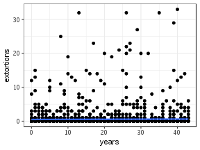


```r
# Quintiles

years_scatterplots +
    geom_point() +
    theme_bw() +
    facet_wrap(~ yearsquant, scales = "free_x") +
    geom_smooth(method = "lm")
```


```r
# For deciles

years_scatterplots +
    geom_point() +
    theme_bw() +
    facet_wrap(~ years_deciles, scales = "free_x") +
    geom_smooth(method = "lm")
```

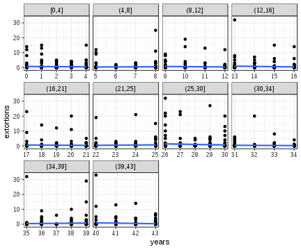

```r
# Excluding the all business line

years_scatterplots <- ggplot(subset(gg_ext_years, yearsquant != "All years"),
                             aes(x = years, y = extortions))

years_scatterplots +
    geom_point() +
    theme_bw() +
    geom_smooth(method = "lm", aes(colour = yearsquant))
```

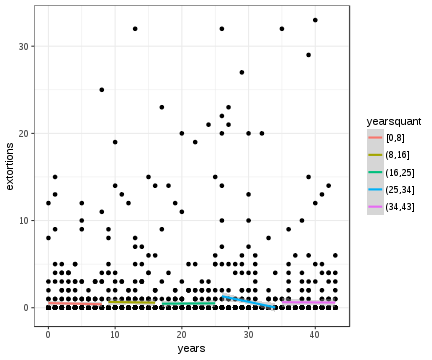

```r
## Only for victims

years_scatterplots <- ggplot(subset(gg_ext_years, yearsquant != "All years" &
                                        extortions > 0),
                             aes(x = years, y = extortions))

years_scatterplots +
    geom_point() +
    theme_bw() +
    geom_smooth(method = "lm", aes(colour = yearsquant), se = FALSE)
```

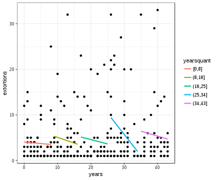

```r
years_scatterplots +
    geom_point() +
    theme_bw() +
    geom_smooth(method = "lm", aes(colour = yearsquant), se = FALSE) +
    scale_x_sqrt()
```

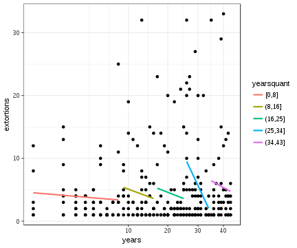

```r
# Only for victims with a grid

years_scatterplots <- ggplot(subset(gg_ext_years, extortions > 0),
                             aes(x = years, y = extortions))


# Quintiles

years_scatterplots +
    geom_point() +
    theme_bw() +
    facet_wrap(~ yearsquant, scales = "free_x") +
    geom_smooth(method = "lm")
```

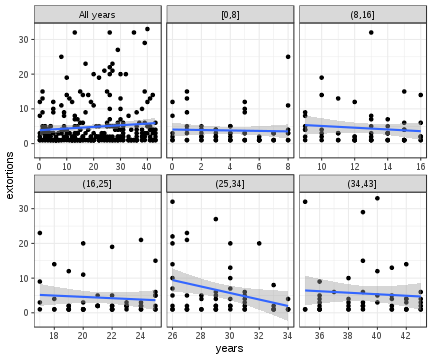

```r
# For deciles

years_scatterplots +
    geom_point() +
    theme_bw() +
    facet_wrap(~ years_deciles, scales = "free_x") +
    geom_smooth(method = "lm")
```

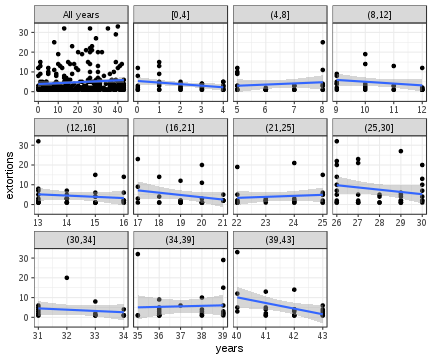

```r
## wrap grid victims not a victim
gg_ext_years$victim <- ifelse(gg_ext_years$extortions > 0, "yes", "no")

gg_ext_years$pop <- "All businesses"

subset(gg_ext_years, victim == "yes") -> gg_ext_years_tmp

gg_ext_years_tmp$pop <- "Victims"

rbind(gg_ext_years, gg_ext_years_tmp) -> gg_ext_years

select(gg_ext_years, - victim) -> gg_ext_years

years_scatterplots <- ggplot(gg_ext_years,
                             aes(x = years, y = extortions))

years_scatterplots +
    geom_point() +
    theme_bw() +
    facet_grid(pop ~ yearsquant, scales = "free_x") +
    geom_smooth(method = "lm")
```

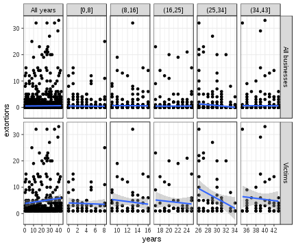

```r
years_scatterplots +
    geom_point() +
    theme_bw() +
    facet_grid(pop ~ years_deciles, scales = "free_x") +
    geom_smooth(method = "lm")
```

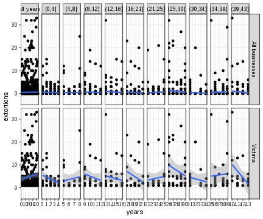

```r
years_scatterplots +
    geom_point() +
    theme_bw() +
    facet_grid(pop ~ . , scales = "free_x") +
    geom_smooth(method = "lm", aes(colour = yearsquant), se = FALSE)
```

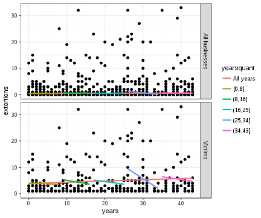

```r
years_scatterplots <- ggplot(subset(gg_ext_years, yearsquant != "All years"),
                             aes(x = years, y = extortions))

years_scatterplots +
    geom_point() +
    theme_bw() +
    facet_grid(pop ~ . , scales = "free_x") +
    geom_smooth(method = "lm", aes(colour = yearsquant), se = FALSE)
```

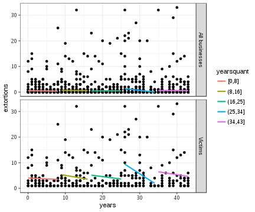

# State level

Provide a brief summary of state-level figures. Include:

- n business (n())
- n victims (extortion and bribery) (filter by, then n())
- n repeat victims (filter by)
- n incidents (sum(extortions))
- n repeat incidents (n incidents - n victims)
- Gini index per state (for all and for business) (lets see...)
- plot of lorenz curve per state (let see...)


```r
enve_final %>%
    group_by(CVE_ENT, NOM_ENT) %>%
    summarise(n = n(),
              incidents = sum(extortions)) -> state_incidents_df

enve_final %>%
    filter(extortion_victim == "yes") %>%
    group_by(NOM_ENT) %>%
    summarise(victims = n()) -> state_evics_df

enve_final %>%
    filter(bribe_victim == "yes") %>%
    group_by(NOM_ENT) %>%
    summarise(bribe_vics = n()) -> state_bvics_df

enve_final %>%
    filter(rep_extortion_victim == 1) %>%
    group_by(NOM_ENT) %>%
    summarise(rep_ext_vics = n()) -> state_rep_vics_df

state_incidents_df %>%
    full_join(state_evics_df) %>%
    full_join(state_rep_vics_df) %>%
    mutate(rep_inci = incidents - rep_ext_vics) %>%
    full_join(state_bvics_df) -> state_summary
```

```
Joining, by = "NOM_ENT"
Joining, by = "NOM_ENT"
Joining, by = "NOM_ENT"
```

```r
state_gini <- by(enve_final$extortions, enve_final$NOM_ENT, ineq::Gini)


state_gini_df <- data.frame(Gini = state_gini[1:32])

state_gini_victims <- by(enve_final$extortions[enve_final$extortions > 0],
                         enve_final$NOM_ENT[enve_final$extortions > 0],
                         ineq::Gini)

state_gini_df$Gini_vic <- data.frame(state_gini_victims[1:32])[,1]

state_gini_df$NOM_ENT <- as.factor(rownames(state_gini_df))

state_gini_tests <- by(enve_final$extortions, enve_final$NOM_ENT, mc_gini_test)

state_mc_gini_l <- lapply(state_gini_tests[1:32], function(x) x$mc_mean)

state_mc_gini_df <- data.frame(P.Gini= unlist(state_mc_gini_l))

rownames(state_mc_gini_df) <- names(state_mc_gini_l)

state_mc_gini_df$NOM_ENT <- as.factor(names(state_mc_gini_l))

state_mc_gini_hyp <- sapply(state_gini_tests[1:32],
                            function(x) if(x$mc_test == TRUE) "***"
                                        else "")

unlist(state_mc_gini_hyp) -> state_mc_gini_df$test

#### now mc gini test for victims

state_gini_vic_tests <- by(enve_final$extortions[enve_final$extortions > 0],
                         enve_final$NOM_ENT[enve_final$extortions > 0],
                         mc_gini_test)

state_mc_gini_vic_l <- lapply(state_gini_vic_tests[1:32], function(x) x$mc_mean)

state_mc_gini_df$P.Gini.vic <- data.frame(unlist(state_mc_gini_vic_l))[,1]

state_mc_gini_vic_hyp <- sapply(state_gini_vic_tests[1:32],
                            function(x) if(x$mc_test == TRUE) "***"
                                        else "")

unlist(state_mc_gini_vic_hyp) -> state_mc_gini_df$vic.test

state_summary %>%
    left_join(state_gini_df) %>%
    left_join(state_mc_gini_df) -> state_summary
```

```
Joining, by = "NOM_ENT"
Joining, by = "NOM_ENT"
```

```r
state_summary$Gini <- as.numeric(unname(state_summary$Gini))
state_summary$Gini_vic <- as.numeric(unname(state_summary$Gini_vic))

kable(state_summary, format = "pandoc", digits = 3)
```


 CVE_ENT  NOM_ENT                             n   incidents   victims   rep_ext_vics   rep_inci   bribe_vics    Gini   Gini_vic   P.Gini  test    P.Gini.vic  vic.test 
--------  --------------------------------  ---  ----------  --------  -------------  ---------  -----------  ------  ---------  -------  -----  -----------  ---------
       1  AGUASCALIENTES                     78          46        11              7         39           12   0.930      0.506    0.635  ***          0.252  ***      
       2  BAJA CALIFORNIA                    68          42        12              9         33            4   0.892      0.389    0.626  ***          0.275           
       3  BAJA CALIFORNIA SUR                71          42         6              3         39            5   0.971      0.659    0.635  ***          0.179  ***      
       4  CAMPECHE                           54          16         4              3         13            9   0.954      0.375    0.771  ***          0.217           
       5  COAHUILA DE ZARAGOZA               80          62         9              6         56            6   0.952      0.573    0.576  ***          0.190  ***      
       6  COLIMA                             68          44         6              4         40            9   0.965      0.598    0.615  ***          0.173  ***      
       7  CHIAPAS                            67          83        12              8         75            5   0.909      0.491    0.475  ***          0.195  ***      
       8  CHIHUAHUA                          78          51         6              3         48            8   0.967      0.565    0.611  ***          0.161  ***      
       9  DISTRITO FEDERAL                   82          31         9              6         25           10   0.926      0.330    0.727  ***          0.270           
      10  DURANGO                            70          37        13              6         31           11   0.906      0.495    0.659  ***          0.309  ***      
      11  GUANAJUATO                         93          47         9              7         40           10   0.947      0.454    0.670  ***          0.218  ***      
      12  GUERRERO                           77          32         6              3         29            4   0.962      0.510    0.708  ***          0.205  ***      
      13  HIDALGO                            98          46        12              8         38           12   0.945      0.547    0.686  ***          0.262  ***      
      14  JALISCO                            93          24         9              4         20           10   0.949      0.472    0.793  ***          0.304           
      15  MEXICO                             77          63        12              9         54            8   0.923      0.504    0.563  ***          0.225  ***      
      16  MICHOACAN DE OCAMPO                69          50         7              7         43            5   0.947      0.474    0.592  ***          0.181  ***      
      17  MORELOS                            70          31         8              5         26            7   0.941      0.488    0.696  ***          0.248  ***      
      18  NAYARIT                            79          38         7              4         34           10   0.961      0.556    0.678  ***          0.206  ***      
      19  NUEVO LEON                         82         105        15             11         94           10   0.927      0.599    0.468  ***          0.197  ***      
      20  OAXACA                             79           5         4              1          4           16   0.957      0.150       --                  --           
      21  PUEBLA                             80          64        11              9         55            8   0.927      0.472    0.567  ***          0.211  ***      
      22  QUERETARO                          79          28         8              7         21            5   0.928      0.286    0.739  ***          0.267           
      23  QUINTANA ROO                       67          15         8              4         11            3   0.915      0.292    0.816  ***          0.356           
      24  SAN LUIS POTOSI                    77          33         7              6         27           10   0.946      0.407    0.702  ***          0.222  ***      
      25  SINALOA                            72          77        12              8         69           11   0.911      0.469    0.506  ***          0.204  ***      
      26  SONORA                             77          52         9              4         48           16   0.960      0.654    0.606  ***          0.210  ***      
      27  TABASCO                            64          25         4              2         23            9   0.974      0.590    0.718  ***          0.171  ***      
      28  TAMAULIPAS                         72          35         9              5         30            8   0.940      0.521    0.676  ***          0.251  ***      
      29  TLAXCALA                           75          25        10              6         19            9   0.906      0.292    0.751  ***          0.321           
      30  VERACRUZ DE IGNACIO DE LA LLAVE    72          29         5              3         26           12   0.961      0.441    0.714  ***          0.189  ***      
      31  YUCATAN                            73          25        13              6         19            7   0.880      0.326    0.746  ***          0.369           
      32  ZACATECAS                          71          69        12              7         62            5   0.937      0.627    0.526  ***          0.213  ***      

```r
state_table <- by(enve_final$extortions, enve_final$NOM_ENT, victim_table)

lapply(seq_along(state_table), function(x)
    {
    cap <- names(state_table)[x]
    final <- kable(state_table[[x]], format = "pandoc", digits = 3,
                   caption = cap)
    return(final)
    }) -> state_dist_list

print_kables(state_dist_list)
```

```


Table: AGUASCALIENTES

 Events   Prevalence   Incidence   Repeats   Target_%   Victim_%   Incident_%
-------  -----------  ----------  --------  ---------  ---------  -----------
      0           67          --        --     85.897         --           --
      1            4           4        --      5.128     36.364        8.696
      2            2           4         2      2.564     18.182        8.696
      3            2           6         4      2.564     18.182       13.043
      8            1           8         7      1.282      9.091       17.391
      9            1           9         8      1.282      9.091       19.565
     15            1          15        14      1.282      9.091       32.609


Table: BAJA CALIFORNIA

 Events   Prevalence   Incidence   Repeats   Target_%   Victim_%   Incident_%
-------  -----------  ----------  --------  ---------  ---------  -----------
      0           56          --        --     82.353         --           --
      1            3           3        --      4.412     25.000        7.143
      2            3           6         3      4.412     25.000       14.286
      3            2           6         4      2.941     16.667       14.286
      5            1           5         4      1.471      8.333       11.905
      6            1           6         5      1.471      8.333       14.286
      7            1           7         6      1.471      8.333       16.667
      9            1           9         8      1.471      8.333       21.429


Table: BAJA CALIFORNIA SUR

 Events   Prevalence   Incidence   Repeats   Target_%   Victim_%   Incident_%
-------  -----------  ----------  --------  ---------  ---------  -----------
      0           65          --        --     91.549         --           --
      1            3           3        --      4.225     50.000        7.143
      3            1           3         2      1.408     16.667        7.143
      4            1           4         3      1.408     16.667        9.524
     32            1          32        31      1.408     16.667       76.190


Table: CAMPECHE

 Events   Prevalence   Incidence   Repeats   Target_%   Victim_%   Incident_%
-------  -----------  ----------  --------  ---------  ---------  -----------
      0           50          --        --     92.593         --           --
      1            1           1        --      1.852         25         6.25
      2            1           2         1      1.852         25        12.50
      5            1           5         4      1.852         25        31.25
      8            1           8         7      1.852         25        50.00


Table: CHIAPAS

 Events   Prevalence   Incidence   Repeats   Target_%   Victim_%   Incident_%
-------  -----------  ----------  --------  ---------  ---------  -----------
      0           55          --        --     82.090         --           --
      1            4           4        --      5.970     33.333        4.819
      2            2           4         2      2.985     16.667        4.819
      6            1           6         5      1.493      8.333        7.229
     11            2          22        20      2.985     16.667       26.506
     13            1          13        12      1.493      8.333       15.663
     15            1          15        14      1.493      8.333       18.072
     19            1          19        18      1.493      8.333       22.892


Table: CHIHUAHUA

 Events   Prevalence   Incidence   Repeats   Target_%   Victim_%   Incident_%
-------  -----------  ----------  --------  ---------  ---------  -----------
      0           72          --        --     92.308         --           --
      1            3           3        --      3.846     50.000        5.882
      4            1           4         3      1.282     16.667        7.843
     21            1          21        20      1.282     16.667       41.176
     23            1          23        22      1.282     16.667       45.098


Table: COAHUILA DE ZARAGOZA

 Events   Prevalence   Incidence   Repeats   Target_%   Victim_%   Incident_%
-------  -----------  ----------  --------  ---------  ---------  -----------
      0           71          --        --      88.75         --           --
      1            3           3        --       3.75     33.333        4.839
      2            2           4         2       2.50     22.222        6.452
      3            1           3         2       1.25     11.111        4.839
     10            1          10         9       1.25     11.111       16.129
     20            1          20        19       1.25     11.111       32.258
     22            1          22        21       1.25     11.111       35.484


Table: COLIMA

 Events   Prevalence   Incidence   Repeats   Target_%   Victim_%   Incident_%
-------  -----------  ----------  --------  ---------  ---------  -----------
      0           62          --        --     91.176         --           --
      1            2           2        --      2.941     33.333        4.545
      2            1           2         1      1.471     16.667        4.545
      3            1           3         2      1.471     16.667        6.818
     10            1          10         9      1.471     16.667       22.727
     27            1          27        26      1.471     16.667       61.364


Table: DISTRITO FEDERAL

 Events   Prevalence   Incidence   Repeats   Target_%   Victim_%   Incident_%
-------  -----------  ----------  --------  ---------  ---------  -----------
      0           73          --        --     89.024         --           --
      1            3           3        --      3.659     33.333        9.677
      3            2           6         4      2.439     22.222       19.355
      4            1           4         3      1.220     11.111       12.903
      6            3          18        15      3.659     33.333       58.065


Table: DURANGO

 Events   Prevalence   Incidence   Repeats   Target_%   Victim_%   Incident_%
-------  -----------  ----------  --------  ---------  ---------  -----------
      0           57          --        --     81.429         --           --
      1            7           7        --     10.000     53.846       18.919
      2            2           4         2      2.857     15.385       10.811
      3            1           3         2      1.429      7.692        8.108
      4            1           4         3      1.429      7.692       10.811
      5            1           5         4      1.429      7.692       13.514
     14            1          14        13      1.429      7.692       37.838


Table: GUANAJUATO

 Events   Prevalence   Incidence   Repeats   Target_%   Victim_%   Incident_%
-------  -----------  ----------  --------  ---------  ---------  -----------
      0           84          --        --     90.323         --           --
      1            2           2        --      2.151     22.222        4.255
      2            2           4         2      2.151     22.222        8.511
      4            1           4         3      1.075     11.111        8.511
      5            1           5         4      1.075     11.111       10.638
      6            1           6         5      1.075     11.111       12.766
     12            1          12        11      1.075     11.111       25.532
     14            1          14        13      1.075     11.111       29.787


Table: GUERRERO

 Events   Prevalence   Incidence   Repeats   Target_%   Victim_%   Incident_%
-------  -----------  ----------  --------  ---------  ---------  -----------
      0           71          --        --     92.208         --           --
      1            3           3        --      3.896     50.000        9.375
      5            1           5         4      1.299     16.667       15.625
      9            1           9         8      1.299     16.667       28.125
     15            1          15        14      1.299     16.667       46.875


Table: HIDALGO

 Events   Prevalence   Incidence   Repeats   Target_%   Victim_%   Incident_%
-------  -----------  ----------  --------  ---------  ---------  -----------
      0           86          --        --     87.755         --           --
      1            4           4        --      4.082     33.333        8.696
      2            4           8         4      4.082     33.333       17.391
      3            2           6         4      2.041     16.667       13.043
      5            1           5         4      1.020      8.333       10.870
     23            1          23        22      1.020      8.333       50.000


Table: JALISCO

 Events   Prevalence   Incidence   Repeats   Target_%   Victim_%   Incident_%
-------  -----------  ----------  --------  ---------  ---------  -----------
      0           84          --        --     90.323         --           --
      1            5           5        --      5.376     55.556       20.833
      2            2           4         2      2.151     22.222       16.667
      5            1           5         4      1.075     11.111       20.833
     10            1          10         9      1.075     11.111       41.667


Table: MEXICO

 Events   Prevalence   Incidence   Repeats   Target_%   Victim_%   Incident_%
-------  -----------  ----------  --------  ---------  ---------  -----------
      0           65          --        --     84.416         --           --
      1            3           3        --      3.896     25.000        4.762
      2            2           4         2      2.597     16.667        6.349
      3            1           3         2      1.299      8.333        4.762
      4            2           8         6      2.597     16.667       12.698
      5            1           5         4      1.299      8.333        7.937
      7            1           7         6      1.299      8.333       11.111
     13            1          13        12      1.299      8.333       20.635
     20            1          20        19      1.299      8.333       31.746


Table: MICHOACAN DE OCAMPO

 Events   Prevalence   Incidence   Repeats   Target_%   Victim_%   Incident_%
-------  -----------  ----------  --------  ---------  ---------  -----------
      0           62          --        --     89.855         --           --
      2            2           4        --      2.899     28.571            8
      4            3          12         9      4.348     42.857           24
      9            1           9         8      1.449     14.286           18
     25            1          25        24      1.449     14.286           50


Table: MORELOS

 Events   Prevalence   Incidence   Repeats   Target_%   Victim_%   Incident_%
-------  -----------  ----------  --------  ---------  ---------  -----------
      0           62          --        --     88.571         --           --
      1            3           3        --      4.286       37.5        9.677
      2            1           2         1      1.429       12.5        6.452
      3            1           3         2      1.429       12.5        9.677
      4            1           4         3      1.429       12.5       12.903
      5            1           5         4      1.429       12.5       16.129
     14            1          14        13      1.429       12.5       45.161


Table: NAYARIT

 Events   Prevalence   Incidence   Repeats   Target_%   Victim_%   Incident_%
-------  -----------  ----------  --------  ---------  ---------  -----------
      0           72          --        --     91.139         --           --
      1            3           3        --      3.797     42.857        7.895
      3            1           3         2      1.266     14.286        7.895
      4            1           4         3      1.266     14.286       10.526
      8            1           8         7      1.266     14.286       21.053
     20            1          20        19      1.266     14.286       52.632


Table: NUEVO LEON

 Events   Prevalence   Incidence   Repeats   Target_%   Victim_%   Incident_%
-------  -----------  ----------  --------  ---------  ---------  -----------
      0           67          --        --     81.707         --           --
      1            4           4        --      4.878     26.667        3.810
      2            1           2         1      1.220      6.667        1.905
      3            4          12         8      4.878     26.667       11.429
      4            2           8         6      2.439     13.333        7.619
      5            1           5         4      1.220      6.667        4.762
     10            1          10         9      1.220      6.667        9.524
     32            2          64        62      2.439     13.333       60.952


Table: OAXACA

 Events   Prevalence   Incidence   Repeats   Target_%   Victim_%   Incident_%
-------  -----------  ----------  --------  ---------  ---------  -----------
      0           75          --        --     94.937         --           --
      1            3           3        --      3.797         75           60
      2            1           2         1      1.266         25           40


Table: PUEBLA

 Events   Prevalence   Incidence   Repeats   Target_%   Victim_%   Incident_%
-------  -----------  ----------  --------  ---------  ---------  -----------
      0           69          --        --      86.25         --           --
      1            2           2        --       2.50     18.182        3.125
      2            2           4         2       2.50     18.182        6.250
      4            2           8         6       2.50     18.182       12.500
      5            2          10         8       2.50     18.182       15.625
      7            1           7         6       1.25      9.091       10.938
     12            1          12        11       1.25      9.091       18.750
     21            1          21        20       1.25      9.091       32.812


Table: QUERETARO

 Events   Prevalence   Incidence   Repeats   Target_%   Victim_%   Incident_%
-------  -----------  ----------  --------  ---------  ---------  -----------
      0           71          --        --     89.873         --           --
      1            1           1        --      1.266       12.5        3.571
      2            2           4         2      2.532       25.0       14.286
      3            1           3         2      1.266       12.5       10.714
      4            2           8         6      2.532       25.0       28.571
      5            1           5         4      1.266       12.5       17.857
      7            1           7         6      1.266       12.5       25.000


Table: QUINTANA ROO

 Events   Prevalence   Incidence   Repeats   Target_%   Victim_%   Incident_%
-------  -----------  ----------  --------  ---------  ---------  -----------
      0           59          --        --     88.060         --           --
      1            4           4        --      5.970       50.0       26.667
      2            2           4         2      2.985       25.0       26.667
      3            1           3         2      1.493       12.5       20.000
      4            1           4         3      1.493       12.5       26.667


Table: SAN LUIS POTOSI

 Events   Prevalence   Incidence   Repeats   Target_%   Victim_%   Incident_%
-------  -----------  ----------  --------  ---------  ---------  -----------
      0           70          --        --     90.909         --           --
      1            1           1        --      1.299     14.286        3.030
      2            2           4         2      2.597     28.571       12.121
      4            1           4         3      1.299     14.286       12.121
      5            1           5         4      1.299     14.286       15.152
      6            1           6         5      1.299     14.286       18.182
     13            1          13        12      1.299     14.286       39.394


Table: SINALOA

 Events   Prevalence   Incidence   Repeats   Target_%   Victim_%   Incident_%
-------  -----------  ----------  --------  ---------  ---------  -----------
      0           60          --        --     83.333         --           --
      1            4           4        --      5.556     33.333        5.195
      3            2           6         4      2.778     16.667        7.792
      4            1           4         3      1.389      8.333        5.195
      8            1           8         7      1.389      8.333       10.390
     12            1          12        11      1.389      8.333       15.584
     14            2          28        26      2.778     16.667       36.364
     15            1          15        14      1.389      8.333       19.481


Table: SONORA

 Events   Prevalence   Incidence   Repeats   Target_%   Victim_%   Incident_%
-------  -----------  ----------  --------  ---------  ---------  -----------
      0           68          --        --     88.312         --           --
      1            5           5        --      6.494     55.556        9.615
      3            1           3         2      1.299     11.111        5.769
      5            1           5         4      1.299     11.111        9.615
      6            1           6         5      1.299     11.111       11.538
     33            1          33        32      1.299     11.111       63.462


Table: TABASCO

 Events   Prevalence   Incidence   Repeats   Target_%   Victim_%   Incident_%
-------  -----------  ----------  --------  ---------  ---------  -----------
      0           60          --        --     93.750         --           --
      1            2           2        --      3.125         50            8
      3            1           3         2      1.562         25           12
     20            1          20        19      1.562         25           80


Table: TAMAULIPAS

 Events   Prevalence   Incidence   Repeats   Target_%   Victim_%   Incident_%
-------  -----------  ----------  --------  ---------  ---------  -----------
      0           63          --        --     87.500         --           --
      1            4           4        --      5.556     44.444       11.429
      2            2           4         2      2.778     22.222       11.429
      3            1           3         2      1.389     11.111        8.571
     12            2          24        22      2.778     22.222       68.571


Table: TLAXCALA

 Events   Prevalence   Incidence   Repeats   Target_%   Victim_%   Incident_%
-------  -----------  ----------  --------  ---------  ---------  -----------
      0           65          --        --     86.667         --           --
      1            4           4        --      5.333         40           16
      3            4          12         8      5.333         40           48
      4            1           4         3      1.333         10           16
      5            1           5         4      1.333         10           20


Table: VERACRUZ DE IGNACIO DE LA LLAVE

 Events   Prevalence   Incidence   Repeats   Target_%   Victim_%   Incident_%
-------  -----------  ----------  --------  ---------  ---------  -----------
      0           67          --        --     93.056         --           --
      1            2           2        --      2.778         40        6.897
      5            1           5         4      1.389         20       17.241
      9            1           9         8      1.389         20       31.034
     13            1          13        12      1.389         20       44.828


Table: YUCATAN

 Events   Prevalence   Incidence   Repeats   Target_%   Victim_%   Incident_%
-------  -----------  ----------  --------  ---------  ---------  -----------
      0           60          --        --     82.192         --           --
      1            7           7        --      9.589     53.846           28
      2            3           6         3      4.110     23.077           24
      3            1           3         2      1.370      7.692           12
      4            1           4         3      1.370      7.692           16
      5            1           5         4      1.370      7.692           20


Table: ZACATECAS

 Events   Prevalence   Incidence   Repeats   Target_%   Victim_%   Incident_%
-------  -----------  ----------  --------  ---------  ---------  -----------
      0           59          --        --     83.099         --           --
      1            5           5        --      7.042     41.667        7.246
      2            2           4         2      2.817     16.667        5.797
      3            1           3         2      1.408      8.333        4.348
      4            1           4         3      1.408      8.333        5.797
      5            1           5         4      1.408      8.333        7.246
     19            1          19        18      1.408      8.333       27.536
     29            1          29        28      1.408      8.333       42.029
```

```r
victim_lorenz("extortions", data = enve_final, family = "poisson",
              reps = 500, by_var = "NOM_ABR")
```


Compare the bribe variable from the `area_level` data set with the one from this state summary above


```r
bribe_mean <- mean(state_summary$bribe_vics)

state_summary %>%
    left_join(area_level) %>%
    dplyr::select(bribe_vics, log_bribe_vic) %>%
    mutate(log_bribe_vic2 = log(bribe_vics) - log(bribe_mean),
           dif = log_bribe_vic2 - log_bribe_vic) -> bribe_test
```

```
Joining, by = c("CVE_ENT", "NOM_ENT")
```

```
Adding missing grouping variables: `CVE_ENT`
```

```r
bribe_test$test <- round(bribe_test$dif, 2) == 0

kable(bribe_test, format = "pandoc")
```


 CVE_ENT   bribe_vics   log_bribe_vic   log_bribe_vic2          dif  test  
--------  -----------  --------------  ---------------  -----------  ------
       1           12      -0.1954920        0.3375144    0.5330065  FALSE 
       2            4      -0.1656391       -0.7610978   -0.5954588  FALSE 
       3            5      -0.1954920       -0.5379543   -0.3424623  FALSE 
       4            9      -0.0544134        0.0498324    0.1042458  FALSE 
       5            6      -0.5565054       -0.3556327    0.2008726  FALSE 
       6            9      -1.0529423        0.0498324    1.1027746  FALSE 
       7            5       0.3855379       -0.5379543   -0.9234922  FALSE 
       8            8      -0.2580124       -0.0679507    0.1900617  FALSE 
       9           10      -0.2262637        0.1551929    0.3814566  FALSE 
      10           11      -0.7475606        0.2505031    0.9980637  FALSE 
      11           10      -0.3961627        0.1551929    0.5513556  FALSE 
      12            4       0.4976552       -0.7610978   -1.2587530  FALSE 
      13           12      -0.4339030        0.3375144    0.7714175  FALSE 
      14           10      -0.1084806        0.1551929    0.2636735  FALSE 
      15            8       0.2782923       -0.0679507   -0.3462430  FALSE 
      16            5       0.0215725       -0.5379543   -0.5595268  FALSE 
      17            7       0.4188743       -0.2014821   -0.6203563  FALSE 
      18           10      -0.1954920        0.1551929    0.3506849  FALSE 
      19           10      -0.2580124        0.1551929    0.4132053  FALSE 
      20           16       0.3855379        0.6251965    0.2396587  FALSE 
      21            8       0.3510517       -0.0679507   -0.4190023  FALSE 
      22            5      -0.6009571       -0.5379543    0.0630028  FALSE 
      23            3       0.3684434       -1.0487799   -1.4172233  FALSE 
      24           10      -0.7475606        0.1551929    0.9027535  FALSE 
      25           11      -0.1656391        0.2505031    0.4161421  FALSE 
      26           16      -0.6962673        0.6251965    1.3214638  FALSE 
      27            9      -0.3597951        0.0498324    0.4096274  FALSE 
      28            8       0.9231209       -0.0679507   -0.9910716  FALSE 
      29            9       0.4668835        0.0498324   -0.4170511  FALSE 
      30           12       0.1792014        0.3375144    0.1583130  FALSE 
      31            7       0.0921901       -0.2014821   -0.2936721  FALSE 
      32            5      -0.0031201       -0.5379543   -0.5348342  FALSE 

# Models

There are two important changes to this modelling exercise. First, I am testing the influence of new state level variables that had not been previosly considered, as well as see if using years_deciles provides a better variable that yearsquant. Second, I will model extortion via two part models, using zero-inflated negative binomial and hurdle models. As the multilevel ZINB can only calculate a fixed zero-inflation factor (i.e. it is not poissbile to specify a separate equation for the zero-inflation part), I will focus on the hurdle models instead, testing hypotheses using these models.

## Model data frame

To avoid any problems with NA values that may lead to non-convergence, work with a data set onf only the relevant variables.


```r
enve_final %>%
    dplyr::select(extortions,
           bribes,
           yearsquant,
           years_deciles,
           subsector,
           size,
           log_deaths,
           log_bribe_vic,
           log_drug_crim,
           log_wpn_crim,
           law_index,
           comp_index,
           log_pop,
           log_nbus,
           state = NOM_ABR) -> enve_model

#### JUST FOR THIS TESTING EXERCISE, ADD MORE VICTIMS TO THE OTHER AND MEDIA CATEGORY

##### Comment out before sending #####

enve_model$extortions[which(enve_model$subsector == "Other")] <- rpois(10,1)


enve_model$extortions[which(enve_model$subsector == "Media")] <- rpois(45, 0.5)

##### Comment out before sending #####

##### Return to normal


enve_model$extortion_victim <- ifelse(enve_model$extortions == 0, 0, 1)

summary(enve_model)
```

```
   extortions          bribes          yearsquant  years_deciles
 Min.   : 0.0000   Min.   : 0.0000   [0,8]  :539   [0,4]  :293  
 1st Qu.: 0.0000   1st Qu.: 0.0000   (8,16] :433   (25,30]:289  
 Median : 0.0000   Median : 0.0000   (16,25]:487   (16,21]:279  
 Mean   : 0.5651   Mean   : 0.2786   (25,34]:510   (4,8]  :246  
 3rd Qu.: 0.0000   3rd Qu.: 0.0000   (34,43]:443   (34,39]:241  
 Max.   :33.0000   Max.   :13.0000                 (30,34]:221  
                                                   (Other):843  
         subsector       size       log_deaths       log_bribe_vic    
 Manufacturing:484   Large :568   Min.   :-2.72796   Min.   :-1.0529  
 Health       :391   Medium:611   1st Qu.:-1.19062   1st Qu.:-0.3962  
 HotelsRestBar:367   Small :597   Median :-0.09826   Median :-0.1656  
 Construction :356   Micro :636   Mean   :-0.49289   Mean   :-0.1035  
 Maintenance  :206                3rd Qu.: 0.16603   3rd Qu.: 0.2783  
 Transport    :135                Max.   : 1.53441   Max.   : 0.9231  
 (Other)      :473                                                    
 log_drug_crim      log_wpn_crim       law_index        
 Min.   :-2.6561   Min.   :-2.8933   Min.   :-33.02134  
 1st Qu.:-1.5849   1st Qu.:-0.8466   1st Qu.: -4.29495  
 Median :-1.0359   Median :-0.2070   Median :  1.13880  
 Mean   :-0.6757   Mean   :-0.3723   Mean   : -0.00842  
 3rd Qu.: 0.1148   3rd Qu.: 0.4458   3rd Qu.:  7.76001  
 Max.   : 1.9593   Max.   : 1.0703   Max.   : 24.00707  
                                                        
   comp_index          log_pop           log_nbus            state     
 Min.   :-22.4096   Min.   :-1.6674   Min.   :-0.50020   HGO.   :  98  
 1st Qu.: -5.1176   1st Qu.:-0.7611   1st Qu.:-0.19996   GTO.   :  93  
 Median :  1.3520   Median :-0.2470   Median :-0.04958   JAL.   :  93  
 Mean   :  0.1609   Mean   :-0.2404   Mean   :-0.03879   DF     :  82  
 3rd Qu.:  5.0020   3rd Qu.: 0.2893   3rd Qu.: 0.08738   NL     :  82  
 Max.   : 20.1805   Max.   : 1.4868   Max.   : 0.63217   COAH.  :  80  
                                                         (Other):1884  
 extortion_victim
 Min.   :0.0000  
 1st Qu.:0.0000  
 Median :0.0000  
 Mean   :0.1281  
 3rd Qu.:0.0000  
 Max.   :1.0000  
                 
```

```r
summary(factor(enve_model$extortion_victim))
```

```
   0    1 
2103  309 
```

```r
summary(factor(enve_final$extortion_victim))
```

```
  no  yes   dk 
2079  285   48 
```

```r
length(enve_model[is.na(enve_model)])
```

```
[1] 0
```


## Negative binomial

I will not test every single model as before, as we have done this before. Thus I will start with the "best model" from previous exercises, changing the state homicide rate for the log deaths and log pop variables instead. To minimise any syntax mistakes, I will work with formula objects and update them as I proceed.


```r
model_failsafe <- function(formula, data, family, multilevel = TRUE, ...)
{
    model <- tryCatch(glmmADMB::glmmadmb(formula = formula,
                                data = data,
                                family = family,
                                zeroInflation = FALSE, 
                                ...,
                                admb.opts = glmmADMB::admbControl(noinit = FALSE, shess=FALSE),
                                extra.args = "-ndi 60000"), 
                      error = function(e)
                          {
                          print("glmmADMB failed")
                          print(e)
                          e
                          })
    
    #tc <- tryCatch(summary(model), error = function(e) e)
    
    if(is(model, "error"))
    {
        print("glmmADMB failed, trying fit with other packages")
        if(isTRUE(multilevel))
        {
            if(family != "nbinom")
            {
                model <- tryCatch(lme4::glmer(formula = formula,
                                     data = data,
                                     family = family),
                                  error = function(e) e)
            }
            if(family == "nbinom")
            {
                model <- tryCatch(lme4::glmer.nb(formula = formula,
                                     data = data),
                                  error = function(e) e)
            }
        }
        else
        {
          if(family != "nbinom")
            {
                model <- tryCatch(glm(formula = formula,
                                     data = data,
                                     family = family),
                                  error = function(e) e)
            }
            if(family == "nbinom")
            {
                model <- tryCatch(MASS::glm.nb(formula = formula,
                                     data = data),
                                  error = function(e) e)
            }  
        }
        
        if(is(model, "error"))
        {
            print(model)
            print("Second attempt also failed")
        }
    }
    else {print("The model was fitted correctly with glmmadmb")}
    
    return(model)
}
```


```r
count_formula <- as.formula("extortions ~
                            bribes +
                            yearsquant +
                            subsector +
                            size +
                            (1 | state)")
```


```r
admbControl <- glmmADMB::admbControl

mnb1 <- model_failsafe(formula = count_formula, 
                       data = enve_model, 
                       family = "nbinom")
```

```
[1] "The model was fitted correctly with glmmadmb"
```

```r
summary(mnb1)
```

```

Call:
glmmADMB::glmmadmb(formula = formula, data = data, family = family, 
    zeroInflation = FALSE, admb.opts = glmmADMB::admbControl(noinit = FALSE, 
        shess = FALSE), extra.args = "-ndi 60000")

AIC: 3247.6 

Coefficients:
                        Estimate Std. Error z value Pr(>|z|)  
(Intercept)             -0.11179    0.53345   -0.21    0.834  
bribes                  -0.01377    0.09581   -0.14    0.886  
yearsquant(8,16]         0.16350    0.29371    0.56    0.578  
yearsquant(16,25]       -0.08372    0.27883   -0.30    0.764  
yearsquant(25,34]        0.42869    0.28252    1.52    0.129  
yearsquant(34,43]        0.20496    0.29258    0.70    0.484  
subsectorMining         -1.48225    0.96736   -1.53    0.125  
subsectorConstruction   -0.00567    0.53084   -0.01    0.991  
subsectorManufacturing  -0.26658    0.51538   -0.52    0.605  
subsectorWholesale      -0.62517    0.63926   -0.98    0.328  
subsectorTransport      -0.60033    0.60463   -0.99    0.321  
subsectorMedia          -0.35722    0.80355   -0.44    0.657  
subsectorFinance         0.00677    0.85954    0.01    0.994  
subsectorReal estate    -1.34664    0.86635   -1.55    0.120  
subsectorProf. services  1.07374    0.82594    1.30    0.194  
subsectorMaintenance    -0.65263    0.57175   -1.14    0.254  
subsectorEducation       0.02686    0.84630    0.03    0.975  
subsectorHealth         -0.53433    0.52972   -1.01    0.313  
subsectorLeisure         0.25185    0.81771    0.31    0.758  
subsectorHotelsRestBar  -0.42696    0.53081   -0.80    0.421  
subsectorOther           0.56954    1.40450    0.41    0.685  
sizeMedium              -0.24830    0.25851   -0.96    0.337  
sizeSmall               -0.49626    0.26067   -1.90    0.057 .
sizeMicro               -0.60290    0.25864   -2.33    0.020 *
---
Signif. codes:  0 '***' 0.001 '**' 0.01 '*' 0.05 '.' 0.1 ' ' 1

Number of observations: total=2412, state=32 
Random effect variance(s):
```

```
Warning in .local(x, sigma, ...): 'sigma' and 'rdig' arguments are present
for compatibility only: ignored
```

```
Group=state
             Variance    StdDev
(Intercept) 2.556e-09 5.056e-05

Negative binomial dispersion parameter: 0.060859 (std. err.: 0.0045385)

Log-likelihood: -1597.8 
```

```r
confint(mnb1)
```

```
                             2.5 %      97.5 %
(Intercept)             -1.1573369  0.93374866
bribes                  -0.2015605  0.17401954
yearsquant(8,16]        -0.4121612  0.73916080
yearsquant(16,25]       -0.6302131  0.46278045
yearsquant(25,34]       -0.1250433  0.98241471
yearsquant(34,43]       -0.3684910  0.77840152
subsectorMining         -3.3782433  0.41373818
subsectorConstruction   -1.0460959  1.03475862
subsectorManufacturing  -1.2767080  0.74354444
subsectorWholesale      -1.8780984  0.62775475
subsectorTransport      -1.7853832  0.58472287
subsectorMedia          -1.9321474  1.21771076
subsectorFinance        -1.6778990  1.69143589
subsectorReal estate    -3.0446508  0.35137883
subsectorProf. services -0.5450766  2.69254869
subsectorMaintenance    -1.7732345  0.46798435
subsectorEducation      -1.6318543  1.68558072
subsectorHealth         -1.5725671  0.50389713
subsectorLeisure        -1.3508345  1.85452981
subsectorHotelsRestBar  -1.4673295  0.61340743
subsectorOther          -2.1832274  3.32231143
sizeMedium              -0.7549686  0.25837196
sizeSmall               -1.0071681  0.01463951
sizeMicro               -1.1098204 -0.09597025
```

```r
get_glmmadmb(mnb1)
```

```
$model
extortions ~ bribes + yearsquant + subsector + size + (1 | state)

$logLik
[1] -1597.8

$df
[1] 26

$AIC
[1] 3247.6

$BIC
[1] 3398.094

$alpha
[1] 16.43142

$var_j
[1] 6.534158e-18

$ICC
[1] 3.976623e-19
```

```r
# vs Poisson

mp1 <- model_failsafe(count_formula, 
                      data = enve_model, 
                      family = "poisson")
```

```
Warning: running command './glmmadmb -maxfn 500 -maxph 5 -ndi 60000' had
status 1
```

```
Parameters were estimated, but standard errors were not: the most likely problem is that the curvature at MLE was zero or negative
```

```
[1] "glmmADMB failed"
<simpleError in glmmADMB::glmmadmb(formula = formula, data = data, family = family,     zeroInflation = FALSE, ..., admb.opts = glmmADMB::admbControl(noinit = FALSE,         shess = FALSE), extra.args = "-ndi 60000"): The function maximizer failed (couldn't find parameter file) Troubleshooting steps include (1) run with 'save.dir' set and inspect output files; (2) change run parameters: see '?admbControl';(3) re-run with debug=TRUE for more information on failure mode>
[1] "glmmADMB failed, trying fit with other packages"
```

```r
summary(mp1)
```

```
Generalized linear mixed model fit by maximum likelihood (Laplace
  Approximation) [glmerMod]
 Family: poisson  ( log )
Formula: extortions ~ bribes + yearsquant + subsector + size + (1 | state)
   Data: data

     AIC      BIC   logLik deviance df.resid 
  7661.5   7806.2  -3805.7   7611.5     2387 

Scaled residuals: 
   Min     1Q Median     3Q    Max 
-1.961 -0.794 -0.646 -0.507 44.456 

Random effects:
 Groups Name        Variance Std.Dev.
 state  (Intercept) 0.1995   0.4466  
Number of obs: 2412, groups:  state, 32

Fixed effects:
                          Estimate Std. Error z value Pr(>|z|)    
(Intercept)             -0.2102267  0.1711808  -1.228 0.219410    
bribes                  -0.0009773  0.0266726  -0.037 0.970773    
yearsquant(8,16]         0.1170980  0.0903041   1.297 0.194732    
yearsquant(16,25]       -0.0509078  0.0905031  -0.562 0.573777    
yearsquant(25,34]        0.3552506  0.0830566   4.277 1.89e-05 ***
yearsquant(34,43]        0.2172428  0.0881474   2.465 0.013719 *  
subsectorMining         -1.1174080  0.3776416  -2.959 0.003087 ** 
subsectorConstruction   -0.0030313  0.1466465  -0.021 0.983508    
subsectorManufacturing  -0.2037424  0.1448119  -1.407 0.159444    
subsectorWholesale      -0.6543882  0.2028782  -3.226 0.001257 ** 
subsectorTransport      -0.4942931  0.1845200  -2.679 0.007389 ** 
subsectorMedia          -0.3329774  0.2477229  -1.344 0.178899    
subsectorFinance         0.0864081  0.2338762   0.369 0.711784    
subsectorReal estate    -0.9634974  0.3297765  -2.922 0.003482 ** 
subsectorProf. services  1.1399394  0.1752675   6.504 7.82e-11 ***
subsectorMaintenance    -0.5813342  0.1727114  -3.366 0.000763 ***
subsectorEducation       0.0263156  0.2283910   0.115 0.908269    
subsectorHealth         -0.5022281  0.1525461  -3.292 0.000994 ***
subsectorLeisure         0.6695938  0.1947909   3.438 0.000587 ***
subsectorHotelsRestBar  -0.3023392  0.1501638  -2.013 0.044073 *  
subsectorOther           0.5147985  0.3311838   1.554 0.120084    
sizeMedium              -0.3810538  0.0724992  -5.256 1.47e-07 ***
sizeSmall               -0.5054360  0.0760607  -6.645 3.03e-11 ***
sizeMicro               -0.6462428  0.0766150  -8.435  < 2e-16 ***
---
Signif. codes:  0 '***' 0.001 '**' 0.01 '*' 0.05 '.' 0.1 ' ' 1
```

```

Correlation matrix not shown by default, as p = 24 > 12.
Use print(x, correlation=TRUE)  or
	 vcov(x)	 if you need it
```

```r
confint(mp1)
```

```
Computing profile confidence intervals ...
```

```
Error in UseMethod("family"): no applicable method for 'family' applied to an object of class "NULL"
```

```r
get_glmmadmb(mp1)
```

```
Error in get_glmmadmb(mp1): mp1 is not a glmmadmb object.
```

```r
screenreg(list(mnb1, mp1), single.row = TRUE,
          custom.model.names = c("negbin", "poisson"))
```

```

===============================================================
                         negbin             poisson            
---------------------------------------------------------------
(Intercept)                 -0.11 (0.53)       -0.21 (0.17)    
bribes                      -0.01 (0.10)       -0.00 (0.03)    
yearsquant(8,16]             0.16 (0.29)        0.12 (0.09)    
yearsquant(16,25]           -0.08 (0.28)       -0.05 (0.09)    
yearsquant(25,34]            0.43 (0.28)        0.36 (0.08) ***
yearsquant(34,43]            0.20 (0.29)        0.22 (0.09) *  
subsectorMining             -1.48 (0.97)       -1.12 (0.38) ** 
subsectorConstruction       -0.01 (0.53)       -0.00 (0.15)    
subsectorManufacturing      -0.27 (0.52)       -0.20 (0.14)    
subsectorWholesale          -0.63 (0.64)       -0.65 (0.20) ** 
subsectorTransport          -0.60 (0.60)       -0.49 (0.18) ** 
subsectorMedia              -0.36 (0.80)       -0.33 (0.25)    
subsectorFinance             0.01 (0.86)        0.09 (0.23)    
subsectorReal estate        -1.35 (0.87)       -0.96 (0.33) ** 
subsectorProf. services      1.07 (0.83)        1.14 (0.18) ***
subsectorMaintenance        -0.65 (0.57)       -0.58 (0.17) ***
subsectorEducation           0.03 (0.85)        0.03 (0.23)    
subsectorHealth             -0.53 (0.53)       -0.50 (0.15) ***
subsectorLeisure             0.25 (0.82)        0.67 (0.19) ***
subsectorHotelsRestBar      -0.43 (0.53)       -0.30 (0.15) *  
subsectorOther               0.57 (1.40)        0.51 (0.33)    
sizeMedium                  -0.25 (0.26)       -0.38 (0.07) ***
sizeSmall                   -0.50 (0.26)       -0.51 (0.08) ***
sizeMicro                   -0.60 (0.26) *     -0.65 (0.08) ***
---------------------------------------------------------------
Variance: state              0.00                              
Dispersion: parameter        0.06                              
Dispersion: SD               0.00                              
AIC                       3247.60            7661.50           
BIC                       3398.09            7806.20           
Log Likelihood           -1597.80           -3805.75           
Num. obs.                 2412               2412              
Num. groups: state          32                 32              
Var: state (Intercept)                          0.20           
===============================================================
*** p < 0.001, ** p < 0.01, * p < 0.05
```

```r
lrtest(mp1, mnb1)
```

```
Warning in modelUpdate(objects[[i - 1]], objects[[i]]): original model was
of class "glmerMod", updated model is of class "glmmadmb"
```

```
Likelihood ratio test

Model 1: extortions ~ bribes + yearsquant + subsector + size + (1 | state)
Model 2: extortions ~ bribes + yearsquant + subsector + size + (1 | state)
  #Df  LogLik Df  Chisq Pr(>Chisq)    
1  25 -3805.7                         
2  26 -1597.8  1 4415.9  < 2.2e-16 ***
---
Signif. codes:  0 '***' 0.001 '**' 0.01 '*' 0.05 '.' 0.1 ' ' 1
```

```r
# vs single level nb

nb1_formula <- update(count_formula, . ~ . - (1 | state))

nb1 <- model_failsafe(nb1_formula,
                      data = enve_model,
                      family = "nbinom", multilevel = FALSE)
```

```
[1] "The model was fitted correctly with glmmadmb"
```

```r
summary(nb1)
```

```

Call:
glmmADMB::glmmadmb(formula = formula, data = data, family = family, 
    zeroInflation = FALSE, admb.opts = glmmADMB::admbControl(noinit = FALSE, 
        shess = FALSE), extra.args = "-ndi 60000")

AIC: 3245.6 

Coefficients:
                        Estimate Std. Error z value Pr(>|z|)  
(Intercept)             -0.11181    0.53345   -0.21    0.834  
bribes                  -0.01377    0.09581   -0.14    0.886  
yearsquant(8,16]         0.16349    0.29371    0.56    0.578  
yearsquant(16,25]       -0.08371    0.27883   -0.30    0.764  
yearsquant(25,34]        0.42869    0.28252    1.52    0.129  
yearsquant(34,43]        0.20496    0.29258    0.70    0.484  
subsectorMining         -1.48223    0.96736   -1.53    0.125  
subsectorConstruction   -0.00565    0.53084   -0.01    0.992  
subsectorManufacturing  -0.26657    0.51538   -0.52    0.605  
subsectorWholesale      -0.62516    0.63925   -0.98    0.328  
subsectorTransport      -0.60032    0.60463   -0.99    0.321  
subsectorMedia          -0.35720    0.80355   -0.44    0.657  
subsectorFinance         0.00675    0.85953    0.01    0.994  
subsectorReal estate    -1.34664    0.86635   -1.55    0.120  
subsectorProf. services  1.07374    0.82594    1.30    0.194  
subsectorMaintenance    -0.65261    0.57174   -1.14    0.254  
subsectorEducation       0.02686    0.84629    0.03    0.975  
subsectorHealth         -0.53432    0.52972   -1.01    0.313  
subsectorLeisure         0.25186    0.81771    0.31    0.758  
subsectorHotelsRestBar  -0.42695    0.53081   -0.80    0.421  
subsectorOther           0.56956    1.40450    0.41    0.685  
sizeMedium              -0.24829    0.25851   -0.96    0.337  
sizeSmall               -0.49627    0.26067   -1.90    0.057 .
sizeMicro               -0.60289    0.25864   -2.33    0.020 *
---
Signif. codes:  0 '***' 0.001 '**' 0.01 '*' 0.05 '.' 0.1 ' ' 1

Number of observations: total=2412
Negative binomial dispersion parameter: 0.060775 (std. err.: 0.0045312)

Log-likelihood: -1597.8 
```

```r
confint(nb1)
```

```
                             2.5 %      97.5 %
(Intercept)             -1.1573523  0.93373326
bribes                  -0.2015581  0.17402588
yearsquant(8,16]        -0.4121672  0.73915482
yearsquant(16,25]       -0.6302081  0.46278543
yearsquant(25,34]       -0.1250413  0.98241680
yearsquant(34,43]       -0.3684906  0.77840190
subsectorMining         -3.3782244  0.41375714
subsectorConstruction   -1.0460784  1.03477616
subsectorManufacturing  -1.2766965  0.74355602
subsectorWholesale      -1.8780659  0.62774802
subsectorTransport      -1.7853742  0.58473188
subsectorMedia          -1.9321256  1.21773251
subsectorFinance        -1.6779015  1.69139417
subsectorReal estate    -3.0446516  0.35137802
subsectorProf. services -0.5450686  2.69255668
subsectorMaintenance    -1.7732032  0.46797640
subsectorEducation      -1.6318337  1.68556218
subsectorHealth         -1.5725511  0.50391312
subsectorLeisure        -1.3508214  1.85454287
subsectorHotelsRestBar  -1.4673179  0.61341909
subsectorOther          -2.1832141  3.32232474
sizeMedium              -0.7549604  0.25838019
sizeSmall               -1.0071728  0.01463481
sizeMicro               -1.1098191 -0.09596894
```

```r
get_glmmadmb(nb1)
```

```
$model
extortions ~ bribes + yearsquant + subsector + size

$logLik
[1] -1597.8

$df
[1] 25

$AIC
[1] 3245.6

$BIC
[1] 3390.305

$alpha
[1] 16.45413
```

```r
screenreg(list(mnb1, nb1), single.row = TRUE,
          custom.model.names = c("multilevel nb", "single level nb"))
```

```

=============================================================
                         multilevel nb      single level nb  
-------------------------------------------------------------
(Intercept)                 -0.11 (0.53)       -0.11 (0.53)  
bribes                      -0.01 (0.10)       -0.01 (0.10)  
yearsquant(8,16]             0.16 (0.29)        0.16 (0.29)  
yearsquant(16,25]           -0.08 (0.28)       -0.08 (0.28)  
yearsquant(25,34]            0.43 (0.28)        0.43 (0.28)  
yearsquant(34,43]            0.20 (0.29)        0.20 (0.29)  
subsectorMining             -1.48 (0.97)       -1.48 (0.97)  
subsectorConstruction       -0.01 (0.53)       -0.01 (0.53)  
subsectorManufacturing      -0.27 (0.52)       -0.27 (0.52)  
subsectorWholesale          -0.63 (0.64)       -0.63 (0.64)  
subsectorTransport          -0.60 (0.60)       -0.60 (0.60)  
subsectorMedia              -0.36 (0.80)       -0.36 (0.80)  
subsectorFinance             0.01 (0.86)        0.01 (0.86)  
subsectorReal estate        -1.35 (0.87)       -1.35 (0.87)  
subsectorProf. services      1.07 (0.83)        1.07 (0.83)  
subsectorMaintenance        -0.65 (0.57)       -0.65 (0.57)  
subsectorEducation           0.03 (0.85)        0.03 (0.85)  
subsectorHealth             -0.53 (0.53)       -0.53 (0.53)  
subsectorLeisure             0.25 (0.82)        0.25 (0.82)  
subsectorHotelsRestBar      -0.43 (0.53)       -0.43 (0.53)  
subsectorOther               0.57 (1.40)        0.57 (1.40)  
sizeMedium                  -0.25 (0.26)       -0.25 (0.26)  
sizeSmall                   -0.50 (0.26)       -0.50 (0.26)  
sizeMicro                   -0.60 (0.26) *     -0.60 (0.26) *
-------------------------------------------------------------
Variance: state              0.00                            
Dispersion: parameter        0.06               0.06         
Dispersion: SD               0.00               0.00         
AIC                       3247.60            3245.60         
BIC                       3398.09            3390.31         
Log Likelihood           -1597.80           -1597.80         
Num. obs.                 2412               2412            
Num. groups: state          32                               
Num. groups:                                    1            
=============================================================
*** p < 0.001, ** p < 0.01, * p < 0.05
```

```r
lrtest(nb1, mnb1)
```

```
Likelihood ratio test

Model 1: extortions ~ bribes + yearsquant + subsector + size
Model 2: extortions ~ bribes + yearsquant + subsector + size + (1 | state)
  #Df  LogLik Df Chisq Pr(>Chisq)
1  25 -1597.8                    
2  26 -1597.8  1     0          1
```

```r
vif(mnb1)
```

```
               GVIF Df GVIF^(1/(2*Df))
bribes     1.168582  1        1.081010
yearsquant 1.489215  4        1.051041
subsector  1.693993 15        1.017725
size       1.340733  3        1.050083
```

```r
lm1 <- lm(update(count_formula, . ~ . - (1 | state)), data = enve_model)

summary(lm1)
```

```

Call:
lm(formula = update(count_formula, . ~ . - (1 | state)), data = enve_model)

Residuals:
   Min     1Q Median     3Q    Max 
-2.341 -0.659 -0.481 -0.310 32.519 

Coefficients:
                         Estimate Std. Error t value Pr(>|t|)   
(Intercept)              0.872619   0.316690   2.755  0.00591 **
bribes                  -0.006194   0.049471  -0.125  0.90038   
yearsquant(8,16]         0.063197   0.165262   0.382  0.70220   
yearsquant(16,25]       -0.030907   0.160479  -0.193  0.84729   
yearsquant(25,34]        0.206289   0.158220   1.304  0.19242   
yearsquant(34,43]        0.127875   0.164799   0.776  0.43786   
subsectorMining         -0.530860   0.546167  -0.972  0.33116   
subsectorConstruction   -0.022027   0.313038  -0.070  0.94391   
subsectorManufacturing  -0.128147   0.305254  -0.420  0.67467   
subsectorWholesale      -0.337798   0.369810  -0.913  0.36110   
subsectorTransport      -0.268970   0.358447  -0.750  0.45310   
subsectorMedia          -0.204088   0.474839  -0.430  0.66738   
subsectorFinance         0.034524   0.511138   0.068  0.94615   
subsectorReal estate    -0.446792   0.493645  -0.905  0.36551   
subsectorProf. services  1.404726   0.501732   2.800  0.00516 **
subsectorMaintenance    -0.319555   0.333989  -0.957  0.33877   
subsectorEducation       0.027084   0.506864   0.053  0.95739   
subsectorHealth         -0.276485   0.310740  -0.890  0.37368   
subsectorLeisure         0.577148   0.493257   1.170  0.24209   
subsectorHotelsRestBar  -0.171806   0.312643  -0.550  0.58269   
subsectorOther           0.450481   0.856158   0.526  0.59882   
sizeMedium              -0.243381   0.149295  -1.630  0.10319   
sizeSmall               -0.311054   0.150318  -2.069  0.03863 * 
sizeMicro               -0.370415   0.148302  -2.498  0.01257 * 
---
Signif. codes:  0 '***' 0.001 '**' 0.01 '*' 0.05 '.' 0.1 ' ' 1

Residual standard error: 2.554 on 2388 degrees of freedom
Multiple R-squared:  0.01305,	Adjusted R-squared:  0.003542 
F-statistic: 1.373 on 23 and 2388 DF,  p-value: 0.111
```

```r
vif(lm1)
```

```
               GVIF Df GVIF^(1/(2*Df))
bribes     1.008956  1        1.004468
yearsquant 1.035164  4        1.004329
subsector  1.047281 15        1.001541
size       1.020606  3        1.003405
```

```r
mnb1_drop <- drop1(mnb1, test = "Chisq")
```

```
Warning in extractAIC.glmmadmb(object, scale, k = k, ...): ignored explicit
specification of scale
```

```
Error in glmmADMB::glmmadmb(formula = extortions ~ yearsquant + subsector + : must specify 'family' as a character string
```

```r
mnb1_drop
```

```
Error in eval(expr, envir, enclos): object 'mnb1_drop' not found
```

```r
# NB null, multi and one level

nb_null_formula <- update(count_formula, . ~ 1)

nb_null <- model_failsafe(nb_null_formula,
                      data = enve_model,
                      family = "nbinom", multilevel = FALSE)
```

```
[1] "The model was fitted correctly with glmmadmb"
```

```r
summary(nb_null)
```

```

Call:
glmmADMB::glmmadmb(formula = formula, data = data, family = family, 
    zeroInflation = FALSE, admb.opts = glmmADMB::admbControl(noinit = FALSE, 
        shess = FALSE), extra.args = "-ndi 60000")

AIC: 3224.7 

Coefficients:
            Estimate Std. Error z value Pr(>|z|)    
(Intercept)  -0.5708     0.0894   -6.39  1.7e-10 ***
---
Signif. codes:  0 '***' 0.001 '**' 0.01 '*' 0.05 '.' 0.1 ' ' 1

Number of observations: total=2412
Negative binomial dispersion parameter: 0.057159 (std. err.: 0.0042079)

Log-likelihood: -1610.33 
```

```r
get_glmmadmb(nb_null)
```

```
$model
extortions ~ 1

$logLik
[1] -1610.33

$df
[1] 2

$AIC
[1] 3224.66

$BIC
[1] 3236.236

$alpha
[1] 17.49506
```

```r
lrtest(nb_null, nb1)
```

```
Likelihood ratio test

Model 1: extortions ~ 1
Model 2: extortions ~ bribes + yearsquant + subsector + size
  #Df  LogLik Df Chisq Pr(>Chisq)
1   2 -1610.3                    
2  25 -1597.8 23 25.06     0.3472
```

```r
lrtest(nb_null, mnb1)
```

```
Likelihood ratio test

Model 1: extortions ~ 1
Model 2: extortions ~ bribes + yearsquant + subsector + size + (1 | state)
  #Df  LogLik Df Chisq Pr(>Chisq)
1   2 -1610.3                    
2  26 -1597.8 24 25.06     0.4025
```

```r
mnb_null_formula <- update(count_formula, . ~ (1 | state))

mnb_null <- model_failsafe(mnb_null_formula,
                      data = enve_model,
                      family = "nbinom", multilevel = TRUE)
```

```
[1] "The model was fitted correctly with glmmadmb"
```

```r
summary(mnb_null)
```

```

Call:
glmmADMB::glmmadmb(formula = formula, data = data, family = family, 
    zeroInflation = FALSE, admb.opts = glmmADMB::admbControl(noinit = FALSE, 
        shess = FALSE), extra.args = "-ndi 60000")

AIC: 3226.7 

Coefficients:
            Estimate Std. Error z value Pr(>|z|)    
(Intercept)  -0.5708     0.0894   -6.39  1.7e-10 ***
---
Signif. codes:  0 '***' 0.001 '**' 0.01 '*' 0.05 '.' 0.1 ' ' 1

Number of observations: total=2412, state=32 
Random effect variance(s):
```

```
Warning in .local(x, sigma, ...): 'sigma' and 'rdig' arguments are present
for compatibility only: ignored
```

```
Group=state
             Variance    StdDev
(Intercept) 6.021e-09 7.759e-05

Negative binomial dispersion parameter: 0.057237 (std. err.: 0.0042146)

Log-likelihood: -1610.33 
```

```r
get_glmmadmb(mnb_null)
```

```
$model
extortions ~ (1 | state)

$logLik
[1] -1610.33

$df
[1] 3

$AIC
[1] 3226.66

$BIC
[1] 3244.025

$alpha
[1] 17.47122

$var_j
[1] 3.624642e-17

$ICC
[1] 2.074636e-18
```

```r
lrtest(nb_null, mnb_null)
```

```
Likelihood ratio test

Model 1: extortions ~ 1
Model 2: extortions ~ (1 | state)
  #Df  LogLik Df Chisq Pr(>Chisq)
1   2 -1610.3                    
2   3 -1610.3  1     0          1
```

```r
lrtest(mnb_null, mnb1)
```

```
Likelihood ratio test

Model 1: extortions ~ (1 | state)
Model 2: extortions ~ bribes + yearsquant + subsector + size + (1 | state)
  #Df  LogLik Df Chisq Pr(>Chisq)
1   3 -1610.3                    
2  26 -1597.8 23 25.06     0.3472
```


```r
mnb2_formula <- update(count_formula, . ~ . - yearsquant + years_deciles)

mnb2 <- model_failsafe(mnb2_formula,
                      data = enve_model,
                      family = "nbinom", multilevel = TRUE)
```

```
[1] "The model was fitted correctly with glmmadmb"
```

```r
summary(mnb2)
```

```

Call:
glmmADMB::glmmadmb(formula = formula, data = data, family = family, 
    zeroInflation = FALSE, admb.opts = glmmADMB::admbControl(noinit = FALSE, 
        shess = FALSE), extra.args = "-ndi 60000")

AIC: 3246.9 

Coefficients:
                        Estimate Std. Error z value Pr(>|z|)  
(Intercept)               0.3337     0.5927    0.56    0.573  
bribes                   -0.0477     0.0942   -0.51    0.613  
subsectorMining          -2.0886     0.9906   -2.11    0.035 *
subsectorConstruction    -0.3715     0.5433   -0.68    0.494  
subsectorManufacturing   -0.6353     0.5300   -1.20    0.231  
subsectorWholesale       -1.0376     0.6540   -1.59    0.113  
subsectorTransport       -1.0209     0.6213   -1.64    0.100  
subsectorMedia           -0.7213     0.8081   -0.89    0.372  
subsectorFinance         -0.3482     0.8760   -0.40    0.691  
subsectorReal estate     -1.8889     0.8940   -2.11    0.035 *
subsectorProf. services   0.6537     0.8387    0.78    0.436  
subsectorMaintenance     -1.0565     0.5828   -1.81    0.070 .
subsectorEducation       -0.6430     0.8644   -0.74    0.457  
subsectorHealth          -0.9725     0.5506   -1.77    0.077 .
subsectorLeisure         -0.3842     0.8384   -0.46    0.647  
subsectorHotelsRestBar   -0.8337     0.5459   -1.53    0.127  
subsectorOther            0.2693     1.3928    0.19    0.847  
sizeMedium               -0.2540     0.2611   -0.97    0.331  
sizeSmall                -0.4472     0.2641   -1.69    0.090 .
sizeMicro                -0.5115     0.2629   -1.95    0.052 .
years_deciles(4,8]       -0.1928     0.3857   -0.50    0.617  
years_deciles(8,12]       0.1242     0.4010    0.31    0.757  
years_deciles(12,16]      0.0597     0.4039    0.15    0.883  
years_deciles(16,21]     -0.2430     0.3758   -0.65    0.518  
years_deciles(21,25]     -0.1208     0.4018   -0.30    0.764  
years_deciles(25,30]      0.7876     0.3764    2.09    0.036 *
years_deciles(30,34]     -0.6061     0.4133   -1.47    0.143  
years_deciles(34,39]      0.0994     0.3898    0.25    0.799  
years_deciles(39,43]      0.2124     0.4125    0.51    0.607  
---
Signif. codes:  0 '***' 0.001 '**' 0.01 '*' 0.05 '.' 0.1 ' ' 1

Number of observations: total=2412, state=32 
Random effect variance(s):
```

```
Warning in .local(x, sigma, ...): 'sigma' and 'rdig' arguments are present
for compatibility only: ignored
```

```
Group=state
             Variance    StdDev
(Intercept) 2.293e-09 4.788e-05

Negative binomial dispersion parameter: 0.062429 (std. err.: 0.0046764)

Log-likelihood: -1592.44 
```

```r
confint(mnb2)
```

```
                              2.5 %       97.5 %
(Intercept)             -0.82791046  1.495391647
bribes                  -0.23231378  0.136915997
subsectorMining         -4.03020263 -0.146965186
subsectorConstruction   -1.43634912  0.693347745
subsectorManufacturing  -1.67404584  0.403476780
subsectorWholesale      -2.31934458  0.244092316
subsectorTransport      -2.23853723  0.196796417
subsectorMedia          -2.30506221  0.862513988
subsectorFinance        -2.06516257  1.368811926
subsectorReal estate    -3.64107516 -0.136737951
subsectorProf. services -0.99011153  2.297532060
subsectorMaintenance    -2.19876220  0.085693420
subsectorEducation      -2.33722282  1.051319711
subsectorHealth         -2.05167340  0.106599737
subsectorLeisure        -2.02739830  1.258951707
subsectorHotelsRestBar  -1.90353536  0.236196517
subsectorOther          -2.46051822  2.999157458
sizeMedium              -0.76571288  0.257780310
sizeSmall               -0.96493794  0.070471838
sizeMicro               -1.02674161  0.003729052
years_deciles(4,8]      -0.94872890  0.563069724
years_deciles(8,12]     -0.66173070  0.910042813
years_deciles(12,16]    -0.73205348  0.851401426
years_deciles(16,21]    -0.97952476  0.493544974
years_deciles(21,25]    -0.90827919  0.666669464
years_deciles(25,30]     0.04997176  1.525236647
years_deciles(30,34]    -1.41619187  0.203992756
years_deciles(34,39]    -0.66456148  0.863308847
years_deciles(39,43]    -0.59611716  1.021009922
```

```r
get_glmmadmb(mnb2)
```

```
$model
extortions ~ bribes + subsector + size + (1 | state) + years_deciles

$logLik
[1] -1592.44

$df
[1] 31

$AIC
[1] 3246.88

$BIC
[1] 3426.315

$alpha
[1] 16.0182

$var_j
[1] 5.255556e-18

$ICC
[1] 3.280991e-19
```

```r
screenreg(list(mnb1, mnb2), single.row = TRUE,
          custom.model.names = c("year qunitiles", "year deciles"))
```

```

=============================================================
                         year qunitiles     year deciles     
-------------------------------------------------------------
(Intercept)                 -0.11 (0.53)        0.33 (0.59)  
bribes                      -0.01 (0.10)       -0.05 (0.09)  
yearsquant(8,16]             0.16 (0.29)                     
yearsquant(16,25]           -0.08 (0.28)                     
yearsquant(25,34]            0.43 (0.28)                     
yearsquant(34,43]            0.20 (0.29)                     
subsectorMining             -1.48 (0.97)       -2.09 (0.99) *
subsectorConstruction       -0.01 (0.53)       -0.37 (0.54)  
subsectorManufacturing      -0.27 (0.52)       -0.64 (0.53)  
subsectorWholesale          -0.63 (0.64)       -1.04 (0.65)  
subsectorTransport          -0.60 (0.60)       -1.02 (0.62)  
subsectorMedia              -0.36 (0.80)       -0.72 (0.81)  
subsectorFinance             0.01 (0.86)       -0.35 (0.88)  
subsectorReal estate        -1.35 (0.87)       -1.89 (0.89) *
subsectorProf. services      1.07 (0.83)        0.65 (0.84)  
subsectorMaintenance        -0.65 (0.57)       -1.06 (0.58)  
subsectorEducation           0.03 (0.85)       -0.64 (0.86)  
subsectorHealth             -0.53 (0.53)       -0.97 (0.55)  
subsectorLeisure             0.25 (0.82)       -0.38 (0.84)  
subsectorHotelsRestBar      -0.43 (0.53)       -0.83 (0.55)  
subsectorOther               0.57 (1.40)        0.27 (1.39)  
sizeMedium                  -0.25 (0.26)       -0.25 (0.26)  
sizeSmall                   -0.50 (0.26)       -0.45 (0.26)  
sizeMicro                   -0.60 (0.26) *     -0.51 (0.26)  
years_deciles(4,8]                             -0.19 (0.39)  
years_deciles(8,12]                             0.12 (0.40)  
years_deciles(12,16]                            0.06 (0.40)  
years_deciles(16,21]                           -0.24 (0.38)  
years_deciles(21,25]                           -0.12 (0.40)  
years_deciles(25,30]                            0.79 (0.38) *
years_deciles(30,34]                           -0.61 (0.41)  
years_deciles(34,39]                            0.10 (0.39)  
years_deciles(39,43]                            0.21 (0.41)  
-------------------------------------------------------------
Variance: state              0.00               0.00         
Dispersion: parameter        0.06               0.06         
Dispersion: SD               0.00               0.00         
AIC                       3247.60            3246.88         
BIC                       3398.09            3426.31         
Log Likelihood           -1597.80           -1592.44         
Num. obs.                 2412               2412            
Num. groups: state          32                 32            
=============================================================
*** p < 0.001, ** p < 0.01, * p < 0.05
```

Now start introducing the state-level variables. First, log deaths, then the saturated model, then test them. Also run excluding all business-level and compare.


```r
mnb3_formula <- update(count_formula, . ~ . + log_deaths + log_pop)

mnb3 <-  model_failsafe(mnb3_formula,
                      data = enve_model,
                      family = "nbinom", multilevel = TRUE)
```

```
[1] "The model was fitted correctly with glmmadmb"
```

```r
summary(mnb3)
```

```

Call:
glmmADMB::glmmadmb(formula = formula, data = data, family = family, 
    zeroInflation = FALSE, admb.opts = glmmADMB::admbControl(noinit = FALSE, 
        shess = FALSE), extra.args = "-ndi 60000")

AIC: 3249.7 

Coefficients:
                        Estimate Std. Error z value Pr(>|z|)  
(Intercept)             -0.09826    0.53052   -0.19    0.853  
bribes                  -0.00459    0.09738   -0.05    0.962  
yearsquant(8,16]         0.14228    0.29423    0.48    0.629  
yearsquant(16,25]       -0.07379    0.28068   -0.26    0.793  
yearsquant(25,34]        0.40572    0.28431    1.43    0.154  
yearsquant(34,43]        0.16361    0.29397    0.56    0.578  
subsectorMining         -1.32647    0.97089   -1.37    0.172  
subsectorConstruction    0.04952    0.53112    0.09    0.926  
subsectorManufacturing  -0.23865    0.51452   -0.46    0.643  
subsectorWholesale      -0.48670    0.64719   -0.75    0.452  
subsectorTransport      -0.61442    0.60538   -1.01    0.310  
subsectorMedia          -0.27590    0.80423   -0.34    0.732  
subsectorFinance         0.04644    0.85589    0.05    0.957  
subsectorReal estate    -1.17753    0.87337   -1.35    0.178  
subsectorProf. services  1.14850    0.82663    1.39    0.165  
subsectorMaintenance    -0.56710    0.57656   -0.98    0.325  
subsectorEducation       0.16158    0.85514    0.19    0.850  
subsectorHealth         -0.47640    0.53000   -0.90    0.369  
subsectorLeisure         0.42543    0.82778    0.51    0.607  
subsectorHotelsRestBar  -0.39257    0.53012   -0.74    0.459  
subsectorOther           0.64780    1.40370    0.46    0.644  
sizeMedium              -0.25280    0.25913   -0.98    0.329  
sizeSmall               -0.49120    0.26092   -1.88    0.060 .
sizeMicro               -0.62899    0.25920   -2.43    0.015 *
log_deaths               0.11299    0.12426    0.91    0.363  
log_pop                  0.00595    0.19073    0.03    0.975  
---
Signif. codes:  0 '***' 0.001 '**' 0.01 '*' 0.05 '.' 0.1 ' ' 1

Number of observations: total=2412, state=32 
Random effect variance(s):
```

```
Warning in .local(x, sigma, ...): 'sigma' and 'rdig' arguments are present
for compatibility only: ignored
```

```
Group=state
             Variance    StdDev
(Intercept) 2.125e-09 4.609e-05

Negative binomial dispersion parameter: 0.061162 (std. err.: 0.0045671)

Log-likelihood: -1596.87 
```

```r
confint(mnb3)
```

```
                             2.5 %      97.5 %
(Intercept)             -1.1380584  0.94154177
bribes                  -0.1954511  0.18627151
yearsquant(8,16]        -0.4344010  0.71895945
yearsquant(16,25]       -0.6239141  0.47633130
yearsquant(25,34]       -0.1515187  0.96295606
yearsquant(34,43]       -0.4125625  0.73977868
subsectorMining         -3.2293747  0.57644420
subsectorConstruction   -0.9914606  1.09049157
subsectorManufacturing  -1.2470875  0.76979383
subsectorWholesale      -1.7551725  0.78176568
subsectorTransport      -1.8009437  0.57210231
subsectorMedia          -1.8521602  1.30036344
subsectorFinance        -1.6310715  1.72395560
subsectorReal estate    -2.8893051  0.53424237
subsectorProf. services -0.4716632  2.76866684
subsectorMaintenance    -1.6971324  0.56294122
subsectorEducation      -1.5144631  1.83762412
subsectorHealth         -1.5151844  0.56237743
subsectorLeisure        -1.1969850  2.04785301
subsectorHotelsRestBar  -1.4315884  0.64644379
subsectorOther          -2.1034002  3.39900272
sizeMedium              -0.7606888  0.25508215
sizeSmall               -1.0025939  0.02019372
sizeMicro               -1.1370090 -0.12096370
log_deaths              -0.1305536  0.35653668
log_pop                 -0.3678764  0.37977147
```

```r
get_glmmadmb(mnb3)
```

```
$model
extortions ~ bribes + yearsquant + subsector + size + (1 | state) + 
    log_deaths + log_pop

$logLik
[1] -1596.87

$df
[1] 28

$AIC
[1] 3249.74

$BIC
[1] 3411.81

$alpha
[1] 16.35002

$var_j
[1] 4.513925e-18

$ICC
[1] 2.760807e-19
```

```r
lrtest(mnb1, mnb3)
```

```
Likelihood ratio test

Model 1: extortions ~ bribes + yearsquant + subsector + size + (1 | state)
Model 2: extortions ~ bribes + yearsquant + subsector + size + (1 | state) + 
    log_deaths + log_pop
  #Df  LogLik Df Chisq Pr(>Chisq)
1  26 -1597.8                    
2  28 -1596.9  2  1.86     0.3946
```

```r
vif(mnb3)
```

```
               GVIF Df GVIF^(1/(2*Df))
bribes     1.186456  1        1.089245
yearsquant 1.570754  4        1.058068
subsector  1.984645 15        1.023111
size       1.370686  3        1.053957
log_deaths 1.146093  1        1.070557
log_pop    1.088680  1        1.043398
```

```r
lm2 <- update(lm1, . ~ . + log_deaths + log_pop)

vif(lm2)
```

```
               GVIF Df GVIF^(1/(2*Df))
bribes     1.009134  1        1.004556
yearsquant 1.038465  4        1.004729
subsector  1.061046 15        1.001977
size       1.022852  3        1.003773
log_deaths 2.391883  1        1.546571
log_pop    2.390019  1        1.545969
```

```r
# drop pop

mnb4_formula <- update(count_formula, . ~ . + log_deaths)

mnb4 <- model_failsafe(mnb4_formula,
                      data = enve_model,
                      family = "nbinom", multilevel = TRUE)
```

```
[1] "The model was fitted correctly with glmmadmb"
```

```r
summary(mnb4)
```

```

Call:
glmmADMB::glmmadmb(formula = formula, data = data, family = family, 
    zeroInflation = FALSE, admb.opts = glmmADMB::admbControl(noinit = FALSE, 
        shess = FALSE), extra.args = "-ndi 60000")

AIC: 3247.7 

Coefficients:
                        Estimate Std. Error z value Pr(>|z|)  
(Intercept)             -0.09774    0.53034   -0.18    0.854  
bribes                  -0.00435    0.09707   -0.04    0.964  
yearsquant(8,16]         0.14279    0.29376    0.49    0.627  
yearsquant(16,25]       -0.07276    0.27871   -0.26    0.794  
yearsquant(25,34]        0.40517    0.28379    1.43    0.153  
yearsquant(34,43]        0.16362    0.29396    0.56    0.578  
subsectorMining         -1.32627    0.97087   -1.37    0.172  
subsectorConstruction    0.04901    0.53086    0.09    0.926  
subsectorManufacturing  -0.23949    0.51382   -0.47    0.641  
subsectorWholesale      -0.48666    0.64728   -0.75    0.452  
subsectorTransport      -0.61583    0.60368   -1.02    0.308  
subsectorMedia          -0.27691    0.80357   -0.34    0.730  
subsectorFinance         0.04653    0.85592    0.05    0.957  
subsectorReal estate    -1.17669    0.87298   -1.35    0.178  
subsectorProf. services  1.14693    0.82506    1.39    0.164  
subsectorMaintenance    -0.56837    0.57505   -0.99    0.323  
subsectorEducation       0.15911    0.85133    0.19    0.852  
subsectorHealth         -0.47687    0.52979   -0.90    0.368  
subsectorLeisure         0.42434    0.82700    0.51    0.608  
subsectorHotelsRestBar  -0.39299    0.52995   -0.74    0.458  
subsectorOther           0.64639    1.40290    0.46    0.645  
sizeMedium              -0.25360    0.25785   -0.98    0.325  
sizeSmall               -0.49120    0.26091   -1.88    0.060 .
sizeMicro               -0.62875    0.25909   -2.43    0.015 *
log_deaths               0.11584    0.08430    1.37    0.169  
---
Signif. codes:  0 '***' 0.001 '**' 0.01 '*' 0.05 '.' 0.1 ' ' 1

Number of observations: total=2412, state=32 
Random effect variance(s):
```

```
Warning in .local(x, sigma, ...): 'sigma' and 'rdig' arguments are present
for compatibility only: ignored
```

```
Group=state
             Variance    StdDev
(Intercept) 2.132e-09 4.617e-05

Negative binomial dispersion parameter: 0.061163 (std. err.: 0.0045671)

Log-likelihood: -1596.87 
```

```r
confint(mnb4)
```

```
                              2.5 %      97.5 %
(Intercept)             -1.13718474  0.94170986
bribes                  -0.19460383  0.18590750
yearsquant(8,16]        -0.43296835  0.71854969
yearsquant(16,25]       -0.61902451  0.47349862
yearsquant(25,34]       -0.15104478  0.96139158
yearsquant(34,43]       -0.41253122  0.73977080
subsectorMining         -3.22913746  0.57660300
subsectorConstruction   -0.99145327  1.08947969
subsectorManufacturing  -1.24656348  0.76757391
subsectorWholesale      -1.75530230  0.78198868
subsectorTransport      -1.79901778  0.56736434
subsectorMedia          -1.85187759  1.29805893
subsectorFinance        -1.63104395  1.72410080
subsectorReal estate    -2.88770008  0.53431863
subsectorProf. services -0.47015915  2.76401662
subsectorMaintenance    -1.69545120  0.55870337
subsectorEducation      -1.50947104  1.82768124
subsectorHealth         -1.51523986  0.56149878
subsectorLeisure        -1.19655176  2.04522868
subsectorHotelsRestBar  -1.43167389  0.64569194
subsectorOther          -2.10324104  3.39602590
sizeMedium              -0.75897734  0.25177609
sizeSmall               -1.00257894  0.02016947
sizeMicro               -1.13655834 -0.12094420
log_deaths              -0.04939027  0.28106750
```

```r
get_glmmadmb(mnb4)
```

```
$model
extortions ~ bribes + yearsquant + subsector + size + (1 | state) + 
    log_deaths

$logLik
[1] -1596.87

$df
[1] 27

$AIC
[1] 3247.74

$BIC
[1] 3404.022

$alpha
[1] 16.34975

$var_j
[1] 4.545424e-18

$ICC
[1] 2.780118e-19
```

```r
lrtest(mnb1, mnb4, mnb3)
```

```
Likelihood ratio test

Model 1: extortions ~ bribes + yearsquant + subsector + size + (1 | state)
Model 2: extortions ~ bribes + yearsquant + subsector + size + (1 | state) + 
    log_deaths
Model 3: extortions ~ bribes + yearsquant + subsector + size + (1 | state) + 
    log_deaths + log_pop
  #Df  LogLik Df Chisq Pr(>Chisq)
1  26 -1597.8                    
2  27 -1596.9  1  1.86     0.1726
3  28 -1596.9  1  0.00     1.0000
```

```r
vif(mnb4)
```

```
               GVIF Df GVIF^(1/(2*Df))
bribes     1.180129  1        1.086337
yearsquant 1.512026  4        1.053040
subsector  1.918605 15        1.021958
size       1.350587  3        1.051366
log_deaths 1.144226  1        1.069685
```

```r
lm3 <- update(lm2, . ~ . - log_pop)

vif(lm3)
```

```
               GVIF Df GVIF^(1/(2*Df))
bribes     1.008962  1        1.004471
yearsquant 1.036456  4        1.004486
subsector  1.055233 15        1.001794
size       1.021152  3        1.003495
log_deaths 1.009375  1        1.004677
```

```r
# drop deaths

mnb5_formula <- update(count_formula, . ~ . + log_pop)

mnb5 <- model_failsafe(mnb5_formula,
                      data = enve_model,
                      family = "nbinom", multilevel = TRUE)
```

```
[1] "The model was fitted correctly with glmmadmb"
```

```r
summary(mnb5)
```

```

Call:
glmmADMB::glmmadmb(formula = formula, data = data, family = family, 
    zeroInflation = FALSE, admb.opts = glmmADMB::admbControl(noinit = FALSE, 
        shess = FALSE), extra.args = "-ndi 60000")

AIC: 3248.6 

Coefficients:
                        Estimate Std. Error z value Pr(>|z|)  
(Intercept)              -0.1174     0.5296   -0.22    0.825  
bribes                   -0.0143     0.0961   -0.15    0.881  
yearsquant(8,16]          0.1406     0.2944    0.48    0.633  
yearsquant(16,25]        -0.1005     0.2791   -0.36    0.719  
yearsquant(25,34]         0.4281     0.2827    1.51    0.130  
yearsquant(34,43]         0.1821     0.2935    0.62    0.535  
subsectorMining          -1.3991     0.9693   -1.44    0.149  
subsectorConstruction     0.0373     0.5317    0.07    0.944  
subsectorManufacturing   -0.2309     0.5148   -0.45    0.654  
subsectorWholesale       -0.5490     0.6415   -0.86    0.392  
subsectorTransport       -0.5761     0.6045   -0.95    0.341  
subsectorMedia           -0.2895     0.8047   -0.36    0.719  
subsectorFinance          0.0271     0.8565    0.03    0.975  
subsectorReal estate     -1.2706     0.8684   -1.46    0.143  
subsectorProf. services   1.1498     0.8275    1.39    0.165  
subsectorMaintenance     -0.5748     0.5762   -1.00    0.318  
subsectorEducation        0.1562     0.8567    0.18    0.855  
subsectorHealth          -0.4917     0.5300   -0.93    0.354  
subsectorLeisure          0.3688     0.8254    0.45    0.655  
subsectorHotelsRestBar   -0.3973     0.5306   -0.75    0.454  
subsectorOther            0.6455     1.4053    0.46    0.646  
sizeMedium               -0.2328     0.2587   -0.90    0.368  
sizeSmall                -0.4935     0.2610   -1.89    0.059 .
sizeMicro                -0.6225     0.2592   -2.40    0.016 *
log_pop                   0.1323     0.1300    1.02    0.309  
---
Signif. codes:  0 '***' 0.001 '**' 0.01 '*' 0.05 '.' 0.1 ' ' 1

Number of observations: total=2412, state=32 
Random effect variance(s):
```

```
Warning in .local(x, sigma, ...): 'sigma' and 'rdig' arguments are present
for compatibility only: ignored
```

```
Group=state
             Variance    StdDev
(Intercept) 2.062e-09 4.541e-05

Negative binomial dispersion parameter: 0.06101 (std. err.: 0.0045517)

Log-likelihood: -1597.28 
```

```r
confint(mnb5)
```

```
                             2.5 %     97.5 %
(Intercept)             -1.1553068  0.9205302
bribes                  -0.2027565  0.1740819
yearsquant(8,16]        -0.4364160  0.7176891
yearsquant(16,25]       -0.6476280  0.4465415
yearsquant(25,34]       -0.1260790  0.9822414
yearsquant(34,43]       -0.3930379  0.7573042
subsectorMining         -3.2988444  0.5005850
subsectorConstruction   -1.0048007  1.0794250
subsectorManufacturing  -1.2399463  0.7782286
subsectorWholesale      -1.8064055  0.7084243
subsectorTransport      -1.7607806  0.6086591
subsectorMedia          -1.8667679  1.2877157
subsectorFinance        -1.6516514  1.7058061
subsectorReal estate    -2.9726831  0.4315784
subsectorProf. services -0.4720772  2.7717024
subsectorMaintenance    -1.7041205  0.5544636
subsectorEducation      -1.5227973  1.8352482
subsectorHealth         -1.5303571  0.5470479
subsectorLeisure        -1.2489450  1.9865636
subsectorHotelsRestBar  -1.4371533  0.6426037
subsectorOther          -2.1087988  3.3998760
sizeMedium              -0.7398725  0.2742128
sizeSmall               -1.0050417  0.0181379
sizeMicro               -1.1304889 -0.1144828
log_pop                 -0.1225183  0.3871508
```

```r
get_glmmadmb(mnb5)
```

```
$model
extortions ~ bribes + yearsquant + subsector + size + (1 | state) + 
    log_pop

$logLik
[1] -1597.28

$df
[1] 27

$AIC
[1] 3248.56

$BIC
[1] 3404.842

$alpha
[1] 16.39076

$var_j
[1] 4.251844e-18

$ICC
[1] 2.59405e-19
```

```r
lrtest(mnb1, mnb5, mnb3)
```

```
Likelihood ratio test

Model 1: extortions ~ bribes + yearsquant + subsector + size + (1 | state)
Model 2: extortions ~ bribes + yearsquant + subsector + size + (1 | state) + 
    log_pop
Model 3: extortions ~ bribes + yearsquant + subsector + size + (1 | state) + 
    log_deaths + log_pop
  #Df  LogLik Df Chisq Pr(>Chisq)
1  26 -1597.8                    
2  27 -1597.3  1  1.04     0.3078
3  28 -1596.9  1  0.82     0.3652
```

```r
vif(mnb5)
```

```
               GVIF Df GVIF^(1/(2*Df))
bribes     1.169019  1        1.081212
yearsquant 1.511378  4        1.052984
subsector  1.819251 15        1.020148
size       1.355051  3        1.051944
log_pop    1.098517  1        1.048102
```

```r
lm4 <- update(lm2, . ~ . - log_deaths)

vif(lm4)
```

```
               GVIF Df GVIF^(1/(2*Df))
bribes     1.009064  1        1.004522
yearsquant 1.036222  4        1.004458
subsector  1.053635 15        1.001743
size       1.022115  3        1.003652
log_pop    1.008589  1        1.004285
```

```r
####
screenreg(list(negbin = mnb1,
               "deaths + pop" = mnb3,
               "deaths" = mnb4,
               "pop" = mnb5),
          single.row = TRUE)
```

```

===================================================================================================
                         negbin             deaths + pop       deaths             pop              
---------------------------------------------------------------------------------------------------
(Intercept)                 -0.11 (0.53)       -0.10 (0.53)       -0.10 (0.53)       -0.12 (0.53)  
bribes                      -0.01 (0.10)       -0.00 (0.10)       -0.00 (0.10)       -0.01 (0.10)  
yearsquant(8,16]             0.16 (0.29)        0.14 (0.29)        0.14 (0.29)        0.14 (0.29)  
yearsquant(16,25]           -0.08 (0.28)       -0.07 (0.28)       -0.07 (0.28)       -0.10 (0.28)  
yearsquant(25,34]            0.43 (0.28)        0.41 (0.28)        0.41 (0.28)        0.43 (0.28)  
yearsquant(34,43]            0.20 (0.29)        0.16 (0.29)        0.16 (0.29)        0.18 (0.29)  
subsectorMining             -1.48 (0.97)       -1.33 (0.97)       -1.33 (0.97)       -1.40 (0.97)  
subsectorConstruction       -0.01 (0.53)        0.05 (0.53)        0.05 (0.53)        0.04 (0.53)  
subsectorManufacturing      -0.27 (0.52)       -0.24 (0.51)       -0.24 (0.51)       -0.23 (0.51)  
subsectorWholesale          -0.63 (0.64)       -0.49 (0.65)       -0.49 (0.65)       -0.55 (0.64)  
subsectorTransport          -0.60 (0.60)       -0.61 (0.61)       -0.62 (0.60)       -0.58 (0.60)  
subsectorMedia              -0.36 (0.80)       -0.28 (0.80)       -0.28 (0.80)       -0.29 (0.80)  
subsectorFinance             0.01 (0.86)        0.05 (0.86)        0.05 (0.86)        0.03 (0.86)  
subsectorReal estate        -1.35 (0.87)       -1.18 (0.87)       -1.18 (0.87)       -1.27 (0.87)  
subsectorProf. services      1.07 (0.83)        1.15 (0.83)        1.15 (0.83)        1.15 (0.83)  
subsectorMaintenance        -0.65 (0.57)       -0.57 (0.58)       -0.57 (0.58)       -0.57 (0.58)  
subsectorEducation           0.03 (0.85)        0.16 (0.86)        0.16 (0.85)        0.16 (0.86)  
subsectorHealth             -0.53 (0.53)       -0.48 (0.53)       -0.48 (0.53)       -0.49 (0.53)  
subsectorLeisure             0.25 (0.82)        0.43 (0.83)        0.42 (0.83)        0.37 (0.83)  
subsectorHotelsRestBar      -0.43 (0.53)       -0.39 (0.53)       -0.39 (0.53)       -0.40 (0.53)  
subsectorOther               0.57 (1.40)        0.65 (1.40)        0.65 (1.40)        0.65 (1.41)  
sizeMedium                  -0.25 (0.26)       -0.25 (0.26)       -0.25 (0.26)       -0.23 (0.26)  
sizeSmall                   -0.50 (0.26)       -0.49 (0.26)       -0.49 (0.26)       -0.49 (0.26)  
sizeMicro                   -0.60 (0.26) *     -0.63 (0.26) *     -0.63 (0.26) *     -0.62 (0.26) *
log_deaths                                      0.11 (0.12)        0.12 (0.08)                     
log_pop                                         0.01 (0.19)                           0.13 (0.13)  
---------------------------------------------------------------------------------------------------
Variance: state              0.00               0.00               0.00               0.00         
Dispersion: parameter        0.06               0.06               0.06               0.06         
Dispersion: SD               0.00               0.00               0.00               0.00         
AIC                       3247.60            3249.74            3247.74            3248.56         
BIC                       3398.09            3411.81            3404.02            3404.84         
Log Likelihood           -1597.80           -1596.87           -1596.87           -1597.28         
Num. obs.                 2412               2412               2412               2412            
Num. groups: state          32                 32                 32                 32            
===================================================================================================
*** p < 0.001, ** p < 0.01, * p < 0.05
```


```r
mnb6_formula <- update(count_formula, . ~ . + log_bribe_vic + log_nbus)

mnb6 <- model_failsafe(mnb6_formula,
                      data = enve_model,
                      family = "nbinom", multilevel = TRUE)
```

```
[1] "The model was fitted correctly with glmmadmb"
```

```r
summary(mnb6)
```

```

Call:
glmmADMB::glmmadmb(formula = formula, data = data, family = family, 
    zeroInflation = FALSE, admb.opts = glmmADMB::admbControl(noinit = FALSE, 
        shess = FALSE), extra.args = "-ndi 60000")

AIC: 3251.5 

Coefficients:
                        Estimate Std. Error z value Pr(>|z|)  
(Intercept)              -0.1019     0.5353   -0.19    0.849  
bribes                   -0.0143     0.0957   -0.15    0.882  
yearsquant(8,16]          0.1641     0.2944    0.56    0.577  
yearsquant(16,25]        -0.0887     0.2808   -0.32    0.752  
yearsquant(25,34]         0.4335     0.2842    1.53    0.127  
yearsquant(34,43]         0.2086     0.2928    0.71    0.476  
subsectorMining          -1.5097     0.9761   -1.55    0.122  
subsectorConstruction    -0.0225     0.5352   -0.04    0.966  
subsectorManufacturing   -0.2799     0.5185   -0.54    0.589  
subsectorWholesale       -0.6302     0.6399   -0.98    0.325  
subsectorTransport       -0.5910     0.6055   -0.98    0.329  
subsectorMedia           -0.3670     0.8048   -0.46    0.648  
subsectorFinance          0.0192     0.8643    0.02    0.982  
subsectorReal estate     -1.3603     0.8693   -1.56    0.118  
subsectorProf. services   1.0439     0.8333    1.25    0.210  
subsectorMaintenance     -0.6700     0.5752   -1.16    0.244  
subsectorEducation        0.0329     0.8463    0.04    0.969  
subsectorHealth          -0.5356     0.5306   -1.01    0.313  
subsectorLeisure          0.2475     0.8176    0.30    0.762  
subsectorHotelsRestBar   -0.4443     0.5349   -0.83    0.406  
subsectorOther            0.5667     1.4047    0.40    0.687  
sizeMedium               -0.2490     0.2588   -0.96    0.336  
sizeSmall                -0.4939     0.2611   -1.89    0.059 .
sizeMicro                -0.6011     0.2599   -2.31    0.021 *
log_bribe_vic            -0.0262     0.2347   -0.11    0.911  
log_nbus                  0.1090     0.4085    0.27    0.790  
---
Signif. codes:  0 '***' 0.001 '**' 0.01 '*' 0.05 '.' 0.1 ' ' 1

Number of observations: total=2412, state=32 
Random effect variance(s):
```

```
Warning in .local(x, sigma, ...): 'sigma' and 'rdig' arguments are present
for compatibility only: ignored
```

```
Group=state
             Variance    StdDev
(Intercept) 2.521e-09 5.021e-05

Negative binomial dispersion parameter: 0.060868 (std. err.: 0.0045393)

Log-likelihood: -1597.76 
```

```r
confint(mnb6)
```

```
                             2.5 %      97.5 %
(Intercept)             -1.1510387  0.94729872
bribes                  -0.2018011  0.17329685
yearsquant(8,16]        -0.4128879  0.74113886
yearsquant(16,25]       -0.6390597  0.46161685
yearsquant(25,34]       -0.1234986  0.99050573
yearsquant(34,43]       -0.3653464  0.78252609
subsectorMining         -3.4227118  0.40337307
subsectorConstruction   -1.0715421  1.02648179
subsectorManufacturing  -1.2962416  0.73635866
subsectorWholesale      -1.8843216  0.62388353
subsectorTransport      -1.7777824  0.59577323
subsectorMedia          -1.9442706  1.21036980
subsectorFinance        -1.6747856  1.71316894
subsectorReal estate    -3.0641142  0.34359679
subsectorProf. services -0.5893423  2.67717289
subsectorMaintenance    -1.7972449  0.45734087
subsectorEducation      -1.6258334  1.69164087
subsectorHealth         -1.5754881  0.50426891
subsectorLeisure        -1.3548580  1.84987913
subsectorHotelsRestBar  -1.4927139  0.60421235
subsectorOther          -2.1864584  3.31986444
sizeMedium              -0.7560944  0.25818699
sizeSmall               -1.0057174  0.01793262
sizeMicro               -1.1103623 -0.09176900
log_bribe_vic           -0.4862375  0.43380880
log_nbus                -0.6916249  0.90962645
```

```r
get_glmmadmb(mnb6)
```

```
$model
extortions ~ bribes + yearsquant + subsector + size + (1 | state) + 
    log_bribe_vic + log_nbus

$logLik
[1] -1597.76

$df
[1] 28

$AIC
[1] 3251.52

$BIC
[1] 3413.59

$alpha
[1] 16.42899

$var_j
[1] 6.353424e-18

$ICC
[1] 3.867202e-19
```

```r
vif(mnb6)
```

```
                  GVIF Df GVIF^(1/(2*Df))
bribes        1.167531  1        1.080524
yearsquant    1.558505  4        1.057033
subsector     1.955180 15        1.022601
size          1.365224  3        1.053256
log_bribe_vic 1.088759  1        1.043436
log_nbus      1.123386  1        1.059899
```

```r
lm5 <- update(lm1, . ~ . + log_bribe_vic + log_nbus)
vif(lm5)
```

```
                  GVIF Df GVIF^(1/(2*Df))
bribes        1.009044  1        1.004512
yearsquant    1.037419  4        1.004603
subsector     1.060412 15        1.001957
size          1.022274  3        1.003678
log_bribe_vic 1.183825  1        1.088037
log_nbus      1.184427  1        1.088314
```

```r
# drop nbus

mnb7_formula <- update(count_formula, . ~ . + log_bribe_vic)

mnb7 <- model_failsafe(mnb7_formula,
                      data = enve_model,
                      family = "nbinom", multilevel = TRUE)
```

```
[1] "The model was fitted correctly with glmmadmb"
```

```r
summary(mnb7)
```

```

Call:
glmmADMB::glmmadmb(formula = formula, data = data, family = family, 
    zeroInflation = FALSE, admb.opts = glmmADMB::admbControl(noinit = FALSE, 
        shess = FALSE), extra.args = "-ndi 60000")

AIC: 3249.6 

Coefficients:
                        Estimate Std. Error z value Pr(>|z|)  
(Intercept)             -0.11196    0.53377   -0.21    0.834  
bribes                  -0.01380    0.09587   -0.14    0.886  
yearsquant(8,16]         0.16365    0.29434    0.56    0.578  
yearsquant(16,25]       -0.08348    0.28015   -0.30    0.766  
yearsquant(25,34]        0.42847    0.28365    1.51    0.131  
yearsquant(34,43]        0.20498    0.29259    0.70    0.484  
subsectorMining         -1.48291    0.97079   -1.53    0.127  
subsectorConstruction   -0.00590    0.53162   -0.01    0.991  
subsectorManufacturing  -0.26679    0.51600   -0.52    0.605  
subsectorWholesale      -0.62528    0.63942   -0.98    0.328  
subsectorTransport      -0.60034    0.60463   -0.99    0.321  
subsectorMedia          -0.35743    0.80399   -0.44    0.657  
subsectorFinance         0.00617    0.86241    0.01    0.994  
subsectorReal estate    -1.34613    0.86806   -1.55    0.121  
subsectorProf. services  1.07383    0.82599    1.30    0.194  
subsectorMaintenance    -0.65259    0.57174   -1.14    0.254  
subsectorEducation       0.02688    0.84628    0.03    0.975  
subsectorHealth         -0.53455    0.53044   -1.01    0.314  
subsectorLeisure         0.25178    0.81773    0.31    0.758  
subsectorHotelsRestBar  -0.42682    0.53107   -0.80    0.422  
subsectorOther           0.56937    1.40480    0.41    0.685  
sizeMedium              -0.24840    0.25881   -0.96    0.337  
sizeSmall               -0.49616    0.26099   -1.90    0.057 .
sizeMicro               -0.60269    0.25982   -2.32    0.020 *
log_bribe_vic           -0.00185    0.21594   -0.01    0.993  
---
Signif. codes:  0 '***' 0.001 '**' 0.01 '*' 0.05 '.' 0.1 ' ' 1

Number of observations: total=2412, state=32 
Random effect variance(s):
```

```
Warning in .local(x, sigma, ...): 'sigma' and 'rdig' arguments are present
for compatibility only: ignored
```

```
Group=state
             Variance    StdDev
(Intercept) 2.248e-09 4.742e-05

Negative binomial dispersion parameter: 0.060859 (std. err.: 0.0045386)

Log-likelihood: -1597.8 
```

```r
confint(mnb7)
```

```
                             2.5 %      97.5 %
(Intercept)             -1.1581314  0.93420854
bribes                  -0.2016938  0.17409399
yearsquant(8,16]        -0.4132411  0.74055046
yearsquant(16,25]       -0.6325648  0.46560302
yearsquant(25,34]       -0.1274756  0.98441198
yearsquant(34,43]       -0.3684845  0.77844718
subsectorMining         -3.3856187  0.41980815
subsectorConstruction   -1.0478589  1.03605324
subsectorManufacturing  -1.2781288  0.74455400
subsectorWholesale      -1.8785236  0.62795673
subsectorTransport      -1.7853905  0.58471550
subsectorMedia          -1.9332229  1.21835996
subsectorFinance        -1.6841177  1.69646734
subsectorReal estate    -3.0474994  0.35523324
subsectorProf. services -0.5450804  2.69274093
subsectorMaintenance    -1.7731841  0.46799554
subsectorEducation      -1.6317981  1.68555859
subsectorHealth         -1.5741949  0.50509165
subsectorLeisure        -1.3509457  1.85449703
subsectorHotelsRestBar  -1.4676979  0.61405821
subsectorOther          -2.1839865  3.32272834
sizeMedium              -0.7556617  0.25885483
sizeSmall               -1.0076924  0.01536961
sizeMicro               -1.1119257 -0.09344999
log_bribe_vic           -0.4250874  0.42138181
```

```r
get_glmmadmb(mnb7)
```

```
$model
extortions ~ bribes + yearsquant + subsector + size + (1 | state) + 
    log_bribe_vic

$logLik
[1] -1597.8

$df
[1] 27

$AIC
[1] 3249.6

$BIC
[1] 3405.882

$alpha
[1] 16.43142

$var_j
[1] 5.054853e-18

$ICC
[1] 3.076333e-19
```

```r
vif(mnb7)
```

```
                  GVIF Df GVIF^(1/(2*Df))
bribes        1.169025  1        1.081215
yearsquant    1.535540  4        1.055073
subsector     1.775599 15        1.019322
size          1.365413  3        1.053280
log_bribe_vic 1.090156  1        1.044105
```

```r
lm6 <- update(lm5, . ~ . - log_nbus)
vif(lm5)
```

```
                  GVIF Df GVIF^(1/(2*Df))
bribes        1.009044  1        1.004512
yearsquant    1.037419  4        1.004603
subsector     1.060412 15        1.001957
size          1.022274  3        1.003678
log_bribe_vic 1.183825  1        1.088037
log_nbus      1.184427  1        1.088314
```

```r
lrtest(mnb1, mnb7, mnb6)
```

```
Likelihood ratio test

Model 1: extortions ~ bribes + yearsquant + subsector + size + (1 | state)
Model 2: extortions ~ bribes + yearsquant + subsector + size + (1 | state) + 
    log_bribe_vic
Model 3: extortions ~ bribes + yearsquant + subsector + size + (1 | state) + 
    log_bribe_vic + log_nbus
  #Df  LogLik Df Chisq Pr(>Chisq)
1  26 -1597.8                    
2  27 -1597.8  1  0.00     1.0000
3  28 -1597.8  1  0.08     0.7773
```

```r
# test vs business-level bribes

mnb8_formula <- update(count_formula, . ~ . + log_bribe_vic + log_nbus - bribes)

mnb8 <- model_failsafe(mnb8_formula,
                      data = enve_model,
                      family = "nbinom", multilevel = TRUE)
```

```
[1] "The model was fitted correctly with glmmadmb"
```

```r
summary(mnb8)
```

```

Call:
glmmADMB::glmmadmb(formula = formula, data = data, family = family, 
    zeroInflation = FALSE, admb.opts = glmmADMB::admbControl(noinit = FALSE, 
        shess = FALSE), extra.args = "-ndi 60000")

AIC: 3249.5 

Coefficients:
                        Estimate Std. Error z value Pr(>|z|)  
(Intercept)              -0.0998     0.5352   -0.19    0.852  
yearsquant(8,16]          0.1669     0.2938    0.57    0.570  
yearsquant(16,25]        -0.0875     0.2806   -0.31    0.755  
yearsquant(25,34]         0.4297     0.2829    1.52    0.129  
yearsquant(34,43]         0.2053     0.2921    0.70    0.482  
subsectorMining          -1.5087     0.9760   -1.55    0.122  
subsectorConstruction    -0.0295     0.5332   -0.06    0.956  
subsectorManufacturing   -0.2858     0.5171   -0.55    0.581  
subsectorWholesale       -0.6349     0.6391   -0.99    0.320  
subsectorTransport       -0.5927     0.6054   -0.98    0.328  
subsectorMedia           -0.3689     0.8047   -0.46    0.647  
subsectorFinance          0.0142     0.8637    0.02    0.987  
subsectorReal estate     -1.3610     0.8693   -1.57    0.117  
subsectorProf. services   1.0394     0.8328    1.25    0.212  
subsectorMaintenance     -0.6820     0.5693   -1.20    0.231  
subsectorEducation        0.0266     0.8452    0.03    0.975  
subsectorHealth          -0.5396     0.5299   -1.02    0.309  
subsectorLeisure          0.2476     0.8175    0.30    0.762  
subsectorHotelsRestBar   -0.4457     0.5349   -0.83    0.405  
subsectorOther            0.5660     1.4047    0.40    0.687  
sizeMedium               -0.2480     0.2587   -0.96    0.338  
sizeSmall                -0.4913     0.2606   -1.89    0.059 .
sizeMicro                -0.6064     0.2573   -2.36    0.018 *
log_bribe_vic            -0.0249     0.2344   -0.11    0.916  
log_nbus                  0.1079     0.4083    0.26    0.792  
---
Signif. codes:  0 '***' 0.001 '**' 0.01 '*' 0.05 '.' 0.1 ' ' 1

Number of observations: total=2412, state=32 
Random effect variance(s):
```

```
Warning in .local(x, sigma, ...): 'sigma' and 'rdig' arguments are present
for compatibility only: ignored
```

```
Group=state
            Variance    StdDev
(Intercept) 2.32e-09 4.816e-05

Negative binomial dispersion parameter: 0.060866 (std. err.: 0.0045391)

Log-likelihood: -1597.77 
```

```r
confint(mnb8)
```

```
                             2.5 %     97.5 %
(Intercept)             -1.1488667  0.9492748
yearsquant(8,16]        -0.4089187  0.7426778
yearsquant(16,25]       -0.6375181  0.4625313
yearsquant(25,34]       -0.1248831  0.9842213
yearsquant(34,43]       -0.3672108  0.7777609
subsectorMining         -3.4216310  0.4042187
subsectorConstruction   -1.0745613  1.0155443
subsectorManufacturing  -1.2992353  0.7277202
subsectorWholesale      -1.8875160  0.6176708
subsectorTransport      -1.7792873  0.5939547
subsectorMedia          -1.9461687  1.2082757
subsectorFinance        -1.6785784  1.7070242
subsectorReal estate    -3.0647544  0.3426822
subsectorProf. services -0.5927746  2.6715847
subsectorMaintenance    -1.7978905  0.4338421
subsectorEducation      -1.6299520  1.6830927
subsectorHealth         -1.5782859  0.4990407
subsectorLeisure        -1.3547420  1.8499559
subsectorHotelsRestBar  -1.4940076  0.6026051
subsectorOther          -2.1871658  3.3191570
sizeMedium              -0.7550067  0.2590787
sizeSmall               -1.0019538  0.0194226
sizeMicro               -1.1106988 -0.1020230
log_bribe_vic           -0.4842366  0.4345161
log_nbus                -0.6923219  0.9080278
```

```r
get_glmmadmb(mnb8)
```

```
$model
extortions ~ yearsquant + subsector + size + (1 | state) + log_bribe_vic + 
    log_nbus

$logLik
[1] -1597.77

$df
[1] 27

$AIC
[1] 3249.54

$BIC
[1] 3405.822

$alpha
[1] 16.42953

$var_j
[1] 5.381472e-18

$ICC
[1] 3.275487e-19
```

```r
vif(mnb8)
```

```
                  GVIF Df GVIF^(1/(2*Df))
yearsquant    1.492394  4        1.051321
subsector     1.842547 15        1.020581
size          1.296968  3        1.044291
log_bribe_vic 1.088435  1        1.043281
log_nbus      1.123163  1        1.059794
```

```r
lrtest(mnb8, mnb6)
```

```
Likelihood ratio test

Model 1: extortions ~ yearsquant + subsector + size + (1 | state) + log_bribe_vic + 
    log_nbus
Model 2: extortions ~ bribes + yearsquant + subsector + size + (1 | state) + 
    log_bribe_vic + log_nbus
  #Df  LogLik Df Chisq Pr(>Chisq)
1  27 -1597.8                    
2  28 -1597.8  1  0.02     0.8875
```

```r
mnb9_formula <- update(mnb7_formula, . ~ . - bribes)

mnb9 <- model_failsafe(mnb9_formula,
                      data = enve_model,
                      family = "nbinom", multilevel = TRUE)
```

```
[1] "The model was fitted correctly with glmmadmb"
```

```r
summary(mnb9)
```

```

Call:
glmmADMB::glmmadmb(formula = formula, data = data, family = family, 
    zeroInflation = FALSE, admb.opts = glmmADMB::admbControl(noinit = FALSE, 
        shess = FALSE), extra.args = "-ndi 60000")

AIC: 3247.6 

Coefficients:
                         Estimate Std. Error z value Pr(>|z|)  
(Intercept)             -0.109893   0.533690   -0.21    0.837  
yearsquant(8,16]         0.166311   0.293740    0.57    0.571  
yearsquant(16,25]       -0.082393   0.280030   -0.29    0.769  
yearsquant(25,34]        0.424735   0.282360    1.50    0.133  
yearsquant(34,43]        0.201772   0.291830    0.69    0.489  
subsectorMining         -1.482157   0.970700   -1.53    0.127  
subsectorConstruction   -0.012652   0.529500   -0.02    0.981  
subsectorManufacturing  -0.272493   0.514490   -0.53    0.596  
subsectorWholesale      -0.629825   0.638650   -0.99    0.324  
subsectorTransport      -0.601825   0.604570   -1.00    0.320  
subsectorMedia          -0.359393   0.803940   -0.45    0.655  
subsectorFinance         0.001560   0.861880    0.00    0.999  
subsectorReal estate    -1.346943   0.867970   -1.55    0.121  
subsectorProf. services  1.069089   0.825350    1.30    0.195  
subsectorMaintenance    -0.664517   0.565640   -1.17    0.240  
subsectorEducation       0.020869   0.845200    0.02    0.980  
subsectorHealth         -0.538380   0.529830   -1.02    0.310  
subsectorLeisure         0.251899   0.817710    0.31    0.758  
subsectorHotelsRestBar  -0.428360   0.530960   -0.81    0.420  
subsectorOther           0.568670   1.404800    0.40    0.686  
sizeMedium              -0.247406   0.258750   -0.96    0.339  
sizeSmall               -0.493591   0.260390   -1.90    0.058 .
sizeMicro               -0.607786   0.257310   -2.36    0.018 *
log_bribe_vic           -0.000796   0.215700    0.00    0.997  
---
Signif. codes:  0 '***' 0.001 '**' 0.01 '*' 0.05 '.' 0.1 ' ' 1

Number of observations: total=2412, state=32 
Random effect variance(s):
```

```
Warning in .local(x, sigma, ...): 'sigma' and 'rdig' arguments are present
for compatibility only: ignored
```

```
Group=state
             Variance    StdDev
(Intercept) 2.123e-09 4.607e-05

Negative binomial dispersion parameter: 0.060857 (std. err.: 0.0045384)

Log-likelihood: -1597.81 
```

```r
confint(mnb9)
```

```
                             2.5 %      97.5 %
(Intercept)             -1.1559057  0.93612066
yearsquant(8,16]        -0.4094087  0.74203096
yearsquant(16,25]       -0.6312422  0.46645526
yearsquant(25,34]       -0.1286809  0.97814999
yearsquant(34,43]       -0.3702041  0.77374843
subsectorMining         -3.3846937  0.42038037
subsectorConstruction   -1.0504530  1.02514888
subsectorManufacturing  -1.2808746  0.73588915
subsectorWholesale      -1.8815559  0.62190609
subsectorTransport      -1.7867607  0.58311017
subsectorMedia          -1.9350861  1.21630082
subsectorFinance        -1.6876933  1.69081420
subsectorReal estate    -3.0481330  0.35424691
subsectorProf. services -0.5485672  2.68674531
subsectorMaintenance    -1.7731513  0.44411680
subsectorEducation      -1.6356922  1.67743093
subsectorHealth         -1.5768277  0.50006769
subsectorLeisure        -1.3507828  1.85458145
subsectorHotelsRestBar  -1.4690228  0.61230212
subsectorOther          -2.1846869  3.32202786
sizeMedium              -0.7545472  0.25973421
sizeSmall               -1.0039455  0.01676451
sizeMicro               -1.1121046 -0.10346791
log_bribe_vic           -0.4235601  0.42196833
```

```r
get_glmmadmb(mnb9)
```

```
$model
extortions ~ yearsquant + subsector + size + (1 | state) + log_bribe_vic

$logLik
[1] -1597.81

$df
[1] 26

$AIC
[1] 3247.62

$BIC
[1] 3398.114

$alpha
[1] 16.43196

$var_j
[1] 4.506704e-18

$ICC
[1] 2.742645e-19
```

```r
vif(mnb9)
```

```
                  GVIF Df GVIF^(1/(2*Df))
yearsquant    1.469733  4        1.049312
subsector     1.669571 15        1.017232
size          1.296927  3        1.044286
log_bribe_vic 1.089813  1        1.043941
```

```r
mnb10_formula <- update(count_formula, . ~ . - bribes)

mnb10 <- model_failsafe(mnb10_formula,
                      data = enve_model,
                      family = "nbinom", multilevel = TRUE)
```

```
[1] "The model was fitted correctly with glmmadmb"
```

```r
summary(mnb10)
```

```

Call:
glmmADMB::glmmadmb(formula = formula, data = data, family = family, 
    zeroInflation = FALSE, admb.opts = glmmADMB::admbControl(noinit = FALSE, 
        shess = FALSE), extra.args = "-ndi 60000")

AIC: 3245.6 

Coefficients:
                        Estimate Std. Error z value Pr(>|z|)  
(Intercept)             -0.10982    0.53339   -0.21    0.837  
yearsquant(8,16]         0.16623    0.29307    0.57    0.571  
yearsquant(16,25]       -0.08250    0.27868   -0.30    0.767  
yearsquant(25,34]        0.42482    0.28115    1.51    0.131  
yearsquant(34,43]        0.20176    0.29183    0.69    0.489  
subsectorMining         -1.48185    0.96728   -1.53    0.126  
subsectorConstruction   -0.01254    0.52861   -0.02    0.981  
subsectorManufacturing  -0.27240    0.51380   -0.53    0.596  
subsectorWholesale      -0.62978    0.63845   -0.99    0.324  
subsectorTransport      -0.60183    0.60456   -1.00    0.320  
subsectorMedia          -0.35929    0.80348   -0.45    0.655  
subsectorFinance         0.00183    0.85891    0.00    0.998  
subsectorReal estate    -1.34715    0.86627   -1.56    0.120  
subsectorProf. services  1.06905    0.82531    1.30    0.195  
subsectorMaintenance    -0.66450    0.56563   -1.17    0.240  
subsectorEducation       0.02087    0.84520    0.02    0.980  
subsectorHealth         -0.53827    0.52905   -1.02    0.309  
subsectorLeisure         0.25193    0.81768    0.31    0.758  
subsectorHotelsRestBar  -0.42842    0.53071   -0.81    0.420  
subsectorOther           0.56875    1.40460    0.40    0.686  
sizeMedium              -0.24737    0.25846   -0.96    0.339  
sizeSmall               -0.49364    0.26005   -1.90    0.058 .
sizeMicro               -0.60788    0.25621   -2.37    0.018 *
---
Signif. codes:  0 '***' 0.001 '**' 0.01 '*' 0.05 '.' 0.1 ' ' 1

Number of observations: total=2412, state=32 
Random effect variance(s):
```

```
Warning in .local(x, sigma, ...): 'sigma' and 'rdig' arguments are present
for compatibility only: ignored
```

```
Group=state
             Variance   StdDev
(Intercept) 2.062e-09 4.54e-05

Negative binomial dispersion parameter: 0.060857 (std. err.: 0.0045384)

Log-likelihood: -1597.81 
```

```r
confint(mnb10)
```

```
                             2.5 %      97.5 %
(Intercept)             -1.1552411  0.93560932
yearsquant(8,16]        -0.4081735  0.74063974
yearsquant(16,25]       -0.6287012  0.46370430
yearsquant(25,34]       -0.1262242  0.97586350
yearsquant(34,43]       -0.3702185  0.77373408
subsectorMining         -3.3776804  0.41398749
subsectorConstruction   -1.0485936  1.02351953
subsectorManufacturing  -1.2794298  0.73462919
subsectorWholesale      -1.8811153  0.62156275
subsectorTransport      -1.7867410  0.58309064
subsectorMedia          -1.9340775  1.21550621
subsectorFinance        -1.6816027  1.68526261
subsectorReal estate    -3.0450064  0.35070961
subsectorProf. services -0.5485279  2.68662782
subsectorMaintenance    -1.7731180  0.44411089
subsectorEducation      -1.6356890  1.67743409
subsectorHealth         -1.5751933  0.49864455
subsectorLeisure        -1.3506920  1.85455470
subsectorHotelsRestBar  -1.4685920  0.61175295
subsectorOther          -2.1842108  3.32172004
sizeMedium              -0.7539412  0.25920343
sizeSmall               -1.0033314  0.01604587
sizeMicro               -1.1100436 -0.10571887
```

```r
get_glmmadmb(mnb10)
```

```
$model
extortions ~ yearsquant + subsector + size + (1 | state)

$logLik
[1] -1597.81

$df
[1] 25

$AIC
[1] 3245.62

$BIC
[1] 3390.325

$alpha
[1] 16.43196

$var_j
[1] 4.250195e-18

$ICC
[1] 2.586541e-19
```

```r
vif(mnb10)
```

```
               GVIF Df GVIF^(1/(2*Df))
yearsquant 1.421248  4        1.044922
subsector  1.591117 15        1.015602
size       1.274339  3        1.041232
```

```r
lrtest(mnb10, mnb1, mnb7, mnb6)
```

```
Likelihood ratio test

Model 1: extortions ~ yearsquant + subsector + size + (1 | state)
Model 2: extortions ~ bribes + yearsquant + subsector + size + (1 | state)
Model 3: extortions ~ bribes + yearsquant + subsector + size + (1 | state) + 
    log_bribe_vic
Model 4: extortions ~ bribes + yearsquant + subsector + size + (1 | state) + 
    log_bribe_vic + log_nbus
  #Df  LogLik Df Chisq Pr(>Chisq)
1  25 -1597.8                    
2  26 -1597.8  1  0.02     0.8875
3  27 -1597.8  1  0.00     1.0000
4  28 -1597.8  1  0.08     0.7773
```

```r
screenreg(list("no bribes" = mnb10,
               "bus bribes" = mnb1,
               "b + s bribes" = mnb7,
               "bs_bribes + nbus" = mnb6),
          single.row = TRUE)
```

```

===================================================================================================
                         no bribes          bus bribes         b + s bribes       bs_bribes + nbus 
---------------------------------------------------------------------------------------------------
(Intercept)                 -0.11 (0.53)       -0.11 (0.53)       -0.11 (0.53)       -0.10 (0.54)  
yearsquant(8,16]             0.17 (0.29)        0.16 (0.29)        0.16 (0.29)        0.16 (0.29)  
yearsquant(16,25]           -0.08 (0.28)       -0.08 (0.28)       -0.08 (0.28)       -0.09 (0.28)  
yearsquant(25,34]            0.42 (0.28)        0.43 (0.28)        0.43 (0.28)        0.43 (0.28)  
yearsquant(34,43]            0.20 (0.29)        0.20 (0.29)        0.20 (0.29)        0.21 (0.29)  
subsectorMining             -1.48 (0.97)       -1.48 (0.97)       -1.48 (0.97)       -1.51 (0.98)  
subsectorConstruction       -0.01 (0.53)       -0.01 (0.53)       -0.01 (0.53)       -0.02 (0.54)  
subsectorManufacturing      -0.27 (0.51)       -0.27 (0.52)       -0.27 (0.52)       -0.28 (0.52)  
subsectorWholesale          -0.63 (0.64)       -0.63 (0.64)       -0.63 (0.64)       -0.63 (0.64)  
subsectorTransport          -0.60 (0.60)       -0.60 (0.60)       -0.60 (0.60)       -0.59 (0.61)  
subsectorMedia              -0.36 (0.80)       -0.36 (0.80)       -0.36 (0.80)       -0.37 (0.80)  
subsectorFinance             0.00 (0.86)        0.01 (0.86)        0.01 (0.86)        0.02 (0.86)  
subsectorReal estate        -1.35 (0.87)       -1.35 (0.87)       -1.35 (0.87)       -1.36 (0.87)  
subsectorProf. services      1.07 (0.83)        1.07 (0.83)        1.07 (0.83)        1.04 (0.83)  
subsectorMaintenance        -0.66 (0.57)       -0.65 (0.57)       -0.65 (0.57)       -0.67 (0.58)  
subsectorEducation           0.02 (0.85)        0.03 (0.85)        0.03 (0.85)        0.03 (0.85)  
subsectorHealth             -0.54 (0.53)       -0.53 (0.53)       -0.53 (0.53)       -0.54 (0.53)  
subsectorLeisure             0.25 (0.82)        0.25 (0.82)        0.25 (0.82)        0.25 (0.82)  
subsectorHotelsRestBar      -0.43 (0.53)       -0.43 (0.53)       -0.43 (0.53)       -0.44 (0.53)  
subsectorOther               0.57 (1.40)        0.57 (1.40)        0.57 (1.40)        0.57 (1.40)  
sizeMedium                  -0.25 (0.26)       -0.25 (0.26)       -0.25 (0.26)       -0.25 (0.26)  
sizeSmall                   -0.49 (0.26)       -0.50 (0.26)       -0.50 (0.26)       -0.49 (0.26)  
sizeMicro                   -0.61 (0.26) *     -0.60 (0.26) *     -0.60 (0.26) *     -0.60 (0.26) *
bribes                                         -0.01 (0.10)       -0.01 (0.10)       -0.01 (0.10)  
log_bribe_vic                                                     -0.00 (0.22)       -0.03 (0.23)  
log_nbus                                                                              0.11 (0.41)  
---------------------------------------------------------------------------------------------------
Variance: state              0.00               0.00               0.00               0.00         
Dispersion: parameter        0.06               0.06               0.06               0.06         
Dispersion: SD               0.00               0.00               0.00               0.00         
AIC                       3245.62            3247.60            3249.60            3251.52         
BIC                       3390.33            3398.09            3405.88            3413.59         
Log Likelihood           -1597.81           -1597.80           -1597.80           -1597.76         
Num. obs.                 2412               2412               2412               2412            
Num. groups: state          32                 32                 32                 32            
===================================================================================================
*** p < 0.001, ** p < 0.01, * p < 0.05
```

```r
lrtest(mnb10, mnb9, mnb8, mnb6)
```

```
Likelihood ratio test

Model 1: extortions ~ yearsquant + subsector + size + (1 | state)
Model 2: extortions ~ yearsquant + subsector + size + (1 | state) + log_bribe_vic
Model 3: extortions ~ yearsquant + subsector + size + (1 | state) + log_bribe_vic + 
    log_nbus
Model 4: extortions ~ bribes + yearsquant + subsector + size + (1 | state) + 
    log_bribe_vic + log_nbus
  #Df  LogLik Df Chisq Pr(>Chisq)
1  25 -1597.8                    
2  26 -1597.8  1  0.00     1.0000
3  27 -1597.8  1  0.08     0.7773
4  28 -1597.8  1  0.02     0.8875
```

```r
screenreg(list("no bribes" = mnb10,
               "state bribes" = mnb9,
               "s bribes + nbus" = mnb8,
               "bs_bribes + nbus" = mnb6),
          single.row = TRUE)
```

```

===================================================================================================
                         no bribes          state bribes       s bribes + nbus    bs_bribes + nbus 
---------------------------------------------------------------------------------------------------
(Intercept)                 -0.11 (0.53)       -0.11 (0.53)       -0.10 (0.54)       -0.10 (0.54)  
yearsquant(8,16]             0.17 (0.29)        0.17 (0.29)        0.17 (0.29)        0.16 (0.29)  
yearsquant(16,25]           -0.08 (0.28)       -0.08 (0.28)       -0.09 (0.28)       -0.09 (0.28)  
yearsquant(25,34]            0.42 (0.28)        0.42 (0.28)        0.43 (0.28)        0.43 (0.28)  
yearsquant(34,43]            0.20 (0.29)        0.20 (0.29)        0.21 (0.29)        0.21 (0.29)  
subsectorMining             -1.48 (0.97)       -1.48 (0.97)       -1.51 (0.98)       -1.51 (0.98)  
subsectorConstruction       -0.01 (0.53)       -0.01 (0.53)       -0.03 (0.53)       -0.02 (0.54)  
subsectorManufacturing      -0.27 (0.51)       -0.27 (0.51)       -0.29 (0.52)       -0.28 (0.52)  
subsectorWholesale          -0.63 (0.64)       -0.63 (0.64)       -0.63 (0.64)       -0.63 (0.64)  
subsectorTransport          -0.60 (0.60)       -0.60 (0.60)       -0.59 (0.61)       -0.59 (0.61)  
subsectorMedia              -0.36 (0.80)       -0.36 (0.80)       -0.37 (0.80)       -0.37 (0.80)  
subsectorFinance             0.00 (0.86)        0.00 (0.86)        0.01 (0.86)        0.02 (0.86)  
subsectorReal estate        -1.35 (0.87)       -1.35 (0.87)       -1.36 (0.87)       -1.36 (0.87)  
subsectorProf. services      1.07 (0.83)        1.07 (0.83)        1.04 (0.83)        1.04 (0.83)  
subsectorMaintenance        -0.66 (0.57)       -0.66 (0.57)       -0.68 (0.57)       -0.67 (0.58)  
subsectorEducation           0.02 (0.85)        0.02 (0.85)        0.03 (0.85)        0.03 (0.85)  
subsectorHealth             -0.54 (0.53)       -0.54 (0.53)       -0.54 (0.53)       -0.54 (0.53)  
subsectorLeisure             0.25 (0.82)        0.25 (0.82)        0.25 (0.82)        0.25 (0.82)  
subsectorHotelsRestBar      -0.43 (0.53)       -0.43 (0.53)       -0.45 (0.53)       -0.44 (0.53)  
subsectorOther               0.57 (1.40)        0.57 (1.40)        0.57 (1.40)        0.57 (1.40)  
sizeMedium                  -0.25 (0.26)       -0.25 (0.26)       -0.25 (0.26)       -0.25 (0.26)  
sizeSmall                   -0.49 (0.26)       -0.49 (0.26)       -0.49 (0.26)       -0.49 (0.26)  
sizeMicro                   -0.61 (0.26) *     -0.61 (0.26) *     -0.61 (0.26) *     -0.60 (0.26) *
log_bribe_vic                                  -0.00 (0.22)       -0.02 (0.23)       -0.03 (0.23)  
log_nbus                                                           0.11 (0.41)        0.11 (0.41)  
bribes                                                                               -0.01 (0.10)  
---------------------------------------------------------------------------------------------------
Variance: state              0.00               0.00               0.00               0.00         
Dispersion: parameter        0.06               0.06               0.06               0.06         
Dispersion: SD               0.00               0.00               0.00               0.00         
AIC                       3245.62            3247.62            3249.54            3251.52         
BIC                       3390.33            3398.11            3405.82            3413.59         
Log Likelihood           -1597.81           -1597.81           -1597.77           -1597.76         
Num. obs.                 2412               2412               2412               2412            
Num. groups: state          32                 32                 32                 32            
===================================================================================================
*** p < 0.001, ** p < 0.01, * p < 0.05
```

```r
## Include with log_deaths and pop

mnb11_formula <- update(mnb3_formula, . ~ . + log_bribe_vic + log_nbus)

mnb11 <- model_failsafe(mnb11_formula,
                      data = enve_model,
                      family = "nbinom", multilevel = TRUE)
```

```
[1] "The model was fitted correctly with glmmadmb"
```

```r
summary(mnb11)
```

```

Call:
glmmADMB::glmmadmb(formula = formula, data = data, family = family, 
    zeroInflation = FALSE, admb.opts = glmmADMB::admbControl(noinit = FALSE, 
        shess = FALSE), extra.args = "-ndi 60000")

AIC: 3253.2 

Coefficients:
                        Estimate Std. Error z value Pr(>|z|)  
(Intercept)             -0.08250    0.53207   -0.16    0.877  
bribes                  -0.00635    0.09698   -0.07    0.948  
yearsquant(8,16]         0.14406    0.29468    0.49    0.625  
yearsquant(16,25]       -0.08027    0.28211   -0.28    0.776  
yearsquant(25,34]        0.40801    0.28567    1.43    0.153  
yearsquant(34,43]        0.16578    0.29382    0.56    0.573  
subsectorMining         -1.39624    0.97525   -1.43    0.152  
subsectorConstruction    0.01110    0.53316    0.02    0.983  
subsectorManufacturing  -0.26778    0.51622   -0.52    0.604  
subsectorWholesale      -0.47744    0.64773   -0.74    0.461  
subsectorTransport      -0.58330    0.60637   -0.96    0.336  
subsectorMedia          -0.28569    0.80434   -0.36    0.722  
subsectorFinance         0.06529    0.86047    0.08    0.940  
subsectorReal estate    -1.16359    0.87600   -1.33    0.184  
subsectorProf. services  1.09904    0.83159    1.32    0.186  
subsectorMaintenance    -0.58746    0.57775   -1.02    0.309  
subsectorEducation       0.21617    0.85835    0.25    0.801  
subsectorHealth         -0.47418    0.53001   -0.89    0.371  
subsectorLeisure         0.45327    0.82856    0.55    0.584  
subsectorHotelsRestBar  -0.41798    0.53311   -0.78    0.433  
subsectorOther           0.65906    1.40330    0.47    0.639  
sizeMedium              -0.25574    0.25900   -0.99    0.323  
sizeSmall               -0.48043    0.26166   -1.84    0.066 .
sizeMicro               -0.62365    0.25980   -2.40    0.016 *
log_deaths               0.11860    0.12507    0.95    0.343  
log_pop                  0.03401    0.19852    0.17    0.864  
log_bribe_vic           -0.13889    0.25153   -0.55    0.581  
log_nbus                 0.27774    0.42581    0.65    0.514  
---
Signif. codes:  0 '***' 0.001 '**' 0.01 '*' 0.05 '.' 0.1 ' ' 1

Number of observations: total=2412, state=32 
Random effect variance(s):
```

```
Warning in .local(x, sigma, ...): 'sigma' and 'rdig' arguments are present
for compatibility only: ignored
```

```
Group=state
             Variance   StdDev
(Intercept) 2.098e-09 4.58e-05

Negative binomial dispersion parameter: 0.061241 (std. err.: 0.0045744)

Log-likelihood: -1596.61 
```

```r
confint(mnb11)
```

```
                             2.5 %      97.5 %
(Intercept)             -1.1253389  0.96033721
bribes                  -0.1964279  0.18373455
yearsquant(8,16]        -0.4334989  0.72162543
yearsquant(16,25]       -0.6331972  0.47265371
yearsquant(25,34]       -0.1518973  0.96790852
yearsquant(34,43]       -0.4100957  0.74165749
subsectorMining         -3.3076958  0.51521391
subsectorConstruction   -1.0338713  1.05607750
subsectorManufacturing  -1.2795500  0.74399525
subsectorWholesale      -1.7469672  0.79208778
subsectorTransport      -1.7717658  0.60516090
subsectorMedia          -1.8621723  1.29078259
subsectorFinance        -1.6212019  1.75177855
subsectorReal estate    -2.8805149  0.55334196
subsectorProf. services -0.5308512  2.72892170
subsectorMaintenance    -1.7198320  0.54490642
subsectorEducation      -1.4661617  1.89850845
subsectorHealth         -1.5129786  0.56462240
subsectorLeisure        -1.1706807  2.07721481
subsectorHotelsRestBar  -1.4628557  0.62689707
subsectorOther          -2.0913605  3.40947438
sizeMedium              -0.7633663  0.25189505
sizeSmall               -0.9932692  0.03241915
sizeMicro               -1.1328467 -0.11444941
log_deaths              -0.1265339  0.36373148
log_pop                 -0.3550776  0.42310646
log_bribe_vic           -0.6318838  0.35409568
log_nbus                -0.5568367  1.11230779
```

```r
get_glmmadmb(mnb11)
```

```
$model
extortions ~ bribes + yearsquant + subsector + size + (1 | state) + 
    log_deaths + log_pop + log_bribe_vic + log_nbus

$logLik
[1] -1596.61

$df
[1] 30

$AIC
[1] 3253.22

$BIC
[1] 3426.866

$alpha
[1] 16.32893

$var_j
[1] 4.401604e-18

$ICC
[1] 2.695586e-19
```

```r
vif(mnb11)
```

```
                  GVIF Df GVIF^(1/(2*Df))
bribes        1.179929  1        1.086245
yearsquant    1.619165  4        1.062090
subsector     2.326655 15        1.028548
size          1.386601  3        1.055987
log_deaths    1.150140  1        1.072446
log_pop       1.100125  1        1.048868
log_bribe_vic 1.096134  1        1.046964
log_nbus      1.129653  1        1.062851
```

```r
lm7 <- update(lm2, . ~ . + log_bribe_vic + log_nbus)
vif(lm7)
```

```
                  GVIF Df GVIF^(1/(2*Df))
bribes        1.009295  1        1.004637
yearsquant    1.040845  4        1.005017
subsector     1.075917 15        1.002442
size          1.024307  3        1.004011
log_deaths    2.427339  1        1.557992
log_pop       2.472451  1        1.572403
log_bribe_vic 1.296283  1        1.138544
log_nbus      1.237432  1        1.112399
```

```r
mnb12_formula <- update(mnb11_formula,  . ~ . - log_nbus)

mnb12 <- model_failsafe(mnb12_formula,
                      data = enve_model,
                      family = "nbinom", multilevel = TRUE)
```

```
[1] "The model was fitted correctly with glmmadmb"
```

```r
summary(mnb12)
```

```

Call:
glmmADMB::glmmadmb(formula = formula, data = data, family = family, 
    zeroInflation = FALSE, admb.opts = glmmADMB::admbControl(noinit = FALSE, 
        shess = FALSE), extra.args = "-ndi 60000")

AIC: 3251.6 

Coefficients:
                        Estimate Std. Error z value Pr(>|z|)  
(Intercept)             -0.10575    0.53110   -0.20    0.842  
bribes                  -0.00578    0.09737   -0.06    0.953  
yearsquant(8,16]         0.14614    0.29454    0.50    0.620  
yearsquant(16,25]       -0.06741    0.28157   -0.24    0.811  
yearsquant(25,34]        0.39810    0.28546    1.39    0.163  
yearsquant(34,43]        0.16237    0.29394    0.55    0.581  
subsectorMining         -1.34458    0.97264   -1.38    0.167  
subsectorConstruction    0.04475    0.53125    0.08    0.933  
subsectorManufacturing  -0.24220    0.51467   -0.47    0.638  
subsectorWholesale      -0.48434    0.64730   -0.75    0.454  
subsectorTransport      -0.61052    0.60553   -1.01    0.313  
subsectorMedia          -0.27698    0.80426   -0.34    0.731  
subsectorFinance         0.02775    0.85801    0.03    0.974  
subsectorReal estate    -1.15401    0.87662   -1.32    0.188  
subsectorProf. services  1.15926    0.82736    1.40    0.161  
subsectorMaintenance    -0.55980    0.57689   -0.97    0.332  
subsectorEducation       0.17416    0.85608    0.20    0.839  
subsectorHealth         -0.48046    0.53002   -0.91    0.365  
subsectorLeisure         0.43586    0.82864    0.53    0.599  
subsectorHotelsRestBar  -0.38336    0.53105   -0.72    0.470  
subsectorOther           0.64918    1.40360    0.46    0.644  
sizeMedium              -0.25470    0.25914   -0.98    0.326  
sizeSmall               -0.48698    0.26138   -1.86    0.062 .
sizeMicro               -0.62300    0.25989   -2.40    0.017 *
log_deaths               0.11044    0.12433    0.89    0.374  
log_pop                  0.02130    0.19756    0.11    0.914  
log_bribe_vic           -0.06701    0.22655   -0.30    0.767  
---
Signif. codes:  0 '***' 0.001 '**' 0.01 '*' 0.05 '.' 0.1 ' ' 1

Number of observations: total=2412, state=32 
Random effect variance(s):
```

```
Warning in .local(x, sigma, ...): 'sigma' and 'rdig' arguments are present
for compatibility only: ignored
```

```
Group=state
            Variance    StdDev
(Intercept) 5.35e-09 7.315e-05

Negative binomial dispersion parameter: 0.061182 (std. err.: 0.0045693)

Log-likelihood: -1596.82 
```

```r
confint(mnb12)
```

```
                             2.5 %      97.5 %
(Intercept)             -1.1466881  0.93518567
bribes                  -0.1966333  0.18506575
yearsquant(8,16]        -0.4311466  0.72342900
yearsquant(16,25]       -0.6192759  0.48445825
yearsquant(25,34]       -0.1613959  0.95758673
yearsquant(34,43]       -0.4137454  0.73847819
subsectorMining         -3.2509198  0.56175893
subsectorConstruction   -0.9964821  1.08597962
subsectorManufacturing  -1.2509327  0.76653662
subsectorWholesale      -1.7530249  0.78434445
subsectorTransport      -1.7973414  0.57629255
subsectorMedia          -1.8533007  1.29934058
subsectorFinance        -1.6539229  1.70941448
subsectorReal estate    -2.8721528  0.56413444
subsectorProf. services -0.4623408  2.78085081
subsectorMaintenance    -1.6904804  0.57088688
subsectorEducation      -1.5037252  1.85204676
subsectorHealth         -1.5192795  0.55836070
subsectorLeisure        -1.1882418  2.05996727
subsectorHotelsRestBar  -1.4241998  0.65747795
subsectorOther          -2.1018276  3.40018325
sizeMedium              -0.7626021  0.25320799
sizeSmall               -0.9992708  0.02531995
sizeMicro               -1.1323735 -0.11362341
log_deaths              -0.1332471  0.35411758
log_pop                 -0.3659076  0.40851338
log_bribe_vic           -0.5110398  0.37701989
```

```r
get_glmmadmb(mnb12)
```

```
$model
extortions ~ bribes + yearsquant + subsector + size + (1 | state) + 
    log_deaths + log_pop + log_bribe_vic

$logLik
[1] -1596.82

$df
[1] 29

$AIC
[1] 3251.64

$BIC
[1] 3419.498

$alpha
[1] 16.34468

$var_j
[1] 2.862571e-17

$ICC
[1] 1.751378e-18
```

```r
vif(mnb12)
```

```
                  GVIF Df GVIF^(1/(2*Df))
bribes        1.184444  1        1.088322
yearsquant    1.606278  4        1.061030
subsector     2.108838 15        1.025183
size          1.386042  3        1.055916
log_deaths    1.146684  1        1.070833
log_pop       1.095506  1        1.046664
log_bribe_vic 1.100066  1        1.048840
```

```r
lm8 <- update(lm7, . ~ . - log_nbus)
vif(lm8)
```

```
                  GVIF Df GVIF^(1/(2*Df))
bribes        1.009289  1        1.004634
yearsquant    1.039902  4        1.004903
subsector     1.067480 15        1.002179
size          1.023239  3        1.003836
log_deaths    2.393137  1        1.546977
log_pop       2.470876  1        1.571902
log_bribe_vic 1.074755  1        1.036704
```

```r
lrtest(mnb3, mnb12, mnb11)
```

```
Likelihood ratio test

Model 1: extortions ~ bribes + yearsquant + subsector + size + (1 | state) + 
    log_deaths + log_pop
Model 2: extortions ~ bribes + yearsquant + subsector + size + (1 | state) + 
    log_deaths + log_pop + log_bribe_vic
Model 3: extortions ~ bribes + yearsquant + subsector + size + (1 | state) + 
    log_deaths + log_pop + log_bribe_vic + log_nbus
  #Df  LogLik Df Chisq Pr(>Chisq)
1  28 -1596.9                    
2  29 -1596.8  1  0.10     0.7518
3  30 -1596.6  1  0.42     0.5169
```

```r
screenreg(list("deaths + pop" = mnb3,
               "+ s bribes" = mnb12,
               "+ nbus" = mnb11),
          single.row = TRUE)
```

```

================================================================================
                         deaths + pop       + s bribes         + nbus           
--------------------------------------------------------------------------------
(Intercept)                 -0.10 (0.53)       -0.11 (0.53)       -0.08 (0.53)  
bribes                      -0.00 (0.10)       -0.01 (0.10)       -0.01 (0.10)  
yearsquant(8,16]             0.14 (0.29)        0.15 (0.29)        0.14 (0.29)  
yearsquant(16,25]           -0.07 (0.28)       -0.07 (0.28)       -0.08 (0.28)  
yearsquant(25,34]            0.41 (0.28)        0.40 (0.29)        0.41 (0.29)  
yearsquant(34,43]            0.16 (0.29)        0.16 (0.29)        0.17 (0.29)  
subsectorMining             -1.33 (0.97)       -1.34 (0.97)       -1.40 (0.98)  
subsectorConstruction        0.05 (0.53)        0.04 (0.53)        0.01 (0.53)  
subsectorManufacturing      -0.24 (0.51)       -0.24 (0.51)       -0.27 (0.52)  
subsectorWholesale          -0.49 (0.65)       -0.48 (0.65)       -0.48 (0.65)  
subsectorTransport          -0.61 (0.61)       -0.61 (0.61)       -0.58 (0.61)  
subsectorMedia              -0.28 (0.80)       -0.28 (0.80)       -0.29 (0.80)  
subsectorFinance             0.05 (0.86)        0.03 (0.86)        0.07 (0.86)  
subsectorReal estate        -1.18 (0.87)       -1.15 (0.88)       -1.16 (0.88)  
subsectorProf. services      1.15 (0.83)        1.16 (0.83)        1.10 (0.83)  
subsectorMaintenance        -0.57 (0.58)       -0.56 (0.58)       -0.59 (0.58)  
subsectorEducation           0.16 (0.86)        0.17 (0.86)        0.22 (0.86)  
subsectorHealth             -0.48 (0.53)       -0.48 (0.53)       -0.47 (0.53)  
subsectorLeisure             0.43 (0.83)        0.44 (0.83)        0.45 (0.83)  
subsectorHotelsRestBar      -0.39 (0.53)       -0.38 (0.53)       -0.42 (0.53)  
subsectorOther               0.65 (1.40)        0.65 (1.40)        0.66 (1.40)  
sizeMedium                  -0.25 (0.26)       -0.25 (0.26)       -0.26 (0.26)  
sizeSmall                   -0.49 (0.26)       -0.49 (0.26)       -0.48 (0.26)  
sizeMicro                   -0.63 (0.26) *     -0.62 (0.26) *     -0.62 (0.26) *
log_deaths                   0.11 (0.12)        0.11 (0.12)        0.12 (0.13)  
log_pop                      0.01 (0.19)        0.02 (0.20)        0.03 (0.20)  
log_bribe_vic                                  -0.07 (0.23)       -0.14 (0.25)  
log_nbus                                                           0.28 (0.43)  
--------------------------------------------------------------------------------
Variance: state              0.00               0.00               0.00         
Dispersion: parameter        0.06               0.06               0.06         
Dispersion: SD               0.00               0.00               0.00         
AIC                       3249.74            3251.64            3253.22         
BIC                       3411.81            3419.50            3426.87         
Log Likelihood           -1596.87           -1596.82           -1596.61         
Num. obs.                 2412               2412               2412            
Num. groups: state          32                 32                 32            
================================================================================
*** p < 0.001, ** p < 0.01, * p < 0.05
```


```r
# firearms-related federal crimes

mnb13_formula <- update(count_formula, . ~ . + log_wpn_crim)

mnb13 <- model_failsafe(mnb13_formula,
                      data = enve_model,
                      family = "nbinom", multilevel = TRUE)
```

```
[1] "The model was fitted correctly with glmmadmb"
```

```r
summary(mnb13)
```

```

Call:
glmmADMB::glmmadmb(formula = formula, data = data, family = family, 
    zeroInflation = FALSE, admb.opts = glmmADMB::admbControl(noinit = FALSE, 
        shess = FALSE), extra.args = "-ndi 60000")

AIC: 3248.8 

Coefficients:
                        Estimate Std. Error z value Pr(>|z|)  
(Intercept)             -0.11399    0.53188   -0.21    0.830  
bribes                  -0.00983    0.09686   -0.10    0.919  
yearsquant(8,16]         0.15133    0.29377    0.52    0.606  
yearsquant(16,25]       -0.07158    0.27904   -0.26    0.798  
yearsquant(25,34]        0.42958    0.28299    1.52    0.129  
yearsquant(34,43]        0.16865    0.29504    0.57    0.568  
subsectorMining         -1.42253    0.96836   -1.47    0.142  
subsectorConstruction    0.02301    0.53114    0.04    0.965  
subsectorManufacturing  -0.23992    0.51524   -0.47    0.641  
subsectorWholesale      -0.54887    0.64480   -0.85    0.395  
subsectorTransport      -0.59743    0.60415   -0.99    0.323  
subsectorMedia          -0.30591    0.80460   -0.38    0.704  
subsectorFinance         0.02233    0.85731    0.03    0.979  
subsectorReal estate    -1.26955    0.86945   -1.46    0.144  
subsectorProf. services  1.13758    0.82789    1.37    0.169  
subsectorMaintenance    -0.56778    0.57988   -0.98    0.328  
subsectorEducation       0.13097    0.85406    0.15    0.878  
subsectorHealth         -0.49970    0.53013   -0.94    0.346  
subsectorLeisure         0.34544    0.82453    0.42    0.675  
subsectorHotelsRestBar  -0.40450    0.53055   -0.76    0.446  
subsectorOther           0.62120    1.40440    0.44    0.658  
sizeMedium              -0.24849    0.25814   -0.96    0.336  
sizeSmall               -0.49244    0.26091   -1.89    0.059 .
sizeMicro               -0.60624    0.25885   -2.34    0.019 *
log_wpn_crim             0.08881    0.09933    0.89    0.371  
---
Signif. codes:  0 '***' 0.001 '**' 0.01 '*' 0.05 '.' 0.1 ' ' 1

Number of observations: total=2412, state=32 
Random effect variance(s):
```

```
Warning in .local(x, sigma, ...): 'sigma' and 'rdig' arguments are present
for compatibility only: ignored
```

```
Group=state
             Variance   StdDev
(Intercept) 2.098e-09 4.58e-05

Negative binomial dispersion parameter: 0.060994 (std. err.: 0.0045515)

Log-likelihood: -1597.4 
```

```r
confint(mnb13)
```

```
                             2.5 %      97.5 %
(Intercept)             -1.1564582  0.92847307
bribes                  -0.1996618  0.18001063
yearsquant(8,16]        -0.4244485  0.72710870
yearsquant(16,25]       -0.6184834  0.47533335
yearsquant(25,34]       -0.1250679  0.98423250
yearsquant(34,43]       -0.4096134  0.74692218
subsectorMining         -3.3204797  0.47542176
subsectorConstruction   -1.0180081  1.06402243
subsectorManufacturing  -1.2497674  0.76993633
subsectorWholesale      -1.8126547  0.71491486
subsectorTransport      -1.7815378  0.58668665
subsectorMedia          -1.8828940  1.27108002
subsectorFinance        -1.6579676  1.70262588
subsectorReal estate    -2.9736395  0.43454186
subsectorProf. services -0.4850511  2.76021809
subsectorMaintenance    -1.7043253  0.56876253
subsectorEducation      -1.5429618  1.80489193
subsectorHealth         -1.5387346  0.53933679
subsectorLeisure        -1.2706042  1.96149400
subsectorHotelsRestBar  -1.4443572  0.63536059
subsectorOther          -2.1313698  3.37377704
sizeMedium              -0.7544314  0.25745882
sizeSmall               -1.0038121  0.01893626
sizeMicro               -1.1135765 -0.09890314
log_wpn_crim            -0.1058722  0.28350207
```

```r
get_glmmadmb(mnb13)
```

```
$model
extortions ~ bribes + yearsquant + subsector + size + (1 | state) + 
    log_wpn_crim

$logLik
[1] -1597.4

$df
[1] 27

$AIC
[1] 3248.8

$BIC
[1] 3405.082

$alpha
[1] 16.39506

$var_j
[1] 4.399926e-18

$ICC
[1] 2.683691e-19
```

```r
vif(mnb13)
```

```
                 GVIF Df GVIF^(1/(2*Df))
bribes       1.179737  1        1.086157
yearsquant   1.525435  4        1.054203
subsector    1.901557 15        1.021654
size         1.346064  3        1.050778
log_wpn_crim 1.156253  1        1.075292
```

```r
lrtest(mnb1, mnb13)
```

```
Likelihood ratio test

Model 1: extortions ~ bribes + yearsquant + subsector + size + (1 | state)
Model 2: extortions ~ bribes + yearsquant + subsector + size + (1 | state) + 
    log_wpn_crim
  #Df  LogLik Df Chisq Pr(>Chisq)
1  26 -1597.8                    
2  27 -1597.4  1   0.8     0.3711
```

```r
mnb14_formula <- update(mnb4_formula, . ~ . + log_wpn_crim)

mnb14 <- model_failsafe(mnb14_formula,
                      data = enve_model,
                      family = "nbinom", multilevel = TRUE)
```

```
[1] "The model was fitted correctly with glmmadmb"
```

```r
summary(mnb14)
```

```

Call:
glmmADMB::glmmadmb(formula = formula, data = data, family = family, 
    zeroInflation = FALSE, admb.opts = glmmADMB::admbControl(noinit = FALSE, 
        shess = FALSE), extra.args = "-ndi 60000")

AIC: 3249.3 

Coefficients:
                        Estimate Std. Error z value Pr(>|z|)  
(Intercept)              -0.0814     0.5303   -0.15    0.878  
bribes                   -0.0022     0.0965   -0.02    0.982  
yearsquant(8,16]          0.1432     0.2938    0.49    0.626  
yearsquant(16,25]        -0.0812     0.2789   -0.29    0.771  
yearsquant(25,34]         0.3814     0.2857    1.33    0.182  
yearsquant(34,43]         0.1850     0.2961    0.63    0.532  
subsectorMining          -1.2722     0.9738   -1.31    0.191  
subsectorConstruction     0.0557     0.5307    0.11    0.916  
subsectorManufacturing   -0.2560     0.5141   -0.50    0.619  
subsectorWholesale       -0.4787     0.6479   -0.74    0.460  
subsectorTransport       -0.6358     0.6041   -1.05    0.293  
subsectorMedia           -0.2831     0.8034   -0.35    0.725  
subsectorFinance          0.0592     0.8562    0.07    0.945  
subsectorReal estate     -1.1391     0.8748   -1.30    0.193  
subsectorProf. services   1.1125     0.8259    1.35    0.178  
subsectorMaintenance     -0.6260     0.5805   -1.08    0.281  
subsectorEducation        0.1155     0.8536    0.14    0.892  
subsectorHealth          -0.4784     0.5300   -0.90    0.367  
subsectorLeisure          0.4339     0.8265    0.52    0.600  
subsectorHotelsRestBar   -0.3960     0.5300   -0.75    0.455  
subsectorOther            0.6338     1.4023    0.45    0.651  
sizeMedium               -0.2587     0.2579   -1.00    0.316  
sizeSmall                -0.4935     0.2608   -1.89    0.058 .
sizeMicro                -0.6488     0.2602   -2.49    0.013 *
log_deaths                0.2277     0.1826    1.25    0.212  
log_wpn_crim             -0.1471     0.2128   -0.69    0.489  
---
Signif. codes:  0 '***' 0.001 '**' 0.01 '*' 0.05 '.' 0.1 ' ' 1

Number of observations: total=2412, state=32 
Random effect variance(s):
```

```
Warning in .local(x, sigma, ...): 'sigma' and 'rdig' arguments are present
for compatibility only: ignored
```

```
Group=state
             Variance   StdDev
(Intercept) 1.903e-08 0.000138

Negative binomial dispersion parameter: 0.061229 (std. err.: 0.0045728)

Log-likelihood: -1596.63 
```

```r
confint(mnb14)
```

```
                             2.5 %      97.5 %
(Intercept)             -1.1208732  0.95802144
bribes                  -0.1913332  0.18693590
yearsquant(8,16]        -0.4327450  0.71908660
yearsquant(16,25]       -0.6279191  0.46546643
yearsquant(25,34]       -0.1786217  0.94145849
yearsquant(34,43]       -0.3952395  0.76533358
subsectorMining         -3.1807523  0.63635592
subsectorConstruction   -0.9843687  1.09585868
subsectorManufacturing  -1.2636279  0.75164625
subsectorWholesale      -1.7484563  0.79114748
subsectorTransport      -1.8198619  0.54820581
subsectorMedia          -1.8576262  1.29144794
subsectorFinance        -1.6187893  1.73729625
subsectorReal estate    -2.8536348  0.57543981
subsectorProf. services -0.5062583  2.73121019
subsectorMaintenance    -1.7637884  0.51172981
subsectorEducation      -1.5575602  1.78864707
subsectorHealth         -1.5171488  0.56025622
subsectorLeisure        -1.1859702  2.05373271
subsectorHotelsRestBar  -1.4348583  0.64278197
subsectorOther          -2.1147074  3.38220761
sizeMedium              -0.7642251  0.24688109
sizeSmall               -1.0046532  0.01766403
sizeMicro               -1.1587583 -0.13875381
log_deaths              -0.1302141  0.58564315
log_wpn_crim            -0.5642286  0.27004965
```

```r
get_glmmadmb(mnb14)
```

```
$model
extortions ~ bribes + yearsquant + subsector + size + (1 | state) + 
    log_deaths + log_wpn_crim

$logLik
[1] -1596.63

$df
[1] 28

$AIC
[1] 3249.26

$BIC
[1] 3411.33

$alpha
[1] 16.33213

$var_j
[1] 3.622551e-16

$ICC
[1] 2.218052e-17
```

```r
vif(mnb14)
```

```
                 GVIF Df GVIF^(1/(2*Df))
bribes       1.173933  1        1.083482
yearsquant   1.574937  4        1.058420
subsector    2.136334 15        1.025626
size         1.361544  3        1.052782
log_deaths   1.152513  1        1.073551
log_wpn_crim 1.193257  1        1.092363
```

```r
lm9 <- update(lm3, . ~ . + log_wpn_crim)
vif(lm9)
```

```
                 GVIF Df GVIF^(1/(2*Df))
bribes       1.010911  1        1.005441
yearsquant   1.037375  4        1.004597
subsector    1.061700 15        1.001998
size         1.021668  3        1.003579
log_deaths   4.730597  1        2.174994
log_wpn_crim 4.738002  1        2.176695
```

```r
mnb15_formula <- update(mnb3_formula, . ~ . + log_wpn_crim)

mnb15 <- model_failsafe(mnb15_formula,
                      data = enve_model,
                      family = "nbinom", multilevel = TRUE)
```

```
[1] "The model was fitted correctly with glmmadmb"
```

```r
summary(mnb15)
```

```

Call:
glmmADMB::glmmadmb(formula = formula, data = data, family = family, 
    zeroInflation = FALSE, admb.opts = glmmADMB::admbControl(noinit = FALSE, 
        shess = FALSE), extra.args = "-ndi 60000")

AIC: 3251.2 

Coefficients:
                        Estimate Std. Error z value Pr(>|z|)  
(Intercept)             -0.08285    0.53015   -0.16    0.876  
bribes                  -0.00304    0.09675   -0.03    0.975  
yearsquant(8,16]         0.14130    0.29432    0.48    0.631  
yearsquant(16,25]       -0.08503    0.28098   -0.30    0.762  
yearsquant(25,34]        0.38298    0.28603    1.34    0.181  
yearsquant(34,43]        0.18528    0.29611    0.63    0.532  
subsectorMining         -1.27241    0.97365   -1.31    0.191  
subsectorConstruction    0.05749    0.53088    0.11    0.914  
subsectorManufacturing  -0.25353    0.51447   -0.49    0.622  
subsectorWholesale      -0.47883    0.64753   -0.74    0.460  
subsectorTransport      -0.63131    0.60544   -1.04    0.297  
subsectorMedia          -0.27982    0.80379   -0.35    0.728  
subsectorFinance         0.05881    0.85601    0.07    0.945  
subsectorReal estate    -1.14178    0.87504   -1.30    0.192  
subsectorProf. services  1.11735    0.82695    1.35    0.177  
subsectorMaintenance    -0.62255    0.58123   -1.07    0.284  
subsectorEducation       0.12338    0.85676    0.14    0.885  
subsectorHealth         -0.47683    0.53005   -0.90    0.368  
subsectorLeisure         0.43771    0.82722    0.53    0.597  
subsectorHotelsRestBar  -0.39456    0.53012   -0.74    0.457  
subsectorOther           0.63859    1.40300    0.46    0.649  
sizeMedium              -0.25594    0.25912   -0.99    0.323  
sizeSmall               -0.49356    0.26084   -1.89    0.058 .
sizeMicro               -0.64995    0.26043   -2.50    0.013 *
log_deaths               0.21947    0.19689    1.11    0.265  
log_pop                  0.02147    0.19326    0.11    0.912  
log_wpn_crim            -0.14979    0.21430   -0.70    0.485  
---
Signif. codes:  0 '***' 0.001 '**' 0.01 '*' 0.05 '.' 0.1 ' ' 1

Number of observations: total=2412, state=32 
Random effect variance(s):
```

```
Warning in .local(x, sigma, ...): 'sigma' and 'rdig' arguments are present
for compatibility only: ignored
```

```
Group=state
             Variance    StdDev
(Intercept) 2.388e-09 4.886e-05

Negative binomial dispersion parameter: 0.061228 (std. err.: 0.0045726)

Log-likelihood: -1596.62 
```

```r
confint(mnb15)
```

```
                             2.5 %      97.5 %
(Intercept)             -1.1219209  0.95622888
bribes                  -0.1926623  0.18659074
yearsquant(8,16]        -0.4355526  0.71816065
yearsquant(16,25]       -0.6357359  0.46568542
yearsquant(25,34]       -0.1776313  0.94358572
yearsquant(34,43]       -0.3950884  0.76564150
subsectorMining         -3.1807298  0.63590805
subsectorConstruction   -0.9830170  1.09799440
subsectorManufacturing  -1.2618733  0.75481208
subsectorWholesale      -1.7479676  0.79030333
subsectorTransport      -1.8179532  0.55532799
subsectorMedia          -1.8552218  1.29557711
subsectorFinance        -1.6189403  1.73655724
subsectorReal estate    -2.8568300  0.57326373
subsectorProf. services -0.5034465  2.73813791
subsectorMaintenance    -1.7617427  0.51663699
subsectorEducation      -1.5558372  1.80260025
subsectorHealth         -1.5157079  0.56204997
subsectorLeisure        -1.1836133  2.05902952
subsectorHotelsRestBar  -1.4335790  0.64445321
subsectorOther          -2.1112380  3.38842089
sizeMedium              -0.7638056  0.25192609
sizeSmall               -1.0047961  0.01767792
sizeMicro               -1.1603826 -0.13951575
log_deaths              -0.1664267  0.60536789
log_pop                 -0.3573129  0.40025238
log_wpn_crim            -0.5698149  0.27022568
```

```r
get_glmmadmb(mnb15)
```

```
$model
extortions ~ bribes + yearsquant + subsector + size + (1 | state) + 
    log_deaths + log_pop + log_wpn_crim

$logLik
[1] -1596.62

$df
[1] 29

$AIC
[1] 3251.24

$BIC
[1] 3419.098

$alpha
[1] 16.3324

$var_j
[1] 5.700634e-18

$ICC
[1] 3.490384e-19
```

```r
vif(mnb15)
```

```
                 GVIF Df GVIF^(1/(2*Df))
bribes       1.179936  1        1.086249
yearsquant   1.631036  4        1.063060
subsector    2.194002 15        1.026537
size         1.382389  3        1.055452
log_deaths   1.153266  1        1.073902
log_pop      1.100082  1        1.048848
log_wpn_crim 1.186293  1        1.089171
```

```r
lm10 <- update(lm2, . ~ . + log_wpn_crim)
vif(lm10)
```

```
                 GVIF Df GVIF^(1/(2*Df))
bribes       1.010928  1        1.005449
yearsquant   1.039671  4        1.004875
subsector    1.068417 15        1.002208
size         1.023843  3        1.003935
log_deaths   5.368257  1        2.316950
log_pop      2.494122  1        1.579279
log_wpn_crim 4.944377  1        2.223595
```

```r
lrtest(mnb4, mnb14, mnb15)
```

```
Likelihood ratio test

Model 1: extortions ~ bribes + yearsquant + subsector + size + (1 | state) + 
    log_deaths
Model 2: extortions ~ bribes + yearsquant + subsector + size + (1 | state) + 
    log_deaths + log_wpn_crim
Model 3: extortions ~ bribes + yearsquant + subsector + size + (1 | state) + 
    log_deaths + log_pop + log_wpn_crim
  #Df  LogLik Df Chisq Pr(>Chisq)
1  27 -1596.9                    
2  28 -1596.6  1  0.48     0.4884
3  29 -1596.6  1  0.02     0.8875
```

```r
lrtest(mnb3, mnb15)
```

```
Likelihood ratio test

Model 1: extortions ~ bribes + yearsquant + subsector + size + (1 | state) + 
    log_deaths + log_pop
Model 2: extortions ~ bribes + yearsquant + subsector + size + (1 | state) + 
    log_deaths + log_pop + log_wpn_crim
  #Df  LogLik Df Chisq Pr(>Chisq)
1  28 -1596.9                    
2  29 -1596.6  1   0.5     0.4795
```

```r
# droping deaths

mnb16_formula <- update(mnb15_formula, . ~ . - log_deaths)

mnb16 <- model_failsafe(mnb16_formula,
                      data = enve_model,
                      family = "nbinom", multilevel = TRUE)
```

```
[1] "The model was fitted correctly with glmmadmb"
```

```r
summary(mnb16)
```

```

Call:
glmmADMB::glmmadmb(formula = formula, data = data, family = family, 
    zeroInflation = FALSE, admb.opts = glmmADMB::admbControl(noinit = FALSE, 
        shess = FALSE), extra.args = "-ndi 60000")

AIC: 3250.5 

Coefficients:
                        Estimate Std. Error z value Pr(>|z|)  
(Intercept)              -0.1169     0.5299   -0.22    0.825  
bribes                   -0.0126     0.0967   -0.13    0.897  
yearsquant(8,16]          0.1413     0.2944    0.48    0.631  
yearsquant(16,25]        -0.0918     0.2812   -0.33    0.744  
yearsquant(25,34]         0.4285     0.2829    1.51    0.130  
yearsquant(34,43]         0.1730     0.2954    0.59    0.558  
subsectorMining          -1.3951     0.9692   -1.44    0.150  
subsectorConstruction     0.0385     0.5316    0.07    0.942  
subsectorManufacturing   -0.2287     0.5149   -0.44    0.657  
subsectorWholesale       -0.5366     0.6437   -0.83    0.404  
subsectorTransport       -0.5806     0.6047   -0.96    0.337  
subsectorMedia           -0.2849     0.8049   -0.35    0.723  
subsectorFinance          0.0290     0.8564    0.03    0.973  
subsectorReal estate     -1.2577     0.8696   -1.45    0.148  
subsectorProf. services   1.1575     0.8280    1.40    0.162  
subsectorMaintenance     -0.5597     0.5793   -0.97    0.334  
subsectorEducation        0.1670     0.8573    0.19    0.846  
subsectorHealth          -0.4879     0.5301   -0.92    0.357  
subsectorLeisure          0.3790     0.8265    0.46    0.647  
subsectorHotelsRestBar   -0.3956     0.5305   -0.75    0.456  
subsectorOther            0.6482     1.4051    0.46    0.645  
sizeMedium               -0.2366     0.2590   -0.91    0.361  
sizeSmall                -0.4925     0.2610   -1.89    0.059 .
sizeMicro                -0.6191     0.2596   -2.38    0.017 *
log_pop                   0.1004     0.1787    0.56    0.574  
log_wpn_crim              0.0357     0.1374    0.26    0.795  
---
Signif. codes:  0 '***' 0.001 '**' 0.01 '*' 0.05 '.' 0.1 ' ' 1

Number of observations: total=2412, state=32 
Random effect variance(s):
```

```
Warning in .local(x, sigma, ...): 'sigma' and 'rdig' arguments are present
for compatibility only: ignored
```

```
Group=state
             Variance    StdDev
(Intercept) 2.088e-09 4.569e-05

Negative binomial dispersion parameter: 0.061027 (std. err.: 0.0045537)

Log-likelihood: -1597.25 
```

```r
confint(mnb16)
```

```
                             2.5 %      97.5 %
(Intercept)             -1.1554637  0.92158856
bribes                  -0.2020508  0.17691211
yearsquant(8,16]        -0.4356811  0.71822805
yearsquant(16,25]       -0.6429417  0.45926366
yearsquant(25,34]       -0.1259226  0.98298586
yearsquant(34,43]       -0.4060024  0.75198356
subsectorMining         -3.2947356  0.50457621
subsectorConstruction   -1.0035067  1.08048384
subsectorManufacturing  -1.2379205  0.78056802
subsectorWholesale      -1.7983158  0.72505947
subsectorTransport      -1.7658016  0.60453965
subsectorMedia          -1.8625625  1.29266595
subsectorFinance        -1.6494653  1.70756098
subsectorReal estate    -2.9621935  0.44677183
subsectorProf. services -0.4654121  2.78040584
subsectorMaintenance    -1.6951871  0.57578400
subsectorEducation      -1.5133562  1.84727644
subsectorHealth         -1.5268601  0.55105455
subsectorLeisure        -1.2410033  1.99893478
subsectorHotelsRestBar  -1.4353186  0.64412477
subsectorOther          -2.1057156  3.40217519
sizeMedium              -0.7443226  0.27105637
sizeSmall               -1.0041529  0.01914426
sizeMicro               -1.1279395 -0.11016940
log_pop                 -0.2498454  0.45072410
log_wpn_crim            -0.2336204  0.30501691
```

```r
get_glmmadmb(mnb16)
```

```
$model
extortions ~ bribes + yearsquant + subsector + size + (1 | state) + 
    log_pop + log_wpn_crim

$logLik
[1] -1597.25

$df
[1] 28

$AIC
[1] 3250.5

$BIC
[1] 3412.57

$alpha
[1] 16.38619

$var_j
[1] 4.358074e-18

$ICC
[1] 2.659602e-19
```

```r
vif(mnb16)
```

```
                 GVIF Df GVIF^(1/(2*Df))
bribes       1.180368  1        1.086447
yearsquant   1.567442  4        1.057789
subsector    1.940653 15        1.022347
size         1.370529  3        1.053937
log_pop      1.115375  1        1.056113
log_wpn_crim 1.131954  1        1.063933
```

```r
lm11 <- update(lm10, . ~ . - log_deaths)
vif(lm11)
```

```
                 GVIF Df GVIF^(1/(2*Df))
bribes       1.009551  1        1.004764
yearsquant   1.039203  4        1.004818
subsector    1.063355 15        1.002050
size         1.023783  3        1.003925
log_pop      2.197862  1        1.482519
log_wpn_crim 2.203018  1        1.484257
```

```r
lrtest(mnb5 ,mnb16, mnb15)
```

```
Likelihood ratio test

Model 1: extortions ~ bribes + yearsquant + subsector + size + (1 | state) + 
    log_pop
Model 2: extortions ~ bribes + yearsquant + subsector + size + (1 | state) + 
    log_pop + log_wpn_crim
Model 3: extortions ~ bribes + yearsquant + subsector + size + (1 | state) + 
    log_deaths + log_pop + log_wpn_crim
  #Df  LogLik Df Chisq Pr(>Chisq)
1  27 -1597.3                    
2  28 -1597.2  1  0.06     0.8065
3  29 -1596.6  1  1.26     0.2617
```

```r
lrtest(mnb13, mnb16)
```

```
Likelihood ratio test

Model 1: extortions ~ bribes + yearsquant + subsector + size + (1 | state) + 
    log_wpn_crim
Model 2: extortions ~ bribes + yearsquant + subsector + size + (1 | state) + 
    log_pop + log_wpn_crim
  #Df  LogLik Df Chisq Pr(>Chisq)
1  27 -1597.4                    
2  28 -1597.2  1   0.3     0.5839
```

```r
screenreg(list("No state" = mnb1,
               "deaths" = mnb4,
               "deaths +  pop" = mnb3,
               "wpns" = mnb13,
               "wpns + dth" = mnb14,
               "wpns + pop" = mnb16,
               "wpns + dth + pop" = mnb15),
          single.row = FALSE)
```

```

====================================================================================================================
                         No state    deaths      deaths +  pop  wpns        wpns + dth  wpns + pop  wpns + dth + pop
--------------------------------------------------------------------------------------------------------------------
(Intercept)                 -0.11       -0.10       -0.10          -0.11       -0.08       -0.12       -0.08        
                            (0.53)      (0.53)      (0.53)         (0.53)      (0.53)      (0.53)      (0.53)       
bribes                      -0.01       -0.00       -0.00          -0.01       -0.00       -0.01       -0.00        
                            (0.10)      (0.10)      (0.10)         (0.10)      (0.10)      (0.10)      (0.10)       
yearsquant(8,16]             0.16        0.14        0.14           0.15        0.14        0.14        0.14        
                            (0.29)      (0.29)      (0.29)         (0.29)      (0.29)      (0.29)      (0.29)       
yearsquant(16,25]           -0.08       -0.07       -0.07          -0.07       -0.08       -0.09       -0.09        
                            (0.28)      (0.28)      (0.28)         (0.28)      (0.28)      (0.28)      (0.28)       
yearsquant(25,34]            0.43        0.41        0.41           0.43        0.38        0.43        0.38        
                            (0.28)      (0.28)      (0.28)         (0.28)      (0.29)      (0.28)      (0.29)       
yearsquant(34,43]            0.20        0.16        0.16           0.17        0.19        0.17        0.19        
                            (0.29)      (0.29)      (0.29)         (0.30)      (0.30)      (0.30)      (0.30)       
subsectorMining             -1.48       -1.33       -1.33          -1.42       -1.27       -1.40       -1.27        
                            (0.97)      (0.97)      (0.97)         (0.97)      (0.97)      (0.97)      (0.97)       
subsectorConstruction       -0.01        0.05        0.05           0.02        0.06        0.04        0.06        
                            (0.53)      (0.53)      (0.53)         (0.53)      (0.53)      (0.53)      (0.53)       
subsectorManufacturing      -0.27       -0.24       -0.24          -0.24       -0.26       -0.23       -0.25        
                            (0.52)      (0.51)      (0.51)         (0.52)      (0.51)      (0.51)      (0.51)       
subsectorWholesale          -0.63       -0.49       -0.49          -0.55       -0.48       -0.54       -0.48        
                            (0.64)      (0.65)      (0.65)         (0.64)      (0.65)      (0.64)      (0.65)       
subsectorTransport          -0.60       -0.62       -0.61          -0.60       -0.64       -0.58       -0.63        
                            (0.60)      (0.60)      (0.61)         (0.60)      (0.60)      (0.60)      (0.61)       
subsectorMedia              -0.36       -0.28       -0.28          -0.31       -0.28       -0.28       -0.28        
                            (0.80)      (0.80)      (0.80)         (0.80)      (0.80)      (0.80)      (0.80)       
subsectorFinance             0.01        0.05        0.05           0.02        0.06        0.03        0.06        
                            (0.86)      (0.86)      (0.86)         (0.86)      (0.86)      (0.86)      (0.86)       
subsectorReal estate        -1.35       -1.18       -1.18          -1.27       -1.14       -1.26       -1.14        
                            (0.87)      (0.87)      (0.87)         (0.87)      (0.87)      (0.87)      (0.88)       
subsectorProf. services      1.07        1.15        1.15           1.14        1.11        1.16        1.12        
                            (0.83)      (0.83)      (0.83)         (0.83)      (0.83)      (0.83)      (0.83)       
subsectorMaintenance        -0.65       -0.57       -0.57          -0.57       -0.63       -0.56       -0.62        
                            (0.57)      (0.58)      (0.58)         (0.58)      (0.58)      (0.58)      (0.58)       
subsectorEducation           0.03        0.16        0.16           0.13        0.12        0.17        0.12        
                            (0.85)      (0.85)      (0.86)         (0.85)      (0.85)      (0.86)      (0.86)       
subsectorHealth             -0.53       -0.48       -0.48          -0.50       -0.48       -0.49       -0.48        
                            (0.53)      (0.53)      (0.53)         (0.53)      (0.53)      (0.53)      (0.53)       
subsectorLeisure             0.25        0.42        0.43           0.35        0.43        0.38        0.44        
                            (0.82)      (0.83)      (0.83)         (0.82)      (0.83)      (0.83)      (0.83)       
subsectorHotelsRestBar      -0.43       -0.39       -0.39          -0.40       -0.40       -0.40       -0.39        
                            (0.53)      (0.53)      (0.53)         (0.53)      (0.53)      (0.53)      (0.53)       
subsectorOther               0.57        0.65        0.65           0.62        0.63        0.65        0.64        
                            (1.40)      (1.40)      (1.40)         (1.40)      (1.40)      (1.41)      (1.40)       
sizeMedium                  -0.25       -0.25       -0.25          -0.25       -0.26       -0.24       -0.26        
                            (0.26)      (0.26)      (0.26)         (0.26)      (0.26)      (0.26)      (0.26)       
sizeSmall                   -0.50       -0.49       -0.49          -0.49       -0.49       -0.49       -0.49        
                            (0.26)      (0.26)      (0.26)         (0.26)      (0.26)      (0.26)      (0.26)       
sizeMicro                   -0.60 *     -0.63 *     -0.63 *        -0.61 *     -0.65 *     -0.62 *     -0.65 *      
                            (0.26)      (0.26)      (0.26)         (0.26)      (0.26)      (0.26)      (0.26)       
log_deaths                               0.12        0.11                       0.23                    0.22        
                                        (0.08)      (0.12)                     (0.18)                  (0.20)       
log_pop                                              0.01                                   0.10        0.02        
                                                    (0.19)                                 (0.18)      (0.19)       
log_wpn_crim                                                        0.09       -0.15        0.04       -0.15        
                                                                   (0.10)      (0.21)      (0.14)      (0.21)       
--------------------------------------------------------------------------------------------------------------------
Variance: state              0.00        0.00        0.00           0.00        0.00        0.00        0.00        
Dispersion: parameter        0.06        0.06        0.06           0.06        0.06        0.06        0.06        
Dispersion: SD               0.00        0.00        0.00           0.00        0.00        0.00        0.00        
AIC                       3247.60     3247.74     3249.74        3248.80     3249.26     3250.50     3251.24        
BIC                       3398.09     3404.02     3411.81        3405.08     3411.33     3412.57     3419.10        
Log Likelihood           -1597.80    -1596.87    -1596.87       -1597.40    -1596.63    -1597.25    -1596.62        
Num. obs.                 2412        2412        2412           2412        2412        2412        2412           
Num. groups: state          32          32          32             32          32          32          32           
====================================================================================================================
*** p < 0.001, ** p < 0.01, * p < 0.05
```

```r
## include state bribes var

mnb17_formula <- update(mnb16_formula, . ~ . + log_bribe_vic)

mnb17 <- model_failsafe(mnb17_formula,
                      data = enve_model,
                      family = "nbinom", multilevel = TRUE)
```

```
[1] "The model was fitted correctly with glmmadmb"
```

```r
summary(mnb17)
```

```

Call:
glmmADMB::glmmadmb(formula = formula, data = data, family = family, 
    zeroInflation = FALSE, admb.opts = glmmADMB::admbControl(noinit = FALSE, 
        shess = FALSE), extra.args = "-ndi 60000")

AIC: 3252.4 

Coefficients:
                        Estimate Std. Error z value Pr(>|z|)  
(Intercept)             -0.12546    0.53042   -0.24    0.813  
bribes                  -0.01406    0.09663   -0.15    0.884  
yearsquant(8,16]         0.14526    0.29468    0.49    0.622  
yearsquant(16,25]       -0.08633    0.28176   -0.31    0.759  
yearsquant(25,34]        0.41978    0.28427    1.48    0.140  
yearsquant(34,43]        0.17383    0.29539    0.59    0.556  
subsectorMining         -1.41245    0.97074   -1.46    0.146  
subsectorConstruction    0.03435    0.53168    0.06    0.948  
subsectorManufacturing  -0.23235    0.51499   -0.45    0.652  
subsectorWholesale      -0.53438    0.64382   -0.83    0.407  
subsectorTransport      -0.57583    0.60481   -0.95    0.341  
subsectorMedia          -0.28562    0.80493   -0.35    0.723  
subsectorFinance         0.00994    0.85842    0.01    0.991  
subsectorReal estate    -1.23172    0.87358   -1.41    0.159  
subsectorProf. services  1.16807    0.82860    1.41    0.159  
subsectorMaintenance    -0.55381    0.57927   -0.96    0.339  
subsectorEducation       0.17904    0.85806    0.21    0.835  
subsectorHealth         -0.49176    0.53005   -0.93    0.354  
subsectorLeisure         0.38984    0.82735    0.47    0.638  
subsectorHotelsRestBar  -0.38550    0.53147   -0.73    0.468  
subsectorOther           0.65035    1.40500    0.46    0.643  
sizeMedium              -0.23813    0.25901   -0.92    0.358  
sizeSmall               -0.48822    0.26148   -1.87    0.062 .
sizeMicro               -0.61347    0.26012   -2.36    0.018 *
log_pop                  0.12120    0.19049    0.64    0.525  
log_wpn_crim             0.02762    0.13928    0.20    0.843  
log_bribe_vic           -0.07117    0.22917   -0.31    0.756  
---
Signif. codes:  0 '***' 0.001 '**' 0.01 '*' 0.05 '.' 0.1 ' ' 1

Number of observations: total=2412, state=32 
Random effect variance(s):
```

```
Warning in .local(x, sigma, ...): 'sigma' and 'rdig' arguments are present
for compatibility only: ignored
```

```
Group=state
             Variance    StdDev
(Intercept) 2.075e-09 4.555e-05

Negative binomial dispersion parameter: 0.061048 (std. err.: 0.004556)

Log-likelihood: -1597.2 
```

```r
confint(mnb17)
```

```
                             2.5 %      97.5 %
(Intercept)             -1.1650688  0.91413941
bribes                  -0.2034633  0.17533501
yearsquant(8,16]        -0.4322996  0.72282479
yearsquant(16,25]       -0.6385737  0.46590525
yearsquant(25,34]       -0.1373823  0.97693566
yearsquant(34,43]       -0.4051286  0.75277889
subsectorMining         -3.3150673  0.49016356
subsectorConstruction   -1.0077286  1.07641872
subsectorManufacturing  -1.2417154  0.77700826
subsectorWholesale      -1.7962449  0.72748313
subsectorTransport      -1.7612343  0.60957730
subsectorMedia          -1.8632552  1.29201243
subsectorFinance        -1.6725317  1.69241284
subsectorReal estate    -2.9439062  0.48046446
subsectorProf. services -0.4559570  2.79209534
subsectorMaintenance    -1.6891583  0.58153842
subsectorEducation      -1.5027232  1.86081015
subsectorHealth         -1.5306377  0.54712012
subsectorLeisure        -1.2317372  2.01141521
subsectorHotelsRestBar  -1.4271576  0.65616652
subsectorOther          -2.1033995  3.40409929
sizeMedium              -0.7457819  0.26951863
sizeSmall               -1.0007069  0.02427588
sizeMicro               -1.1232939 -0.10364222
log_pop                 -0.2521585  0.49454863
log_wpn_crim            -0.2453623  0.30060528
log_bribe_vic           -0.5203365  0.37799341
```

```r
get_glmmadmb(mnb17)
```

```
$model
extortions ~ bribes + yearsquant + subsector + size + (1 | state) + 
    log_pop + log_wpn_crim + log_bribe_vic

$logLik
[1] -1597.2

$df
[1] 29

$AIC
[1] 3252.4

$BIC
[1] 3420.258

$alpha
[1] 16.38055

$var_j
[1] 4.305625e-18

$ICC
[1] 2.628498e-19
```

```r
vif(mnb17)
```

```
                  GVIF Df GVIF^(1/(2*Df))
bribes        1.178128  1        1.085416
yearsquant    1.601049  4        1.060597
subsector     2.043695 15        1.024111
size          1.381818  3        1.055379
log_pop       1.118234  1        1.057466
log_wpn_crim  1.130253  1        1.063133
log_bribe_vic 1.087246  1        1.042711
```

```r
mnb18_formula <- update(mnb17_formula, . ~ . + log_nbus)

mnb18 <- model_failsafe(mnb18_formula,
                      data = enve_model,
                      family = "nbinom", multilevel = TRUE)
```

```
[1] "The model was fitted correctly with glmmadmb"
```

```r
summary(mnb18)
```

```

Call:
glmmADMB::glmmadmb(formula = formula, data = data, family = family, 
    zeroInflation = FALSE, admb.opts = glmmADMB::admbControl(noinit = FALSE, 
        shess = FALSE), extra.args = "-ndi 60000")

AIC: 3254.1 

Coefficients:
                        Estimate Std. Error z value Pr(>|z|)  
(Intercept)             -0.10624    0.53122   -0.20    0.841  
bribes                  -0.01495    0.09628   -0.16    0.877  
yearsquant(8,16]         0.14318    0.29477    0.49    0.627  
yearsquant(16,25]       -0.09772    0.28232   -0.35    0.729  
yearsquant(25,34]        0.43016    0.28467    1.51    0.131  
yearsquant(34,43]        0.17681    0.29518    0.60    0.549  
subsectorMining         -1.45999    0.97407   -1.50    0.134  
subsectorConstruction    0.00351    0.53378    0.01    0.995  
subsectorManufacturing  -0.25356    0.51631   -0.49    0.623  
subsectorWholesale      -0.52937    0.64416   -0.82    0.411  
subsectorTransport      -0.55027    0.60591   -0.91    0.364  
subsectorMedia          -0.29226    0.80505   -0.36    0.717  
subsectorFinance         0.04142    0.86050    0.05    0.962  
subsectorReal estate    -1.24386    0.87320   -1.42    0.154  
subsectorProf. services  1.11560    0.83265    1.34    0.180  
subsectorMaintenance    -0.57497    0.57976   -0.99    0.321  
subsectorEducation       0.21913    0.86076    0.25    0.799  
subsectorHealth         -0.48555    0.53010   -0.92    0.360  
subsectorLeisure         0.40391    0.82731    0.49    0.625  
subsectorHotelsRestBar  -0.41611    0.53352   -0.78    0.435  
subsectorOther           0.66191    1.40510    0.47    0.638  
sizeMedium              -0.23801    0.25886   -0.92    0.358  
sizeSmall               -0.48256    0.26174   -1.84    0.065 .
sizeMicro               -0.61297    0.26002   -2.36    0.018 *
log_pop                  0.13475    0.19215    0.70    0.483  
log_wpn_crim             0.03447    0.14032    0.25    0.806  
log_bribe_vic           -0.13323    0.25274   -0.53    0.598  
log_nbus                 0.24579    0.42337    0.58    0.562  
---
Signif. codes:  0 '***' 0.001 '**' 0.01 '*' 0.05 '.' 0.1 ' ' 1

Number of observations: total=2412, state=32 
Random effect variance(s):
```

```
Warning in .local(x, sigma, ...): 'sigma' and 'rdig' arguments are present
for compatibility only: ignored
```

```
Group=state
             Variance    StdDev
(Intercept) 2.103e-09 4.586e-05

Negative binomial dispersion parameter: 0.061093 (std. err.: 0.0045597)

Log-likelihood: -1597.03 
```

```r
confint(mnb18)
```

```
                             2.5 %      97.5 %
(Intercept)             -1.1474169  0.93492722
bribes                  -0.2036564  0.17376602
yearsquant(8,16]        -0.4345615  0.72091567
yearsquant(16,25]       -0.6510615  0.45561252
yearsquant(25,34]       -0.1277851  0.98810084
yearsquant(34,43]       -0.4017336  0.75535072
subsectorMining         -3.3691359  0.44914838
subsectorConstruction   -1.0426802  1.04969894
subsectorManufacturing  -1.2655134  0.75838460
subsectorWholesale      -1.7919018  0.73315900
subsectorTransport      -1.7378342  0.63728938
subsectorMedia          -1.8701323  1.28560574
subsectorFinance        -1.6451246  1.72797339
subsectorReal estate    -2.9552965  0.46758457
subsectorProf. services -0.5163634  2.74756458
subsectorMaintenance    -1.7112747  0.56134275
subsectorEducation      -1.4679239  1.90619330
subsectorHealth         -1.5245265  0.55342733
subsectorLeisure        -1.2175896  2.02540596
subsectorHotelsRestBar  -1.4617927  0.62956731
subsectorOther          -2.0920343  3.41585651
sizeMedium              -0.7453621  0.26935048
sizeSmall               -0.9955636  0.03043833
sizeMicro               -1.1225988 -0.10333909
log_pop                 -0.2418553  0.51135886
log_wpn_crim            -0.2405553  0.30948901
log_bribe_vic           -0.6285881  0.36213451
log_nbus                -0.5839990  1.07558090
```

```r
get_glmmadmb(mnb18)
```

```
$model
extortions ~ bribes + yearsquant + subsector + size + (1 | state) + 
    log_pop + log_wpn_crim + log_bribe_vic + log_nbus

$logLik
[1] -1597.03

$df
[1] 30

$AIC
[1] 3254.06

$BIC
[1] 3427.706

$alpha
[1] 16.36849

$var_j
[1] 4.422188e-18

$ICC
[1] 2.701648e-19
```

```r
vif(mnb18)
```

```
                  GVIF Df GVIF^(1/(2*Df))
bribes        1.174325  1        1.083663
yearsquant    1.616482  4        1.061870
subsector     2.252835 15        1.027443
size          1.381143  3        1.055293
log_pop       1.127632  1        1.061900
log_wpn_crim  1.127268  1        1.061729
log_bribe_vic 1.084610  1        1.041446
log_nbus      1.133448  1        1.064635
```

```r
lm12 <- update(lm10, . ~ . + log_bribe_vic)

vif(lm12)
```

```
                  GVIF Df GVIF^(1/(2*Df))
bribes        1.010942  1        1.005456
yearsquant    1.041438  4        1.005088
subsector     1.074943 15        1.002412
size          1.024438  3        1.004032
log_deaths    5.478172  1        2.340550
log_pop       2.623375  1        1.619684
log_wpn_crim  5.169042  1        2.273553
log_bribe_vic 1.123591  1        1.059996
```

```r
lm13 <- update(lm12, . ~ . + log_nbus)

vif(lm13)
```

```
                  GVIF Df GVIF^(1/(2*Df))
bribes        1.010949  1        1.005459
yearsquant    1.042389  4        1.005203
subsector     1.083443 15        1.002675
size          1.025507  3        1.004207
log_deaths    5.509910  1        2.347320
log_pop       2.624833  1        1.620133
log_wpn_crim  5.169119  1        2.273570
log_bribe_vic 1.344319  1        1.159448
log_nbus      1.237450  1        1.112407
```

```r
lm14 <- update(lm13, . ~ . - log_deaths)

vif(lm14)
```

```
                  GVIF Df GVIF^(1/(2*Df))
bribes        1.009660  1        1.004818
yearsquant    1.041863  4        1.005139
subsector     1.077207 15        1.002482
size          1.025434  3        1.004195
log_pop       2.390983  1        1.546280
log_wpn_crim  2.277207  1        1.509042
log_bribe_vic 1.309957  1        1.144533
log_nbus      1.230322  1        1.109199
```

```r
lrtest(mnb16, mnb17, mnb18)
```

```
Likelihood ratio test

Model 1: extortions ~ bribes + yearsquant + subsector + size + (1 | state) + 
    log_pop + log_wpn_crim
Model 2: extortions ~ bribes + yearsquant + subsector + size + (1 | state) + 
    log_pop + log_wpn_crim + log_bribe_vic
Model 3: extortions ~ bribes + yearsquant + subsector + size + (1 | state) + 
    log_pop + log_wpn_crim + log_bribe_vic + log_nbus
  #Df  LogLik Df Chisq Pr(>Chisq)
1  28 -1597.2                    
2  29 -1597.2  1  0.10     0.7518
3  30 -1597.0  1  0.34     0.5598
```

```r
mnb19_formula <- update(mnb17_formula, . ~ . - log_pop)

mnb19 <- model_failsafe(mnb19_formula,
                      data = enve_model,
                      family = "nbinom", multilevel = TRUE)
```

```
[1] "The model was fitted correctly with glmmadmb"
```

```r
summary(mnb19)
```

```

Call:
glmmADMB::glmmadmb(formula = formula, data = data, family = family, 
    zeroInflation = FALSE, admb.opts = glmmADMB::admbControl(noinit = FALSE, 
        shess = FALSE), extra.args = "-ndi 60000")

AIC: 3250.8 

Coefficients:
                        Estimate Std. Error z value Pr(>|z|)  
(Intercept)              -0.1157     0.5323   -0.22     0.83  
bribes                   -0.0101     0.0969   -0.10     0.92  
yearsquant(8,16]          0.1529     0.2943    0.52     0.60  
yearsquant(16,25]        -0.0690     0.2806   -0.25     0.81  
yearsquant(25,34]         0.4273     0.2842    1.50     0.13  
yearsquant(34,43]         0.1685     0.2950    0.57     0.57  
subsectorMining          -1.4293     0.9713   -1.47     0.14  
subsectorConstruction     0.0207     0.5317    0.04     0.97  
subsectorManufacturing   -0.2419     0.5157   -0.47     0.64  
subsectorWholesale       -0.5494     0.6449   -0.85     0.39  
subsectorTransport       -0.5974     0.6041   -0.99     0.32  
subsectorMedia           -0.3077     0.8049   -0.38     0.70  
subsectorFinance          0.0163     0.8600    0.02     0.98  
subsectorReal estate     -1.2638     0.8718   -1.45     0.15  
subsectorProf. services   1.1390     0.8280    1.38     0.17  
subsectorMaintenance     -0.5670     0.5799   -0.98     0.33  
subsectorEducation        0.1319     0.8540    0.15     0.88  
subsectorHealth          -0.5018     0.5306   -0.95     0.34  
subsectorLeisure          0.3459     0.8245    0.42     0.67  
subsectorHotelsRestBar   -0.4028     0.5309   -0.76     0.45  
subsectorOther            0.6197     1.4045    0.44     0.66  
sizeMedium               -0.2496     0.2584   -0.97     0.33  
sizeSmall                -0.4913     0.2612   -1.88     0.06 .
sizeMicro                -0.6040     0.2600   -2.32     0.02 *
log_wpn_crim              0.0895     0.0996    0.90     0.37  
log_bribe_vic            -0.0194     0.2173   -0.09     0.93  
---
Signif. codes:  0 '***' 0.001 '**' 0.01 '*' 0.05 '.' 0.1 ' ' 1

Number of observations: total=2412, state=32 
Random effect variance(s):
```

```
Warning in .local(x, sigma, ...): 'sigma' and 'rdig' arguments are present
for compatibility only: ignored
```

```
Group=state
             Variance    StdDev
(Intercept) 2.081e-09 4.562e-05

Negative binomial dispersion parameter: 0.060997 (std. err.: 0.004552)

Log-likelihood: -1597.4 
```

```r
confint(mnb19)
```

```
                             2.5 %      97.5 %
(Intercept)             -1.1590552  0.92760088
bribes                  -0.1999866  0.17977605
yearsquant(8,16]        -0.4239463  0.72984526
yearsquant(16,25]       -0.6188823  0.48089271
yearsquant(25,34]       -0.1296565  0.98423023
yearsquant(34,43]       -0.4097028  0.74675434
subsectorMining         -3.3330418  0.47442343
subsectorConstruction   -1.0214251  1.06291820
subsectorManufacturing  -1.2527115  0.76895214
subsectorWholesale      -1.8134127  0.71458801
subsectorTransport      -1.7814426  0.58670353
subsectorMedia          -1.8852469  1.26978556
subsectorFinance        -1.6691970  1.70186268
subsectorReal estate    -2.9724002  0.44479703
subsectorProf. services -0.4838972  2.76195993
subsectorMaintenance    -1.7035623  0.56948635
subsectorEducation      -1.5419578  1.80566071
subsectorHealth         -1.5418117  0.53821964
subsectorLeisure        -1.2700913  1.96188934
subsectorHotelsRestBar  -1.4433001  0.63778964
subsectorOther          -2.1330246  3.37251423
sizeMedium              -0.7561278  0.25689919
sizeSmall               -1.0033221  0.02075911
sizeMicro               -1.1136355 -0.09445418
log_wpn_crim            -0.1055966  0.28467922
log_bribe_vic           -0.4452932  0.40650713
```

```r
get_glmmadmb(mnb19)
```

```
$model
extortions ~ bribes + yearsquant + subsector + size + (1 | state) + 
    log_wpn_crim + log_bribe_vic

$logLik
[1] -1597.4

$df
[1] 28

$AIC
[1] 3250.8

$BIC
[1] 3412.87

$alpha
[1] 16.39425

$var_j
[1] 4.330145e-18

$ICC
[1] 2.641258e-19
```

```r
lrtest(mnb19, mnb16)
```

```
Likelihood ratio test

Model 1: extortions ~ bribes + yearsquant + subsector + size + (1 | state) + 
    log_wpn_crim + log_bribe_vic
Model 2: extortions ~ bribes + yearsquant + subsector + size + (1 | state) + 
    log_pop + log_wpn_crim
  #Df  LogLik Df Chisq Pr(>Chisq)    
1  28 -1597.4                        
2  28 -1597.2  0   0.3  < 2.2e-16 ***
---
Signif. codes:  0 '***' 0.001 '**' 0.01 '*' 0.05 '.' 0.1 ' ' 1
```

```r
screenreg(list("no state" = mnb1,
               "wpns + pop" = mnb16,
               "+ s bribes" = mnb17,
               "+ nbus" = mnb18,
               "wpns + s bribes" = mnb19),
          single.row = TRUE)
```

```

======================================================================================================================
                         no state           wpns + pop         + s bribes         + nbus             wpns + s bribes  
----------------------------------------------------------------------------------------------------------------------
(Intercept)                 -0.11 (0.53)       -0.12 (0.53)       -0.13 (0.53)       -0.11 (0.53)       -0.12 (0.53)  
bribes                      -0.01 (0.10)       -0.01 (0.10)       -0.01 (0.10)       -0.01 (0.10)       -0.01 (0.10)  
yearsquant(8,16]             0.16 (0.29)        0.14 (0.29)        0.15 (0.29)        0.14 (0.29)        0.15 (0.29)  
yearsquant(16,25]           -0.08 (0.28)       -0.09 (0.28)       -0.09 (0.28)       -0.10 (0.28)       -0.07 (0.28)  
yearsquant(25,34]            0.43 (0.28)        0.43 (0.28)        0.42 (0.28)        0.43 (0.28)        0.43 (0.28)  
yearsquant(34,43]            0.20 (0.29)        0.17 (0.30)        0.17 (0.30)        0.18 (0.30)        0.17 (0.30)  
subsectorMining             -1.48 (0.97)       -1.40 (0.97)       -1.41 (0.97)       -1.46 (0.97)       -1.43 (0.97)  
subsectorConstruction       -0.01 (0.53)        0.04 (0.53)        0.03 (0.53)        0.00 (0.53)        0.02 (0.53)  
subsectorManufacturing      -0.27 (0.52)       -0.23 (0.51)       -0.23 (0.51)       -0.25 (0.52)       -0.24 (0.52)  
subsectorWholesale          -0.63 (0.64)       -0.54 (0.64)       -0.53 (0.64)       -0.53 (0.64)       -0.55 (0.64)  
subsectorTransport          -0.60 (0.60)       -0.58 (0.60)       -0.58 (0.60)       -0.55 (0.61)       -0.60 (0.60)  
subsectorMedia              -0.36 (0.80)       -0.28 (0.80)       -0.29 (0.80)       -0.29 (0.81)       -0.31 (0.80)  
subsectorFinance             0.01 (0.86)        0.03 (0.86)        0.01 (0.86)        0.04 (0.86)        0.02 (0.86)  
subsectorReal estate        -1.35 (0.87)       -1.26 (0.87)       -1.23 (0.87)       -1.24 (0.87)       -1.26 (0.87)  
subsectorProf. services      1.07 (0.83)        1.16 (0.83)        1.17 (0.83)        1.12 (0.83)        1.14 (0.83)  
subsectorMaintenance        -0.65 (0.57)       -0.56 (0.58)       -0.55 (0.58)       -0.57 (0.58)       -0.57 (0.58)  
subsectorEducation           0.03 (0.85)        0.17 (0.86)        0.18 (0.86)        0.22 (0.86)        0.13 (0.85)  
subsectorHealth             -0.53 (0.53)       -0.49 (0.53)       -0.49 (0.53)       -0.49 (0.53)       -0.50 (0.53)  
subsectorLeisure             0.25 (0.82)        0.38 (0.83)        0.39 (0.83)        0.40 (0.83)        0.35 (0.82)  
subsectorHotelsRestBar      -0.43 (0.53)       -0.40 (0.53)       -0.39 (0.53)       -0.42 (0.53)       -0.40 (0.53)  
subsectorOther               0.57 (1.40)        0.65 (1.41)        0.65 (1.40)        0.66 (1.41)        0.62 (1.40)  
sizeMedium                  -0.25 (0.26)       -0.24 (0.26)       -0.24 (0.26)       -0.24 (0.26)       -0.25 (0.26)  
sizeSmall                   -0.50 (0.26)       -0.49 (0.26)       -0.49 (0.26)       -0.48 (0.26)       -0.49 (0.26)  
sizeMicro                   -0.60 (0.26) *     -0.62 (0.26) *     -0.61 (0.26) *     -0.61 (0.26) *     -0.60 (0.26) *
log_pop                                         0.10 (0.18)        0.12 (0.19)        0.13 (0.19)                     
log_wpn_crim                                    0.04 (0.14)        0.03 (0.14)        0.03 (0.14)        0.09 (0.10)  
log_bribe_vic                                                     -0.07 (0.23)       -0.13 (0.25)       -0.02 (0.22)  
log_nbus                                                                              0.25 (0.42)                     
----------------------------------------------------------------------------------------------------------------------
Variance: state              0.00               0.00               0.00               0.00               0.00         
Dispersion: parameter        0.06               0.06               0.06               0.06               0.06         
Dispersion: SD               0.00               0.00               0.00               0.00               0.00         
AIC                       3247.60            3250.50            3252.40            3254.06            3250.80         
BIC                       3398.09            3412.57            3420.26            3427.71            3412.87         
Log Likelihood           -1597.80           -1597.25           -1597.20           -1597.03           -1597.40         
Num. obs.                 2412               2412               2412               2412               2412            
Num. groups: state          32                 32                 32                 32                 32            
======================================================================================================================
*** p < 0.001, ** p < 0.01, * p < 0.05
```


```r
# drugs-related federal crimes

mnb20_formula <- update(mnb18_formula, . ~ . + log_drug_crim)

mnb20 <- model_failsafe(mnb20_formula,
                      data = enve_model,
                      family = "nbinom", multilevel = TRUE)
```

```
[1] "The model was fitted correctly with glmmadmb"
```

```r
summary(mnb20)
```

```

Call:
glmmADMB::glmmadmb(formula = formula, data = data, family = family, 
    zeroInflation = FALSE, admb.opts = glmmADMB::admbControl(noinit = FALSE, 
        shess = FALSE), extra.args = "-ndi 60000")

AIC: 3256 

Coefficients:
                        Estimate Std. Error z value Pr(>|z|)  
(Intercept)             -0.11166    0.53477   -0.21    0.835  
bribes                  -0.01385    0.09716   -0.14    0.887  
yearsquant(8,16]         0.14384    0.29485    0.49    0.626  
yearsquant(16,25]       -0.09700    0.28242   -0.34    0.731  
yearsquant(25,34]        0.42879    0.28510    1.50    0.133  
yearsquant(34,43]        0.17982    0.29722    0.61    0.545  
subsectorMining         -1.46126    0.97418   -1.50    0.134  
subsectorConstruction    0.00179    0.53413    0.00    0.997  
subsectorManufacturing  -0.25490    0.51653   -0.49    0.622  
subsectorWholesale      -0.53015    0.64412   -0.82    0.410  
subsectorTransport      -0.54879    0.60614   -0.91    0.365  
subsectorMedia          -0.29216    0.80507   -0.36    0.717  
subsectorFinance         0.05005    0.86633    0.06    0.954  
subsectorReal estate    -1.24507    0.87343   -1.43    0.154  
subsectorProf. services  1.11675    0.83262    1.34    0.180  
subsectorMaintenance    -0.57543    0.57988   -0.99    0.321  
subsectorEducation       0.21834    0.86099    0.25    0.800  
subsectorHealth         -0.48743    0.53062   -0.92    0.358  
subsectorLeisure         0.41312    0.83423    0.50    0.620  
subsectorHotelsRestBar  -0.41369    0.53429   -0.77    0.439  
subsectorOther           0.66373    1.40520    0.47    0.637  
sizeMedium              -0.23862    0.25893   -0.92    0.357  
sizeSmall               -0.48117    0.26227   -1.83    0.067 .
sizeMicro               -0.61378    0.26018   -2.36    0.018 *
log_pop                  0.13479    0.19223    0.70    0.483  
log_wpn_crim             0.04224    0.16661    0.25    0.800  
log_bribe_vic           -0.13290    0.25309   -0.53    0.599  
log_nbus                 0.23599    0.43834    0.54    0.590  
log_drug_crim           -0.01084    0.12572   -0.09    0.931  
---
Signif. codes:  0 '***' 0.001 '**' 0.01 '*' 0.05 '.' 0.1 ' ' 1

Number of observations: total=2412, state=32 
Random effect variance(s):
```

```
Warning in .local(x, sigma, ...): 'sigma' and 'rdig' arguments are present
for compatibility only: ignored
```

```
Group=state
            Variance    StdDev
(Intercept) 2.08e-09 4.561e-05

Negative binomial dispersion parameter: 0.061094 (std. err.: 0.0045599)

Log-likelihood: -1597.02 
```

```r
confint(mnb20)
```

```
                             2.5 %      97.5 %
(Intercept)             -1.1597935  0.93646643
bribes                  -0.2042742  0.17657812
yearsquant(8,16]        -0.4340578  0.72173301
yearsquant(16,25]       -0.6505363  0.45652977
yearsquant(25,34]       -0.1299933  0.98757820
yearsquant(34,43]       -0.4027210  0.76235999
subsectorMining         -3.3706155  0.44809991
subsectorConstruction   -1.0450889  1.04866218
subsectorManufacturing  -1.2672759  0.75748450
subsectorWholesale      -1.7926012  0.73230283
subsectorTransport      -1.7368028  0.63922232
subsectorMedia          -1.8700686  1.28574785
subsectorFinance        -1.6479250  1.74802617
subsectorReal estate    -2.9569588  0.46682392
subsectorProf. services -0.5151504  2.74866005
subsectorMaintenance    -1.7119768  0.56111100
subsectorEducation      -1.4691736  1.90584521
subsectorHealth         -1.5274267  0.55256546
subsectorLeisure        -1.2219364  2.04818512
subsectorHotelsRestBar  -1.4608785  0.63349986
subsectorOther          -2.0904107  3.41787204
sizeMedium              -0.7461147  0.26887223
sizeSmall               -0.9952100  0.03286955
sizeMicro               -1.1237236 -0.10383676
log_pop                 -0.2419734  0.51155439
log_wpn_crim            -0.2843087  0.36879046
log_bribe_vic           -0.6289514  0.36314319
log_nbus                -0.6231360  1.09512518
log_drug_crim           -0.2572498  0.23556352
```

```r
get_glmmadmb(mnb20)
```

```
$model
extortions ~ bribes + yearsquant + subsector + size + (1 | state) + 
    log_pop + log_wpn_crim + log_bribe_vic + log_nbus + log_drug_crim

$logLik
[1] -1597.02

$df
[1] 31

$AIC
[1] 3256.04

$BIC
[1] 3435.475

$alpha
[1] 16.36822

$var_j
[1] 4.3264e-18

$ICC
[1] 2.643171e-19
```

```r
vif(mnb20)
```

```
                  GVIF Df GVIF^(1/(2*Df))
bribes        1.202470  1        1.096572
yearsquant    1.671935  4        1.066357
subsector     2.443187 15        1.030225
size          1.391507  3        1.056609
log_pop       1.129681  1        1.062864
log_wpn_crim  1.128579  1        1.062346
log_bribe_vic 1.085933  1        1.042081
log_nbus      1.142112  1        1.068697
log_drug_crim 1.145025  1        1.070059
```

```r
lm15 <- update(lm14, . ~ . + log_drug_crim)
vif(lm15)
```

```
                  GVIF Df GVIF^(1/(2*Df))
bribes        1.009788  1        1.004882
yearsquant    1.043282  4        1.005310
subsector     1.082343 15        1.002641
size          1.027215  3        1.004485
log_pop       2.397691  1        1.548448
log_wpn_crim  3.147607  1        1.774150
log_bribe_vic 1.317880  1        1.147990
log_nbus      1.386734  1        1.177597
log_drug_crim 2.263375  1        1.504452
```

```r
lrtest(mnb18, mnb20)
```

```
Likelihood ratio test

Model 1: extortions ~ bribes + yearsquant + subsector + size + (1 | state) + 
    log_pop + log_wpn_crim + log_bribe_vic + log_nbus
Model 2: extortions ~ bribes + yearsquant + subsector + size + (1 | state) + 
    log_pop + log_wpn_crim + log_bribe_vic + log_nbus + log_drug_crim
  #Df LogLik Df Chisq Pr(>Chisq)
1  30  -1597                    
2  31  -1597  1  0.02     0.8875
```

```r
# drop log_wpn_crim

mnb21_formula <- update(mnb20_formula, . ~ . - log_wpn_crim)

mnb21 <- model_failsafe(mnb21_formula,
                      data = enve_model,
                      family = "nbinom", multilevel = TRUE)
```

```
[1] "The model was fitted correctly with glmmadmb"
```

```r
summary(mnb21)
```

```

Call:
glmmADMB::glmmadmb(formula = formula, data = data, family = family, 
    zeroInflation = FALSE, admb.opts = glmmADMB::admbControl(noinit = FALSE, 
        shess = FALSE), extra.args = "-ndi 60000")

AIC: 3254.1 

Coefficients:
                        Estimate Std. Error z value Pr(>|z|)  
(Intercept)             -0.10535    0.53415   -0.20    0.844  
bribes                  -0.01713    0.09598   -0.18    0.858  
yearsquant(8,16]         0.14266    0.29490    0.48    0.629  
yearsquant(16,25]       -0.10408    0.28104   -0.37    0.711  
yearsquant(25,34]        0.42911    0.28498    1.51    0.132  
yearsquant(34,43]        0.18237    0.29720    0.61    0.539  
subsectorMining         -1.46273    0.97421   -1.50    0.133  
subsectorConstruction    0.00413    0.53416    0.01    0.994  
subsectorManufacturing  -0.25415    0.51651   -0.49    0.623  
subsectorWholesale      -0.53822    0.64319   -0.84    0.403  
subsectorTransport      -0.54761    0.60614   -0.90    0.366  
subsectorMedia          -0.29531    0.80495   -0.37    0.714  
subsectorFinance         0.03141    0.86304    0.04    0.971  
subsectorReal estate    -1.24977    0.87330   -1.43    0.152  
subsectorProf. services  1.11221    0.83260    1.34    0.182  
subsectorMaintenance    -0.58483    0.57841   -1.01    0.312  
subsectorEducation       0.21160    0.86059    0.25    0.806  
subsectorHealth         -0.48782    0.53053   -0.92    0.358  
subsectorLeisure         0.39169    0.82977    0.47    0.637  
subsectorHotelsRestBar  -0.41635    0.53433   -0.78    0.436  
subsectorOther           0.65916    1.40520    0.47    0.639  
sizeMedium              -0.23461    0.25856   -0.91    0.364  
sizeSmall               -0.48383    0.26200   -1.85    0.065 .
sizeMicro               -0.61447    0.26009   -2.36    0.018 *
log_pop                  0.16270    0.15730    1.03    0.301  
log_bribe_vic           -0.14047    0.25023   -0.56    0.575  
log_nbus                 0.24341    0.43599    0.56    0.577  
log_drug_crim            0.00639    0.10564    0.06    0.952  
---
Signif. codes:  0 '***' 0.001 '**' 0.01 '*' 0.05 '.' 0.1 ' ' 1

Number of observations: total=2412, state=32 
Random effect variance(s):
```

```
Warning in .local(x, sigma, ...): 'sigma' and 'rdig' arguments are present
for compatibility only: ignored
```

```
Group=state
             Variance    StdDev
(Intercept) 2.065e-09 4.544e-05

Negative binomial dispersion parameter: 0.06108 (std. err.: 0.0045583)

Log-likelihood: -1597.06 
```

```r
confint(mnb21)
```

```
                             2.5 %      97.5 %
(Intercept)             -1.1522638  0.94156576
bribes                  -0.2052520  0.17099840
yearsquant(8,16]        -0.4353344  0.72065232
yearsquant(16,25]       -0.6549034  0.44675317
yearsquant(25,34]       -0.1294388  0.98766224
yearsquant(34,43]       -0.4001280  0.76487457
subsectorMining         -3.3721439  0.44668915
subsectorConstruction   -1.0428043  1.05106439
subsectorManufacturing  -1.2664866  0.75819541
subsectorWholesale      -1.7988508  0.72240765
subsectorTransport      -1.7356208  0.64040436
subsectorMedia          -1.8729799  1.28236609
subsectorFinance        -1.6601195  1.72293514
subsectorReal estate    -2.9614107  0.46186237
subsectorProf. services -0.5196576  2.74407443
subsectorMaintenance    -1.7184930  0.54883249
subsectorEducation      -1.4751279  1.89832292
subsectorHealth         -1.5276439  0.55199553
subsectorLeisure        -1.2346281  2.01801050
subsectorHotelsRestBar  -1.4636201  0.63091496
subsectorOther          -2.0949794  3.41330337
sizeMedium              -0.7413815  0.27215506
sizeSmall               -0.9973395  0.02968165
sizeMicro               -1.1242404 -0.10470632
log_pop                 -0.1456003  0.47100432
log_bribe_vic           -0.6309088  0.34997475
log_nbus                -0.6111130  1.09793636
log_drug_crim           -0.2006569  0.21344427
```

```r
get_glmmadmb(mnb21)
```

```
$model
extortions ~ bribes + yearsquant + subsector + size + (1 | state) + 
    log_pop + log_bribe_vic + log_nbus + log_drug_crim

$logLik
[1] -1597.06

$df
[1] 30

$AIC
[1] 3254.12

$BIC
[1] 3427.766

$alpha
[1] 16.37197

$var_j
[1] 4.263812e-18

$ICC
[1] 2.604336e-19
```

```r
vif(mnb21)
```

```
                  GVIF Df GVIF^(1/(2*Df))
bribes        1.170177  1        1.081747
yearsquant    1.640611  4        1.063839
subsector     2.308760 15        1.028283
size          1.376841  3        1.054745
log_pop       1.126431  1        1.061335
log_bribe_vic 1.098571  1        1.048127
log_nbus      1.142025  1        1.068656
log_drug_crim 1.151998  1        1.073312
```

```r
lm16 <- update(lm15, . ~ . - log_wpn_crim)
vif(lm16)
```

```
                  GVIF Df GVIF^(1/(2*Df))
bribes        1.009229  1        1.004604
yearsquant    1.040001  4        1.004915
subsector     1.076619 15        1.002464
size          1.025910  3        1.004272
log_pop       1.550004  1        1.244992
log_bribe_vic 1.295382  1        1.138149
log_nbus      1.371962  1        1.171308
log_drug_crim 1.637489  1        1.279644
```

```r
lrtest(mnb21, mnb20)
```

```
Likelihood ratio test

Model 1: extortions ~ bribes + yearsquant + subsector + size + (1 | state) + 
    log_pop + log_bribe_vic + log_nbus + log_drug_crim
Model 2: extortions ~ bribes + yearsquant + subsector + size + (1 | state) + 
    log_pop + log_wpn_crim + log_bribe_vic + log_nbus + log_drug_crim
  #Df  LogLik Df Chisq Pr(>Chisq)
1  30 -1597.1                    
2  31 -1597.0  1  0.08     0.7773
```

```r
# drop log_drug_crim

mnb22_formula <- update(mnb21_formula, . ~ . -  log_pop)

mnb22 <- model_failsafe(mnb22_formula,
                      data = enve_model,
                      family = "nbinom", multilevel = TRUE)
```

```
[1] "The model was fitted correctly with glmmadmb"
```

```r
summary(mnb22)
```

```

Call:
glmmADMB::glmmadmb(formula = formula, data = data, family = family, 
    zeroInflation = FALSE, admb.opts = glmmADMB::admbControl(noinit = FALSE, 
        shess = FALSE), extra.args = "-ndi 60000")

AIC: 3253.2 

Coefficients:
                        Estimate Std. Error z value Pr(>|z|)  
(Intercept)             -0.07138    0.53817   -0.13    0.894  
bribes                  -0.01842    0.09607   -0.19    0.848  
yearsquant(8,16]         0.15712    0.29461    0.53    0.594  
yearsquant(16,25]       -0.08694    0.28078   -0.31    0.757  
yearsquant(25,34]        0.44221    0.28481    1.55    0.121  
yearsquant(34,43]        0.17959    0.29704    0.60    0.545  
subsectorMining         -1.49051    0.97598   -1.53    0.127  
subsectorConstruction   -0.00993    0.53545   -0.02    0.985  
subsectorManufacturing  -0.26864    0.51853   -0.52    0.604  
subsectorWholesale      -0.59688    0.64289   -0.93    0.353  
subsectorTransport      -0.59438    0.60542   -0.98    0.326  
subsectorMedia          -0.34984    0.80478   -0.43    0.664  
subsectorFinance        -0.01694    0.86556   -0.02    0.984  
subsectorReal estate    -1.32256    0.87066   -1.52    0.129  
subsectorProf. services  1.05276    0.83345    1.26    0.207  
subsectorMaintenance    -0.63804    0.57721   -1.11    0.269  
subsectorEducation       0.08494    0.85008    0.10    0.920  
subsectorHealth         -0.51265    0.53137   -0.96    0.335  
subsectorLeisure         0.23918    0.81707    0.29    0.770  
subsectorHotelsRestBar  -0.45347    0.53443   -0.85    0.396  
subsectorOther           0.57673    1.40400    0.41    0.681  
sizeMedium              -0.24770    0.25863   -0.96    0.338  
sizeSmall               -0.49814    0.26120   -1.91    0.057 .
sizeMicro               -0.59736    0.26008   -2.30    0.022 *
log_bribe_vic           -0.04346    0.23457   -0.19    0.853  
log_nbus                 0.19600    0.43661    0.45    0.653  
log_drug_crim            0.05469    0.09513    0.57    0.565  
---
Signif. codes:  0 '***' 0.001 '**' 0.01 '*' 0.05 '.' 0.1 ' ' 1

Number of observations: total=2412, state=32 
Random effect variance(s):
```

```
Warning in .local(x, sigma, ...): 'sigma' and 'rdig' arguments are present
for compatibility only: ignored
```

```
Group=state
            Variance    StdDev
(Intercept) 2.34e-09 4.838e-05

Negative binomial dispersion parameter: 0.060926 (std. err.: 0.0045451)

Log-likelihood: -1597.6 
```

```r
confint(mnb22)
```

```
                             2.5 %      97.5 %
(Intercept)             -1.1261734  0.98341420
bribes                  -0.2067097  0.16986212
yearsquant(8,16]        -0.4203032  0.73454676
yearsquant(16,25]       -0.6372576  0.46337982
yearsquant(25,34]       -0.1160078  1.00042692
yearsquant(34,43]       -0.4026018  0.76177360
subsectorMining         -3.4033978  0.42237353
subsectorConstruction   -1.0593937  1.03953176
subsectorManufacturing  -1.2849400  0.74766023
subsectorWholesale      -1.8569258  0.66315671
subsectorTransport      -1.7809822  0.59222062
subsectorMedia          -1.9271757  1.22750396
subsectorFinance        -1.7134069  1.67952595
subsectorReal estate    -3.0290182  0.38390629
subsectorProf. services -0.5807757  2.68628825
subsectorMaintenance    -1.7693506  0.49327102
subsectorEducation      -1.5811856  1.75106674
subsectorHealth         -1.5541203  0.52881181
subsectorLeisure        -1.3622445  1.84061106
subsectorHotelsRestBar  -1.5009299  0.59399723
subsectorOther          -2.1750553  3.32852361
sizeMedium              -0.7546012  0.25920980
sizeSmall               -1.0100860  0.01379917
sizeMicro               -1.1071048 -0.08760991
log_bribe_vic           -0.5032098  0.41628772
log_nbus                -0.6597360  1.05174372
log_drug_crim           -0.1317612  0.24114547
```

```r
get_glmmadmb(mnb22)
```

```
$model
extortions ~ bribes + yearsquant + subsector + size + (1 | state) + 
    log_bribe_vic + log_nbus + log_drug_crim

$logLik
[1] -1597.6

$df
[1] 29

$AIC
[1] 3253.2

$BIC
[1] 3421.058

$alpha
[1] 16.41335

$var_j
[1] 5.476536e-18

$ICC
[1] 3.336634e-19
```

```r
mnb23_formula <- update(mnb22_formula, . ~ . - log_drug_crim)

mnb23 <- model_failsafe(mnb23_formula,
                      data = enve_model,
                      family = "nbinom", multilevel = TRUE)
```

```
[1] "The model was fitted correctly with glmmadmb"
```

```r
summary(mnb23)
```

```

Call:
glmmADMB::glmmadmb(formula = formula, data = data, family = family, 
    zeroInflation = FALSE, admb.opts = glmmADMB::admbControl(noinit = FALSE, 
        shess = FALSE), extra.args = "-ndi 60000")

AIC: 3251.5 

Coefficients:
                        Estimate Std. Error z value Pr(>|z|)  
(Intercept)              -0.1019     0.5353   -0.19    0.849  
bribes                   -0.0143     0.0957   -0.15    0.882  
yearsquant(8,16]          0.1641     0.2944    0.56    0.577  
yearsquant(16,25]        -0.0887     0.2808   -0.32    0.752  
yearsquant(25,34]         0.4335     0.2842    1.53    0.127  
yearsquant(34,43]         0.2086     0.2928    0.71    0.476  
subsectorMining          -1.5097     0.9761   -1.55    0.122  
subsectorConstruction    -0.0225     0.5352   -0.04    0.966  
subsectorManufacturing   -0.2799     0.5185   -0.54    0.589  
subsectorWholesale       -0.6302     0.6399   -0.98    0.325  
subsectorTransport       -0.5910     0.6055   -0.98    0.329  
subsectorMedia           -0.3670     0.8048   -0.46    0.648  
subsectorFinance          0.0192     0.8643    0.02    0.982  
subsectorReal estate     -1.3603     0.8693   -1.56    0.118  
subsectorProf. services   1.0439     0.8333    1.25    0.210  
subsectorMaintenance     -0.6700     0.5752   -1.16    0.244  
subsectorEducation        0.0329     0.8463    0.04    0.969  
subsectorHealth          -0.5356     0.5306   -1.01    0.313  
subsectorLeisure          0.2475     0.8176    0.30    0.762  
subsectorHotelsRestBar   -0.4443     0.5349   -0.83    0.406  
subsectorOther            0.5667     1.4047    0.40    0.687  
sizeMedium               -0.2490     0.2588   -0.96    0.336  
sizeSmall                -0.4939     0.2611   -1.89    0.059 .
sizeMicro                -0.6011     0.2599   -2.31    0.021 *
log_bribe_vic            -0.0262     0.2347   -0.11    0.911  
log_nbus                  0.1090     0.4085    0.27    0.790  
---
Signif. codes:  0 '***' 0.001 '**' 0.01 '*' 0.05 '.' 0.1 ' ' 1

Number of observations: total=2412, state=32 
Random effect variance(s):
```

```
Warning in .local(x, sigma, ...): 'sigma' and 'rdig' arguments are present
for compatibility only: ignored
```

```
Group=state
             Variance    StdDev
(Intercept) 2.521e-09 5.021e-05

Negative binomial dispersion parameter: 0.060868 (std. err.: 0.0045393)

Log-likelihood: -1597.76 
```

```r
confint(mnb23)
```

```
                             2.5 %      97.5 %
(Intercept)             -1.1510387  0.94729872
bribes                  -0.2018011  0.17329685
yearsquant(8,16]        -0.4128879  0.74113886
yearsquant(16,25]       -0.6390597  0.46161685
yearsquant(25,34]       -0.1234986  0.99050573
yearsquant(34,43]       -0.3653464  0.78252609
subsectorMining         -3.4227118  0.40337307
subsectorConstruction   -1.0715421  1.02648179
subsectorManufacturing  -1.2962416  0.73635866
subsectorWholesale      -1.8843216  0.62388353
subsectorTransport      -1.7777824  0.59577323
subsectorMedia          -1.9442706  1.21036980
subsectorFinance        -1.6747856  1.71316894
subsectorReal estate    -3.0641142  0.34359679
subsectorProf. services -0.5893423  2.67717289
subsectorMaintenance    -1.7972449  0.45734087
subsectorEducation      -1.6258334  1.69164087
subsectorHealth         -1.5754881  0.50426891
subsectorLeisure        -1.3548580  1.84987913
subsectorHotelsRestBar  -1.4927139  0.60421235
subsectorOther          -2.1864584  3.31986444
sizeMedium              -0.7560944  0.25818699
sizeSmall               -1.0057174  0.01793262
sizeMicro               -1.1103623 -0.09176900
log_bribe_vic           -0.4862375  0.43380880
log_nbus                -0.6916249  0.90962645
```

```r
get_glmmadmb(mnb23)
```

```
$model
extortions ~ bribes + yearsquant + subsector + size + (1 | state) + 
    log_bribe_vic + log_nbus

$logLik
[1] -1597.76

$df
[1] 28

$AIC
[1] 3251.52

$BIC
[1] 3413.59

$alpha
[1] 16.42899

$var_j
[1] 6.353424e-18

$ICC
[1] 3.867202e-19
```

```r
lrtest(mnb23, mnb22, mnb21)
```

```
Likelihood ratio test

Model 1: extortions ~ bribes + yearsquant + subsector + size + (1 | state) + 
    log_bribe_vic + log_nbus
Model 2: extortions ~ bribes + yearsquant + subsector + size + (1 | state) + 
    log_bribe_vic + log_nbus + log_drug_crim
Model 3: extortions ~ bribes + yearsquant + subsector + size + (1 | state) + 
    log_pop + log_bribe_vic + log_nbus + log_drug_crim
  #Df  LogLik Df Chisq Pr(>Chisq)
1  28 -1597.8                    
2  29 -1597.6  1  0.32     0.5716
3  30 -1597.1  1  1.08     0.2987
```

```r
# include deaths

mnb24_formula <- update(mnb20_formula, . ~ . + log_deaths)

mnb24 <- model_failsafe(mnb24_formula,
                      data = enve_model,
                      family = "nbinom", multilevel = TRUE)
```

```
[1] "The model was fitted correctly with glmmadmb"
```

```r
summary(mnb24)
```

```

Call:
glmmADMB::glmmadmb(formula = formula, data = data, family = family, 
    zeroInflation = FALSE, admb.opts = glmmADMB::admbControl(noinit = FALSE, 
        shess = FALSE), extra.args = "-ndi 60000")

AIC: 3256.6 

Coefficients:
                        Estimate Std. Error z value Pr(>|z|)  
(Intercept)             -0.06336    0.53573   -0.12    0.906  
bribes                  -0.00578    0.09683   -0.06    0.952  
yearsquant(8,16]         0.14392    0.29496    0.49    0.626  
yearsquant(16,25]       -0.08978    0.28241   -0.32    0.751  
yearsquant(25,34]        0.37812    0.28839    1.31    0.190  
yearsquant(34,43]        0.18529    0.29784    0.62    0.534  
subsectorMining         -1.34292    0.97722   -1.37    0.169  
subsectorConstruction    0.01981    0.53327    0.04    0.970  
subsectorManufacturing  -0.28577    0.51653   -0.55    0.580  
subsectorWholesale      -0.46436    0.64879   -0.72    0.474  
subsectorTransport      -0.60284    0.60657   -0.99    0.320  
subsectorMedia          -0.29018    0.80379   -0.36    0.718  
subsectorFinance         0.05932    0.86609    0.07    0.945  
subsectorReal estate    -1.10768    0.87902   -1.26    0.208  
subsectorProf. services  1.07062    0.83128    1.29    0.198  
subsectorMaintenance    -0.64635    0.58163   -1.11    0.266  
subsectorEducation       0.17941    0.85916    0.21    0.835  
subsectorHealth         -0.47532    0.53048   -0.90    0.370  
subsectorLeisure         0.46547    0.83423    0.56    0.577  
subsectorHotelsRestBar  -0.41569    0.53421   -0.78    0.436  
subsectorOther           0.64629    1.40230    0.46    0.645  
sizeMedium              -0.25995    0.25903   -1.00    0.316  
sizeSmall               -0.48249    0.26216   -1.84    0.066 .
sizeMicro               -0.64363    0.26052   -2.47    0.013 *
log_pop                  0.05964    0.20225    0.29    0.768  
log_wpn_crim            -0.18134    0.24794   -0.73    0.465  
log_bribe_vic           -0.17969    0.25527   -0.70    0.481  
log_nbus                 0.28387    0.44046    0.64    0.519  
log_drug_crim            0.01153    0.12577    0.09    0.927  
log_deaths               0.24131    0.20091    1.20    0.230  
---
Signif. codes:  0 '***' 0.001 '**' 0.01 '*' 0.05 '.' 0.1 ' ' 1

Number of observations: total=2412, state=32 
Random effect variance(s):
```

```
Warning in .local(x, sigma, ...): 'sigma' and 'rdig' arguments are present
for compatibility only: ignored
```

```
Group=state
             Variance    StdDev
(Intercept) 6.266e-09 7.916e-05

Negative binomial dispersion parameter: 0.06133 (std. err.: 0.0045821)

Log-likelihood: -1596.31 
```

```r
confint(mnb24)
```

```
                             2.5 %      97.5 %
(Intercept)             -1.1133702  0.98665278
bribes                  -0.1955526  0.18399831
yearsquant(8,16]        -0.4341883  0.72203365
yearsquant(16,25]       -0.6432898  0.46373705
yearsquant(25,34]       -0.1871090  0.94335898
yearsquant(34,43]       -0.3984616  0.76904977
subsectorMining         -3.2582384  0.57239364
subsectorConstruction   -1.0253808  1.06499920
subsectorManufacturing  -1.2981484  0.72661200
subsectorWholesale      -1.7359674  0.80724268
subsectorTransport      -1.7916947  0.58601599
subsectorMedia          -1.8655792  1.28521968
subsectorFinance        -1.6381824  1.75682797
subsectorReal estate    -2.8305307  0.61516440
subsectorProf. services -0.5586550  2.69990276
subsectorMaintenance    -1.7863213  0.49362643
subsectorEducation      -1.5045097  1.86333557
subsectorHealth         -1.5150391  0.56440431
subsectorLeisure        -1.1695916  2.10052988
subsectorHotelsRestBar  -1.4627271  0.63133762
subsectorOther          -2.1021625  3.39475245
sizeMedium              -0.7676405  0.24773840
sizeSmall               -0.9963169  0.03133139
sizeMicro               -1.1542446 -0.13302494
log_pop                 -0.3367666  0.45603881
log_wpn_crim            -0.6672948  0.30461211
log_bribe_vic           -0.6800110  0.32062903
log_nbus                -0.5794201  1.14715138
log_drug_crim           -0.2349740  0.25803529
log_deaths              -0.1524704  0.63508233
```

```r
get_glmmadmb(mnb24)
```

```
$model
extortions ~ bribes + yearsquant + subsector + size + (1 | state) + 
    log_pop + log_wpn_crim + log_bribe_vic + log_nbus + log_drug_crim + 
    log_deaths

$logLik
[1] -1596.31

$df
[1] 32

$AIC
[1] 3256.62

$BIC
[1] 3441.843

$alpha
[1] 16.30523

$var_j
[1] 3.926652e-17

$ICC
[1] 2.408215e-18
```

```r
vif(mnb24)
```

```
                  GVIF Df GVIF^(1/(2*Df))
bribes        1.193688  1        1.092560
yearsquant    1.731264  4        1.071015
subsector     2.768586 15        1.034527
size          1.398499  3        1.057492
log_pop       1.131416  1        1.063681
log_wpn_crim  1.128695  1        1.062401
log_bribe_vic 1.087843  1        1.042997
log_nbus      1.139198  1        1.067332
log_drug_crim 1.147050  1        1.071004
log_deaths    1.182214  1        1.087297
```

```r
lm17 <- update(lm15, . ~ . + log_deaths)
vif(lm17)
```

```
                  GVIF Df GVIF^(1/(2*Df))
bribes        1.011235  1        1.005602
yearsquant    1.043737  4        1.005365
subsector     1.089059 15        1.002848
size          1.027329  3        1.004504
log_pop       2.649337  1        1.627678
log_wpn_crim  6.615988  1        2.572156
log_bribe_vic 1.358311  1        1.165466
log_nbus      1.407953  1        1.186572
log_drug_crim 2.315932  1        1.521819
log_deaths    5.637853  1        2.374416
```

```r
# no fed crimes

mnb25_formula <- update(mnb18_formula, . ~ . - log_wpn_crim)

mnb25 <- model_failsafe(mnb25_formula,
                      data = enve_model,
                      family = "nbinom", multilevel = TRUE)
```

```
[1] "The model was fitted correctly with glmmadmb"
```

```r
summary(mnb25)
```

```

Call:
glmmADMB::glmmadmb(formula = formula, data = data, family = family, 
    zeroInflation = FALSE, admb.opts = glmmADMB::admbControl(noinit = FALSE, 
        shess = FALSE), extra.args = "-ndi 60000")

AIC: 3252.1 

Coefficients:
                        Estimate Std. Error z value Pr(>|z|)  
(Intercept)             -0.10887    0.53084   -0.21    0.837  
bribes                  -0.01670    0.09573   -0.17    0.861  
yearsquant(8,16]         0.14305    0.29483    0.49    0.628  
yearsquant(16,25]       -0.10454    0.28093   -0.37    0.710  
yearsquant(25,34]        0.42801    0.28439    1.50    0.132  
yearsquant(34,43]        0.18528    0.29330    0.63    0.528  
subsectorMining         -1.46404    0.97397   -1.50    0.133  
subsectorConstruction    0.00305    0.53384    0.01    0.995  
subsectorManufacturing  -0.25517    0.51622   -0.49    0.621  
subsectorWholesale      -0.54012    0.64231   -0.84    0.400  
subsectorTransport      -0.54621    0.60569   -0.90    0.367  
subsectorMedia          -0.29571    0.80493   -0.37    0.713  
subsectorFinance         0.03562    0.86012    0.04    0.967  
subsectorReal estate    -1.25149    0.87294   -1.43    0.152  
subsectorProf. services  1.11244    0.83250    1.34    0.181  
subsectorMaintenance    -0.58665    0.57762   -1.02    0.310  
subsectorEducation       0.20993    0.86028    0.24    0.807  
subsectorHealth         -0.48946    0.52987   -0.92    0.356  
subsectorLeisure         0.39617    0.82659    0.48    0.632  
subsectorHotelsRestBar  -0.41472    0.53371   -0.78    0.437  
subsectorOther           0.65991    1.40520    0.47    0.639  
sizeMedium              -0.23452    0.25855   -0.91    0.364  
sizeSmall               -0.48309    0.26173   -1.85    0.065 .
sizeMicro               -0.61530    0.25974   -2.37    0.018 *
log_pop                  0.16703    0.14033    1.19    0.234  
log_bribe_vic           -0.14135    0.24993   -0.57    0.572  
log_nbus                 0.23639    0.42013    0.56    0.574  
---
Signif. codes:  0 '***' 0.001 '**' 0.01 '*' 0.05 '.' 0.1 ' ' 1

Number of observations: total=2412, state=32 
Random effect variance(s):
```

```
Warning in .local(x, sigma, ...): 'sigma' and 'rdig' arguments are present
for compatibility only: ignored
```

```
Group=state
             Variance    StdDev
(Intercept) 7.847e-09 8.858e-05

Negative binomial dispersion parameter: 0.061079 (std. err.: 0.0045581)

Log-likelihood: -1597.06 
```

```r
confint(mnb25)
```

```
                             2.5 %      97.5 %
(Intercept)             -1.1493006  0.93155397
bribes                  -0.2043299  0.17092090
yearsquant(8,16]        -0.4348079  0.72090445
yearsquant(16,25]       -0.6551533  0.44607202
yearsquant(25,34]       -0.1293886  0.98539975
yearsquant(34,43]       -0.3895771  0.76013777
subsectorMining         -3.3729858  0.44490645
subsectorConstruction   -1.0432581  1.04935620
subsectorManufacturing  -1.2669443  0.75660087
subsectorWholesale      -1.7990252  0.71878372
subsectorTransport      -1.7333366  0.64092459
subsectorMedia          -1.8733436  1.28192402
subsectorFinance        -1.6501805  1.72142799
subsectorReal estate    -2.9624227  0.45943926
subsectorProf. services -0.5192250  2.74411500
subsectorMaintenance    -1.7187624  0.54546634
subsectorEducation      -1.4761834  1.89605219
subsectorHealth         -1.5279871  0.54906513
subsectorLeisure        -1.2239120  2.01626121
subsectorHotelsRestBar  -1.4607756  0.63132919
subsectorOther          -2.0942314  3.41405139
sizeMedium              -0.7412659  0.27223148
sizeSmall               -0.9960674  0.02989538
sizeMicro               -1.1243821 -0.10622004
log_pop                 -0.1080085  0.44207502
log_bribe_vic           -0.6312000  0.34850758
log_nbus                -0.5870503  1.05982901
```

```r
get_glmmadmb(mnb25)
```

```
$model
extortions ~ bribes + yearsquant + subsector + size + (1 | state) + 
    log_pop + log_bribe_vic + log_nbus

$logLik
[1] -1597.06

$df
[1] 29

$AIC
[1] 3252.12

$BIC
[1] 3419.978

$alpha
[1] 16.37224

$var_j
[1] 6.158012e-17

$ICC
[1] 3.761252e-18
```

```r
vif(mnb25)
```

```
                  GVIF Df GVIF^(1/(2*Df))
bribes        1.162297  1        1.078099
yearsquant    1.571082  4        1.058095
subsector     2.139155 15        1.025671
size          1.368184  3        1.053636
log_pop       1.114198  1        1.055556
log_bribe_vic 1.096901  1        1.047331
log_nbus      1.135796  1        1.065737
```

```r
mnb26_formula <- update(mnb20_formula, . ~ . -  log_pop)

mnb26 <- model_failsafe(mnb26_formula,
                      data = enve_model,
                      family = "nbinom", multilevel = TRUE)
```

```
[1] "The model was fitted correctly with glmmadmb"
```

```r
summary(mnb26)
```

```

Call:
glmmADMB::glmmadmb(formula = formula, data = data, family = family, 
    zeroInflation = FALSE, admb.opts = glmmADMB::admbControl(noinit = FALSE, 
        shess = FALSE), extra.args = "-ndi 60000")

AIC: 3254.5 

Coefficients:
                        Estimate Std. Error z value Pr(>|z|)  
(Intercept)             -0.10355    0.53744   -0.19    0.847  
bribes                  -0.00941    0.09747   -0.10    0.923  
yearsquant(8,16]         0.15301    0.29444    0.52    0.603  
yearsquant(16,25]       -0.07647    0.28099   -0.27    0.786  
yearsquant(25,34]        0.43572    0.28517    1.53    0.127  
yearsquant(34,43]        0.17368    0.29679    0.59    0.558  
subsectorMining         -1.47316    0.97516   -1.51    0.131  
subsectorConstruction   -0.00825    0.53449   -0.02    0.988  
subsectorManufacturing  -0.26290    0.51757   -0.51    0.611  
subsectorWholesale      -0.54774    0.64523   -0.85    0.396  
subsectorTransport      -0.57599    0.60532   -0.95    0.341  
subsectorMedia          -0.31708    0.80503   -0.39    0.694  
subsectorFinance         0.05320    0.86852    0.06    0.951  
subsectorReal estate    -1.27824    0.87193   -1.47    0.143  
subsectorProf. services  1.09173    0.83310    1.31    0.190  
subsectorMaintenance    -0.58763    0.58092   -1.01    0.312  
subsectorEducation       0.16016    0.85595    0.19    0.852  
subsectorHealth         -0.49970    0.53118   -0.94    0.347  
subsectorLeisure         0.36160    0.83086    0.44    0.663  
subsectorHotelsRestBar  -0.42845    0.53442   -0.80    0.423  
subsectorOther           0.62623    1.40440    0.45    0.656  
sizeMedium              -0.25132    0.25832   -0.97    0.331  
sizeSmall               -0.48488    0.26206   -1.85    0.064 .
sizeMicro               -0.60297    0.26007   -2.32    0.020 *
log_wpn_crim             0.10967    0.13513    0.81    0.417  
log_bribe_vic           -0.06751    0.23856   -0.28    0.777  
log_nbus                 0.20296    0.43976    0.46    0.644  
log_drug_crim           -0.01087    0.12502   -0.09    0.931  
---
Signif. codes:  0 '***' 0.001 '**' 0.01 '*' 0.05 '.' 0.1 ' ' 1

Number of observations: total=2412, state=32 
Random effect variance(s):
```

```
Warning in .local(x, sigma, ...): 'sigma' and 'rdig' arguments are present
for compatibility only: ignored
```

```
Group=state
             Variance    StdDev
(Intercept) 2.145e-09 4.631e-05

Negative binomial dispersion parameter: 0.061034 (std. err.: 0.0045552)

Log-likelihood: -1597.27 
```

```r
confint(mnb26)
```

```
                             2.5 %      97.5 %
(Intercept)             -1.1569092  0.94981688
bribes                  -0.2004578  0.18163326
yearsquant(8,16]        -0.4240852  0.73009844
yearsquant(16,25]       -0.6272040  0.47425651
yearsquant(25,34]       -0.1232055  0.99464037
yearsquant(34,43]       -0.4080148  0.75538061
subsectorMining         -3.3844351  0.43812189
subsectorConstruction   -1.0558356  1.03932672
subsectorManufacturing  -1.2773202  0.75151693
subsectorWholesale      -1.8123670  0.71688815
subsectorTransport      -1.7623997  0.61041107
subsectorMedia          -1.8949078  1.26075179
subsectorFinance        -1.6490676  1.75546822
subsectorReal estate    -2.9871895  0.43071333
subsectorProf. services -0.5411185  2.72457353
subsectorMaintenance    -1.7262076  0.55095698
subsectorEducation      -1.5174685  1.83779387
subsectorHealth         -1.5407904  0.54139691
subsectorLeisure        -1.2668549  1.99005645
subsectorHotelsRestBar  -1.4758967  0.61899121
subsectorOther          -2.1263399  3.37880691
sizeMedium              -0.7576133  0.25498244
sizeSmall               -0.9985118  0.02874454
sizeMicro               -1.1127004 -0.09324474
log_wpn_crim            -0.1551822  0.37451766
log_bribe_vic           -0.5350771  0.40006088
log_nbus                -0.6589570  1.06487054
log_drug_crim           -0.2559058  0.23416356
```

```r
get_glmmadmb(mnb26)
```

```
$model
extortions ~ bribes + yearsquant + subsector + size + (1 | state) + 
    log_wpn_crim + log_bribe_vic + log_nbus + log_drug_crim

$logLik
[1] -1597.27

$df
[1] 30

$AIC
[1] 3254.54

$BIC
[1] 3428.186

$alpha
[1] 16.38431

$var_j
[1] 4.599309e-18

$ICC
[1] 2.807142e-19
```

```r
lrtest(mnb25, mnb20)
```

```
Likelihood ratio test

Model 1: extortions ~ bribes + yearsquant + subsector + size + (1 | state) + 
    log_pop + log_bribe_vic + log_nbus
Model 2: extortions ~ bribes + yearsquant + subsector + size + (1 | state) + 
    log_pop + log_wpn_crim + log_bribe_vic + log_nbus + log_drug_crim
  #Df  LogLik Df Chisq Pr(>Chisq)
1  29 -1597.1                    
2  31 -1597.0  2  0.08     0.9608
```

```r
screenreg(list("no fed" = mnb25,
               "- drug + wpn" = mnb18,
               "+ drug - wpn" = mnb21,
               "+ drug + wpn - pop " = mnb26,
               "+ drug + wpn + pop" = mnb20),
          single.row = TRUE)
```

```

=========================================================================================================================
                         no fed             - drug + wpn       + drug - wpn       + drug + wpn - pop   + drug + wpn + pop
-------------------------------------------------------------------------------------------------------------------------
(Intercept)                 -0.11 (0.53)       -0.11 (0.53)       -0.11 (0.53)       -0.10 (0.54)         -0.11 (0.53)   
bribes                      -0.02 (0.10)       -0.01 (0.10)       -0.02 (0.10)       -0.01 (0.10)         -0.01 (0.10)   
yearsquant(8,16]             0.14 (0.29)        0.14 (0.29)        0.14 (0.29)        0.15 (0.29)          0.14 (0.29)   
yearsquant(16,25]           -0.10 (0.28)       -0.10 (0.28)       -0.10 (0.28)       -0.08 (0.28)         -0.10 (0.28)   
yearsquant(25,34]            0.43 (0.28)        0.43 (0.28)        0.43 (0.28)        0.44 (0.29)          0.43 (0.29)   
yearsquant(34,43]            0.19 (0.29)        0.18 (0.30)        0.18 (0.30)        0.17 (0.30)          0.18 (0.30)   
subsectorMining             -1.46 (0.97)       -1.46 (0.97)       -1.46 (0.97)       -1.47 (0.98)         -1.46 (0.97)   
subsectorConstruction        0.00 (0.53)        0.00 (0.53)        0.00 (0.53)       -0.01 (0.53)          0.00 (0.53)   
subsectorManufacturing      -0.26 (0.52)       -0.25 (0.52)       -0.25 (0.52)       -0.26 (0.52)         -0.25 (0.52)   
subsectorWholesale          -0.54 (0.64)       -0.53 (0.64)       -0.54 (0.64)       -0.55 (0.65)         -0.53 (0.64)   
subsectorTransport          -0.55 (0.61)       -0.55 (0.61)       -0.55 (0.61)       -0.58 (0.61)         -0.55 (0.61)   
subsectorMedia              -0.30 (0.80)       -0.29 (0.81)       -0.30 (0.80)       -0.32 (0.81)         -0.29 (0.81)   
subsectorFinance             0.04 (0.86)        0.04 (0.86)        0.03 (0.86)        0.05 (0.87)          0.05 (0.87)   
subsectorReal estate        -1.25 (0.87)       -1.24 (0.87)       -1.25 (0.87)       -1.28 (0.87)         -1.25 (0.87)   
subsectorProf. services      1.11 (0.83)        1.12 (0.83)        1.11 (0.83)        1.09 (0.83)          1.12 (0.83)   
subsectorMaintenance        -0.59 (0.58)       -0.57 (0.58)       -0.58 (0.58)       -0.59 (0.58)         -0.58 (0.58)   
subsectorEducation           0.21 (0.86)        0.22 (0.86)        0.21 (0.86)        0.16 (0.86)          0.22 (0.86)   
subsectorHealth             -0.49 (0.53)       -0.49 (0.53)       -0.49 (0.53)       -0.50 (0.53)         -0.49 (0.53)   
subsectorLeisure             0.40 (0.83)        0.40 (0.83)        0.39 (0.83)        0.36 (0.83)          0.41 (0.83)   
subsectorHotelsRestBar      -0.41 (0.53)       -0.42 (0.53)       -0.42 (0.53)       -0.43 (0.53)         -0.41 (0.53)   
subsectorOther               0.66 (1.41)        0.66 (1.41)        0.66 (1.41)        0.63 (1.40)          0.66 (1.41)   
sizeMedium                  -0.23 (0.26)       -0.24 (0.26)       -0.23 (0.26)       -0.25 (0.26)         -0.24 (0.26)   
sizeSmall                   -0.48 (0.26)       -0.48 (0.26)       -0.48 (0.26)       -0.48 (0.26)         -0.48 (0.26)   
sizeMicro                   -0.62 (0.26) *     -0.61 (0.26) *     -0.61 (0.26) *     -0.60 (0.26) *       -0.61 (0.26) * 
log_pop                      0.17 (0.14)        0.13 (0.19)        0.16 (0.16)                             0.13 (0.19)   
log_bribe_vic               -0.14 (0.25)       -0.13 (0.25)       -0.14 (0.25)       -0.07 (0.24)         -0.13 (0.25)   
log_nbus                     0.24 (0.42)        0.25 (0.42)        0.24 (0.44)        0.20 (0.44)          0.24 (0.44)   
log_wpn_crim                                    0.03 (0.14)                           0.11 (0.14)          0.04 (0.17)   
log_drug_crim                                                      0.01 (0.11)       -0.01 (0.13)         -0.01 (0.13)   
-------------------------------------------------------------------------------------------------------------------------
Variance: state              0.00               0.00               0.00               0.00                 0.00          
Dispersion: parameter        0.06               0.06               0.06               0.06                 0.06          
Dispersion: SD               0.00               0.00               0.00               0.00                 0.00          
AIC                       3252.12            3254.06            3254.12            3254.54              3256.04          
BIC                       3419.98            3427.71            3427.77            3428.19              3435.47          
Log Likelihood           -1597.06           -1597.03           -1597.06           -1597.27             -1597.02          
Num. obs.                 2412               2412               2412               2412                 2412             
Num. groups: state          32                 32                 32                 32                   32             
=========================================================================================================================
*** p < 0.001, ** p < 0.01, * p < 0.05
```


Controls: Competitive index

- Include both, drop 1, test
- both + homicides, test


```r
## controls: competitive index

mnb27_formula <- update(mnb20_formula, . ~ . + comp_index)

mnb27 <- model_failsafe(mnb27_formula,
                      data = enve_model,
                      family = "nbinom", multilevel = TRUE)
```

```
[1] "The model was fitted correctly with glmmadmb"
```

```r
summary(mnb27)
```

```

Call:
glmmADMB::glmmadmb(formula = formula, data = data, family = family, 
    zeroInflation = FALSE, admb.opts = glmmADMB::admbControl(noinit = FALSE, 
        shess = FALSE), extra.args = "-ndi 60000")

AIC: 3258 

Coefficients:
                        Estimate Std. Error z value Pr(>|z|)  
(Intercept)             -0.11019    0.53468   -0.21    0.837  
bribes                  -0.01469    0.09732   -0.15    0.880  
yearsquant(8,16]         0.14031    0.29517    0.48    0.635  
yearsquant(16,25]       -0.10037    0.28288   -0.35    0.723  
yearsquant(25,34]        0.42385    0.28624    1.48    0.139  
yearsquant(34,43]        0.17475    0.29817    0.59    0.558  
subsectorMining         -1.46479    0.97452   -1.50    0.133  
subsectorConstruction    0.00456    0.53430    0.01    0.993  
subsectorManufacturing  -0.24945    0.51730   -0.48    0.630  
subsectorWholesale      -0.53866    0.64516   -0.83    0.404  
subsectorTransport      -0.55005    0.60617   -0.91    0.364  
subsectorMedia          -0.28814    0.80521   -0.36    0.720  
subsectorFinance         0.05492    0.86689    0.06    0.949  
subsectorReal estate    -1.23758    0.87405   -1.42    0.157  
subsectorProf. services  1.12459    0.83358    1.35    0.177  
subsectorMaintenance    -0.56208    0.58390   -0.96    0.336  
subsectorEducation       0.22993    0.86324    0.27    0.790  
subsectorHealth         -0.48699    0.53064   -0.92    0.359  
subsectorLeisure         0.40675    0.83503    0.49    0.626  
subsectorHotelsRestBar  -0.41694    0.53440   -0.78    0.435  
subsectorOther           0.64875    1.40710    0.46    0.645  
sizeMedium              -0.23746    0.25908   -0.92    0.359  
sizeSmall               -0.48186    0.26218   -1.84    0.066 .
sizeMicro               -0.61187    0.26040   -2.35    0.019 *
log_pop                  0.13535    0.19268    0.70    0.482  
log_wpn_crim             0.04296    0.16668    0.26    0.797  
log_bribe_vic           -0.11775    0.26414   -0.45    0.656  
log_nbus                 0.24728    0.44220    0.56    0.576  
log_drug_crim           -0.01260    0.12576   -0.10    0.920  
comp_index               0.00253    0.01260    0.20    0.841  
---
Signif. codes:  0 '***' 0.001 '**' 0.01 '*' 0.05 '.' 0.1 ' ' 1

Number of observations: total=2412, state=32 
Random effect variance(s):
```

```
Warning in .local(x, sigma, ...): 'sigma' and 'rdig' arguments are present
for compatibility only: ignored
```

```
Group=state
             Variance   StdDev
(Intercept) 3.169e-08 0.000178

Negative binomial dispersion parameter: 0.0611 (std. err.: 0.0045603)

Log-likelihood: -1597 
```

```r
confint(mnb27)
```

```
                             2.5 %      97.5 %
(Intercept)             -1.1581413  0.93776581
bribes                  -0.2054400  0.17606699
yearsquant(8,16]        -0.4382106  0.71883459
yearsquant(16,25]       -0.6548039  0.45406529
yearsquant(25,34]       -0.1371709  0.98486928
yearsquant(34,43]       -0.4096501  0.75915485
subsectorMining         -3.3748153  0.44523290
subsectorConstruction   -1.0426480  1.05176956
subsectorManufacturing  -1.2633364  0.76444230
subsectorWholesale      -1.8031465  0.72583424
subsectorTransport      -1.7381226  0.63802013
subsectorMedia          -1.8663246  1.29004058
subsectorFinance        -1.6441506  1.75399571
subsectorReal estate    -2.9506854  0.47552765
subsectorProf. services -0.5091968  2.75837675
subsectorMaintenance    -1.7065011  0.58234484
subsectorEducation      -1.4619916  1.92184701
subsectorHealth         -1.5270220  0.55304861
subsectorLeisure        -1.2298777  2.04337976
subsectorHotelsRestBar  -1.4643431  0.63046640
subsectorOther          -2.1091120  3.40661863
sizeMedium              -0.7452490  0.27032595
sizeSmall               -0.9957187  0.03200800
sizeMicro               -1.1222476 -0.10149837
log_pop                 -0.2423005  0.51299117
log_wpn_crim            -0.2837250  0.36964859
log_bribe_vic           -0.6354549  0.39995490
log_nbus                -0.6194188  1.11397331
log_drug_crim           -0.2590810  0.23388916
comp_index              -0.0221630  0.02722417
```

```r
get_glmmadmb(mnb27)
```

```
$model
extortions ~ bribes + yearsquant + subsector + size + (1 | state) + 
    log_pop + log_wpn_crim + log_bribe_vic + log_nbus + log_drug_crim + 
    comp_index

$logLik
[1] -1597

$df
[1] 32

$AIC
[1] 3258

$BIC
[1] 3443.223

$alpha
[1] 16.36661

$var_j
[1] 1.004193e-15

$ICC
[1] 6.135618e-17
```

```r
lrtest(mnb20, mnb27)
```

```
Likelihood ratio test

Model 1: extortions ~ bribes + yearsquant + subsector + size + (1 | state) + 
    log_pop + log_wpn_crim + log_bribe_vic + log_nbus + log_drug_crim
Model 2: extortions ~ bribes + yearsquant + subsector + size + (1 | state) + 
    log_pop + log_wpn_crim + log_bribe_vic + log_nbus + log_drug_crim + 
    comp_index
  #Df LogLik Df Chisq Pr(>Chisq)
1  31  -1597                    
2  32  -1597  1  0.04     0.8415
```

```r
vif(mnb27)
```

```
                  GVIF Df GVIF^(1/(2*Df))
bribes        1.208169  1        1.099167
yearsquant    1.680587  4        1.067045
subsector     2.663611 15        1.033195
size          1.400300  3        1.057719
log_pop       1.137765  1        1.066661
log_wpn_crim  1.130538  1        1.063267
log_bribe_vic 1.087968  1        1.043057
log_nbus      1.154266  1        1.074368
log_drug_crim 1.164628  1        1.079179
comp_index    1.133882  1        1.064839
```

```r
lm18 <- update(lm15, . ~ . + comp_index)
vif(lm18)
```

```
                  GVIF Df GVIF^(1/(2*Df))
bribes        1.009863  1        1.004920
yearsquant    1.045319  4        1.005556
subsector     1.089369 15        1.002857
size          1.027921  3        1.004600
log_pop       2.407559  1        1.551631
log_wpn_crim  3.184361  1        1.784478
log_bribe_vic 1.504109  1        1.226421
log_nbus      1.387016  1        1.177717
log_drug_crim 2.347924  1        1.532294
comp_index    1.227277  1        1.107825
```

```r
# control: rule of law index

mnb28_formula <- update(mnb27_formula, . ~ . + law_index)

mnb28 <- model_failsafe(mnb28_formula,
                      data = enve_model,
                      family = "nbinom", multilevel = TRUE)
```

```
[1] "The model was fitted correctly with glmmadmb"
```

```r
summary(mnb28)
```

```

Call:
glmmADMB::glmmadmb(formula = formula, data = data, family = family, 
    zeroInflation = FALSE, admb.opts = glmmADMB::admbControl(noinit = FALSE, 
        shess = FALSE), extra.args = "-ndi 60000")

AIC: 3259.8 

Coefficients:
                        Estimate Std. Error z value Pr(>|z|)  
(Intercept)             -0.12541    0.53633   -0.23    0.815  
bribes                  -0.01916    0.09757   -0.20    0.844  
yearsquant(8,16]         0.14875    0.29612    0.50    0.615  
yearsquant(16,25]       -0.08702    0.28498   -0.31    0.760  
yearsquant(25,34]        0.41856    0.28644    1.46    0.144  
yearsquant(34,43]        0.17589    0.29844    0.59    0.556  
subsectorMining         -1.45144    0.97527   -1.49    0.137  
subsectorConstruction    0.03167    0.53825    0.06    0.953  
subsectorManufacturing  -0.22573    0.52019   -0.43    0.664  
subsectorWholesale      -0.52599    0.64537   -0.82    0.415  
subsectorTransport      -0.52599    0.60946   -0.86    0.388  
subsectorMedia          -0.28246    0.80535   -0.35    0.726  
subsectorFinance         0.09113    0.87222    0.10    0.917  
subsectorReal estate    -1.19607    0.87932   -1.36    0.174  
subsectorProf. services  1.14363    0.83472    1.37    0.171  
subsectorMaintenance    -0.57260    0.58375   -0.98    0.327  
subsectorEducation       0.29662    0.87863    0.34    0.736  
subsectorHealth         -0.48437    0.53048   -0.91    0.361  
subsectorLeisure         0.39331    0.83643    0.47    0.638  
subsectorHotelsRestBar  -0.40356    0.53557   -0.75    0.451  
subsectorOther           0.65439    1.40760    0.46    0.642  
sizeMedium              -0.23684    0.25934   -0.91    0.361  
sizeSmall               -0.47993    0.26220   -1.83    0.067 .
sizeMicro               -0.62530    0.26240   -2.38    0.017 *
log_pop                  0.15010    0.19633    0.76    0.445  
log_wpn_crim            -0.00677    0.20603   -0.03    0.974  
log_bribe_vic           -0.18604    0.31241   -0.60    0.552  
log_nbus                 0.34861    0.50805    0.69    0.493  
log_drug_crim            0.01342    0.14108    0.10    0.924  
comp_index               0.00262    0.01263    0.21    0.835  
law_index               -0.00446    0.01093   -0.41    0.683  
---
Signif. codes:  0 '***' 0.001 '**' 0.01 '*' 0.05 '.' 0.1 ' ' 1

Number of observations: total=2412, state=32 
Random effect variance(s):
```

```
Warning in .local(x, sigma, ...): 'sigma' and 'rdig' arguments are present
for compatibility only: ignored
```

```
Group=state
             Variance    StdDev
(Intercept) 2.078e-09 4.559e-05

Negative binomial dispersion parameter: 0.061114 (std. err.: 0.004561)

Log-likelihood: -1596.92 
```

```r
confint(mnb28)
```

```
                              2.5 %      97.5 %
(Intercept)             -1.17659481  0.92578016
bribes                  -0.21039765  0.17207757
yearsquant(8,16]        -0.43163574  0.72913333
yearsquant(16,25]       -0.64556788  0.47153319
yearsquant(25,34]       -0.14285624  0.97996793
yearsquant(34,43]       -0.40904622  0.76081708
subsectorMining         -3.36293761  0.46005054
subsectorConstruction   -1.02328113  1.08662010
subsectorManufacturing  -1.24528433  0.79382300
subsectorWholesale      -1.79088963  0.73891428
subsectorTransport      -1.72051137  0.66852793
subsectorMedia          -1.86092172  1.29599227
subsectorFinance        -1.61839085  1.80064873
subsectorReal estate    -2.91950716  0.52736390
subsectorProf. services -0.49238853  2.77965375
subsectorMaintenance    -1.71672792  0.57153003
subsectorEducation      -1.42546211  2.01870421
subsectorHealth         -1.52409598  0.55534741
subsectorLeisure        -1.24605911  2.03268624
subsectorHotelsRestBar  -1.45326155  0.64613427
subsectorOther          -2.10445033  3.41324028
sizeMedium              -0.74513914  0.27145498
sizeSmall               -0.99383414  0.03397097
sizeMicro               -1.13959316 -0.11100406
log_pop                 -0.23469677  0.53490269
log_wpn_crim            -0.41057666  0.39704610
log_bribe_vic           -0.79834917  0.42627553
log_nbus                -0.64714519  1.34437422
log_drug_crim           -0.26309529  0.28992815
comp_index              -0.02213432  0.02738221
law_index               -0.02587378  0.01696320
```

```r
get_glmmadmb(mnb28)
```

```
$model
extortions ~ bribes + yearsquant + subsector + size + (1 | state) + 
    log_pop + log_wpn_crim + log_bribe_vic + log_nbus + log_drug_crim + 
    comp_index + law_index

$logLik
[1] -1596.92

$df
[1] 33

$AIC
[1] 3259.84

$BIC
[1] 3450.851

$alpha
[1] 16.36286

$var_j
[1] 4.319747e-18

$ICC
[1] 2.63997e-19
```

```r
lrtest(mnb27, mnb28)
```

```
Likelihood ratio test

Model 1: extortions ~ bribes + yearsquant + subsector + size + (1 | state) + 
    log_pop + log_wpn_crim + log_bribe_vic + log_nbus + log_drug_crim + 
    comp_index
Model 2: extortions ~ bribes + yearsquant + subsector + size + (1 | state) + 
    log_pop + log_wpn_crim + log_bribe_vic + log_nbus + log_drug_crim + 
    comp_index + law_index
  #Df  LogLik Df Chisq Pr(>Chisq)
1  32 -1597.0                    
2  33 -1596.9  1  0.16     0.6892
```

```r
lrtest(mnb20, mnb28)
```

```
Likelihood ratio test

Model 1: extortions ~ bribes + yearsquant + subsector + size + (1 | state) + 
    log_pop + log_wpn_crim + log_bribe_vic + log_nbus + log_drug_crim
Model 2: extortions ~ bribes + yearsquant + subsector + size + (1 | state) + 
    log_pop + log_wpn_crim + log_bribe_vic + log_nbus + log_drug_crim + 
    comp_index + law_index
  #Df  LogLik Df Chisq Pr(>Chisq)
1  31 -1597.0                    
2  33 -1596.9  2   0.2     0.9048
```

```r
vif(mnb28)
```

```
                  GVIF Df GVIF^(1/(2*Df))
bribes        1.231029  1        1.109517
yearsquant    1.736920  4        1.071451
subsector     3.030284 15        1.037647
size          1.427055  3        1.061060
log_pop       1.143260  1        1.069233
log_wpn_crim  1.138050  1        1.066794
log_bribe_vic 1.103142  1        1.050306
log_nbus      1.152712  1        1.073644
log_drug_crim 1.172238  1        1.082699
comp_index    1.147990  1        1.071443
law_index     1.291186  1        1.136303
```

```r
lm19 <- update(lm18, . ~ . + law_index)
vif(lm19)
```

```
                  GVIF Df GVIF^(1/(2*Df))
bribes        1.012208  1        1.006086
yearsquant    1.047652  4        1.005836
subsector     1.096233 15        1.003067
size          1.029090  3        1.004791
log_pop       2.417286  1        1.554762
log_wpn_crim  4.239396  1        2.058979
log_bribe_vic 1.919590  1        1.385493
log_nbus      1.679917  1        1.296116
log_drug_crim 2.715554  1        1.647894
comp_index    1.237157  1        1.112276
law_index     1.885176  1        1.373017
```

```r
## dropping comp_index and keeping law index

mnb29_formula <- update(mnb28_formula, . ~ . - comp_index)

mnb29 <- model_failsafe(mnb29_formula,
                      data = enve_model,
                      family = "nbinom", multilevel = TRUE)
```

```
[1] "The model was fitted correctly with glmmadmb"
```

```r
summary(mnb29)
```

```

Call:
glmmADMB::glmmadmb(formula = formula, data = data, family = family, 
    zeroInflation = FALSE, admb.opts = glmmADMB::admbControl(noinit = FALSE, 
        shess = FALSE), extra.args = "-ndi 60000")

AIC: 3257.9 

Coefficients:
                        Estimate Std. Error z value Pr(>|z|)  
(Intercept)             -0.12691    0.53644   -0.24    0.813  
bribes                  -0.01825    0.09740   -0.19    0.851  
yearsquant(8,16]         0.15239    0.29582    0.52    0.606  
yearsquant(16,25]       -0.08352    0.28455   -0.29    0.769  
yearsquant(25,34]        0.42385    0.28522    1.49    0.137  
yearsquant(34,43]        0.18139    0.29742    0.61    0.542  
subsectorMining         -1.44793    0.97490   -1.49    0.137  
subsectorConstruction    0.02845    0.53801    0.05    0.958  
subsectorManufacturing  -0.23149    0.51945   -0.45    0.656  
subsectorWholesale      -0.51726    0.64437   -0.80    0.422  
subsectorTransport      -0.52503    0.60942   -0.86    0.389  
subsectorMedia          -0.28684    0.80519   -0.36    0.722  
subsectorFinance         0.08558    0.87153    0.10    0.922  
subsectorReal estate    -1.20441    0.87860   -1.37    0.170  
subsectorProf. services  1.13512    0.83367    1.36    0.173  
subsectorMaintenance    -0.58621    0.57989   -1.01    0.312  
subsectorEducation       0.28383    0.87609    0.32    0.746  
subsectorHealth         -0.48492    0.53046   -0.91    0.361  
subsectorLeisure         0.39987    0.83564    0.48    0.632  
subsectorHotelsRestBar  -0.40032    0.53548   -0.75    0.455  
subsectorOther           0.66943    1.40560    0.48    0.634  
sizeMedium              -0.23808    0.25919   -0.92    0.358  
sizeSmall               -0.47923    0.26229   -1.83    0.068 .
sizeMicro               -0.62709    0.26219   -2.39    0.017 *
log_pop                  0.14907    0.19569    0.76    0.446  
log_wpn_crim            -0.00685    0.20565   -0.03    0.973  
log_bribe_vic           -0.20078    0.30375   -0.66    0.509  
log_nbus                 0.33639    0.50495    0.67    0.505  
log_drug_crim            0.01491    0.14103    0.11    0.916  
law_index               -0.00442    0.01092   -0.40    0.686  
---
Signif. codes:  0 '***' 0.001 '**' 0.01 '*' 0.05 '.' 0.1 ' ' 1

Number of observations: total=2412, state=32 
Random effect variance(s):
```

```
Warning in .local(x, sigma, ...): 'sigma' and 'rdig' arguments are present
for compatibility only: ignored
```

```
Group=state
             Variance   StdDev
(Intercept) 2.061e-09 4.54e-05

Negative binomial dispersion parameter: 0.061109 (std. err.: 0.0045606)

Log-likelihood: -1596.94 
```

```r
confint(mnb29)
```

```
                              2.5 %      97.5 %
(Intercept)             -1.17831709  0.92448907
bribes                  -0.20914236  0.17265078
yearsquant(8,16]        -0.42740737  0.73218572
yearsquant(16,25]       -0.64122523  0.47419027
yearsquant(25,34]       -0.13516689  0.98287496
yearsquant(34,43]       -0.40154290  0.76432207
subsectorMining         -3.35870013  0.46283765
subsectorConstruction   -1.02603285  1.08292759
subsectorManufacturing  -1.24959205  0.78661453
subsectorWholesale      -1.78020623  0.74567775
subsectorTransport      -1.71947102  0.66941148
subsectorMedia          -1.86498011  1.29130669
subsectorFinance        -1.62258984  1.79374498
subsectorReal estate    -2.92643015  0.51761856
subsectorProf. services -0.49884673  2.76907962
subsectorMaintenance    -1.72277372  0.55035331
subsectorEducation      -1.43327769  2.00093200
subsectorHealth         -1.52460213  0.55476286
subsectorLeisure        -1.23795046  2.03769814
subsectorHotelsRestBar  -1.44984203  0.64920100
subsectorOther          -2.08549131  3.42435944
sizeMedium              -0.74608009  0.26992604
sizeSmall               -0.99330506  0.03485285
sizeMicro               -1.14097624 -0.11321033
log_pop                 -0.23447494  0.53261576
log_wpn_crim            -0.40991876  0.39621443
log_bribe_vic           -0.79611950  0.39455862
log_nbus                -0.65328996  1.32607766
log_drug_crim           -0.26150568  0.29132176
law_index               -0.02583043  0.01699478
```

```r
get_glmmadmb(mnb29)
```

```
$model
extortions ~ bribes + yearsquant + subsector + size + (1 | state) + 
    log_pop + log_wpn_crim + log_bribe_vic + log_nbus + log_drug_crim + 
    law_index

$logLik
[1] -1596.94

$df
[1] 32

$AIC
[1] 3257.88

$BIC
[1] 3443.103

$alpha
[1] 16.3642

$var_j
[1] 4.248958e-18

$ICC
[1] 2.596496e-19
```

```r
lrtest(mnb20, mnb29)
```

```
Likelihood ratio test

Model 1: extortions ~ bribes + yearsquant + subsector + size + (1 | state) + 
    log_pop + log_wpn_crim + log_bribe_vic + log_nbus + log_drug_crim
Model 2: extortions ~ bribes + yearsquant + subsector + size + (1 | state) + 
    log_pop + log_wpn_crim + log_bribe_vic + log_nbus + log_drug_crim + 
    law_index
  #Df  LogLik Df Chisq Pr(>Chisq)
1  31 -1597.0                    
2  32 -1596.9  1  0.16     0.6892
```

```r
vif(mnb29)
```

```
                  GVIF Df GVIF^(1/(2*Df))
bribes        1.224873  1        1.106740
yearsquant    1.726898  4        1.070677
subsector     2.778237 15        1.034647
size          1.418103  3        1.059948
log_pop       1.133944  1        1.064868
log_wpn_crim  1.135378  1        1.065541
log_bribe_vic 1.098916  1        1.048292
log_nbus      1.142107  1        1.068694
log_drug_crim 1.150676  1        1.072696
law_index     1.277274  1        1.130165
```

```r
lm20 <- update(lm19, . ~ . - comp_index)
vif(lm20)
```

```
                  GVIF Df GVIF^(1/(2*Df))
bribes        1.012189  1        1.006076
yearsquant    1.045386  4        1.005564
subsector     1.088755 15        1.002839
size          1.028459  3        1.004688
log_pop       2.405676  1        1.551024
log_wpn_crim  4.159456  1        2.039474
log_bribe_vic 1.682013  1        1.296924
log_nbus      1.675678  1        1.294480
log_drug_crim 2.597360  1        1.611633
law_index     1.870121  1        1.367524
```

```r
## Including deaths

mnb30_formula <- update(mnb28_formula, . ~ . + log_deaths)

mnb30 <- model_failsafe(mnb30_formula,
                      data = enve_model,
                      family = "nbinom", multilevel = TRUE)
```

```
[1] "The model was fitted correctly with glmmadmb"
```

```r
summary(mnb30)
```

```

Call:
glmmADMB::glmmadmb(formula = formula, data = data, family = family, 
    zeroInflation = FALSE, admb.opts = glmmADMB::admbControl(noinit = FALSE, 
        shess = FALSE), extra.args = "-ndi 60000")

AIC: 3260.3 

Coefficients:
                        Estimate Std. Error z value Pr(>|z|)  
(Intercept)             -0.05716    0.53833   -0.11    0.915  
bribes                  -0.00848    0.09770   -0.09    0.931  
yearsquant(8,16]         0.13603    0.29581    0.46    0.646  
yearsquant(16,25]       -0.09481    0.28433   -0.33    0.739  
yearsquant(25,34]        0.35701    0.29107    1.23    0.220  
yearsquant(34,43]        0.17089    0.29876    0.57    0.567  
subsectorMining         -1.33896    0.97707   -1.37    0.171  
subsectorConstruction    0.03667    0.53773    0.07    0.946  
subsectorManufacturing  -0.26811    0.52116   -0.51    0.607  
subsectorWholesale      -0.47875    0.64900   -0.74    0.461  
subsectorTransport      -0.60424    0.61171   -0.99    0.323  
subsectorMedia          -0.27517    0.80395   -0.34    0.732  
subsectorFinance         0.08538    0.87303    0.10    0.922  
subsectorReal estate    -1.05787    0.88509   -1.20    0.232  
subsectorProf. services  1.09335    0.83337    1.31    0.190  
subsectorMaintenance    -0.62107    0.58388   -1.06    0.287  
subsectorEducation       0.22565    0.87876    0.26    0.797  
subsectorHealth         -0.47112    0.53056   -0.89    0.375  
subsectorLeisure         0.45201    0.83607    0.54    0.589  
subsectorHotelsRestBar  -0.42167    0.53546   -0.79    0.431  
subsectorOther           0.60466    1.40490    0.43    0.667  
sizeMedium              -0.25986    0.25941   -1.00    0.316  
sizeSmall               -0.48419    0.26192   -1.85    0.065 .
sizeMicro               -0.64492    0.26192   -2.46    0.014 *
log_pop                  0.05847    0.21019    0.28    0.781  
log_wpn_crim            -0.21673    0.26428   -0.82    0.412  
log_bribe_vic           -0.16226    0.30892   -0.53    0.599  
log_nbus                 0.34698    0.51101    0.68    0.497  
log_drug_crim            0.01576    0.13905    0.11    0.910  
comp_index               0.00717    0.01308    0.55    0.584  
law_index               -0.00108    0.01114   -0.10    0.923  
log_deaths               0.26810    0.21486    1.25    0.212  
---
Signif. codes:  0 '***' 0.001 '**' 0.01 '*' 0.05 '.' 0.1 ' ' 1

Number of observations: total=2412, state=32 
Random effect variance(s):
```

```
Warning in .local(x, sigma, ...): 'sigma' and 'rdig' arguments are present
for compatibility only: ignored
```

```
Group=state
             Variance    StdDev
(Intercept) 6.489e-09 8.055e-05

Negative binomial dispersion parameter: 0.061373 (std. err.: 0.0045858)

Log-likelihood: -1596.15 
```

```r
confint(mnb30)
```

```
                              2.5 %      97.5 %
(Intercept)             -1.11227208  0.99794274
bribes                  -0.19996183  0.18301121
yearsquant(8,16]        -0.44374280  0.71581109
yearsquant(16,25]       -0.65208845  0.46246466
yearsquant(25,34]       -0.21347419  0.92749924
yearsquant(34,43]       -0.41466471  0.75645297
subsectorMining         -3.25398318  0.57606085
subsectorConstruction   -1.01725674  1.09060613
subsectorManufacturing  -1.28956804  0.75334162
subsectorWholesale      -1.75076648  0.79326677
subsectorTransport      -1.80317218  0.59468696
subsectorMedia          -1.85088083  1.30054526
subsectorFinance        -1.62572252  1.79649219
subsectorReal estate    -2.79261542  0.67687363
subsectorProf. services -0.54002390  2.72672647
subsectorMaintenance    -1.76545552  0.52331202
subsectorEducation      -1.49669190  1.94798400
subsectorHealth         -1.51100127  0.56875572
subsectorLeisure        -1.18666127  2.09067290
subsectorHotelsRestBar  -1.47115644  0.62780819
subsectorOther          -2.14889834  3.35820846
sizeMedium              -0.76829144  0.24857707
sizeSmall               -0.99754334  0.02916419
sizeMicro               -1.15827293 -0.13156539
log_pop                 -0.35349950  0.47043016
log_wpn_crim            -0.73471319  0.30124537
log_bribe_vic           -0.76773704  0.44320711
log_nbus                -0.65458241  1.34853998
log_drug_crim           -0.25677223  0.28829375
comp_index              -0.01847464  0.03281370
law_index               -0.02290494  0.02074738
log_deaths              -0.15301352  0.68922220
```

```r
get_glmmadmb(mnb30)
```

```
$model
extortions ~ bribes + yearsquant + subsector + size + (1 | state) + 
    log_pop + log_wpn_crim + log_bribe_vic + log_nbus + log_drug_crim + 
    comp_index + law_index + log_deaths

$logLik
[1] -1596.15

$df
[1] 34

$AIC
[1] 3260.3

$BIC
[1] 3457.099

$alpha
[1] 16.29381

$var_j
[1] 4.210712e-17

$ICC
[1] 2.58424e-18
```

```r
lrtest(mnb28, mnb30)
```

```
Likelihood ratio test

Model 1: extortions ~ bribes + yearsquant + subsector + size + (1 | state) + 
    log_pop + log_wpn_crim + log_bribe_vic + log_nbus + log_drug_crim + 
    comp_index + law_index
Model 2: extortions ~ bribes + yearsquant + subsector + size + (1 | state) + 
    log_pop + log_wpn_crim + log_bribe_vic + log_nbus + log_drug_crim + 
    comp_index + law_index + log_deaths
  #Df  LogLik Df Chisq Pr(>Chisq)
1  33 -1596.9                    
2  34 -1596.2  1  1.54     0.2146
```

```r
vif(mnb30)
```

```
                  GVIF Df GVIF^(1/(2*Df))
bribes        1.231634  1        1.109790
yearsquant    1.786370  4        1.075218
subsector     3.437482 15        1.042017
size          1.428238  3        1.061207
log_pop       1.147212  1        1.071080
log_wpn_crim  1.138454  1        1.066984
log_bribe_vic 1.102185  1        1.049850
log_nbus      1.151190  1        1.072935
log_drug_crim 1.173889  1        1.083461
comp_index    1.149898  1        1.072333
law_index     1.292435  1        1.136853
log_deaths    1.167608  1        1.080559
```

```r
lm21 <- update(lm19, . ~ . + log_deaths)
vif(lm21)
```

```
                  GVIF Df GVIF^(1/(2*Df))
bribes        1.012971  1        1.006465
yearsquant    1.048784  4        1.005972
subsector     1.100805 15        1.003207
size          1.029187  3        1.004806
log_pop       2.788567  1        1.669900
log_wpn_crim  6.906841  1        2.628087
log_bribe_vic 1.933923  1        1.390655
log_nbus      1.680738  1        1.296433
log_drug_crim 2.716880  1        1.648296
comp_index    1.356298  1        1.164602
law_index     2.100865  1        1.449436
log_deaths    6.728775  1        2.593988
```

```r
screenreg(list("no index" = mnb20,
               "comp" = mnb27,
               "law" = mnb29,
               "comp + law" = mnb28,
               "comp + law + deaths" = mnb30),
          single.row = TRUE)
```

```

========================================================================================================================
                         no index           comp               law                comp + law         comp + law + deaths
------------------------------------------------------------------------------------------------------------------------
(Intercept)                 -0.11 (0.53)       -0.11 (0.53)       -0.13 (0.54)       -0.13 (0.54)       -0.06 (0.54)    
bribes                      -0.01 (0.10)       -0.01 (0.10)       -0.02 (0.10)       -0.02 (0.10)       -0.01 (0.10)    
yearsquant(8,16]             0.14 (0.29)        0.14 (0.30)        0.15 (0.30)        0.15 (0.30)        0.14 (0.30)    
yearsquant(16,25]           -0.10 (0.28)       -0.10 (0.28)       -0.08 (0.28)       -0.09 (0.28)       -0.09 (0.28)    
yearsquant(25,34]            0.43 (0.29)        0.42 (0.29)        0.42 (0.29)        0.42 (0.29)        0.36 (0.29)    
yearsquant(34,43]            0.18 (0.30)        0.17 (0.30)        0.18 (0.30)        0.18 (0.30)        0.17 (0.30)    
subsectorMining             -1.46 (0.97)       -1.46 (0.97)       -1.45 (0.97)       -1.45 (0.98)       -1.34 (0.98)    
subsectorConstruction        0.00 (0.53)        0.00 (0.53)        0.03 (0.54)        0.03 (0.54)        0.04 (0.54)    
subsectorManufacturing      -0.25 (0.52)       -0.25 (0.52)       -0.23 (0.52)       -0.23 (0.52)       -0.27 (0.52)    
subsectorWholesale          -0.53 (0.64)       -0.54 (0.65)       -0.52 (0.64)       -0.53 (0.65)       -0.48 (0.65)    
subsectorTransport          -0.55 (0.61)       -0.55 (0.61)       -0.53 (0.61)       -0.53 (0.61)       -0.60 (0.61)    
subsectorMedia              -0.29 (0.81)       -0.29 (0.81)       -0.29 (0.81)       -0.28 (0.81)       -0.28 (0.80)    
subsectorFinance             0.05 (0.87)        0.05 (0.87)        0.09 (0.87)        0.09 (0.87)        0.09 (0.87)    
subsectorReal estate        -1.25 (0.87)       -1.24 (0.87)       -1.20 (0.88)       -1.20 (0.88)       -1.06 (0.89)    
subsectorProf. services      1.12 (0.83)        1.12 (0.83)        1.14 (0.83)        1.14 (0.83)        1.09 (0.83)    
subsectorMaintenance        -0.58 (0.58)       -0.56 (0.58)       -0.59 (0.58)       -0.57 (0.58)       -0.62 (0.58)    
subsectorEducation           0.22 (0.86)        0.23 (0.86)        0.28 (0.88)        0.30 (0.88)        0.23 (0.88)    
subsectorHealth             -0.49 (0.53)       -0.49 (0.53)       -0.48 (0.53)       -0.48 (0.53)       -0.47 (0.53)    
subsectorLeisure             0.41 (0.83)        0.41 (0.84)        0.40 (0.84)        0.39 (0.84)        0.45 (0.84)    
subsectorHotelsRestBar      -0.41 (0.53)       -0.42 (0.53)       -0.40 (0.54)       -0.40 (0.54)       -0.42 (0.54)    
subsectorOther               0.66 (1.41)        0.65 (1.41)        0.67 (1.41)        0.65 (1.41)        0.60 (1.40)    
sizeMedium                  -0.24 (0.26)       -0.24 (0.26)       -0.24 (0.26)       -0.24 (0.26)       -0.26 (0.26)    
sizeSmall                   -0.48 (0.26)       -0.48 (0.26)       -0.48 (0.26)       -0.48 (0.26)       -0.48 (0.26)    
sizeMicro                   -0.61 (0.26) *     -0.61 (0.26) *     -0.63 (0.26) *     -0.63 (0.26) *     -0.64 (0.26) *  
log_pop                      0.13 (0.19)        0.14 (0.19)        0.15 (0.20)        0.15 (0.20)        0.06 (0.21)    
log_wpn_crim                 0.04 (0.17)        0.04 (0.17)       -0.01 (0.21)       -0.01 (0.21)       -0.22 (0.26)    
log_bribe_vic               -0.13 (0.25)       -0.12 (0.26)       -0.20 (0.30)       -0.19 (0.31)       -0.16 (0.31)    
log_nbus                     0.24 (0.44)        0.25 (0.44)        0.34 (0.50)        0.35 (0.51)        0.35 (0.51)    
log_drug_crim               -0.01 (0.13)       -0.01 (0.13)        0.01 (0.14)        0.01 (0.14)        0.02 (0.14)    
comp_index                                      0.00 (0.01)                           0.00 (0.01)        0.01 (0.01)    
law_index                                                         -0.00 (0.01)       -0.00 (0.01)       -0.00 (0.01)    
log_deaths                                                                                               0.27 (0.21)    
------------------------------------------------------------------------------------------------------------------------
Variance: state              0.00               0.00               0.00               0.00               0.00           
Dispersion: parameter        0.06               0.06               0.06               0.06               0.06           
Dispersion: SD               0.00               0.00               0.00               0.00               0.00           
AIC                       3256.04            3258.00            3257.88            3259.84            3260.30           
BIC                       3435.47            3443.22            3443.10            3450.85            3457.10           
Log Likelihood           -1597.02           -1597.00           -1596.94           -1596.92           -1596.15           
Num. obs.                 2412               2412               2412               2412               2412              
Num. groups: state          32                 32                 32                 32                 32              
========================================================================================================================
*** p < 0.001, ** p < 0.01, * p < 0.05
```

Final spec:
- business_level + sbribes, wpn, drug, nbus, pop, index1, index2
    - vif
- test: remove controls
- test: remove business_level vars (multi and single level)
- test: full, single and multilevel spec
- test: include deaths
- MNB vs MP


```r
mnb_final <- mnb28

mnb_final_formula <- mnb28_formula

summary(mnb_final)
```

```

Call:
glmmADMB::glmmadmb(formula = formula, data = data, family = family, 
    zeroInflation = FALSE, admb.opts = glmmADMB::admbControl(noinit = FALSE, 
        shess = FALSE), extra.args = "-ndi 60000")

AIC: 3259.8 

Coefficients:
                        Estimate Std. Error z value Pr(>|z|)  
(Intercept)             -0.12541    0.53633   -0.23    0.815  
bribes                  -0.01916    0.09757   -0.20    0.844  
yearsquant(8,16]         0.14875    0.29612    0.50    0.615  
yearsquant(16,25]       -0.08702    0.28498   -0.31    0.760  
yearsquant(25,34]        0.41856    0.28644    1.46    0.144  
yearsquant(34,43]        0.17589    0.29844    0.59    0.556  
subsectorMining         -1.45144    0.97527   -1.49    0.137  
subsectorConstruction    0.03167    0.53825    0.06    0.953  
subsectorManufacturing  -0.22573    0.52019   -0.43    0.664  
subsectorWholesale      -0.52599    0.64537   -0.82    0.415  
subsectorTransport      -0.52599    0.60946   -0.86    0.388  
subsectorMedia          -0.28246    0.80535   -0.35    0.726  
subsectorFinance         0.09113    0.87222    0.10    0.917  
subsectorReal estate    -1.19607    0.87932   -1.36    0.174  
subsectorProf. services  1.14363    0.83472    1.37    0.171  
subsectorMaintenance    -0.57260    0.58375   -0.98    0.327  
subsectorEducation       0.29662    0.87863    0.34    0.736  
subsectorHealth         -0.48437    0.53048   -0.91    0.361  
subsectorLeisure         0.39331    0.83643    0.47    0.638  
subsectorHotelsRestBar  -0.40356    0.53557   -0.75    0.451  
subsectorOther           0.65439    1.40760    0.46    0.642  
sizeMedium              -0.23684    0.25934   -0.91    0.361  
sizeSmall               -0.47993    0.26220   -1.83    0.067 .
sizeMicro               -0.62530    0.26240   -2.38    0.017 *
log_pop                  0.15010    0.19633    0.76    0.445  
log_wpn_crim            -0.00677    0.20603   -0.03    0.974  
log_bribe_vic           -0.18604    0.31241   -0.60    0.552  
log_nbus                 0.34861    0.50805    0.69    0.493  
log_drug_crim            0.01342    0.14108    0.10    0.924  
comp_index               0.00262    0.01263    0.21    0.835  
law_index               -0.00446    0.01093   -0.41    0.683  
---
Signif. codes:  0 '***' 0.001 '**' 0.01 '*' 0.05 '.' 0.1 ' ' 1

Number of observations: total=2412, state=32 
Random effect variance(s):
```

```
Warning in .local(x, sigma, ...): 'sigma' and 'rdig' arguments are present
for compatibility only: ignored
```

```
Group=state
             Variance    StdDev
(Intercept) 2.078e-09 4.559e-05

Negative binomial dispersion parameter: 0.061114 (std. err.: 0.004561)

Log-likelihood: -1596.92 
```

```r
confint(mnb_final)
```

```
                              2.5 %      97.5 %
(Intercept)             -1.17659481  0.92578016
bribes                  -0.21039765  0.17207757
yearsquant(8,16]        -0.43163574  0.72913333
yearsquant(16,25]       -0.64556788  0.47153319
yearsquant(25,34]       -0.14285624  0.97996793
yearsquant(34,43]       -0.40904622  0.76081708
subsectorMining         -3.36293761  0.46005054
subsectorConstruction   -1.02328113  1.08662010
subsectorManufacturing  -1.24528433  0.79382300
subsectorWholesale      -1.79088963  0.73891428
subsectorTransport      -1.72051137  0.66852793
subsectorMedia          -1.86092172  1.29599227
subsectorFinance        -1.61839085  1.80064873
subsectorReal estate    -2.91950716  0.52736390
subsectorProf. services -0.49238853  2.77965375
subsectorMaintenance    -1.71672792  0.57153003
subsectorEducation      -1.42546211  2.01870421
subsectorHealth         -1.52409598  0.55534741
subsectorLeisure        -1.24605911  2.03268624
subsectorHotelsRestBar  -1.45326155  0.64613427
subsectorOther          -2.10445033  3.41324028
sizeMedium              -0.74513914  0.27145498
sizeSmall               -0.99383414  0.03397097
sizeMicro               -1.13959316 -0.11100406
log_pop                 -0.23469677  0.53490269
log_wpn_crim            -0.41057666  0.39704610
log_bribe_vic           -0.79834917  0.42627553
log_nbus                -0.64714519  1.34437422
log_drug_crim           -0.26309529  0.28992815
comp_index              -0.02213432  0.02738221
law_index               -0.02587378  0.01696320
```

```r
get_glmmadmb(mnb_final)
```

```
$model
extortions ~ bribes + yearsquant + subsector + size + (1 | state) + 
    log_pop + log_wpn_crim + log_bribe_vic + log_nbus + log_drug_crim + 
    comp_index + law_index

$logLik
[1] -1596.92

$df
[1] 33

$AIC
[1] 3259.84

$BIC
[1] 3450.851

$alpha
[1] 16.36286

$var_j
[1] 4.319747e-18

$ICC
[1] 2.63997e-19
```

```r
vif(mnb_final)
```

```
                  GVIF Df GVIF^(1/(2*Df))
bribes        1.231029  1        1.109517
yearsquant    1.736920  4        1.071451
subsector     3.030284 15        1.037647
size          1.427055  3        1.061060
log_pop       1.143260  1        1.069233
log_wpn_crim  1.138050  1        1.066794
log_bribe_vic 1.103142  1        1.050306
log_nbus      1.152712  1        1.073644
log_drug_crim 1.172238  1        1.082699
comp_index    1.147990  1        1.071443
law_index     1.291186  1        1.136303
```

```r
# Test all state level vars
lrtest(mnb1, mnb_final)
```

```
Likelihood ratio test

Model 1: extortions ~ bribes + yearsquant + subsector + size + (1 | state)
Model 2: extortions ~ bribes + yearsquant + subsector + size + (1 | state) + 
    log_pop + log_wpn_crim + log_bribe_vic + log_nbus + log_drug_crim + 
    comp_index + law_index
  #Df  LogLik Df Chisq Pr(>Chisq)
1  26 -1597.8                    
2  33 -1596.9  7  1.76     0.9719
```

```r
# Test vs multilevel null

summary(mnb_null)
```

```

Call:
glmmADMB::glmmadmb(formula = formula, data = data, family = family, 
    zeroInflation = FALSE, admb.opts = glmmADMB::admbControl(noinit = FALSE, 
        shess = FALSE), extra.args = "-ndi 60000")

AIC: 3226.7 

Coefficients:
            Estimate Std. Error z value Pr(>|z|)    
(Intercept)  -0.5708     0.0894   -6.39  1.7e-10 ***
---
Signif. codes:  0 '***' 0.001 '**' 0.01 '*' 0.05 '.' 0.1 ' ' 1

Number of observations: total=2412, state=32 
Random effect variance(s):
```

```
Warning in .local(x, sigma, ...): 'sigma' and 'rdig' arguments are present
for compatibility only: ignored
```

```
Group=state
             Variance    StdDev
(Intercept) 6.021e-09 7.759e-05

Negative binomial dispersion parameter: 0.057237 (std. err.: 0.0042146)

Log-likelihood: -1610.33 
```

```r
get_glmmadmb(mnb_null)
```

```
$model
extortions ~ (1 | state)

$logLik
[1] -1610.33

$df
[1] 3

$AIC
[1] 3226.66

$BIC
[1] 3244.025

$alpha
[1] 17.47122

$var_j
[1] 3.624642e-17

$ICC
[1] 2.074636e-18
```

```r
lrtest(mnb_null, mnb_final)
```

```
Likelihood ratio test

Model 1: extortions ~ (1 | state)
Model 2: extortions ~ bribes + yearsquant + subsector + size + (1 | state) + 
    log_pop + log_wpn_crim + log_bribe_vic + log_nbus + log_drug_crim + 
    comp_index + law_index
  #Df  LogLik Df Chisq Pr(>Chisq)
1   3 -1610.3                    
2  33 -1596.9 30 26.82     0.6327
```

```r
# test vs sigle-level full and null

nb_final_formula <- update(mnb_final_formula, . ~ . - (1 | state))

nb_final <- model_failsafe(nb_final_formula,
                      data = enve_model,
                      family = "nbinom", multilevel = TRUE)
```

```
[1] "The model was fitted correctly with glmmadmb"
```

```r
summary(nb_final)
```

```

Call:
glmmADMB::glmmadmb(formula = formula, data = data, family = family, 
    zeroInflation = FALSE, admb.opts = glmmADMB::admbControl(noinit = FALSE, 
        shess = FALSE), extra.args = "-ndi 60000")

AIC: 3257.8 

Coefficients:
                        Estimate Std. Error z value Pr(>|z|)  
(Intercept)             -0.12540    0.53633   -0.23    0.815  
bribes                  -0.01916    0.09757   -0.20    0.844  
yearsquant(8,16]         0.14875    0.29612    0.50    0.615  
yearsquant(16,25]       -0.08702    0.28498   -0.31    0.760  
yearsquant(25,34]        0.41855    0.28644    1.46    0.144  
yearsquant(34,43]        0.17589    0.29844    0.59    0.556  
subsectorMining         -1.45146    0.97527   -1.49    0.137  
subsectorConstruction    0.03166    0.53825    0.06    0.953  
subsectorManufacturing  -0.22574    0.52020   -0.43    0.664  
subsectorWholesale      -0.52600    0.64538   -0.82    0.415  
subsectorTransport      -0.52600    0.60946   -0.86    0.388  
subsectorMedia          -0.28248    0.80535   -0.35    0.726  
subsectorFinance         0.09110    0.87221    0.10    0.917  
subsectorReal estate    -1.19609    0.87932   -1.36    0.174  
subsectorProf. services  1.14362    0.83472    1.37    0.171  
subsectorMaintenance    -0.57261    0.58375   -0.98    0.327  
subsectorEducation       0.29661    0.87863    0.34    0.736  
subsectorHealth         -0.48439    0.53048   -0.91    0.361  
subsectorLeisure         0.39330    0.83644    0.47    0.638  
subsectorHotelsRestBar  -0.40358    0.53557   -0.75    0.451  
subsectorOther           0.65438    1.40760    0.46    0.642  
sizeMedium              -0.23684    0.25934   -0.91    0.361  
sizeSmall               -0.47993    0.26220   -1.83    0.067 .
sizeMicro               -0.62530    0.26240   -2.38    0.017 *
log_pop                  0.15010    0.19633    0.76    0.445  
log_wpn_crim            -0.00677    0.20603   -0.03    0.974  
log_bribe_vic           -0.18604    0.31241   -0.60    0.552  
log_nbus                 0.34861    0.50805    0.69    0.493  
log_drug_crim            0.01342    0.14108    0.10    0.924  
comp_index               0.00262    0.01263    0.21    0.835  
law_index               -0.00446    0.01093   -0.41    0.683  
---
Signif. codes:  0 '***' 0.001 '**' 0.01 '*' 0.05 '.' 0.1 ' ' 1

Number of observations: total=2412
Negative binomial dispersion parameter: 0.06103 (std. err.: 0.0045536)

Log-likelihood: -1596.92 
```

```r
confint(nb_final)
```

```
                             2.5 %      97.5 %
(Intercept)             -1.1765841  0.92579087
bribes                  -0.2103988  0.17208036
yearsquant(8,16]        -0.4316332  0.72913587
yearsquant(16,25]       -0.6455728  0.47152825
yearsquant(25,34]       -0.1428587  0.97996550
yearsquant(34,43]       -0.4090463  0.76081703
subsectorMining         -3.3629520  0.46003615
subsectorConstruction   -1.0232897  1.08661152
subsectorManufacturing  -1.2453129  0.79383366
subsectorWholesale      -1.7909256  0.73891750
subsectorTransport      -1.7205161  0.66852324
subsectorMedia          -1.8609416  1.29597237
subsectorFinance        -1.6184000  1.80060042
subsectorReal estate    -2.9195246  0.52734642
subsectorProf. services -0.4923967  2.77964561
subsectorMaintenance    -1.7167397  0.57151827
subsectorEducation      -1.4254705  2.01869586
subsectorHealth         -1.5241138  0.55532962
subsectorLeisure        -1.2460883  2.03269622
subsectorHotelsRestBar  -1.4532737  0.64612211
subsectorOther          -2.1044668  3.41322376
sizeMedium              -0.7451364  0.27145773
sizeSmall               -0.9938308  0.03397435
sizeMicro               -1.1395948 -0.11100570
log_pop                 -0.2346962  0.53490322
log_wpn_crim            -0.4105778  0.39704500
log_bribe_vic           -0.7983505  0.42627424
log_nbus                -0.6471474  1.34437203
log_drug_crim           -0.2630965  0.28992692
comp_index              -0.0221343  0.02738223
law_index               -0.0258738  0.01696317
```

```r
get_glmmadmb(nb_final)
```

```
$model
extortions ~ bribes + yearsquant + subsector + size + log_pop + 
    log_wpn_crim + log_bribe_vic + log_nbus + log_drug_crim + 
    comp_index + law_index

$logLik
[1] -1596.92

$df
[1] 32

$AIC
[1] 3257.84

$BIC
[1] 3443.063

$alpha
[1] 16.38538
```

```r
lrtest(nb_final, mnb_final)
```

```
Likelihood ratio test

Model 1: extortions ~ bribes + yearsquant + subsector + size + log_pop + 
    log_wpn_crim + log_bribe_vic + log_nbus + log_drug_crim + 
    comp_index + law_index
Model 2: extortions ~ bribes + yearsquant + subsector + size + (1 | state) + 
    log_pop + log_wpn_crim + log_bribe_vic + log_nbus + log_drug_crim + 
    comp_index + law_index
  #Df  LogLik Df Chisq Pr(>Chisq)
1  32 -1596.9                    
2  33 -1596.9  1     0          1
```

```r
summary(nb_null)
```

```

Call:
glmmADMB::glmmadmb(formula = formula, data = data, family = family, 
    zeroInflation = FALSE, admb.opts = glmmADMB::admbControl(noinit = FALSE, 
        shess = FALSE), extra.args = "-ndi 60000")

AIC: 3224.7 

Coefficients:
            Estimate Std. Error z value Pr(>|z|)    
(Intercept)  -0.5708     0.0894   -6.39  1.7e-10 ***
---
Signif. codes:  0 '***' 0.001 '**' 0.01 '*' 0.05 '.' 0.1 ' ' 1

Number of observations: total=2412
Negative binomial dispersion parameter: 0.057159 (std. err.: 0.0042079)

Log-likelihood: -1610.33 
```

```r
get_glmmadmb(nb_null)
```

```
$model
extortions ~ 1

$logLik
[1] -1610.33

$df
[1] 2

$AIC
[1] 3224.66

$BIC
[1] 3236.236

$alpha
[1] 17.49506
```

```r
lrtest(nb_null, mnb_null)
```

```
Likelihood ratio test

Model 1: extortions ~ 1
Model 2: extortions ~ (1 | state)
  #Df  LogLik Df Chisq Pr(>Chisq)
1   2 -1610.3                    
2   3 -1610.3  1     0          1
```

```r
lrtest(nb_null, mnb_final)
```

```
Likelihood ratio test

Model 1: extortions ~ 1
Model 2: extortions ~ bribes + yearsquant + subsector + size + (1 | state) + 
    log_pop + log_wpn_crim + log_bribe_vic + log_nbus + log_drug_crim + 
    comp_index + law_index
  #Df  LogLik Df Chisq Pr(>Chisq)
1   2 -1610.3                    
2  33 -1596.9 31 26.82     0.6812
```

```r
lrtest(nb_null, nb_final)
```

```
Likelihood ratio test

Model 1: extortions ~ 1
Model 2: extortions ~ bribes + yearsquant + subsector + size + log_pop + 
    log_wpn_crim + log_bribe_vic + log_nbus + log_drug_crim + 
    comp_index + law_index
  #Df  LogLik Df Chisq Pr(>Chisq)
1   2 -1610.3                    
2  32 -1596.9 30 26.82     0.6327
```

```r
# Only state vars

mnb_only_state_formula <- update(mnb_null_formula, . ~ . + log_pop + log_wpn_crim + log_drug_crim +
                             log_bribe_vic + log_nbus + comp_index + law_index)

mnb_only_state <- model_failsafe(mnb_only_state_formula,
                      data = enve_model,
                      family = "nbinom", multilevel = TRUE)
```

```
[1] "The model was fitted correctly with glmmadmb"
```

```r
summary(mnb_only_state)
```

```

Call:
glmmADMB::glmmadmb(formula = formula, data = data, family = family, 
    zeroInflation = FALSE, admb.opts = glmmADMB::admbControl(noinit = FALSE, 
        shess = FALSE), extra.args = "-ndi 60000")

AIC: 3238.9 

Coefficients:
              Estimate Std. Error z value Pr(>|z|)    
(Intercept)   -0.53520    0.11138   -4.81  1.5e-06 ***
log_pop        0.05452    0.19363    0.28     0.78    
log_wpn_crim   0.03145    0.20431    0.15     0.88    
log_drug_crim  0.03644    0.13234    0.28     0.78    
log_bribe_vic -0.21118    0.30950   -0.68     0.50    
log_nbus       0.40979    0.46996    0.87     0.38    
comp_index     0.00435    0.01249    0.35     0.73    
law_index     -0.00139    0.00991   -0.14     0.89    
---
Signif. codes:  0 '***' 0.001 '**' 0.01 '*' 0.05 '.' 0.1 ' ' 1

Number of observations: total=2412, state=32 
Random effect variance(s):
```

```
Warning in .local(x, sigma, ...): 'sigma' and 'rdig' arguments are present
for compatibility only: ignored
```

```
Group=state
             Variance    StdDev
(Intercept) 4.601e-09 6.783e-05

Negative binomial dispersion parameter: 0.057487 (std. err.: 0.0042366)

Log-likelihood: -1609.43 
```

```r
confint(mnb_only_state)
```

```
                    2.5 %      97.5 %
(Intercept)   -0.75350179 -0.31690021
log_pop       -0.32498576  0.43402990
log_wpn_crim  -0.36899092  0.43188956
log_drug_crim -0.22294505  0.29581822
log_bribe_vic -0.81778710  0.39543060
log_nbus      -0.51131804  1.33089131
comp_index    -0.02012820  0.02883562
law_index     -0.02080124  0.01802565
```

```r
get_glmmadmb(mnb_only_state)
```

```
$model
extortions ~ (1 | state) + log_pop + log_wpn_crim + log_drug_crim + 
    log_bribe_vic + log_nbus + comp_index + law_index

$logLik
[1] -1609.43

$df
[1] 10

$AIC
[1] 3238.86

$BIC
[1] 3296.742

$alpha
[1] 17.39524

$var_j
[1] 2.117012e-17

$ICC
[1] 1.217007e-18
```

```r
nb_only_state_formula <- update(mnb_only_state_formula, . ~ . - (1 | state))

nb_only_state <- model_failsafe(nb_only_state_formula,
                      data = enve_model,
                      family = "nbinom", multilevel = FALSE)
```

```
[1] "The model was fitted correctly with glmmadmb"
```

```r
summary(nb_only_state)
```

```

Call:
glmmADMB::glmmadmb(formula = formula, data = data, family = family, 
    zeroInflation = FALSE, admb.opts = glmmADMB::admbControl(noinit = FALSE, 
        shess = FALSE), extra.args = "-ndi 60000")

AIC: 3236.9 

Coefficients:
              Estimate Std. Error z value Pr(>|z|)    
(Intercept)   -0.53520    0.11138   -4.81  1.5e-06 ***
log_pop        0.05453    0.19363    0.28     0.78    
log_wpn_crim   0.03144    0.20431    0.15     0.88    
log_drug_crim  0.03644    0.13234    0.28     0.78    
log_bribe_vic -0.21114    0.30950   -0.68     0.50    
log_nbus       0.40977    0.46995    0.87     0.38    
comp_index     0.00435    0.01249    0.35     0.73    
law_index     -0.00139    0.00991   -0.14     0.89    
---
Signif. codes:  0 '***' 0.001 '**' 0.01 '*' 0.05 '.' 0.1 ' ' 1

Number of observations: total=2412
Negative binomial dispersion parameter: 0.057408 (std. err.: 0.0042298)

Log-likelihood: -1609.43 
```

```r
confint(nb_only_state)
```

```
                    2.5 %      97.5 %
(Intercept)   -0.75350203 -0.31690045
log_pop       -0.32498061  0.43403504
log_wpn_crim  -0.36900277  0.43187771
log_drug_crim -0.22294303  0.29582024
log_bribe_vic -0.81775083  0.39546687
log_nbus      -0.51131235  1.33085780
comp_index    -0.02012705  0.02883678
law_index     -0.02080085  0.01802604
```

```r
get_glmmadmb(nb_only_state)
```

```
$model
extortions ~ log_pop + log_wpn_crim + log_drug_crim + log_bribe_vic + 
    log_nbus + comp_index + law_index

$logLik
[1] -1609.43

$df
[1] 9

$AIC
[1] 3236.86

$BIC
[1] 3288.954

$alpha
[1] 17.41918
```

```r
lrtest(nb_only_state, mnb_only_state)
```

```
Likelihood ratio test

Model 1: extortions ~ log_pop + log_wpn_crim + log_drug_crim + log_bribe_vic + 
    log_nbus + comp_index + law_index
Model 2: extortions ~ (1 | state) + log_pop + log_wpn_crim + log_drug_crim + 
    log_bribe_vic + log_nbus + comp_index + law_index
  #Df  LogLik Df Chisq Pr(>Chisq)
1   9 -1609.4                    
2  10 -1609.4  1     0          1
```

```r
vif(nb_only_state)
```

```
      log_pop  log_wpn_crim log_drug_crim log_bribe_vic      log_nbus 
     1.027587      1.040173      1.019299      1.025737      1.039642 
   comp_index     law_index 
     1.040072      1.025460 
```

```r
lm_only_state <- update(lm1, nb_only_state_formula)

vif(lm_only_state)
```

```
      log_pop  log_wpn_crim log_drug_crim log_bribe_vic      log_nbus 
     2.389957      4.193113      2.693174      1.896340      1.661691 
   comp_index     law_index 
     1.225665      1.862741 
```

```r
## No controls

mnb_noc_formula <- update(mnb_final_formula, . ~ . - log_pop - log_nbus - comp_index -
                      law_index)

mnb_noc <- model_failsafe(mnb_noc_formula,
                      data = enve_model,
                      family = "nbinom", multilevel = TRUE)
```

```
[1] "The model was fitted correctly with glmmadmb"
```

```r
summary(mnb_noc)
```

```

Call:
glmmADMB::glmmadmb(formula = formula, data = data, family = family, 
    zeroInflation = FALSE, admb.opts = glmmADMB::admbControl(noinit = FALSE, 
        shess = FALSE), extra.args = "-ndi 60000")

AIC: 3252.8 

Coefficients:
                        Estimate Std. Error z value Pr(>|z|)  
(Intercept)             -0.12730    0.53474   -0.24    0.812  
bribes                  -0.00758    0.09768   -0.08    0.938  
yearsquant(8,16]         0.15420    0.29437    0.52    0.600  
yearsquant(16,25]       -0.06835    0.28055   -0.24    0.808  
yearsquant(25,34]        0.42527    0.28434    1.50    0.135  
yearsquant(34,43]        0.17573    0.29690    0.59    0.554  
subsectorMining         -1.43637    0.97188   -1.48    0.139  
subsectorConstruction    0.01428    0.53258    0.03    0.979  
subsectorManufacturing  -0.24643    0.51617   -0.48    0.633  
subsectorWholesale      -0.55047    0.64474   -0.85    0.393  
subsectorTransport      -0.59143    0.60472   -0.98    0.328  
subsectorMedia          -0.30831    0.80491   -0.38    0.702  
subsectorFinance         0.04025    0.86750    0.05    0.963  
subsectorReal estate    -1.26857    0.87225   -1.45    0.146  
subsectorProf. services  1.13681    0.82781    1.37    0.170  
subsectorMaintenance    -0.56978    0.58023   -0.98    0.326  
subsectorEducation       0.13266    0.85431    0.16    0.877  
subsectorHealth         -0.50553    0.53107   -0.95    0.341  
subsectorLeisure         0.36791    0.83106    0.44    0.658  
subsectorHotelsRestBar  -0.39958    0.53115   -0.75    0.452  
subsectorOther           0.62488    1.40470    0.44    0.656  
sizeMedium              -0.25072    0.25844   -0.97    0.332  
sizeSmall               -0.48741    0.26196   -1.86    0.063 .
sizeMicro               -0.60548    0.26004   -2.33    0.020 *
log_wpn_crim             0.10898    0.13551    0.80    0.421  
log_bribe_vic           -0.02338    0.21867   -0.11    0.915  
log_drug_crim           -0.02568    0.12157   -0.21    0.833  
---
Signif. codes:  0 '***' 0.001 '**' 0.01 '*' 0.05 '.' 0.1 ' ' 1

Number of observations: total=2412, state=32 
Random effect variance(s):
```

```
Warning in .local(x, sigma, ...): 'sigma' and 'rdig' arguments are present
for compatibility only: ignored
```

```
Group=state
             Variance    StdDev
(Intercept) 2.064e-09 4.543e-05

Negative binomial dispersion parameter: 0.061004 (std. err.: 0.0045527)

Log-likelihood: -1597.38 
```

```r
confint(mnb_noc)
```

```
                             2.5 %      97.5 %
(Intercept)             -1.1753667  0.92077558
bribes                  -0.1990401  0.18387804
yearsquant(8,16]        -0.4227535  0.73115573
yearsquant(16,25]       -0.6182149  0.48152085
yearsquant(25,34]       -0.1320307  0.98256164
yearsquant(34,43]       -0.4061808  0.75764583
subsectorMining         -3.3412186  0.46848101
subsectorConstruction   -1.0295534  1.05812188
subsectorManufacturing  -1.2581011  0.76524811
subsectorWholesale      -1.8141416  0.71319273
subsectorTransport      -1.7766642  0.59379466
subsectorMedia          -1.8859024  1.26928679
subsectorFinance        -1.6600227  1.74051485
subsectorReal estate    -2.9781519  0.44100528
subsectorProf. services -0.4856643  2.75929127
subsectorMaintenance    -1.7070119  0.56744786
subsectorEducation      -1.5417569  1.80707678
subsectorHealth         -1.5464101  0.53534606
subsectorLeisure        -1.2609384  1.99675691
subsectorHotelsRestBar  -1.4406169  0.64145287
subsectorOther          -2.1282780  3.37804486
sizeMedium              -0.7572508  0.25581542
sizeSmall               -1.0008397  0.02602467
sizeMicro               -1.1151507 -0.09581259
log_wpn_crim            -0.1566111  0.37457836
log_bribe_vic           -0.4519691  0.40520158
log_drug_crim           -0.2639569  0.21258875
```

```r
get_glmmadmb(mnb_noc)
```

```
$model
extortions ~ bribes + yearsquant + subsector + size + (1 | state) + 
    log_wpn_crim + log_bribe_vic + log_drug_crim

$logLik
[1] -1597.38

$df
[1] 29

$AIC
[1] 3252.76

$BIC
[1] 3420.618

$alpha
[1] 16.39237

$var_j
[1] 4.258445e-18

$ICC
[1] 2.597822e-19
```

```r
vif(mnb_noc)
```

```
                  GVIF Df GVIF^(1/(2*Df))
bribes        1.205041  1        1.097744
yearsquant    1.619594  4        1.062125
subsector     2.184883 15        1.026394
size          1.381051  3        1.055281
log_wpn_crim  1.155632  1        1.075003
log_bribe_vic 1.096388  1        1.047086
log_drug_crim 1.132151  1        1.064026
```

```r
lm_noc <- update(lm1, update(mnb_noc_formula, . ~ . - (1 | state)))

vif(lm_noc)
```

```
                  GVIF Df GVIF^(1/(2*Df))
bribes        1.009756  1        1.004866
yearsquant    1.039845  4        1.004896
subsector     1.067621 15        1.002183
size          1.023590  3        1.003894
log_wpn_crim  2.011163  1        1.418155
log_bribe_vic 1.017012  1        1.008470
log_drug_crim 1.999303  1        1.413967
```

```r
screenreg(list("MNB" = mnb_final,
               "No state vars" = mnb1,
               "Only state vars" = mnb_only_state,
               "No controls" = mnb_noc,
               "Null" = mnb_null,
               "NB null" = nb_null))
```

```

============================================================================================================
                         MNB         No state vars  Only state vars  No controls  Null          NB null     
------------------------------------------------------------------------------------------------------------
(Intercept)                 -0.13       -0.11          -0.54 ***        -0.13        -0.57 ***     -0.57 ***
                            (0.54)      (0.53)         (0.11)           (0.53)       (0.09)        (0.09)   
bribes                      -0.02       -0.01                           -0.01                               
                            (0.10)      (0.10)                          (0.10)                              
yearsquant(8,16]             0.15        0.16                            0.15                               
                            (0.30)      (0.29)                          (0.29)                              
yearsquant(16,25]           -0.09       -0.08                           -0.07                               
                            (0.28)      (0.28)                          (0.28)                              
yearsquant(25,34]            0.42        0.43                            0.43                               
                            (0.29)      (0.28)                          (0.28)                              
yearsquant(34,43]            0.18        0.20                            0.18                               
                            (0.30)      (0.29)                          (0.30)                              
subsectorMining             -1.45       -1.48                           -1.44                               
                            (0.98)      (0.97)                          (0.97)                              
subsectorConstruction        0.03       -0.01                            0.01                               
                            (0.54)      (0.53)                          (0.53)                              
subsectorManufacturing      -0.23       -0.27                           -0.25                               
                            (0.52)      (0.52)                          (0.52)                              
subsectorWholesale          -0.53       -0.63                           -0.55                               
                            (0.65)      (0.64)                          (0.64)                              
subsectorTransport          -0.53       -0.60                           -0.59                               
                            (0.61)      (0.60)                          (0.60)                              
subsectorMedia              -0.28       -0.36                           -0.31                               
                            (0.81)      (0.80)                          (0.80)                              
subsectorFinance             0.09        0.01                            0.04                               
                            (0.87)      (0.86)                          (0.87)                              
subsectorReal estate        -1.20       -1.35                           -1.27                               
                            (0.88)      (0.87)                          (0.87)                              
subsectorProf. services      1.14        1.07                            1.14                               
                            (0.83)      (0.83)                          (0.83)                              
subsectorMaintenance        -0.57       -0.65                           -0.57                               
                            (0.58)      (0.57)                          (0.58)                              
subsectorEducation           0.30        0.03                            0.13                               
                            (0.88)      (0.85)                          (0.85)                              
subsectorHealth             -0.48       -0.53                           -0.51                               
                            (0.53)      (0.53)                          (0.53)                              
subsectorLeisure             0.39        0.25                            0.37                               
                            (0.84)      (0.82)                          (0.83)                              
subsectorHotelsRestBar      -0.40       -0.43                           -0.40                               
                            (0.54)      (0.53)                          (0.53)                              
subsectorOther               0.65        0.57                            0.62                               
                            (1.41)      (1.40)                          (1.40)                              
sizeMedium                  -0.24       -0.25                           -0.25                               
                            (0.26)      (0.26)                          (0.26)                              
sizeSmall                   -0.48       -0.50                           -0.49                               
                            (0.26)      (0.26)                          (0.26)                              
sizeMicro                   -0.63 *     -0.60 *                         -0.61 *                             
                            (0.26)      (0.26)                          (0.26)                              
log_pop                      0.15                       0.05                                                
                            (0.20)                     (0.19)                                               
log_wpn_crim                -0.01                       0.03             0.11                               
                            (0.21)                     (0.20)           (0.14)                              
log_bribe_vic               -0.19                      -0.21            -0.02                               
                            (0.31)                     (0.31)           (0.22)                              
log_nbus                     0.35                       0.41                                                
                            (0.51)                     (0.47)                                               
log_drug_crim                0.01                       0.04            -0.03                               
                            (0.14)                     (0.13)           (0.12)                              
comp_index                   0.00                       0.00                                                
                            (0.01)                     (0.01)                                               
law_index                   -0.00                      -0.00                                                
                            (0.01)                     (0.01)                                               
------------------------------------------------------------------------------------------------------------
Variance: state              0.00        0.00           0.00             0.00         0.00                  
Dispersion: parameter        0.06        0.06           0.06             0.06         0.06          0.06    
Dispersion: SD               0.00        0.00           0.00             0.00         0.00          0.00    
AIC                       3259.84     3247.60        3238.86          3252.76      3226.66       3224.66    
BIC                       3450.85     3398.09        3296.74          3420.62      3244.02       3236.24    
Log Likelihood           -1596.92    -1597.80       -1609.43         -1597.38     -1610.33      -1610.33    
Num. obs.                 2412        2412           2412             2412         2412          2412       
Num. groups: state          32          32             32               32           32                     
Num. groups:                                                                                        1       
============================================================================================================
*** p < 0.001, ** p < 0.01, * p < 0.05
```

```r
## Including deaths

mnb_f_deaths_formula <- update(mnb_final_formula, . ~ . + log_deaths)

mnb_f_deaths <- model_failsafe(mnb_f_deaths_formula,
                      data = enve_model,
                      family = "nbinom", multilevel = TRUE)
```

```
[1] "The model was fitted correctly with glmmadmb"
```

```r
summary(mnb_f_deaths)
```

```

Call:
glmmADMB::glmmadmb(formula = formula, data = data, family = family, 
    zeroInflation = FALSE, admb.opts = glmmADMB::admbControl(noinit = FALSE, 
        shess = FALSE), extra.args = "-ndi 60000")

AIC: 3260.3 

Coefficients:
                        Estimate Std. Error z value Pr(>|z|)  
(Intercept)             -0.05716    0.53833   -0.11    0.915  
bribes                  -0.00848    0.09770   -0.09    0.931  
yearsquant(8,16]         0.13603    0.29581    0.46    0.646  
yearsquant(16,25]       -0.09481    0.28433   -0.33    0.739  
yearsquant(25,34]        0.35701    0.29107    1.23    0.220  
yearsquant(34,43]        0.17089    0.29876    0.57    0.567  
subsectorMining         -1.33896    0.97707   -1.37    0.171  
subsectorConstruction    0.03667    0.53773    0.07    0.946  
subsectorManufacturing  -0.26811    0.52116   -0.51    0.607  
subsectorWholesale      -0.47875    0.64900   -0.74    0.461  
subsectorTransport      -0.60424    0.61171   -0.99    0.323  
subsectorMedia          -0.27517    0.80395   -0.34    0.732  
subsectorFinance         0.08538    0.87303    0.10    0.922  
subsectorReal estate    -1.05787    0.88509   -1.20    0.232  
subsectorProf. services  1.09335    0.83337    1.31    0.190  
subsectorMaintenance    -0.62107    0.58388   -1.06    0.287  
subsectorEducation       0.22565    0.87876    0.26    0.797  
subsectorHealth         -0.47112    0.53056   -0.89    0.375  
subsectorLeisure         0.45201    0.83607    0.54    0.589  
subsectorHotelsRestBar  -0.42167    0.53546   -0.79    0.431  
subsectorOther           0.60466    1.40490    0.43    0.667  
sizeMedium              -0.25986    0.25941   -1.00    0.316  
sizeSmall               -0.48419    0.26192   -1.85    0.065 .
sizeMicro               -0.64492    0.26192   -2.46    0.014 *
log_pop                  0.05847    0.21019    0.28    0.781  
log_wpn_crim            -0.21673    0.26428   -0.82    0.412  
log_bribe_vic           -0.16226    0.30892   -0.53    0.599  
log_nbus                 0.34698    0.51101    0.68    0.497  
log_drug_crim            0.01576    0.13905    0.11    0.910  
comp_index               0.00717    0.01308    0.55    0.584  
law_index               -0.00108    0.01114   -0.10    0.923  
log_deaths               0.26810    0.21486    1.25    0.212  
---
Signif. codes:  0 '***' 0.001 '**' 0.01 '*' 0.05 '.' 0.1 ' ' 1

Number of observations: total=2412, state=32 
Random effect variance(s):
```

```
Warning in .local(x, sigma, ...): 'sigma' and 'rdig' arguments are present
for compatibility only: ignored
```

```
Group=state
             Variance    StdDev
(Intercept) 6.489e-09 8.055e-05

Negative binomial dispersion parameter: 0.061373 (std. err.: 0.0045858)

Log-likelihood: -1596.15 
```

```r
confint(mnb_f_deaths)
```

```
                              2.5 %      97.5 %
(Intercept)             -1.11227208  0.99794274
bribes                  -0.19996183  0.18301121
yearsquant(8,16]        -0.44374280  0.71581109
yearsquant(16,25]       -0.65208845  0.46246466
yearsquant(25,34]       -0.21347419  0.92749924
yearsquant(34,43]       -0.41466471  0.75645297
subsectorMining         -3.25398318  0.57606085
subsectorConstruction   -1.01725674  1.09060613
subsectorManufacturing  -1.28956804  0.75334162
subsectorWholesale      -1.75076648  0.79326677
subsectorTransport      -1.80317218  0.59468696
subsectorMedia          -1.85088083  1.30054526
subsectorFinance        -1.62572252  1.79649219
subsectorReal estate    -2.79261542  0.67687363
subsectorProf. services -0.54002390  2.72672647
subsectorMaintenance    -1.76545552  0.52331202
subsectorEducation      -1.49669190  1.94798400
subsectorHealth         -1.51100127  0.56875572
subsectorLeisure        -1.18666127  2.09067290
subsectorHotelsRestBar  -1.47115644  0.62780819
subsectorOther          -2.14889834  3.35820846
sizeMedium              -0.76829144  0.24857707
sizeSmall               -0.99754334  0.02916419
sizeMicro               -1.15827293 -0.13156539
log_pop                 -0.35349950  0.47043016
log_wpn_crim            -0.73471319  0.30124537
log_bribe_vic           -0.76773704  0.44320711
log_nbus                -0.65458241  1.34853998
log_drug_crim           -0.25677223  0.28829375
comp_index              -0.01847464  0.03281370
law_index               -0.02290494  0.02074738
log_deaths              -0.15301352  0.68922220
```

```r
get_glmmadmb(mnb_f_deaths)
```

```
$model
extortions ~ bribes + yearsquant + subsector + size + (1 | state) + 
    log_pop + log_wpn_crim + log_bribe_vic + log_nbus + log_drug_crim + 
    comp_index + law_index + log_deaths

$logLik
[1] -1596.15

$df
[1] 34

$AIC
[1] 3260.3

$BIC
[1] 3457.099

$alpha
[1] 16.29381

$var_j
[1] 4.210712e-17

$ICC
[1] 2.58424e-18
```

```r
lrtest(mnb_final, mnb_f_deaths)
```

```
Likelihood ratio test

Model 1: extortions ~ bribes + yearsquant + subsector + size + (1 | state) + 
    log_pop + log_wpn_crim + log_bribe_vic + log_nbus + log_drug_crim + 
    comp_index + law_index
Model 2: extortions ~ bribes + yearsquant + subsector + size + (1 | state) + 
    log_pop + log_wpn_crim + log_bribe_vic + log_nbus + log_drug_crim + 
    comp_index + law_index + log_deaths
  #Df  LogLik Df Chisq Pr(>Chisq)
1  33 -1596.9                    
2  34 -1596.2  1  1.54     0.2146
```

```r
vif(mnb_f_deaths)
```

```
                  GVIF Df GVIF^(1/(2*Df))
bribes        1.231634  1        1.109790
yearsquant    1.786370  4        1.075218
subsector     3.437482 15        1.042017
size          1.428238  3        1.061207
log_pop       1.147212  1        1.071080
log_wpn_crim  1.138454  1        1.066984
log_bribe_vic 1.102185  1        1.049850
log_nbus      1.151190  1        1.072935
log_drug_crim 1.173889  1        1.083461
comp_index    1.149898  1        1.072333
law_index     1.292435  1        1.136853
log_deaths    1.167608  1        1.080559
```

```r
lm_f_deaths <- lm(update(nb_final_formula, . ~ . +  log_deaths),
                  data = enve_model)
vif(lm_f_deaths)
```

```
                  GVIF Df GVIF^(1/(2*Df))
bribes        1.012971  1        1.006465
yearsquant    1.048784  4        1.005972
subsector     1.100805 15        1.003207
size          1.029187  3        1.004806
log_pop       2.788567  1        1.669900
log_wpn_crim  6.906841  1        2.628087
log_bribe_vic 1.933923  1        1.390655
log_nbus      1.680738  1        1.296433
log_drug_crim 2.716880  1        1.648296
comp_index    1.356298  1        1.164602
law_index     2.100865  1        1.449436
log_deaths    6.728775  1        2.593988
```

```r
screenreg(list("MNB" = mnb_final,
          "With deaths" = mnb_f_deaths),
          single.row = TRUE)
```

```

=============================================================
                         MNB                With deaths      
-------------------------------------------------------------
(Intercept)                 -0.13 (0.54)       -0.06 (0.54)  
bribes                      -0.02 (0.10)       -0.01 (0.10)  
yearsquant(8,16]             0.15 (0.30)        0.14 (0.30)  
yearsquant(16,25]           -0.09 (0.28)       -0.09 (0.28)  
yearsquant(25,34]            0.42 (0.29)        0.36 (0.29)  
yearsquant(34,43]            0.18 (0.30)        0.17 (0.30)  
subsectorMining             -1.45 (0.98)       -1.34 (0.98)  
subsectorConstruction        0.03 (0.54)        0.04 (0.54)  
subsectorManufacturing      -0.23 (0.52)       -0.27 (0.52)  
subsectorWholesale          -0.53 (0.65)       -0.48 (0.65)  
subsectorTransport          -0.53 (0.61)       -0.60 (0.61)  
subsectorMedia              -0.28 (0.81)       -0.28 (0.80)  
subsectorFinance             0.09 (0.87)        0.09 (0.87)  
subsectorReal estate        -1.20 (0.88)       -1.06 (0.89)  
subsectorProf. services      1.14 (0.83)        1.09 (0.83)  
subsectorMaintenance        -0.57 (0.58)       -0.62 (0.58)  
subsectorEducation           0.30 (0.88)        0.23 (0.88)  
subsectorHealth             -0.48 (0.53)       -0.47 (0.53)  
subsectorLeisure             0.39 (0.84)        0.45 (0.84)  
subsectorHotelsRestBar      -0.40 (0.54)       -0.42 (0.54)  
subsectorOther               0.65 (1.41)        0.60 (1.40)  
sizeMedium                  -0.24 (0.26)       -0.26 (0.26)  
sizeSmall                   -0.48 (0.26)       -0.48 (0.26)  
sizeMicro                   -0.63 (0.26) *     -0.64 (0.26) *
log_pop                      0.15 (0.20)        0.06 (0.21)  
log_wpn_crim                -0.01 (0.21)       -0.22 (0.26)  
log_bribe_vic               -0.19 (0.31)       -0.16 (0.31)  
log_nbus                     0.35 (0.51)        0.35 (0.51)  
log_drug_crim                0.01 (0.14)        0.02 (0.14)  
comp_index                   0.00 (0.01)        0.01 (0.01)  
law_index                   -0.00 (0.01)       -0.00 (0.01)  
log_deaths                                      0.27 (0.21)  
-------------------------------------------------------------
Variance: state              0.00               0.00         
Dispersion: parameter        0.06               0.06         
Dispersion: SD               0.00               0.00         
AIC                       3259.84            3260.30         
BIC                       3450.85            3457.10         
Log Likelihood           -1596.92           -1596.15         
Num. obs.                 2412               2412            
Num. groups: state          32                 32            
=============================================================
*** p < 0.001, ** p < 0.01, * p < 0.05
```

```r
## Vs Poisson


mp_final <- model_failsafe(mnb_final_formula,
                      data = enve_model,
                      family = "poisson", multilevel = TRUE)
```

```
Warning: running command './glmmadmb -maxfn 500 -maxph 5 -ndi 60000' had
status 1
```

```
Parameters were estimated, but standard errors were not: the most likely problem is that the curvature at MLE was zero or negative
```

```
[1] "glmmADMB failed"
<simpleError in glmmADMB::glmmadmb(formula = formula, data = data, family = family,     zeroInflation = FALSE, ..., admb.opts = glmmADMB::admbControl(noinit = FALSE,         shess = FALSE), extra.args = "-ndi 60000"): The function maximizer failed (couldn't find parameter file) Troubleshooting steps include (1) run with 'save.dir' set and inspect output files; (2) change run parameters: see '?admbControl';(3) re-run with debug=TRUE for more information on failure mode>
[1] "glmmADMB failed, trying fit with other packages"
```

```
Warning in checkConv(attr(opt, "derivs"), opt$par, ctrl = control
$checkConv, : Model failed to converge with max|grad| = 0.0078619 (tol =
0.001, component 1)
```

```r
summary(mp_final)
```

```
Generalized linear mixed model fit by maximum likelihood (Laplace
  Approximation) [glmerMod]
 Family: poisson  ( log )
Formula: 
extortions ~ bribes + yearsquant + subsector + size + (1 | state) +  
    log_pop + log_wpn_crim + log_bribe_vic + log_nbus + log_drug_crim +  
    comp_index + law_index
   Data: data

     AIC      BIC   logLik deviance df.resid 
  7672.9   7858.1  -3804.5   7608.9     2380 

Scaled residuals: 
   Min     1Q Median     3Q    Max 
-1.948 -0.795 -0.645 -0.507 44.172 

Random effects:
 Groups Name        Variance Std.Dev.
 state  (Intercept) 0.1843   0.4293  
Number of obs: 2412, groups:  state, 32

Fixed effects:
                          Estimate Std. Error z value Pr(>|z|)    
(Intercept)             -0.1923605  0.1810512  -1.062 0.288025    
bribes                  -0.0011692  0.0266821  -0.044 0.965049    
yearsquant(8,16]         0.1172973  0.0903182   1.299 0.194043    
yearsquant(16,25]       -0.0490661  0.0905247  -0.542 0.587805    
yearsquant(25,34]        0.3561957  0.0830802   4.287 1.81e-05 ***
yearsquant(34,43]        0.2173878  0.0881534   2.466 0.013662 *  
subsectorMining         -1.1219000  0.3776759  -2.971 0.002973 ** 
subsectorConstruction   -0.0002367  0.1467274  -0.002 0.998713    
subsectorManufacturing  -0.2012408  0.1448763  -1.389 0.164817    
subsectorWholesale      -0.6525786  0.2029369  -3.216 0.001301 ** 
subsectorTransport      -0.4913545  0.1845911  -2.662 0.007771 ** 
subsectorMedia          -0.3324695  0.2477769  -1.342 0.179658    
subsectorFinance         0.0913886  0.2339063   0.391 0.696015    
subsectorReal estate    -0.9560302  0.3297866  -2.899 0.003744 ** 
subsectorProf. services  1.1383689  0.1753951   6.490 8.57e-11 ***
subsectorMaintenance    -0.5816330  0.1727745  -3.366 0.000761 ***
subsectorEducation       0.0273826  0.2284259   0.120 0.904582    
subsectorHealth         -0.5001048  0.1526180  -3.277 0.001050 ** 
subsectorLeisure         0.6695898  0.1948590   3.436 0.000590 ***
subsectorHotelsRestBar  -0.3018462  0.1502323  -2.009 0.044516 *  
subsectorOther           0.5168115  0.3312492   1.560 0.118715    
sizeMedium              -0.3814375  0.0725059  -5.261 1.43e-07 ***
sizeSmall               -0.5055863  0.0760767  -6.646 3.02e-11 ***
sizeMicro               -0.6466105  0.0766410  -8.437  < 2e-16 ***
log_pop                  0.0288032  0.1689201   0.171 0.864606    
log_wpn_crim            -0.0021359  0.1637202  -0.013 0.989591    
log_bribe_vic           -0.2987306  0.2552709  -1.170 0.241901    
log_nbus                 0.3586692  0.4348500   0.825 0.409479    
log_drug_crim            0.0443768  0.1213355   0.366 0.714562    
comp_index               0.0047875  0.0107818   0.444 0.657015    
law_index               -0.0048180  0.0085904  -0.561 0.574893    
---
Signif. codes:  0 '***' 0.001 '**' 0.01 '*' 0.05 '.' 0.1 ' ' 1
```

```

Correlation matrix not shown by default, as p = 31 > 12.
Use print(x, correlation=TRUE)  or
	 vcov(x)	 if you need it
```

```
convergence code: 0
Model failed to converge with max|grad| = 0.0078619 (tol = 0.001, component 1)
```

```r
confint(mp_final)
```

```
Computing profile confidence intervals ...
```

```
Error in UseMethod("family"): no applicable method for 'family' applied to an object of class "NULL"
```

```r
get_glmmadmb(mp_final)
```

```
Error in get_glmmadmb(mp_final): mp_final is not a glmmadmb object.
```

```r
lrtest(mp_final, mnb_final)
```

```
Warning in modelUpdate(objects[[i - 1]], objects[[i]]): original model was
of class "glmerMod", updated model is of class "glmmadmb"
```

```
Likelihood ratio test

Model 1: extortions ~ bribes + yearsquant + subsector + size + (1 | state) + 
    log_pop + log_wpn_crim + log_bribe_vic + log_nbus + log_drug_crim + 
    comp_index + law_index
Model 2: extortions ~ bribes + yearsquant + subsector + size + (1 | state) + 
    log_pop + log_wpn_crim + log_bribe_vic + log_nbus + log_drug_crim + 
    comp_index + law_index
  #Df  LogLik Df  Chisq Pr(>Chisq)    
1  32 -3804.5                         
2  33 -1596.9  1 4415.1  < 2.2e-16 ***
---
Signif. codes:  0 '***' 0.001 '**' 0.01 '*' 0.05 '.' 0.1 ' ' 1
```

```r
screenreg(list("MNB" = mnb_final, "M Poisson" = mp_final), single.row = TRUE)
```

```

===============================================================
                         MNB                M Poisson          
---------------------------------------------------------------
(Intercept)                 -0.13 (0.54)       -0.19 (0.18)    
bribes                      -0.02 (0.10)       -0.00 (0.03)    
yearsquant(8,16]             0.15 (0.30)        0.12 (0.09)    
yearsquant(16,25]           -0.09 (0.28)       -0.05 (0.09)    
yearsquant(25,34]            0.42 (0.29)        0.36 (0.08) ***
yearsquant(34,43]            0.18 (0.30)        0.22 (0.09) *  
subsectorMining             -1.45 (0.98)       -1.12 (0.38) ** 
subsectorConstruction        0.03 (0.54)       -0.00 (0.15)    
subsectorManufacturing      -0.23 (0.52)       -0.20 (0.14)    
subsectorWholesale          -0.53 (0.65)       -0.65 (0.20) ** 
subsectorTransport          -0.53 (0.61)       -0.49 (0.18) ** 
subsectorMedia              -0.28 (0.81)       -0.33 (0.25)    
subsectorFinance             0.09 (0.87)        0.09 (0.23)    
subsectorReal estate        -1.20 (0.88)       -0.96 (0.33) ** 
subsectorProf. services      1.14 (0.83)        1.14 (0.18) ***
subsectorMaintenance        -0.57 (0.58)       -0.58 (0.17) ***
subsectorEducation           0.30 (0.88)        0.03 (0.23)    
subsectorHealth             -0.48 (0.53)       -0.50 (0.15) ** 
subsectorLeisure             0.39 (0.84)        0.67 (0.19) ***
subsectorHotelsRestBar      -0.40 (0.54)       -0.30 (0.15) *  
subsectorOther               0.65 (1.41)        0.52 (0.33)    
sizeMedium                  -0.24 (0.26)       -0.38 (0.07) ***
sizeSmall                   -0.48 (0.26)       -0.51 (0.08) ***
sizeMicro                   -0.63 (0.26) *     -0.65 (0.08) ***
log_pop                      0.15 (0.20)        0.03 (0.17)    
log_wpn_crim                -0.01 (0.21)       -0.00 (0.16)    
log_bribe_vic               -0.19 (0.31)       -0.30 (0.26)    
log_nbus                     0.35 (0.51)        0.36 (0.43)    
log_drug_crim                0.01 (0.14)        0.04 (0.12)    
comp_index                   0.00 (0.01)        0.00 (0.01)    
law_index                   -0.00 (0.01)       -0.00 (0.01)    
---------------------------------------------------------------
Variance: state              0.00                              
Dispersion: parameter        0.06                              
Dispersion: SD               0.00                              
AIC                       3259.84            7672.90           
BIC                       3450.85            7858.12           
Log Likelihood           -1596.92           -3804.45           
Num. obs.                 2412               2412              
Num. groups: state          32                 32              
Var: state (Intercept)                          0.18           
===============================================================
*** p < 0.001, ** p < 0.01, * p < 0.05
```

## Zero-inflated models

Multilevel zero inflated using glmmadmb
- fully specified: MZINB vs MNB vs MZIP
- null: MZINB vs MNB
- Full and null: MZINB vs ZINB
- No state: MZINB vs MNB
- No bus: MZINB vs MNB


```r
mzinb_full <- glmmadmb(mnb_final_formula, data = enve_model,
                       family = "nbinom", zeroInflation = TRUE,
                       admb.opts = admbControl(noinit = FALSE, shess=FALSE),
                       extra.args = "-ndi 60000")

summary(mzinb_full)
```

```

Call:
glmmadmb(formula = mnb_final_formula, data = enve_model, family = "nbinom", 
    zeroInflation = TRUE, admb.opts = admbControl(noinit = FALSE, 
        shess = FALSE), extra.args = "-ndi 60000")

AIC: 3261.8 

Coefficients:
                        Estimate Std. Error z value Pr(>|z|)  
(Intercept)             -0.12540    0.53633   -0.23    0.815  
bribes                  -0.01916    0.09757   -0.20    0.844  
yearsquant(8,16]         0.14875    0.29612    0.50    0.615  
yearsquant(16,25]       -0.08703    0.28498   -0.31    0.760  
yearsquant(25,34]        0.41854    0.28644    1.46    0.144  
yearsquant(34,43]        0.17586    0.29845    0.59    0.556  
subsectorMining         -1.45144    0.97527   -1.49    0.137  
subsectorConstruction    0.03165    0.53825    0.06    0.953  
subsectorManufacturing  -0.22574    0.52020   -0.43    0.664  
subsectorWholesale      -0.52602    0.64538   -0.82    0.415  
subsectorTransport      -0.52599    0.60946   -0.86    0.388  
subsectorMedia          -0.28247    0.80535   -0.35    0.726  
subsectorFinance         0.09113    0.87222    0.10    0.917  
subsectorReal estate    -1.19608    0.87932   -1.36    0.174  
subsectorProf. services  1.14363    0.83472    1.37    0.171  
subsectorMaintenance    -0.57262    0.58375   -0.98    0.327  
subsectorEducation       0.29662    0.87864    0.34    0.736  
subsectorHealth         -0.48442    0.53048   -0.91    0.361  
subsectorLeisure         0.39331    0.83644    0.47    0.638  
subsectorHotelsRestBar  -0.40357    0.53557   -0.75    0.451  
subsectorOther           0.65439    1.40760    0.46    0.642  
sizeMedium              -0.23685    0.25935   -0.91    0.361  
sizeSmall               -0.47992    0.26220   -1.83    0.067 .
sizeMicro               -0.62530    0.26240   -2.38    0.017 *
log_pop                  0.15010    0.19633    0.76    0.445  
log_wpn_crim            -0.00677    0.20603   -0.03    0.974  
log_bribe_vic           -0.18602    0.31241   -0.60    0.552  
log_nbus                 0.34860    0.50805    0.69    0.493  
log_drug_crim            0.01341    0.14108    0.10    0.924  
comp_index               0.00262    0.01263    0.21    0.835  
law_index               -0.00446    0.01093   -0.41    0.683  
---
Signif. codes:  0 '***' 0.001 '**' 0.01 '*' 0.05 '.' 0.1 ' ' 1

Number of observations: total=2412, state=32 
Random effect variance(s):
```

```
Warning in .local(x, sigma, ...): 'sigma' and 'rdig' arguments are present
for compatibility only: ignored
```

```
Group=state
            Variance    StdDev
(Intercept) 3.02e-08 0.0001738

Negative binomial dispersion parameter: 0.061114 (std. err.: 0.0045611)
Zero-inflation: 1e-06  (std. err.:  2.9344e-07 )

Log-likelihood: -1596.92 
```

```r
confint(mzinb_full)
```

```
                              2.5 %      97.5 %
(Intercept)             -1.17658979  0.92578518
bribes                  -0.21039882  0.17208031
yearsquant(8,16]        -0.43163054  0.72913853
yearsquant(16,25]       -0.64557795  0.47152312
yearsquant(25,34]       -0.14286759  0.97995657
yearsquant(34,43]       -0.40909099  0.76081151
subsectorMining         -3.36293334  0.46005481
subsectorConstruction   -1.02329627  1.08660496
subsectorManufacturing  -1.24530985  0.79383668
subsectorWholesale      -1.79094461  0.73889850
subsectorTransport      -1.72051213  0.66852717
subsectorMedia          -1.86092714  1.29598685
subsectorFinance        -1.61839380  1.80064577
subsectorReal estate    -2.91951425  0.52735682
subsectorProf. services -0.49238721  2.77965507
subsectorMaintenance    -1.71675011  0.57150784
subsectorEducation      -1.42548700  2.01871851
subsectorHealth         -1.52413715  0.55530624
subsectorLeisure        -1.24607902  2.03270553
subsectorHotelsRestBar  -1.45326587  0.64612995
subsectorOther          -2.10445501  3.41323560
sizeMedium              -0.74516717  0.27146615
sizeSmall               -0.99382565  0.03397946
sizeMicro               -1.13959479 -0.11100569
log_pop                 -0.23469541  0.53490405
log_wpn_crim            -0.41057659  0.39704617
log_bribe_vic           -0.79833421  0.42629048
log_nbus                -0.64715591  1.34436349
log_drug_crim           -0.26310448  0.28991896
comp_index              -0.02213423  0.02738230
law_index               -0.02587422  0.01696275
```

```r
get_glmmadmb(mzinb_full)
```

```
$model
extortions ~ bribes + yearsquant + subsector + size + (1 | state) + 
    log_pop + log_wpn_crim + log_bribe_vic + log_nbus + log_drug_crim + 
    comp_index + law_index

$logLik
[1] -1596.92

$df
[1] 34

$AIC
[1] 3261.84

$BIC
[1] 3458.639

$alpha
[1] 16.36286

$var_j
[1] 9.1204e-16

$ICC
[1] 5.573841e-17
```

```r
lrtest(mnb_final, mzinb_full)
```

```
Likelihood ratio test

Model 1: extortions ~ bribes + yearsquant + subsector + size + (1 | state) + 
    log_pop + log_wpn_crim + log_bribe_vic + log_nbus + log_drug_crim + 
    comp_index + law_index
Model 2: extortions ~ bribes + yearsquant + subsector + size + (1 | state) + 
    log_pop + log_wpn_crim + log_bribe_vic + log_nbus + log_drug_crim + 
    comp_index + law_index
  #Df  LogLik Df Chisq Pr(>Chisq)
1  33 -1596.9                    
2  34 -1596.9  1     0          1
```

```r
mzip_full <- glmmadmb(mnb_final_formula, data = enve_model,
                       family = "poisson", zeroInflation = TRUE,
                       admb.opts = admbControl(noinit = FALSE, shess=FALSE),
                       extra.args = "-ndi 60000")

summary(mzip_full)
```

```

Call:
glmmadmb(formula = mnb_final_formula, data = enve_model, family = "poisson", 
    zeroInflation = TRUE, admb.opts = admbControl(noinit = FALSE, 
        shess = FALSE), extra.args = "-ndi 60000")

AIC: 3754.1 

Coefficients:
                        Estimate Std. Error z value Pr(>|z|)    
(Intercept)              2.06016    0.20214   10.19  < 2e-16 ***
bribes                   0.05340    0.04520    1.18  0.23735    
yearsquant(8,16]         0.02323    0.11701    0.20  0.84264    
yearsquant(16,25]       -0.10228    0.11977   -0.85  0.39313    
yearsquant(25,34]        0.05947    0.11995    0.50  0.62002    
yearsquant(34,43]        0.02656    0.12016    0.22  0.82505    
subsectorMining         -0.45589    0.45452   -1.00  0.31586    
subsectorConstruction   -0.61327    0.18370   -3.34  0.00084 ***
subsectorManufacturing  -1.22553    0.18074   -6.78  1.2e-11 ***
subsectorWholesale      -1.74658    0.26787   -6.52  7.0e-11 ***
subsectorTransport      -0.75356    0.21390   -3.52  0.00043 ***
subsectorMedia          -1.96067    0.27136   -7.23  5.0e-13 ***
subsectorFinance        -0.34263    0.27053   -1.27  0.20532    
subsectorReal estate    -0.80092    0.39796   -2.01  0.04416 *  
subsectorProf. services -0.12528    0.21313   -0.59  0.55665    
subsectorMaintenance    -1.01310    0.22420   -4.52  6.2e-06 ***
subsectorEducation      -1.70045    0.43517   -3.91  9.3e-05 ***
subsectorHealth         -1.01779    0.18639   -5.46  4.7e-08 ***
subsectorLeisure        -0.12786    0.29380   -0.44  0.66342    
subsectorHotelsRestBar  -0.73225    0.17845   -4.10  4.1e-05 ***
subsectorOther          -1.36462    0.34735   -3.93  8.5e-05 ***
sizeMedium               0.19695    0.10706    1.84  0.06582 .  
sizeSmall               -0.07378    0.10741   -0.69  0.49214    
sizeMicro               -0.47524    0.11448   -4.15  3.3e-05 ***
log_pop                  0.20573    0.15105    1.36  0.17319    
log_wpn_crim             0.30004    0.15600    1.92  0.05444 .  
log_bribe_vic            0.39604    0.24023    1.65  0.09923 .  
log_nbus                -0.57851    0.40773   -1.42  0.15594    
log_drug_crim           -0.20620    0.11196   -1.84  0.06551 .  
comp_index              -0.01342    0.00978   -1.37  0.17014    
law_index                0.01100    0.00805    1.37  0.17162    
---
Signif. codes:  0 '***' 0.001 '**' 0.01 '*' 0.05 '.' 0.1 ' ' 1

Number of observations: total=2412, state=32 
Random effect variance(s):
```

```
Warning in .local(x, sigma, ...): 'sigma' and 'rdig' arguments are present
for compatibility only: ignored
```

```
Group=state
            Variance StdDev
(Intercept)   0.1225   0.35

Zero-inflation: 0.86201  (std. err.:  0.0077677 )

Log-likelihood: -1844.05 
```

```r
confint(mzip_full)
```

```
                               2.5 %      97.5 %
(Intercept)              1.663967976  2.45634222
bribes                  -0.035177533  0.14198753
yearsquant(8,16]        -0.206106559  0.25256421
yearsquant(16,25]       -0.337023438  0.13246633
yearsquant(25,34]       -0.175623762  0.29457160
yearsquant(34,43]       -0.208946814  0.26207173
subsectorMining         -1.346731736  0.43495392
subsectorConstruction   -0.973313829 -0.25322306
subsectorManufacturing  -1.579776761 -0.87128898
subsectorWholesale      -2.271598006 -1.22156690
subsectorTransport      -1.172799253 -0.33432666
subsectorMedia          -2.492524990 -1.42881334
subsectorFinance        -0.872862542  0.18759557
subsectorReal estate    -1.580910802 -0.02093627
subsectorProf. services -0.543011080  0.29244317
subsectorMaintenance    -1.452525091 -0.57367724
subsectorEducation      -2.553369863 -0.84753481
subsectorHealth         -1.383103643 -0.65246827
subsectorLeisure        -0.703697135  0.44797770
subsectorHotelsRestBar  -1.082004909 -0.38249376
subsectorOther          -2.045410606 -0.68382363
sizeMedium              -0.012880280  0.40678721
sizeSmall               -0.284301170  0.13673829
sizeMicro               -0.699621677 -0.25086832
log_pop                 -0.090320260  0.50178486
log_wpn_crim            -0.005714220  0.60579454
log_bribe_vic           -0.074798259  0.86688604
log_nbus                -1.377650716  0.22062151
log_drug_crim           -0.425641593  0.01323354
comp_index              -0.032592536  0.00575416
law_index               -0.004772247  0.02677612
```

```r
get_glmmadmb(mzip_full)
```

```
$model
extortions ~ bribes + yearsquant + subsector + size + (1 | state) + 
    log_pop + log_wpn_crim + log_bribe_vic + log_nbus + log_drug_crim + 
    comp_index + law_index

$logLik
[1] -1844.05

$df
[1] 33

$AIC
[1] 3754.1

$BIC
[1] 3945.111

$alpha
numeric(0)

$var_j
[1] 0.01501115

$ICC
numeric(0)
```

```r
lrtest(mzip_full, mzinb_full)
```

```
Likelihood ratio test

Model 1: extortions ~ bribes + yearsquant + subsector + size + (1 | state) + 
    log_pop + log_wpn_crim + log_bribe_vic + log_nbus + log_drug_crim + 
    comp_index + law_index
Model 2: extortions ~ bribes + yearsquant + subsector + size + (1 | state) + 
    log_pop + log_wpn_crim + log_bribe_vic + log_nbus + log_drug_crim + 
    comp_index + law_index
  #Df  LogLik Df  Chisq Pr(>Chisq)    
1  33 -1844.0                         
2  34 -1596.9  1 494.26  < 2.2e-16 ***
---
Signif. codes:  0 '***' 0.001 '**' 0.01 '*' 0.05 '.' 0.1 ' ' 1
```

```r
zinb_full_formula <- update(mnb_final_formula, . ~ . - (1 | state))

zinb_full <- glmmadmb(zinb_full_formula, data = enve_model,
                       family = "nbinom", zeroInflation = TRUE,
                       admb.opts = admbControl(noinit = FALSE, shess=FALSE),
                       extra.args = "-ndi 60000")

summary(zinb_full)
```

```

Call:
glmmadmb(formula = zinb_full_formula, data = enve_model, family = "nbinom", 
    zeroInflation = TRUE, admb.opts = admbControl(noinit = FALSE, 
        shess = FALSE), extra.args = "-ndi 60000")

AIC: 3259.8 

Coefficients:
                        Estimate Std. Error z value Pr(>|z|)  
(Intercept)             -0.12540    0.53633   -0.23    0.815  
bribes                  -0.01916    0.09757   -0.20    0.844  
yearsquant(8,16]         0.14875    0.29612    0.50    0.615  
yearsquant(16,25]       -0.08703    0.28498   -0.31    0.760  
yearsquant(25,34]        0.41855    0.28644    1.46    0.144  
yearsquant(34,43]        0.17586    0.29845    0.59    0.556  
subsectorMining         -1.45145    0.97527   -1.49    0.137  
subsectorConstruction    0.03165    0.53825    0.06    0.953  
subsectorManufacturing  -0.22574    0.52020   -0.43    0.664  
subsectorWholesale      -0.52603    0.64538   -0.82    0.415  
subsectorTransport      -0.52600    0.60946   -0.86    0.388  
subsectorMedia          -0.28247    0.80535   -0.35    0.726  
subsectorFinance         0.09112    0.87221    0.10    0.917  
subsectorReal estate    -1.19608    0.87932   -1.36    0.174  
subsectorProf. services  1.14363    0.83472    1.37    0.171  
subsectorMaintenance    -0.57262    0.58375   -0.98    0.327  
subsectorEducation       0.29661    0.87864    0.34    0.736  
subsectorHealth         -0.48442    0.53048   -0.91    0.361  
subsectorLeisure         0.39331    0.83644    0.47    0.638  
subsectorHotelsRestBar  -0.40357    0.53557   -0.75    0.451  
subsectorOther           0.65438    1.40760    0.46    0.642  
sizeMedium              -0.23685    0.25935   -0.91    0.361  
sizeSmall               -0.47992    0.26220   -1.83    0.067 .
sizeMicro               -0.62530    0.26240   -2.38    0.017 *
log_pop                  0.15010    0.19633    0.76    0.445  
log_wpn_crim            -0.00676    0.20603   -0.03    0.974  
log_bribe_vic           -0.18602    0.31241   -0.60    0.552  
log_nbus                 0.34861    0.50805    0.69    0.493  
log_drug_crim            0.01341    0.14108    0.10    0.924  
comp_index               0.00262    0.01263    0.21    0.835  
law_index               -0.00446    0.01093   -0.41    0.683  
---
Signif. codes:  0 '***' 0.001 '**' 0.01 '*' 0.05 '.' 0.1 ' ' 1

Number of observations: total=2412
Negative binomial dispersion parameter: 0.06103 (std. err.: 0.004557)
Zero-inflation: 3.5341e-06  (std. err.:  0.0025321 )

Log-likelihood: -1596.92 
```

```r
confint(zinb_full)
```

```
                              2.5 %      97.5 %
(Intercept)             -1.17658309  0.92579188
bribes                  -0.21039861  0.17208052
yearsquant(8,16]        -0.43163110  0.72913797
yearsquant(16,25]       -0.64557740  0.47152367
yearsquant(25,34]       -0.14286684  0.97995732
yearsquant(34,43]       -0.40909257  0.76080993
subsectorMining         -3.36294028  0.46004788
subsectorConstruction   -1.02329868  1.08660255
subsectorManufacturing  -1.24531277  0.79383376
subsectorWholesale      -1.79094692  0.73889619
subsectorTransport      -1.72051501  0.66852429
subsectorMedia          -1.86092804  1.29598595
subsectorFinance        -1.61837938  1.80062100
subsectorReal estate    -2.91951723  0.52735383
subsectorProf. services -0.49238903  2.77965325
subsectorMaintenance    -1.71674886  0.57150909
subsectorEducation      -1.42549189  2.01871362
subsectorHealth         -1.52413819  0.55530520
subsectorLeisure        -1.24608619  2.03269836
subsectorHotelsRestBar  -1.45327023  0.64612560
subsectorOther          -2.10446160  3.41322901
sizeMedium              -0.74516852  0.27146480
sizeSmall               -0.99382722  0.03397789
sizeMicro               -1.13959484 -0.11100574
log_pop                 -0.23469656  0.53490290
log_wpn_crim            -0.41057460  0.39704816
log_bribe_vic           -0.79833177  0.42629293
log_nbus                -0.64715220  1.34436720
log_drug_crim           -0.26310433  0.28991911
comp_index              -0.02213418  0.02738235
law_index               -0.02587408  0.01696290
```

```r
get_glmmadmb(zinb_full)
```

```
$model
extortions ~ bribes + yearsquant + subsector + size + log_pop + 
    log_wpn_crim + log_bribe_vic + log_nbus + log_drug_crim + 
    comp_index + law_index

$logLik
[1] -1596.92

$df
[1] 33

$AIC
[1] 3259.84

$BIC
[1] 3450.851

$alpha
[1] 16.38538
```

```r
lrtest(zinb_full, mzinb_full)
```

```
Likelihood ratio test

Model 1: extortions ~ bribes + yearsquant + subsector + size + log_pop + 
    log_wpn_crim + log_bribe_vic + log_nbus + log_drug_crim + 
    comp_index + law_index
Model 2: extortions ~ bribes + yearsquant + subsector + size + (1 | state) + 
    log_pop + log_wpn_crim + log_bribe_vic + log_nbus + log_drug_crim + 
    comp_index + law_index
  #Df  LogLik Df Chisq Pr(>Chisq)
1  33 -1596.9                    
2  34 -1596.9  1     0          1
```

```r
screenreg(list("MNB" = mnb_final,
               "MZINB" = mzinb_full,
               "MZIP" = mzip_full,
               "ZINB" = zinb_full),
          single.row = TRUE)
```

```

=======================================================================================================
                           MNB                MZINB              MZIP                 ZINB             
-------------------------------------------------------------------------------------------------------
(Intercept)                   -0.13 (0.54)       -0.13 (0.54)        2.06 (0.20) ***     -0.13 (0.54)  
bribes                        -0.02 (0.10)       -0.02 (0.10)        0.05 (0.05)         -0.02 (0.10)  
yearsquant(8,16]               0.15 (0.30)        0.15 (0.30)        0.02 (0.12)          0.15 (0.30)  
yearsquant(16,25]             -0.09 (0.28)       -0.09 (0.28)       -0.10 (0.12)         -0.09 (0.28)  
yearsquant(25,34]              0.42 (0.29)        0.42 (0.29)        0.06 (0.12)          0.42 (0.29)  
yearsquant(34,43]              0.18 (0.30)        0.18 (0.30)        0.03 (0.12)          0.18 (0.30)  
subsectorMining               -1.45 (0.98)       -1.45 (0.98)       -0.46 (0.45)         -1.45 (0.98)  
subsectorConstruction          0.03 (0.54)        0.03 (0.54)       -0.61 (0.18) ***      0.03 (0.54)  
subsectorManufacturing        -0.23 (0.52)       -0.23 (0.52)       -1.23 (0.18) ***     -0.23 (0.52)  
subsectorWholesale            -0.53 (0.65)       -0.53 (0.65)       -1.75 (0.27) ***     -0.53 (0.65)  
subsectorTransport            -0.53 (0.61)       -0.53 (0.61)       -0.75 (0.21) ***     -0.53 (0.61)  
subsectorMedia                -0.28 (0.81)       -0.28 (0.81)       -1.96 (0.27) ***     -0.28 (0.81)  
subsectorFinance               0.09 (0.87)        0.09 (0.87)       -0.34 (0.27)          0.09 (0.87)  
subsectorReal estate          -1.20 (0.88)       -1.20 (0.88)       -0.80 (0.40) *       -1.20 (0.88)  
subsectorProf. services        1.14 (0.83)        1.14 (0.83)       -0.13 (0.21)          1.14 (0.83)  
subsectorMaintenance          -0.57 (0.58)       -0.57 (0.58)       -1.01 (0.22) ***     -0.57 (0.58)  
subsectorEducation             0.30 (0.88)        0.30 (0.88)       -1.70 (0.44) ***      0.30 (0.88)  
subsectorHealth               -0.48 (0.53)       -0.48 (0.53)       -1.02 (0.19) ***     -0.48 (0.53)  
subsectorLeisure               0.39 (0.84)        0.39 (0.84)       -0.13 (0.29)          0.39 (0.84)  
subsectorHotelsRestBar        -0.40 (0.54)       -0.40 (0.54)       -0.73 (0.18) ***     -0.40 (0.54)  
subsectorOther                 0.65 (1.41)        0.65 (1.41)       -1.36 (0.35) ***      0.65 (1.41)  
sizeMedium                    -0.24 (0.26)       -0.24 (0.26)        0.20 (0.11)         -0.24 (0.26)  
sizeSmall                     -0.48 (0.26)       -0.48 (0.26)       -0.07 (0.11)         -0.48 (0.26)  
sizeMicro                     -0.63 (0.26) *     -0.63 (0.26) *     -0.48 (0.11) ***     -0.63 (0.26) *
log_pop                        0.15 (0.20)        0.15 (0.20)        0.21 (0.15)          0.15 (0.20)  
log_wpn_crim                  -0.01 (0.21)       -0.01 (0.21)        0.30 (0.16)         -0.01 (0.21)  
log_bribe_vic                 -0.19 (0.31)       -0.19 (0.31)        0.40 (0.24)         -0.19 (0.31)  
log_nbus                       0.35 (0.51)        0.35 (0.51)       -0.58 (0.41)          0.35 (0.51)  
log_drug_crim                  0.01 (0.14)        0.01 (0.14)       -0.21 (0.11)          0.01 (0.14)  
comp_index                     0.00 (0.01)        0.00 (0.01)       -0.01 (0.01)          0.00 (0.01)  
law_index                     -0.00 (0.01)       -0.00 (0.01)        0.01 (0.01)         -0.00 (0.01)  
-------------------------------------------------------------------------------------------------------
Variance: state                0.00               0.00               0.12                              
Dispersion: parameter          0.06               0.06                                    0.06         
Dispersion: SD                 0.00               0.00                                    0.00         
AIC                         3259.84            3261.84            3754.10              3259.84         
BIC                         3450.85            3458.64            3945.11              3450.85         
Log Likelihood             -1596.92           -1596.92           -1844.05             -1596.92         
Num. obs.                   2412               2412               2412                 2412            
Num. groups: state            32                 32                 32                                 
Zero inflation: parameter                         0.00               0.86                 0.00         
Zero inflation: SD                                0.00               0.01                 0.00         
Num. groups:                                                                              1            
=======================================================================================================
*** p < 0.001, ** p < 0.01, * p < 0.05
```

```r
# Dropping state vars

mzinb_no_state <- glmmadmb(count_formula, data = enve_model,
                       family = "nbinom", zeroInflation = TRUE,
                       admb.opts = admbControl(noinit = FALSE, shess=FALSE),
                       extra.args = "-ndi 60000")

summary(mzinb_no_state)
```

```

Call:
glmmadmb(formula = count_formula, data = enve_model, family = "nbinom", 
    zeroInflation = TRUE, admb.opts = admbControl(noinit = FALSE, 
        shess = FALSE), extra.args = "-ndi 60000")

AIC: 3249.6 

Coefficients:
                        Estimate Std. Error z value Pr(>|z|)  
(Intercept)             -0.11177    0.53345   -0.21    0.834  
bribes                  -0.01377    0.09581   -0.14    0.886  
yearsquant(8,16]         0.16348    0.29371    0.56    0.578  
yearsquant(16,25]       -0.08373    0.27884   -0.30    0.764  
yearsquant(25,34]        0.42867    0.28252    1.52    0.129  
yearsquant(34,43]        0.20491    0.29258    0.70    0.484  
subsectorMining         -1.48226    0.96736   -1.53    0.125  
subsectorConstruction   -0.00568    0.53084   -0.01    0.991  
subsectorManufacturing  -0.26660    0.51539   -0.52    0.605  
subsectorWholesale      -0.62521    0.63926   -0.98    0.328  
subsectorTransport      -0.60034    0.60463   -0.99    0.321  
subsectorMedia          -0.35725    0.80355   -0.44    0.657  
subsectorFinance         0.00676    0.85954    0.01    0.994  
subsectorReal estate    -1.34662    0.86635   -1.55    0.120  
subsectorProf. services  1.07372    0.82593    1.30    0.194  
subsectorMaintenance    -0.65262    0.57175   -1.14    0.254  
subsectorEducation       0.02685    0.84630    0.03    0.975  
subsectorHealth         -0.53436    0.52973   -1.01    0.313  
subsectorLeisure         0.25181    0.81771    0.31    0.758  
subsectorHotelsRestBar  -0.42697    0.53081   -0.80    0.421  
subsectorOther           0.56949    1.40450    0.41    0.685  
sizeMedium              -0.24832    0.25851   -0.96    0.337  
sizeSmall               -0.49627    0.26068   -1.90    0.057 .
sizeMicro               -0.60291    0.25864   -2.33    0.020 *
---
Signif. codes:  0 '***' 0.001 '**' 0.01 '*' 0.05 '.' 0.1 ' ' 1

Number of observations: total=2412, state=32 
Random effect variance(s):
```

```
Warning in .local(x, sigma, ...): 'sigma' and 'rdig' arguments are present
for compatibility only: ignored
```

```
Group=state
             Variance   StdDev
(Intercept) 2.061e-09 4.54e-05

Negative binomial dispersion parameter: 0.06086 (std. err.: 0.0045386)
Zero-inflation: 1.0001e-06  (std. err.:  1.7907e-05 )

Log-likelihood: -1597.8 
```

```r
confint(mzinb_no_state)
```

```
                             2.5 %      97.5 %
(Intercept)             -1.1573096  0.93377596
bribes                  -0.2015656  0.17401835
yearsquant(8,16]        -0.4121833  0.73913873
yearsquant(16,25]       -0.6302444  0.46278829
yearsquant(25,34]       -0.1250578  0.98240026
yearsquant(34,43]       -0.3685341  0.77835838
subsectorMining         -3.3782466  0.41373489
subsectorConstruction   -1.0461052  1.03474939
subsectorManufacturing  -1.2767419  0.74354981
subsectorWholesale      -1.8781386  0.62771456
subsectorTransport      -1.7853978  0.58470829
subsectorMedia          -1.9321825  1.21767563
subsectorFinance        -1.6779042  1.69143068
subsectorReal estate    -3.0446367  0.35139291
subsectorProf. services -0.5450746  2.69251155
subsectorMaintenance    -1.7732343  0.46798449
subsectorEducation      -1.6318697  1.68556536
subsectorHealth         -1.5726123  0.50389112
subsectorLeisure        -1.3508692  1.85449514
subsectorHotelsRestBar  -1.4673393  0.61339768
subsectorOther          -2.1832771  3.32226172
sizeMedium              -0.7549896  0.25835098
sizeSmall               -1.0071893  0.01465749
sizeMicro               -1.1098332 -0.09598305
```

```r
get_glmmadmb(mzinb_no_state)
```

```
$model
extortions ~ bribes + yearsquant + subsector + size + (1 | state)

$logLik
[1] -1597.8

$df
[1] 27

$AIC
[1] 3249.6

$BIC
[1] 3405.882

$alpha
[1] 16.43115

$var_j
[1] 4.248545e-18

$ICC
[1] 2.585665e-19
```

```r
lrtest(mzinb_no_state, mzinb_full)
```

```
Likelihood ratio test

Model 1: extortions ~ bribes + yearsquant + subsector + size + (1 | state)
Model 2: extortions ~ bribes + yearsquant + subsector + size + (1 | state) + 
    log_pop + log_wpn_crim + log_bribe_vic + log_nbus + log_drug_crim + 
    comp_index + law_index
  #Df  LogLik Df Chisq Pr(>Chisq)
1  27 -1597.8                    
2  34 -1596.9  7  1.76     0.9719
```

```r
# Dropping bus vars

mzinb_only_state <- glmmadmb(mnb_only_state_formula, data = enve_model,
                       family = "nbinom", zeroInflation = TRUE,
                       admb.opts = admbControl(noinit = FALSE, shess=FALSE),
                       extra.args = "-ndi 60000")

summary(mzinb_only_state)
```

```

Call:
glmmadmb(formula = mnb_only_state_formula, data = enve_model, 
    family = "nbinom", zeroInflation = TRUE, admb.opts = admbControl(noinit = FALSE, 
        shess = FALSE), extra.args = "-ndi 60000")

AIC: 3240.9 

Coefficients:
              Estimate Std. Error z value Pr(>|z|)    
(Intercept)   -0.53522    0.11138   -4.81  1.5e-06 ***
log_pop        0.05453    0.19364    0.28     0.78    
log_wpn_crim   0.03145    0.20431    0.15     0.88    
log_drug_crim  0.03643    0.13234    0.28     0.78    
log_bribe_vic -0.21114    0.30950   -0.68     0.50    
log_nbus       0.40978    0.46996    0.87     0.38    
comp_index     0.00435    0.01249    0.35     0.73    
law_index     -0.00139    0.00991   -0.14     0.89    
---
Signif. codes:  0 '***' 0.001 '**' 0.01 '*' 0.05 '.' 0.1 ' ' 1

Number of observations: total=2412, state=32 
Random effect variance(s):
```

```
Warning in .local(x, sigma, ...): 'sigma' and 'rdig' arguments are present
for compatibility only: ignored
```

```
Group=state
             Variance   StdDev
(Intercept) 2.061e-09 4.54e-05

Negative binomial dispersion parameter: 0.057487 (std. err.: 0.0042367)
Zero-inflation: 1e-06  (std. err.:  1.118e-06 )

Log-likelihood: -1609.43 
```

```r
confint(mzinb_only_state)
```

```
                    2.5 %      97.5 %
(Intercept)   -0.75351965 -0.31691808
log_pop       -0.32499475  0.43406010
log_wpn_crim  -0.36899362  0.43188686
log_drug_crim -0.22295167  0.29581160
log_bribe_vic -0.81775305  0.39546466
log_nbus      -0.51132870  1.33088065
comp_index    -0.02012759  0.02883623
law_index     -0.02080113  0.01802615
```

```r
get_glmmadmb(mzinb_only_state)
```

```
$model
extortions ~ (1 | state) + log_pop + log_wpn_crim + log_drug_crim + 
    log_bribe_vic + log_nbus + comp_index + law_index

$logLik
[1] -1609.43

$df
[1] 11

$AIC
[1] 3240.86

$BIC
[1] 3304.53

$alpha
[1] 17.39524

$var_j
[1] 4.248545e-18

$ICC
[1] 2.442361e-19
```

```r
lrtest(mzinb_only_state, mzinb_full)
```

```
Likelihood ratio test

Model 1: extortions ~ (1 | state) + log_pop + log_wpn_crim + log_drug_crim + 
    log_bribe_vic + log_nbus + comp_index + law_index
Model 2: extortions ~ bribes + yearsquant + subsector + size + (1 | state) + 
    log_pop + log_wpn_crim + log_bribe_vic + log_nbus + log_drug_crim + 
    comp_index + law_index
  #Df  LogLik Df Chisq Pr(>Chisq)
1  11 -1609.4                    
2  34 -1596.9 23 25.02     0.3493
```

```r
screenreg(list("MZINB Full" = mzinb_full,
               "No state" = mzinb_no_state,
               "No bus" = mzinb_only_state),
          single.row = TRUE)
```

```

====================================================================================
                           MZINB Full         No state           No bus             
------------------------------------------------------------------------------------
(Intercept)                   -0.13 (0.54)       -0.11 (0.53)       -0.54 (0.11) ***
bribes                        -0.02 (0.10)       -0.01 (0.10)                       
yearsquant(8,16]               0.15 (0.30)        0.16 (0.29)                       
yearsquant(16,25]             -0.09 (0.28)       -0.08 (0.28)                       
yearsquant(25,34]              0.42 (0.29)        0.43 (0.28)                       
yearsquant(34,43]              0.18 (0.30)        0.20 (0.29)                       
subsectorMining               -1.45 (0.98)       -1.48 (0.97)                       
subsectorConstruction          0.03 (0.54)       -0.01 (0.53)                       
subsectorManufacturing        -0.23 (0.52)       -0.27 (0.52)                       
subsectorWholesale            -0.53 (0.65)       -0.63 (0.64)                       
subsectorTransport            -0.53 (0.61)       -0.60 (0.60)                       
subsectorMedia                -0.28 (0.81)       -0.36 (0.80)                       
subsectorFinance               0.09 (0.87)        0.01 (0.86)                       
subsectorReal estate          -1.20 (0.88)       -1.35 (0.87)                       
subsectorProf. services        1.14 (0.83)        1.07 (0.83)                       
subsectorMaintenance          -0.57 (0.58)       -0.65 (0.57)                       
subsectorEducation             0.30 (0.88)        0.03 (0.85)                       
subsectorHealth               -0.48 (0.53)       -0.53 (0.53)                       
subsectorLeisure               0.39 (0.84)        0.25 (0.82)                       
subsectorHotelsRestBar        -0.40 (0.54)       -0.43 (0.53)                       
subsectorOther                 0.65 (1.41)        0.57 (1.40)                       
sizeMedium                    -0.24 (0.26)       -0.25 (0.26)                       
sizeSmall                     -0.48 (0.26)       -0.50 (0.26)                       
sizeMicro                     -0.63 (0.26) *     -0.60 (0.26) *                     
log_pop                        0.15 (0.20)                           0.05 (0.19)    
log_wpn_crim                  -0.01 (0.21)                           0.03 (0.20)    
log_bribe_vic                 -0.19 (0.31)                          -0.21 (0.31)    
log_nbus                       0.35 (0.51)                           0.41 (0.47)    
log_drug_crim                  0.01 (0.14)                           0.04 (0.13)    
comp_index                     0.00 (0.01)                           0.00 (0.01)    
law_index                     -0.00 (0.01)                          -0.00 (0.01)    
------------------------------------------------------------------------------------
Variance: state                0.00               0.00               0.00           
Dispersion: parameter          0.06               0.06               0.06           
Dispersion: SD                 0.00               0.00               0.00           
Zero inflation: parameter      0.00               0.00               0.00           
Zero inflation: SD             0.00               0.00               0.00           
AIC                         3261.84            3249.60            3240.86           
BIC                         3458.64            3405.88            3304.53           
Log Likelihood             -1596.92           -1597.80           -1609.43           
Num. obs.                   2412               2412               2412              
Num. groups: state            32                 32                 32              
====================================================================================
*** p < 0.001, ** p < 0.01, * p < 0.05
```

```r
# include deaths

mzinb_deaths <- glmmadmb(update(mnb_final_formula, . ~ . + log_deaths), 
                         data = enve_model,
                       family = "nbinom", zeroInflation = TRUE,
                       admb.opts = admbControl(noinit = FALSE, shess=FALSE),
                       extra.args = "-ndi 60000")

summary(mzinb_deaths)
```

```

Call:
glmmadmb(formula = update(mnb_final_formula, . ~ . + log_deaths), 
    data = enve_model, family = "nbinom", zeroInflation = TRUE, 
    admb.opts = admbControl(noinit = FALSE, shess = FALSE), extra.args = "-ndi 60000")

AIC: 3262.3 

Coefficients:
                        Estimate Std. Error z value Pr(>|z|)  
(Intercept)             -0.05716    0.53833   -0.11    0.915  
bribes                  -0.00848    0.09770   -0.09    0.931  
yearsquant(8,16]         0.13604    0.29581    0.46    0.646  
yearsquant(16,25]       -0.09482    0.28433   -0.33    0.739  
yearsquant(25,34]        0.35700    0.29107    1.23    0.220  
yearsquant(34,43]        0.17087    0.29876    0.57    0.567  
subsectorMining         -1.33897    0.97708   -1.37    0.171  
subsectorConstruction    0.03665    0.53773    0.07    0.946  
subsectorManufacturing  -0.26814    0.52116   -0.51    0.607  
subsectorWholesale      -0.47882    0.64901   -0.74    0.461  
subsectorTransport      -0.60425    0.61172   -0.99    0.323  
subsectorMedia          -0.27519    0.80395   -0.34    0.732  
subsectorFinance         0.08538    0.87304    0.10    0.922  
subsectorReal estate    -1.05793    0.88509   -1.20    0.232  
subsectorProf. services  1.09332    0.83337    1.31    0.190  
subsectorMaintenance    -0.62109    0.58388   -1.06    0.287  
subsectorEducation       0.22563    0.87876    0.26    0.797  
subsectorHealth         -0.47118    0.53057   -0.89    0.375  
subsectorLeisure         0.45204    0.83609    0.54    0.589  
subsectorHotelsRestBar  -0.42169    0.53546   -0.79    0.431  
subsectorOther           0.60461    1.40480    0.43    0.667  
sizeMedium              -0.25986    0.25942   -1.00    0.316  
sizeSmall               -0.48417    0.26193   -1.85    0.065 .
sizeMicro               -0.64493    0.26192   -2.46    0.014 *
log_pop                  0.05848    0.21019    0.28    0.781  
log_wpn_crim            -0.21672    0.26428   -0.82    0.412  
log_bribe_vic           -0.16225    0.30892   -0.53    0.599  
log_nbus                 0.34694    0.51101    0.68    0.497  
log_drug_crim            0.01574    0.13905    0.11    0.910  
comp_index               0.00717    0.01308    0.55    0.584  
law_index               -0.00108    0.01114   -0.10    0.923  
log_deaths               0.26809    0.21486    1.25    0.212  
---
Signif. codes:  0 '***' 0.001 '**' 0.01 '*' 0.05 '.' 0.1 ' ' 1

Number of observations: total=2412, state=32 
Random effect variance(s):
```

```
Warning in .local(x, sigma, ...): 'sigma' and 'rdig' arguments are present
for compatibility only: ignored
```

```
Group=state
             Variance   StdDev
(Intercept) 2.061e-09 4.54e-05

Negative binomial dispersion parameter: 0.061374 (std. err.: 0.0045859)
Zero-inflation: 1e-06  (std. err.:  2.3503e-06 )

Log-likelihood: -1596.15 
```

```r
confint(mzinb_deaths)
```

```
                              2.5 %      97.5 %
(Intercept)             -1.11226282  0.99795200
bribes                  -0.19996449  0.18301247
yearsquant(8,16]        -0.44373420  0.71581970
yearsquant(16,25]       -0.65210132  0.46245180
yearsquant(25,34]       -0.21348174  0.92749170
yearsquant(34,43]       -0.41468646  0.75643122
subsectorMining         -3.25400811  0.57607511
subsectorConstruction   -1.01727792  1.09058495
subsectorManufacturing  -1.28959269  0.75331697
subsectorWholesale      -1.75085200  0.79322045
subsectorTransport      -1.80319758  0.59470075
subsectorMedia          -1.85089929  1.30052680
subsectorFinance        -1.62575173  1.79650219
subsectorReal estate    -2.79267283  0.67681621
subsectorProf. services -0.54005332  2.72669705
subsectorMaintenance    -1.76547620  0.52329134
subsectorEducation      -1.49670791  1.94796799
subsectorHealth         -1.51107315  0.56872303
subsectorLeisure        -1.18667004  2.09074254
subsectorHotelsRestBar  -1.47117067  0.62779396
subsectorOther          -2.14874642  3.35796839
sizeMedium              -0.76831185  0.24859587
sizeSmall               -0.99754481  0.02920193
sizeMicro               -1.15827881 -0.13157128
log_pop                 -0.35348828  0.47044138
log_wpn_crim            -0.73469628  0.30126229
log_bribe_vic           -0.76772414  0.44322001
log_nbus                -0.65461747  1.34850492
log_drug_crim           -0.25678911  0.28827688
comp_index              -0.01847569  0.03281265
law_index               -0.02290514  0.02074718
log_deaths              -0.15302589  0.68920983
```

```r
get_glmmadmb(mzinb_deaths)
```

```
$model
extortions ~ bribes + yearsquant + subsector + size + (1 | state) + 
    log_pop + log_wpn_crim + log_bribe_vic + log_nbus + log_drug_crim + 
    comp_index + law_index + log_deaths

$logLik
[1] -1596.15

$df
[1] 35

$AIC
[1] 3262.3

$BIC
[1] 3464.887

$alpha
[1] 16.29354

$var_j
[1] 4.248545e-18

$ICC
[1] 2.607502e-19
```

```r
lrtest(mzinb_full, mzinb_deaths)
```

```
Likelihood ratio test

Model 1: extortions ~ bribes + yearsquant + subsector + size + (1 | state) + 
    log_pop + log_wpn_crim + log_bribe_vic + log_nbus + log_drug_crim + 
    comp_index + law_index
Model 2: extortions ~ bribes + yearsquant + subsector + size + (1 | state) + 
    log_pop + log_wpn_crim + log_bribe_vic + log_nbus + log_drug_crim + 
    comp_index + law_index + log_deaths
  #Df  LogLik Df Chisq Pr(>Chisq)
1  34 -1596.9                    
2  35 -1596.2  1  1.54     0.2146
```

```r
## Null models: MZINB vs MNB

mzinb_null <- glmmadmb(update(mnb_final_formula, . ~ 1 + (1 | state)), 
                         data = enve_model,
                       family = "nbinom", zeroInflation = TRUE,
                       admb.opts = admbControl(noinit = FALSE, shess=FALSE),
                       extra.args = "-ndi 60000")
```

```
Warning: running command './glmmadmb -maxfn 500 -maxph 5 -ndi 60000' had
status 1
```

```
Parameters were estimated, but standard errors were not: the most likely problem is that the curvature at MLE was zero or negative
```

```
Error in glmmadmb(update(mnb_final_formula, . ~ 1 + (1 | state)), data = enve_model, : The function maximizer failed (couldn't find parameter file) Troubleshooting steps include (1) run with 'save.dir' set and inspect output files; (2) change run parameters: see '?admbControl';(3) re-run with debug=TRUE for more information on failure mode
```

```r
summary(mzinb_null)
```

```
Error in summary(mzinb_null): object 'mzinb_null' not found
```

```r
get_glmmadmb(mzinb_null)
```

```
Error in get_glmmadmb(mzinb_null): object 'mzinb_null' not found
```

```r
lrtest(mzinb_null, mnb_null)
```

```
Error in lrtest(mzinb_null, mnb_null): object 'mzinb_null' not found
```

```r
## Null models: MZINB vs ZINB

zinb_null <- glmmadmb(update(mnb_final_formula, . ~ 1), 
                         data = enve_model,
                       family = "nbinom", zeroInflation = TRUE,
                       admb.opts = admbControl(noinit = FALSE, shess=FALSE),
                       extra.args = "-ndi 60000")

summary(zinb_null)
```

```

Call:
glmmadmb(formula = update(mnb_final_formula, . ~ 1), data = enve_model, 
    family = "nbinom", zeroInflation = TRUE, admb.opts = admbControl(noinit = FALSE, 
        shess = FALSE), extra.args = "-ndi 60000")

AIC: 3226.7 

Coefficients:
            Estimate Std. Error z value Pr(>|z|)    
(Intercept)  -0.5708     0.0894   -6.39  1.7e-10 ***
---
Signif. codes:  0 '***' 0.001 '**' 0.01 '*' 0.05 '.' 0.1 ' ' 1

Number of observations: total=2412
Negative binomial dispersion parameter: 0.057159 (std. err.: 0.0042081)
Zero-inflation: 1.6702e-06  (std. err.:  0.00066856 )

Log-likelihood: -1610.33 
```

```r
get_glmmadmb(zinb_null)
```

```
$model
extortions ~ 1

$logLik
[1] -1610.33

$df
[1] 3

$AIC
[1] 3226.66

$BIC
[1] 3244.025

$alpha
[1] 17.49506
```

```r
lrtest(zinb_null, mzinb_null)
```

```
Error in lrtest.default(zinb_null, mzinb_null): object 'mzinb_null' not found
```

```r
screenreg(list("MNB Null" = mnb_null,
               "MZINB Null" = mzinb_null,
               "ZINB Null" = zinb_null),
          single.row = TRUE)
```

```
Error in "list" %in% class(l)[1]: object 'mzinb_null' not found
```

Single level ZINB using glmmadmb
- fully specified: ZINB vs NB vs ZIP
- null: ZINB vs NB
- No state: ZINB vs NB
- No bus: ZINB vs NB


```r
lrtest(nb_final, zinb_full)
```

```
Likelihood ratio test

Model 1: extortions ~ bribes + yearsquant + subsector + size + log_pop + 
    log_wpn_crim + log_bribe_vic + log_nbus + log_drug_crim + 
    comp_index + law_index
Model 2: extortions ~ bribes + yearsquant + subsector + size + log_pop + 
    log_wpn_crim + log_bribe_vic + log_nbus + log_drug_crim + 
    comp_index + law_index
  #Df  LogLik Df Chisq Pr(>Chisq)
1  32 -1596.9                    
2  33 -1596.9  1     0          1
```

```r
zip_full <- glmmadmb(update(mnb_final_formula, . ~ . - (1 | state)), 
                         data = enve_model,
                       family = "poisson", zeroInflation = TRUE,
                       admb.opts = admbControl(noinit = FALSE, shess=FALSE),
                       extra.args = "-ndi 60000")
    
summary(zip_full)
```

```

Call:
glmmadmb(formula = update(mnb_final_formula, . ~ . - (1 | state)), 
    data = enve_model, family = "poisson", zeroInflation = TRUE, 
    admb.opts = admbControl(noinit = FALSE, shess = FALSE), extra.args = "-ndi 60000")

AIC: 3762.8 

Coefficients:
                        Estimate Std. Error z value Pr(>|z|)    
(Intercept)              2.31219    0.17154   13.48  < 2e-16 ***
bribes                   0.10215    0.03900    2.62  0.00881 ** 
yearsquant(8,16]         0.08433    0.11388    0.74  0.45896    
yearsquant(16,25]       -0.08178    0.12325   -0.66  0.50699    
yearsquant(25,34]        0.49371    0.11290    4.37  1.2e-05 ***
yearsquant(34,43]        0.18399    0.11509    1.60  0.10990    
subsectorMining         -1.05955    0.43125   -2.46  0.01401 *  
subsectorConstruction   -0.80929    0.16747   -4.83  1.3e-06 ***
subsectorManufacturing  -0.86320    0.16592   -5.20  2.0e-07 ***
subsectorWholesale      -1.83381    0.25971   -7.06  1.7e-12 ***
subsectorTransport      -0.75446    0.19797   -3.81  0.00014 ***
subsectorMedia          -2.03952    0.25833   -7.90  2.9e-15 ***
subsectorFinance        -0.33504    0.24828   -1.35  0.17719    
subsectorReal estate    -1.45616    0.37827   -3.85  0.00012 ***
subsectorProf. services  0.40935    0.18137    2.26  0.02401 *  
subsectorMaintenance    -0.96536    0.20131   -4.80  1.6e-06 ***
subsectorEducation      -1.84160    0.41869   -4.40  1.1e-05 ***
subsectorHealth         -1.09467    0.17240   -6.35  2.2e-10 ***
subsectorLeisure        -0.32083    0.28156   -1.14  0.25450    
subsectorHotelsRestBar  -0.68046    0.16291   -4.18  3.0e-05 ***
subsectorOther          -1.17902    0.33639   -3.50  0.00046 ***
sizeMedium              -0.05439    0.09402   -0.58  0.56291    
sizeSmall               -0.54350    0.10372   -5.24  1.6e-07 ***
sizeMicro               -0.81745    0.10477   -7.80  6.1e-15 ***
log_pop                  0.20445    0.07040    2.90  0.00369 ** 
log_wpn_crim             0.24224    0.07829    3.09  0.00197 ** 
log_bribe_vic            0.00386    0.11400    0.03  0.97299    
log_nbus                 0.09000    0.19003    0.47  0.63578    
log_drug_crim           -0.09767    0.05221   -1.87  0.06137 .  
comp_index              -0.02197    0.00464   -4.73  2.2e-06 ***
law_index                0.00475    0.00380    1.25  0.21153    
---
Signif. codes:  0 '***' 0.001 '**' 0.01 '*' 0.05 '.' 0.1 ' ' 1

Number of observations: total=2412
Zero-inflation: 0.86403  (std. err.:  0.007502 )

Log-likelihood: -1849.42 
```

```r
confint(zip_full)
```

```
                               2.5 %       97.5 %
(Intercept)              1.975974864  2.648399307
bribes                   0.025713499  0.178594609
yearsquant(8,16]        -0.138866111  0.307535286
yearsquant(16,25]       -0.323346208  0.159784914
yearsquant(25,34]        0.272432035  0.714991902
yearsquant(34,43]       -0.041583270  0.409561240
subsectorMining         -1.904780009 -0.214311072
subsectorConstruction   -1.137529427 -0.481059090
subsectorManufacturing  -1.188393562 -0.537999114
subsectorWholesale      -2.342831986 -1.324787493
subsectorTransport      -1.142476243 -0.366448103
subsectorMedia          -2.545840096 -1.533205104
subsectorFinance        -0.821663070  0.151576646
subsectorReal estate    -2.197554254 -0.714763101
subsectorProf. services  0.053869657  0.764826993
subsectorMaintenance    -1.359921776 -0.570801076
subsectorEducation      -2.662215379 -1.020980738
subsectorHealth         -1.432562830 -0.756767248
subsectorLeisure        -0.872678529  0.231016390
subsectorHotelsRestBar  -0.999753879 -0.361158413
subsectorOther          -1.838329825 -0.519705256
sizeMedium              -0.238676321  0.129887067
sizeSmall               -0.746784733 -0.340209804
sizeMicro               -1.022794319 -0.612103466
log_pop                  0.066456748  0.342439277
log_wpn_crim             0.088789386  0.395692307
log_bribe_vic           -0.219576472  0.227295316
log_nbus                -0.282451714  0.462452198
log_drug_crim           -0.199996189  0.004655411
comp_index              -0.031060003 -0.012873497
law_index               -0.002702758  0.012206688
```

```r
get_glmmadmb(zip_full)
```

```
$model
extortions ~ bribes + yearsquant + subsector + size + log_pop + 
    log_wpn_crim + log_bribe_vic + log_nbus + log_drug_crim + 
    comp_index + law_index

$logLik
[1] -1849.42

$df
[1] 32

$AIC
[1] 3762.84

$BIC
[1] 3948.063

$alpha
numeric(0)
```

```r
lrtest(zip_full, zinb_full)
```

```
Likelihood ratio test

Model 1: extortions ~ bribes + yearsquant + subsector + size + log_pop + 
    log_wpn_crim + log_bribe_vic + log_nbus + log_drug_crim + 
    comp_index + law_index
Model 2: extortions ~ bribes + yearsquant + subsector + size + log_pop + 
    log_wpn_crim + log_bribe_vic + log_nbus + log_drug_crim + 
    comp_index + law_index
  #Df  LogLik Df Chisq Pr(>Chisq)    
1  32 -1849.4                        
2  33 -1596.9  1   505  < 2.2e-16 ***
---
Signif. codes:  0 '***' 0.001 '**' 0.01 '*' 0.05 '.' 0.1 ' ' 1
```

```r
lrtest(nb_null, zinb_null)
```

```
Likelihood ratio test

Model 1: extortions ~ 1
Model 2: extortions ~ 1
  #Df  LogLik Df Chisq Pr(>Chisq)
1   2 -1610.3                    
2   3 -1610.3  1     0          1
```

```r
# no state

zinb_no_state <- glmmadmb(nb1_formula, data = enve_model,
                          family = "nbinom", zeroInflation = TRUE,
                       admb.opts = admbControl(noinit = FALSE, shess=FALSE),
                       extra.args = "-ndi 60000")

summary(zinb_no_state)
```

```

Call:
glmmadmb(formula = nb1_formula, data = enve_model, family = "nbinom", 
    zeroInflation = TRUE, admb.opts = admbControl(noinit = FALSE, 
        shess = FALSE), extra.args = "-ndi 60000")

AIC: 3247.6 

Coefficients:
                        Estimate Std. Error z value Pr(>|z|)  
(Intercept)             -0.11178    0.53345   -0.21    0.834  
bribes                  -0.01377    0.09582   -0.14    0.886  
yearsquant(8,16]         0.16350    0.29371    0.56    0.578  
yearsquant(16,25]       -0.08373    0.27883   -0.30    0.764  
yearsquant(25,34]        0.42867    0.28252    1.52    0.129  
yearsquant(34,43]        0.20493    0.29258    0.70    0.484  
subsectorMining         -1.48225    0.96736   -1.53    0.125  
subsectorConstruction   -0.00568    0.53084   -0.01    0.991  
subsectorManufacturing  -0.26659    0.51539   -0.52    0.605  
subsectorWholesale      -0.62520    0.63926   -0.98    0.328  
subsectorTransport      -0.60034    0.60463   -0.99    0.321  
subsectorMedia          -0.35721    0.80355   -0.44    0.657  
subsectorFinance         0.00676    0.85954    0.01    0.994  
subsectorReal estate    -1.34663    0.86635   -1.55    0.120  
subsectorProf. services  1.07373    0.82594    1.30    0.194  
subsectorMaintenance    -0.65263    0.57175   -1.14    0.254  
subsectorEducation       0.02686    0.84630    0.03    0.975  
subsectorHealth         -0.53436    0.52972   -1.01    0.313  
subsectorLeisure         0.25184    0.81771    0.31    0.758  
subsectorHotelsRestBar  -0.42697    0.53081   -0.80    0.421  
subsectorOther           0.56956    1.40460    0.41    0.685  
sizeMedium              -0.24831    0.25851   -0.96    0.337  
sizeSmall               -0.49626    0.26068   -1.90    0.057 .
sizeMicro               -0.60290    0.25864   -2.33    0.020 *
---
Signif. codes:  0 '***' 0.001 '**' 0.01 '*' 0.05 '.' 0.1 ' ' 1

Number of observations: total=2412
Negative binomial dispersion parameter: 0.060776 (std. err.: 0.0045332)
Zero-inflation: 2.966e-06  (std. err.:  0.0019629 )

Log-likelihood: -1597.8 
```

```r
confint(zinb_no_state)
```

```
                             2.5 %      97.5 %
(Intercept)             -1.1573206  0.93376497
bribes                  -0.2015637  0.17402424
yearsquant(8,16]        -0.4121659  0.73915610
yearsquant(16,25]       -0.6302239  0.46276957
yearsquant(25,34]       -0.1250554  0.98240262
yearsquant(34,43]       -0.3685206  0.77837193
subsectorMining         -3.3782452  0.41373631
subsectorConstruction   -1.0461107  1.03474390
subsectorManufacturing  -1.2767388  0.74355291
subsectorWholesale      -1.8781266  0.62772658
subsectorTransport      -1.7853979  0.58470810
subsectorMedia          -1.9321424  1.21771574
subsectorFinance        -1.6779082  1.69142666
subsectorReal estate    -3.0446424  0.35138724
subsectorProf. services -0.5450871  2.69253821
subsectorMaintenance    -1.7732427  0.46797610
subsectorEducation      -1.6318599  1.68557515
subsectorHealth         -1.5725927  0.50387155
subsectorLeisure        -1.3508471  1.85451723
subsectorHotelsRestBar  -1.4673379  0.61339903
subsectorOther          -2.1834051  3.32252569
sizeMedium              -0.7549807  0.25835986
sizeSmall               -1.0071861  0.01466068
sizeMicro               -1.1098276 -0.09597740
```

```r
get_glmmadmb(zinb_no_state)
```

```
$model
extortions ~ bribes + yearsquant + subsector + size

$logLik
[1] -1597.8

$df
[1] 26

$AIC
[1] 3247.6

$BIC
[1] 3398.094

$alpha
[1] 16.45386
```

```r
lrtest(nb1, zinb_no_state)
```

```
Likelihood ratio test

Model 1: extortions ~ bribes + yearsquant + subsector + size
Model 2: extortions ~ bribes + yearsquant + subsector + size
  #Df  LogLik Df Chisq Pr(>Chisq)
1  25 -1597.8                    
2  26 -1597.8  1     0          1
```

```r
# no business level measurements

zinb_only_state <- glmmadmb(nb_only_state_formula, data = enve_model,
                          family = "nbinom", zeroInflation = TRUE,
                       admb.opts = admbControl(noinit = FALSE, shess=FALSE),
                       extra.args = "-ndi 60000")

summary(zinb_only_state)
```

```

Call:
glmmadmb(formula = nb_only_state_formula, data = enve_model, 
    family = "nbinom", zeroInflation = TRUE, admb.opts = admbControl(noinit = FALSE, 
        shess = FALSE), extra.args = "-ndi 60000")

AIC: 3238.9 

Coefficients:
              Estimate Std. Error z value Pr(>|z|)    
(Intercept)   -0.53522    0.11138   -4.81  1.5e-06 ***
log_pop        0.05453    0.19364    0.28     0.78    
log_wpn_crim   0.03145    0.20431    0.15     0.88    
log_drug_crim  0.03643    0.13234    0.28     0.78    
log_bribe_vic -0.21114    0.30950   -0.68     0.50    
log_nbus       0.40978    0.46996    0.87     0.38    
comp_index     0.00435    0.01249    0.35     0.73    
law_index     -0.00139    0.00991   -0.14     0.89    
---
Signif. codes:  0 '***' 0.001 '**' 0.01 '*' 0.05 '.' 0.1 ' ' 1

Number of observations: total=2412
Negative binomial dispersion parameter: 0.057408 (std. err.: 0.0042301)
Zero-inflation: 1.7183e-06  (std. err.:  0.00072091 )

Log-likelihood: -1609.43 
```

```r
confint(zinb_only_state)
```

```
                    2.5 %      97.5 %
(Intercept)   -0.75351613 -0.31691455
log_pop       -0.32499645  0.43405840
log_wpn_crim  -0.36899134  0.43188914
log_drug_crim -0.22295178  0.29581149
log_bribe_vic -0.81775004  0.39546766
log_nbus      -0.51132443  1.33088492
comp_index    -0.02012765  0.02883617
law_index     -0.02080125  0.01802602
```

```r
get_glmmadmb(zinb_only_state)
```

```
$model
extortions ~ log_pop + log_wpn_crim + log_drug_crim + log_bribe_vic + 
    log_nbus + comp_index + law_index

$logLik
[1] -1609.43

$df
[1] 10

$AIC
[1] 3238.86

$BIC
[1] 3296.742

$alpha
[1] 17.41918
```

```r
lrtest(nb_only_state, zinb_only_state)
```

```
Likelihood ratio test

Model 1: extortions ~ log_pop + log_wpn_crim + log_drug_crim + log_bribe_vic + 
    log_nbus + comp_index + law_index
Model 2: extortions ~ log_pop + log_wpn_crim + log_drug_crim + log_bribe_vic + 
    log_nbus + comp_index + law_index
  #Df  LogLik Df Chisq Pr(>Chisq)
1   9 -1609.4                    
2  10 -1609.4  1     0          1
```


Single level ZINB using pscl
- Different equation for zero inflation
- count: business level, zero: state level
- count: state level, zero: business level


```r
zi_formula <- as.formula(extortions ~
                             bribes +
                             yearsquant +
                             subsector +
                             size +
                             log_pop +
                             log_wpn_crim +
                             log_bribe_vic +
                             log_nbus +
                             log_drug_crim +
                             comp_index +
                             law_index | 1)

zinb_pscl_simple_full <- zeroinfl(zi_formula, data = enve_model,
                                  dist = "negbin")
summary(zinb_pscl_simple_full)
```

```

Call:
zeroinfl(formula = zi_formula, data = enve_model, dist = "negbin")

Pearson residuals:
    Min      1Q  Median      3Q     Max 
-0.2450 -0.2360 -0.2321 -0.2262 15.1984 

Count model coefficients (negbin with log link):
                         Estimate Std. Error z value Pr(>|z|)    
(Intercept)             -0.125391   0.536329  -0.234   0.8151    
bribes                  -0.019159   0.097572  -0.196   0.8443    
yearsquant(8,16]         0.148751   0.296122   0.502   0.6154    
yearsquant(16,25]       -0.087024   0.284982  -0.305   0.7601    
yearsquant(25,34]        0.418553   0.286444   1.461   0.1440    
yearsquant(34,43]        0.175883   0.298444   0.589   0.5556    
subsectorMining         -1.451455   0.975269  -1.488   0.1367    
subsectorConstruction    0.031653   0.538254   0.059   0.9531    
subsectorManufacturing  -0.225745   0.520197  -0.434   0.6643    
subsectorWholesale      -0.526014   0.645376  -0.815   0.4150    
subsectorTransport      -0.526003   0.609458  -0.863   0.3881    
subsectorMedia          -0.282488   0.805354  -0.351   0.7258    
subsectorFinance         0.091097   0.872215   0.104   0.9168    
subsectorReal estate    -1.196104   0.879322  -1.360   0.1737    
subsectorProf. services  1.143617   0.834723   1.370   0.1707    
subsectorMaintenance    -0.572614   0.583754  -0.981   0.3266    
subsectorEducation       0.296607   0.878634   0.338   0.7357    
subsectorHealth         -0.484394   0.530479  -0.913   0.3612    
subsectorLeisure         0.393299   0.836436   0.470   0.6382    
subsectorHotelsRestBar  -0.403581   0.535573  -0.754   0.4511    
subsectorOther           0.654395   1.407642   0.465   0.6420    
sizeMedium              -0.236837   0.259345  -0.913   0.3611    
sizeSmall               -0.479925   0.262199  -1.830   0.0672 .  
sizeMicro               -0.625298   0.262403  -2.383   0.0172 *  
log_pop                  0.150102   0.196331   0.765   0.4445    
log_wpn_crim            -0.006765   0.206034  -0.033   0.9738    
log_bribe_vic           -0.186036   0.312411  -0.595   0.5515    
log_nbus                 0.348618   0.508047   0.686   0.4926    
log_drug_crim            0.013416   0.141082   0.095   0.9242    
comp_index               0.002624   0.012632   0.208   0.8354    
law_index               -0.004455   0.010927  -0.408   0.6835    
Log(theta)              -2.796398   0.074620 -37.475   <2e-16 ***

Zero-inflation model coefficients (binomial with logit link):
            Estimate Std. Error z value Pr(>|z|)
(Intercept)   -14.96    2818.90  -0.005    0.996
---
Signif. codes:  0 '***' 0.001 '**' 0.01 '*' 0.05 '.' 0.1 ' ' 1 

Theta = 0.061 
Number of iterations in BFGS optimization: 114 
Log-likelihood: -1597 on 33 Df
```

```r
confint(zinb_pscl_simple_full)
```

```
                                      2.5 %        97.5 %
count_(Intercept)             -1.176577e+00    0.92579398
count_bribes                  -2.103978e-01    0.17207927
count_yearsquant(8,16]        -4.316364e-01    0.72913901
count_yearsquant(16,25]       -6.455790e-01    0.47153061
count_yearsquant(25,34]       -1.428666e-01    0.97997205
count_yearsquant(34,43]       -4.090555e-01    0.76082232
count_subsectorMining         -3.362948e+00    0.46003764
count_subsectorConstruction   -1.023306e+00    1.08661215
count_subsectorManufacturing  -1.245311e+00    0.79382191
count_subsectorWholesale      -1.790927e+00    0.73889867
count_subsectorTransport      -1.720519e+00    0.66851258
count_subsectorMedia          -1.860953e+00    1.29597793
count_subsectorFinance        -1.618414e+00    1.80060705
count_subsectorReal estate    -2.919544e+00    0.52733579
count_subsectorProf. services -4.924100e-01    2.77964328
count_subsectorMaintenance    -1.716750e+00    0.57152201
count_subsectorEducation      -1.425485e+00    2.01869906
count_subsectorHealth         -1.524113e+00    0.55532500
count_subsectorLeisure        -1.246085e+00    2.03268358
count_subsectorHotelsRestBar  -1.453285e+00    0.64612250
count_subsectorOther          -2.104532e+00    3.41332259
count_sizeMedium              -7.451425e-01    0.27146945
count_sizeSmall               -9.938255e-01    0.03397463
count_sizeMicro               -1.139598e+00   -0.11099802
count_log_pop                 -2.346989e-01    0.53490374
count_log_wpn_crim            -4.105846e-01    0.39705526
count_log_bribe_vic           -7.983505e-01    0.42627831
count_log_nbus                -6.471353e-01    1.34437133
count_log_drug_crim           -2.630990e-01    0.28993094
count_comp_index              -2.213442e-02    0.02738260
count_law_index               -2.587258e-02    0.01696203
zero_(Intercept)              -5.539910e+03 5509.98785478
```

```r
lrtest(nb_final, zinb_pscl_simple_full)
```

```
Warning in modelUpdate(objects[[i - 1]], objects[[i]]): original model was
of class "glmmadmb", updated model is of class "zeroinfl"
```

```
Likelihood ratio test

Model 1: extortions ~ bribes + yearsquant + subsector + size + log_pop + 
    log_wpn_crim + log_bribe_vic + log_nbus + log_drug_crim + 
    comp_index + law_index
Model 2: extortions ~ bribes + yearsquant + subsector + size + log_pop + 
    log_wpn_crim + log_bribe_vic + log_nbus + log_drug_crim + 
    comp_index + law_index | 1
  #Df  LogLik Df  Chisq Pr(>Chisq)
1  32 -1596.9                     
2  33 -1596.9  1 0.0022     0.9626
```

```r
nb_mass_final <- glm.nb(nb_final_formula, data = enve_model)

summary(nb_mass_final)
```

```

Call:
glm.nb(formula = nb_final_formula, data = enve_model, init.theta = 0.06102952067, 
    link = log)

Deviance Residuals: 
    Min       1Q   Median       3Q      Max  
-0.7096  -0.5456  -0.5113  -0.4718   2.6458  

Coefficients:
                         Estimate Std. Error z value Pr(>|z|)  
(Intercept)             -0.125389   0.532978  -0.235   0.8140  
bribes                  -0.019169   0.084013  -0.228   0.8195  
yearsquant(8,16]         0.148750   0.279628   0.532   0.5948  
yearsquant(16,25]       -0.087018   0.273442  -0.318   0.7503  
yearsquant(25,34]        0.418531   0.266486   1.571   0.1163  
yearsquant(34,43]        0.175883   0.278660   0.631   0.5279  
subsectorMining         -1.451476   0.976485  -1.486   0.1372  
subsectorConstruction    0.031669   0.519462   0.061   0.9514  
subsectorManufacturing  -0.225722   0.507025  -0.445   0.6562  
subsectorWholesale      -0.525990   0.620881  -0.847   0.3969  
subsectorTransport      -0.525981   0.601217  -0.875   0.3816  
subsectorMedia          -0.282480   0.793873  -0.356   0.7220  
subsectorFinance         0.091142   0.845980   0.108   0.9142  
subsectorReal estate    -1.196093   0.872870  -1.370   0.1706  
subsectorProf. services  1.143628   0.817360   1.399   0.1618  
subsectorMaintenance    -0.572629   0.559000  -1.024   0.3057  
subsectorEducation       0.296592   0.832274   0.356   0.7216  
subsectorHealth         -0.484384   0.517990  -0.935   0.3497  
subsectorLeisure         0.393291   0.811035   0.485   0.6277  
subsectorHotelsRestBar  -0.403559   0.520555  -0.775   0.4382  
subsectorOther           0.654382   1.398954   0.468   0.6400  
sizeMedium              -0.236834   0.248777  -0.952   0.3411  
sizeSmall               -0.479926   0.252489  -1.901   0.0573 .
sizeMicro               -0.625318   0.249932  -2.502   0.0124 *
log_pop                  0.150101   0.185378   0.810   0.4181  
log_wpn_crim            -0.006752   0.179123  -0.038   0.9699  
log_bribe_vic           -0.186025   0.280858  -0.662   0.5077  
log_nbus                 0.348606   0.474514   0.735   0.4625  
log_drug_crim            0.013415   0.132263   0.101   0.9192  
comp_index               0.002625   0.011492   0.228   0.8193  
law_index               -0.004454   0.009379  -0.475   0.6349  
---
Signif. codes:  0 '***' 0.001 '**' 0.01 '*' 0.05 '.' 0.1 ' ' 1

(Dispersion parameter for Negative Binomial(0.061) family taken to be 1)

    Null deviance: 786.26  on 2411  degrees of freedom
Residual deviance: 758.65  on 2381  degrees of freedom
AIC: 3257.8

Number of Fisher Scoring iterations: 1

              Theta:  0.06103 
          Std. Err.:  0.00455 

 2 x log-likelihood:  -3193.84200 
```

```r
confint(nb_mass_final)
```

```
Waiting for profiling to be done...
```

```
                              2.5 %      97.5 %
(Intercept)             -1.09705273  1.03894086
bribes                  -0.19636570  0.19112180
yearsquant(8,16]        -0.43080305  0.73437309
yearsquant(16,25]       -0.64648338  0.47459130
yearsquant(25,34]       -0.14260565  0.98416919
yearsquant(34,43]       -0.40862567  0.76549300
subsectorMining         -3.27449628  0.73531634
subsectorConstruction   -1.12858910  1.02116677
subsectorManufacturing  -1.35914211  0.71945169
subsectorWholesale      -1.84695877  0.73294068
subsectorTransport      -1.79016684  0.64799007
subsectorMedia          -1.82352117  1.45214363
subsectorFinance        -1.54151710  2.03060236
subsectorReal estate    -2.87417667  0.69884305
subsectorProf. services -0.42325022  2.99941335
subsectorMaintenance    -1.80181013  0.52786272
subsectorEducation      -1.35452766  2.23189589
subsectorHealth         -1.63295326  0.48614811
subsectorLeisure        -1.18722661  2.22722298
subsectorHotelsRestBar  -1.55945314  0.58004108
subsectorOther          -1.58410455  4.88644418
sizeMedium              -0.74817965  0.27188079
sizeSmall               -0.99688989  0.03435035
sizeMicro               -1.14302763 -0.11113827
log_pop                 -0.23376809  0.53733261
log_wpn_crim            -0.41250053  0.39698361
log_bribe_vic           -0.79510480  0.43246094
log_nbus                -0.64024831  1.35420972
log_drug_crim           -0.26218543  0.29168841
comp_index              -0.02214982  0.02743699
law_index               -0.02599659  0.01690268
```

```r
lrtest(nb_mass_final, zinb_pscl_simple_full)
```

```
Warning in modelUpdate(objects[[i - 1]], objects[[i]]): original model was
of class "negbin", updated model is of class "zeroinfl"
```

```
Likelihood ratio test

Model 1: extortions ~ bribes + yearsquant + subsector + size + log_pop + 
    log_wpn_crim + log_bribe_vic + log_nbus + log_drug_crim + 
    comp_index + law_index
Model 2: extortions ~ bribes + yearsquant + subsector + size + log_pop + 
    log_wpn_crim + log_bribe_vic + log_nbus + log_drug_crim + 
    comp_index + law_index | 1
  #Df  LogLik Df Chisq Pr(>Chisq)
1  32 -1596.9                    
2  33 -1596.9  1     0     0.9997
```

```r
vuong(nb_mass_final, zinb_pscl_simple_full)
```

```
Vuong Non-Nested Hypothesis Test-Statistic: 
(test-statistic is asymptotically distributed N(0,1) under the
 null that the models are indistinguishible)
-------------------------------------------------------------
              Vuong z-statistic             H_A p-value
Raw                1.352919e-04 model1 > model2 0.49995
AIC-corrected      2.173296e+03 model1 > model2 < 2e-16
BIC-corrected      8.463044e+03 model1 > model2 < 2e-16
```

```r
zi_formula <- as.formula(extortions ~
                             bribes +
                             yearsquant +
                             subsector +
                             size +
                             log_pop +
                             log_wpn_crim +
                             log_bribe_vic +
                             log_nbus +
                             log_drug_crim +
                             comp_index +
                             law_index |
                             bribes +
                             yearsquant +
                             subsector +
                             size +
                             log_pop +
                             log_wpn_crim +
                             log_bribe_vic +
                             log_nbus +
                             log_drug_crim +
                             comp_index +
                             law_index)

zinb_pscl_full <- zeroinfl(zi_formula, data = enve_model,
                                  dist = "negbin")
summary(zinb_pscl_full)
```

```

Call:
zeroinfl(formula = zi_formula, data = enve_model, dist = "negbin")

Pearson residuals:
    Min      1Q  Median      3Q     Max 
-0.6056 -0.2722 -0.2423 -0.2085 16.8596 

Count model coefficients (negbin with log link):
                         Estimate Std. Error z value Pr(>|z|)    
(Intercept)              1.638451   0.575517   2.847 0.004414 ** 
bribes                   0.167207   0.125647   1.331 0.183265    
yearsquant(8,16]         0.191575   0.293369   0.653 0.513745    
yearsquant(16,25]        0.095509   0.283367   0.337 0.736080    
yearsquant(25,34]        0.769833   0.312039   2.467 0.013621 *  
yearsquant(34,43]        0.373065   0.307472   1.213 0.225004    
subsectorMining         -1.566550   1.153592  -1.358 0.174472    
subsectorConstruction   -0.373025   0.588811  -0.634 0.526392    
subsectorManufacturing  -0.892316   0.571612  -1.561 0.118512    
subsectorWholesale      -1.007794   0.685203  -1.471 0.141346    
subsectorTransport      -0.757979   0.658155  -1.152 0.249456    
subsectorMedia          -2.194366   0.633895  -3.462 0.000537 ***
subsectorFinance        -0.420015   0.855869  -0.491 0.623605    
subsectorReal estate    -2.046556   1.023744  -1.999 0.045599 *  
subsectorProf. services  0.427781   0.751710   0.569 0.569303    
subsectorMaintenance    -0.918135   0.644925  -1.424 0.154553    
subsectorEducation       0.032294   0.963840   0.034 0.973271    
subsectorHealth         -0.962624   0.577355  -1.667 0.095455 .  
subsectorLeisure         0.280954   0.819416   0.343 0.731695    
subsectorHotelsRestBar  -0.641298   0.581006  -1.104 0.269692    
subsectorOther          -0.946528   0.794959  -1.191 0.233786    
sizeMedium              -0.042364   0.248961  -0.170 0.864881    
sizeSmall               -0.468260   0.259269  -1.806 0.070907 .  
sizeMicro               -0.923749   0.254937  -3.623 0.000291 ***
log_pop                  0.113482   0.195999   0.579 0.562596    
log_wpn_crim             0.289812   0.233444   1.241 0.214436    
log_bribe_vic           -0.169608   0.331936  -0.511 0.609374    
log_nbus                 0.111387   0.509007   0.219 0.826781    
log_drug_crim           -0.144382   0.149781  -0.964 0.335067    
comp_index              -0.020636   0.012960  -1.592 0.111327    
law_index                0.005087   0.011977   0.425 0.671021    
Log(theta)              -0.810382   0.231244  -3.504 0.000458 ***

Zero-inflation model coefficients (binomial with logit link):
                          Estimate Std. Error z value Pr(>|z|)   
(Intercept)              1.539e+00  4.983e-01   3.088  0.00201 **
bribes                   1.443e-01  8.364e-02   1.725  0.08460 . 
yearsquant(8,16]        -5.802e-02  2.702e-01  -0.215  0.82996   
yearsquant(16,25]        2.461e-01  2.662e-01   0.924  0.35532   
yearsquant(25,34]        5.073e-01  2.635e-01   1.925  0.05418 . 
yearsquant(34,43]        3.134e-01  2.737e-01   1.145  0.25211   
subsectorMining         -1.335e-01  1.059e+00  -0.126  0.89966   
subsectorConstruction   -4.131e-01  4.717e-01  -0.876  0.38113   
subsectorManufacturing  -6.655e-01  4.728e-01  -1.408  0.15927   
subsectorWholesale      -8.110e-01  5.822e-01  -1.393  0.16360   
subsectorTransport      -2.676e-01  5.558e-01  -0.481  0.63021   
subsectorMedia          -1.929e+01  2.251e+03  -0.009  0.99316   
subsectorFinance        -6.002e-01  7.484e-01  -0.802  0.42253   
subsectorReal estate    -7.383e-01  1.191e+00  -0.620  0.53532   
subsectorProf. services -8.327e-01  6.406e-01  -1.300  0.19369   
subsectorMaintenance    -3.163e-01  5.256e-01  -0.602  0.54736   
subsectorEducation      -1.244e-01  7.443e-01  -0.167  0.86730   
subsectorHealth         -5.606e-01  4.782e-01  -1.172  0.24111   
subsectorLeisure        -3.866e-01  6.686e-01  -0.578  0.56309   
subsectorHotelsRestBar  -3.300e-01  4.746e-01  -0.695  0.48683   
subsectorOther          -2.208e+01  1.769e+04  -0.001  0.99900   
sizeMedium               2.751e-01  2.215e-01   1.242  0.21410   
sizeSmall               -7.022e-02  2.313e-01  -0.304  0.76146   
sizeMicro               -3.339e-01  2.480e-01  -1.346  0.17818   
log_pop                  5.575e-03  1.754e-01   0.032  0.97465   
log_wpn_crim             2.192e-01  1.863e-01   1.177  0.23922   
log_bribe_vic           -1.861e-01  2.749e-01  -0.677  0.49826   
log_nbus                 6.441e-03  4.492e-01   0.014  0.98856   
log_drug_crim           -7.666e-02  1.282e-01  -0.598  0.54975   
comp_index              -2.379e-02  1.122e-02  -2.120  0.03403 * 
law_index                5.410e-03  9.477e-03   0.571  0.56808   
---
Signif. codes:  0 '***' 0.001 '**' 0.01 '*' 0.05 '.' 0.1 ' ' 1 

Theta = 0.4447 
Number of iterations in BFGS optimization: 83 
Log-likelihood: -1556 on 63 Df
```

```r
confint(zinb_pscl_full)
```

```
                                      2.5 %        97.5 %
count_(Intercept)              5.104596e-01  2.766443e+00
count_bribes                  -7.905675e-02  4.134711e-01
count_yearsquant(8,16]        -3.834181e-01  7.665690e-01
count_yearsquant(16,25]       -4.598800e-01  6.508972e-01
count_yearsquant(25,34]        1.582478e-01  1.381419e+00
count_yearsquant(34,43]       -2.295689e-01  9.756990e-01
count_subsectorMining         -3.827549e+00  6.944495e-01
count_subsectorConstruction   -1.527074e+00  7.810235e-01
count_subsectorManufacturing  -2.012655e+00  2.280233e-01
count_subsectorWholesale      -2.350766e+00  3.351786e-01
count_subsectorTransport      -2.047938e+00  5.319808e-01
count_subsectorMedia          -3.436778e+00 -9.519542e-01
count_subsectorFinance        -2.097487e+00  1.257457e+00
count_subsectorReal estate    -4.053057e+00 -4.005467e-02
count_subsectorProf. services -1.045543e+00  1.901106e+00
count_subsectorMaintenance    -2.182165e+00  3.458946e-01
count_subsectorEducation      -1.856798e+00  1.921387e+00
count_subsectorHealth         -2.094218e+00  1.689703e-01
count_subsectorLeisure        -1.325071e+00  1.886979e+00
count_subsectorHotelsRestBar  -1.780048e+00  4.974519e-01
count_subsectorOther          -2.504619e+00  6.115619e-01
count_sizeMedium              -5.303188e-01  4.455904e-01
count_sizeSmall               -9.764176e-01  3.989855e-02
count_sizeMicro               -1.423415e+00 -4.240822e-01
count_log_pop                 -2.706702e-01  4.976333e-01
count_log_wpn_crim            -1.677304e-01  7.473537e-01
count_log_bribe_vic           -8.201907e-01  4.809737e-01
count_log_nbus                -8.862484e-01  1.109023e+00
count_log_drug_crim           -4.379470e-01  1.491826e-01
count_comp_index              -4.603763e-02  4.765548e-03
count_law_index               -1.838762e-02  2.856220e-02
zero_(Intercept)               5.621472e-01  2.515250e+00
zero_bribes                   -1.968756e-02  3.081945e-01
zero_yearsquant(8,16]         -5.875346e-01  4.714962e-01
zero_yearsquant(16,25]        -2.756928e-01  7.678153e-01
zero_yearsquant(25,34]        -9.107274e-03  1.023752e+00
zero_yearsquant(34,43]        -2.229782e-01  8.498347e-01
zero_subsectorMining          -2.209176e+00  1.942102e+00
zero_subsectorConstruction    -1.337539e+00  5.113592e-01
zero_subsectorManufacturing   -1.592083e+00  2.611729e-01
zero_subsectorWholesale       -1.952108e+00  3.300384e-01
zero_subsectorTransport       -1.357047e+00  8.218430e-01
zero_subsectorMedia           -4.431404e+03  4.392827e+03
zero_subsectorFinance         -2.066987e+00  8.665593e-01
zero_subsectorReal estate     -3.072789e+00  1.596101e+00
zero_subsectorProf. services  -2.088273e+00  4.229650e-01
zero_subsectorMaintenance     -1.346495e+00  7.139331e-01
zero_subsectorEducation       -1.583060e+00  1.334349e+00
zero_subsectorHealth          -1.497924e+00  3.767330e-01
zero_subsectorLeisure         -1.697080e+00  9.238179e-01
zero_subsectorHotelsRestBar   -1.260306e+00  6.002227e-01
zero_subsectorOther           -3.470092e+04  3.465676e+04
zero_sizeMedium               -1.589196e-01  7.091881e-01
zero_sizeSmall                -5.236396e-01  3.831888e-01
zero_sizeMicro                -8.198773e-01  1.521506e-01
zero_log_pop                  -3.382778e-01  3.494275e-01
zero_log_wpn_crim             -1.458656e-01  5.843518e-01
zero_log_bribe_vic            -7.248362e-01  3.525629e-01
zero_log_nbus                 -8.739529e-01  8.868349e-01
zero_log_drug_crim            -3.278475e-01  1.745319e-01
zero_comp_index               -4.578432e-02 -1.792721e-03
zero_law_index                -1.316467e-02  2.398563e-02
```

```r
lrtest(nb_final, zinb_pscl_full)
```

```
Warning in modelUpdate(objects[[i - 1]], objects[[i]]): original model was
of class "glmmadmb", updated model is of class "zeroinfl"
```

```
Likelihood ratio test

Model 1: extortions ~ bribes + yearsquant + subsector + size + log_pop + 
    log_wpn_crim + log_bribe_vic + log_nbus + log_drug_crim + 
    comp_index + law_index
Model 2: extortions ~ bribes + yearsquant + subsector + size + log_pop + 
    log_wpn_crim + log_bribe_vic + log_nbus + log_drug_crim + 
    comp_index + law_index | bribes + yearsquant + subsector + 
    size + log_pop + log_wpn_crim + log_bribe_vic + log_nbus + 
    log_drug_crim + comp_index + law_index
  #Df  LogLik Df  Chisq Pr(>Chisq)    
1  32 -1596.9                         
2  63 -1555.6 31 82.555  1.434e-06 ***
---
Signif. codes:  0 '***' 0.001 '**' 0.01 '*' 0.05 '.' 0.1 ' ' 1
```

```r
lrtest(zinb_pscl_simple_full ,zinb_pscl_full)
```

```
Likelihood ratio test

Model 1: extortions ~ bribes + yearsquant + subsector + size + log_pop + 
    log_wpn_crim + log_bribe_vic + log_nbus + log_drug_crim + 
    comp_index + law_index | 1
Model 2: extortions ~ bribes + yearsquant + subsector + size + log_pop + 
    log_wpn_crim + log_bribe_vic + log_nbus + log_drug_crim + 
    comp_index + law_index | bribes + yearsquant + subsector + 
    size + log_pop + log_wpn_crim + log_bribe_vic + log_nbus + 
    log_drug_crim + comp_index + law_index
  #Df  LogLik Df  Chisq Pr(>Chisq)    
1  33 -1596.9                         
2  63 -1555.6 30 82.558  8.418e-07 ***
---
Signif. codes:  0 '***' 0.001 '**' 0.01 '*' 0.05 '.' 0.1 ' ' 1
```

```r
lrtest(nb_mass_final, zinb_pscl_full)
```

```
Warning in modelUpdate(objects[[i - 1]], objects[[i]]): original model was
of class "negbin", updated model is of class "zeroinfl"
```

```
Likelihood ratio test

Model 1: extortions ~ bribes + yearsquant + subsector + size + log_pop + 
    log_wpn_crim + log_bribe_vic + log_nbus + log_drug_crim + 
    comp_index + law_index
Model 2: extortions ~ bribes + yearsquant + subsector + size + log_pop + 
    log_wpn_crim + log_bribe_vic + log_nbus + log_drug_crim + 
    comp_index + law_index | bribes + yearsquant + subsector + 
    size + log_pop + log_wpn_crim + log_bribe_vic + log_nbus + 
    log_drug_crim + comp_index + law_index
  #Df  LogLik Df  Chisq Pr(>Chisq)    
1  32 -1596.9                         
2  63 -1555.6 31 82.558  1.433e-06 ***
---
Signif. codes:  0 '***' 0.001 '**' 0.01 '*' 0.05 '.' 0.1 ' ' 1
```

```r
vuong(nb_mass_final, zinb_pscl_full)
```

```
Vuong Non-Nested Hypothesis Test-Statistic: 
(test-statistic is asymptotically distributed N(0,1) under the
 null that the models are indistinguishible)
-------------------------------------------------------------
              Vuong z-statistic             H_A    p-value
Raw                   -4.443355 model2 > model1 4.4283e-06
AIC-corrected         -1.106432 model2 > model1    0.13427
BIC-corrected          8.550975 model1 > model2 < 2.22e-16
```

```r
## Constant on either side of equation

zinb_pscl_nullc <- update(zinb_pscl_full, . ~ 1 | . )

summary(zinb_pscl_nullc)
```

```

Call:
zeroinfl(formula = extortions ~ 1 | bribes + yearsquant + subsector + 
    size + log_pop + log_wpn_crim + log_bribe_vic + log_nbus + log_drug_crim + 
    comp_index + law_index, data = enve_model, dist = "negbin")

Pearson residuals:
    Min      1Q  Median      3Q     Max 
-0.4292 -0.2456 -0.2252 -0.2009 15.8689 

Count model coefficients (negbin with log link):
            Estimate Std. Error z value Pr(>|z|)    
(Intercept)   0.4990     0.1601   3.116  0.00183 ** 
Log(theta)   -1.5730     0.2037  -7.723 1.14e-14 ***

Zero-inflation model coefficients (binomial with logit link):
                          Estimate Std. Error z value Pr(>|z|)
(Intercept)              7.383e-01  5.630e-01   1.311    0.190
bribes                   9.976e-02  8.614e-02   1.158    0.247
yearsquant(8,16]        -1.800e-01  2.699e-01  -0.667    0.505
yearsquant(16,25]        2.224e-01  2.629e-01   0.846    0.398
yearsquant(25,34]        2.137e-01  2.589e-01   0.826    0.409
yearsquant(34,43]        1.736e-01  2.711e-01   0.640    0.522
subsectorMining          5.238e-01  9.647e-01   0.543    0.587
subsectorConstruction   -3.588e-01  5.123e-01  -0.700    0.484
subsectorManufacturing  -4.045e-01  5.014e-01  -0.807    0.420
subsectorWholesale      -5.239e-01  6.035e-01  -0.868    0.385
subsectorTransport      -1.914e-02  5.861e-01  -0.033    0.974
subsectorMedia          -2.371e+01  3.818e+04  -0.001    1.000
subsectorFinance        -5.790e-01  8.343e-01  -0.694    0.488
subsectorReal estate     4.015e-01  8.552e-01   0.470    0.639
subsectorProf. services -1.304e+00  8.755e-01  -1.490    0.136
subsectorMaintenance    -1.193e-02  5.472e-01  -0.022    0.983
subsectorEducation      -1.592e-01  8.321e-01  -0.191    0.848
subsectorHealth         -2.477e-01  5.084e-01  -0.487    0.626
subsectorLeisure        -5.914e-01  7.922e-01  -0.747    0.455
subsectorHotelsRestBar  -1.549e-01  5.115e-01  -0.303    0.762
subsectorOther          -1.784e+01  2.284e+03  -0.008    0.994
sizeMedium               3.564e-01  2.464e-01   1.446    0.148
sizeSmall                1.157e-01  2.452e-01   0.472    0.637
sizeMicro                1.056e-01  2.422e-01   0.436    0.663
log_pop                 -5.976e-02  1.798e-01  -0.332    0.740
log_wpn_crim             9.562e-02  1.750e-01   0.546    0.585
log_bribe_vic           -1.495e-01  2.789e-01  -0.536    0.592
log_nbus                -3.418e-02  4.600e-01  -0.074    0.941
log_drug_crim           -1.749e-03  1.266e-01  -0.014    0.989
comp_index              -1.780e-02  1.151e-02  -1.547    0.122
law_index                3.338e-03  9.269e-03   0.360    0.719
---
Signif. codes:  0 '***' 0.001 '**' 0.01 '*' 0.05 '.' 0.1 ' ' 1 

Theta = 0.2074 
Number of iterations in BFGS optimization: 57 
Log-likelihood: -1586 on 33 Df
```

```r
confint(zinb_pscl_nullc)
```

```
                                     2.5 %       97.5 %
count_(Intercept)             1.851632e-01 8.128528e-01
zero_(Intercept)             -3.651284e-01 1.841690e+00
zero_bribes                  -6.907710e-02 2.685977e-01
zero_yearsquant(8,16]        -7.089366e-01 3.488902e-01
zero_yearsquant(16,25]       -2.928782e-01 7.377579e-01
zero_yearsquant(25,34]       -2.936453e-01 7.210594e-01
zero_yearsquant(34,43]       -3.578085e-01 7.050666e-01
zero_subsectorMining         -1.367010e+00 2.414610e+00
zero_subsectorConstruction   -1.362981e+00 6.453112e-01
zero_subsectorManufacturing  -1.387327e+00 5.782386e-01
zero_subsectorWholesale      -1.706676e+00 6.588600e-01
zero_subsectorTransport      -1.167870e+00 1.129590e+00
zero_subsectorMedia          -7.485545e+04 7.480803e+04
zero_subsectorFinance        -2.214232e+00 1.056205e+00
zero_subsectorReal estate    -1.274599e+00 2.077680e+00
zero_subsectorProf. services -3.020324e+00 4.114254e-01
zero_subsectorMaintenance    -1.084457e+00 1.060606e+00
zero_subsectorEducation      -1.790099e+00 1.471733e+00
zero_subsectorHealth         -1.244151e+00 7.486935e-01
zero_subsectorLeisure        -2.144026e+00 9.612354e-01
zero_subsectorHotelsRestBar  -1.157307e+00 8.475435e-01
zero_subsectorOther          -4.494336e+03 4.458658e+03
zero_sizeMedium              -1.266084e-01 8.393979e-01
zero_sizeSmall               -3.650007e-01 5.963539e-01
zero_sizeMicro               -3.691498e-01 5.804010e-01
zero_log_pop                 -4.120708e-01 2.925575e-01
zero_log_wpn_crim            -2.473839e-01 4.386271e-01
zero_log_bribe_vic           -6.960861e-01 3.970869e-01
zero_log_nbus                -9.357678e-01 8.673998e-01
zero_log_drug_crim           -2.498347e-01 2.463374e-01
zero_comp_index              -4.034841e-02 4.752825e-03
zero_law_index               -1.482900e-02 2.150522e-02
```

```r
lrtest(zinb_pscl_nullc, zinb_pscl_full)
```

```
Likelihood ratio test

Model 1: extortions ~ 1 | bribes + yearsquant + subsector + size + log_pop + 
    log_wpn_crim + log_bribe_vic + log_nbus + log_drug_crim + 
    comp_index + law_index
Model 2: extortions ~ bribes + yearsquant + subsector + size + log_pop + 
    log_wpn_crim + log_bribe_vic + log_nbus + log_drug_crim + 
    comp_index + law_index | bribes + yearsquant + subsector + 
    size + log_pop + log_wpn_crim + log_bribe_vic + log_nbus + 
    log_drug_crim + comp_index + law_index
  #Df  LogLik Df  Chisq Pr(>Chisq)    
1  33 -1586.2                         
2  63 -1555.6 30 61.202   0.000657 ***
---
Signif. codes:  0 '***' 0.001 '**' 0.01 '*' 0.05 '.' 0.1 ' ' 1
```

```r
vuong(zinb_pscl_nullc, zinb_pscl_full)
```

```
Vuong Non-Nested Hypothesis Test-Statistic: 
(test-statistic is asymptotically distributed N(0,1) under the
 null that the models are indistinguishible)
-------------------------------------------------------------
              Vuong z-statistic             H_A    p-value
Raw                  -3.9105314 model2 > model1 4.6047e-05
AIC-corrected        -0.0767689 model2 > model1     0.4694
BIC-corrected        11.0185454 model1 > model2 < 2.22e-16
```

```r
zinb_pscl_c_all_z_state <- update(zinb_pscl_full, . ~ . | . - bribes -
                             yearsquant -
                             subsector -
                             size )

summary(zinb_pscl_c_all_z_state)
```

```

Call:
zeroinfl(formula = extortions ~ bribes + yearsquant + subsector + 
    size + log_pop + log_wpn_crim + log_bribe_vic + log_nbus + log_drug_crim + 
    comp_index + law_index | log_pop + log_wpn_crim + log_bribe_vic + 
    log_nbus + log_drug_crim + comp_index + law_index, data = enve_model, 
    dist = "negbin")

Pearson residuals:
    Min      1Q  Median      3Q     Max 
-0.2658 -0.2487 -0.2383 -0.2098 14.8844 

Count model coefficients (negbin with log link):
                         Estimate Std. Error z value Pr(>|z|)    
(Intercept)              0.108720   0.549532   0.198   0.8432    
bribes                   0.015303   0.102224   0.150   0.8810    
yearsquant(8,16]         0.155316   0.295803   0.525   0.5995    
yearsquant(16,25]       -0.093829   0.282684  -0.332   0.7399    
yearsquant(25,34]        0.459539   0.284145   1.617   0.1058    
yearsquant(34,43]        0.169406   0.299462   0.566   0.5716    
subsectorMining         -1.338063   0.980572  -1.365   0.1724    
subsectorConstruction   -0.030976   0.540338  -0.057   0.9543    
subsectorManufacturing  -0.304443   0.521628  -0.584   0.5595    
subsectorWholesale      -0.423191   0.646703  -0.654   0.5129    
subsectorTransport      -0.576835   0.609709  -0.946   0.3441    
subsectorMedia          -0.347786   0.787176  -0.442   0.6586    
subsectorFinance         0.011654   0.853668   0.014   0.9891    
subsectorReal estate    -1.286046   0.872699  -1.474   0.1406    
subsectorProf. services  1.106185   0.835525   1.324   0.1855    
subsectorMaintenance    -0.577588   0.587242  -0.984   0.3253    
subsectorEducation       0.262317   0.881225   0.298   0.7660    
subsectorHealth         -0.488750   0.530878  -0.921   0.3572    
subsectorLeisure         0.587255   0.837786   0.701   0.4833    
subsectorHotelsRestBar  -0.408400   0.536961  -0.761   0.4469    
subsectorOther           0.698593   1.337019   0.523   0.6013    
sizeMedium              -0.247919   0.256448  -0.967   0.3337    
sizeSmall               -0.470175   0.262342  -1.792   0.0731 .  
sizeMicro               -0.667430   0.261489  -2.552   0.0107 *  
log_pop                  0.149141   0.221216   0.674   0.5002    
log_wpn_crim             0.189090   0.232352   0.814   0.4158    
log_bribe_vic           -0.108660   0.355823  -0.305   0.7601    
log_nbus                 0.233968   0.566869   0.413   0.6798    
log_drug_crim           -0.025191   0.154568  -0.163   0.8705    
comp_index              -0.014764   0.014506  -1.018   0.3088    
law_index                0.001184   0.012482   0.095   0.9244    
Log(theta)              -2.615687   0.123300 -21.214   <2e-16 ***

Zero-inflation model coefficients (binomial with logit link):
              Estimate Std. Error z value Pr(>|z|)  
(Intercept)   -2.57659    1.44855  -1.779   0.0753 .
log_pop        1.06187    1.07603   0.987   0.3237  
log_wpn_crim   2.20203    1.44528   1.524   0.1276  
log_bribe_vic -2.01239    1.63069  -1.234   0.2172  
log_nbus       2.02348    2.41482   0.838   0.4021  
log_drug_crim -0.18031    0.60695  -0.297   0.7664  
comp_index    -0.15353    0.08660  -1.773   0.0762 .
law_index      0.02522    0.04230   0.596   0.5510  
---
Signif. codes:  0 '***' 0.001 '**' 0.01 '*' 0.05 '.' 0.1 ' ' 1 

Theta = 0.0731 
Number of iterations in BFGS optimization: 83 
Log-likelihood: -1591 on 40 Df
```

```r
confint(zinb_pscl_c_all_z_state)
```

```
                                    2.5 %      97.5 %
count_(Intercept)             -0.96834257  1.18578336
count_bribes                  -0.18505235  0.21565899
count_yearsquant(8,16]        -0.42444836  0.73508000
count_yearsquant(16,25]       -0.64787825  0.46022106
count_yearsquant(25,34]       -0.09737483  1.01645359
count_yearsquant(34,43]       -0.41752796  0.75633992
count_subsectorMining         -3.25994789  0.58382242
count_subsectorConstruction   -1.09001865  1.02806700
count_subsectorManufacturing  -1.32681429  0.71792866
count_subsectorWholesale      -1.69070553  0.84432383
count_subsectorTransport      -1.77184278  0.61817276
count_subsectorMedia          -1.89062310  1.19505133
count_subsectorFinance        -1.66150434  1.68481236
count_subsectorReal estate    -2.99650558  0.42441282
count_subsectorProf. services -0.53141422  2.74378480
count_subsectorMaintenance    -1.72856176  0.57338567
count_subsectorEducation      -1.46485095  1.98948593
count_subsectorHealth         -1.52925306  0.55175218
count_subsectorLeisure        -1.05477552  2.22928469
count_subsectorHotelsRestBar  -1.46082391  0.64402446
count_subsectorOther          -1.92191579  3.31910175
count_sizeMedium              -0.75054843  0.25471048
count_sizeSmall               -0.98435459  0.04400559
count_sizeMicro               -1.17993893 -0.15492115
count_log_pop                 -0.28443391  0.58271598
count_log_wpn_crim            -0.26631233  0.64449187
count_log_bribe_vic           -0.80606077  0.58874134
count_log_nbus                -0.87707392  1.34501022
count_log_drug_crim           -0.32813980  0.27775720
count_comp_index              -0.04319566  0.01366671
count_law_index               -0.02328073  0.02564914
zero_(Intercept)              -5.41570414  0.26251864
zero_log_pop                  -1.04711276  3.17084305
zero_log_wpn_crim             -0.63067144  5.03472948
zero_log_bribe_vic            -5.20848849  1.18371057
zero_log_nbus                 -2.70947847  6.75643699
zero_log_drug_crim            -1.36992345  1.00929445
zero_comp_index               -0.32325440  0.01619639
zero_law_index                -0.05769002  0.10813034
```

```r
lrtest(zinb_pscl_simple_full, zinb_pscl_c_all_z_state)
```

```
Likelihood ratio test

Model 1: extortions ~ bribes + yearsquant + subsector + size + log_pop + 
    log_wpn_crim + log_bribe_vic + log_nbus + log_drug_crim + 
    comp_index + law_index | 1
Model 2: extortions ~ bribes + yearsquant + subsector + size + log_pop + 
    log_wpn_crim + log_bribe_vic + log_nbus + log_drug_crim + 
    comp_index + law_index | log_pop + log_wpn_crim + log_bribe_vic + 
    log_nbus + log_drug_crim + comp_index + law_index
  #Df  LogLik Df  Chisq Pr(>Chisq)
1  33 -1596.9                     
2  40 -1591.5  7 10.916     0.1423
```

```r
vuong(zinb_pscl_simple_full, zinb_pscl_c_all_z_state)
```

```
Vuong Non-Nested Hypothesis Test-Statistic: 
(test-statistic is asymptotically distributed N(0,1) under the
 null that the models are indistinguishible)
-------------------------------------------------------------
              Vuong z-statistic             H_A   p-value
Raw                  -1.6878591 model2 > model1  0.045719
AIC-corrected         0.4768483 model1 > model2  0.316735
BIC-corrected         6.7417407 model1 > model2 7.825e-12
```

```r
zinb_pscl_c_state_l_z_all <- update(zinb_pscl_full, . ~ . - bribes -
                             yearsquant -
                             subsector -
                             size | . )

summary(zinb_pscl_c_state_l_z_all)
```

```

Call:
zeroinfl(formula = extortions ~ log_pop + log_wpn_crim + log_bribe_vic + 
    log_nbus + log_drug_crim + comp_index + law_index | bribes + 
    yearsquant + subsector + size + log_pop + log_wpn_crim + log_bribe_vic + 
    log_nbus + log_drug_crim + comp_index + law_index, data = enve_model, 
    dist = "negbin")

Pearson residuals:
    Min      1Q  Median      3Q     Max 
-0.4381 -0.2489 -0.2254 -0.1978 16.5225 

Count model coefficients (negbin with log link):
               Estimate Std. Error z value Pr(>|z|)    
(Intercept)    0.551800   0.176215   3.131  0.00174 ** 
log_pop       -0.014651   0.214098  -0.068  0.94544    
log_wpn_crim   0.238199   0.232327   1.025  0.30523    
log_bribe_vic -0.373073   0.357704  -1.043  0.29696    
log_nbus       0.367162   0.521175   0.704  0.48113    
log_drug_crim -0.015777   0.143856  -0.110  0.91267    
comp_index    -0.012323   0.014312  -0.861  0.38924    
law_index      0.003649   0.011224   0.325  0.74508    
Log(theta)    -1.559338   0.207327  -7.521 5.43e-14 ***

Zero-inflation model coefficients (binomial with logit link):
                          Estimate Std. Error z value Pr(>|z|)  
(Intercept)              7.669e-01  5.635e-01   1.361   0.1735  
bribes                   1.011e-01  8.638e-02   1.171   0.2418  
yearsquant(8,16]        -1.652e-01  2.704e-01  -0.611   0.5413  
yearsquant(16,25]        2.298e-01  2.653e-01   0.866   0.3865  
yearsquant(25,34]        2.245e-01  2.609e-01   0.861   0.3895  
yearsquant(34,43]        1.899e-01  2.729e-01   0.696   0.4866  
subsectorMining          4.988e-01  9.591e-01   0.520   0.6030  
subsectorConstruction   -4.011e-01  5.145e-01  -0.780   0.4357  
subsectorManufacturing  -4.424e-01  5.031e-01  -0.879   0.3792  
subsectorWholesale      -5.343e-01  6.033e-01  -0.886   0.3758  
subsectorTransport      -3.080e-02  5.873e-01  -0.052   0.9582  
subsectorMedia          -1.791e+01  2.223e+03  -0.008   0.9936  
subsectorFinance        -6.209e-01  8.495e-01  -0.731   0.4648  
subsectorReal estate     3.915e-01  8.637e-01   0.453   0.6503  
subsectorProf. services -1.283e+00  8.498e-01  -1.510   0.1310  
subsectorMaintenance    -4.952e-03  5.464e-01  -0.009   0.9928  
subsectorEducation      -1.537e-01  8.286e-01  -0.186   0.8528  
subsectorHealth         -2.551e-01  5.080e-01  -0.502   0.6156  
subsectorLeisure        -5.371e-01  7.803e-01  -0.688   0.4913  
subsectorHotelsRestBar  -1.497e-01  5.101e-01  -0.293   0.7692  
subsectorOther          -1.907e+01  4.500e+03  -0.004   0.9966  
sizeMedium               3.618e-01  2.480e-01   1.459   0.1447  
sizeSmall                1.241e-01  2.464e-01   0.504   0.6146  
sizeMicro                1.006e-01  2.436e-01   0.413   0.6796  
log_pop                 -5.072e-02  2.163e-01  -0.234   0.8146  
log_wpn_crim             2.214e-01  2.204e-01   1.004   0.3152  
log_bribe_vic           -3.453e-01  3.405e-01  -1.014   0.3105  
log_nbus                 1.590e-01  5.310e-01   0.299   0.7646  
log_drug_crim           -1.358e-02  1.457e-01  -0.093   0.9258  
comp_index              -2.404e-02  1.374e-02  -1.749   0.0802 .
law_index                5.536e-03  1.093e-02   0.506   0.6125  
---
Signif. codes:  0 '***' 0.001 '**' 0.01 '*' 0.05 '.' 0.1 ' ' 1 

Theta = 0.2103 
Number of iterations in BFGS optimization: 63 
Log-likelihood: -1583 on 40 Df
```

```r
confint(zinb_pscl_c_state_l_z_all)
```

```
                                     2.5 %       97.5 %
count_(Intercept)             2.064253e-01 8.971747e-01
count_log_pop                -4.342756e-01 4.049726e-01
count_log_wpn_crim           -2.171532e-01 6.935522e-01
count_log_bribe_vic          -1.074159e+00 3.280141e-01
count_log_nbus               -6.543221e-01 1.388647e+00
count_log_drug_crim          -2.977310e-01 2.661760e-01
count_comp_index             -4.037445e-02 1.572865e-02
count_law_index              -1.835000e-02 2.564886e-02
zero_(Intercept)             -3.375332e-01 1.871412e+00
zero_bribes                  -6.819026e-02 2.704210e-01
zero_yearsquant(8,16]        -6.952243e-01 3.648659e-01
zero_yearsquant(16,25]       -2.902552e-01 7.497576e-01
zero_yearsquant(25,34]       -2.867953e-01 7.357426e-01
zero_yearsquant(34,43]       -3.450169e-01 7.247693e-01
zero_subsectorMining         -1.381089e+00 2.378707e+00
zero_subsectorConstruction   -1.409512e+00 6.073722e-01
zero_subsectorManufacturing  -1.428473e+00 5.436608e-01
zero_subsectorWholesale      -1.716783e+00 6.481834e-01
zero_subsectorTransport      -1.181803e+00 1.120208e+00
zero_subsectorMedia          -4.375412e+03 4.339597e+03
zero_subsectorFinance        -2.285928e+00 1.044093e+00
zero_subsectorReal estate    -1.301329e+00 2.084365e+00
zero_subsectorProf. services -2.948839e+00 3.824081e-01
zero_subsectorMaintenance    -1.075804e+00 1.065901e+00
zero_subsectorEducation      -1.777791e+00 1.470316e+00
zero_subsectorHealth         -1.250749e+00 7.406147e-01
zero_subsectorLeisure        -2.066488e+00 9.923330e-01
zero_subsectorHotelsRestBar  -1.149380e+00 8.500392e-01
zero_subsectorOther          -8.838436e+03 8.800300e+03
zero_sizeMedium              -1.243536e-01 8.478978e-01
zero_sizeSmall               -3.588771e-01 6.070597e-01
zero_sizeMicro               -3.768834e-01 5.781618e-01
zero_log_pop                 -4.746494e-01 3.732167e-01
zero_log_wpn_crim            -2.106383e-01 6.534972e-01
zero_log_bribe_vic           -1.012646e+00 3.220460e-01
zero_log_nbus                -8.818145e-01 1.199815e+00
zero_log_drug_crim           -2.992155e-01 2.720571e-01
zero_comp_index              -5.097684e-02 2.892792e-03
zero_law_index               -1.588745e-02 2.695960e-02
```

```r
lrtest(zinb_pscl_simple_full, zinb_pscl_c_state_l_z_all)
```

```
Likelihood ratio test

Model 1: extortions ~ bribes + yearsquant + subsector + size + log_pop + 
    log_wpn_crim + log_bribe_vic + log_nbus + log_drug_crim + 
    comp_index + law_index | 1
Model 2: extortions ~ log_pop + log_wpn_crim + log_bribe_vic + log_nbus + 
    log_drug_crim + comp_index + law_index | bribes + yearsquant + 
    subsector + size + log_pop + log_wpn_crim + log_bribe_vic + 
    log_nbus + log_drug_crim + comp_index + law_index
  #Df  LogLik Df  Chisq Pr(>Chisq)    
1  33 -1596.9                         
2  40 -1583.5  7 26.885  0.0003495 ***
---
Signif. codes:  0 '***' 0.001 '**' 0.01 '*' 0.05 '.' 0.1 ' ' 1
```

```r
vuong(zinb_pscl_simple_full, zinb_pscl_c_state_l_z_all)
```

```
Vuong Non-Nested Hypothesis Test-Statistic: 
(test-statistic is asymptotically distributed N(0,1) under the
 null that the models are indistinguishible)
-------------------------------------------------------------
              Vuong z-statistic             H_A  p-value
Raw                  -1.6109495 model2 > model1 0.053595
AIC-corrected        -0.7720795 model2 > model1 0.220034
BIC-corrected         1.6556991 model1 > model2 0.048891
```

```r
screenreg(list("ZINB Full" = zinb_pscl_full,
               "Count: Null" = zinb_pscl_nullc,
               "Zero: Null" = zinb_pscl_simple_full,
               "Zero: state" = zinb_pscl_c_all_z_state,
               "Count: state" = zinb_pscl_c_state_l_z_all),
          single.row = TRUE)
```

```

===========================================================================================================================================================
                                      ZINB Full                Count: Null              Zero: Null              Zero: state          Count: state          
-----------------------------------------------------------------------------------------------------------------------------------------------------------
Count model: (Intercept)                  1.64     (0.58) **       0.50     (0.16) **      -0.13    (0.54)          0.11 (0.55)          0.55    (0.18) ** 
Count model: bribes                       0.17     (0.13)                                  -0.02    (0.10)          0.02 (0.10)                            
Count model: yearsquant(8,16]             0.19     (0.29)                                   0.15    (0.30)          0.16 (0.30)                            
Count model: yearsquant(16,25]            0.10     (0.28)                                  -0.09    (0.28)         -0.09 (0.28)                            
Count model: yearsquant(25,34]            0.77     (0.31) *                                 0.42    (0.29)          0.46 (0.28)                            
Count model: yearsquant(34,43]            0.37     (0.31)                                   0.18    (0.30)          0.17 (0.30)                            
Count model: subsectorMining             -1.57     (1.15)                                  -1.45    (0.98)         -1.34 (0.98)                            
Count model: subsectorConstruction       -0.37     (0.59)                                   0.03    (0.54)         -0.03 (0.54)                            
Count model: subsectorManufacturing      -0.89     (0.57)                                  -0.23    (0.52)         -0.30 (0.52)                            
Count model: subsectorWholesale          -1.01     (0.69)                                  -0.53    (0.65)         -0.42 (0.65)                            
Count model: subsectorTransport          -0.76     (0.66)                                  -0.53    (0.61)         -0.58 (0.61)                            
Count model: subsectorMedia              -2.19     (0.63) ***                              -0.28    (0.81)         -0.35 (0.79)                            
Count model: subsectorFinance            -0.42     (0.86)                                   0.09    (0.87)          0.01 (0.85)                            
Count model: subsectorReal estate        -2.05     (1.02) *                                -1.20    (0.88)         -1.29 (0.87)                            
Count model: subsectorProf. services      0.43     (0.75)                                   1.14    (0.83)          1.11 (0.84)                            
Count model: subsectorMaintenance        -0.92     (0.64)                                  -0.57    (0.58)         -0.58 (0.59)                            
Count model: subsectorEducation           0.03     (0.96)                                   0.30    (0.88)          0.26 (0.88)                            
Count model: subsectorHealth             -0.96     (0.58)                                  -0.48    (0.53)         -0.49 (0.53)                            
Count model: subsectorLeisure             0.28     (0.82)                                   0.39    (0.84)          0.59 (0.84)                            
Count model: subsectorHotelsRestBar      -0.64     (0.58)                                  -0.40    (0.54)         -0.41 (0.54)                            
Count model: subsectorOther              -0.95     (0.79)                                   0.65    (1.41)          0.70 (1.34)                            
Count model: sizeMedium                  -0.04     (0.25)                                  -0.24    (0.26)         -0.25 (0.26)                            
Count model: sizeSmall                   -0.47     (0.26)                                  -0.48    (0.26)         -0.47 (0.26)                            
Count model: sizeMicro                   -0.92     (0.25) ***                              -0.63    (0.26) *       -0.67 (0.26) *                          
Count model: log_pop                      0.11     (0.20)                                   0.15    (0.20)          0.15 (0.22)         -0.01    (0.21)    
Count model: log_wpn_crim                 0.29     (0.23)                                  -0.01    (0.21)          0.19 (0.23)          0.24    (0.23)    
Count model: log_bribe_vic               -0.17     (0.33)                                  -0.19    (0.31)         -0.11 (0.36)         -0.37    (0.36)    
Count model: log_nbus                     0.11     (0.51)                                   0.35    (0.51)          0.23 (0.57)          0.37    (0.52)    
Count model: log_drug_crim               -0.14     (0.15)                                   0.01    (0.14)         -0.03 (0.15)         -0.02    (0.14)    
Count model: comp_index                  -0.02     (0.01)                                   0.00    (0.01)         -0.01 (0.01)         -0.01    (0.01)    
Count model: law_index                    0.01     (0.01)                                  -0.00    (0.01)          0.00 (0.01)          0.00    (0.01)    
Count model: Log(theta)                  -0.81     (0.23) ***     -1.57     (0.20) ***     -2.80    (0.07) ***     -2.62 (0.12) ***     -1.56    (0.21) ***
Zero model: (Intercept)                   1.54     (0.50) **       0.74     (0.56)        -14.96 (2818.90)         -2.58 (1.45)          0.77    (0.56)    
Zero model: bribes                        0.14     (0.08)          0.10     (0.09)                                                       0.10    (0.09)    
Zero model: yearsquant(8,16]             -0.06     (0.27)         -0.18     (0.27)                                                      -0.17    (0.27)    
Zero model: yearsquant(16,25]             0.25     (0.27)          0.22     (0.26)                                                       0.23    (0.27)    
Zero model: yearsquant(25,34]             0.51     (0.26)          0.21     (0.26)                                                       0.22    (0.26)    
Zero model: yearsquant(34,43]             0.31     (0.27)          0.17     (0.27)                                                       0.19    (0.27)    
Zero model: subsectorMining              -0.13     (1.06)          0.52     (0.96)                                                       0.50    (0.96)    
Zero model: subsectorConstruction        -0.41     (0.47)         -0.36     (0.51)                                                      -0.40    (0.51)    
Zero model: subsectorManufacturing       -0.67     (0.47)         -0.40     (0.50)                                                      -0.44    (0.50)    
Zero model: subsectorWholesale           -0.81     (0.58)         -0.52     (0.60)                                                      -0.53    (0.60)    
Zero model: subsectorTransport           -0.27     (0.56)         -0.02     (0.59)                                                      -0.03    (0.59)    
Zero model: subsectorMedia              -19.29  (2251.12)        -23.71 (38180.16)                                                     -17.91 (2223.26)    
Zero model: subsectorFinance             -0.60     (0.75)         -0.58     (0.83)                                                      -0.62    (0.85)    
Zero model: subsectorReal estate         -0.74     (1.19)          0.40     (0.86)                                                       0.39    (0.86)    
Zero model: subsectorProf. services      -0.83     (0.64)         -1.30     (0.88)                                                      -1.28    (0.85)    
Zero model: subsectorMaintenance         -0.32     (0.53)         -0.01     (0.55)                                                      -0.00    (0.55)    
Zero model: subsectorEducation           -0.12     (0.74)         -0.16     (0.83)                                                      -0.15    (0.83)    
Zero model: subsectorHealth              -0.56     (0.48)         -0.25     (0.51)                                                      -0.26    (0.51)    
Zero model: subsectorLeisure             -0.39     (0.67)         -0.59     (0.79)                                                      -0.54    (0.78)    
Zero model: subsectorHotelsRestBar       -0.33     (0.47)         -0.15     (0.51)                                                      -0.15    (0.51)    
Zero model: subsectorOther              -22.08 (17693.61)        -17.84  (2283.97)                                                     -19.07 (4499.76)    
Zero model: sizeMedium                    0.28     (0.22)          0.36     (0.25)                                                       0.36    (0.25)    
Zero model: sizeSmall                    -0.07     (0.23)          0.12     (0.25)                                                       0.12    (0.25)    
Zero model: sizeMicro                    -0.33     (0.25)          0.11     (0.24)                                                       0.10    (0.24)    
Zero model: log_pop                       0.01     (0.18)         -0.06     (0.18)                                  1.06 (1.08)         -0.05    (0.22)    
Zero model: log_wpn_crim                  0.22     (0.19)          0.10     (0.18)                                  2.20 (1.45)          0.22    (0.22)    
Zero model: log_bribe_vic                -0.19     (0.27)         -0.15     (0.28)                                 -2.01 (1.63)         -0.35    (0.34)    
Zero model: log_nbus                      0.01     (0.45)         -0.03     (0.46)                                  2.02 (2.41)          0.16    (0.53)    
Zero model: log_drug_crim                -0.08     (0.13)         -0.00     (0.13)                                 -0.18 (0.61)         -0.01    (0.15)    
Zero model: comp_index                   -0.02     (0.01) *       -0.02     (0.01)                                 -0.15 (0.09)         -0.02    (0.01)    
Zero model: law_index                     0.01     (0.01)          0.00     (0.01)                                  0.03 (0.04)          0.01    (0.01)    
-----------------------------------------------------------------------------------------------------------------------------------------------------------
AIC                                    3237.28                  3238.49                  3259.84                 3262.93              3246.96              
Log Likelihood                        -1555.64                 -1586.24                 -1596.92                -1591.46             -1583.48              
Num. obs.                              2412                     2412                     2412                    2412                 2412                 
===========================================================================================================================================================
*** p < 0.001, ** p < 0.01, * p < 0.05
```


## Hurdle models

First prepare data sets


```r
enve_trunc <- subset(enve_model, extortions > 0)
```

Multilevel Hurdle model using glmmadmb
- fully specified: MHNB vs MNB
- Full: MHNB vs HNB

Compare:
- Binary: state; Count: all vs. Full
- Binary: bus; Count: all vs. Full
- Binary: all; Count: bus vs. Full
- Binary: all; Count: state vs. Full


```r
binary_formula <- update(mnb_final_formula, extortion_victim ~ .)

# Full, equal variable, hurdle models

## Binary part first

mlogit_full <- model_failsafe(binary_formula, data = enve_model,
                        family = "binomial", multilevel = TRUE)
```

```
[1] "The model was fitted correctly with glmmadmb"
```

```r
summary(mlogit_full)
```

```

Call:
glmmADMB::glmmadmb(formula = formula, data = data, family = family, 
    zeroInflation = FALSE, admb.opts = glmmADMB::admbControl(noinit = FALSE, 
        shess = FALSE), extra.args = "-ndi 60000")

AIC: 1846.4 

Coefficients:
                        Estimate Std. Error z value Pr(>|z|)    
(Intercept)             -2.06365    0.41285   -5.00  5.8e-07 ***
bribes                  -0.07644    0.07107   -1.08  0.28211    
yearsquant(8,16]         0.21159    0.18916    1.12  0.26333    
yearsquant(16,25]       -0.09122    0.19346   -0.47  0.63728    
yearsquant(25,34]       -0.13067    0.19423   -0.67  0.50109    
yearsquant(34,43]       -0.09404    0.19895   -0.47  0.63643    
subsectorMining         -0.42695    0.82427   -0.52  0.60448    
subsectorConstruction    0.27584    0.40630    0.68  0.49719    
subsectorManufacturing   0.29765    0.39736    0.75  0.45382    
subsectorWholesale       0.39903    0.46151    0.86  0.38725    
subsectorTransport       0.03168    0.46937    0.07  0.94620    
subsectorMedia           1.94973    0.48122    4.05  5.1e-05 ***
subsectorFinance         0.41126    0.61148    0.67  0.50122    
subsectorReal estate    -0.35023    0.70988   -0.49  0.62176    
subsectorProf. services  0.91041    0.54843    1.66  0.09691 .  
subsectorMaintenance     0.02441    0.43919    0.06  0.95567    
subsectorEducation       0.09436    0.64977    0.15  0.88454    
subsectorHealth          0.20394    0.40507    0.50  0.61464    
subsectorLeisure         0.47098    0.58149    0.81  0.41797    
subsectorHotelsRestBar   0.13057    0.40923    0.32  0.74967    
subsectorOther           2.94002    0.78847    3.73  0.00019 ***
sizeMedium              -0.27175    0.18001   -1.51  0.13114    
sizeSmall               -0.12228    0.17684   -0.69  0.48926    
sizeMicro               -0.08685    0.17287   -0.50  0.61538    
log_pop                  0.03607    0.12995    0.28  0.78133    
log_wpn_crim            -0.07385    0.12646   -0.58  0.55923    
log_bribe_vic            0.10465    0.19931    0.53  0.59954    
log_nbus                -0.02574    0.33807   -0.08  0.93930    
log_drug_crim           -0.00097    0.09380   -0.01  0.99175    
comp_index               0.01268    0.00819    1.55  0.12154    
law_index               -0.00376    0.00668   -0.56  0.57375    
---
Signif. codes:  0 '***' 0.001 '**' 0.01 '*' 0.05 '.' 0.1 ' ' 1

Number of observations: total=2412, state=32 
Random effect variance(s):
```

```
Warning in .local(x, sigma, ...): 'sigma' and 'rdig' arguments are present
for compatibility only: ignored
```

```
Group=state
             Variance    StdDev
(Intercept) 9.173e-08 0.0003029


Log-likelihood: -891.18 
```

```r
confint(mlogit_full)
```

```
                              2.5 %       97.5 %
(Intercept)             -2.87282149 -1.254479227
bribes                  -0.21572434  0.062849258
yearsquant(8,16]        -0.15916128  0.582332296
yearsquant(16,25]       -0.47039323  0.287956031
yearsquant(25,34]       -0.51135750  0.250010107
yearsquant(34,43]       -0.48397903  0.295890638
subsectorMining         -2.04248827  1.188590752
subsectorConstruction   -0.52049164  1.072175098
subsectorManufacturing  -0.48116233  1.076460245
subsectorWholesale      -0.50551664  1.303569316
subsectorTransport      -0.88827307  0.951623524
subsectorMedia           1.00655203  2.892899768
subsectorFinance        -0.78721482  1.609742734
subsectorReal estate    -1.74156375  1.041114720
subsectorProf. services -0.16449495  1.985311142
subsectorMaintenance    -0.83638206  0.885211104
subsectorEducation      -1.17916496  1.367886640
subsectorHealth         -0.58998355  0.997861676
subsectorLeisure        -0.66872198  1.610676936
subsectorHotelsRestBar  -0.67150324  0.932648882
subsectorOther           1.39464933  4.485394935
sizeMedium              -0.62456001  0.081066224
sizeSmall               -0.46888248  0.224317586
sizeMicro               -0.42567125  0.251966699
log_pop                 -0.21862470  0.290769942
log_wpn_crim            -0.32170794  0.174006154
log_bribe_vic           -0.28598959  0.495291251
log_nbus                -0.68834821  0.636861840
log_drug_crim           -0.18482236  0.182882564
comp_index              -0.00337090  0.028731350
law_index               -0.01684051  0.009329322
```

```r
get_glmmadmb(mlogit_full)
```

```
$model
extortion_victim ~ bribes + yearsquant + subsector + size + (1 | 
    state) + log_pop + log_wpn_crim + log_bribe_vic + log_nbus + 
    log_drug_crim + comp_index + law_index

$logLik
[1] -891.18

$df
[1] 32

$AIC
[1] 1846.36

$BIC
[1] 2031.583

$alpha
numeric(0)

$var_j
[1] 8.414026e-15

$ICC
numeric(0)
```

```r
## Count part

mtnb_full <- glmmadmb(mnb_final_formula, data = enve_trunc,
                      family = "truncnbinom",
                      admb.opts = admbControl(noinit = FALSE, shess=FALSE),
                      extra.args = "-ndi 60000")
```

```
Warning in eval(substitute(expr), data, enclos = parent.frame()): sd.est
not defined for this family
```

```r
summary(mtnb_full)
```

```

Call:
glmmadmb(formula = mnb_final_formula, data = enve_trunc, family = "truncnbinom", 
    admb.opts = admbControl(noinit = FALSE, shess = FALSE), extra.args = "-ndi 60000")

AIC: 1371.3 

Coefficients:
                        Estimate Std. Error z value Pr(>|z|)    
(Intercept)              1.24054    0.80908    1.53   0.1252    
bribes                   0.16114    0.15205    1.06   0.2892    
yearsquant(8,16]         0.08348    0.34840    0.24   0.8106    
yearsquant(16,25]       -0.04118    0.34496   -0.12   0.9050    
yearsquant(25,34]        0.73870    0.36765    2.01   0.0445 *  
yearsquant(34,43]        0.36100    0.37604    0.96   0.3370    
subsectorMining         -1.63240    1.40450   -1.16   0.2451    
subsectorConstruction   -0.40366    0.71572   -0.56   0.5728    
subsectorManufacturing  -0.93155    0.69547   -1.34   0.1804    
subsectorWholesale      -1.09973    0.85280   -1.29   0.1972    
subsectorTransport      -0.79543    0.80045   -0.99   0.3204    
subsectorMedia          -4.20615    0.95735   -4.39  1.1e-05 ***
subsectorFinance        -0.46490    1.04560   -0.44   0.6566    
subsectorReal estate    -1.69775    1.24630   -1.36   0.1731    
subsectorProf. services  0.28295    0.92879    0.30   0.7606    
subsectorMaintenance    -1.08100    0.78409   -1.38   0.1680    
subsectorEducation       0.14352    1.17560    0.12   0.9028    
subsectorHealth         -1.01710    0.70545   -1.44   0.1494    
subsectorLeisure         0.15122    0.99395    0.15   0.8791    
subsectorHotelsRestBar  -0.79107    0.71505   -1.11   0.2686    
subsectorOther          -2.15965    1.02410   -2.11   0.0350 *  
sizeMedium               0.00414    0.31324    0.01   0.9895    
sizeSmall               -0.46520    0.31605   -1.47   0.1410    
sizeMicro               -0.90886    0.31135   -2.92   0.0035 ** 
log_pop                  0.13336    0.23928    0.56   0.5773    
log_wpn_crim             0.26577    0.27534    0.97   0.3344    
log_bribe_vic           -0.27293    0.40211   -0.68   0.4973    
log_nbus                 0.37293    0.60758    0.61   0.5393    
log_drug_crim           -0.11246    0.17668   -0.64   0.5244    
comp_index              -0.01873    0.01580   -1.19   0.2357    
law_index                0.00693    0.01392    0.50   0.6183    
---
Signif. codes:  0 '***' 0.001 '**' 0.01 '*' 0.05 '.' 0.1 ' ' 1

Number of observations: total=309, state=32 
Random effect variance(s):
```

```
Warning in .local(x, sigma, ...): 'sigma' and 'rdig' arguments are present
for compatibility only: ignored
```

```
Group=state
             Variance   StdDev
(Intercept) 2.061e-09 4.54e-05

Negative binomial dispersion parameter: 0.18761 (std. err.: 0.11196)

Log-likelihood: -652.663 
```

```r
confint(mtnb_full)
```

```
                              2.5 %      97.5 %
(Intercept)             -0.34522350  2.82631182
bribes                  -0.13687068  0.45915437
yearsquant(8,16]        -0.59937232  0.76633058
yearsquant(16,25]       -0.71729015  0.63492820
yearsquant(25,34]        0.01811474  1.45927626
yearsquant(34,43]       -0.37602135  1.09802837
subsectorMining         -4.38516776  1.12037107
subsectorConstruction   -1.80644638  0.99912446
subsectorManufacturing  -2.29464495  0.43154736
subsectorWholesale      -2.77118891  0.57172567
subsectorTransport      -2.36428794  0.77341841
subsectorMedia          -6.08252545 -2.32978240
subsectorFinance        -2.51424318  1.58443350
subsectorReal estate    -4.14045510  0.74495112
subsectorProf. services -1.53744182  2.10334808
subsectorMaintenance    -2.61779211  0.45578421
subsectorEducation      -2.16061337  2.44765395
subsectorHealth         -2.39975715  0.36555604
subsectorLeisure        -1.79688215  2.09933025
subsectorHotelsRestBar  -2.19254413  0.61040037
subsectorOther          -4.16684836 -0.15245013
sizeMedium              -0.60980288  0.61807535
sizeSmall               -1.08464728  0.15424596
sizeMicro               -1.51909848 -0.29862891
log_pop                 -0.33561555  0.60234481
log_wpn_crim            -0.27388303  0.80542993
log_bribe_vic           -1.06105394  0.51518830
log_nbus                -0.81790431  1.56376553
log_drug_crim           -0.45874783  0.23382505
comp_index              -0.04969985  0.01223110
law_index               -0.02034226  0.03421138
```

```r
get_glmmadmb(mtnb_full)
```

```
$model
extortions ~ bribes + yearsquant + subsector + size + (1 | state) + 
    log_pop + log_wpn_crim + log_bribe_vic + log_nbus + log_drug_crim + 
    comp_index + law_index

$logLik
[1] -652.663

$df
[1] 33

$AIC
[1] 1371.326

$BIC
[1] 1494.526

$alpha
[1] 5.330206

$var_j
[1] 4.248958e-18

$ICC
[1] 7.97147e-19
```

```r
### Compare joint IC with Full MNB and ZINB

compare_hurdle2other(mlogit_full, mtnb_full, mnb_final, mzinb_full)
```

```
          Hurdle   Negbin.      ZINB
logLik -1543.843 -1596.920 -1596.920
df        65.000    33.000    34.000
AIC     3217.686  3259.840  3261.840
BIC     3526.109  3450.851  3458.639
```

```r
screenreg(list("MNB" = mnb_final,
               "MZINB" = mzinb_full,
               "Logit" = mlogit_full,
               "Trunc. NB" = mtnb_full),
          single.row = TRUE)
```

```

=======================================================================================================
                           MNB                MZINB              Logit               Trunc. NB         
-------------------------------------------------------------------------------------------------------
(Intercept)                   -0.13 (0.54)       -0.13 (0.54)      -2.06 (0.41) ***     1.24 (0.81)    
bribes                        -0.02 (0.10)       -0.02 (0.10)      -0.08 (0.07)         0.16 (0.15)    
yearsquant(8,16]               0.15 (0.30)        0.15 (0.30)       0.21 (0.19)         0.08 (0.35)    
yearsquant(16,25]             -0.09 (0.28)       -0.09 (0.28)      -0.09 (0.19)        -0.04 (0.34)    
yearsquant(25,34]              0.42 (0.29)        0.42 (0.29)      -0.13 (0.19)         0.74 (0.37) *  
yearsquant(34,43]              0.18 (0.30)        0.18 (0.30)      -0.09 (0.20)         0.36 (0.38)    
subsectorMining               -1.45 (0.98)       -1.45 (0.98)      -0.43 (0.82)        -1.63 (1.40)    
subsectorConstruction          0.03 (0.54)        0.03 (0.54)       0.28 (0.41)        -0.40 (0.72)    
subsectorManufacturing        -0.23 (0.52)       -0.23 (0.52)       0.30 (0.40)        -0.93 (0.70)    
subsectorWholesale            -0.53 (0.65)       -0.53 (0.65)       0.40 (0.46)        -1.10 (0.85)    
subsectorTransport            -0.53 (0.61)       -0.53 (0.61)       0.03 (0.47)        -0.80 (0.80)    
subsectorMedia                -0.28 (0.81)       -0.28 (0.81)       1.95 (0.48) ***    -4.21 (0.96) ***
subsectorFinance               0.09 (0.87)        0.09 (0.87)       0.41 (0.61)        -0.46 (1.05)    
subsectorReal estate          -1.20 (0.88)       -1.20 (0.88)      -0.35 (0.71)        -1.70 (1.25)    
subsectorProf. services        1.14 (0.83)        1.14 (0.83)       0.91 (0.55)         0.28 (0.93)    
subsectorMaintenance          -0.57 (0.58)       -0.57 (0.58)       0.02 (0.44)        -1.08 (0.78)    
subsectorEducation             0.30 (0.88)        0.30 (0.88)       0.09 (0.65)         0.14 (1.18)    
subsectorHealth               -0.48 (0.53)       -0.48 (0.53)       0.20 (0.41)        -1.02 (0.71)    
subsectorLeisure               0.39 (0.84)        0.39 (0.84)       0.47 (0.58)         0.15 (0.99)    
subsectorHotelsRestBar        -0.40 (0.54)       -0.40 (0.54)       0.13 (0.41)        -0.79 (0.72)    
subsectorOther                 0.65 (1.41)        0.65 (1.41)       2.94 (0.79) ***    -2.16 (1.02) *  
sizeMedium                    -0.24 (0.26)       -0.24 (0.26)      -0.27 (0.18)         0.00 (0.31)    
sizeSmall                     -0.48 (0.26)       -0.48 (0.26)      -0.12 (0.18)        -0.47 (0.32)    
sizeMicro                     -0.63 (0.26) *     -0.63 (0.26) *    -0.09 (0.17)        -0.91 (0.31) ** 
log_pop                        0.15 (0.20)        0.15 (0.20)       0.04 (0.13)         0.13 (0.24)    
log_wpn_crim                  -0.01 (0.21)       -0.01 (0.21)      -0.07 (0.13)         0.27 (0.28)    
log_bribe_vic                 -0.19 (0.31)       -0.19 (0.31)       0.10 (0.20)        -0.27 (0.40)    
log_nbus                       0.35 (0.51)        0.35 (0.51)      -0.03 (0.34)         0.37 (0.61)    
log_drug_crim                  0.01 (0.14)        0.01 (0.14)      -0.00 (0.09)        -0.11 (0.18)    
comp_index                     0.00 (0.01)        0.00 (0.01)       0.01 (0.01)        -0.02 (0.02)    
law_index                     -0.00 (0.01)       -0.00 (0.01)      -0.00 (0.01)         0.01 (0.01)    
-------------------------------------------------------------------------------------------------------
Variance: state                0.00               0.00              0.00                0.00           
Dispersion: parameter          0.06               0.06                                  0.19           
Dispersion: SD                 0.00               0.00                                  0.11           
AIC                         3259.84            3261.84           1846.36             1371.33           
BIC                         3450.85            3458.64           2031.58             1494.53           
Log Likelihood             -1596.92           -1596.92           -891.18             -652.66           
Num. obs.                   2412               2412              2412                 309              
Num. groups: state            32                 32                32                  32              
Zero inflation: parameter                         0.00                                                 
Zero inflation: SD                                0.00                                                 
=======================================================================================================
*** p < 0.001, ** p < 0.01, * p < 0.05
```

```r
# Full, single level, equal equation hurdle

## Binary part first

logit_full_formula <- update(binary_formula, . ~ . - (1 | state))

logit_full <- model_failsafe(logit_full_formula, data = enve_model,
                        family = "binomial", multilevel = FALSE)
```

```
[1] "The model was fitted correctly with glmmadmb"
```

```r
summary(logit_full)
```

```

Call:
glmmADMB::glmmadmb(formula = formula, data = data, family = family, 
    zeroInflation = FALSE, admb.opts = glmmADMB::admbControl(noinit = FALSE, 
        shess = FALSE), extra.args = "-ndi 60000")

AIC: 1844.4 

Coefficients:
                         Estimate Std. Error z value Pr(>|z|)    
(Intercept)             -2.063711   0.412850   -5.00  5.8e-07 ***
bribes                  -0.076443   0.071067   -1.08  0.28209    
yearsquant(8,16]         0.211609   0.189160    1.12  0.26328    
yearsquant(16,25]       -0.091205   0.193460   -0.47  0.63733    
yearsquant(25,34]       -0.130652   0.194230   -0.67  0.50116    
yearsquant(34,43]       -0.094032   0.198950   -0.47  0.63647    
subsectorMining         -0.426637   0.824190   -0.52  0.60471    
subsectorConstruction    0.275864   0.406310    0.68  0.49717    
subsectorManufacturing   0.297673   0.397370    0.75  0.45379    
subsectorWholesale       0.399088   0.461520    0.86  0.38719    
subsectorTransport       0.031753   0.469370    0.07  0.94606    
subsectorMedia           1.949788   0.481220    4.05  5.1e-05 ***
subsectorFinance         0.411329   0.611480    0.67  0.50115    
subsectorReal estate    -0.350335   0.709920   -0.49  0.62167    
subsectorProf. services  0.910431   0.548430    1.66  0.09690 .  
subsectorMaintenance     0.024469   0.439190    0.06  0.95557    
subsectorEducation       0.094419   0.649770    0.15  0.88446    
subsectorHealth          0.203989   0.405070    0.50  0.61455    
subsectorLeisure         0.470949   0.581500    0.81  0.41801    
subsectorHotelsRestBar   0.130623   0.409230    0.32  0.74958    
subsectorOther           2.940211   0.788490    3.73  0.00019 ***
sizeMedium              -0.271724   0.180010   -1.51  0.13117    
sizeSmall               -0.122270   0.176840   -0.69  0.48930    
sizeMicro               -0.086840   0.172870   -0.50  0.61543    
log_pop                  0.036065   0.129950    0.28  0.78137    
log_wpn_crim            -0.073838   0.126450   -0.58  0.55927    
log_bribe_vic            0.104665   0.199310    0.53  0.59949    
log_nbus                -0.025784   0.338070   -0.08  0.93920    
log_drug_crim           -0.000979   0.093803   -0.01  0.99167    
comp_index               0.012679   0.008190    1.55  0.12157    
law_index               -0.003755   0.006676   -0.56  0.57381    
---
Signif. codes:  0 '***' 0.001 '**' 0.01 '*' 0.05 '.' 0.1 ' ' 1

Number of observations: total=2412

Log-likelihood: -891.18 
```

```r
confint(logit_full)
```

```
                              2.5 %       97.5 %
(Intercept)             -2.87288190 -1.254539634
bribes                  -0.21573162  0.062845905
yearsquant(8,16]        -0.15913745  0.582356130
yearsquant(16,25]       -0.47037977  0.287969491
yearsquant(25,34]       -0.51133612  0.250031488
yearsquant(34,43]       -0.48396644  0.295903230
subsectorMining         -2.04201928  1.188746153
subsectorConstruction   -0.52048894  1.072216998
subsectorManufacturing  -0.48115777  1.076504003
subsectorWholesale      -0.50547463  1.303650526
subsectorTransport      -0.88819523  0.951701366
subsectorMedia           1.00661398  2.892961721
subsectorFinance        -0.78714954  1.609808011
subsectorReal estate    -1.74175223  1.041083037
subsectorProf. services -0.16447221  1.985333884
subsectorMaintenance    -0.83632785  0.885265314
subsectorEducation      -1.17910666  1.367944940
subsectorHealth         -0.58993315  0.997912074
subsectorLeisure        -0.66876972  1.610668399
subsectorHotelsRestBar  -0.67145327  0.932698850
subsectorOther           1.39479901  4.485623009
sizeMedium              -0.62453723  0.081089001
sizeSmall               -0.46887023  0.224329833
sizeMicro               -0.42565865  0.251979293
log_pop                 -0.21863202  0.290762619
log_wpn_crim            -0.32167495  0.173999942
log_bribe_vic           -0.28597515  0.495305693
log_nbus                -0.68838938  0.636820671
log_drug_crim           -0.18482925  0.182871750
comp_index              -0.00337192  0.028730330
law_index               -0.01683983  0.009329997
```

```r
get_glmmadmb(logit_full)
```

```
$model
extortion_victim ~ bribes + yearsquant + subsector + size + log_pop + 
    log_wpn_crim + log_bribe_vic + log_nbus + log_drug_crim + 
    comp_index + law_index

$logLik
[1] -891.18

$df
[1] 31

$AIC
[1] 1844.36

$BIC
[1] 2023.795

$alpha
numeric(0)
```

```r
## Count part

tnb_full <- glmmadmb(update(mnb_final_formula, . ~ . - (1 | state)), 
                     data = enve_trunc,
                      family = "truncnbinom",
                      admb.opts = admbControl(noinit = FALSE, shess=FALSE),
                      extra.args = "-ndi 60000")
```

```
Warning in eval(substitute(expr), data, enclos = parent.frame()): sd.est
not defined for this family
```

```r
summary(tnb_full)
```

```

Call:
glmmadmb(formula = update(mnb_final_formula, . ~ . - (1 | state)), 
    data = enve_trunc, family = "truncnbinom", admb.opts = admbControl(noinit = FALSE, 
        shess = FALSE), extra.args = "-ndi 60000")

AIC: 1369.3 

Coefficients:
                        Estimate Std. Error z value Pr(>|z|)    
(Intercept)              1.24054    0.80908    1.53   0.1252    
bribes                   0.16114    0.15205    1.06   0.2892    
yearsquant(8,16]         0.08348    0.34840    0.24   0.8106    
yearsquant(16,25]       -0.04118    0.34496   -0.12   0.9050    
yearsquant(25,34]        0.73870    0.36765    2.01   0.0445 *  
yearsquant(34,43]        0.36100    0.37604    0.96   0.3370    
subsectorMining         -1.63240    1.40450   -1.16   0.2451    
subsectorConstruction   -0.40366    0.71572   -0.56   0.5728    
subsectorManufacturing  -0.93155    0.69547   -1.34   0.1804    
subsectorWholesale      -1.09973    0.85280   -1.29   0.1972    
subsectorTransport      -0.79543    0.80045   -0.99   0.3204    
subsectorMedia          -4.20615    0.95735   -4.39  1.1e-05 ***
subsectorFinance        -0.46490    1.04560   -0.44   0.6566    
subsectorReal estate    -1.69775    1.24630   -1.36   0.1731    
subsectorProf. services  0.28295    0.92879    0.30   0.7606    
subsectorMaintenance    -1.08100    0.78409   -1.38   0.1680    
subsectorEducation       0.14352    1.17560    0.12   0.9028    
subsectorHealth         -1.01710    0.70545   -1.44   0.1494    
subsectorLeisure         0.15122    0.99395    0.15   0.8791    
subsectorHotelsRestBar  -0.79107    0.71505   -1.11   0.2686    
subsectorOther          -2.15965    1.02410   -2.11   0.0350 *  
sizeMedium               0.00414    0.31324    0.01   0.9895    
sizeSmall               -0.46520    0.31605   -1.47   0.1410    
sizeMicro               -0.90886    0.31135   -2.92   0.0035 ** 
log_pop                  0.13336    0.23928    0.56   0.5773    
log_wpn_crim             0.26577    0.27534    0.97   0.3344    
log_bribe_vic           -0.27293    0.40211   -0.68   0.4973    
log_nbus                 0.37293    0.60758    0.61   0.5393    
log_drug_crim           -0.11246    0.17668   -0.64   0.5244    
comp_index              -0.01873    0.01580   -1.19   0.2357    
law_index                0.00693    0.01392    0.50   0.6183    
---
Signif. codes:  0 '***' 0.001 '**' 0.01 '*' 0.05 '.' 0.1 ' ' 1

Number of observations: total=309
Negative binomial dispersion parameter: 0.18731 (std. err.: 0.11176)

Log-likelihood: -652.663 
```

```r
confint(tnb_full)
```

```
                              2.5 %      97.5 %
(Intercept)             -0.34522344  2.82631188
bribes                  -0.13687070  0.45915434
yearsquant(8,16]        -0.59937243  0.76633048
yearsquant(16,25]       -0.71729016  0.63492819
yearsquant(25,34]        0.01811468  1.45927620
yearsquant(34,43]       -0.37602141  1.09802831
subsectorMining         -4.38516768  1.12037115
subsectorConstruction   -1.80644645  0.99912440
subsectorManufacturing  -2.29464504  0.43154727
subsectorWholesale      -2.77118901  0.57172557
subsectorTransport      -2.36428797  0.77341838
subsectorMedia          -6.08252533 -2.32978229
subsectorFinance        -2.51424326  1.58443343
subsectorReal estate    -4.14045516  0.74495106
subsectorProf. services -1.53744186  2.10334804
subsectorMaintenance    -2.61779215  0.45578417
subsectorEducation      -2.16061365  2.44765367
subsectorHealth         -2.39975700  0.36555619
subsectorLeisure        -1.79688216  2.09933024
subsectorHotelsRestBar  -2.19254420  0.61040029
subsectorOther          -4.16684850 -0.15245027
sizeMedium              -0.60980282  0.61807541
sizeSmall               -1.08464725  0.15424598
sizeMicro               -1.51909834 -0.29862877
log_pop                 -0.33561556  0.60234481
log_wpn_crim            -0.27388300  0.80542996
log_bribe_vic           -1.06105389  0.51518834
log_nbus                -0.81790437  1.56376546
log_drug_crim           -0.45874783  0.23382504
comp_index              -0.04969985  0.01223110
law_index               -0.02034226  0.03421138
```

```r
get_glmmadmb(tnb_full)
```

```
$model
extortions ~ bribes + yearsquant + subsector + size + log_pop + 
    log_wpn_crim + log_bribe_vic + log_nbus + log_drug_crim + 
    comp_index + law_index

$logLik
[1] -652.663

$df
[1] 32

$AIC
[1] 1369.326

$BIC
[1] 1488.793

$alpha
[1] 5.338743
```

```r
### Compare joint IC with Full NB and ZINB

compare_hurdle2other(logit_full, tnb_full, nb_final, zinb_full)
```

```
          Hurdle   Negbin.      ZINB
logLik -1543.843 -1596.920 -1596.920
df        63.000    32.000    33.000
AIC     3213.686  3257.840  3259.840
BIC     3512.587  3443.063  3450.851
```

```r
screenreg(list("NB" = nb_final,
               "ZINB" = zinb_full,
               "Logit" = logit_full,
               "Trunc. NB" = tnb_full),
          single.row = TRUE)
```

```

=======================================================================================================
                           NB                 ZINB               Logit               Trunc. NB         
-------------------------------------------------------------------------------------------------------
(Intercept)                   -0.13 (0.54)       -0.13 (0.54)      -2.06 (0.41) ***     1.24 (0.81)    
bribes                        -0.02 (0.10)       -0.02 (0.10)      -0.08 (0.07)         0.16 (0.15)    
yearsquant(8,16]               0.15 (0.30)        0.15 (0.30)       0.21 (0.19)         0.08 (0.35)    
yearsquant(16,25]             -0.09 (0.28)       -0.09 (0.28)      -0.09 (0.19)        -0.04 (0.34)    
yearsquant(25,34]              0.42 (0.29)        0.42 (0.29)      -0.13 (0.19)         0.74 (0.37) *  
yearsquant(34,43]              0.18 (0.30)        0.18 (0.30)      -0.09 (0.20)         0.36 (0.38)    
subsectorMining               -1.45 (0.98)       -1.45 (0.98)      -0.43 (0.82)        -1.63 (1.40)    
subsectorConstruction          0.03 (0.54)        0.03 (0.54)       0.28 (0.41)        -0.40 (0.72)    
subsectorManufacturing        -0.23 (0.52)       -0.23 (0.52)       0.30 (0.40)        -0.93 (0.70)    
subsectorWholesale            -0.53 (0.65)       -0.53 (0.65)       0.40 (0.46)        -1.10 (0.85)    
subsectorTransport            -0.53 (0.61)       -0.53 (0.61)       0.03 (0.47)        -0.80 (0.80)    
subsectorMedia                -0.28 (0.81)       -0.28 (0.81)       1.95 (0.48) ***    -4.21 (0.96) ***
subsectorFinance               0.09 (0.87)        0.09 (0.87)       0.41 (0.61)        -0.46 (1.05)    
subsectorReal estate          -1.20 (0.88)       -1.20 (0.88)      -0.35 (0.71)        -1.70 (1.25)    
subsectorProf. services        1.14 (0.83)        1.14 (0.83)       0.91 (0.55)         0.28 (0.93)    
subsectorMaintenance          -0.57 (0.58)       -0.57 (0.58)       0.02 (0.44)        -1.08 (0.78)    
subsectorEducation             0.30 (0.88)        0.30 (0.88)       0.09 (0.65)         0.14 (1.18)    
subsectorHealth               -0.48 (0.53)       -0.48 (0.53)       0.20 (0.41)        -1.02 (0.71)    
subsectorLeisure               0.39 (0.84)        0.39 (0.84)       0.47 (0.58)         0.15 (0.99)    
subsectorHotelsRestBar        -0.40 (0.54)       -0.40 (0.54)       0.13 (0.41)        -0.79 (0.72)    
subsectorOther                 0.65 (1.41)        0.65 (1.41)       2.94 (0.79) ***    -2.16 (1.02) *  
sizeMedium                    -0.24 (0.26)       -0.24 (0.26)      -0.27 (0.18)         0.00 (0.31)    
sizeSmall                     -0.48 (0.26)       -0.48 (0.26)      -0.12 (0.18)        -0.47 (0.32)    
sizeMicro                     -0.63 (0.26) *     -0.63 (0.26) *    -0.09 (0.17)        -0.91 (0.31) ** 
log_pop                        0.15 (0.20)        0.15 (0.20)       0.04 (0.13)         0.13 (0.24)    
log_wpn_crim                  -0.01 (0.21)       -0.01 (0.21)      -0.07 (0.13)         0.27 (0.28)    
log_bribe_vic                 -0.19 (0.31)       -0.19 (0.31)       0.10 (0.20)        -0.27 (0.40)    
log_nbus                       0.35 (0.51)        0.35 (0.51)      -0.03 (0.34)         0.37 (0.61)    
log_drug_crim                  0.01 (0.14)        0.01 (0.14)      -0.00 (0.09)        -0.11 (0.18)    
comp_index                     0.00 (0.01)        0.00 (0.01)       0.01 (0.01)        -0.02 (0.02)    
law_index                     -0.00 (0.01)       -0.00 (0.01)      -0.00 (0.01)         0.01 (0.01)    
-------------------------------------------------------------------------------------------------------
Dispersion: parameter          0.06               0.06                                  0.19           
Dispersion: SD                 0.00               0.00                                  0.11           
AIC                         3257.84            3259.84           1844.36             1369.33           
BIC                         3443.06            3450.85           2023.79             1488.79           
Log Likelihood             -1596.92           -1596.92           -891.18             -652.66           
Num. obs.                   2412               2412              2412                 309              
Num. groups:                   1                  1                 1                   1              
Zero inflation: parameter                         0.00                                                 
Zero inflation: SD                                0.00                                                 
=======================================================================================================
*** p < 0.001, ** p < 0.01, * p < 0.05
```

```r
## Compare two hurdle modles: multilevel vs single level

hurdle_compare(joint_ic(logit_full, tnb_full),
               joint_ic(mlogit_full, mtnb_full),
               modnames = c("Single level", "Multilevel"))
```

```
       Single level Multilevel
logLik -1543.843    -1543.843 
df     63           65        
AIC    3213.686     3217.686  
BIC    3512.587     3526.109  
```

```r
# - Binary: state; Count: all vs. Full

mlogit_state_formula <- update(mnb_only_state_formula, extortion_victim ~ .)

mlogit_state <- model_failsafe(mlogit_state_formula, data = enve_model,
                         family = "binomial", multilevel = TRUE)
```

```
[1] "The model was fitted correctly with glmmadmb"
```

```r
summary(mlogit_state)
```

```

Call:
glmmADMB::glmmadmb(formula = formula, data = data, family = family, 
    zeroInflation = FALSE, admb.opts = glmmADMB::admbControl(noinit = FALSE, 
        shess = FALSE), extra.args = "-ndi 60000")

AIC: 1860.4 

Coefficients:
               Estimate Std. Error z value Pr(>|z|)    
(Intercept)   -1.926261   0.076870  -25.06   <2e-16 ***
log_pop        0.026684   0.126330    0.21     0.83    
log_wpn_crim  -0.087505   0.123210   -0.71     0.48    
log_drug_crim  0.022180   0.091725    0.24     0.81    
log_bribe_vic  0.101002   0.194840    0.52     0.60    
log_nbus      -0.000989   0.330840    0.00     1.00    
comp_index     0.013115   0.007979    1.64     0.10    
law_index     -0.004413   0.006522   -0.68     0.50    
---
Signif. codes:  0 '***' 0.001 '**' 0.01 '*' 0.05 '.' 0.1 ' ' 1

Number of observations: total=2412, state=32 
Random effect variance(s):
```

```
Warning in .local(x, sigma, ...): 'sigma' and 'rdig' arguments are present
for compatibility only: ignored
```

```
Group=state
             Variance    StdDev
(Intercept) 6.247e-08 0.0002499


Log-likelihood: -921.222 
```

```r
confint(mlogit_state)
```

```
                     2.5 %       97.5 %
(Intercept)   -2.076923517 -1.775598654
log_pop       -0.220918612  0.274285888
log_wpn_crim  -0.328992049  0.153982276
log_drug_crim -0.157598120  0.201957273
log_bribe_vic -0.280877241  0.482881525
log_nbus      -0.649423810  0.647445159
comp_index    -0.002523638  0.028753467
law_index     -0.017196327  0.008370619
```

```r
get_glmmadmb(mlogit_state)
```

```
$model
extortion_victim ~ (1 | state) + log_pop + log_wpn_crim + log_drug_crim + 
    log_bribe_vic + log_nbus + comp_index + law_index

$logLik
[1] -921.222

$df
[1] 9

$AIC
[1] 1860.444

$BIC
[1] 1912.538

$alpha
numeric(0)

$var_j
[1] 3.903001e-15

$ICC
numeric(0)
```

```r
lrtest(mlogit_state, mlogit_full)
```

```
Likelihood ratio test

Model 1: extortion_victim ~ (1 | state) + log_pop + log_wpn_crim + log_drug_crim + 
    log_bribe_vic + log_nbus + comp_index + law_index
Model 2: extortion_victim ~ bribes + yearsquant + subsector + size + (1 | 
    state) + log_pop + log_wpn_crim + log_bribe_vic + log_nbus + 
    log_drug_crim + comp_index + law_index
  #Df  LogLik Df  Chisq Pr(>Chisq)    
1   9 -921.22                         
2  32 -891.18 23 60.084  3.715e-05 ***
---
Signif. codes:  0 '***' 0.001 '**' 0.01 '*' 0.05 '.' 0.1 ' ' 1
```

```r
# - Binary: bus; Count: all vs. Full

mlogit_bus <- model_failsafe(update(count_formula, extortion_victim ~ .), 
                             data = enve_model,
                         family = "binomial", multilevel = TRUE)
```

```
[1] "The model was fitted correctly with glmmadmb"
```

```r
summary(mlogit_bus)
```

```

Call:
glmmADMB::glmmadmb(formula = formula, data = data, family = family, 
    zeroInflation = FALSE, admb.opts = glmmADMB::admbControl(noinit = FALSE, 
        shess = FALSE), extra.args = "-ndi 60000")

AIC: 1835.8 

Coefficients:
                        Estimate Std. Error z value Pr(>|z|)    
(Intercept)              -2.0735     0.4092   -5.07  4.0e-07 ***
bribes                   -0.0788     0.0708   -1.11  0.26573    
yearsquant(8,16]          0.2093     0.1889    1.11  0.26796    
yearsquant(16,25]        -0.0863     0.1934   -0.45  0.65556    
yearsquant(25,34]        -0.1239     0.1939   -0.64  0.52281    
yearsquant(34,43]        -0.0888     0.1987   -0.45  0.65510    
subsectorMining          -0.4381     0.8240   -0.53  0.59496    
subsectorConstruction     0.3008     0.4060    0.74  0.45877    
subsectorManufacturing    0.3065     0.3974    0.77  0.44044    
subsectorWholesale        0.4119     0.4612    0.89  0.37184    
subsectorTransport        0.0558     0.4689    0.12  0.90536    
subsectorMedia            1.9660     0.4816    4.08  4.5e-05 ***
subsectorFinance          0.4259     0.6109    0.70  0.48569    
subsectorReal estate     -0.3192     0.7093   -0.45  0.65265    
subsectorProf. services   0.9132     0.5472    1.67  0.09515 .  
subsectorMaintenance      0.0383     0.4390    0.09  0.93054    
subsectorEducation        0.1013     0.6497    0.16  0.87609    
subsectorHealth           0.2258     0.4047    0.56  0.57691    
subsectorLeisure          0.5054     0.5808    0.87  0.38424    
subsectorHotelsRestBar    0.1411     0.4089    0.35  0.73004    
subsectorOther            3.0227     0.7871    3.84  0.00012 ***
sizeMedium               -0.2638     0.1800   -1.47  0.14277    
sizeSmall                -0.1189     0.1768   -0.67  0.50117    
sizeMicro                -0.0784     0.1726   -0.45  0.64981    
---
Signif. codes:  0 '***' 0.001 '**' 0.01 '*' 0.05 '.' 0.1 ' ' 1

Number of observations: total=2412, state=32 
Random effect variance(s):
```

```
Warning in .local(x, sigma, ...): 'sigma' and 'rdig' arguments are present
for compatibility only: ignored
```

```
Group=state
            Variance  StdDev
(Intercept) 0.009547 0.09771


Log-likelihood: -892.888 
```

```r
confint(mlogit_bus)
```

```
                             2.5 %      97.5 %
(Intercept)             -2.8755637 -1.27141160
bribes                  -0.2175402  0.05996324
yearsquant(8,16]        -0.1610036  0.57958837
yearsquant(16,25]       -0.4653473  0.29280598
yearsquant(25,34]       -0.5038647  0.25609177
yearsquant(34,43]       -0.4782499  0.30071823
subsectorMining         -2.0530248  1.17687830
subsectorConstruction   -0.4949394  1.09651215
subsectorManufacturing  -0.4722580  1.08532535
subsectorWholesale      -0.4920917  1.31585750
subsectorTransport      -0.8633531  0.97485792
subsectorMedia           1.0219706  2.91000390
subsectorFinance        -0.7714563  1.62330608
subsectorReal estate    -1.7093285  1.07088037
subsectorProf. services -0.1593259  1.98581549
subsectorMaintenance    -0.8221969  0.89872986
subsectorEducation      -1.1720496  1.37464924
subsectorHealth         -0.5674430  1.01903021
subsectorLeisure        -0.6330275  1.64382351
subsectorHotelsRestBar  -0.6602987  0.94248148
subsectorOther           1.4799438  4.56543669
sizeMedium              -0.6164887  0.08898071
sizeSmall               -0.4654462  0.22759707
sizeMicro               -0.4167508  0.25998552
```

```r
get_glmmadmb(mlogit_bus)
```

```
$model
extortion_victim ~ bribes + yearsquant + subsector + size + (1 | 
    state)

$logLik
[1] -892.888

$df
[1] 25

$AIC
[1] 1835.776

$BIC
[1] 1980.481

$alpha
numeric(0)

$var_j
[1] 9.114712e-05

$ICC
numeric(0)
```

```r
lrtest(mlogit_bus, mlogit_full)
```

```
Likelihood ratio test

Model 1: extortion_victim ~ bribes + yearsquant + subsector + size + (1 | 
    state)
Model 2: extortion_victim ~ bribes + yearsquant + subsector + size + (1 | 
    state) + log_pop + log_wpn_crim + log_bribe_vic + log_nbus + 
    log_drug_crim + comp_index + law_index
  #Df  LogLik Df Chisq Pr(>Chisq)
1  25 -892.89                    
2  32 -891.18  7 3.416      0.844
```

```r
# - Binary: all; Count: bus vs. Full

mtnb_bus <- glmmadmb(count_formula, data = enve_trunc,
                      family = "truncnbinom",
                      admb.opts = admbControl(noinit = FALSE, shess=FALSE),
                      extra.args = "-ndi 60000")
```

```
Warning in eval(substitute(expr), data, enclos = parent.frame()): sd.est
not defined for this family
```

```r
summary(mtnb_bus)
```

```

Call:
glmmadmb(formula = count_formula, data = enve_trunc, family = "truncnbinom", 
    admb.opts = admbControl(noinit = FALSE, shess = FALSE), extra.args = "-ndi 60000")

AIC: 1362.9 

Coefficients:
                        Estimate Std. Error z value Pr(>|z|)    
(Intercept)              1.07851    0.89783    1.20   0.2297    
bribes                   0.13082    0.15020    0.87   0.3838    
yearsquant(8,16]         0.11695    0.35403    0.33   0.7411    
yearsquant(16,25]       -0.02766    0.34455   -0.08   0.9360    
yearsquant(25,34]        0.68160    0.36848    1.85   0.0643 .  
yearsquant(34,43]        0.35758    0.37477    0.95   0.3400    
subsectorMining         -1.68100    1.42480   -1.18   0.2381    
subsectorConstruction   -0.29301    0.72860   -0.40   0.6876    
subsectorManufacturing  -0.83780    0.71307   -1.17   0.2400    
subsectorWholesale      -1.47172    0.84762   -1.74   0.0825 .  
subsectorTransport      -0.93099    0.82153   -1.13   0.2571    
subsectorMedia          -4.24779    0.96577   -4.40  1.1e-05 ***
subsectorFinance        -0.60708    1.06810   -0.57   0.5698    
subsectorReal estate    -1.82642    1.23320   -1.48   0.1386    
subsectorProf. services  0.34952    0.94616    0.37   0.7118    
subsectorMaintenance    -1.14010    0.79216   -1.44   0.1501    
subsectorEducation      -0.06513    1.15550   -0.06   0.9550    
subsectorHealth         -1.10635    0.73213   -1.51   0.1308    
subsectorLeisure        -0.31700    0.99607   -0.32   0.7503    
subsectorHotelsRestBar  -0.81098    0.73407   -1.10   0.2693    
subsectorOther          -2.46136    1.03660   -2.37   0.0176 *  
sizeMedium               0.00958    0.32629    0.03   0.9766    
sizeSmall               -0.51562    0.31814   -1.62   0.1051    
sizeMicro               -0.91711    0.31520   -2.91   0.0036 ** 
---
Signif. codes:  0 '***' 0.001 '**' 0.01 '*' 0.05 '.' 0.1 ' ' 1

Number of observations: total=309, state=32 
Random effect variance(s):
```

```
Warning in .local(x, sigma, ...): 'sigma' and 'rdig' arguments are present
for compatibility only: ignored
```

```
Group=state
             Variance   StdDev
(Intercept) 2.061e-09 4.54e-05

Negative binomial dispersion parameter: 0.14772 (std. err.: 0.10617)

Log-likelihood: -655.448 
```

```r
confint(mtnb_bus)
```

```
                              2.5 %     97.5 %
(Intercept)             -0.68120437  2.8382246
bribes                  -0.16356740  0.4252058
yearsquant(8,16]        -0.57693143  0.8108407
yearsquant(16,25]       -0.70296169  0.6476495
yearsquant(25,34]       -0.04060473  1.4038103
yearsquant(34,43]       -0.37695602  1.0921154
subsectorMining         -4.47355975  1.1115536
subsectorConstruction   -1.72104094  1.1350186
subsectorManufacturing  -2.23539520  0.5597878
subsectorWholesale      -3.13302290  0.1895864
subsectorTransport      -2.54115808  0.6791803
subsectorMedia          -6.14066108 -2.3549122
subsectorFinance        -2.70051661  1.4863585
subsectorReal estate    -4.24344594  0.5906092
subsectorProf. services -1.50492073  2.2039583
subsectorMaintenance    -2.69270578  0.4125044
subsectorEducation      -2.32987266  2.1996041
subsectorHealth         -2.54129660  0.3286003
subsectorLeisure        -2.26925741  1.6352652
subsectorHotelsRestBar  -2.24973031  0.6277712
subsectorOther          -4.49306232 -0.4296650
sizeMedium              -0.62993689  0.6490964
sizeSmall               -1.13916171  0.1079242
sizeMicro               -1.53488873 -0.2993274
```

```r
get_glmmadmb(mtnb_bus)
```

```
$model
extortions ~ bribes + yearsquant + subsector + size + (1 | state)

$logLik
[1] -655.448

$df
[1] 26

$AIC
[1] 1362.896

$BIC
[1] 1459.963

$alpha
[1] 6.769564

$var_j
[1] 4.249782e-18

$ICC
[1] 6.277778e-19
```

```r
lrtest(mtnb_bus, mtnb_full)
```

```
Likelihood ratio test

Model 1: extortions ~ bribes + yearsquant + subsector + size + (1 | state)
Model 2: extortions ~ bribes + yearsquant + subsector + size + (1 | state) + 
    log_pop + log_wpn_crim + log_bribe_vic + log_nbus + log_drug_crim + 
    comp_index + law_index
  #Df  LogLik Df Chisq Pr(>Chisq)
1  26 -655.45                    
2  33 -652.66  7  5.57     0.5908
```

```r
# - Binary: all; Count: state vs. Full

mtnb_state <- glmmadmb(mnb_only_state_formula, data = enve_trunc,
                      family = "truncnbinom",
                      admb.opts = admbControl(noinit = FALSE, shess=FALSE),
                      extra.args = "-ndi 60000")
```

```
Warning in eval(substitute(expr), data, enclos = parent.frame()): sd.est
not defined for this family
```

```r
summary(mtnb_state)
```

```

Call:
glmmadmb(formula = mnb_only_state_formula, data = enve_trunc, 
    family = "truncnbinom", admb.opts = admbControl(noinit = FALSE, 
        shess = FALSE), extra.args = "-ndi 60000")

AIC: 1386.5 

Coefficients:
              Estimate Std. Error z value Pr(>|z|)    
(Intercept)   -2.57432    0.14902  -17.27   <2e-16 ***
log_pop       -0.01655    0.25300   -0.07     0.95    
log_wpn_crim   0.29841    0.27866    1.07     0.28    
log_drug_crim -0.04119    0.17649   -0.23     0.82    
log_bribe_vic -0.45501    0.42893   -1.06     0.29    
log_nbus       0.43439    0.62256    0.70     0.49    
comp_index    -0.01542    0.01691   -0.91     0.36    
law_index      0.00647    0.01321    0.49     0.62    
---
Signif. codes:  0 '***' 0.001 '**' 0.01 '*' 0.05 '.' 0.1 ' ' 1

Number of observations: total=309, state=32 
Random effect variance(s):
```

```
Warning in .local(x, sigma, ...): 'sigma' and 'rdig' arguments are present
for compatibility only: ignored
```

```
Group=state
             Variance    StdDev
(Intercept) 2.047e-08 0.0001431

Negative binomial dispersion parameter: 0.0067379 (std. err.: 1.8311e-05)

Log-likelihood: -683.252 
```

```r
confint(mtnb_state)
```

```
                    2.5 %      97.5 %
(Intercept)   -2.86638995 -2.28224228
log_pop       -0.51242535  0.47931643
log_wpn_crim  -0.24775847  0.84456866
log_drug_crim -0.38710076  0.30472733
log_bribe_vic -1.29569589  0.38567882
log_nbus      -0.78580271  1.65458765
comp_index    -0.04856928  0.01772062
law_index     -0.01941659  0.03235390
```

```r
get_glmmadmb(mtnb_state)
```

```
$model
extortions ~ (1 | state) + log_pop + log_wpn_crim + log_drug_crim + 
    log_bribe_vic + log_nbus + comp_index + law_index

$logLik
[1] -683.252

$df
[1] 10

$AIC
[1] 1386.504

$BIC
[1] 1423.837

$alpha
[1] 148.4142

$var_j
[1] 4.191437e-16

$ICC
[1] 2.824149e-18
```

```r
lrtest(mtnb_state, mtnb_full)
```

```
Likelihood ratio test

Model 1: extortions ~ (1 | state) + log_pop + log_wpn_crim + log_drug_crim + 
    log_bribe_vic + log_nbus + comp_index + law_index
Model 2: extortions ~ bribes + yearsquant + subsector + size + (1 | state) + 
    log_pop + log_wpn_crim + log_bribe_vic + log_nbus + log_drug_crim + 
    comp_index + law_index
  #Df  LogLik Df  Chisq Pr(>Chisq)    
1  10 -683.25                         
2  33 -652.66 23 61.178  2.577e-05 ***
---
Signif. codes:  0 '***' 0.001 '**' 0.01 '*' 0.05 '.' 0.1 ' ' 1
```

```r
# Binary with deaths

mlogit_deaths_formula <- update(binary_formula, . ~ . + log_deaths)

mlogit_deaths <- model_failsafe(binary_formula, data = enve_model,
                        family = "binomial", multilevel = TRUE)
```

```
[1] "The model was fitted correctly with glmmadmb"
```

```r
summary(mlogit_deaths)
```

```

Call:
glmmADMB::glmmadmb(formula = formula, data = data, family = family, 
    zeroInflation = FALSE, admb.opts = glmmADMB::admbControl(noinit = FALSE, 
        shess = FALSE), extra.args = "-ndi 60000")

AIC: 1846.4 

Coefficients:
                        Estimate Std. Error z value Pr(>|z|)    
(Intercept)             -2.06365    0.41285   -5.00  5.8e-07 ***
bribes                  -0.07644    0.07107   -1.08  0.28211    
yearsquant(8,16]         0.21159    0.18916    1.12  0.26333    
yearsquant(16,25]       -0.09122    0.19346   -0.47  0.63728    
yearsquant(25,34]       -0.13067    0.19423   -0.67  0.50109    
yearsquant(34,43]       -0.09404    0.19895   -0.47  0.63643    
subsectorMining         -0.42695    0.82427   -0.52  0.60448    
subsectorConstruction    0.27584    0.40630    0.68  0.49719    
subsectorManufacturing   0.29765    0.39736    0.75  0.45382    
subsectorWholesale       0.39903    0.46151    0.86  0.38725    
subsectorTransport       0.03168    0.46937    0.07  0.94620    
subsectorMedia           1.94973    0.48122    4.05  5.1e-05 ***
subsectorFinance         0.41126    0.61148    0.67  0.50122    
subsectorReal estate    -0.35023    0.70988   -0.49  0.62176    
subsectorProf. services  0.91041    0.54843    1.66  0.09691 .  
subsectorMaintenance     0.02441    0.43919    0.06  0.95567    
subsectorEducation       0.09436    0.64977    0.15  0.88454    
subsectorHealth          0.20394    0.40507    0.50  0.61464    
subsectorLeisure         0.47098    0.58149    0.81  0.41797    
subsectorHotelsRestBar   0.13057    0.40923    0.32  0.74967    
subsectorOther           2.94002    0.78847    3.73  0.00019 ***
sizeMedium              -0.27175    0.18001   -1.51  0.13114    
sizeSmall               -0.12228    0.17684   -0.69  0.48926    
sizeMicro               -0.08685    0.17287   -0.50  0.61538    
log_pop                  0.03607    0.12995    0.28  0.78133    
log_wpn_crim            -0.07385    0.12646   -0.58  0.55923    
log_bribe_vic            0.10465    0.19931    0.53  0.59954    
log_nbus                -0.02574    0.33807   -0.08  0.93930    
log_drug_crim           -0.00097    0.09380   -0.01  0.99175    
comp_index               0.01268    0.00819    1.55  0.12154    
law_index               -0.00376    0.00668   -0.56  0.57375    
---
Signif. codes:  0 '***' 0.001 '**' 0.01 '*' 0.05 '.' 0.1 ' ' 1

Number of observations: total=2412, state=32 
Random effect variance(s):
```

```
Warning in .local(x, sigma, ...): 'sigma' and 'rdig' arguments are present
for compatibility only: ignored
```

```
Group=state
             Variance    StdDev
(Intercept) 9.173e-08 0.0003029


Log-likelihood: -891.18 
```

```r
confint(mlogit_deaths)
```

```
                              2.5 %       97.5 %
(Intercept)             -2.87282149 -1.254479227
bribes                  -0.21572434  0.062849258
yearsquant(8,16]        -0.15916128  0.582332296
yearsquant(16,25]       -0.47039323  0.287956031
yearsquant(25,34]       -0.51135750  0.250010107
yearsquant(34,43]       -0.48397903  0.295890638
subsectorMining         -2.04248827  1.188590752
subsectorConstruction   -0.52049164  1.072175098
subsectorManufacturing  -0.48116233  1.076460245
subsectorWholesale      -0.50551664  1.303569316
subsectorTransport      -0.88827307  0.951623524
subsectorMedia           1.00655203  2.892899768
subsectorFinance        -0.78721482  1.609742734
subsectorReal estate    -1.74156375  1.041114720
subsectorProf. services -0.16449495  1.985311142
subsectorMaintenance    -0.83638206  0.885211104
subsectorEducation      -1.17916496  1.367886640
subsectorHealth         -0.58998355  0.997861676
subsectorLeisure        -0.66872198  1.610676936
subsectorHotelsRestBar  -0.67150324  0.932648882
subsectorOther           1.39464933  4.485394935
sizeMedium              -0.62456001  0.081066224
sizeSmall               -0.46888248  0.224317586
sizeMicro               -0.42567125  0.251966699
log_pop                 -0.21862470  0.290769942
log_wpn_crim            -0.32170794  0.174006154
log_bribe_vic           -0.28598959  0.495291251
log_nbus                -0.68834821  0.636861840
log_drug_crim           -0.18482236  0.182882564
comp_index              -0.00337090  0.028731350
law_index               -0.01684051  0.009329322
```

```r
get_glmmadmb(mlogit_deaths)
```

```
$model
extortion_victim ~ bribes + yearsquant + subsector + size + (1 | 
    state) + log_pop + log_wpn_crim + log_bribe_vic + log_nbus + 
    log_drug_crim + comp_index + law_index

$logLik
[1] -891.18

$df
[1] 32

$AIC
[1] 1846.36

$BIC
[1] 2031.583

$alpha
numeric(0)

$var_j
[1] 8.414026e-15

$ICC
numeric(0)
```

```r
lrtest(mlogit_full, mlogit_deaths)
```

```
Likelihood ratio test

Model 1: extortion_victim ~ bribes + yearsquant + subsector + size + (1 | 
    state) + log_pop + log_wpn_crim + log_bribe_vic + log_nbus + 
    log_drug_crim + comp_index + law_index
Model 2: extortion_victim ~ bribes + yearsquant + subsector + size + (1 | 
    state) + log_pop + log_wpn_crim + log_bribe_vic + log_nbus + 
    log_drug_crim + comp_index + law_index
  #Df  LogLik Df Chisq Pr(>Chisq)
1  32 -891.18                    
2  32 -891.18  0     0          1
```

```r
# count with deaths

mtnb_deaths_formula <- update(mnb_final_formula, . ~ . + log_deaths)

mtnb_deaths <- glmmadmb(mtnb_deaths_formula, data = enve_trunc,
                      family = "truncnbinom",
                      admb.opts = admbControl(noinit = FALSE, shess=FALSE),
                      extra.args = "-ndi 60000")
```

```
Warning in eval(substitute(expr), data, enclos = parent.frame()): sd.est
not defined for this family
```

```r
summary(mtnb_deaths)
```

```

Call:
glmmadmb(formula = mtnb_deaths_formula, data = enve_trunc, family = "truncnbinom", 
    admb.opts = admbControl(noinit = FALSE, shess = FALSE), extra.args = "-ndi 60000")

AIC: 1371.4 

Coefficients:
                        Estimate Std. Error z value Pr(>|z|)    
(Intercept)              1.40903    0.79182    1.78   0.0752 .  
bribes                   0.18502    0.15134    1.22   0.2215    
yearsquant(8,16]         0.03823    0.34604    0.11   0.9120    
yearsquant(16,25]       -0.06082    0.34098   -0.18   0.8584    
yearsquant(25,34]        0.61795    0.37491    1.65   0.0993 .  
yearsquant(34,43]        0.36400    0.37548    0.97   0.3323    
subsectorMining         -1.37475    1.42340   -0.97   0.3341    
subsectorConstruction   -0.41199    0.71144   -0.58   0.5625    
subsectorManufacturing  -1.03563    0.69752   -1.48   0.1376    
subsectorWholesale      -1.02553    0.86103   -1.19   0.2336    
subsectorTransport      -0.93904    0.80180   -1.17   0.2415    
subsectorMedia          -4.19070    0.95111   -4.41  1.1e-05 ***
subsectorFinance        -0.45673    1.04620   -0.44   0.6624    
subsectorReal estate    -1.49681    1.23730   -1.21   0.2264    
subsectorProf. services  0.18076    0.91697    0.20   0.8437    
subsectorMaintenance    -1.20180    0.78348   -1.53   0.1250    
subsectorEducation       0.00605    1.16460    0.01   0.9959    
subsectorHealth         -1.03053    0.70298   -1.47   0.1427    
subsectorLeisure         0.25351    0.99039    0.26   0.7980    
subsectorHotelsRestBar  -0.83699    0.71227   -1.18   0.2400    
subsectorOther          -2.23485    1.01670   -2.20   0.0279 *  
sizeMedium              -0.03135    0.30999   -0.10   0.9194    
sizeSmall               -0.45812    0.31416   -1.46   0.1448    
sizeMicro               -0.93967    0.30668   -3.06   0.0022 ** 
log_pop                  0.00670    0.25422    0.03   0.9790    
log_wpn_crim            -0.03729    0.34391   -0.11   0.9137    
log_bribe_vic           -0.26215    0.38844   -0.67   0.4998    
log_nbus                 0.37535    0.60909    0.62   0.5377    
log_drug_crim           -0.10794    0.17141   -0.63   0.5289    
comp_index              -0.01307    0.01608   -0.81   0.4161    
law_index                0.01055    0.01372    0.77   0.4421    
log_deaths               0.36932    0.26623    1.39   0.1654    
---
Signif. codes:  0 '***' 0.001 '**' 0.01 '*' 0.05 '.' 0.1 ' ' 1

Number of observations: total=309, state=32 
Random effect variance(s):
```

```
Warning in .local(x, sigma, ...): 'sigma' and 'rdig' arguments are present
for compatibility only: ignored
```

```
Group=state
             Variance    StdDev
(Intercept) 2.075e-09 4.555e-05

Negative binomial dispersion parameter: 0.20032 (std. err.: 0.11421)

Log-likelihood: -651.715 
```

```r
confint(mtnb_deaths)
```

```
                              2.5 %      97.5 %
(Intercept)             -0.14290698  2.96097039
bribes                  -0.11159605  0.48164585
yearsquant(8,16]        -0.63999601  0.71645586
yearsquant(16,25]       -0.72912996  0.60748707
yearsquant(25,34]       -0.11685844  1.35276175
yearsquant(34,43]       -0.37192332  1.09993124
subsectorMining         -4.16456013  1.41506534
subsectorConstruction   -1.80638965  0.98240390
subsectorManufacturing  -2.40274181  0.33148635
subsectorWholesale      -2.71311843  0.66205715
subsectorTransport      -2.51054282  0.63245543
subsectorMedia          -6.05483977 -2.32655708
subsectorFinance        -2.50724035  1.59378829
subsectorReal estate    -3.92187141  0.92825547
subsectorProf. services -1.61646435  1.97799200
subsectorMaintenance    -2.73739477  0.33379039
subsectorEducation      -2.27652197  2.28862615
subsectorHealth         -2.40834179  0.34728917
subsectorLeisure        -1.68761730  2.19464017
subsectorHotelsRestBar  -2.23301784  0.55902925
subsectorOther          -4.22754760 -0.24215684
sizeMedium              -0.63891983  0.57621864
sizeSmall               -1.07385827  0.15762630
sizeMicro               -1.54074956 -0.33858605
log_pop                 -0.49156303  0.50496105
log_wpn_crim            -0.71134053  0.63676189
log_bribe_vic           -1.02347893  0.49917789
log_nbus                -0.81844680  1.56914212
log_drug_crim           -0.44389571  0.22801915
comp_index              -0.04457957  0.01843328
law_index               -0.01634151  0.03743207
log_deaths              -0.15248509  0.89111734
```

```r
get_glmmadmb(mtnb_deaths)
```

```
$model
extortions ~ bribes + yearsquant + subsector + size + (1 | state) + 
    log_pop + log_wpn_crim + log_bribe_vic + log_nbus + log_drug_crim + 
    comp_index + law_index + log_deaths

$logLik
[1] -651.715

$df
[1] 34

$AIC
[1] 1371.43

$BIC
[1] 1498.364

$alpha
[1] 4.992013

$var_j
[1] 4.30604e-18

$ICC
[1] 8.625859e-19
```

```r
lrtest(mtnb_full, mtnb_deaths)
```

```
Likelihood ratio test

Model 1: extortions ~ bribes + yearsquant + subsector + size + (1 | state) + 
    log_pop + log_wpn_crim + log_bribe_vic + log_nbus + log_drug_crim + 
    comp_index + law_index
Model 2: extortions ~ bribes + yearsquant + subsector + size + (1 | state) + 
    log_pop + log_wpn_crim + log_bribe_vic + log_nbus + log_drug_crim + 
    comp_index + law_index + log_deaths
  #Df  LogLik Df Chisq Pr(>Chisq)
1  33 -652.66                    
2  34 -651.72  1 1.896     0.1685
```

```r
# together with deaths

hurdle_compare(joint_ic(mlogit_full, mtnb_full),
               joint_ic(mlogit_deaths, mtnb_deaths),
               modnames = c("Full", "+ deaths"))
```

```
       Full      + deaths 
logLik -1543.843 -1542.895
df     65        66       
AIC    3217.686  3217.79  
BIC    3526.109  3529.946 
```

```r
compare_hurdle2other(mlogit_deaths, mtnb_deaths, mnb_f_deaths)
```

```
          Hurdle   Negbin.
logLik -1542.895 -1596.150
df        66.000    34.000
AIC     3217.790  3260.300
BIC     3529.946  3457.099
```


```r
update.hurdle <- function(object, new, ...)
{
    call <- object$call
    call$formula <- update(Formula::as.Formula(formula(object)), new)
    eval.parent(call)
}

zi_formula <- as.formula(extortions ~
                             bribes +
                             yearsquant +
                             subsector +
                             size +
                             log_pop +
                             log_wpn_crim +
                             log_bribe_vic +
                             log_nbus +
                             log_drug_crim +
                             comp_index +
                             law_index | 1)

hurdle_pscl_simple_full <- hurdle(zi_formula, data = enve_model,
                                  dist = "negbin")
summary(hurdle_pscl_simple_full)
```

```

Call:
hurdle(formula = zi_formula, data = enve_model, dist = "negbin")

Pearson residuals:
    Min      1Q  Median      3Q     Max 
-0.3725 -0.2554 -0.2385 -0.2214 15.6168 

Count model coefficients (truncated negbin with log link):
                         Estimate Std. Error z value Pr(>|z|)    
(Intercept)              1.240562   0.809073   1.533  0.12520    
bribes                   0.161146   0.152055   1.060  0.28924    
yearsquant(8,16]         0.083464   0.348397   0.240  0.81067    
yearsquant(16,25]       -0.041186   0.344959  -0.119  0.90496    
yearsquant(25,34]        0.738702   0.367652   2.009  0.04451 *  
yearsquant(34,43]        0.361007   0.376040   0.960  0.33704    
subsectorMining         -1.632408   1.404549  -1.162  0.24514    
subsectorConstruction   -0.403687   0.715725  -0.564  0.57274    
subsectorManufacturing  -0.931572   0.695472  -1.339  0.18041    
subsectorWholesale      -1.099741   0.852800  -1.290  0.19720    
subsectorTransport      -0.795453   0.800454  -0.994  0.32034    
subsectorMedia          -4.206158   0.957350  -4.394 1.12e-05 ***
subsectorFinance        -0.464886   1.045636  -0.445  0.65661    
subsectorReal estate    -1.697761   1.246302  -1.362  0.17312    
subsectorProf. services  0.282921   0.928791   0.305  0.76066    
subsectorMaintenance    -1.081008   0.784089  -1.379  0.16799    
subsectorEducation       0.143502   1.175640   0.122  0.90285    
subsectorHealth         -1.017084   0.705451  -1.442  0.14937    
subsectorLeisure         0.151241   0.993955   0.152  0.87906    
subsectorHotelsRestBar  -0.791078   0.715047  -1.106  0.26858    
subsectorOther          -2.159662   1.024052  -2.109  0.03495 *  
sizeMedium               0.004135   0.313236   0.013  0.98947    
sizeSmall               -0.465198   0.316052  -1.472  0.14105    
sizeMicro               -0.908859   0.311352  -2.919  0.00351 ** 
log_pop                  0.133360   0.239277   0.557  0.57729    
log_wpn_crim             0.265794   0.275341   0.965  0.33438    
log_bribe_vic           -0.272931   0.402109  -0.679  0.49730    
log_nbus                 0.372947   0.607577   0.614  0.53933    
log_drug_crim           -0.112469   0.176684  -0.637  0.52441    
comp_index              -0.018736   0.015799  -1.186  0.23566    
law_index                0.006936   0.013917   0.498  0.61823    
Log(theta)              -1.674978   0.596664  -2.807  0.00500 ** 
Zero hurdle model coefficients (binomial with logit link):
            Estimate Std. Error z value Pr(>|z|)    
(Intercept) -1.91778    0.06092  -31.48   <2e-16 ***
---
Signif. codes:  0 '***' 0.001 '**' 0.01 '*' 0.05 '.' 0.1 ' ' 1 

Theta: count = 0.1873
Number of iterations in BFGS optimization: 44 
Log-likelihood: -1576 on 33 Df
```

```r
confint(hurdle_pscl_simple_full)
```

```
                                    2.5 %      97.5 %
count_(Intercept)             -0.34519169  2.82631655
count_bribes                  -0.13687601  0.45916747
count_yearsquant(8,16]        -0.59938175  0.76630881
count_yearsquant(16,25]       -0.71729332  0.63492213
count_yearsquant(25,34]        0.01811846  1.45928628
count_yearsquant(34,43]       -0.37601759  1.09803186
count_subsectorMining         -4.38527404  1.12045878
count_subsectorConstruction   -1.80648208  0.99910808
count_subsectorManufacturing  -2.29467234  0.43152742
count_subsectorWholesale      -2.77119791  0.57171561
count_subsectorTransport      -2.36431347  0.77340737
count_subsectorMedia          -6.08252975 -2.32978673
count_subsectorFinance        -2.51429437  1.58452156
count_subsectorReal estate    -4.14046810  0.74494574
count_subsectorProf. services -1.53747562  2.10331698
count_subsectorMaintenance    -2.61779411  0.45577771
count_subsectorEducation      -2.16071045  2.44771401
count_subsectorHealth         -2.39974337  0.36557561
count_subsectorLeisure        -1.79687480  2.09935705
count_subsectorHotelsRestBar  -2.19254521  0.61038855
count_subsectorOther          -4.16676704 -0.15255695
count_sizeMedium              -0.60979580  0.61806656
count_sizeSmall               -1.08464968  0.15425300
count_sizeMicro               -1.51909860 -0.29861924
count_log_pop                 -0.33561351  0.60233405
count_log_wpn_crim            -0.27386485  0.80545257
count_log_bribe_vic           -1.06105063  0.51518775
count_log_nbus                -0.81788261  1.56377697
count_log_drug_crim           -0.45876385  0.23382508
count_comp_index              -0.04970041  0.01222909
count_law_index               -0.02034091  0.03421224
zero_(Intercept)              -2.03718812 -1.79836968
```

```r
lrtest(nb_final, hurdle_pscl_simple_full)
```

```
Warning in modelUpdate(objects[[i - 1]], objects[[i]]): original model was
of class "glmmadmb", updated model is of class "hurdle"
```

```
Likelihood ratio test

Model 1: extortions ~ bribes + yearsquant + subsector + size + log_pop + 
    log_wpn_crim + log_bribe_vic + log_nbus + log_drug_crim + 
    comp_index + law_index
Model 2: extortions ~ bribes + yearsquant + subsector + size + log_pop + 
    log_wpn_crim + log_bribe_vic + log_nbus + log_drug_crim + 
    comp_index + law_index | 1
  #Df  LogLik Df  Chisq Pr(>Chisq)    
1  32 -1596.9                         
2  33 -1575.9  1 41.998  9.139e-11 ***
---
Signif. codes:  0 '***' 0.001 '**' 0.01 '*' 0.05 '.' 0.1 ' ' 1
```

```r
lrtest(nb_mass_final, hurdle_pscl_simple_full)
```

```
Warning in modelUpdate(objects[[i - 1]], objects[[i]]): original model was
of class "negbin", updated model is of class "hurdle"
```

```
Likelihood ratio test

Model 1: extortions ~ bribes + yearsquant + subsector + size + log_pop + 
    log_wpn_crim + log_bribe_vic + log_nbus + log_drug_crim + 
    comp_index + law_index
Model 2: extortions ~ bribes + yearsquant + subsector + size + log_pop + 
    log_wpn_crim + log_bribe_vic + log_nbus + log_drug_crim + 
    comp_index + law_index | 1
  #Df  LogLik Df Chisq Pr(>Chisq)    
1  32 -1596.9                        
2  33 -1575.9  1    42  9.129e-11 ***
---
Signif. codes:  0 '***' 0.001 '**' 0.01 '*' 0.05 '.' 0.1 ' ' 1
```

```r
vuong(nb_mass_final, hurdle_pscl_simple_full)
```

```
Vuong Non-Nested Hypothesis Test-Statistic: 
(test-statistic is asymptotically distributed N(0,1) under the
 null that the models are indistinguishible)
-------------------------------------------------------------
              Vuong z-statistic             H_A    p-value
Raw                   -3.536778 model2 > model1 0.00020252
AIC-corrected         -3.368359 model2 > model1 0.00037809
BIC-corrected         -2.880936 model2 > model1 0.00198248
```

```r
zi_formula <- as.formula(extortions ~
                             bribes +
                             yearsquant +
                             subsector +
                             size +
                             log_pop +
                             log_wpn_crim +
                             log_bribe_vic +
                             log_nbus +
                             log_drug_crim +
                             comp_index +
                             law_index |
                             bribes +
                             yearsquant +
                             subsector +
                             size +
                             log_pop +
                             log_wpn_crim +
                             log_bribe_vic +
                             log_nbus +
                             log_drug_crim +
                             comp_index +
                             law_index)

hurdle_pscl_full <- hurdle(zi_formula, data = enve_model,
                                  dist = "negbin")
summary(hurdle_pscl_full)
```

```

Call:
hurdle(formula = zi_formula, data = enve_model, dist = "negbin")

Pearson residuals:
    Min      1Q  Median      3Q     Max 
-1.0322 -0.2536 -0.2249 -0.1933 14.3818 

Count model coefficients (truncated negbin with log link):
                         Estimate Std. Error z value Pr(>|z|)    
(Intercept)              1.240562   0.809073   1.533  0.12520    
bribes                   0.161146   0.152055   1.060  0.28924    
yearsquant(8,16]         0.083464   0.348397   0.240  0.81067    
yearsquant(16,25]       -0.041186   0.344959  -0.119  0.90496    
yearsquant(25,34]        0.738702   0.367652   2.009  0.04451 *  
yearsquant(34,43]        0.361007   0.376040   0.960  0.33704    
subsectorMining         -1.632408   1.404549  -1.162  0.24514    
subsectorConstruction   -0.403687   0.715725  -0.564  0.57274    
subsectorManufacturing  -0.931572   0.695472  -1.339  0.18041    
subsectorWholesale      -1.099741   0.852800  -1.290  0.19720    
subsectorTransport      -0.795453   0.800454  -0.994  0.32034    
subsectorMedia          -4.206158   0.957350  -4.394 1.12e-05 ***
subsectorFinance        -0.464886   1.045636  -0.445  0.65661    
subsectorReal estate    -1.697761   1.246302  -1.362  0.17312    
subsectorProf. services  0.282921   0.928791   0.305  0.76066    
subsectorMaintenance    -1.081008   0.784089  -1.379  0.16799    
subsectorEducation       0.143502   1.175640   0.122  0.90285    
subsectorHealth         -1.017084   0.705451  -1.442  0.14937    
subsectorLeisure         0.151241   0.993955   0.152  0.87906    
subsectorHotelsRestBar  -0.791078   0.715047  -1.106  0.26858    
subsectorOther          -2.159662   1.024052  -2.109  0.03495 *  
sizeMedium               0.004135   0.313236   0.013  0.98947    
sizeSmall               -0.465198   0.316052  -1.472  0.14105    
sizeMicro               -0.908859   0.311352  -2.919  0.00351 ** 
log_pop                  0.133360   0.239277   0.557  0.57729    
log_wpn_crim             0.265794   0.275341   0.965  0.33438    
log_bribe_vic           -0.272931   0.402109  -0.679  0.49730    
log_nbus                 0.372947   0.607577   0.614  0.53933    
log_drug_crim           -0.112469   0.176684  -0.637  0.52441    
comp_index              -0.018736   0.015799  -1.186  0.23566    
law_index                0.006936   0.013917   0.498  0.61823    
Log(theta)              -1.674978   0.596664  -2.807  0.00500 ** 
Zero hurdle model coefficients (binomial with logit link):
                          Estimate Std. Error z value Pr(>|z|)    
(Intercept)             -2.0637170  0.4128570  -4.999 5.77e-07 ***
bribes                  -0.0764277  0.0710641  -1.075 0.282162    
yearsquant(8,16]         0.2115828  0.1891586   1.119 0.263333    
yearsquant(16,25]       -0.0912125  0.1934585  -0.471 0.637296    
yearsquant(25,34]       -0.1306686  0.1942268  -0.673 0.501098    
yearsquant(34,43]       -0.0940412  0.1989537  -0.473 0.636442    
subsectorMining         -0.4267958  0.8242463  -0.518 0.604597    
subsectorConstruction    0.2758842  0.4063085   0.679 0.497137    
subsectorManufacturing   0.2976980  0.3973689   0.749 0.453753    
subsectorWholesale       0.3991007  0.4615193   0.865 0.387174    
subsectorTransport       0.0317463  0.4693734   0.068 0.946076    
subsectorMedia           1.9497821  0.4812227   4.052 5.08e-05 ***
subsectorFinance         0.4113378  0.6114792   0.673 0.501143    
subsectorReal estate    -0.3502434  0.7099031  -0.493 0.621753    
subsectorProf. services  0.9104614  0.5484347   1.660 0.096893 .  
subsectorMaintenance     0.0244660  0.4391930   0.056 0.955575    
subsectorEducation       0.0944248  0.6497710   0.145 0.884458    
subsectorHealth          0.2040058  0.4050773   0.504 0.614527    
subsectorLeisure         0.4709327  0.5815076   0.810 0.418028    
subsectorHotelsRestBar   0.1306294  0.4092378   0.319 0.749574    
subsectorOther           2.9401024  0.7884760   3.729 0.000192 ***
sizeMedium              -0.2717397  0.1800108  -1.510 0.131152    
sizeSmall               -0.1222716  0.1768419  -0.691 0.489303    
sizeMicro               -0.0868363  0.1728685  -0.502 0.615438    
log_pop                  0.0360704  0.1299482   0.278 0.781338    
log_wpn_crim            -0.0738436  0.1264552  -0.584 0.559254    
log_bribe_vic            0.1046648  0.1993151   0.525 0.599498    
log_nbus                -0.0257741  0.3380666  -0.076 0.939228    
log_drug_crim           -0.0009785  0.0938037  -0.010 0.991677    
comp_index               0.0126796  0.0081894   1.548 0.121554    
law_index               -0.0037549  0.0066760  -0.562 0.573814    
---
Signif. codes:  0 '***' 0.001 '**' 0.01 '*' 0.05 '.' 0.1 ' ' 1 

Theta: count = 0.1873
Number of iterations in BFGS optimization: 44 
Log-likelihood: -1544 on 63 Df
```

```r
confint(hurdle_pscl_full)
```

```
                                     2.5 %       97.5 %
count_(Intercept)             -0.345191692  2.826316554
count_bribes                  -0.136876015  0.459167468
count_yearsquant(8,16]        -0.599381749  0.766308811
count_yearsquant(16,25]       -0.717293321  0.634922127
count_yearsquant(25,34]        0.018118461  1.459286280
count_yearsquant(34,43]       -0.376017588  1.098031855
count_subsectorMining         -4.385274043  1.120458785
count_subsectorConstruction   -1.806482083  0.999108083
count_subsectorManufacturing  -2.294672338  0.431527424
count_subsectorWholesale      -2.771197915  0.571715613
count_subsectorTransport      -2.364313474  0.773407370
count_subsectorMedia          -6.082529746 -2.329786731
count_subsectorFinance        -2.514294367  1.584521556
count_subsectorReal estate    -4.140468097  0.744945742
count_subsectorProf. services -1.537475622  2.103316980
count_subsectorMaintenance    -2.617794109  0.455777709
count_subsectorEducation      -2.160710448  2.447714007
count_subsectorHealth         -2.399743374  0.365575607
count_subsectorLeisure        -1.796874800  2.099357047
count_subsectorHotelsRestBar  -2.192545209  0.610388550
count_subsectorOther          -4.166767042 -0.152556952
count_sizeMedium              -0.609795802  0.618066556
count_sizeSmall               -1.084649679  0.154253000
count_sizeMicro               -1.519098603 -0.298619244
count_log_pop                 -0.335613511  0.602334048
count_log_wpn_crim            -0.273864854  0.805452570
count_log_bribe_vic           -1.061050631  0.515187754
count_log_nbus                -0.817882605  1.563776975
count_log_drug_crim           -0.458763853  0.233825077
count_comp_index              -0.049700412  0.012229089
count_law_index               -0.020340913  0.034212241
zero_(Intercept)              -2.872901971 -1.254532127
zero_bribes                   -0.215710809  0.062855445
zero_yearsquant(8,16]         -0.159161263  0.582326818
zero_yearsquant(16,25]        -0.470384180  0.287959221
zero_yearsquant(25,34]        -0.511346239  0.250008990
zero_yearsquant(34,43]        -0.483983243  0.295900778
zero_subsectorMining          -2.042288807  1.188697218
zero_subsectorConstruction    -0.520465852  1.072234316
zero_subsectorManufacturing   -0.481130762  1.076526862
zero_subsectorWholesale       -0.505460571  1.303661873
zero_subsectorTransport       -0.888208752  0.951701337
zero_subsectorMedia            1.006603001  2.892961157
zero_subsectorFinance         -0.787139529  1.609815037
zero_subsectorReal estate     -1.741627906  1.041141017
zero_subsectorProf. services  -0.164450910  1.985373708
zero_subsectorMaintenance     -0.836336481  0.885268486
zero_subsectorEducation       -1.179103064  1.367952633
zero_subsectorHealth          -0.589931145  0.997942690
zero_subsectorLeisure         -0.668801302  1.610666713
zero_subsectorHotelsRestBar   -0.671462007  0.932720793
zero_subsectorOther            1.394717800  4.485486938
zero_sizeMedium               -0.624554474  0.081075084
zero_sizeSmall                -0.468875350  0.224332071
zero_sizeMicro                -0.425652221  0.251979667
zero_log_pop                  -0.218623373  0.290764210
zero_log_wpn_crim             -0.321691245  0.174004060
zero_log_bribe_vic            -0.285985651  0.495315199
zero_log_nbus                 -0.688372477  0.636824358
zero_log_drug_crim            -0.184830380  0.182873351
zero_comp_index               -0.003371425  0.028730584
zero_law_index                -0.016839706  0.009329907
```

```r
lrtest(nb_final, hurdle_pscl_full)
```

```
Warning in modelUpdate(objects[[i - 1]], objects[[i]]): original model was
of class "glmmadmb", updated model is of class "hurdle"
```

```
Likelihood ratio test

Model 1: extortions ~ bribes + yearsquant + subsector + size + log_pop + 
    log_wpn_crim + log_bribe_vic + log_nbus + log_drug_crim + 
    comp_index + law_index
Model 2: extortions ~ bribes + yearsquant + subsector + size + log_pop + 
    log_wpn_crim + log_bribe_vic + log_nbus + log_drug_crim + 
    comp_index + law_index | bribes + yearsquant + subsector + 
    size + log_pop + log_wpn_crim + log_bribe_vic + log_nbus + 
    log_drug_crim + comp_index + law_index
  #Df  LogLik Df  Chisq Pr(>Chisq)    
1  32 -1596.9                         
2  63 -1543.8 31 106.15  3.715e-10 ***
---
Signif. codes:  0 '***' 0.001 '**' 0.01 '*' 0.05 '.' 0.1 ' ' 1
```

```r
lrtest(hurdle_pscl_simple_full, hurdle_pscl_full)
```

```
Likelihood ratio test

Model 1: extortions ~ bribes + yearsquant + subsector + size + log_pop + 
    log_wpn_crim + log_bribe_vic + log_nbus + log_drug_crim + 
    comp_index + law_index | 1
Model 2: extortions ~ bribes + yearsquant + subsector + size + log_pop + 
    log_wpn_crim + log_bribe_vic + log_nbus + log_drug_crim + 
    comp_index + law_index | bribes + yearsquant + subsector + 
    size + log_pop + log_wpn_crim + log_bribe_vic + log_nbus + 
    log_drug_crim + comp_index + law_index
  #Df  LogLik Df  Chisq Pr(>Chisq)    
1  33 -1575.9                         
2  63 -1543.8 30 64.156   0.000281 ***
---
Signif. codes:  0 '***' 0.001 '**' 0.01 '*' 0.05 '.' 0.1 ' ' 1
```

```r
lrtest(nb_mass_final, hurdle_pscl_full)
```

```
Warning in modelUpdate(objects[[i - 1]], objects[[i]]): original model was
of class "negbin", updated model is of class "hurdle"
```

```
Likelihood ratio test

Model 1: extortions ~ bribes + yearsquant + subsector + size + log_pop + 
    log_wpn_crim + log_bribe_vic + log_nbus + log_drug_crim + 
    comp_index + law_index
Model 2: extortions ~ bribes + yearsquant + subsector + size + log_pop + 
    log_wpn_crim + log_bribe_vic + log_nbus + log_drug_crim + 
    comp_index + law_index | bribes + yearsquant + subsector + 
    size + log_pop + log_wpn_crim + log_bribe_vic + log_nbus + 
    log_drug_crim + comp_index + law_index
  #Df  LogLik Df  Chisq Pr(>Chisq)    
1  32 -1596.9                         
2  63 -1543.8 31 106.16  3.712e-10 ***
---
Signif. codes:  0 '***' 0.001 '**' 0.01 '*' 0.05 '.' 0.1 ' ' 1
```

```r
vuong(nb_mass_final, hurdle_pscl_full)
```

```
Vuong Non-Nested Hypothesis Test-Statistic: 
(test-statistic is asymptotically distributed N(0,1) under the
 null that the models are indistinguishible)
-------------------------------------------------------------
              Vuong z-statistic             H_A    p-value
Raw                   -4.465318 model2 > model1 3.9975e-06
AIC-corrected         -1.857359 model2 > model1    0.03163
BIC-corrected          5.690350 model1 > model2 6.3390e-09
```

```r
## Constant on either side of equation

hurdle_pscl_nullc <- update(hurdle_pscl_full, . ~ 1 | . )

summary(hurdle_pscl_nullc)
```

```

Call:
hurdle(formula = extortions ~ 1 | bribes + yearsquant + subsector + 
    size + log_pop + log_wpn_crim + log_bribe_vic + log_nbus + log_drug_crim + 
    comp_index + law_index, data = enve_model, dist = "negbin")

Pearson residuals:
    Min      1Q  Median      3Q     Max 
-0.5935 -0.2268 -0.2086 -0.1882 14.9306 

Count model coefficients (truncated negbin with log link):
            Estimate Std. Error z value Pr(>|z|)
(Intercept)   -8.296     50.473  -0.164    0.869
Log(theta)   -10.689     50.475  -0.212    0.832
Zero hurdle model coefficients (binomial with logit link):
                          Estimate Std. Error z value Pr(>|z|)    
(Intercept)             -2.0637170  0.4128570  -4.999 5.77e-07 ***
bribes                  -0.0764277  0.0710641  -1.075 0.282162    
yearsquant(8,16]         0.2115828  0.1891586   1.119 0.263333    
yearsquant(16,25]       -0.0912125  0.1934585  -0.471 0.637296    
yearsquant(25,34]       -0.1306686  0.1942268  -0.673 0.501098    
yearsquant(34,43]       -0.0940412  0.1989537  -0.473 0.636442    
subsectorMining         -0.4267958  0.8242463  -0.518 0.604597    
subsectorConstruction    0.2758842  0.4063085   0.679 0.497137    
subsectorManufacturing   0.2976980  0.3973689   0.749 0.453753    
subsectorWholesale       0.3991007  0.4615193   0.865 0.387174    
subsectorTransport       0.0317463  0.4693734   0.068 0.946076    
subsectorMedia           1.9497821  0.4812227   4.052 5.08e-05 ***
subsectorFinance         0.4113378  0.6114792   0.673 0.501143    
subsectorReal estate    -0.3502434  0.7099031  -0.493 0.621753    
subsectorProf. services  0.9104614  0.5484347   1.660 0.096893 .  
subsectorMaintenance     0.0244660  0.4391930   0.056 0.955575    
subsectorEducation       0.0944248  0.6497710   0.145 0.884458    
subsectorHealth          0.2040058  0.4050773   0.504 0.614527    
subsectorLeisure         0.4709327  0.5815076   0.810 0.418028    
subsectorHotelsRestBar   0.1306294  0.4092378   0.319 0.749574    
subsectorOther           2.9401024  0.7884760   3.729 0.000192 ***
sizeMedium              -0.2717397  0.1800108  -1.510 0.131152    
sizeSmall               -0.1222716  0.1768419  -0.691 0.489303    
sizeMicro               -0.0868363  0.1728685  -0.502 0.615438    
log_pop                  0.0360704  0.1299482   0.278 0.781338    
log_wpn_crim            -0.0738436  0.1264552  -0.584 0.559254    
log_bribe_vic            0.1046648  0.1993151   0.525 0.599498    
log_nbus                -0.0257741  0.3380666  -0.076 0.939228    
log_drug_crim           -0.0009785  0.0938037  -0.010 0.991677    
comp_index               0.0126796  0.0081894   1.548 0.121554    
law_index               -0.0037549  0.0066760  -0.562 0.573814    
---
Signif. codes:  0 '***' 0.001 '**' 0.01 '*' 0.05 '.' 0.1 ' ' 1 

Theta: count = 0
Number of iterations in BFGS optimization: 477 
Log-likelihood: -1577 on 33 Df
```

```r
confint(hurdle_pscl_nullc)
```

```
                                     2.5 %       97.5 %
count_(Intercept)            -1.072216e+02 90.628633761
zero_(Intercept)             -2.872902e+00 -1.254532127
zero_bribes                  -2.157108e-01  0.062855445
zero_yearsquant(8,16]        -1.591613e-01  0.582326818
zero_yearsquant(16,25]       -4.703842e-01  0.287959221
zero_yearsquant(25,34]       -5.113462e-01  0.250008990
zero_yearsquant(34,43]       -4.839832e-01  0.295900778
zero_subsectorMining         -2.042289e+00  1.188697218
zero_subsectorConstruction   -5.204659e-01  1.072234316
zero_subsectorManufacturing  -4.811308e-01  1.076526862
zero_subsectorWholesale      -5.054606e-01  1.303661873
zero_subsectorTransport      -8.882088e-01  0.951701337
zero_subsectorMedia           1.006603e+00  2.892961157
zero_subsectorFinance        -7.871395e-01  1.609815037
zero_subsectorReal estate    -1.741628e+00  1.041141017
zero_subsectorProf. services -1.644509e-01  1.985373708
zero_subsectorMaintenance    -8.363365e-01  0.885268486
zero_subsectorEducation      -1.179103e+00  1.367952633
zero_subsectorHealth         -5.899311e-01  0.997942690
zero_subsectorLeisure        -6.688013e-01  1.610666713
zero_subsectorHotelsRestBar  -6.714620e-01  0.932720793
zero_subsectorOther           1.394718e+00  4.485486938
zero_sizeMedium              -6.245545e-01  0.081075084
zero_sizeSmall               -4.688753e-01  0.224332071
zero_sizeMicro               -4.256522e-01  0.251979667
zero_log_pop                 -2.186234e-01  0.290764210
zero_log_wpn_crim            -3.216912e-01  0.174004060
zero_log_bribe_vic           -2.859857e-01  0.495315199
zero_log_nbus                -6.883725e-01  0.636824358
zero_log_drug_crim           -1.848304e-01  0.182873351
zero_comp_index              -3.371425e-03  0.028730584
zero_law_index               -1.683971e-02  0.009329907
```

```r
lrtest(hurdle_pscl_nullc, hurdle_pscl_full)
```

```
Likelihood ratio test

Model 1: extortions ~ 1 | bribes + yearsquant + subsector + size + log_pop + 
    log_wpn_crim + log_bribe_vic + log_nbus + log_drug_crim + 
    comp_index + law_index
Model 2: extortions ~ bribes + yearsquant + subsector + size + log_pop + 
    log_wpn_crim + log_bribe_vic + log_nbus + log_drug_crim + 
    comp_index + law_index | bribes + yearsquant + subsector + 
    size + log_pop + log_wpn_crim + log_bribe_vic + log_nbus + 
    log_drug_crim + comp_index + law_index
  #Df  LogLik Df Chisq Pr(>Chisq)    
1  33 -1577.1                        
2  63 -1543.8 30 66.46  0.0001422 ***
---
Signif. codes:  0 '***' 0.001 '**' 0.01 '*' 0.05 '.' 0.1 ' ' 1
```

```r
vuong(hurdle_pscl_nullc, hurdle_pscl_full)
```

```
Vuong Non-Nested Hypothesis Test-Statistic: 
(test-statistic is asymptotically distributed N(0,1) under the
 null that the models are indistinguishible)
-------------------------------------------------------------
              Vuong z-statistic             H_A    p-value
Raw                  -4.7340846 model2 > model1 1.1002e-06
AIC-corrected        -0.4601366 model2 > model1    0.32271
BIC-corrected        11.9091212 model1 > model2 < 2.22e-16
```

```r
hurdle_pscl_c_all_z_state <- update(hurdle_pscl_full, . ~ . | . - bribes -
                             yearsquant -
                             subsector -
                             size )

summary(hurdle_pscl_c_all_z_state)
```

```

Call:
hurdle(formula = extortions ~ bribes + yearsquant + subsector + 
    size + log_pop + log_wpn_crim + log_bribe_vic + log_nbus + log_drug_crim + 
    comp_index + law_index | log_pop + log_wpn_crim + log_bribe_vic + 
    log_nbus + log_drug_crim + comp_index + law_index, data = enve_model, 
    dist = "negbin")

Pearson residuals:
    Min      1Q  Median      3Q     Max 
-0.4174 -0.2590 -0.2356 -0.2131 14.4530 

Count model coefficients (truncated negbin with log link):
                         Estimate Std. Error z value Pr(>|z|)    
(Intercept)              1.240562   0.809073   1.533  0.12520    
bribes                   0.161146   0.152055   1.060  0.28924    
yearsquant(8,16]         0.083464   0.348397   0.240  0.81067    
yearsquant(16,25]       -0.041186   0.344959  -0.119  0.90496    
yearsquant(25,34]        0.738702   0.367652   2.009  0.04451 *  
yearsquant(34,43]        0.361007   0.376040   0.960  0.33704    
subsectorMining         -1.632408   1.404549  -1.162  0.24514    
subsectorConstruction   -0.403687   0.715725  -0.564  0.57274    
subsectorManufacturing  -0.931572   0.695472  -1.339  0.18041    
subsectorWholesale      -1.099741   0.852800  -1.290  0.19720    
subsectorTransport      -0.795453   0.800454  -0.994  0.32034    
subsectorMedia          -4.206158   0.957350  -4.394 1.12e-05 ***
subsectorFinance        -0.464886   1.045636  -0.445  0.65661    
subsectorReal estate    -1.697761   1.246302  -1.362  0.17312    
subsectorProf. services  0.282921   0.928791   0.305  0.76066    
subsectorMaintenance    -1.081008   0.784089  -1.379  0.16799    
subsectorEducation       0.143502   1.175640   0.122  0.90285    
subsectorHealth         -1.017084   0.705451  -1.442  0.14937    
subsectorLeisure         0.151241   0.993955   0.152  0.87906    
subsectorHotelsRestBar  -0.791078   0.715047  -1.106  0.26858    
subsectorOther          -2.159662   1.024052  -2.109  0.03495 *  
sizeMedium               0.004135   0.313236   0.013  0.98947    
sizeSmall               -0.465198   0.316052  -1.472  0.14105    
sizeMicro               -0.908859   0.311352  -2.919  0.00351 ** 
log_pop                  0.133360   0.239277   0.557  0.57729    
log_wpn_crim             0.265794   0.275341   0.965  0.33438    
log_bribe_vic           -0.272931   0.402109  -0.679  0.49730    
log_nbus                 0.372947   0.607577   0.614  0.53933    
log_drug_crim           -0.112469   0.176684  -0.637  0.52441    
comp_index              -0.018736   0.015799  -1.186  0.23566    
law_index                0.006936   0.013917   0.498  0.61823    
Log(theta)              -1.674978   0.596664  -2.807  0.00500 ** 
Zero hurdle model coefficients (binomial with logit link):
                Estimate Std. Error z value Pr(>|z|)    
(Intercept)   -1.9262481  0.0768698 -25.059   <2e-16 ***
log_pop        0.0266922  0.1263338   0.211    0.833    
log_wpn_crim  -0.0875035  0.1232127  -0.710    0.478    
log_bribe_vic  0.1009675  0.1948362   0.518    0.604    
log_nbus      -0.0009336  0.3308380  -0.003    0.998    
log_drug_crim  0.0221897  0.0917250   0.242    0.809    
comp_index     0.0131139  0.0079789   1.644    0.100    
law_index     -0.0044128  0.0065222  -0.677    0.499    
---
Signif. codes:  0 '***' 0.001 '**' 0.01 '*' 0.05 '.' 0.1 ' ' 1 

Theta: count = 0.1873
Number of iterations in BFGS optimization: 44 
Log-likelihood: -1574 on 40 Df
```

```r
confint(hurdle_pscl_c_all_z_state)
```

```
                                     2.5 %       97.5 %
count_(Intercept)             -0.345191692  2.826316554
count_bribes                  -0.136876015  0.459167468
count_yearsquant(8,16]        -0.599381749  0.766308811
count_yearsquant(16,25]       -0.717293321  0.634922127
count_yearsquant(25,34]        0.018118461  1.459286280
count_yearsquant(34,43]       -0.376017588  1.098031855
count_subsectorMining         -4.385274043  1.120458785
count_subsectorConstruction   -1.806482083  0.999108083
count_subsectorManufacturing  -2.294672338  0.431527424
count_subsectorWholesale      -2.771197915  0.571715613
count_subsectorTransport      -2.364313474  0.773407370
count_subsectorMedia          -6.082529746 -2.329786731
count_subsectorFinance        -2.514294367  1.584521556
count_subsectorReal estate    -4.140468097  0.744945742
count_subsectorProf. services -1.537475622  2.103316980
count_subsectorMaintenance    -2.617794109  0.455777709
count_subsectorEducation      -2.160710448  2.447714007
count_subsectorHealth         -2.399743374  0.365575607
count_subsectorLeisure        -1.796874800  2.099357047
count_subsectorHotelsRestBar  -2.192545209  0.610388550
count_subsectorOther          -4.166767042 -0.152556952
count_sizeMedium              -0.609795802  0.618066556
count_sizeSmall               -1.084649679  0.154253000
count_sizeMicro               -1.519098603 -0.298619244
count_log_pop                 -0.335613511  0.602334048
count_log_wpn_crim            -0.273864854  0.805452570
count_log_bribe_vic           -1.061050631  0.515187754
count_log_nbus                -0.817882605  1.563776975
count_log_drug_crim           -0.458763853  0.233825077
count_comp_index              -0.049700412  0.012229089
count_law_index               -0.020340913  0.034212241
zero_(Intercept)              -2.076910209 -1.775585960
zero_log_pop                  -0.220917471  0.274301969
zero_log_wpn_crim             -0.328995946  0.153988967
zero_log_bribe_vic            -0.280904504  0.482839483
zero_log_nbus                 -0.649364095  0.647496935
zero_log_drug_crim            -0.157588050  0.201967425
zero_comp_index               -0.002524487  0.028752189
zero_law_index                -0.017196054  0.008370382
```

```r
lrtest(hurdle_pscl_simple_full, hurdle_pscl_c_all_z_state)
```

```
Likelihood ratio test

Model 1: extortions ~ bribes + yearsquant + subsector + size + log_pop + 
    log_wpn_crim + log_bribe_vic + log_nbus + log_drug_crim + 
    comp_index + law_index | 1
Model 2: extortions ~ bribes + yearsquant + subsector + size + log_pop + 
    log_wpn_crim + log_bribe_vic + log_nbus + log_drug_crim + 
    comp_index + law_index | log_pop + log_wpn_crim + log_bribe_vic + 
    log_nbus + log_drug_crim + comp_index + law_index
  #Df  LogLik Df  Chisq Pr(>Chisq)
1  33 -1575.9                     
2  40 -1573.9  7 4.0728     0.7714
```

```r
vuong(hurdle_pscl_simple_full, hurdle_pscl_c_all_z_state)
```

```
Vuong Non-Nested Hypothesis Test-Statistic: 
(test-statistic is asymptotically distributed N(0,1) under the
 null that the models are indistinguishible)
-------------------------------------------------------------
              Vuong z-statistic             H_A    p-value
Raw                   -1.017650 model2 > model1  0.1544221
AIC-corrected          2.480472 model1 > model2  0.0065604
BIC-corrected         12.604406 model1 > model2 < 2.22e-16
```

```r
hurdle_pscl_c_state_l_z_all <- update(hurdle_pscl_full, . ~ . - bribes -
                             yearsquant -
                             subsector -
                             size | . )

confint(hurdle_pscl_c_state_l_z_all)
```

```
                                     2.5 %        97.5 %
count_(Intercept)            -1.824060e+02 164.104940934
count_log_pop                -5.165120e-01   0.482592046
count_log_wpn_crim           -2.504908e-01   0.850335982
count_log_bribe_vic          -1.303948e+00   0.390905079
count_log_nbus               -7.943604e-01   1.664261978
count_log_drug_crim          -3.902465e-01   0.306837152
count_comp_index             -4.887604e-02   0.017921536
count_law_index              -1.958306e-02   0.032574912
zero_(Intercept)             -2.872902e+00  -1.254532127
zero_bribes                  -2.157108e-01   0.062855445
zero_yearsquant(8,16]        -1.591613e-01   0.582326818
zero_yearsquant(16,25]       -4.703842e-01   0.287959221
zero_yearsquant(25,34]       -5.113462e-01   0.250008990
zero_yearsquant(34,43]       -4.839832e-01   0.295900778
zero_subsectorMining         -2.042289e+00   1.188697218
zero_subsectorConstruction   -5.204659e-01   1.072234316
zero_subsectorManufacturing  -4.811308e-01   1.076526862
zero_subsectorWholesale      -5.054606e-01   1.303661873
zero_subsectorTransport      -8.882088e-01   0.951701337
zero_subsectorMedia           1.006603e+00   2.892961157
zero_subsectorFinance        -7.871395e-01   1.609815037
zero_subsectorReal estate    -1.741628e+00   1.041141017
zero_subsectorProf. services -1.644509e-01   1.985373708
zero_subsectorMaintenance    -8.363365e-01   0.885268486
zero_subsectorEducation      -1.179103e+00   1.367952633
zero_subsectorHealth         -5.899311e-01   0.997942690
zero_subsectorLeisure        -6.688013e-01   1.610666713
zero_subsectorHotelsRestBar  -6.714620e-01   0.932720793
zero_subsectorOther           1.394718e+00   4.485486938
zero_sizeMedium              -6.245545e-01   0.081075084
zero_sizeSmall               -4.688753e-01   0.224332071
zero_sizeMicro               -4.256522e-01   0.251979667
zero_log_pop                 -2.186234e-01   0.290764210
zero_log_wpn_crim            -3.216912e-01   0.174004060
zero_log_bribe_vic           -2.859857e-01   0.495315199
zero_log_nbus                -6.883725e-01   0.636824358
zero_log_drug_crim           -1.848304e-01   0.182873351
zero_comp_index              -3.371425e-03   0.028730584
zero_law_index               -1.683971e-02   0.009329907
```

```r
lrtest(hurdle_pscl_simple_full, hurdle_pscl_c_state_l_z_all)
```

```
Likelihood ratio test

Model 1: extortions ~ bribes + yearsquant + subsector + size + log_pop + 
    log_wpn_crim + log_bribe_vic + log_nbus + log_drug_crim + 
    comp_index + law_index | 1
Model 2: extortions ~ log_pop + log_wpn_crim + log_bribe_vic + log_nbus + 
    log_drug_crim + comp_index + law_index | bribes + yearsquant + 
    subsector + size + log_pop + log_wpn_crim + log_bribe_vic + 
    log_nbus + log_drug_crim + comp_index + law_index
  #Df  LogLik Df  Chisq Pr(>Chisq)
1  33 -1575.9                     
2  40 -1574.3  7 3.1698     0.8689
```

```r
vuong(hurdle_pscl_simple_full, hurdle_pscl_c_state_l_z_all)
```

```
Vuong Non-Nested Hypothesis Test-Statistic: 
(test-statistic is asymptotically distributed N(0,1) under the
 null that the models are indistinguishible)
-------------------------------------------------------------
              Vuong z-statistic             H_A   p-value
Raw                  -0.1687842 model2 > model1 0.4329832
AIC-corrected         0.5766772 model1 > model2 0.2820788
BIC-corrected         2.7341217 model1 > model2 0.0031273
```

```r
screenreg(list("Hurdle Full" = hurdle_pscl_full,
               "Count: Null" = hurdle_pscl_nullc,
               "Logit: Null" = hurdle_pscl_simple_full,
               "Logit: state" = hurdle_pscl_c_all_z_state,
               "Count: state" = hurdle_pscl_c_state_l_z_all),
          single.row = TRUE)
```

```

===============================================================================================================================================
                                      Hurdle Full          Count: Null           Logit: Null          Logit: state         Count: state        
-----------------------------------------------------------------------------------------------------------------------------------------------
Count model: (Intercept)                  1.24 (0.81)         -8.30 (50.47)          1.24 (0.81)          1.24 (0.81)         -9.15 (88.40)    
Count model: bribes                       0.16 (0.15)                                0.16 (0.15)          0.16 (0.15)                          
Count model: yearsquant(8,16]             0.08 (0.35)                                0.08 (0.35)          0.08 (0.35)                          
Count model: yearsquant(16,25]           -0.04 (0.34)                               -0.04 (0.34)         -0.04 (0.34)                          
Count model: yearsquant(25,34]            0.74 (0.37) *                              0.74 (0.37) *        0.74 (0.37) *                        
Count model: yearsquant(34,43]            0.36 (0.38)                                0.36 (0.38)          0.36 (0.38)                          
Count model: subsectorMining             -1.63 (1.40)                               -1.63 (1.40)         -1.63 (1.40)                          
Count model: subsectorConstruction       -0.40 (0.72)                               -0.40 (0.72)         -0.40 (0.72)                          
Count model: subsectorManufacturing      -0.93 (0.70)                               -0.93 (0.70)         -0.93 (0.70)                          
Count model: subsectorWholesale          -1.10 (0.85)                               -1.10 (0.85)         -1.10 (0.85)                          
Count model: subsectorTransport          -0.80 (0.80)                               -0.80 (0.80)         -0.80 (0.80)                          
Count model: subsectorMedia              -4.21 (0.96) ***                           -4.21 (0.96) ***     -4.21 (0.96) ***                      
Count model: subsectorFinance            -0.46 (1.05)                               -0.46 (1.05)         -0.46 (1.05)                          
Count model: subsectorReal estate        -1.70 (1.25)                               -1.70 (1.25)         -1.70 (1.25)                          
Count model: subsectorProf. services      0.28 (0.93)                                0.28 (0.93)          0.28 (0.93)                          
Count model: subsectorMaintenance        -1.08 (0.78)                               -1.08 (0.78)         -1.08 (0.78)                          
Count model: subsectorEducation           0.14 (1.18)                                0.14 (1.18)          0.14 (1.18)                          
Count model: subsectorHealth             -1.02 (0.71)                               -1.02 (0.71)         -1.02 (0.71)                          
Count model: subsectorLeisure             0.15 (0.99)                                0.15 (0.99)          0.15 (0.99)                          
Count model: subsectorHotelsRestBar      -0.79 (0.72)                               -0.79 (0.72)         -0.79 (0.72)                          
Count model: subsectorOther              -2.16 (1.02) *                             -2.16 (1.02) *       -2.16 (1.02) *                        
Count model: sizeMedium                   0.00 (0.31)                                0.00 (0.31)          0.00 (0.31)                          
Count model: sizeSmall                   -0.47 (0.32)                               -0.47 (0.32)         -0.47 (0.32)                          
Count model: sizeMicro                   -0.91 (0.31) **                            -0.91 (0.31) **      -0.91 (0.31) **                       
Count model: log_pop                      0.13 (0.24)                                0.13 (0.24)          0.13 (0.24)         -0.02  (0.25)    
Count model: log_wpn_crim                 0.27 (0.28)                                0.27 (0.28)          0.27 (0.28)          0.30  (0.28)    
Count model: log_bribe_vic               -0.27 (0.40)                               -0.27 (0.40)         -0.27 (0.40)         -0.46  (0.43)    
Count model: log_nbus                     0.37 (0.61)                                0.37 (0.61)          0.37 (0.61)          0.43  (0.63)    
Count model: log_drug_crim               -0.11 (0.18)                               -0.11 (0.18)         -0.11 (0.18)         -0.04  (0.18)    
Count model: comp_index                  -0.02 (0.02)                               -0.02 (0.02)         -0.02 (0.02)         -0.02  (0.02)    
Count model: law_index                    0.01 (0.01)                                0.01 (0.01)          0.01 (0.01)          0.01  (0.01)    
Count model: Log(theta)                  -1.67 (0.60) **     -10.69 (50.48)         -1.67 (0.60) **      -1.67 (0.60) **     -11.59 (88.40)    
Zero model: (Intercept)                  -2.06 (0.41) ***     -2.06  (0.41) ***     -1.92 (0.06) ***     -1.93 (0.08) ***     -2.06  (0.41) ***
Zero model: bribes                       -0.08 (0.07)         -0.08  (0.07)                                                   -0.08  (0.07)    
Zero model: yearsquant(8,16]              0.21 (0.19)          0.21  (0.19)                                                    0.21  (0.19)    
Zero model: yearsquant(16,25]            -0.09 (0.19)         -0.09  (0.19)                                                   -0.09  (0.19)    
Zero model: yearsquant(25,34]            -0.13 (0.19)         -0.13  (0.19)                                                   -0.13  (0.19)    
Zero model: yearsquant(34,43]            -0.09 (0.20)         -0.09  (0.20)                                                   -0.09  (0.20)    
Zero model: subsectorMining              -0.43 (0.82)         -0.43  (0.82)                                                   -0.43  (0.82)    
Zero model: subsectorConstruction         0.28 (0.41)          0.28  (0.41)                                                    0.28  (0.41)    
Zero model: subsectorManufacturing        0.30 (0.40)          0.30  (0.40)                                                    0.30  (0.40)    
Zero model: subsectorWholesale            0.40 (0.46)          0.40  (0.46)                                                    0.40  (0.46)    
Zero model: subsectorTransport            0.03 (0.47)          0.03  (0.47)                                                    0.03  (0.47)    
Zero model: subsectorMedia                1.95 (0.48) ***      1.95  (0.48) ***                                                1.95  (0.48) ***
Zero model: subsectorFinance              0.41 (0.61)          0.41  (0.61)                                                    0.41  (0.61)    
Zero model: subsectorReal estate         -0.35 (0.71)         -0.35  (0.71)                                                   -0.35  (0.71)    
Zero model: subsectorProf. services       0.91 (0.55)          0.91  (0.55)                                                    0.91  (0.55)    
Zero model: subsectorMaintenance          0.02 (0.44)          0.02  (0.44)                                                    0.02  (0.44)    
Zero model: subsectorEducation            0.09 (0.65)          0.09  (0.65)                                                    0.09  (0.65)    
Zero model: subsectorHealth               0.20 (0.41)          0.20  (0.41)                                                    0.20  (0.41)    
Zero model: subsectorLeisure              0.47 (0.58)          0.47  (0.58)                                                    0.47  (0.58)    
Zero model: subsectorHotelsRestBar        0.13 (0.41)          0.13  (0.41)                                                    0.13  (0.41)    
Zero model: subsectorOther                2.94 (0.79) ***      2.94  (0.79) ***                                                2.94  (0.79) ***
Zero model: sizeMedium                   -0.27 (0.18)         -0.27  (0.18)                                                   -0.27  (0.18)    
Zero model: sizeSmall                    -0.12 (0.18)         -0.12  (0.18)                                                   -0.12  (0.18)    
Zero model: sizeMicro                    -0.09 (0.17)         -0.09  (0.17)                                                   -0.09  (0.17)    
Zero model: log_pop                       0.04 (0.13)          0.04  (0.13)                               0.03 (0.13)          0.04  (0.13)    
Zero model: log_wpn_crim                 -0.07 (0.13)         -0.07  (0.13)                              -0.09 (0.12)         -0.07  (0.13)    
Zero model: log_bribe_vic                 0.10 (0.20)          0.10  (0.20)                               0.10 (0.19)          0.10  (0.20)    
Zero model: log_nbus                     -0.03 (0.34)         -0.03  (0.34)                              -0.00 (0.33)         -0.03  (0.34)    
Zero model: log_drug_crim                -0.00 (0.09)         -0.00  (0.09)                               0.02 (0.09)         -0.00  (0.09)    
Zero model: comp_index                    0.01 (0.01)          0.01  (0.01)                               0.01 (0.01)          0.01  (0.01)    
Zero model: law_index                    -0.00 (0.01)         -0.00  (0.01)                              -0.00 (0.01)         -0.00  (0.01)    
-----------------------------------------------------------------------------------------------------------------------------------------------
AIC                                    3213.69              3220.15               3217.84              3227.77              3228.67            
Log Likelihood                        -1543.84             -1577.07              -1575.92             -1573.88             -1574.34            
Num. obs.                              2412                 2412                  2412                 2412                 2412               
===============================================================================================================================================
*** p < 0.001, ** p < 0.01, * p < 0.05
```

# The end


```r
endtime <- proc.time()

endtime - starttime
```

```
    user   system  elapsed 
8461.440 1357.024 8501.972 
```
