# Introduction

Script to analyze patterns of extortion victimization against Mexican businesses.

# Set up, data input and pre-process

## Session info

We first check details of the session and system, and for reproducibility, we set the random seed.


```r
starttime <- proc.time()
date()
```

```
[1] "Thu Jun  1 00:21:04 2017"
```

```r
sessionInfo()
```

```
R version 3.4.0 (2017-04-21)
Platform: x86_64-pc-linux-gnu (64-bit)
Running under: Red Hat Enterprise Linux Server 7.2 (Maipo)

Matrix products: default
BLAS/LAPACK: /shared/ucl/apps/openblas/0.2.14/gnu-4.9.2/lib/libopenblasp-r0.2.14.so

locale:
 [1] LC_CTYPE=en_GB.UTF-8       LC_NUMERIC=C              
 [3] LC_TIME=en_GB.UTF-8        LC_COLLATE=en_GB.UTF-8    
 [5] LC_MONETARY=en_GB.UTF-8    LC_MESSAGES=en_GB.UTF-8   
 [7] LC_PAPER=en_GB.UTF-8       LC_NAME=C                 
 [9] LC_ADDRESS=C               LC_TELEPHONE=C            
[11] LC_MEASUREMENT=en_GB.UTF-8 LC_IDENTIFICATION=C       

attached base packages:
[1] stats     graphics  grDevices utils     datasets  methods   base     

loaded via a namespace (and not attached):
 [1] httr_1.2.1      compiler_3.4.0  magrittr_1.5    R6_2.2.1       
 [5] tools_3.4.0     withr_1.0.2     curl_2.6        memoise_1.1.0  
 [9] stringi_1.1.5   knitr_1.16      git2r_0.18.0    stringr_1.2.0  
[13] digest_0.6.12   devtools_1.13.1 evaluate_0.10  
```

```r
set.seed(42)
options(scipen=0)
```

## Load packages and functions

Install custom package, requires `devtools`.


```r
# devtools::install_github("prestevez/victim")
```

Next we load the packages that we will use.


```r
library(victim)
library(foreign)
library(ggplot2)
library(Cairo)
library(knitr)
library(texreg)
```

```
Error in library(texreg): there is no package called 'texreg'
```

```r
#library(lme4)
library(glmmADMB)
```

```
Error in library(glmmADMB): there is no package called 'glmmADMB'
```

```r
library(classInt)
library(dplyr)
```

```

Attaching package: 'dplyr'
```

```
The following objects are masked from 'package:stats':

    filter, lag
```

```
The following objects are masked from 'package:base':

    intersect, setdiff, setequal, union
```

```r
library(reshape2)
library(lmtest)
```

```
Loading required package: zoo
```

```

Attaching package: 'zoo'
```

```
The following objects are masked from 'package:base':

    as.Date, as.Date.numeric
```

```r
library(car)
```

```

Attaching package: 'car'
```

```
The following object is masked from 'package:dplyr':

    recode
```

```r
library(pscl)
```

```
Loading required package: MASS
```

```

Attaching package: 'MASS'
```

```
The following object is masked from 'package:dplyr':

    select
```

```
Loading required package: lattice
```

```
Classes and Methods for R developed in the
```

```
Political Science Computational Laboratory
```

```
Department of Political Science
```

```
Stanford University
```

```
Simon Jackman
```

```
hurdle and zeroinfl functions by Achim Zeileis
```


## Data input

Load the data for the study.


```r
enve_all <- read.dbf("enve2014cuest_ciega_2014.dbf")
cat_entidades <- read.csv("cat_entidades.csv", head=TRUE)
area_level_tmp <- read.csv("state_level_data.csv", header=TRUE)
area_level <- merge(area_level_tmp, cat_entidades, by="CVE_ENT", all.x=TRUE)
scode <- read.csv("secode.csv", head=TRUE)
scode$Code <- scode$Code*10000
```


Quick overview of all the variables in the dataset


```r
summary(enve_all)
```

```
     P26_10        CVE_ENT     ID_ESTRATO      P33       SECTOR_FIN
 1      : 109   13     : 100   1:589      1      : 135   C:809     
 2      :  46   11     :  95   2:633      2      :  54   I:825     
 3      :  32   14     :  95   3:618      3      :  34   S:866     
 4      :  25   19     :  87   4:660      4      :  21             
 5      :  19   9      :  85              5      :  11             
 (Other):  66   21     :  84              (Other):  27             
 NA's   :2203   (Other):1954              NA's   :2218             
     P1_1B            P3         CVE_UNICA      P25_10   P29_1    P30_1   
 263010 :   4   2005   :  68   Min.   :    60   1: 297   1: 282   1: 282  
 383510 :   4   1982   :  66   1st Qu.: 10220   2:2153   2:2168   2:2168  
 390810 :   4   2008   :  66   Median : 19849   9:  50   9:  50   9:  50  
 419710 :   4   2013   :  66   Mean   : 32087                             
 589710 :   4   1991   :  65   3rd Qu.: 53126                             
 631010 :   4   2009   :  64   Max.   :100000                             
 (Other):2476   (Other):2105                                              
 P31_1    P32_1      ID_CONSECU    
 1: 282   1: 282   Min.   :    60  
 2:2168   2:2168   1st Qu.: 10220  
 9:  50   9:  50   Median : 19849  
                   Mean   : 32087  
                   3rd Qu.: 53126  
                   Max.   :100000  
                                   
```

Now select only the relevant variables


```r
enve_test <- data.frame(extortions=as.integer(as.character(enve_all$P26_10)))

enve_test$extortion_victim <- enve_all$P25_10
enve_test$extortions[enve_test$extortion_victim == 2] <- 0

summary(enve_test$extortions)
```

```
   Min. 1st Qu.  Median    Mean 3rd Qu.    Max.    NA's 
 0.0000  0.0000  0.0000  0.5808  0.0000 33.0000      50 
```

```r
table(enve_test$extortions)
```

```

   0    1    2    3    4    5    6    7    8    9   10   11   12   13   14 
2153  109   46   32   25   19    8    5    4    5    4    2    5    4    6 
  15   19   20   21   22   23   25   27   29   32   33 
   5    2    4    2    1    2    1    1    1    3    1 
```

```r
enve_test$extortions_nas <- enve_test$extortions
enve_test$extortions[is.na(enve_test$extortions)] <- 0

summary(enve_test$extortions)
```

```
   Min. 1st Qu.  Median    Mean 3rd Qu.    Max. 
 0.0000  0.0000  0.0000  0.5692  0.0000 33.0000 
```

```r
table(enve_test$extortions)
```

```

   0    1    2    3    4    5    6    7    8    9   10   11   12   13   14 
2203  109   46   32   25   19    8    5    4    5    4    2    5    4    6 
  15   19   20   21   22   23   25   27   29   32   33 
   5    2    4    2    1    2    1    1    1    3    1 
```

```r
levels(enve_test$extortion_victim) <- c("yes", "no", "dk")
enve_test$extortion_victim <- relevel(enve_test$extortion_victim, ref = "no")

enve_test$rep_extortion_victim <- factor(enve_test$extortions)
levels(enve_test$rep_extortion_victim) <- c(0, 0,
                    rep(1, length(levels(enve_test$rep_extortion_victim)) - 2))

summary(enve_test$rep_extortion_victim)
```

```
   0    1 
2312  188 
```

```r
summary(enve_test)
```

```
   extortions      extortion_victim extortions_nas    rep_extortion_victim
 Min.   : 0.0000   no :2153         Min.   : 0.0000   0:2312              
 1st Qu.: 0.0000   yes: 297         1st Qu.: 0.0000   1: 188              
 Median : 0.0000   dk :  50         Median : 0.0000                       
 Mean   : 0.5692                    Mean   : 0.5808                       
 3rd Qu.: 0.0000                    3rd Qu.: 0.0000                       
 Max.   :33.0000                    Max.   :33.0000                       
                                    NA's   :50                            
```


```r
enve_test$bribes <- as.integer(as.character(enve_all$P33))
summary(enve_test$bribes)
```

```
   Min. 1st Qu.  Median    Mean 3rd Qu.    Max.    NA's 
  1.000   1.000   2.000   2.486   3.000  16.000    2218 
```

```r
# 4 bribe cats
enve_test$bribe1 <- enve_all$P29_1
enve_test$bribe2 <- enve_all$P30_1
enve_test$bribe3 <- enve_all$P31_1
enve_test$bribe4 <- enve_all$P32_1

enve_test$bribes[with(enve_test,
                        bribe1 == 2 &
                        bribe2 == 2 &
                        bribe3 == 2 &
                        bribe4 == 2)] <- 0

summary(enve_test$bribes)
```

```
   Min. 1st Qu.  Median    Mean 3rd Qu.    Max.    NA's 
 0.0000  0.0000  0.0000  0.2861  0.0000 16.0000      50 
```

```r
enve_test$bribe_victim[enve_test$bribes > 0] <- 1
enve_test$bribe_victim[with(enve_test,
                        bribe1 == 2 &
                        bribe2 == 2 &
                        bribe3 == 2 &
                        bribe4 == 2)] <- 0

enve_test$bribe_victim[with(enve_test,
                        bribe1 == 9 &
                        bribe2 == 9 &
                        bribe3 == 9 &
                        bribe4 == 9)] <- 9

enve_test %>%
    mutate(bribe_victim = as.factor(bribe_victim)) -> enve_test

levels(enve_test$bribe_victim) <- c("no", "yes", "dk")

bribecols <- c("bribe1",
               "bribe2",
               "bribe3",
               "bribe4")

colindbribe <- which(names(enve_test) %in% bribecols)

enve_test <- enve_test[,-colindbribe]

enve_test$bribes_nas <- enve_test$bribes

enve_test$bribes[is.na(enve_test$bribes)] <- 0


summary(enve_test)
```

```
   extortions      extortion_victim extortions_nas    rep_extortion_victim
 Min.   : 0.0000   no :2153         Min.   : 0.0000   0:2312              
 1st Qu.: 0.0000   yes: 297         1st Qu.: 0.0000   1: 188              
 Median : 0.0000   dk :  50         Median : 0.0000                       
 Mean   : 0.5692                    Mean   : 0.5808                       
 3rd Qu.: 0.0000                    3rd Qu.: 0.0000                       
 Max.   :33.0000                    Max.   :33.0000                       
                                    NA's   :50                            
     bribes        bribe_victim   bribes_nas     
 Min.   : 0.0000   no :2168     Min.   : 0.0000  
 1st Qu.: 0.0000   yes: 282     1st Qu.: 0.0000  
 Median : 0.0000   dk :  50     Median : 0.0000  
 Mean   : 0.2804                Mean   : 0.2861  
 3rd Qu.: 0.0000                3rd Qu.: 0.0000  
 Max.   :16.0000                Max.   :16.0000  
                                NA's   :50       
```


```r
enve_test$CVE_UNICA <- as.integer(as.character(enve_all$ID_CONSECU))

enve_test$CVE_ENT <- as.integer(as.character(enve_all$CVE_ENT))

enve_test$size <- enve_all$ID_ESTRATO
levels(enve_test$size) <- c("Large", "Medium", "Small", "Micro")

enve_test$sector <- enve_all$SECTOR_FIN

# subsector
enve_test$tempsub <- as.integer(as.character(enve_all$P1_1B))
enve_test$subsector <- cut(enve_test$tempsub, scode$Code, right=FALSE)
levels(enve_test$subsector) <- scode$Sector
enve_test$subsector <- droplevels(enve_test$subsector)
enve_test$subsector <- relevel(enve_test$subsector, ref="Retail")
levels(enve_test$subsector)
```

```
 [1] "Retail"         "Mining"         "Utilities"      "Construction"  
 [5] "Manufacturing"  "Wholesale"      "Transport"      "Media"         
 [9] "Finance"        "Real estate"    "Prof. services" "Corporate"     
[13] "Maintenance"    "Education"      "Health"         "Leisure"       
[17] "HotelsRestBar"  "Other"         
```

```r
enve_test$years <- 2013 - as.numeric(as.character(enve_all$P3))
intyears <- classIntervals(enve_test$years, 5, style="quantile")
enve_test$yearsquant <- cut(enve_test$years, intyears$brks, right=TRUE,
                            include.lowest = TRUE)

intyears_deciles <- classIntervals(enve_test$years, 10, style="quantile")
enve_test$years_deciles <- cut(enve_test$years, intyears_deciles$brks, right=TRUE,
                            include.lowest = TRUE)


enve_test <- merge(enve_test, area_level, by="CVE_ENT", all.x=TRUE)

length(enve_test$extortions[is.na(enve_test$extortions)])
```

```
[1] 0
```

```r
length(enve_test$bribes[is.na(enve_test$bribes)])
```

```
[1] 0
```

```r
### To exclude the subsectors with very few observations

summary(enve_test)
```

```
    CVE_ENT        extortions      extortion_victim extortions_nas   
 Min.   : 1.00   Min.   : 0.0000   no :2153         Min.   : 0.0000  
 1st Qu.: 9.00   1st Qu.: 0.0000   yes: 297         1st Qu.: 0.0000  
 Median :16.00   Median : 0.0000   dk :  50         Median : 0.0000  
 Mean   :16.56   Mean   : 0.5692                    Mean   : 0.5808  
 3rd Qu.:24.00   3rd Qu.: 0.0000                    3rd Qu.: 0.0000  
 Max.   :32.00   Max.   :33.0000                    Max.   :33.0000  
                                                    NA's   :50       
 rep_extortion_victim     bribes        bribe_victim   bribes_nas     
 0:2312               Min.   : 0.0000   no :2168     Min.   : 0.0000  
 1: 188               1st Qu.: 0.0000   yes: 282     1st Qu.: 0.0000  
                      Median : 0.0000   dk :  50     Median : 0.0000  
                      Mean   : 0.2804                Mean   : 0.2861  
                      3rd Qu.: 0.0000                3rd Qu.: 0.0000  
                      Max.   :16.0000                Max.   :16.0000  
                                                     NA's   :50       
   CVE_UNICA          size     sector     tempsub      
 Min.   :    60   Large :589   C:809   Min.   :212410  
 1st Qu.: 10220   Medium:633   I:825   1st Qu.:361710  
 Median : 19849   Small :618   S:866   Median :511160  
 Mean   : 32087   Micro :660           Mean   :511102  
 3rd Qu.: 53126                        3rd Qu.:658810  
 Max.   :100000                        Max.   :812910  
                                                       
         subsector       years         yearsquant  years_deciles
 Manufacturing:484   Min.   : 0.00   [0,8]  :552   [0,4]  :299  
 Health       :391   1st Qu.:10.00   (8,16] :454   (25,30]:297  
 HotelsRestBar:367   Median :21.00   (16,25]:507   (16,21]:288  
 Construction :356   Mean   :20.94   (25,34]:525   (4,8]  :253  
 Maintenance  :206   3rd Qu.:31.00   (34,43]:462   (34,39]:248  
 Transport    :135   Max.   :43.00                 (12,16]:232  
 (Other)      :561                                 (Other):883  
   Prevalence       Incidence     Concentration   log_bribe_vic     
 Min.   : 19.00   Min.   : 29.0   Min.   :1.163   Min.   :-1.05294  
 1st Qu.: 45.00   1st Qu.: 63.0   1st Qu.:1.340   1st Qu.:-0.39616  
 Median : 59.00   Median :103.0   Median :1.606   Median :-0.16564  
 Mean   : 69.97   Mean   :115.7   Mean   :1.658   Mean   :-0.09983  
 3rd Qu.: 83.00   3rd Qu.:144.0   3rd Qu.:1.820   3rd Qu.: 0.27829  
 Max.   :180.00   Max.   :286.0   Max.   :2.709   Max.   : 0.92312  
                                                                    
   log_deaths       rt_deaths_wpn      log_drug_crim    
 Min.   :-2.72796   Min.   :-37.1168   Min.   :-2.6561  
 1st Qu.:-1.19062   1st Qu.: -8.1226   1st Qu.:-1.5849  
 Median :-0.09826   Median :  3.7713   Median :-1.0359  
 Mean   :-0.49642   Mean   :  0.2107   Mean   :-0.6768  
 3rd Qu.: 0.16603   3rd Qu.:  8.8654   3rd Qu.: 0.1148  
 Max.   : 1.53441   Max.   : 27.5815   Max.   : 1.9593  
                                                        
  log_oc_crim        log_wpn_crim        log_pop           log_nbus       
 Min.   :-3.23988   Min.   :-2.8933   Min.   :-1.6674   Min.   :-0.50020  
 1st Qu.:-0.46729   1st Qu.:-0.8466   1st Qu.:-0.7611   1st Qu.:-0.16721  
 Median : 0.12742   Median :-0.2070   Median :-0.2470   Median :-0.04958  
 Mean   : 0.02588   Mean   :-0.3763   Mean   :-0.2396   Mean   :-0.03664  
 3rd Qu.: 0.74911   3rd Qu.: 0.4458   3rd Qu.: 0.2893   3rd Qu.: 0.08738  
 Max.   : 1.92491   Max.   : 1.0703   Max.   : 1.4868   Max.   : 0.63217  
                                                                          
   law_index           comp_index                   NOM_ENT    
 Min.   :-33.02134   Min.   :-22.4096   HIDALGO         : 100  
 1st Qu.: -4.29495   1st Qu.: -5.1176   GUANAJUATO      :  95  
 Median :  1.13880   Median :  1.3520   JALISCO         :  95  
 Mean   :  0.03519   Mean   :  0.1425   NUEVO LEON      :  87  
 3rd Qu.:  7.76001   3rd Qu.:  5.0020   DISTRITO FEDERAL:  85  
 Max.   : 24.00707   Max.   : 20.1805   PUEBLA          :  84  
                                        (Other)         :1954  
    NOM_ABR    
 HGO.   : 100  
 GTO.   :  95  
 JAL.   :  95  
 NL     :  87  
 DF     :  85  
 PUE.   :  84  
 (Other):1954  
```

```r
nrow(enve_test)
```

```
[1] 2500
```

```r
enve_test %>%
    filter(subsector != "Utilities") %>%
    filter(subsector != "Corporate") -> enve_test_2

enve_test_2$subsector <- droplevels(enve_test_2$subsector)

levels(enve_test_2$subsector)
```

```
 [1] "Retail"         "Mining"         "Construction"   "Manufacturing" 
 [5] "Wholesale"      "Transport"      "Media"          "Finance"       
 [9] "Real estate"    "Prof. services" "Maintenance"    "Education"     
[13] "Health"         "Leisure"        "HotelsRestBar"  "Other"         
```

```r
nrow(enve_test_2)
```

```
[1] 2412
```

```r
enve_test <- enve_test_2

####

## Summary of final dataset
summary(enve_test)
```

```
    CVE_ENT        extortions      extortion_victim extortions_nas   
 Min.   : 1.00   Min.   : 0.0000   no :2079         Min.   : 0.0000  
 1st Qu.: 9.00   1st Qu.: 0.0000   yes: 285         1st Qu.: 0.0000  
 Median :16.00   Median : 0.0000   dk :  48         Median : 0.0000  
 Mean   :16.47   Mean   : 0.5688                    Mean   : 0.5804  
 3rd Qu.:24.00   3rd Qu.: 0.0000                    3rd Qu.: 0.0000  
 Max.   :32.00   Max.   :33.0000                    Max.   :33.0000  
                                                    NA's   :48       
 rep_extortion_victim     bribes        bribe_victim   bribes_nas     
 0:2231               Min.   : 0.0000   no :2090     Min.   : 0.0000  
 1: 181               1st Qu.: 0.0000   yes: 274     1st Qu.: 0.0000  
                      Median : 0.0000   dk :  48     Median : 0.0000  
                      Mean   : 0.2786                Mean   : 0.2843  
                      3rd Qu.: 0.0000                3rd Qu.: 0.0000  
                      Max.   :13.0000                Max.   :13.0000  
                                                     NA's   :48       
   CVE_UNICA          size     sector     tempsub      
 Min.   :    60   Large :568   C:776   Min.   :212410  
 1st Qu.: 10225   Medium:611   I:792   1st Qu.:365310  
 Median : 19849   Small :597   S:844   Median :510610  
 Mean   : 32109   Micro :636           Mean   :514704  
 3rd Qu.: 53297                        3rd Qu.:665310  
 Max.   :100000                        Max.   :812910  
                                                       
         subsector       years        yearsquant  years_deciles
 Manufacturing:484   Min.   : 0.0   [0,8]  :539   [0,4]  :293  
 Health       :391   1st Qu.:10.0   (8,16] :433   (25,30]:289  
 HotelsRestBar:367   Median :21.0   (16,25]:487   (16,21]:279  
 Construction :356   Mean   :20.9   (25,34]:510   (4,8]  :246  
 Maintenance  :206   3rd Qu.:31.0   (34,43]:443   (34,39]:241  
 Transport    :135   Max.   :43.0                 (30,34]:221  
 (Other)      :473                                (Other):843  
   Prevalence       Incidence     Concentration   log_bribe_vic    
 Min.   : 19.00   Min.   : 29.0   Min.   :1.163   Min.   :-1.0529  
 1st Qu.: 45.00   1st Qu.: 63.0   1st Qu.:1.340   1st Qu.:-0.3962  
 Median : 59.00   Median :103.0   Median :1.606   Median :-0.1656  
 Mean   : 69.83   Mean   :115.4   Mean   :1.658   Mean   :-0.1035  
 3rd Qu.: 83.00   3rd Qu.:144.0   3rd Qu.:1.820   3rd Qu.: 0.2783  
 Max.   :180.00   Max.   :286.0   Max.   :2.709   Max.   : 0.9231  
                                                                   
   log_deaths       rt_deaths_wpn      log_drug_crim    
 Min.   :-2.72796   Min.   :-37.1168   Min.   :-2.6561  
 1st Qu.:-1.19062   1st Qu.: -8.1226   1st Qu.:-1.5849  
 Median :-0.09826   Median :  3.7713   Median :-1.0359  
 Mean   :-0.49289   Mean   :  0.2984   Mean   :-0.6757  
 3rd Qu.: 0.16603   3rd Qu.:  8.8654   3rd Qu.: 0.1148  
 Max.   : 1.53441   Max.   : 27.5815   Max.   : 1.9593  
                                                        
  log_oc_crim        log_wpn_crim        log_pop           log_nbus       
 Min.   :-3.23988   Min.   :-2.8933   Min.   :-1.6674   Min.   :-0.50020  
 1st Qu.:-0.46729   1st Qu.:-0.8466   1st Qu.:-0.7611   1st Qu.:-0.19996  
 Median : 0.12742   Median :-0.2070   Median :-0.2470   Median :-0.04958  
 Mean   : 0.02994   Mean   :-0.3723   Mean   :-0.2404   Mean   :-0.03879  
 3rd Qu.: 0.74911   3rd Qu.: 0.4458   3rd Qu.: 0.2893   3rd Qu.: 0.08738  
 Max.   : 1.92491   Max.   : 1.0703   Max.   : 1.4868   Max.   : 0.63217  
                                                                          
   law_index           comp_index                       NOM_ENT    
 Min.   :-33.02134   Min.   :-22.4096   HIDALGO             :  98  
 1st Qu.: -4.29495   1st Qu.: -5.1176   GUANAJUATO          :  93  
 Median :  1.13880   Median :  1.3520   JALISCO             :  93  
 Mean   : -0.00842   Mean   :  0.1609   DISTRITO FEDERAL    :  82  
 3rd Qu.:  7.76001   3rd Qu.:  5.0020   NUEVO LEON          :  82  
 Max.   : 24.00707   Max.   : 20.1805   COAHUILA DE ZARAGOZA:  80  
                                        (Other)             :1884  
    NOM_ABR    
 HGO.   :  98  
 GTO.   :  93  
 JAL.   :  93  
 DF     :  82  
 NL     :  82  
 COAH.  :  80  
 (Other):1884  
```
## Incident module

Add data from the incident module to briefly, **briefly**, analyse the distributions of extortion according to modus operandi.


```r
enve_incidents_all <- read.dbf("enve2014delitos_ciega_2014.dbf")

# Selecting only those relevant for extortion (code 10)
enve_incidents_all$delito <- as.integer(as.character(enve_incidents_all$ID_DELITO))
enve_incidents <- enve_incidents_all[enve_incidents_all$delito == 10,]

incident_df <- data.frame(CVE_UNICA=as.integer(as.character(enve_incidents$ID_CONSECU)))

incident_df$delito <- enve_incidents$delito

incident_df$type <- as.character(enve_incidents$M5_1)
incident_df$type <- as.factor(incident_df$type)
levels(incident_df$type) <- c("Telephone", "Internet", "Street",
                                        "Premises", "Cobro de piso", "Other")

incident_df$simp <- incident_df$type
levels(incident_df$simp) <- c("Remote", "Remote", "In person",
                                        "In person", "In person", "Other")

# Transform the factors into dummy variables

type_dummy <- data.frame(model.matrix( ~ type -1 , data = incident_df))

simple_dummy <- data.frame(model.matrix( ~ simp -1 , data = incident_df))

incident_df <- cbind(incident_df, type_dummy, simple_dummy)

summary(incident_df)
```

```
   CVE_UNICA         delito              type             simp     
 Min.   :   24   Min.   :10   Telephone    :6207   Remote   :6245  
 1st Qu.: 7108   1st Qu.:10   Internet     :  38   In person: 290  
 Median :11730   Median :10   Street       : 207   Other    : 120  
 Mean   :11935   Mean   :10   Premises     :  52                   
 3rd Qu.:17428   3rd Qu.:10   Cobro de piso:  31                   
 Max.   :23385   Max.   :10   Other        : 120                   
 typeTelephone     typeInternet       typeStreet      typePremises     
 Min.   :0.0000   Min.   :0.00000   Min.   :0.0000   Min.   :0.000000  
 1st Qu.:1.0000   1st Qu.:0.00000   1st Qu.:0.0000   1st Qu.:0.000000  
 Median :1.0000   Median :0.00000   Median :0.0000   Median :0.000000  
 Mean   :0.9327   Mean   :0.00571   Mean   :0.0311   Mean   :0.007814  
 3rd Qu.:1.0000   3rd Qu.:0.00000   3rd Qu.:0.0000   3rd Qu.:0.000000  
 Max.   :1.0000   Max.   :1.00000   Max.   :1.0000   Max.   :1.000000  
 typeCobro.de.piso    typeOther         simpRemote     simpIn.person    
 Min.   :0.000000   Min.   :0.00000   Min.   :0.0000   Min.   :0.00000  
 1st Qu.:0.000000   1st Qu.:0.00000   1st Qu.:1.0000   1st Qu.:0.00000  
 Median :0.000000   Median :0.00000   Median :1.0000   Median :0.00000  
 Mean   :0.004658   Mean   :0.01803   Mean   :0.9384   Mean   :0.04358  
 3rd Qu.:0.000000   3rd Qu.:0.00000   3rd Qu.:1.0000   3rd Qu.:0.00000  
 Max.   :1.000000   Max.   :1.00000   Max.   :1.0000   Max.   :1.00000  
   simpOther      
 Min.   :0.00000  
 1st Qu.:0.00000  
 Median :0.00000  
 Mean   :0.01803  
 3rd Qu.:0.00000  
 Max.   :1.00000  
```

Next we merge both incident-level and victim-level tables, and produce a new business-level table with counts based on the incident module.


```r
enve_incvic <- merge(incident_df, enve_test, by="CVE_UNICA", all.y = TRUE)

summary(enve_incvic)
```

```
   CVE_UNICA          delito                type             simp     
 Min.   :    60   Min.   :10     Telephone    :1431   Remote   :1437  
 1st Qu.:  9352   1st Qu.:10     Internet     :   6   In person:  85  
 Median : 18014   Median :10     Street       :  62   Other    :  31  
 Mean   : 29764   Mean   :10     Premises     :  16   NA's     :1175  
 3rd Qu.: 47945   3rd Qu.:10     Cobro de piso:   7                   
 Max.   :100000   Max.   :10     Other        :  31                   
                  NA's   :1175   NA's         :1175                   
 typeTelephone     typeInternet      typeStreet      typePremises   
 Min.   :0.0000   Min.   :0.0000   Min.   :0.0000   Min.   :0.0000  
 1st Qu.:1.0000   1st Qu.:0.0000   1st Qu.:0.0000   1st Qu.:0.0000  
 Median :1.0000   Median :0.0000   Median :0.0000   Median :0.0000  
 Mean   :0.9214   Mean   :0.0039   Mean   :0.0399   Mean   :0.0103  
 3rd Qu.:1.0000   3rd Qu.:0.0000   3rd Qu.:0.0000   3rd Qu.:0.0000  
 Max.   :1.0000   Max.   :1.0000   Max.   :1.0000   Max.   :1.0000  
 NA's   :1175     NA's   :1175     NA's   :1175     NA's   :1175    
 typeCobro.de.piso   typeOther      simpRemote     simpIn.person   
 Min.   :0.0000    Min.   :0.00   Min.   :0.0000   Min.   :0.0000  
 1st Qu.:0.0000    1st Qu.:0.00   1st Qu.:1.0000   1st Qu.:0.0000  
 Median :0.0000    Median :0.00   Median :1.0000   Median :0.0000  
 Mean   :0.0045    Mean   :0.02   Mean   :0.9253   Mean   :0.0547  
 3rd Qu.:0.0000    3rd Qu.:0.00   3rd Qu.:1.0000   3rd Qu.:0.0000  
 Max.   :1.0000    Max.   :1.00   Max.   :1.0000   Max.   :1.0000  
 NA's   :1175      NA's   :1175   NA's   :1175     NA's   :1175    
   simpOther       CVE_ENT        extortions      extortion_victim
 Min.   :0.00   Min.   : 1.00   Min.   : 0.0000   no :2359        
 1st Qu.:0.00   1st Qu.: 9.00   1st Qu.: 0.0000   yes: 318        
 Median :0.00   Median :16.00   Median : 0.0000   dk :  51        
 Mean   :0.02   Mean   :16.53   Mean   : 0.5788                   
 3rd Qu.:0.00   3rd Qu.:24.00   3rd Qu.: 0.0000                   
 Max.   :1.00   Max.   :32.00   Max.   :33.0000                   
 NA's   :1175                                                     
 extortions_nas    rep_extortion_victim     bribes        bribe_victim
 Min.   : 0.0000   0:2527               Min.   : 0.0000   no :2352    
 1st Qu.: 0.0000   1: 201               1st Qu.: 0.0000   yes: 323    
 Median : 0.0000                        Median : 0.0000   dk :  53    
 Mean   : 0.5898                        Mean   : 0.2969               
 3rd Qu.: 0.0000                        3rd Qu.: 0.0000               
 Max.   :33.0000                        Max.   :13.0000               
 NA's   :51                                                           
   bribes_nas          size     sector     tempsub      
 Min.   : 0.0000   Large :646   C:883   Min.   :212410  
 1st Qu.: 0.0000   Medium:686   I:877   1st Qu.:366210  
 Median : 0.0000   Small :678   S:968   Median :510010  
 Mean   : 0.3028   Micro :718           Mean   :514770  
 3rd Qu.: 0.0000                        3rd Qu.:665310  
 Max.   :13.0000                        Max.   :812910  
 NA's   :53                                             
         subsector       years         yearsquant  years_deciles
 Manufacturing:561   Min.   : 0.00   [0,8]  :623   [0,4]  :342  
 Health       :444   1st Qu.: 9.00   (8,16] :494   (25,30]:318  
 HotelsRestBar:413   Median :21.00   (16,25]:546   (16,21]:309  
 Construction :395   Mean   :20.74   (25,34]:571   (4,8]  :281  
 Maintenance  :229   3rd Qu.:31.00   (34,43]:494   (34,39]:273  
 Transport    :155   Max.   :43.00                 (30,34]:253  
 (Other)      :531                                 (Other):952  
   Prevalence       Incidence     Concentration   log_bribe_vic    
 Min.   : 19.00   Min.   : 29.0   Min.   :1.163   Min.   :-1.0529  
 1st Qu.: 45.00   1st Qu.: 64.0   1st Qu.:1.340   1st Qu.:-0.3962  
 Median : 59.00   Median :103.0   Median :1.589   Median :-0.1656  
 Mean   : 69.83   Mean   :115.2   Mean   :1.653   Mean   :-0.1099  
 3rd Qu.: 83.00   3rd Qu.:144.0   3rd Qu.:1.820   3rd Qu.: 0.2783  
 Max.   :180.00   Max.   :286.0   Max.   :2.709   Max.   : 0.9231  
                                                                   
   log_deaths       rt_deaths_wpn      log_drug_crim    
 Min.   :-2.72796   Min.   :-37.1168   Min.   :-2.6561  
 1st Qu.:-1.19062   1st Qu.: -8.1226   1st Qu.:-1.5849  
 Median :-0.09826   Median :  3.7713   Median :-1.0359  
 Mean   :-0.46750   Mean   :  0.6495   Mean   :-0.6592  
 3rd Qu.: 0.16603   3rd Qu.: 11.6003   3rd Qu.: 0.1148  
 Max.   : 1.53441   Max.   : 27.5815   Max.   : 1.9593  
                                                        
  log_oc_crim        log_wpn_crim        log_pop           log_nbus       
 Min.   :-3.23988   Min.   :-2.8933   Min.   :-1.6674   Min.   :-0.50020  
 1st Qu.:-0.46729   1st Qu.:-0.8466   1st Qu.:-0.7611   1st Qu.:-0.16721  
 Median : 0.12742   Median :-0.2070   Median :-0.2470   Median :-0.04958  
 Mean   : 0.05638   Mean   :-0.3454   Mean   :-0.2286   Mean   :-0.03787  
 3rd Qu.: 0.74911   3rd Qu.: 0.4458   3rd Qu.: 0.2893   3rd Qu.: 0.08738  
 Max.   : 1.92491   Max.   : 1.0703   Max.   : 1.4868   Max.   : 0.63217  
                                                                          
   law_index         comp_index            NOM_ENT        NOM_ABR    
 Min.   :-33.021   Min.   :-22.410   JALISCO   : 118   JAL.   : 118  
 1st Qu.: -4.556   1st Qu.: -5.118   HIDALGO   : 109   HGO.   : 109  
 Median :  1.109   Median :  1.352   GUANAJUATO: 108   GTO.   : 108  
 Mean   : -0.132   Mean   :  0.157   OAXACA    : 102   OAX.   : 102  
 3rd Qu.:  7.760   3rd Qu.:  5.002   NUEVO LEON:  97   NL     :  97  
 Max.   : 24.007   Max.   : 20.181   CHIHUAHUA :  95   CHIH.  :  95  
                                     (Other)   :2099   (Other):2099  
```

```r
nrow(enve_incvic)
```

```
[1] 2728
```

```r
nrow(enve_test)
```

```
[1] 2412
```

```r
length(unique(enve_incvic$CVE_UNICA))
```

```
[1] 2412
```

```r
enve_incvic %>%
    group_by(CVE_UNICA) %>%
    summarise(typeTelephone = sum(typeTelephone),
              typeInternet = sum(typeInternet),
              typeStreet = sum(typeStreet),
              typePremises = sum(typePremises),
              typeCobro.de.piso = sum(typeCobro.de.piso),
              typeOther = sum(typeOther),
              simpRemote = sum(simpRemote),
              simpIn.person = sum(simpIn.person),
              simpOther = sum(simpOther)) -> enve_type_counts

enve_type_counts[(is.na(enve_type_counts))] <- 0

nrow(enve_type_counts)
```

```
[1] 2412
```

```r
enve_type_counts %>%
    mutate(cap_count = simpRemote + simpIn.person + simpOther,
           propTel = typeTelephone/cap_count,
           propInternet = typeInternet/cap_count,
           propStreet = typeStreet/cap_count,
           propPremises = typePremises/cap_count,
           propPiso = typeCobro.de.piso/cap_count,
           propOther = typeOther/cap_count,
           propRemote = simpRemote/cap_count,
           propIn.person = simpIn.person/cap_count) -> enve_type_counts_and_props

enve_type_counts_and_props[is.na(enve_type_counts_and_props)] <- 0

enve_test %>%
    left_join(enve_type_counts_and_props, by = "CVE_UNICA") %>%
    mutate(estTel = round(propTel * extortions),
           estInternet = round(propInternet * extortions),
           estStreet =  round(propStreet * extortions),
           estPremises = round(propPremises * extortions),
           estPiso = round(propPiso * extortions),
           estOther = round(propOther * extortions),
           estRemote = round(propRemote * extortions),
           estIn.person = round(propIn.person * extortions)) -> enve_final

summary(enve_final)
```

```
    CVE_ENT        extortions      extortion_victim extortions_nas   
 Min.   : 1.00   Min.   : 0.0000   no :2079         Min.   : 0.0000  
 1st Qu.: 9.00   1st Qu.: 0.0000   yes: 285         1st Qu.: 0.0000  
 Median :16.00   Median : 0.0000   dk :  48         Median : 0.0000  
 Mean   :16.47   Mean   : 0.5688                    Mean   : 0.5804  
 3rd Qu.:24.00   3rd Qu.: 0.0000                    3rd Qu.: 0.0000  
 Max.   :32.00   Max.   :33.0000                    Max.   :33.0000  
                                                    NA's   :48       
 rep_extortion_victim     bribes        bribe_victim   bribes_nas     
 0:2231               Min.   : 0.0000   no :2090     Min.   : 0.0000  
 1: 181               1st Qu.: 0.0000   yes: 274     1st Qu.: 0.0000  
                      Median : 0.0000   dk :  48     Median : 0.0000  
                      Mean   : 0.2786                Mean   : 0.2843  
                      3rd Qu.: 0.0000                3rd Qu.: 0.0000  
                      Max.   :13.0000                Max.   :13.0000  
                                                     NA's   :48       
   CVE_UNICA          size     sector     tempsub      
 Min.   :    60   Large :568   C:776   Min.   :212410  
 1st Qu.: 10225   Medium:611   I:792   1st Qu.:365310  
 Median : 19849   Small :597   S:844   Median :510610  
 Mean   : 32109   Micro :636           Mean   :514704  
 3rd Qu.: 53297                        3rd Qu.:665310  
 Max.   :100000                        Max.   :812910  
                                                       
         subsector       years        yearsquant  years_deciles
 Manufacturing:484   Min.   : 0.0   [0,8]  :539   [0,4]  :293  
 Health       :391   1st Qu.:10.0   (8,16] :433   (25,30]:289  
 HotelsRestBar:367   Median :21.0   (16,25]:487   (16,21]:279  
 Construction :356   Mean   :20.9   (25,34]:510   (4,8]  :246  
 Maintenance  :206   3rd Qu.:31.0   (34,43]:443   (34,39]:241  
 Transport    :135   Max.   :43.0                 (30,34]:221  
 (Other)      :473                                (Other):843  
   Prevalence       Incidence     Concentration   log_bribe_vic    
 Min.   : 19.00   Min.   : 29.0   Min.   :1.163   Min.   :-1.0529  
 1st Qu.: 45.00   1st Qu.: 63.0   1st Qu.:1.340   1st Qu.:-0.3962  
 Median : 59.00   Median :103.0   Median :1.606   Median :-0.1656  
 Mean   : 69.83   Mean   :115.4   Mean   :1.658   Mean   :-0.1035  
 3rd Qu.: 83.00   3rd Qu.:144.0   3rd Qu.:1.820   3rd Qu.: 0.2783  
 Max.   :180.00   Max.   :286.0   Max.   :2.709   Max.   : 0.9231  
                                                                   
   log_deaths       rt_deaths_wpn      log_drug_crim    
 Min.   :-2.72796   Min.   :-37.1168   Min.   :-2.6561  
 1st Qu.:-1.19062   1st Qu.: -8.1226   1st Qu.:-1.5849  
 Median :-0.09826   Median :  3.7713   Median :-1.0359  
 Mean   :-0.49289   Mean   :  0.2984   Mean   :-0.6757  
 3rd Qu.: 0.16603   3rd Qu.:  8.8654   3rd Qu.: 0.1148  
 Max.   : 1.53441   Max.   : 27.5815   Max.   : 1.9593  
                                                        
  log_oc_crim        log_wpn_crim        log_pop           log_nbus       
 Min.   :-3.23988   Min.   :-2.8933   Min.   :-1.6674   Min.   :-0.50020  
 1st Qu.:-0.46729   1st Qu.:-0.8466   1st Qu.:-0.7611   1st Qu.:-0.19996  
 Median : 0.12742   Median :-0.2070   Median :-0.2470   Median :-0.04958  
 Mean   : 0.02994   Mean   :-0.3723   Mean   :-0.2404   Mean   :-0.03879  
 3rd Qu.: 0.74911   3rd Qu.: 0.4458   3rd Qu.: 0.2893   3rd Qu.: 0.08738  
 Max.   : 1.92491   Max.   : 1.0703   Max.   : 1.4868   Max.   : 0.63217  
                                                                          
   law_index           comp_index                       NOM_ENT    
 Min.   :-33.02134   Min.   :-22.4096   HIDALGO             :  98  
 1st Qu.: -4.29495   1st Qu.: -5.1176   GUANAJUATO          :  93  
 Median :  1.13880   Median :  1.3520   JALISCO             :  93  
 Mean   : -0.00842   Mean   :  0.1609   DISTRITO FEDERAL    :  82  
 3rd Qu.:  7.76001   3rd Qu.:  5.0020   NUEVO LEON          :  82  
 Max.   : 24.00707   Max.   : 20.1805   COAHUILA DE ZARAGOZA:  80  
                                        (Other)             :1884  
    NOM_ABR     typeTelephone     typeInternet        typeStreet    
 HGO.   :  98   Min.   :0.0000   Min.   :0.000000   Min.   :0.0000  
 GTO.   :  93   1st Qu.:0.0000   1st Qu.:0.000000   1st Qu.:0.0000  
 JAL.   :  93   Median :0.0000   Median :0.000000   Median :0.0000  
 DF     :  82   Mean   :0.5933   Mean   :0.002488   Mean   :0.0257  
 NL     :  82   3rd Qu.:1.0000   3rd Qu.:0.000000   3rd Qu.:0.0000  
 COAH.  :  80   Max.   :5.0000   Max.   :1.000000   Max.   :5.0000  
 (Other):1884                                                       
  typePremises      typeCobro.de.piso    typeOther         simpRemote    
 Min.   :0.000000   Min.   :0.000000   Min.   :0.00000   Min.   :0.0000  
 1st Qu.:0.000000   1st Qu.:0.000000   1st Qu.:0.00000   1st Qu.:0.0000  
 Median :0.000000   Median :0.000000   Median :0.00000   Median :0.0000  
 Mean   :0.006633   Mean   :0.002902   Mean   :0.01285   Mean   :0.5958  
 3rd Qu.:0.000000   3rd Qu.:0.000000   3rd Qu.:0.00000   3rd Qu.:1.0000  
 Max.   :5.000000   Max.   :3.000000   Max.   :4.00000   Max.   :5.0000  
                                                                         
 simpIn.person       simpOther         cap_count         propTel      
 Min.   :0.00000   Min.   :0.00000   Min.   :0.0000   Min.   :0.0000  
 1st Qu.:0.00000   1st Qu.:0.00000   1st Qu.:0.0000   1st Qu.:0.0000  
 Median :0.00000   Median :0.00000   Median :1.0000   Median :0.0000  
 Mean   :0.03524   Mean   :0.01285   Mean   :0.6439   Mean   :0.4732  
 3rd Qu.:0.00000   3rd Qu.:0.00000   3rd Qu.:1.0000   3rd Qu.:1.0000  
 Max.   :5.00000   Max.   :4.00000   Max.   :5.0000   Max.   :1.0000  
                                                                      
  propInternet        propStreet       propPremises     
 Min.   :0.000000   Min.   :0.00000   Min.   :0.000000  
 1st Qu.:0.000000   1st Qu.:0.00000   1st Qu.:0.000000  
 Median :0.000000   Median :0.00000   Median :0.000000  
 Mean   :0.002488   Mean   :0.02135   Mean   :0.003939  
 3rd Qu.:0.000000   3rd Qu.:0.00000   3rd Qu.:0.000000  
 Max.   :1.000000   Max.   :1.00000   Max.   :1.000000  
                                                        
    propPiso          propOther         propRemote     propIn.person    
 Min.   :0.000000   Min.   :0.00000   Min.   :0.0000   Min.   :0.00000  
 1st Qu.:0.000000   1st Qu.:0.00000   1st Qu.:0.0000   1st Qu.:0.00000  
 Median :0.000000   Median :0.00000   Median :0.0000   Median :0.00000  
 Mean   :0.001797   Mean   :0.01005   Mean   :0.4757   Mean   :0.02709  
 3rd Qu.:0.000000   3rd Qu.:0.00000   3rd Qu.:1.0000   3rd Qu.:0.00000  
 Max.   :1.000000   Max.   :1.00000   Max.   :1.0000   Max.   :1.00000  
                                                                        
     estTel         estInternet   estStreet         estPremises       
 Min.   : 0.0000   Min.   :0    Min.   : 0.00000   Min.   :0.0000000  
 1st Qu.: 0.0000   1st Qu.:0    1st Qu.: 0.00000   1st Qu.:0.0000000  
 Median : 0.0000   Median :0    Median : 0.00000   Median :0.0000000  
 Mean   : 0.2794   Mean   :0    Mean   : 0.01202   Mean   :0.0008292  
 3rd Qu.: 0.0000   3rd Qu.:0    3rd Qu.: 0.00000   3rd Qu.:0.0000000  
 Max.   :33.0000   Max.   :0    Max.   :27.00000   Max.   :2.0000000  
                                                                      
    estPiso            estOther          estRemote      
 Min.   :0.000000   Min.   :0.000000   Min.   : 0.0000  
 1st Qu.:0.000000   1st Qu.:0.000000   1st Qu.: 0.0000  
 Median :0.000000   Median :0.000000   Median : 0.0000  
 Mean   :0.001658   Mean   :0.003317   Mean   : 0.2794  
 3rd Qu.:0.000000   3rd Qu.:0.000000   3rd Qu.: 0.0000  
 Max.   :4.000000   Max.   :4.000000   Max.   :33.0000  
                                                        
  estIn.person     
 Min.   : 0.00000  
 1st Qu.: 0.00000  
 Median : 0.00000  
 Mean   : 0.01451  
 3rd Qu.: 0.00000  
 Max.   :27.00000  
                   
```

# EDA

Re-do some of the EDA

## Univariate extortion analysis

Distribution, lorenz plots and poisson tests for the aggregated extortion counts in the screening questionnaire


```r
extortion_columns1 <- c("extortions", "extortions_nas")

extortion_dist1 <- lapply(extortion_columns1, victim_table,
                          data = enve_final, print_option = "pandoc")

names(extortion_dist1) <- extortion_columns1

extortion_dist1
```

```
$extortions


Table: Victimisation distribution of extortions.

 Events   Prevalence   Incidence   Repeats   Target_%   Victim_%   Incident_%
-------  -----------  ----------  --------  ---------  ---------  -----------
      0         2127          --        --     88.184         --           --
      1          104         104        --      4.312     36.491        7.580
      2           43          86        43      1.783     15.088        6.268
      3           32          96        64      1.327     11.228        6.997
      4           24          96        72      0.995      8.421        6.997
      5           19          95        76      0.788      6.667        6.924
      6            8          48        40      0.332      2.807        3.499
      7            4          28        24      0.166      1.404        2.041
      8            4          32        28      0.166      1.404        2.332
      9            5          45        40      0.207      1.754        3.280
     10            4          40        36      0.166      1.404        2.915
     11            2          22        20      0.083      0.702        1.603
     12            5          60        55      0.207      1.754        4.373
     13            4          52        48      0.166      1.404        3.790
     14            5          70        65      0.207      1.754        5.102
     15            4          60        56      0.166      1.404        4.373
     19            2          38        36      0.083      0.702        2.770
     20            4          80        76      0.166      1.404        5.831
     21            2          42        40      0.083      0.702        3.061
     22            1          22        21      0.041      0.351        1.603
     23            2          46        44      0.083      0.702        3.353
     25            1          25        24      0.041      0.351        1.822
     27            1          27        26      0.041      0.351        1.968
     29            1          29        28      0.041      0.351        2.114
     32            3          96        93      0.124      1.053        6.997
     33            1          33        32      0.041      0.351        2.405

$extortions_nas


Table: Victimisation distribution of extortions_nas.

 Events   Prevalence   Incidence   Repeats   Target_%   Victim_%   Incident_%
-------  -----------  ----------  --------  ---------  ---------  -----------
      0         2079          --        --     87.944         --           --
      1          104         104        --      4.399     36.491        7.580
      2           43          86        43      1.819     15.088        6.268
      3           32          96        64      1.354     11.228        6.997
      4           24          96        72      1.015      8.421        6.997
      5           19          95        76      0.804      6.667        6.924
      6            8          48        40      0.338      2.807        3.499
      7            4          28        24      0.169      1.404        2.041
      8            4          32        28      0.169      1.404        2.332
      9            5          45        40      0.212      1.754        3.280
     10            4          40        36      0.169      1.404        2.915
     11            2          22        20      0.085      0.702        1.603
     12            5          60        55      0.212      1.754        4.373
     13            4          52        48      0.169      1.404        3.790
     14            5          70        65      0.212      1.754        5.102
     15            4          60        56      0.169      1.404        4.373
     19            2          38        36      0.085      0.702        2.770
     20            4          80        76      0.169      1.404        5.831
     21            2          42        40      0.085      0.702        3.061
     22            1          22        21      0.042      0.351        1.603
     23            2          46        44      0.085      0.702        3.353
     25            1          25        24      0.042      0.351        1.822
     27            1          27        26      0.042      0.351        1.968
     29            1          29        28      0.042      0.351        2.114
     32            3          96        93      0.127      1.053        6.997
     33            1          33        32      0.042      0.351        2.405
```

```r
extortion_dist1 <- lapply(extortion_columns1, victim_table,
                          data = enve_final, print_option = "none")

names(extortion_dist1) <- extortion_columns1

ext1_vicum <- lapply(extortion_dist1, victim_cumulative)

lapply(ext1_vicum, kable, format = "pandoc", digits = 3)
```

```
$extortions


 Events   All targets   Victims   Incidents
-------  ------------  --------  ----------
      0       100.000        --          --
      1        11.816   100.000     100.000
      2         7.504    63.509      92.420
      3         5.721    48.421      86.152
      4         4.395    37.193      79.155
      5         3.400    28.772      72.157
      6         2.612    22.105      65.233
      7         2.280    19.298      61.735
      8         2.114    17.895      59.694
      9         1.949    16.491      57.362
     10         1.741    14.737      54.082
     11         1.575    13.333      51.166
     12         1.493    12.632      49.563
     13         1.285    10.877      45.190
     14         1.119     9.474      41.399
     15         0.912     7.719      36.297
     19         0.746     6.316      31.924
     20         0.663     5.614      29.155
     21         0.498     4.211      23.324
     22         0.415     3.509      20.262
     23         0.373     3.158      18.659
     25         0.290     2.456      15.306
     27         0.249     2.105      13.484
     29         0.207     1.754      11.516
     32         0.166     1.404       9.402
     33         0.041     0.351       2.405

$extortions_nas


 Events   All targets   Victims   Incidents
-------  ------------  --------  ----------
      0       100.000        --          --
      1        12.056   100.000     100.000
      2         7.657    63.509      92.420
      3         5.838    48.421      86.152
      4         4.484    37.193      79.155
      5         3.469    28.772      72.157
      6         2.665    22.105      65.233
      7         2.327    19.298      61.735
      8         2.157    17.895      59.694
      9         1.988    16.491      57.362
     10         1.777    14.737      54.082
     11         1.607    13.333      51.166
     12         1.523    12.632      49.563
     13         1.311    10.877      45.190
     14         1.142     9.474      41.399
     15         0.931     7.719      36.297
     19         0.761     6.316      31.924
     20         0.677     5.614      29.155
     21         0.508     4.211      23.324
     22         0.423     3.509      20.262
     23         0.381     3.158      18.659
     25         0.296     2.456      15.306
     27         0.254     2.105      13.484
     29         0.212     1.754      11.516
     32         0.169     1.404       9.402
     33         0.042     0.351       2.405
```


```r
lapply(extortion_columns1, victim_lorenz, 
       data = enve_final, family = "none")
```

```
[[1]]
```


```

[[2]]
```

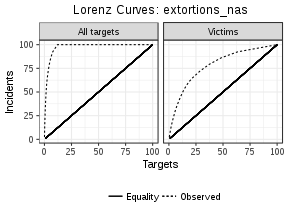

```r
victim_lorenz("extortions", enve_final, family = "poisson")
```

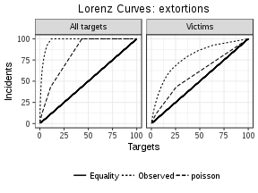

```r
victim_lorenz("extortions", enve_final, family = "nbinom")
```

```
Warning in densfun(x, parm[1], parm[2], ...): NaNs produced

Warning in densfun(x, parm[1], parm[2], ...): NaNs produced

Warning in densfun(x, parm[1], parm[2], ...): NaNs produced

Warning in densfun(x, parm[1], parm[2], ...): NaNs produced

Warning in densfun(x, parm[1], parm[2], ...): NaNs produced
```


Now do some MC gini tests, Index of dispersion tests, and KS tests


```r
mc_gini_test("extortions", enve_final, family = "poisson", plots = TRUE)
```

```
$DV
[1] "extortions"

$stat
Observed Gini Coefficient for extortions 
                               0.9481401 

$mc_mean
Monte Carlo mean 
       0.6462623 

$mc_confint
  MC 2.5%  MC 97.5% 
0.6290460 0.6632319 

$reps
Replicates 
      2000 

$mc_test
Alternative Hypothesis 
                  TRUE 

$plot
```

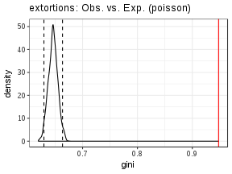

```r
mc_gini_test("extortions", enve_final, family = "nbinom", plots = TRUE)
```

```
Warning in densfun(x, parm[1], parm[2], ...): NaNs produced

Warning in densfun(x, parm[1], parm[2], ...): NaNs produced

Warning in densfun(x, parm[1], parm[2], ...): NaNs produced

Warning in densfun(x, parm[1], parm[2], ...): NaNs produced

Warning in densfun(x, parm[1], parm[2], ...): NaNs produced
```

```
$DV
[1] "extortions"

$stat
Observed Gini Coefficient for extortions 
                               0.9481401 

$mc_mean
Monte Carlo mean 
       0.9462634 

$mc_confint
  MC 2.5%  MC 97.5% 
0.9387800 0.9533805 

$reps
Replicates 
      2000 

$mc_test
Alternative Hypothesis 
                 FALSE 

$plot
```

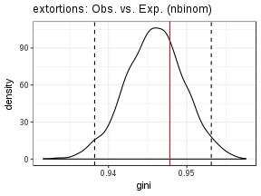

```r
dispersion_batch("extortions", enve_final, print_option = "pandoc")
```


Table: Index of dispersion tests

               Mean   Variance   var/mu          I   p-value     df   95% Chi-sq  stars 
-----------  ------  ---------  -------  ---------  --------  -----  -----------  ------
extortions    0.569      6.971   12.256   29548.01         0   2411     2526.345  ***   

```r
my_ks_test("extortions", enve_final)
```

```

	One-sample Kolmogorov-Smirnov test

data:  extortions vs. poisson
D^+ = 0.31548, p-value < 2.2e-16
alternative hypothesis: the CDF of x lies above the null hypothesis
```

```r
my_ks_test("extortions", enve_final, family = "nbinom")
```

```
Warning in densfun(x, parm[1], parm[2], ...): NaNs produced

Warning in densfun(x, parm[1], parm[2], ...): NaNs produced

Warning in densfun(x, parm[1], parm[2], ...): NaNs produced

Warning in densfun(x, parm[1], parm[2], ...): NaNs produced

Warning in densfun(x, parm[1], parm[2], ...): NaNs produced
```

```

	One-sample Kolmogorov-Smirnov test

data:  extortions vs. nbinom
D^+ = 0.0046153, p-value = 0.9023
alternative hypothesis: the CDF of x lies above the null hypothesis
```

```r
ext_chisq_poiss <- chisq_count("extortions", data = enve_final, B = 2000,
                               family = "poisson")

ext_chisq_poiss
```

```

	Chi-squared test for given probabilities with simulated p-value
	(based on 2000 replicates)

data:  extortions vs. poisson
X-squared = 10058, df = NA, p-value = 0.0004998
```

```r
ext_chisq_poiss_tb <- data.frame(ext_chisq_poiss$observed,
                                 Exp = ext_chisq_poiss$expected)[,c(1,2,4)]

kable(ext_chisq_poiss_tb, format = "pandoc", digits = 3, 
      caption = "Poisson expected counts")
```


Table: Poisson expected counts

extortions    Freq   Exp.Freq
-----------  -----  ---------
0             2127   1365.653
1              104    777.005
2               43    220.883
3               32     41.790
4               24      5.923
5+              82      0.746

```r
ext_chisq_nbinom <- chisq_count("extortions", data = enve_final, B = 2000,
                               family = "nbinom")
```

```
Warning in densfun(x, parm[1], parm[2], ...): NaNs produced

Warning in densfun(x, parm[1], parm[2], ...): NaNs produced

Warning in densfun(x, parm[1], parm[2], ...): NaNs produced

Warning in densfun(x, parm[1], parm[2], ...): NaNs produced

Warning in densfun(x, parm[1], parm[2], ...): NaNs produced
```

```r
ext_chisq_nbinom
```

```

	Chi-squared test for given probabilities

data:  extortions vs. nbinom
X-squared = 2.1489, df = 5, p-value = 0.8282
```

```r
ext_chisq_nbinom_tb <- data.frame(ext_chisq_nbinom$observed,
                                 Exp = ext_chisq_nbinom$expected)[,c(1,2,4)]

kable(ext_chisq_nbinom_tb, format = "pandoc", digits = 3, 
      caption = "Negative binomial expected counts")
```


Table: Negative binomial expected counts

extortions    Freq   Exp.Freq
-----------  -----  ---------
0             2127   2127.639
1              104     97.412
2               43     47.193
3               32     29.491
4               24     20.796
5+              82     89.469

```r
## Neg Bin distribution parameters for extortion

MASS::fitdistr(enve_final$extortions, "Negative Binomial")
```

```
Warning in densfun(x, parm[1], parm[2], ...): NaNs produced

Warning in densfun(x, parm[1], parm[2], ...): NaNs produced

Warning in densfun(x, parm[1], parm[2], ...): NaNs produced

Warning in densfun(x, parm[1], parm[2], ...): NaNs produced

Warning in densfun(x, parm[1], parm[2], ...): NaNs produced
```

```
      size           mu     
  0.049827816   0.569037979 
 (0.003764024) (0.054149999)
```

## Univariate: other extortion types

Now do the univariate analysis for the rest of the extortion variables. First for the capped counts.


```r
extortion_columns_capped <- c("typeTelephone",
                              "typeInternet",
                              "typeStreet",
                              "typePremises",
                              "typeCobro.de.piso",
                              "typeOther",
                              "simpRemote",
                              "simpIn.person",
                              "cap_count")

extortion_dist_capped <- lapply(extortion_columns_capped, victim_table,
                          data = enve_final, print_option = "pandoc")

names(extortion_dist_capped) <- extortion_columns_capped
extortion_dist_capped
```

```
$typeTelephone


Table: Victimisation distribution of typeTelephone.

 Events   Prevalence   Incidence   Repeats   Target_%   Victim_%   Incident_%
-------  -----------  ----------  --------  ---------  ---------  -----------
      0         1269          --        --     52.612         --           --
      1          957         957        --     39.677     83.727       66.876
      2          118         236       118      4.892     10.324       16.492
      3           45         135        90      1.866      3.937        9.434
      4           12          48        36      0.498      1.050        3.354
      5           11          55        44      0.456      0.962        3.843

$typeInternet


Table: Victimisation distribution of typeInternet.

 Events   Prevalence   Incidence   Repeats   Target_%   Victim_%   Incident_%
-------  -----------  ----------  --------  ---------  ---------  -----------
      0         2406          --        --     99.751         --           --
      1            6           6        --      0.249        100          100

$typeStreet


Table: Victimisation distribution of typeStreet.

 Events   Prevalence   Incidence   Repeats   Target_%   Victim_%   Incident_%
-------  -----------  ----------  --------  ---------  ---------  -----------
      0         2359          --        --     97.803         --           --
      1           48          48        --      1.990     90.566       77.419
      2            3           6         3      0.124      5.660        9.677
      3            1           3         2      0.041      1.887        4.839
      5            1           5         4      0.041      1.887        8.065

$typePremises


Table: Victimisation distribution of typePremises.

 Events   Prevalence   Incidence   Repeats   Target_%   Victim_%   Incident_%
-------  -----------  ----------  --------  ---------  ---------  -----------
      0         2402          --        --     99.585         --           --
      1            7           7        --      0.290         70        43.75
      2            2           4         2      0.083         20        25.00
      5            1           5         4      0.041         10        31.25

$typeCobro.de.piso


Table: Victimisation distribution of typeCobro.de.piso.

 Events   Prevalence   Incidence   Repeats   Target_%   Victim_%   Incident_%
-------  -----------  ----------  --------  ---------  ---------  -----------
      0         2407          --        --     99.793         --           --
      1            4           4        --      0.166         80       57.143
      3            1           3         2      0.041         20       42.857

$typeOther


Table: Victimisation distribution of typeOther.

 Events   Prevalence   Incidence   Repeats   Target_%   Victim_%   Incident_%
-------  -----------  ----------  --------  ---------  ---------  -----------
      0         2386          --        --     98.922         --           --
      1           23          23        --      0.954     88.462       74.194
      2            2           4         2      0.083      7.692       12.903
      4            1           4         3      0.041      3.846       12.903

$simpRemote


Table: Victimisation distribution of simpRemote.

 Events   Prevalence   Incidence   Repeats   Target_%   Victim_%   Incident_%
-------  -----------  ----------  --------  ---------  ---------  -----------
      0         1263          --        --     52.363         --           --
      1          963         963        --     39.925     83.812       67.015
      2          118         236       118      4.892     10.270       16.423
      3           45         135        90      1.866      3.916        9.395
      4           12          48        36      0.498      1.044        3.340
      5           11          55        44      0.456      0.957        3.827

$simpIn.person


Table: Victimisation distribution of simpIn.person.

 Events   Prevalence   Incidence   Repeats   Target_%   Victim_%   Incident_%
-------  -----------  ----------  --------  ---------  ---------  -----------
      0         2344          --        --     97.181         --           --
      1           59          59        --      2.446     86.765       69.412
      2            5          10         5      0.207      7.353       11.765
      3            2           6         4      0.083      2.941        7.059
      5            2          10         8      0.083      2.941       11.765

$cap_count


Table: Victimisation distribution of cap_count.

 Events   Prevalence   Incidence   Repeats   Target_%   Victim_%   Incident_%
-------  -----------  ----------  --------  ---------  ---------  -----------
      0         1175          --        --     48.715         --           --
      1         1035        1035        --     42.910     83.670       66.645
      2          128         256       128      5.307     10.348       16.484
      3           47         141        94      1.949      3.800        9.079
      4           14          56        42      0.580      1.132        3.606
      5           13          65        52      0.539      1.051        4.185
```

```r
extortion_dist_capped_nformat <- lapply(extortion_columns_capped, victim_table,
                          data = enve_final, print_option = "none")

names(extortion_dist_capped_nformat) <- extortion_columns_capped

ext_capped_vicum <- lapply(extortion_dist_capped_nformat, victim_cumulative)

lapply(ext_capped_vicum, kable, format = "pandoc", digits = 3)
```

```
$typeTelephone


 Events   All targets   Victims   Incidents
-------  ------------  --------  ----------
      0       100.000        --          --
      1        47.388   100.000     100.000
      2         7.711    16.273      33.124
      3         2.819     5.949      16.632
      4         0.954     2.012       7.198
      5         0.456     0.962       3.843

$typeInternet


 Events   All targets   Victims   Incidents
-------  ------------  --------  ----------
      0       100.000        --          --
      1         0.249       100         100

$typeStreet


 Events   All targets   Victims   Incidents
-------  ------------  --------  ----------
      0       100.000        --          --
      1         2.197   100.000     100.000
      2         0.207     9.434      22.581
      3         0.083     3.774      12.903
      5         0.041     1.887       8.065

$typePremises


 Events   All targets   Victims   Incidents
-------  ------------  --------  ----------
      0       100.000        --          --
      1         0.415       100      100.00
      2         0.124        30       56.25
      5         0.041        10       31.25

$typeCobro.de.piso


 Events   All targets   Victims   Incidents
-------  ------------  --------  ----------
      0       100.000        --          --
      1         0.207       100     100.000
      3         0.041        20      42.857

$typeOther


 Events   All targets   Victims   Incidents
-------  ------------  --------  ----------
      0       100.000        --          --
      1         1.078   100.000     100.000
      2         0.124    11.538      25.806
      4         0.041     3.846      12.903

$simpRemote


 Events   All targets   Victims   Incidents
-------  ------------  --------  ----------
      0       100.000        --          --
      1        47.637   100.000     100.000
      2         7.711    16.188      32.985
      3         2.819     5.918      16.562
      4         0.954     2.002       7.168
      5         0.456     0.957       3.827

$simpIn.person


 Events   All targets   Victims   Incidents
-------  ------------  --------  ----------
      0       100.000        --          --
      1         2.819   100.000     100.000
      2         0.373    13.235      30.588
      3         0.166     5.882      18.824
      5         0.083     2.941      11.765

$cap_count


 Events   All targets   Victims   Incidents
-------  ------------  --------  ----------
      0       100.000        --          --
      1        51.285   100.000     100.000
      2         8.375    16.330      33.355
      3         3.068     5.982      16.871
      4         1.119     2.183       7.791
      5         0.539     1.051       4.185
```


```r
lapply(extortion_columns_capped, victim_lorenz, data = enve_final,
       family = "poisson")
```

```
[[1]]
```


```

[[2]]
```

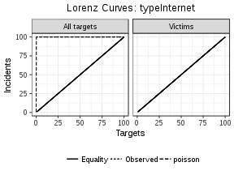

```

[[3]]
```

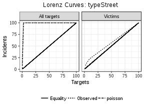

```

[[4]]
```

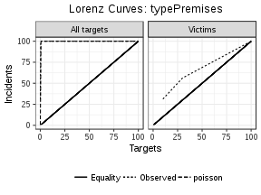

```

[[5]]
```

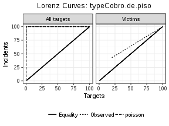

```

[[6]]
```

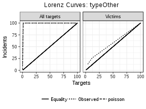

```

[[7]]
```

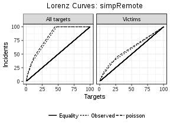

```

[[8]]
```


```

[[9]]
```

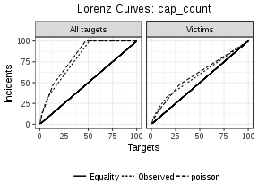

```r
lapply(extortion_columns_capped, victim_lorenz, data = enve_final,
       family = "nbinom")
```

```
Warning in densfun(x, parm[1], parm[2], ...): NaNs produced

Warning in densfun(x, parm[1], parm[2], ...): NaNs produced

Warning in densfun(x, parm[1], parm[2], ...): NaNs produced

Warning in densfun(x, parm[1], parm[2], ...): NaNs produced

Warning in densfun(x, parm[1], parm[2], ...): NaNs produced

Warning in densfun(x, parm[1], parm[2], ...): NaNs produced

Warning in densfun(x, parm[1], parm[2], ...): NaNs produced

Warning in densfun(x, parm[1], parm[2], ...): NaNs produced

Warning in densfun(x, parm[1], parm[2], ...): NaNs produced

Warning in densfun(x, parm[1], parm[2], ...): NaNs produced

Warning in densfun(x, parm[1], parm[2], ...): NaNs produced

Warning in densfun(x, parm[1], parm[2], ...): NaNs produced

Warning in densfun(x, parm[1], parm[2], ...): NaNs produced

Warning in densfun(x, parm[1], parm[2], ...): NaNs produced

Warning in densfun(x, parm[1], parm[2], ...): NaNs produced

Warning in densfun(x, parm[1], parm[2], ...): NaNs produced

Warning in densfun(x, parm[1], parm[2], ...): NaNs produced

Warning in densfun(x, parm[1], parm[2], ...): NaNs produced

Warning in densfun(x, parm[1], parm[2], ...): NaNs produced

Warning in densfun(x, parm[1], parm[2], ...): NaNs produced

Warning in densfun(x, parm[1], parm[2], ...): NaNs produced

Warning in densfun(x, parm[1], parm[2], ...): NaNs produced

Warning in densfun(x, parm[1], parm[2], ...): NaNs produced

Warning in densfun(x, parm[1], parm[2], ...): NaNs produced

Warning in densfun(x, parm[1], parm[2], ...): NaNs produced

Warning in densfun(x, parm[1], parm[2], ...): NaNs produced

Warning in densfun(x, parm[1], parm[2], ...): NaNs produced

Warning in densfun(x, parm[1], parm[2], ...): NaNs produced
```

```
[[1]]
```

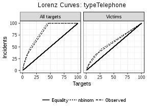

```

[[2]]
```

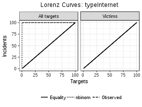

```

[[3]]
```

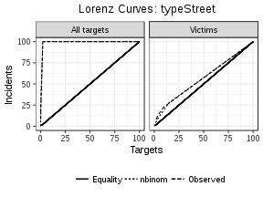

```

[[4]]
```

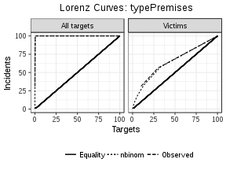

```

[[5]]
```


```

[[6]]
```

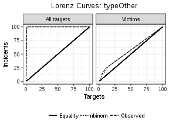

```

[[7]]
```

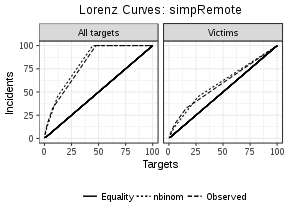

```

[[8]]
```


```

[[9]]
```

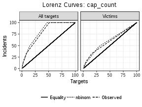

Now do some hypothesis testing 


```r
lapply(extortion_columns_capped, mc_gini_test, data = enve_final,
       family = "poisson", plots = TRUE) 
```

```
[[1]]
[[1]]$DV
[1] "typeTelephone"

[[1]]$stat
Observed Gini Coefficient for typeTelephone 
                                  0.6099403 

[[1]]$mc_mean
Monte Carlo mean 
       0.6372183 

[[1]]$mc_confint
  MC 2.5%  MC 97.5% 
0.6198517 0.6539911 

[[1]]$reps
Replicates 
      2000 

[[1]]$mc_test
Alternative Hypothesis 
                  TRUE 

[[1]]$plot
```

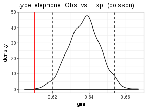

```


[[2]]
[[2]]$DV
[1] "typeInternet"

[[2]]$stat
Observed Gini Coefficient for typeInternet 
                                 0.9975124 

[[2]]$mc_mean
Monte Carlo mean 
             NaN 

[[2]]$mc_confint
  MC 2.5%  MC 97.5% 
0.9954395 0.9991708 

[[2]]$reps
Replicates 
      2000 

[[2]]$mc_test
Alternative Hypothesis 
                 FALSE 

[[2]]$plot
```

```
Warning: Removed 6 rows containing non-finite values (stat_density).
```

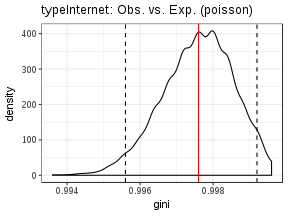

```


[[3]]
[[3]]$DV
[1] "typeStreet"

[[3]]$stat
Observed Gini Coefficient for typeStreet 
                               0.9810089 

[[3]]$mc_mean
Monte Carlo mean 
       0.9749485 

[[3]]$mc_confint
  MC 2.5%  MC 97.5% 
0.9684482 0.9809287 

[[3]]$reps
Replicates 
      2000 

[[3]]$mc_test
Alternative Hypothesis 
                  TRUE 

[[3]]$plot
```

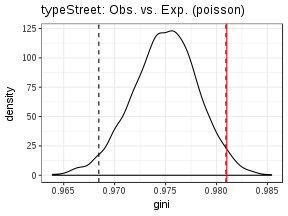

```


[[4]]
[[4]]$DV
[1] "typePremises"

[[4]]$stat
Observed Gini Coefficient for typePremises 
                                 0.9970978 

[[4]]$mc_mean
Monte Carlo mean 
       0.9935279 

[[4]]$mc_confint
  MC 2.5%  MC 97.5% 
0.9904216 0.9962687 

[[4]]$reps
Replicates 
      2000 

[[4]]$mc_test
Alternative Hypothesis 
                  TRUE 

[[4]]$plot
```

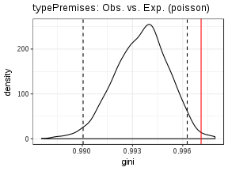

```


[[5]]
[[5]]$DV
[1] "typeCobro.de.piso"

[[5]]$stat
Observed Gini Coefficient for typeCobro.de.piso 
                                      0.9984009 

[[5]]$mc_mean
Monte Carlo mean 
             NaN 

[[5]]$mc_confint
  MC 2.5%  MC 97.5% 
0.9946103 0.9991708 

[[5]]$reps
Replicates 
      2000 

[[5]]$mc_test
Alternative Hypothesis 
                 FALSE 

[[5]]$plot
```

```
Warning: Removed 1 rows containing non-finite values (stat_density).
```

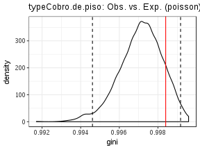

```


[[6]]
[[6]]$DV
[1] "typeOther"

[[6]]$stat
Observed Gini Coefficient for typeOther 
                              0.9908121 

[[6]]$mc_mean
Monte Carlo mean 
       0.9873704 

[[6]]$mc_confint
  MC 2.5%  MC 97.5% 
0.9825871 0.9917081 

[[6]]$reps
Replicates 
      2000 

[[6]]$mc_test
Alternative Hypothesis 
                 FALSE 

[[6]]$plot
```

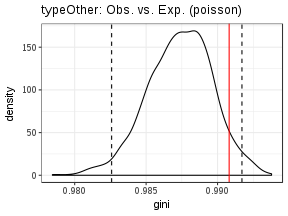

```


[[7]]
[[7]]$DV
[1] "simpRemote"

[[7]]$stat
Observed Gini Coefficient for simpRemote 
                               0.6076013 

[[7]]$mc_mean
Monte Carlo mean 
       0.6360962 

[[7]]$mc_confint
  MC 2.5%  MC 97.5% 
0.6189349 0.6535694 

[[7]]$reps
Replicates 
      2000 

[[7]]$mc_test
Alternative Hypothesis 
                  TRUE 

[[7]]$plot
```

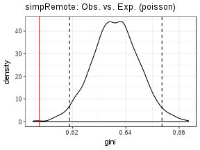

```


[[8]]
[[8]]$DV
[1] "simpIn.person"

[[8]]$stat
Observed Gini Coefficient for simpIn.person 
                                   0.976934 

[[8]]$mc_mean
Monte Carlo mean 
       0.9660709 

[[8]]$mc_confint
  MC 2.5%  MC 97.5% 
0.9585087 0.9730393 

[[8]]$reps
Replicates 
      2000 

[[8]]$mc_test
Alternative Hypothesis 
                  TRUE 

[[8]]$plot
```

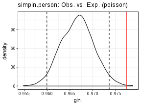

```


[[9]]
[[9]]$DV
[1] "cap_count"

[[9]]$stat
Observed Gini Coefficient for cap_count 
                              0.5789066 

[[9]]$mc_mean
Monte Carlo mean 
       0.6195217 

[[9]]$mc_confint
  MC 2.5%  MC 97.5% 
0.6026049 0.6358270 

[[9]]$reps
Replicates 
      2000 

[[9]]$mc_test
Alternative Hypothesis 
                  TRUE 

[[9]]$plot
```

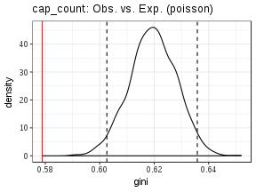

```r
lapply(extortion_columns_capped, mc_gini_test, data = enve_final,
       family = "nbinom", plots = TRUE) 
```

```
Warning in densfun(x, parm[1], parm[2], ...): NaNs produced
```

```
Warning in densfun(x, parm[1], parm[2], ...): NaNs produced

Warning in densfun(x, parm[1], parm[2], ...): NaNs produced

Warning in densfun(x, parm[1], parm[2], ...): NaNs produced

Warning in densfun(x, parm[1], parm[2], ...): NaNs produced

Warning in densfun(x, parm[1], parm[2], ...): NaNs produced

Warning in densfun(x, parm[1], parm[2], ...): NaNs produced

Warning in densfun(x, parm[1], parm[2], ...): NaNs produced

Warning in densfun(x, parm[1], parm[2], ...): NaNs produced

Warning in densfun(x, parm[1], parm[2], ...): NaNs produced

Warning in densfun(x, parm[1], parm[2], ...): NaNs produced

Warning in densfun(x, parm[1], parm[2], ...): NaNs produced

Warning in densfun(x, parm[1], parm[2], ...): NaNs produced

Warning in densfun(x, parm[1], parm[2], ...): NaNs produced

Warning in densfun(x, parm[1], parm[2], ...): NaNs produced

Warning in densfun(x, parm[1], parm[2], ...): NaNs produced

Warning in densfun(x, parm[1], parm[2], ...): NaNs produced

Warning in densfun(x, parm[1], parm[2], ...): NaNs produced

Warning in densfun(x, parm[1], parm[2], ...): NaNs produced

Warning in densfun(x, parm[1], parm[2], ...): NaNs produced

Warning in densfun(x, parm[1], parm[2], ...): NaNs produced

Warning in densfun(x, parm[1], parm[2], ...): NaNs produced

Warning in densfun(x, parm[1], parm[2], ...): NaNs produced

Warning in densfun(x, parm[1], parm[2], ...): NaNs produced

Warning in densfun(x, parm[1], parm[2], ...): NaNs produced

Warning in densfun(x, parm[1], parm[2], ...): NaNs produced

Warning in densfun(x, parm[1], parm[2], ...): NaNs produced

Warning in densfun(x, parm[1], parm[2], ...): NaNs produced
```

```
[[1]]
[[1]]$DV
[1] "typeTelephone"

[[1]]$stat
Observed Gini Coefficient for typeTelephone 
                                  0.6099403 

[[1]]$mc_mean
Monte Carlo mean 
       0.6406811 

[[1]]$mc_confint
  MC 2.5%  MC 97.5% 
0.6239083 0.6566031 

[[1]]$reps
Replicates 
      2000 

[[1]]$mc_test
Alternative Hypothesis 
                  TRUE 

[[1]]$plot
```

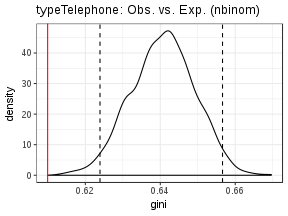

```


[[2]]
[[2]]$DV
[1] "typeInternet"

[[2]]$stat
Observed Gini Coefficient for typeInternet 
                                 0.9975124 

[[2]]$mc_mean
Monte Carlo mean 
             NaN 

[[2]]$mc_confint
  MC 2.5%  MC 97.5% 
0.9954395 0.9991708 

[[2]]$reps
Replicates 
      2000 

[[2]]$mc_test
Alternative Hypothesis 
                 FALSE 

[[2]]$plot
```

```
Warning: Removed 4 rows containing non-finite values (stat_density).
```

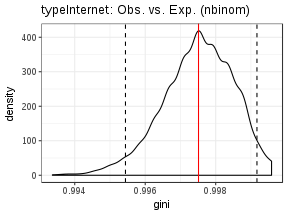

```


[[3]]
[[3]]$DV
[1] "typeStreet"

[[3]]$stat
Observed Gini Coefficient for typeStreet 
                               0.9810089 

[[3]]$mc_mean
Monte Carlo mean 
       0.9807102 

[[3]]$mc_confint
  MC 2.5%  MC 97.5% 
0.9750978 0.9857474 

[[3]]$reps
Replicates 
      2000 

[[3]]$mc_test
Alternative Hypothesis 
                 FALSE 

[[3]]$plot
```

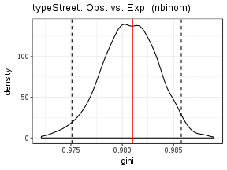

```


[[4]]
[[4]]$DV
[1] "typePremises"

[[4]]$stat
Observed Gini Coefficient for typePremises 
                                 0.9970978 

[[4]]$mc_mean
Monte Carlo mean 
       0.9968283 

[[4]]$mc_confint
  MC 2.5%  MC 97.5% 
0.9947024 0.9985904 

[[4]]$reps
Replicates 
      2000 

[[4]]$mc_test
Alternative Hypothesis 
                 FALSE 

[[4]]$plot
```

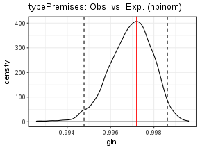

```


[[5]]
[[5]]$DV
[1] "typeCobro.de.piso"

[[5]]$stat
Observed Gini Coefficient for typeCobro.de.piso 
                                      0.9984009 

[[5]]$mc_mean
Monte Carlo mean 
             NaN 

[[5]]$mc_confint
  MC 2.5%  MC 97.5% 
0.9965238 0.9995854 

[[5]]$reps
Replicates 
      2000 

[[5]]$mc_test
Alternative Hypothesis 
                 FALSE 

[[5]]$plot
```

```
Warning: Removed 19 rows containing non-finite values (stat_density).
```

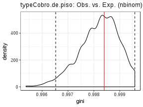

```


[[6]]
[[6]]$DV
[1] "typeOther"

[[6]]$stat
Observed Gini Coefficient for typeOther 
                              0.9908121 

[[6]]$mc_mean
Monte Carlo mean 
       0.9906872 

[[6]]$mc_confint
  MC 2.5%  MC 97.5% 
0.9869381 0.9941760 

[[6]]$reps
Replicates 
      2000 

[[6]]$mc_test
Alternative Hypothesis 
                 FALSE 

[[6]]$plot
```

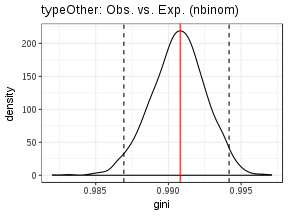

```


[[7]]
[[7]]$DV
[1] "simpRemote"

[[7]]$stat
Observed Gini Coefficient for simpRemote 
                               0.6076013 

[[7]]$mc_mean
Monte Carlo mean 
       0.6383798 

[[7]]$mc_confint
  MC 2.5%  MC 97.5% 
0.6221272 0.6556980 

[[7]]$reps
Replicates 
      2000 

[[7]]$mc_test
Alternative Hypothesis 
                  TRUE 

[[7]]$plot
```

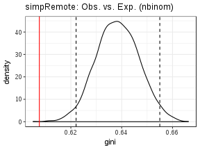

```


[[8]]
[[8]]$DV
[1] "simpIn.person"

[[8]]$stat
Observed Gini Coefficient for simpIn.person 
                                   0.976934 

[[8]]$mc_mean
Monte Carlo mean 
       0.9765675 

[[8]]$mc_confint
  MC 2.5%  MC 97.5% 
0.9705190 0.9821966 

[[8]]$reps
Replicates 
      2000 

[[8]]$mc_test
Alternative Hypothesis 
                 FALSE 

[[8]]$plot
```

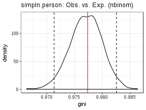

```


[[9]]
[[9]]$DV
[1] "cap_count"

[[9]]$stat
Observed Gini Coefficient for cap_count 
                              0.5789066 

[[9]]$mc_mean
Monte Carlo mean 
       0.6212528 

[[9]]$mc_confint
  MC 2.5%  MC 97.5% 
0.6037885 0.6391865 

[[9]]$reps
Replicates 
      2000 

[[9]]$mc_test
Alternative Hypothesis 
                  TRUE 

[[9]]$plot
```

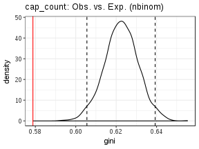

```r
dispersion_batch(extortion_columns_capped, enve_final, print_option = "pandoc")
```


Table: Index of dispersion tests

                      Mean   Variance   var/mu          I   p-value     df   95% Chi-sq  stars 
------------------  ------  ---------  -------  ---------  --------  -----  -----------  ------
typeTelephone        0.593      0.602    1.015   2447.415     0.298   2411     2526.345        
typeInternet         0.002      0.002    0.998   2406.000     0.525   2411     2526.345        
typeStreet           0.026      0.038    1.491   3594.903     0.000   2411     2526.345  ***   
typePremises         0.007      0.017    2.494   6014.000     0.000   2411     2526.345  ***   
typeCobro.de.piso    0.003      0.005    1.855   4472.429     0.000   2411     2526.345  ***   
typeOther            0.013      0.019    1.504   3625.903     0.000   2411     2526.345  ***   
simpRemote           0.596      0.602    1.010   2435.292     0.360   2411     2526.345        
simpIn.person        0.035      0.060    1.695   4086.341     0.000   2411     2526.345  ***   
cap_count            0.644      0.630    0.979   2359.317     0.770   2411     2526.345        

```r
ks_test_batch(extortion_columns_capped, enve_final, print_option = "pandoc", 
              family = "poisson")
```


Table: Kolmogorov-Smirnov Tests

                                 KS.Statistic   p-value  stars 
------------------------------  -------------  --------  ------
typeTelephone vs. poisson               0.042     0.000  ***   
typeInternet vs. poisson                0.000     1.000        
typeStreet vs. poisson                  0.004     0.939        
typePremises vs. poisson                0.002     0.971        
typeCobro.de.piso vs. poisson           0.001     0.997        
typeOther vs. poisson                   0.002     0.981        
simpRemote vs. poisson                  0.043     0.000  ***   
simpIn.person vs. poisson               0.007     0.801        
cap_count vs. poisson                   0.053     0.000  ***   

```r
ks_test_batch(extortion_columns_capped, enve_final, print_option = "pandoc", 
              family = "nbinom")
```

```
Warning in densfun(x, parm[1], parm[2], ...): NaNs produced

Warning in densfun(x, parm[1], parm[2], ...): NaNs produced

Warning in densfun(x, parm[1], parm[2], ...): NaNs produced

Warning in densfun(x, parm[1], parm[2], ...): NaNs produced

Warning in densfun(x, parm[1], parm[2], ...): NaNs produced

Warning in densfun(x, parm[1], parm[2], ...): NaNs produced

Warning in densfun(x, parm[1], parm[2], ...): NaNs produced

Warning in densfun(x, parm[1], parm[2], ...): NaNs produced

Warning in densfun(x, parm[1], parm[2], ...): NaNs produced

Warning in densfun(x, parm[1], parm[2], ...): NaNs produced

Warning in densfun(x, parm[1], parm[2], ...): NaNs produced

Warning in densfun(x, parm[1], parm[2], ...): NaNs produced

Warning in densfun(x, parm[1], parm[2], ...): NaNs produced

Warning in densfun(x, parm[1], parm[2], ...): NaNs produced

Warning in densfun(x, parm[1], parm[2], ...): NaNs produced

Warning in densfun(x, parm[1], parm[2], ...): NaNs produced

Warning in densfun(x, parm[1], parm[2], ...): NaNs produced

Warning in densfun(x, parm[1], parm[2], ...): NaNs produced

Warning in densfun(x, parm[1], parm[2], ...): NaNs produced

Warning in densfun(x, parm[1], parm[2], ...): NaNs produced

Warning in densfun(x, parm[1], parm[2], ...): NaNs produced

Warning in densfun(x, parm[1], parm[2], ...): NaNs produced

Warning in densfun(x, parm[1], parm[2], ...): NaNs produced

Warning in densfun(x, parm[1], parm[2], ...): NaNs produced

Warning in densfun(x, parm[1], parm[2], ...): NaNs produced

Warning in densfun(x, parm[1], parm[2], ...): NaNs produced

Warning in densfun(x, parm[1], parm[2], ...): NaNs produced

Warning in densfun(x, parm[1], parm[2], ...): NaNs produced
```


Table: Kolmogorov-Smirnov Tests

                                KS.Statistic   p-value  stars 
-----------------------------  -------------  --------  ------
typeTelephone vs. nbinom               0.043     0.000  ***   
typeInternet vs. nbinom                0.000     1.000        
typeStreet vs. nbinom                  0.001     0.995        
typePremises vs. nbinom                0.000     1.000        
typeCobro.de.piso vs. nbinom           0.000     1.000        
typeOther vs. nbinom                   0.000     0.999        
simpRemote vs. nbinom                  0.044     0.000  ***   
simpIn.person vs. nbinom               0.002     0.986        
cap_count vs. nbinom                   0.053     0.000  ***   

```r
# poisson expected chisq

ext_cap_chisq_p <- lapply(extortion_columns_capped, function(x)
{
    tryCatch(chisq_count(x, data = enve_final, B = 2000), 
             error = function(e) NULL)
})

ext_cap_chisq_p
```

```
[[1]]

	Chi-squared test for given probabilities with simulated p-value
	(based on 2000 replicates)

data:  typeTelephone vs. poisson
X-squared = 210.08, df = NA, p-value = 0.0004998


[[2]]

	Chi-squared test for given probabilities

data:  typeInternet vs. poisson
X-squared = 1.5055e-05, df = 1, p-value = 0.9969


[[3]]

	Chi-squared test for given probabilities with simulated p-value
	(based on 2000 replicates)

data:  typeStreet vs. poisson
X-squared = 671.66, df = NA, p-value = 0.0004998


[[4]]

	Chi-squared test for given probabilities with simulated p-value
	(based on 2000 replicates)

data:  typePremises vs. poisson
X-squared = 199.07, df = NA, p-value = 0.0004998


[[5]]

	Chi-squared test for given probabilities with simulated p-value
	(based on 2000 replicates)

data:  typeCobro.de.piso vs. poisson
X-squared = 104.53, df = NA, p-value = 0.004998


[[6]]

	Chi-squared test for given probabilities with simulated p-value
	(based on 2000 replicates)

data:  typeOther vs. poisson
X-squared = 681.85, df = NA, p-value = 0.0004998


[[7]]

	Chi-squared test for given probabilities with simulated p-value
	(based on 2000 replicates)

data:  simpRemote vs. poisson
X-squared = 215.38, df = NA, p-value = 0.0004998


[[8]]

	Chi-squared test for given probabilities with simulated p-value
	(based on 2000 replicates)

data:  simpIn.person vs. poisson
X-squared = 768.94, df = NA, p-value = 0.0004998


[[9]]

	Chi-squared test for given probabilities with simulated p-value
	(based on 2000 replicates)

data:  cap_count vs. poisson
X-squared = 237.27, df = NA, p-value = 0.0004998
```

```r
kable(chisq_tb(ext_cap_chisq_p), format = "pandoc", digits = 3)
```

                                Chi-sq        Cramer's V   df   p.value        stars 
------------------------------  ------------  -----------  ---  -------------  ------
typeTelephone vs. poisson       210.081       --           --   0.0004997501   ***   
typeInternet vs. poisson        1.50554e-05   --           1    0.9969041            
typeStreet vs. poisson          671.6594      --           --   0.0004997501   ***   
typePremises vs. poisson        199.0748      --           --   0.0004997501   ***   
typeCobro.de.piso vs. poisson   104.5348      --           --   0.004997501    **    
typeOther vs. poisson           681.8471      --           --   0.0004997501   ***   
simpRemote vs. poisson          215.3843      --           --   0.0004997501   ***   
simpIn.person vs. poisson       768.9397      --           --   0.0004997501   ***   
cap_count vs. poisson           237.2712      --           --   0.0004997501   ***   

```r
ext_cap_p_tb <- lapply(ext_cap_chisq_p, function(x)
    {
    kable(data.frame(x$observed, Exp = x$expected)[,c(1,2,4)],
          format = "pandoc", digits = 3, caption = "Expected: Poisson")
    })


print_kables(ext_cap_p_tb)
```

```


Table: Expected: Poisson

typeTelephone    Freq   Exp.Freq
--------------  -----  ---------
0                1269   1331.721
1                 957    791.375
2                 118    234.749
3                  45     46.340
4                  12      6.896
5                  11      0.919


Table: Expected: Poisson

typeInternet    Freq   Exp.Freq
-------------  -----  ---------
0               2406    2405.99
1                  6       6.01


Table: Expected: Poisson

typeStreet    Freq   Exp.Freq
-----------  -----  ---------
0             2359   2350.640
1               48     60.576
2                3      0.778
3+               2      0.006


Table: Expected: Poisson

typePremises    Freq   Exp.Freq
-------------  -----  ---------
0               2402   2396.014
1                  7     15.941
2+                 3      0.045


Table: Expected: Poisson

typeCobro.de.piso    Freq   Exp.Freq
------------------  -----  ---------
0                    2407   2405.028
1                       4      6.962
3                       1      0.010


Table: Expected: Poisson

typeOther    Freq   Exp.Freq
----------  -----  ---------
0            2386   2381.341
1              23     30.449
2               2      0.209
4               1      0.002


Table: Expected: Poisson

simpRemote    Freq   Exp.Freq
-----------  -----  ---------
0             1263   1329.119
1              963    792.971
2              118    235.205
3               45     46.819
4               12      6.988
5               11      0.899


Table: Expected: Poisson

simpIn.person    Freq   Exp.Freq
--------------  -----  ---------
0                2344   2328.532
1                  59     81.976
2                   5      1.470
3+                  4      0.021


Table: Expected: Poisson

cap_count    Freq   Exp.Freq
----------  -----  ---------
0            1175   1268.119
1            1035    815.146
2             128    262.060
3              47     56.198
4              14      9.104
5              13      1.374
```

```r
# now for negbin

ext_cap_chisq_nb <- lapply(extortion_columns_capped, function(x)
{
    tryCatch(chisq_count(x, data = enve_final, B = 2000, family = "nbinom"), 
             error = function(e) NULL)
})
```

```
Warning in densfun(x, parm[1], parm[2], ...): NaNs produced

Warning in densfun(x, parm[1], parm[2], ...): NaNs produced

Warning in densfun(x, parm[1], parm[2], ...): NaNs produced

Warning in densfun(x, parm[1], parm[2], ...): NaNs produced

Warning in densfun(x, parm[1], parm[2], ...): NaNs produced

Warning in densfun(x, parm[1], parm[2], ...): NaNs produced

Warning in densfun(x, parm[1], parm[2], ...): NaNs produced

Warning in densfun(x, parm[1], parm[2], ...): NaNs produced

Warning in densfun(x, parm[1], parm[2], ...): NaNs produced

Warning in densfun(x, parm[1], parm[2], ...): NaNs produced

Warning in densfun(x, parm[1], parm[2], ...): NaNs produced

Warning in densfun(x, parm[1], parm[2], ...): NaNs produced

Warning in densfun(x, parm[1], parm[2], ...): NaNs produced

Warning in densfun(x, parm[1], parm[2], ...): NaNs produced

Warning in densfun(x, parm[1], parm[2], ...): NaNs produced

Warning in densfun(x, parm[1], parm[2], ...): NaNs produced

Warning in densfun(x, parm[1], parm[2], ...): NaNs produced

Warning in densfun(x, parm[1], parm[2], ...): NaNs produced

Warning in densfun(x, parm[1], parm[2], ...): NaNs produced

Warning in densfun(x, parm[1], parm[2], ...): NaNs produced

Warning in densfun(x, parm[1], parm[2], ...): NaNs produced

Warning in densfun(x, parm[1], parm[2], ...): NaNs produced

Warning in densfun(x, parm[1], parm[2], ...): NaNs produced

Warning in densfun(x, parm[1], parm[2], ...): NaNs produced

Warning in densfun(x, parm[1], parm[2], ...): NaNs produced

Warning in densfun(x, parm[1], parm[2], ...): NaNs produced

Warning in densfun(x, parm[1], parm[2], ...): NaNs produced

Warning in densfun(x, parm[1], parm[2], ...): NaNs produced
```

```r
ext_cap_chisq_nb
```

```
[[1]]

	Chi-squared test for given probabilities with simulated p-value
	(based on 2000 replicates)

data:  typeTelephone vs. nbinom
X-squared = 190.74, df = NA, p-value = 0.0004998


[[2]]

	Chi-squared test for given probabilities

data:  typeInternet vs. nbinom
X-squared = 0.0011112, df = 1, p-value = 0.9734


[[3]]

	Chi-squared test for given probabilities with simulated p-value
	(based on 2000 replicates)

data:  typeStreet vs. nbinom
X-squared = 3.8707, df = NA, p-value = 0.3948


[[4]]

	Chi-squared test for given probabilities with simulated p-value
	(based on 2000 replicates)

data:  typePremises vs. nbinom
X-squared = 0.12848, df = NA, p-value = 1


[[5]]

	Chi-squared test for given probabilities with simulated p-value
	(based on 2000 replicates)

data:  typeCobro.de.piso vs. nbinom
X-squared = 0.070053, df = NA, p-value = 1


[[6]]

	Chi-squared test for given probabilities with simulated p-value
	(based on 2000 replicates)

data:  typeOther vs. nbinom
X-squared = 0.55999, df = NA, p-value = 0.932


[[7]]

	Chi-squared test for given probabilities with simulated p-value
	(based on 2000 replicates)

data:  simpRemote vs. nbinom
X-squared = 196.75, df = NA, p-value = 0.0004998


[[8]]

	Chi-squared test for given probabilities with simulated p-value
	(based on 2000 replicates)

data:  simpIn.person vs. nbinom
X-squared = 4.4605, df = NA, p-value = 0.3178


[[9]]

	Chi-squared test for given probabilities with simulated p-value
	(based on 2000 replicates)

data:  cap_count vs. nbinom
X-squared = 234.81, df = NA, p-value = 0.0004998
```

```r
kable(chisq_tb(ext_cap_chisq_nb), format = "pandoc", digits = 3)
```

                               Chi-sq        Cramer's V   df   p.value        stars 
-----------------------------  ------------  -----------  ---  -------------  ------
typeTelephone vs. nbinom       190.7388      --           --   0.0004997501   ***   
typeInternet vs. nbinom        0.001111191   --           1    0.9734078            
typeStreet vs. nbinom          3.870659      --           --   0.3948026            
typePremises vs. nbinom        0.1284779     --           --   1                    
typeCobro.de.piso vs. nbinom   0.07005256    --           --   1                    
typeOther vs. nbinom           0.5599869     --           --   0.932034             
simpRemote vs. nbinom          196.7462      --           --   0.0004997501   ***   
simpIn.person vs. nbinom       4.460488      --           --   0.3178411            
cap_count vs. nbinom           234.8147      --           --   0.0004997501   ***   

```r
ext_cap_nb_tb <- lapply(ext_cap_chisq_nb, function(x)
    {
    kable(data.frame(x$observed, Exp = x$expected)[,c(1,2,4)],
          format = "pandoc", digits = 3, caption = "Expected: negbin")
    })


print_kables(ext_cap_nb_tb)
```

```


Table: Expected: negbin

typeTelephone    Freq   Exp.Freq
--------------  -----  ---------
0                1269   1338.028
1                 957    782.854
2                 118    234.501
3                  45     47.880
4                  12      7.625
5                  11      1.113


Table: Expected: negbin

typeInternet    Freq   Exp.Freq
-------------  -----  ---------
0               2406   2406.081
1                  6      5.919


Table: Expected: negbin

typeStreet    Freq   Exp.Freq
-----------  -----  ---------
0             2359   2359.242
1               48     45.304
2                3      6.123
3                1      1.071
5                1      0.260


Table: Expected: negbin

typePremises    Freq   Exp.Freq
-------------  -----  ---------
0               2402   2401.887
1                  7      6.770
2                  2      1.935
5                  1      1.409


Table: Expected: negbin

typeCobro.de.piso    Freq   Exp.Freq
------------------  -----  ---------
0                    2407   2406.890
1                       4      3.827
3                       1      1.282


Table: Expected: negbin

typeOther    Freq   Exp.Freq
----------  -----  ---------
0            2386   2386.072
1              23     21.971
2               2      3.188
4               1      0.769


Table: Expected: negbin

simpRemote    Freq   Exp.Freq
-----------  -----  ---------
0             1263   1333.639
1              963    786.398
2              118    235.538
3               45     47.960
4               12      7.390
5               11      1.075


Table: Expected: negbin

simpIn.person    Freq   Exp.Freq
--------------  -----  ---------
0                2344   2344.368
1                  59     54.748
2                   5      9.806
3                   2      2.268
5                   2      0.811


Table: Expected: negbin

cap_count    Freq   Exp.Freq
----------  -----  ---------
0            1175   1269.492
1            1035    812.260
2             128    262.160
3              47     57.245
4              14      9.417
5              13      1.426
```


Now do the estimated counts


```r
extortion_columns_estimated <- c("estTel",
                              "estInternet",
                              "estStreet",
                              "estPremises",
                              "estPiso",
                              "estOther",
                              "estRemote",
                              "estIn.person")

extortion_dist_estimated <- lapply(extortion_columns_estimated, function(x) 
                                {
                                    if(mean(enve_final[,x]) == 0){message(paste0("skipping ", x, ". No obs."))}
                                    else{victim_table(x, data = enve_final, print_option = "pandoc")}
                                })
```

```
skipping estInternet. No obs.
```

```r
names(extortion_dist_estimated) <- extortion_columns_estimated

extortion_dist_estimated
```

```
$estTel


Table: Victimisation distribution of estTel.

 Events   Prevalence   Incidence   Repeats   Target_%   Victim_%   Incident_%
-------  -----------  ----------  --------  ---------  ---------  -----------
      0         2276          --        --     94.362         --           --
      1           57          57        --      2.363     41.912        8.457
      2           17          34        17      0.705     12.500        5.045
      3           15          45        30      0.622     11.029        6.677
      4           11          44        33      0.456      8.088        6.528
      5            5          25        20      0.207      3.676        3.709
      6            3          18        15      0.124      2.206        2.671
      7            2          14        12      0.083      1.471        2.077
      8            1           8         7      0.041      0.735        1.187
      9            4          36        32      0.166      2.941        5.341
     10            1          10         9      0.041      0.735        1.484
     11            1          11        10      0.041      0.735        1.632
     12            2          24        22      0.083      1.471        3.561
     13            2          26        24      0.083      1.471        3.858
     14            2          28        26      0.083      1.471        4.154
     15            2          30        28      0.083      1.471        4.451
     19            2          38        36      0.083      1.471        5.638
     20            2          40        38      0.083      1.471        5.935
     21            2          42        40      0.083      1.471        6.231
     22            1          22        21      0.041      0.735        3.264
     25            1          25        24      0.041      0.735        3.709
     32            2          64        62      0.083      1.471        9.496
     33            1          33        32      0.041      0.735        4.896

$estInternet
NULL

$estStreet


Table: Victimisation distribution of estStreet.

 Events   Prevalence   Incidence   Repeats   Target_%   Victim_%   Incident_%
-------  -----------  ----------  --------  ---------  ---------  -----------
      0         2409          --        --     99.876         --           --
      1            2           2        --      0.083     66.667        6.897
     27            1          27        26      0.041     33.333       93.103

$estPremises


Table: Victimisation distribution of estPremises.

 Events   Prevalence   Incidence   Repeats   Target_%   Victim_%   Incident_%
-------  -----------  ----------  --------  ---------  ---------  -----------
      0         2411          --        --     99.959         --           --
      2            1           2        --      0.041        100          100

$estPiso


Table: Victimisation distribution of estPiso.

 Events   Prevalence   Incidence   Repeats   Target_%   Victim_%   Incident_%
-------  -----------  ----------  --------  ---------  ---------  -----------
      0         2411          --        --     99.959         --           --
      4            1           4        --      0.041        100          100

$estOther


Table: Victimisation distribution of estOther.

 Events   Prevalence   Incidence   Repeats   Target_%   Victim_%   Incident_%
-------  -----------  ----------  --------  ---------  ---------  -----------
      0         2407          --        --     99.793         --           --
      1            4           4        --      0.166         80           50
      4            1           4         3      0.041         20           50

$estRemote


Table: Victimisation distribution of estRemote.

 Events   Prevalence   Incidence   Repeats   Target_%   Victim_%   Incident_%
-------  -----------  ----------  --------  ---------  ---------  -----------
      0         2276          --        --     94.362         --           --
      1           57          57        --      2.363     41.912        8.457
      2           17          34        17      0.705     12.500        5.045
      3           15          45        30      0.622     11.029        6.677
      4           11          44        33      0.456      8.088        6.528
      5            5          25        20      0.207      3.676        3.709
      6            3          18        15      0.124      2.206        2.671
      7            2          14        12      0.083      1.471        2.077
      8            1           8         7      0.041      0.735        1.187
      9            4          36        32      0.166      2.941        5.341
     10            1          10         9      0.041      0.735        1.484
     11            1          11        10      0.041      0.735        1.632
     12            2          24        22      0.083      1.471        3.561
     13            2          26        24      0.083      1.471        3.858
     14            2          28        26      0.083      1.471        4.154
     15            2          30        28      0.083      1.471        4.451
     19            2          38        36      0.083      1.471        5.638
     20            2          40        38      0.083      1.471        5.935
     21            2          42        40      0.083      1.471        6.231
     22            1          22        21      0.041      0.735        3.264
     25            1          25        24      0.041      0.735        3.709
     32            2          64        62      0.083      1.471        9.496
     33            1          33        32      0.041      0.735        4.896

$estIn.person


Table: Victimisation distribution of estIn.person.

 Events   Prevalence   Incidence   Repeats   Target_%   Victim_%   Incident_%
-------  -----------  ----------  --------  ---------  ---------  -----------
      0         2407          --        --     99.793         --           --
      1            2           2        --      0.083         40        5.714
      2            1           2         1      0.041         20        5.714
      4            1           4         3      0.041         20       11.429
     27            1          27        26      0.041         20       77.143
```

```r
extortion_dist_estimated_nfor <- lapply(extortion_columns_estimated, function(x) 
                                {
                                    if(mean(enve_final[,x]) == 0){message(paste0("skipping ", x, ". No obs."))}
                                    else{victim_table(x, data = enve_final, print_option = "none")}
                                })
```

```
skipping estInternet. No obs.
```

```r
names(extortion_dist_estimated_nfor) <- extortion_columns_estimated

ext_estim_vicum <- lapply(extortion_dist_estimated_nfor,
                          function(x) {if(is.null(x)){message("skipping NULL objects")}
                              else {victim_cumulative(x)}}
                          )
```

```
skipping NULL objects
```

```r
print_kables(lapply(ext_estim_vicum, 
       function(x) {if(is.null(x)){message("skipping NULL objects")}
                    else {kable(x, format = "pandoc", digits = 3)}}))
```

```
skipping NULL objects
```

```


 Events   All targets   Victims   Incidents
-------  ------------  --------  ----------
      0       100.000        --          --
      1         5.638   100.000     100.000
      2         3.275    58.088      91.543
      3         2.570    45.588      86.499
      4         1.949    34.559      79.822
      5         1.493    26.471      73.294
      6         1.285    22.794      69.585
      7         1.161    20.588      66.914
      8         1.078    19.118      64.837
      9         1.036    18.382      63.650
     10         0.871    15.441      58.309
     11         0.829    14.706      56.825
     12         0.788    13.971      55.193
     13         0.705    12.500      51.632
     14         0.622    11.029      47.774
     15         0.539     9.559      43.620
     19         0.456     8.088      39.169
     20         0.373     6.618      33.531
     21         0.290     5.147      27.596
     22         0.207     3.676      21.365
     25         0.166     2.941      18.101
     32         0.124     2.206      14.392
     33         0.041     0.735       4.896
NULL


 Events   All targets   Victims   Incidents
-------  ------------  --------  ----------
      0       100.000        --          --
      1         0.124   100.000     100.000
     27         0.041    33.333      93.103


 Events   All targets   Victims   Incidents
-------  ------------  --------  ----------
      0       100.000        --          --
      2         0.041       100         100


 Events   All targets   Victims   Incidents
-------  ------------  --------  ----------
      0       100.000        --          --
      4         0.041       100         100


 Events   All targets   Victims   Incidents
-------  ------------  --------  ----------
      0       100.000        --          --
      1         0.207       100         100
      4         0.041        20          50


 Events   All targets   Victims   Incidents
-------  ------------  --------  ----------
      0       100.000        --          --
      1         5.638   100.000     100.000
      2         3.275    58.088      91.543
      3         2.570    45.588      86.499
      4         1.949    34.559      79.822
      5         1.493    26.471      73.294
      6         1.285    22.794      69.585
      7         1.161    20.588      66.914
      8         1.078    19.118      64.837
      9         1.036    18.382      63.650
     10         0.871    15.441      58.309
     11         0.829    14.706      56.825
     12         0.788    13.971      55.193
     13         0.705    12.500      51.632
     14         0.622    11.029      47.774
     15         0.539     9.559      43.620
     19         0.456     8.088      39.169
     20         0.373     6.618      33.531
     21         0.290     5.147      27.596
     22         0.207     3.676      21.365
     25         0.166     2.941      18.101
     32         0.124     2.206      14.392
     33         0.041     0.735       4.896


 Events   All targets   Victims   Incidents
-------  ------------  --------  ----------
      0       100.000        --          --
      1         0.207       100     100.000
      2         0.124        60      94.286
      4         0.083        40      88.571
     27         0.041        20      77.143
```


```r
lapply(extortion_columns_estimated, function(x)
{
    tryCatch(victim_lorenz(x, data = enve_final, family = "poisson"),
             error = function(e) NULL)
})
```

```
[[1]]
```

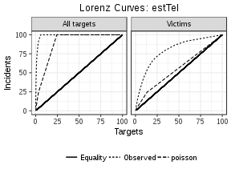

```

[[2]]
NULL

[[3]]
```


```

[[4]]
```

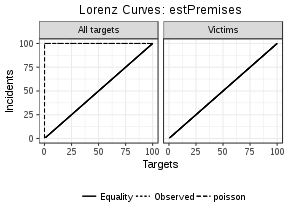

```

[[5]]
```


```

[[6]]
```

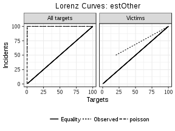

```

[[7]]
```

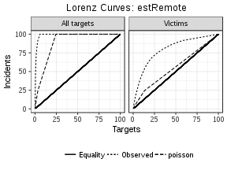

```

[[8]]
```

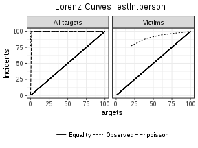

```r
lapply(extortion_columns_estimated, function(x)
{
    tryCatch(victim_lorenz(x, data = enve_final, family = "nbinom"),
             error = function(e) NULL)
})
```

```
Warning in densfun(x, parm[1], parm[2], ...): NaNs produced

Warning in densfun(x, parm[1], parm[2], ...): NaNs produced

Warning in densfun(x, parm[1], parm[2], ...): NaNs produced

Warning in densfun(x, parm[1], parm[2], ...): NaNs produced

Warning in densfun(x, parm[1], parm[2], ...): NaNs produced

Warning in densfun(x, parm[1], parm[2], ...): NaNs produced

Warning in densfun(x, parm[1], parm[2], ...): NaNs produced

Warning in densfun(x, parm[1], parm[2], ...): NaNs produced

Warning in densfun(x, parm[1], parm[2], ...): NaNs produced

Warning in densfun(x, parm[1], parm[2], ...): NaNs produced

Warning in densfun(x, parm[1], parm[2], ...): NaNs produced

Warning in densfun(x, parm[1], parm[2], ...): NaNs produced

Warning in densfun(x, parm[1], parm[2], ...): NaNs produced

Warning in densfun(x, parm[1], parm[2], ...): NaNs produced

Warning in densfun(x, parm[1], parm[2], ...): NaNs produced

Warning in densfun(x, parm[1], parm[2], ...): NaNs produced

Warning in densfun(x, parm[1], parm[2], ...): NaNs produced

Warning in densfun(x, parm[1], parm[2], ...): NaNs produced
```

```
[[1]]
```

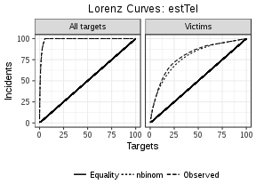

```

[[2]]
NULL

[[3]]
NULL

[[4]]
NULL

[[5]]
NULL

[[6]]
```

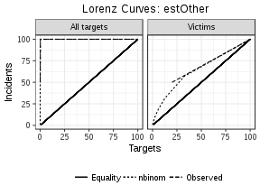

```

[[7]]
```

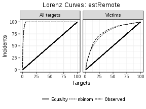

```

[[8]]
NULL
```


```r
lapply(extortion_columns_estimated, function(x)
{
    tryCatch(mc_gini_test(x, data = enve_final, family = "poisson",
                          plots = TRUE), error = function(e) NULL)
}) 
```

```
[[1]]
[[1]]$DV
[1] "estTel"

[[1]]$stat
Observed Gini Coefficient for estTel 
                            0.976768 

[[1]]$mc_mean
Monte Carlo mean 
       0.7831809 

[[1]]$mc_confint
  MC 2.5%  MC 97.5% 
0.7675959 0.7988065 

[[1]]$reps
Replicates 
      2000 

[[1]]$mc_test
Alternative Hypothesis 
                  TRUE 

[[1]]$plot
```

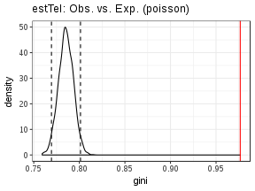

```


[[2]]
[[2]]$DV
[1] "estInternet"

[[2]]$stat
Observed Gini Coefficient for estInternet 
                                      NaN 

[[2]]$mc_mean
Monte Carlo mean 
             NaN 

[[2]]$mc_confint
 MC 2.5% MC 97.5% 
      NA       NA 

[[2]]$reps
Replicates 
      2000 

[[2]]$mc_test
Alternative Hypothesis 
                    NA 

[[2]]$plot
```

```
Warning: Removed 2000 rows containing non-finite values (stat_density).
```

```
Warning: Removed 2 rows containing missing values (geom_vline).
```

```
Warning: Removed 1 rows containing missing values (geom_vline).
```

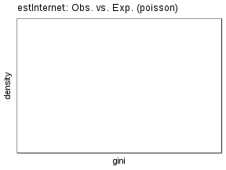

```


[[3]]
[[3]]$DV
[1] "estStreet"

[[3]]$stat
Observed Gini Coefficient for estStreet 
                              0.9994996 

[[3]]$mc_mean
Monte Carlo mean 
       0.9881602 

[[3]]$mc_confint
  MC 2.5%  MC 97.5% 
0.9834163 0.9921227 

[[3]]$reps
Replicates 
      2000 

[[3]]$mc_test
Alternative Hypothesis 
                  TRUE 

[[3]]$plot
```

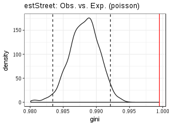

```


[[4]]
[[4]]$DV
[1] "estPremises"

[[4]]$stat
Observed Gini Coefficient for estPremises 
                                0.9995854 

[[4]]$mc_mean
Monte Carlo mean 
             NaN 

[[4]]$mc_confint
  MC 2.5%  MC 97.5% 
0.9979270 0.9995854 

[[4]]$reps
Replicates 
      2000 

[[4]]$mc_test
Alternative Hypothesis 
                 FALSE 

[[4]]$plot
```

```
Warning: Removed 279 rows containing non-finite values (stat_density).
```

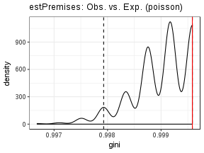

```


[[5]]
[[5]]$DV
[1] "estPiso"

[[5]]$stat
Observed Gini Coefficient for estPiso 
                            0.9995854 

[[5]]$mc_mean
Monte Carlo mean 
             NaN 

[[5]]$mc_confint
  MC 2.5%  MC 97.5% 
0.9966833 0.9995854 

[[5]]$reps
Replicates 
      2000 

[[5]]$mc_test
Alternative Hypothesis 
                 FALSE 

[[5]]$plot
```

```
Warning: Removed 38 rows containing non-finite values (stat_density).
```

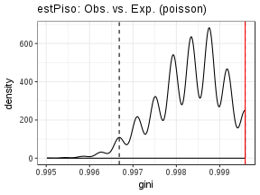

```


[[6]]
[[6]]$DV
[1] "estOther"

[[6]]$stat
Observed Gini Coefficient for estOther 
                             0.9985489 

[[6]]$mc_mean
Monte Carlo mean 
       0.9966691 

[[6]]$mc_confint
  MC 2.5%  MC 97.5% 
0.9941957 0.9987562 

[[6]]$reps
Replicates 
      2000 

[[6]]$mc_test
Alternative Hypothesis 
                 FALSE 

[[6]]$plot
```

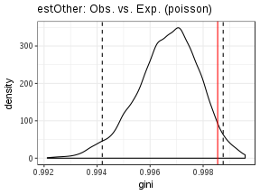

```


[[7]]
[[7]]$DV
[1] "estRemote"

[[7]]$stat
Observed Gini Coefficient for estRemote 
                               0.976768 

[[7]]$mc_mean
Monte Carlo mean 
       0.7831807 

[[7]]$mc_confint
  MC 2.5%  MC 97.5% 
0.7671783 0.7996649 

[[7]]$reps
Replicates 
      2000 

[[7]]$mc_test
Alternative Hypothesis 
                  TRUE 

[[7]]$plot
```


```


[[8]]
[[8]]$DV
[1] "estIn.person"

[[8]]$stat
Observed Gini Coefficient for estIn.person 
                                   0.99923 

[[8]]$mc_mean
Monte Carlo mean 
       0.9857749 

[[8]]$mc_confint
  MC 2.5%  MC 97.5% 
0.9809287 0.9904312 

[[8]]$reps
Replicates 
      2000 

[[8]]$mc_test
Alternative Hypothesis 
                  TRUE 

[[8]]$plot
```


```r
lapply(extortion_columns_estimated, function(x)
{
    tryCatch(mc_gini_test(x, data = enve_final, family = "nbinom",
                          plots = TRUE), error = function(e) NULL)
}) 
```

```
Warning in densfun(x, parm[1], parm[2], ...): NaNs produced
```

```
Warning in densfun(x, parm[1], parm[2], ...): NaNs produced

Warning in densfun(x, parm[1], parm[2], ...): NaNs produced

Warning in densfun(x, parm[1], parm[2], ...): NaNs produced

Warning in densfun(x, parm[1], parm[2], ...): NaNs produced

Warning in densfun(x, parm[1], parm[2], ...): NaNs produced

Warning in densfun(x, parm[1], parm[2], ...): NaNs produced

Warning in densfun(x, parm[1], parm[2], ...): NaNs produced

Warning in densfun(x, parm[1], parm[2], ...): NaNs produced

Warning in densfun(x, parm[1], parm[2], ...): NaNs produced

Warning in densfun(x, parm[1], parm[2], ...): NaNs produced

Warning in densfun(x, parm[1], parm[2], ...): NaNs produced

Warning in densfun(x, parm[1], parm[2], ...): NaNs produced

Warning in densfun(x, parm[1], parm[2], ...): NaNs produced

Warning in densfun(x, parm[1], parm[2], ...): NaNs produced

Warning in densfun(x, parm[1], parm[2], ...): NaNs produced

Warning in densfun(x, parm[1], parm[2], ...): NaNs produced

Warning in densfun(x, parm[1], parm[2], ...): NaNs produced

Warning in densfun(x, parm[1], parm[2], ...): NaNs produced
```

```
[[1]]
[[1]]$DV
[1] "estTel"

[[1]]$stat
Observed Gini Coefficient for estTel 
                            0.976768 

[[1]]$mc_mean
Monte Carlo mean 
        0.974751 

[[1]]$mc_confint
  MC 2.5%  MC 97.5% 
0.9696153 0.9794803 

[[1]]$reps
Replicates 
      2000 

[[1]]$mc_test
Alternative Hypothesis 
                 FALSE 

[[1]]$plot
```


```


[[2]]
NULL

[[3]]
NULL

[[4]]
NULL

[[5]]
NULL

[[6]]
[[6]]$DV
[1] "estOther"

[[6]]$stat
Observed Gini Coefficient for estOther 
                             0.9985489 

[[6]]$mc_mean
Monte Carlo mean 
             NaN 

[[6]]$mc_confint
  MC 2.5%  MC 97.5% 
0.9967963 0.9995854 

[[6]]$reps
Replicates 
      2000 

[[6]]$mc_test
Alternative Hypothesis 
                 FALSE 

[[6]]$plot
```

```
Warning: Removed 17 rows containing non-finite values (stat_density).
```


```


[[7]]
[[7]]$DV
[1] "estRemote"

[[7]]$stat
Observed Gini Coefficient for estRemote 
                               0.976768 

[[7]]$mc_mean
Monte Carlo mean 
       0.9746571 

[[7]]$mc_confint
  MC 2.5%  MC 97.5% 
0.9694264 0.9796342 

[[7]]$reps
Replicates 
      2000 

[[7]]$mc_test
Alternative Hypothesis 
                 FALSE 

[[7]]$plot
```


```


[[8]]
NULL
```

```r
dispersion_batch(extortion_columns_estimated, enve_final, print_option = "pandoc")
```


Table: Index of dispersion tests

                 Mean   Variance   var/mu          I   p-value     df   95% Chi-sq  stars 
-------------  ------  ---------  -------  ---------  --------  -----  -----------  ------
estTel          0.279      3.860   13.812   33301.56         0   2411     2526.345  ***   
estInternet     0.000      0.000       --         --        --   2411     2526.345  --    
estStreet       0.012      0.303   25.205   60770.03         0   2411     2526.345  ***   
estPremises     0.001      0.002    2.000    4822.00         0   2411     2526.345  ***   
estPiso         0.002      0.007    4.000    9644.00         0   2411     2526.345  ***   
estOther        0.003      0.008    2.498    6022.00         0   2411     2526.345  ***   
estRemote       0.279      3.860   13.812   33301.56         0   2411     2526.345  ***   
estIn.person    0.015      0.311   21.452   51719.63         0   2411     2526.345  ***   

```r
ks_test_batch(extortion_columns_estimated, enve_final, print_option = "pandoc", 
              family = "poisson")
```


Table: Kolmogorov-Smirnov Tests

                            KS.Statistic   p-value  stars 
-------------------------  -------------  --------  ------
estTel vs. poisson                 0.187     0.000  ***   
estInternet vs. poisson            0.000     1.000        
estStreet vs. poisson              0.011     0.580        
estPremises vs. poisson            0.000     0.999        
estPiso vs. poisson                0.001     0.992        
estOther vs. poisson               0.001     0.992        
estRemote vs. poisson              0.187     0.000  ***   
estIn.person vs. poisson           0.012     0.484        

```r
ks_test_batch(extortion_columns_estimated, enve_final, print_option = "pandoc", 
              family = "nbinom")
```

```
Warning in densfun(x, parm[1], parm[2], ...): NaNs produced

Warning in densfun(x, parm[1], parm[2], ...): NaNs produced

Warning in densfun(x, parm[1], parm[2], ...): NaNs produced
```

```
Error in stats::optim(x = c(0, 0, 0, 0, 0, 0, 0, 0, 0, 0, 0, 0, 0, 0, : non-finite finite-difference value [2]
```

```r
# poisson expected chisq

ext_est_chisq_p <- lapply(extortion_columns_estimated, function(x)
{
    tryCatch(chisq_count(x, data = enve_final, B = 2000), 
             error = function(e) NULL)
})

ext_est_chisq_p
```

```
[[1]]

	Chi-squared test for given probabilities with simulated p-value
	(based on 2000 replicates)

data:  estTel vs. poisson
X-squared = 47861, df = NA, p-value = 0.0004998


[[2]]
NULL

[[3]]

	Chi-squared test for given probabilities with simulated p-value
	(based on 2000 replicates)

data:  estStreet vs. poisson
X-squared = 28.61, df = NA, p-value = 0.0004998


[[4]]

	Chi-squared test for given probabilities with simulated p-value
	(based on 2000 replicates)

data:  estPremises vs. poisson
X-squared = 0.53445, df = NA, p-value = 0.5317


[[5]]

	Chi-squared test for given probabilities with simulated p-value
	(based on 2000 replicates)

data:  estPiso vs. poisson
X-squared = 2.3045, df = NA, p-value = 0.1439


[[6]]

	Chi-squared test for given probabilities with simulated p-value
	(based on 2000 replicates)

data:  estOther vs. poisson
X-squared = 68.969, df = NA, p-value = 0.003998


[[7]]

	Chi-squared test for given probabilities with simulated p-value
	(based on 2000 replicates)

data:  estRemote vs. poisson
X-squared = 43927, df = NA, p-value = 0.0004998


[[8]]

	Chi-squared test for given probabilities with simulated p-value
	(based on 2000 replicates)

data:  estIn.person vs. poisson
X-squared = 2029.3, df = NA, p-value = 0.0004998
```

```r
kable(chisq_tb(ext_est_chisq_p), format = "pandoc", digits = 3)
```

                           Chi-sq      Cramer's V   df   p.value        stars 
-------------------------  ----------  -----------  ---  -------------  ------
estTel vs. poisson         47860.63    --           --   0.0004997501   ***   
estStreet vs. poisson      28.60995    --           --   0.0004997501   ***   
estPremises vs. poisson    0.5344507   --           --   0.5317341            
estPiso vs. poisson        2.304543    --           --   0.143928             
estOther vs. poisson       68.96914    --           --   0.003998001    **    
estRemote vs. poisson      43926.69    --           --   0.0004997501   ***   
estIn.person vs. poisson   2029.269    --           --   0.0004997501   ***   

```r
ext_est_p_tb <- lapply(ext_est_chisq_p, function(x)
    {
    if(is.null(x)) {"skipping null objects"}
    else
    {
        kable(data.frame(x$observed, Exp = x$expected)[,c(1,2,4)],
          format = "pandoc", digits = 3, caption = "Expected: Poisson")
    }
    })


print_kables(ext_est_p_tb)
```

```


Table: Expected: Poisson

estTel    Freq   Exp.Freq
-------  -----  ---------
0         2276   1822.912
1           57    510.444
2           17     71.561
3           15      6.588
4           11      0.467
5+          36      0.028
[1] "skipping null objects"


Table: Expected: Poisson

estStreet    Freq   Exp.Freq
----------  -----  ---------
0            2409   2383.130
1               2     28.683
27              1      0.188


Table: Expected: Poisson

estPremises    Freq   Exp.Freq
------------  -----  ---------
0              2411   2409.955
2                 1      2.045


Table: Expected: Poisson

estPiso    Freq   Exp.Freq
--------  -----  ---------
0          2411   2407.946
4             1      4.054


Table: Expected: Poisson

estOther    Freq   Exp.Freq
---------  -----  ---------
0           2407   2404.005
1              4      7.980
4              1      0.014


Table: Expected: Poisson

estRemote    Freq   Exp.Freq
----------  -----  ---------
0            2276   1824.586
1              57    509.167
2              17     71.100
3              15      6.643
4              11      0.474
5+             36      0.030


Table: Expected: Poisson

estIn.person    Freq   Exp.Freq
-------------  -----  ---------
0               2407   2377.120
1                  2     34.621
2                  1      0.256
3+                 2      0.002
```

```r
# nbinom expected chisq

ext_est_chisq_nb <- lapply(extortion_columns_estimated, function(x)
{
    tryCatch(chisq_count(x, data = enve_final, B = 2000, 
                         family = "nbinom"), 
             error = function(e) NULL)
})
```

```
Warning in densfun(x, parm[1], parm[2], ...): NaNs produced

Warning in densfun(x, parm[1], parm[2], ...): NaNs produced

Warning in densfun(x, parm[1], parm[2], ...): NaNs produced

Warning in densfun(x, parm[1], parm[2], ...): NaNs produced

Warning in densfun(x, parm[1], parm[2], ...): NaNs produced

Warning in densfun(x, parm[1], parm[2], ...): NaNs produced

Warning in densfun(x, parm[1], parm[2], ...): NaNs produced

Warning in densfun(x, parm[1], parm[2], ...): NaNs produced

Warning in densfun(x, parm[1], parm[2], ...): NaNs produced

Warning in densfun(x, parm[1], parm[2], ...): NaNs produced

Warning in densfun(x, parm[1], parm[2], ...): NaNs produced

Warning in densfun(x, parm[1], parm[2], ...): NaNs produced

Warning in densfun(x, parm[1], parm[2], ...): NaNs produced

Warning in densfun(x, parm[1], parm[2], ...): NaNs produced

Warning in densfun(x, parm[1], parm[2], ...): NaNs produced

Warning in densfun(x, parm[1], parm[2], ...): NaNs produced

Warning in densfun(x, parm[1], parm[2], ...): NaNs produced

Warning in densfun(x, parm[1], parm[2], ...): NaNs produced

Warning in densfun(x, parm[1], parm[2], ...): NaNs produced
```

```r
ext_est_chisq_nb
```

```
[[1]]

	Chi-squared test for given probabilities

data:  estTel vs. nbinom
X-squared = 4.7391, df = 5, p-value = 0.4485


[[2]]
NULL

[[3]]
NULL

[[4]]
NULL

[[5]]
NULL

[[6]]

	Chi-squared test for given probabilities with simulated p-value
	(based on 2000 replicates)

data:  estOther vs. nbinom
X-squared = 0.44096, df = NA, p-value = 0.8261


[[7]]

	Chi-squared test for given probabilities

data:  estRemote vs. nbinom
X-squared = 4.9612, df = 5, p-value = 0.4206


[[8]]
NULL
```

```r
kable(chisq_tb(ext_est_chisq_nb), format = "pandoc", digits = 3)
```

                       Chi-sq      Cramer's V   df   p.value     stars 
---------------------  ----------  -----------  ---  ----------  ------
estTel vs. nbinom      4.739056    --           5    0.4485487         
estOther vs. nbinom    0.4409586   --           --   0.826087          
estRemote vs. nbinom   4.961199    --           5    0.4206339         

```r
ext_est_nb_tb <- lapply(ext_est_chisq_nb, function(x)
    {
    if(is.null(x)) {"skipping null objects"}
    else
    {
      kable(data.frame(x$observed, Exp = x$expected)[,c(1,2,4)],
          format = "pandoc", digits = 3, caption = "Expected: nbinom")  
    }
    })


print_kables(ext_est_nb_tb)
```

```


Table: Expected: nbinom

estTel    Freq   Exp.Freq
-------  -----  ---------
0         2276   2276.215
1           57     47.053
2           17     22.105
3           15     13.738
4           11      9.751
5+          36     43.138
[1] "skipping null objects"
[1] "skipping null objects"
[1] "skipping null objects"
[1] "skipping null objects"


Table: Expected: nbinom

estOther    Freq   Exp.Freq
---------  -----  ---------
0           2407   2406.939
1              4      3.332
4              1      1.728


Table: Expected: nbinom

estRemote    Freq   Exp.Freq
----------  -----  ---------
0            2276   2276.208
1              57     46.864
2              17     22.220
3              15     13.745
4              11      9.643
5+             36     43.321
[1] "skipping null objects"
```

## IQV

Calculate the index of qualitative variation per business, then analyse these figures.


```r
cols <- c("typeTelephone", "typeInternet", "typeStreet",
          "typePremises", "typeCobro.de.piso", "typeOther")

iqv_long <- iqv(enve_final[,cols])

iqv_long
```

```
[1] 17.85723
```

```r
enve_final$iqv_long <- apply(enve_final[,cols], 1, iqv)

enve_final$iqv_long <- round(enve_final$iqv_long, 2)

summary(enve_final$iqv_long)
```

```
   Min. 1st Qu.  Median    Mean 3rd Qu.    Max.    NA's 
 0.0000  0.0000  0.0000  0.2735  0.0000 60.0000    1175 
```

```r
# now for simp cats

cols_simp <- c("simpRemote", "simpIn.person", "simpOther")

iqv_simp <- iqv(enve_final[,cols_simp])

iqv_simp
```

```
[1] 21.06224
```

```r
enve_final$iqv_simp <- apply(enve_final[,cols_simp], 1, iqv)

enve_final$iqv_simp <- round(enve_final$iqv_simp, 2)

summary(enve_final$iqv_simp)
```

```
   Min. 1st Qu.  Median    Mean 3rd Qu.    Max.    NA's 
 0.0000  0.0000  0.0000  0.3419  0.0000 75.0000    1175 
```

```r
## Contingency tables to extortion frequency

batch_iqvs <- batch_chisq(enve_final, "extortions", 
                          c("iqv_long", "iqv_simp"))

kable(chisq_tb(batch_iqvs, stars = TRUE), "pandoc", 
      caption = "Chi-squared tests between 'extortions' and 'IQVs'" )
```


Table: Chi-squared tests between 'extortions' and 'IQVs'

                          Chi-sq     Cramer's V   df   p.value      stars 
------------------------  ---------  -----------  ---  -----------  ------
extortions vs. iqv_long   68.44094   0.135804     --   0.06396802         
extortions vs. iqv_simp   68.44094   0.135804     --   0.07596202         

```r
print_kables(chisq_list(batch_iqvs, option = "observed", print_option = "pandoc"))
```

```


Table: Observed counts of (rows) iqv_long vs. (cols) extortions

            0    1    2    3    4   5+
------  -----  ---  ---  ---  ---  ---
0        1086   63   17   15   13   37
45          0    0    1    0    0    0
53.33       1    0    0    0    0    0
60          4    0    0    0    0    0


Table: Observed counts of (rows) iqv_simp vs. (cols) extortions

            0    1    2    3    4   5+
------  -----  ---  ---  ---  ---  ---
0        1086   63   17   15   13   37
56.25       0    0    1    0    0    0
66.67       1    0    0    0    0    0
75          4    0    0    0    0    0
```

```r
print_kables(chisq_list(batch_iqvs, option = "ratio", print_option = "pandoc"))
```

```


Table: Ratio of observed to expected counts of (rows) iqv_long vs. (cols) extortions

             0       1        2       3       4      5+
------  ------  ------  -------  ------  ------  ------
0        1.000   1.005    0.949   1.005   1.005   1.005
45       0.000   0.000   68.722   0.000   0.000   0.000
53.33    1.134   0.000    0.000   0.000   0.000   0.000
60       1.134   0.000    0.000   0.000   0.000   0.000


Table: Ratio of observed to expected counts of (rows) iqv_simp vs. (cols) extortions

             0       1        2       3       4      5+
------  ------  ------  -------  ------  ------  ------
0        1.000   1.005    0.949   1.005   1.005   1.005
56.25    0.000   0.000   68.722   0.000   0.000   0.000
66.67    1.134   0.000    0.000   0.000   0.000   0.000
75       1.134   0.000    0.000   0.000   0.000   0.000
```

```r
print_kables(chisq_list(batch_iqvs, option = "percent", print_option = "pandoc"))
```

```


Table: Row percentages of (rows) iqv_long vs. (cols) extortions

              0      1        2      3      4     5+
------  -------  -----  -------  -----  -----  -----
0         88.22   5.12     1.38   1.22   1.06   3.01
45         0.00   0.00   100.00   0.00   0.00   0.00
53.33    100.00   0.00     0.00   0.00   0.00   0.00
60       100.00   0.00     0.00   0.00   0.00   0.00


Table: Row percentages of (rows) iqv_simp vs. (cols) extortions

              0      1        2      3      4     5+
------  -------  -----  -------  -----  -----  -----
0         88.22   5.12     1.38   1.22   1.06   3.01
56.25      0.00   0.00   100.00   0.00   0.00   0.00
66.67    100.00   0.00     0.00   0.00   0.00   0.00
75       100.00   0.00     0.00   0.00   0.00   0.00
```

# Bivariate EDA

## Extortion prevalence


```r
ivs <- c("bribes",
         "bribe_victim",
         "size",
         "subsector",
         "yearsquant",
         "years_deciles")

ext_p_batch_chsq <- batch_chisq(df = enve_final, DV = "extortion_victim", IV = ivs)

kable(chisq_tb(ext_p_batch_chsq, stars = TRUE), "pandoc", 
      caption = "Chi-square tests between 'extortion prevalence' and a set of DV")
```


Table: Chi-square tests between 'extortion prevalence' and a set of DV

                                     Chi-sq     Cramer's V   df   p.value     stars 
-----------------------------------  ---------  -----------  ---  ----------  ------
extortion_victim vs. bribes          7.202074   0.03863893   --   0.6751624         
extortion_victim vs. bribe_victim    3.475966   0.02684319   --   0.4862569         
extortion_victim vs. size            6.206986   0.03587044   6    0.4004075         
extortion_victim vs. subsector       28.4193    0.07675435   --   0.5312344         
extortion_victim vs. yearsquant      4.446167   0.03035912   8    0.8147945         
extortion_victim vs. years_deciles   11.24365   0.04827809   --   0.896052          

```r
print_kables(chisq_list(ext_p_batch_chsq, option = "observed", print_option = "pandoc"))
```

```


Table: Observed counts of (rows) bribes vs. (cols) extortion_victim

        no   yes   dk
---  -----  ----  ---
0     1839   257   42
1      113    17    1
2       50     2    2
3       27     3    1
4       17     3    1
5+      33     3    1


Table: Observed counts of (rows) bribe_victim vs. (cols) extortion_victim

         no   yes   dk
----  -----  ----  ---
no     1794   254   42
yes     240    28    6
dk       45     3    0


Table: Observed counts of (rows) size vs. (cols) extortion_victim

           no   yes   dk
-------  ----  ----  ---
Large     487    71   10
Medium    532    64   15
Small     509    72   16
Micro     551    78    7


Table: Observed counts of (rows) subsector vs. (cols) extortion_victim

                   no   yes   dk
---------------  ----  ----  ---
Retail             71     8    3
Mining             26     2    2
Construction      303    45    8
Manufacturing     418    62    4
Wholesale          95    16    4
Transport         115    14    6
Media              42     3    0
Finance            31     5    0
Real estate        35     3    2
Prof. services     29     8    1
Maintenance       181    21    4
Education          33     4    0
Health            338    47    6
Leisure            33     6    1
HotelsRestBar     319    41    7
Other              10     0    0


Table: Observed counts of (rows) yearsquant vs. (cols) extortion_victim

            no   yes   dk
--------  ----  ----  ---
[0,8]      461    66   12
(8,16]     364    61    8
(16,25]    425    54    8
(25,34]    446    55    9
(34,43]    383    49   11


Table: Observed counts of (rows) years_deciles vs. (cols) extortion_victim

            no   yes   dk
--------  ----  ----  ---
[0,4]      248    38    7
(4,8]      213    28    5
(8,12]     182    26    5
(12,16]    182    35    3
(16,21]    247    28    4
(21,25]    178    26    4
(25,30]    246    38    5
(30,34]    200    17    4
(34,39]    209    26    6
(39,43]    174    23    5
```

```r
print_kables(chisq_list(ext_p_batch_chsq, option = "ratio", print_option = "pandoc"))
```

```


Table: Ratio of observed to expected counts of (rows) bribes vs. (cols) extortion_victim

         no     yes      dk
---  ------  ------  ------
0     0.998   1.017   0.987
1     1.001   1.098   0.384
2     1.074   0.313   1.861
3     1.010   0.819   1.621
4     0.939   1.209   2.393
5+    1.035   0.686   1.358


Table: Ratio of observed to expected counts of (rows) bribe_victim vs. (cols) extortion_victim

          no     yes     dk
----  ------  ------  -----
no     0.996   1.029   1.01
yes    1.016   0.865   1.10
dk     1.088   0.529   0.00


Table: Ratio of observed to expected counts of (rows) size vs. (cols) extortion_victim

             no     yes      dk
-------  ------  ------  ------
Large     0.995   1.058   0.885
Medium    1.010   0.886   1.234
Small     0.989   1.021   1.347
Micro     1.005   1.038   0.553


Table: Ratio of observed to expected counts of (rows) subsector vs. (cols) extortion_victim

                     no     yes      dk
---------------  ------  ------  ------
Retail            1.005   0.826   1.838
Mining            1.005   0.564   3.350
Construction      0.987   1.070   1.129
Manufacturing     1.002   1.084   0.415
Wholesale         0.958   1.177   1.748
Transport         0.988   0.878   2.233
Media             1.083   0.564   0.000
Finance           0.999   1.175   0.000
Real estate       1.015   0.635   2.512
Prof. services    0.885   1.782   1.322
Maintenance       1.019   0.863   0.976
Education         1.035   0.915   0.000
Health            1.003   1.017   0.771
Leisure           0.957   1.269   1.256
HotelsRestBar     1.008   0.945   0.958
Other             1.160   0.000   0.000


Table: Ratio of observed to expected counts of (rows) yearsquant vs. (cols) extortion_victim

              no     yes      dk
--------  ------  ------  ------
[0,8]      0.992   1.036   1.119
(8,16]     0.975   1.192   0.928
(16,25]    1.012   0.938   0.825
(25,34]    1.015   0.913   0.887
(34,43]    1.003   0.936   1.248


Table: Ratio of observed to expected counts of (rows) years_deciles vs. (cols) extortion_victim

              no     yes      dk
--------  ------  ------  ------
[0,4]      0.982   1.098   1.201
(4,8]      1.005   0.963   1.021
(8,12]     0.991   1.033   1.180
(12,16]    0.960   1.346   0.685
(16,21]    1.027   0.849   0.720
(21,25]    0.993   1.058   0.966
(25,30]    0.988   1.113   0.869
(30,34]    1.050   0.651   0.910
(34,39]    1.006   0.913   1.251
(39,43]    0.999   0.964   1.244
```

```r
print_kables(chisq_list(ext_p_batch_chsq, option = "percent", print_option = "pandoc"))
```

```


Table: Row percentages of (rows) bribes vs. (cols) extortion_victim

         no     yes     dk
---  ------  ------  -----
0     86.01   12.02   1.96
1     86.26   12.98   0.76
2     92.59    3.70   3.70
3     87.10    9.68   3.23
4     80.95   14.29   4.76
5+    89.19    8.11   2.70


Table: Row percentages of (rows) bribe_victim vs. (cols) extortion_victim

          no     yes     dk
----  ------  ------  -----
no     85.84   12.15   2.01
yes    87.59   10.22   2.19
dk     93.75    6.25   0.00


Table: Row percentages of (rows) size vs. (cols) extortion_victim

             no     yes     dk
-------  ------  ------  -----
Large     85.74   12.50   1.76
Medium    87.07   10.47   2.45
Small     85.26   12.06   2.68
Micro     86.64   12.26   1.10


Table: Row percentages of (rows) subsector vs. (cols) extortion_victim

                      no     yes     dk
---------------  -------  ------  -----
Retail             86.59    9.76   3.66
Mining             86.67    6.67   6.67
Construction       85.11   12.64   2.25
Manufacturing      86.36   12.81   0.83
Wholesale          82.61   13.91   3.48
Transport          85.19   10.37   4.44
Media              93.33    6.67   0.00
Finance            86.11   13.89   0.00
Real estate        87.50    7.50   5.00
Prof. services     76.32   21.05   2.63
Maintenance        87.86   10.19   1.94
Education          89.19   10.81   0.00
Health             86.45   12.02   1.53
Leisure            82.50   15.00   2.50
HotelsRestBar      86.92   11.17   1.91
Other             100.00    0.00   0.00


Table: Row percentages of (rows) yearsquant vs. (cols) extortion_victim

              no     yes     dk
--------  ------  ------  -----
[0,8]      85.53   12.24   2.23
(8,16]     84.06   14.09   1.85
(16,25]    87.27   11.09   1.64
(25,34]    87.45   10.78   1.76
(34,43]    86.46   11.06   2.48


Table: Row percentages of (rows) years_deciles vs. (cols) extortion_victim

              no     yes     dk
--------  ------  ------  -----
[0,4]      84.64   12.97   2.39
(4,8]      86.59   11.38   2.03
(8,12]     85.45   12.21   2.35
(12,16]    82.73   15.91   1.36
(16,21]    88.53   10.04   1.43
(21,25]    85.58   12.50   1.92
(25,30]    85.12   13.15   1.73
(30,34]    90.50    7.69   1.81
(34,39]    86.72   10.79   2.49
(39,43]    86.14   11.39   2.48
```

## Extortion distribution


```r
ivs <- c("bribes",
         "bribe_victim",
         "size",
         "subsector",
         "yearsquant",
         "years_deciles")

ext_p_batch_chsq <- batch_chisq(df = enve_final, DV = "extortions", IV = ivs)

kable(chisq_tb(ext_p_batch_chsq, stars = TRUE), "pandoc", 
      caption = "Chi-square tests between 'extortion counts' and a set of DV")
```


Table: Chi-square tests between 'extortion counts' and a set of DV

                               Chi-sq     Cramer's V   df   p.value     stars 
-----------------------------  ---------  -----------  ---  ----------  ------
extortions vs. bribes          14.09462   0.03418637   --   0.946027          
extortions vs. bribe_victim    8.11865    0.04102402   --   0.6001999         
extortions vs. size            17.20452   0.04876093   15   0.3067862         
extortions vs. subsector       61.11313   0.07118584   --   0.8330835         
extortions vs. yearsquant      25.77896   0.0516909    --   0.1809095         
extortions vs. years_deciles   49.47846   0.06405226   --   0.3013493         

```r
print_kables(chisq_list(ext_p_batch_chsq, option = "observed", print_option = "pandoc"))
```

```


Table: Observed counts of (rows) bribes vs. (cols) extortions

         0    1    2    3    4   5+
---  -----  ---  ---  ---  ---  ---
0     1881   94   41   29   20   73
1      114    6    1    2    3    5
2       52    1    0    0    0    1
3       28    1    1    0    0    1
4       18    1    0    0    1    1
5+      34    1    0    1    0    1


Table: Observed counts of (rows) bribe_victim vs. (cols) extortions

          0    1    2    3    4   5+
----  -----  ---  ---  ---  ---  ---
no     1836   93   39   29   20   73
yes     246   10    2    3    4    9
dk       45    1    2    0    0    0


Table: Observed counts of (rows) size vs. (cols) extortions

            0    1    2    3    4   5+
-------  ----  ---  ---  ---  ---  ---
Large     497   24    9    7    4   27
Medium    547   16    9   11    6   22
Small     525   32   12    7    4   17
Micro     558   32   13    7   10   16


Table: Observed counts of (rows) subsector vs. (cols) extortions

                    0    1    2    3    4   5+
---------------  ----  ---  ---  ---  ---  ---
Retail             74    2    0    2    0    4
Mining             28    1    0    0    0    1
Construction      311   15    7    5    2   16
Manufacturing     422   21   13    7    8   13
Wholesale          99    9    3    2    0    2
Transport         121    8    1    0    2    3
Media              42    0    0    0    0    3
Finance            31    0    2    0    1    2
Real estate        37    1    0    0    0    2
Prof. services     30    1    2    1    0    4
Maintenance       185   10    2    3    1    5
Education          33    1    0    1    0    2
Health            344   18    8    5    7    9
Leisure            34    2    0    1    0    3
HotelsRestBar     326   15    5    5    3   13
Other              10    0    0    0    0    0


Table: Observed counts of (rows) yearsquant vs. (cols) extortions

             0    1    2    3    4   5+
--------  ----  ---  ---  ---  ---  ---
[0,8]      473   25    7   13    7   14
(8,16]     372   23    8    8    5   17
(16,25]    433   21   14    4    1   14
(25,34]    455   19    8    1    5   22
(34,43]    394   16    6    6    6   15


Table: Observed counts of (rows) years_deciles vs. (cols) extortions

             0    1    2    3    4   5+
--------  ----  ---  ---  ---  ---  ---
[0,4]      255   11    6    6    6    9
(4,8]      218   14    1    7    1    5
(8,12]     187    9    4    3    3    7
(12,16]    185   14    4    5    2   10
(16,21]    251   12    6    2    1    7
(21,25]    182    9    8    2    0    7
(25,30]    251   11    6    0    3   18
(30,34]    204    8    2    1    2    4
(34,39]    215    9    4    3    2    8
(39,43]    179    7    2    3    4    7
```

```r
print_kables(chisq_list(ext_p_batch_chsq, option = "ratio", print_option = "pandoc"))
```

```


Table: Ratio of observed to expected counts of (rows) bribes vs. (cols) extortions

          0       1       2       3       4      5+
---  ------  ------  ------  ------  ------  ------
0     0.998   1.020   1.076   1.022   0.940   1.004
1     0.987   1.062   0.428   1.151   2.302   1.123
2     1.092   0.429   0.000   0.000   0.000   0.545
3     1.024   0.748   1.809   0.000   0.000   0.949
4     0.972   1.104   0.000   0.000   4.786   1.401
5+    1.042   0.627   0.000   2.037   0.000   0.795


Table: Ratio of observed to expected counts of (rows) bribe_victim vs. (cols) extortions

           0       1       2       3       4      5+
----  ------  ------  ------  ------  ------  ------
no     0.996   1.032   1.047   1.046   0.962   1.027
yes    1.018   0.846   0.409   0.825   1.467   0.966
dk     1.063   0.483   2.337   0.000   0.000   0.000


Table: Ratio of observed to expected counts of (rows) size vs. (cols) extortions

              0       1       2       3       4      5+
-------  ------  ------  ------  ------  ------  ------
Large     0.992   0.980   0.889   0.929   0.708   1.398
Medium    1.015   0.607   0.826   1.357   0.987   1.059
Small     0.997   1.243   1.127   0.884   0.673   0.838
Micro     0.995   1.167   1.147   0.830   1.580   0.740


Table: Ratio of observed to expected counts of (rows) subsector vs. (cols) extortions

                      0       1       2       3       4      5+
---------------  ------  ------  ------  ------  ------  ------
Retail            1.023   0.566   0.000   1.838   0.000   1.435
Mining            1.058   0.773   0.000   0.000   0.000   0.980
Construction      0.991   0.977   1.103   1.059   0.565   1.322
Manufacturing     0.989   1.006   1.507   1.090   1.661   0.790
Wholesale         0.976   1.815   1.463   1.311   0.000   0.512
Transport         1.016   1.374   0.416   0.000   1.489   0.654
Media             1.058   0.000   0.000   0.000   0.000   1.961
Finance           0.976   0.000   3.116   0.000   2.792   1.634
Real estate       1.049   0.580   0.000   0.000   0.000   1.471
Prof. services    0.895   0.610   2.952   1.984   0.000   3.096
Maintenance       1.018   1.126   0.545   1.098   0.488   0.714
Education         1.011   0.627   0.000   2.037   0.000   1.590
Health            0.998   1.068   1.148   0.964   1.799   0.677
Leisure           0.964   1.160   0.000   1.884   0.000   2.206
HotelsRestBar     1.007   0.948   0.764   1.027   0.822   1.042
Other             1.134   0.000   0.000   0.000   0.000   0.000


Table: Ratio of observed to expected counts of (rows) yearsquant vs. (cols) extortions

               0       1       2       3       4      5+
--------  ------  ------  ------  ------  ------  ------
[0,8]      0.995   1.076   0.728   1.818   1.305   0.764
(8,16]     0.974   1.232   1.036   1.393   1.161   1.155
(16,25]    1.008   1.000   1.613   0.619   0.206   0.846
(25,34]    1.012   0.864   0.880   0.148   0.985   1.269
(34,43]    1.009   0.838   0.760   1.021   1.361   0.996


Table: Ratio of observed to expected counts of (rows) years_deciles vs. (cols) extortions

               0       1       2       3       4      5+
--------  ------  ------  ------  ------  ------  ------
[0,4]      0.987   0.871   1.149   1.544   2.058   0.904
(4,8]      1.005   1.320   0.228   2.145   0.409   0.598
(8,12]     0.996   0.980   1.053   1.062   1.415   0.967
(12,16]    0.954   1.476   1.020   1.713   0.914   1.337
(16,21]    1.020   0.998   1.206   0.540   0.360   0.738
(21,25]    0.992   1.004   2.157   0.725   0.000   0.990
(25,30]    0.985   0.883   1.165   0.000   1.043   1.832
(30,34]    1.047   0.840   0.508   0.341   0.910   0.532
(34,39]    1.012   0.866   0.931   0.938   0.834   0.976
(39,43]    1.005   0.804   0.555   1.119   1.990   1.019
```

```r
print_kables(chisq_list(ext_p_batch_chsq, option = "percent", print_option = "pandoc"))
```

```


Table: Row percentages of (rows) bribes vs. (cols) extortions

          0      1      2      3      4     5+
---  ------  -----  -----  -----  -----  -----
0     87.98   4.40   1.92   1.36   0.94   3.41
1     87.02   4.58   0.76   1.53   2.29   3.82
2     96.30   1.85   0.00   0.00   0.00   1.85
3     90.32   3.23   3.23   0.00   0.00   3.23
4     85.71   4.76   0.00   0.00   4.76   4.76
5+    91.89   2.70   0.00   2.70   0.00   2.70


Table: Row percentages of (rows) bribe_victim vs. (cols) extortions

           0      1      2      3      4     5+
----  ------  -----  -----  -----  -----  -----
no     87.85   4.45   1.87   1.39   0.96   3.49
yes    89.78   3.65   0.73   1.09   1.46   3.28
dk     93.75   2.08   4.17   0.00   0.00   0.00


Table: Row percentages of (rows) size vs. (cols) extortions

              0      1      2      3      4     5+
-------  ------  -----  -----  -----  -----  -----
Large     87.50   4.23   1.58   1.23   0.70   4.75
Medium    89.53   2.62   1.47   1.80   0.98   3.60
Small     87.94   5.36   2.01   1.17   0.67   2.85
Micro     87.74   5.03   2.04   1.10   1.57   2.52


Table: Row percentages of (rows) subsector vs. (cols) extortions

                       0      1      2      3      4      5+
---------------  -------  -----  -----  -----  -----  ------
Retail             90.24   2.44   0.00   2.44   0.00    4.88
Mining             93.33   3.33   0.00   0.00   0.00    3.33
Construction       87.36   4.21   1.97   1.40   0.56    4.49
Manufacturing      87.19   4.34   2.69   1.45   1.65    2.69
Wholesale          86.09   7.83   2.61   1.74   0.00    1.74
Transport          89.63   5.93   0.74   0.00   1.48    2.22
Media              93.33   0.00   0.00   0.00   0.00    6.67
Finance            86.11   0.00   5.56   0.00   2.78    5.56
Real estate        92.50   2.50   0.00   0.00   0.00    5.00
Prof. services     78.95   2.63   5.26   2.63   0.00   10.53
Maintenance        89.81   4.85   0.97   1.46   0.49    2.43
Education          89.19   2.70   0.00   2.70   0.00    5.41
Health             87.98   4.60   2.05   1.28   1.79    2.30
Leisure            85.00   5.00   0.00   2.50   0.00    7.50
HotelsRestBar      88.83   4.09   1.36   1.36   0.82    3.54
Other             100.00   0.00   0.00   0.00   0.00    0.00


Table: Row percentages of (rows) yearsquant vs. (cols) extortions

               0      1      2      3      4     5+
--------  ------  -----  -----  -----  -----  -----
[0,8]      87.76   4.64   1.30   2.41   1.30   2.60
(8,16]     85.91   5.31   1.85   1.85   1.15   3.93
(16,25]    88.91   4.31   2.87   0.82   0.21   2.87
(25,34]    89.22   3.73   1.57   0.20   0.98   4.31
(34,43]    88.94   3.61   1.35   1.35   1.35   3.39


Table: Row percentages of (rows) years_deciles vs. (cols) extortions

               0      1      2      3      4     5+
--------  ------  -----  -----  -----  -----  -----
[0,4]      87.03   3.75   2.05   2.05   2.05   3.07
(4,8]      88.62   5.69   0.41   2.85   0.41   2.03
(8,12]     87.79   4.23   1.88   1.41   1.41   3.29
(12,16]    84.09   6.36   1.82   2.27   0.91   4.55
(16,21]    89.96   4.30   2.15   0.72   0.36   2.51
(21,25]    87.50   4.33   3.85   0.96   0.00   3.37
(25,30]    86.85   3.81   2.08   0.00   1.04   6.23
(30,34]    92.31   3.62   0.90   0.45   0.90   1.81
(34,39]    89.21   3.73   1.66   1.24   0.83   3.32
(39,43]    88.61   3.47   0.99   1.49   1.98   3.47
```

## Extortion vs Years

A brief EDA analysis of the years variable, using a facet plot of the bivariate relationship with extortion incidents.


```r
enve_final %>%
    select(extortions, years, yearsquant) %>%
    mutate("All years" = "All years")-> gg_ext_years1
```

```
Error in select(., extortions, years, yearsquant): unused arguments (extortions, years, yearsquant)
```

```r
melt(gg_ext_years1, 
     id.vars = c("extortions", "years"), 
     value.name = "yearsquant") -> gg_ext_years1
```

```
Error in melt(gg_ext_years1, id.vars = c("extortions", "years"), value.name = "yearsquant"): object 'gg_ext_years1' not found
```

```r
enve_final %>%
    select(extortions, years, years_deciles) %>%
    mutate("All years" = "All years")-> gg_ext_years2
```

```
Error in select(., extortions, years, years_deciles): unused arguments (extortions, years, years_deciles)
```

```r
melt(gg_ext_years2, 
     id.vars = c("extortions", "years"), 
     value.name = "years_deciles") -> gg_ext_years2
```

```
Error in melt(gg_ext_years2, id.vars = c("extortions", "years"), value.name = "years_deciles"): object 'gg_ext_years2' not found
```

```r
cbind(gg_ext_years1, years_deciles = gg_ext_years2$years_deciles) -> gg_ext_years
```

```
Error in cbind(gg_ext_years1, years_deciles = gg_ext_years2$years_deciles): object 'gg_ext_years1' not found
```

```r
gg_ext_years$yearsquant <- factor(gg_ext_years$yearsquant)
```

```
Error in factor(gg_ext_years$yearsquant): object 'gg_ext_years' not found
```

```r
gg_ext_years$yearsquant <- relevel(gg_ext_years$yearsquant, ref = "All years")
```

```
Error in relevel(gg_ext_years$yearsquant, ref = "All years"): object 'gg_ext_years' not found
```

```r
gg_ext_years$yearsquant <- factor(gg_ext_years$yearsquant, 
                                  levels = c("All years", levels(enve_final$yearsquant)))
```

```
Error in factor(gg_ext_years$yearsquant, levels = c("All years", levels(enve_final$yearsquant))): object 'gg_ext_years' not found
```

```r
gg_ext_years$years_deciles <- relevel(gg_ext_years$years_deciles, ref = "All years")
```

```
Error in relevel(gg_ext_years$years_deciles, ref = "All years"): object 'gg_ext_years' not found
```

```r
gg_ext_years$years_deciles <- factor(gg_ext_years$years_deciles, 
                                  levels = c("All years", levels(enve_final$years_deciles)))
```

```
Error in factor(gg_ext_years$years_deciles, levels = c("All years", levels(enve_final$years_deciles))): object 'gg_ext_years' not found
```

```r
gg_ext_years <- select(gg_ext_years, -variable)
```

```
Error in select(gg_ext_years, -variable): unused argument (-variable)
```

```r
years_scatterplots <- ggplot(gg_ext_years, aes(x = years, y = extortions))
```

```
Error in ggplot(gg_ext_years, aes(x = years, y = extortions)): object 'gg_ext_years' not found
```

```r
years_scatterplots + geom_point() + theme_bw() + geom_smooth(method = "lm")
```

```
Error in eval(expr, envir, enclos): object 'years_scatterplots' not found
```


```r
# Quintiles

years_scatterplots + 
    geom_point() + 
    theme_bw() + 
    facet_wrap(~ yearsquant, scales = "free_x") + 
    geom_smooth(method = "lm")
```

```
Error in eval(expr, envir, enclos): object 'years_scatterplots' not found
```

```r
# For deciles

years_scatterplots + 
    geom_point() + 
    theme_bw() + 
    facet_wrap(~ years_deciles, scales = "free_x") + 
    geom_smooth(method = "lm")
```

```
Error in eval(expr, envir, enclos): object 'years_scatterplots' not found
```

```r
# Excluding the all business line

years_scatterplots <- ggplot(subset(gg_ext_years, yearsquant != "All years"),
                             aes(x = years, y = extortions))
```

```
Error in subset(gg_ext_years, yearsquant != "All years"): object 'gg_ext_years' not found
```

```r
years_scatterplots + 
    geom_point() + 
    theme_bw() + 
    geom_smooth(method = "lm", aes(colour = yearsquant))
```

```
Error in eval(expr, envir, enclos): object 'years_scatterplots' not found
```

```r
## Only for victims

years_scatterplots <- ggplot(subset(gg_ext_years, yearsquant != "All years" & 
                                        extortions > 0),
                             aes(x = years, y = extortions))
```

```
Error in subset(gg_ext_years, yearsquant != "All years" & extortions > : object 'gg_ext_years' not found
```

```r
years_scatterplots + 
    geom_point() + 
    theme_bw() + 
    geom_smooth(method = "lm", aes(colour = yearsquant), se = FALSE) 
```

```
Error in eval(expr, envir, enclos): object 'years_scatterplots' not found
```

```r
years_scatterplots + 
    geom_point() + 
    theme_bw() + 
    geom_smooth(method = "lm", aes(colour = yearsquant), se = FALSE) +
    scale_x_sqrt()
```

```
Error in eval(expr, envir, enclos): object 'years_scatterplots' not found
```

```r
# Only for victims with a grid

years_scatterplots <- ggplot(subset(gg_ext_years, extortions > 0),
                             aes(x = years, y = extortions))
```

```
Error in subset(gg_ext_years, extortions > 0): object 'gg_ext_years' not found
```

```r
# Quintiles

years_scatterplots + 
    geom_point() + 
    theme_bw() + 
    facet_wrap(~ yearsquant, scales = "free_x") + 
    geom_smooth(method = "lm")
```

```
Error in eval(expr, envir, enclos): object 'years_scatterplots' not found
```

```r
# For deciles

years_scatterplots + 
    geom_point() + 
    theme_bw() + 
    facet_wrap(~ years_deciles, scales = "free_x") + 
    geom_smooth(method = "lm")
```

```
Error in eval(expr, envir, enclos): object 'years_scatterplots' not found
```

```r
## wrap grid victims not a victim
gg_ext_years$victim <- ifelse(gg_ext_years$extortions > 0, "yes", "no")
```

```
Error in ifelse(gg_ext_years$extortions > 0, "yes", "no"): object 'gg_ext_years' not found
```

```r
gg_ext_years$pop <- "All businesses"
```

```
Error in gg_ext_years$pop <- "All businesses": object 'gg_ext_years' not found
```

```r
subset(gg_ext_years, victim == "yes") -> gg_ext_years_tmp
```

```
Error in subset(gg_ext_years, victim == "yes"): object 'gg_ext_years' not found
```

```r
gg_ext_years_tmp$pop <- "Victims"
```

```
Error in gg_ext_years_tmp$pop <- "Victims": object 'gg_ext_years_tmp' not found
```

```r
rbind(gg_ext_years, gg_ext_years_tmp) -> gg_ext_years
```

```
Error in rbind(gg_ext_years, gg_ext_years_tmp): object 'gg_ext_years' not found
```

```r
select(gg_ext_years, - victim) -> gg_ext_years
```

```
Error in select(gg_ext_years, -victim): unused argument (-victim)
```

```r
years_scatterplots <- ggplot(gg_ext_years,
                             aes(x = years, y = extortions))
```

```
Error in ggplot(gg_ext_years, aes(x = years, y = extortions)): object 'gg_ext_years' not found
```

```r
years_scatterplots + 
    geom_point() + 
    theme_bw() + 
    facet_grid(pop ~ yearsquant, scales = "free_x") + 
    geom_smooth(method = "lm")
```

```
Error in eval(expr, envir, enclos): object 'years_scatterplots' not found
```

```r
years_scatterplots + 
    geom_point() + 
    theme_bw() + 
    facet_grid(pop ~ years_deciles, scales = "free_x") + 
    geom_smooth(method = "lm")
```

```
Error in eval(expr, envir, enclos): object 'years_scatterplots' not found
```

```r
years_scatterplots + 
    geom_point() + 
    theme_bw() + 
    facet_grid(pop ~ . , scales = "free_x") + 
    geom_smooth(method = "lm", aes(colour = yearsquant), se = FALSE)
```

```
Error in eval(expr, envir, enclos): object 'years_scatterplots' not found
```

```r
years_scatterplots <- ggplot(subset(gg_ext_years, yearsquant != "All years"),
                             aes(x = years, y = extortions))
```

```
Error in subset(gg_ext_years, yearsquant != "All years"): object 'gg_ext_years' not found
```

```r
years_scatterplots + 
    geom_point() + 
    theme_bw() + 
    facet_grid(pop ~ . , scales = "free_x") + 
    geom_smooth(method = "lm", aes(colour = yearsquant), se = FALSE)
```

```
Error in eval(expr, envir, enclos): object 'years_scatterplots' not found
```

# State level

Provide a brief summary of state-level figures. Include:

- n business (n())
- n victims (extortion and bribery) (filter by, then n())
- n repeat victims (filter by)
- n incidents (sum(extortions))
- n repeat incidents (n incidents - n victims)
- Gini index per state (for all and for business) (lets see...)
- plot of lorenz curve per state (let see...)


```r
enve_final %>%
    group_by(CVE_ENT, NOM_ENT) %>%
    summarise(n = n(),
              incidents = sum(extortions)) -> state_incidents_df

enve_final %>%
    filter(extortion_victim == "yes") %>%
    group_by(NOM_ENT) %>%
    summarise(victims = n()) -> state_evics_df

enve_final %>%
    filter(bribe_victim == "yes") %>%
    group_by(NOM_ENT) %>%
    summarise(bribe_vics = n()) -> state_bvics_df

enve_final %>%
    filter(rep_extortion_victim == 1) %>%
    group_by(NOM_ENT) %>%
    summarise(rep_ext_vics = n()) -> state_rep_vics_df

state_incidents_df %>%
    full_join(state_evics_df) %>%
    full_join(state_rep_vics_df) %>%
    mutate(rep_inci = incidents - rep_ext_vics) %>%
    full_join(state_bvics_df) -> state_summary
```

```
Joining, by = "NOM_ENT"
Joining, by = "NOM_ENT"
Joining, by = "NOM_ENT"
```

```r
state_gini <- by(enve_final$extortions, enve_final$NOM_ENT, ineq::Gini)


state_gini_df <- data.frame(Gini = state_gini[1:32])

state_gini_victims <- by(enve_final$extortions[enve_final$extortions > 0],
                         enve_final$NOM_ENT[enve_final$extortions > 0],
                         ineq::Gini)

state_gini_df$Gini_vic <- data.frame(state_gini_victims[1:32])[,1]

state_gini_df$NOM_ENT <- as.factor(rownames(state_gini_df))

state_gini_tests <- by(enve_final$extortions, enve_final$NOM_ENT, mc_gini_test)

state_mc_gini_l <- lapply(state_gini_tests[1:32], function(x) x$mc_mean)

state_mc_gini_df <- data.frame(P.Gini= unlist(state_mc_gini_l))

rownames(state_mc_gini_df) <- names(state_mc_gini_l)

state_mc_gini_df$NOM_ENT <- as.factor(names(state_mc_gini_l))

state_mc_gini_hyp <- sapply(state_gini_tests[1:32], 
                            function(x) if(x$mc_test == TRUE) "***" 
                                        else "")

unlist(state_mc_gini_hyp) -> state_mc_gini_df$test

#### now mc gini test for victims

state_gini_vic_tests <- by(enve_final$extortions[enve_final$extortions > 0],
                         enve_final$NOM_ENT[enve_final$extortions > 0],
                         mc_gini_test)

state_mc_gini_vic_l <- lapply(state_gini_vic_tests[1:32], function(x) x$mc_mean)

state_mc_gini_df$P.Gini.vic <- data.frame(unlist(state_mc_gini_vic_l))[,1]

state_mc_gini_vic_hyp <- sapply(state_gini_vic_tests[1:32], 
                            function(x) if(x$mc_test == TRUE) "***" 
                                        else "")

unlist(state_mc_gini_vic_hyp) -> state_mc_gini_df$vic.test

state_summary %>%
    left_join(state_gini_df) %>%
    left_join(state_mc_gini_df) -> state_summary
```

```
Joining, by = "NOM_ENT"
Joining, by = "NOM_ENT"
```

```r
state_summary$Gini <- as.numeric(unname(state_summary$Gini))
state_summary$Gini_vic <- as.numeric(unname(state_summary$Gini_vic))

kable(state_summary, format = "pandoc", digits = 3)
```


 CVE_ENT  NOM_ENT                             n   incidents   victims   rep_ext_vics   rep_inci   bribe_vics    Gini   Gini_vic   P.Gini  test    P.Gini.vic  vic.test 
--------  --------------------------------  ---  ----------  --------  -------------  ---------  -----------  ------  ---------  -------  -----  -----------  ---------
       1  AGUASCALIENTES                     78          46        11              7         39           12   0.930      0.506    0.635  ***          0.252  ***      
       2  BAJA CALIFORNIA                    68          42        12              9         33            4   0.892      0.389    0.626  ***          0.275           
       3  BAJA CALIFORNIA SUR                71          42         6              3         39            5   0.971      0.659    0.635  ***          0.179  ***      
       4  CAMPECHE                           54          16         4              3         13            9   0.954      0.375    0.771  ***          0.217           
       5  COAHUILA DE ZARAGOZA               80          62         9              6         56            6   0.952      0.573    0.576  ***          0.190  ***      
       6  COLIMA                             68          44         6              4         40            9   0.965      0.598    0.615  ***          0.173  ***      
       7  CHIAPAS                            67          83        12              8         75            5   0.909      0.491    0.475  ***          0.195  ***      
       8  CHIHUAHUA                          78          51         6              3         48            8   0.967      0.565    0.611  ***          0.161  ***      
       9  DISTRITO FEDERAL                   82          31         9              6         25           10   0.926      0.330    0.727  ***          0.270           
      10  DURANGO                            70          37        13              6         31           11   0.906      0.495    0.659  ***          0.309  ***      
      11  GUANAJUATO                         93          47         9              7         40           10   0.947      0.454    0.670  ***          0.218  ***      
      12  GUERRERO                           77          32         6              3         29            4   0.962      0.510    0.708  ***          0.205  ***      
      13  HIDALGO                            98          46        12              8         38           12   0.945      0.547    0.686  ***          0.262  ***      
      14  JALISCO                            93          24         9              4         20           10   0.949      0.472    0.793  ***          0.304           
      15  MEXICO                             77          63        12              9         54            8   0.923      0.504    0.563  ***          0.225  ***      
      16  MICHOACAN DE OCAMPO                69          50         7              7         43            5   0.947      0.474    0.592  ***          0.181  ***      
      17  MORELOS                            70          31         8              5         26            7   0.941      0.488    0.696  ***          0.248  ***      
      18  NAYARIT                            79          38         7              4         34           10   0.961      0.556    0.678  ***          0.206  ***      
      19  NUEVO LEON                         82         105        15             11         94           10   0.927      0.599    0.468  ***          0.197  ***      
      20  OAXACA                             79           5         4              1          4           16   0.957      0.150       --                  --           
      21  PUEBLA                             80          64        11              9         55            8   0.927      0.472    0.567  ***          0.211  ***      
      22  QUERETARO                          79          28         8              7         21            5   0.928      0.286    0.739  ***          0.267           
      23  QUINTANA ROO                       67          15         8              4         11            3   0.915      0.292    0.816  ***          0.356           
      24  SAN LUIS POTOSI                    77          33         7              6         27           10   0.946      0.407    0.702  ***          0.222  ***      
      25  SINALOA                            72          77        12              8         69           11   0.911      0.469    0.506  ***          0.204  ***      
      26  SONORA                             77          52         9              4         48           16   0.960      0.654    0.606  ***          0.210  ***      
      27  TABASCO                            64          25         4              2         23            9   0.974      0.590    0.718  ***          0.171  ***      
      28  TAMAULIPAS                         72          35         9              5         30            8   0.940      0.521    0.676  ***          0.251  ***      
      29  TLAXCALA                           75          25        10              6         19            9   0.906      0.292    0.751  ***          0.321           
      30  VERACRUZ DE IGNACIO DE LA LLAVE    72          29         5              3         26           12   0.961      0.441    0.714  ***          0.189  ***      
      31  YUCATAN                            73          25        13              6         19            7   0.880      0.326    0.746  ***          0.369           
      32  ZACATECAS                          71          69        12              7         62            5   0.937      0.627    0.526  ***          0.213  ***      

```r
state_table <- by(enve_final$extortions, enve_final$NOM_ENT, victim_table)

lapply(seq_along(state_table), function(x) 
    {
    cap <- names(state_table)[x]
    final <- kable(state_table[[x]], format = "pandoc", digits = 3, 
                   caption = cap)
    return(final)
    }) -> state_dist_list

print_kables(state_dist_list)
```

```


Table: AGUASCALIENTES

 Events   Prevalence   Incidence   Repeats   Target_%   Victim_%   Incident_%
-------  -----------  ----------  --------  ---------  ---------  -----------
      0           67          --        --     85.897         --           --
      1            4           4        --      5.128     36.364        8.696
      2            2           4         2      2.564     18.182        8.696
      3            2           6         4      2.564     18.182       13.043
      8            1           8         7      1.282      9.091       17.391
      9            1           9         8      1.282      9.091       19.565
     15            1          15        14      1.282      9.091       32.609


Table: BAJA CALIFORNIA

 Events   Prevalence   Incidence   Repeats   Target_%   Victim_%   Incident_%
-------  -----------  ----------  --------  ---------  ---------  -----------
      0           56          --        --     82.353         --           --
      1            3           3        --      4.412     25.000        7.143
      2            3           6         3      4.412     25.000       14.286
      3            2           6         4      2.941     16.667       14.286
      5            1           5         4      1.471      8.333       11.905
      6            1           6         5      1.471      8.333       14.286
      7            1           7         6      1.471      8.333       16.667
      9            1           9         8      1.471      8.333       21.429


Table: BAJA CALIFORNIA SUR

 Events   Prevalence   Incidence   Repeats   Target_%   Victim_%   Incident_%
-------  -----------  ----------  --------  ---------  ---------  -----------
      0           65          --        --     91.549         --           --
      1            3           3        --      4.225     50.000        7.143
      3            1           3         2      1.408     16.667        7.143
      4            1           4         3      1.408     16.667        9.524
     32            1          32        31      1.408     16.667       76.190


Table: CAMPECHE

 Events   Prevalence   Incidence   Repeats   Target_%   Victim_%   Incident_%
-------  -----------  ----------  --------  ---------  ---------  -----------
      0           50          --        --     92.593         --           --
      1            1           1        --      1.852         25         6.25
      2            1           2         1      1.852         25        12.50
      5            1           5         4      1.852         25        31.25
      8            1           8         7      1.852         25        50.00


Table: CHIAPAS

 Events   Prevalence   Incidence   Repeats   Target_%   Victim_%   Incident_%
-------  -----------  ----------  --------  ---------  ---------  -----------
      0           55          --        --     82.090         --           --
      1            4           4        --      5.970     33.333        4.819
      2            2           4         2      2.985     16.667        4.819
      6            1           6         5      1.493      8.333        7.229
     11            2          22        20      2.985     16.667       26.506
     13            1          13        12      1.493      8.333       15.663
     15            1          15        14      1.493      8.333       18.072
     19            1          19        18      1.493      8.333       22.892


Table: CHIHUAHUA

 Events   Prevalence   Incidence   Repeats   Target_%   Victim_%   Incident_%
-------  -----------  ----------  --------  ---------  ---------  -----------
      0           72          --        --     92.308         --           --
      1            3           3        --      3.846     50.000        5.882
      4            1           4         3      1.282     16.667        7.843
     21            1          21        20      1.282     16.667       41.176
     23            1          23        22      1.282     16.667       45.098


Table: COAHUILA DE ZARAGOZA

 Events   Prevalence   Incidence   Repeats   Target_%   Victim_%   Incident_%
-------  -----------  ----------  --------  ---------  ---------  -----------
      0           71          --        --      88.75         --           --
      1            3           3        --       3.75     33.333        4.839
      2            2           4         2       2.50     22.222        6.452
      3            1           3         2       1.25     11.111        4.839
     10            1          10         9       1.25     11.111       16.129
     20            1          20        19       1.25     11.111       32.258
     22            1          22        21       1.25     11.111       35.484


Table: COLIMA

 Events   Prevalence   Incidence   Repeats   Target_%   Victim_%   Incident_%
-------  -----------  ----------  --------  ---------  ---------  -----------
      0           62          --        --     91.176         --           --
      1            2           2        --      2.941     33.333        4.545
      2            1           2         1      1.471     16.667        4.545
      3            1           3         2      1.471     16.667        6.818
     10            1          10         9      1.471     16.667       22.727
     27            1          27        26      1.471     16.667       61.364


Table: DISTRITO FEDERAL

 Events   Prevalence   Incidence   Repeats   Target_%   Victim_%   Incident_%
-------  -----------  ----------  --------  ---------  ---------  -----------
      0           73          --        --     89.024         --           --
      1            3           3        --      3.659     33.333        9.677
      3            2           6         4      2.439     22.222       19.355
      4            1           4         3      1.220     11.111       12.903
      6            3          18        15      3.659     33.333       58.065


Table: DURANGO

 Events   Prevalence   Incidence   Repeats   Target_%   Victim_%   Incident_%
-------  -----------  ----------  --------  ---------  ---------  -----------
      0           57          --        --     81.429         --           --
      1            7           7        --     10.000     53.846       18.919
      2            2           4         2      2.857     15.385       10.811
      3            1           3         2      1.429      7.692        8.108
      4            1           4         3      1.429      7.692       10.811
      5            1           5         4      1.429      7.692       13.514
     14            1          14        13      1.429      7.692       37.838


Table: GUANAJUATO

 Events   Prevalence   Incidence   Repeats   Target_%   Victim_%   Incident_%
-------  -----------  ----------  --------  ---------  ---------  -----------
      0           84          --        --     90.323         --           --
      1            2           2        --      2.151     22.222        4.255
      2            2           4         2      2.151     22.222        8.511
      4            1           4         3      1.075     11.111        8.511
      5            1           5         4      1.075     11.111       10.638
      6            1           6         5      1.075     11.111       12.766
     12            1          12        11      1.075     11.111       25.532
     14            1          14        13      1.075     11.111       29.787


Table: GUERRERO

 Events   Prevalence   Incidence   Repeats   Target_%   Victim_%   Incident_%
-------  -----------  ----------  --------  ---------  ---------  -----------
      0           71          --        --     92.208         --           --
      1            3           3        --      3.896     50.000        9.375
      5            1           5         4      1.299     16.667       15.625
      9            1           9         8      1.299     16.667       28.125
     15            1          15        14      1.299     16.667       46.875


Table: HIDALGO

 Events   Prevalence   Incidence   Repeats   Target_%   Victim_%   Incident_%
-------  -----------  ----------  --------  ---------  ---------  -----------
      0           86          --        --     87.755         --           --
      1            4           4        --      4.082     33.333        8.696
      2            4           8         4      4.082     33.333       17.391
      3            2           6         4      2.041     16.667       13.043
      5            1           5         4      1.020      8.333       10.870
     23            1          23        22      1.020      8.333       50.000


Table: JALISCO

 Events   Prevalence   Incidence   Repeats   Target_%   Victim_%   Incident_%
-------  -----------  ----------  --------  ---------  ---------  -----------
      0           84          --        --     90.323         --           --
      1            5           5        --      5.376     55.556       20.833
      2            2           4         2      2.151     22.222       16.667
      5            1           5         4      1.075     11.111       20.833
     10            1          10         9      1.075     11.111       41.667


Table: MEXICO

 Events   Prevalence   Incidence   Repeats   Target_%   Victim_%   Incident_%
-------  -----------  ----------  --------  ---------  ---------  -----------
      0           65          --        --     84.416         --           --
      1            3           3        --      3.896     25.000        4.762
      2            2           4         2      2.597     16.667        6.349
      3            1           3         2      1.299      8.333        4.762
      4            2           8         6      2.597     16.667       12.698
      5            1           5         4      1.299      8.333        7.937
      7            1           7         6      1.299      8.333       11.111
     13            1          13        12      1.299      8.333       20.635
     20            1          20        19      1.299      8.333       31.746


Table: MICHOACAN DE OCAMPO

 Events   Prevalence   Incidence   Repeats   Target_%   Victim_%   Incident_%
-------  -----------  ----------  --------  ---------  ---------  -----------
      0           62          --        --     89.855         --           --
      2            2           4        --      2.899     28.571            8
      4            3          12         9      4.348     42.857           24
      9            1           9         8      1.449     14.286           18
     25            1          25        24      1.449     14.286           50


Table: MORELOS

 Events   Prevalence   Incidence   Repeats   Target_%   Victim_%   Incident_%
-------  -----------  ----------  --------  ---------  ---------  -----------
      0           62          --        --     88.571         --           --
      1            3           3        --      4.286       37.5        9.677
      2            1           2         1      1.429       12.5        6.452
      3            1           3         2      1.429       12.5        9.677
      4            1           4         3      1.429       12.5       12.903
      5            1           5         4      1.429       12.5       16.129
     14            1          14        13      1.429       12.5       45.161


Table: NAYARIT

 Events   Prevalence   Incidence   Repeats   Target_%   Victim_%   Incident_%
-------  -----------  ----------  --------  ---------  ---------  -----------
      0           72          --        --     91.139         --           --
      1            3           3        --      3.797     42.857        7.895
      3            1           3         2      1.266     14.286        7.895
      4            1           4         3      1.266     14.286       10.526
      8            1           8         7      1.266     14.286       21.053
     20            1          20        19      1.266     14.286       52.632


Table: NUEVO LEON

 Events   Prevalence   Incidence   Repeats   Target_%   Victim_%   Incident_%
-------  -----------  ----------  --------  ---------  ---------  -----------
      0           67          --        --     81.707         --           --
      1            4           4        --      4.878     26.667        3.810
      2            1           2         1      1.220      6.667        1.905
      3            4          12         8      4.878     26.667       11.429
      4            2           8         6      2.439     13.333        7.619
      5            1           5         4      1.220      6.667        4.762
     10            1          10         9      1.220      6.667        9.524
     32            2          64        62      2.439     13.333       60.952


Table: OAXACA

 Events   Prevalence   Incidence   Repeats   Target_%   Victim_%   Incident_%
-------  -----------  ----------  --------  ---------  ---------  -----------
      0           75          --        --     94.937         --           --
      1            3           3        --      3.797         75           60
      2            1           2         1      1.266         25           40


Table: PUEBLA

 Events   Prevalence   Incidence   Repeats   Target_%   Victim_%   Incident_%
-------  -----------  ----------  --------  ---------  ---------  -----------
      0           69          --        --      86.25         --           --
      1            2           2        --       2.50     18.182        3.125
      2            2           4         2       2.50     18.182        6.250
      4            2           8         6       2.50     18.182       12.500
      5            2          10         8       2.50     18.182       15.625
      7            1           7         6       1.25      9.091       10.938
     12            1          12        11       1.25      9.091       18.750
     21            1          21        20       1.25      9.091       32.812


Table: QUERETARO

 Events   Prevalence   Incidence   Repeats   Target_%   Victim_%   Incident_%
-------  -----------  ----------  --------  ---------  ---------  -----------
      0           71          --        --     89.873         --           --
      1            1           1        --      1.266       12.5        3.571
      2            2           4         2      2.532       25.0       14.286
      3            1           3         2      1.266       12.5       10.714
      4            2           8         6      2.532       25.0       28.571
      5            1           5         4      1.266       12.5       17.857
      7            1           7         6      1.266       12.5       25.000


Table: QUINTANA ROO

 Events   Prevalence   Incidence   Repeats   Target_%   Victim_%   Incident_%
-------  -----------  ----------  --------  ---------  ---------  -----------
      0           59          --        --     88.060         --           --
      1            4           4        --      5.970       50.0       26.667
      2            2           4         2      2.985       25.0       26.667
      3            1           3         2      1.493       12.5       20.000
      4            1           4         3      1.493       12.5       26.667


Table: SAN LUIS POTOSI

 Events   Prevalence   Incidence   Repeats   Target_%   Victim_%   Incident_%
-------  -----------  ----------  --------  ---------  ---------  -----------
      0           70          --        --     90.909         --           --
      1            1           1        --      1.299     14.286        3.030
      2            2           4         2      2.597     28.571       12.121
      4            1           4         3      1.299     14.286       12.121
      5            1           5         4      1.299     14.286       15.152
      6            1           6         5      1.299     14.286       18.182
     13            1          13        12      1.299     14.286       39.394


Table: SINALOA

 Events   Prevalence   Incidence   Repeats   Target_%   Victim_%   Incident_%
-------  -----------  ----------  --------  ---------  ---------  -----------
      0           60          --        --     83.333         --           --
      1            4           4        --      5.556     33.333        5.195
      3            2           6         4      2.778     16.667        7.792
      4            1           4         3      1.389      8.333        5.195
      8            1           8         7      1.389      8.333       10.390
     12            1          12        11      1.389      8.333       15.584
     14            2          28        26      2.778     16.667       36.364
     15            1          15        14      1.389      8.333       19.481


Table: SONORA

 Events   Prevalence   Incidence   Repeats   Target_%   Victim_%   Incident_%
-------  -----------  ----------  --------  ---------  ---------  -----------
      0           68          --        --     88.312         --           --
      1            5           5        --      6.494     55.556        9.615
      3            1           3         2      1.299     11.111        5.769
      5            1           5         4      1.299     11.111        9.615
      6            1           6         5      1.299     11.111       11.538
     33            1          33        32      1.299     11.111       63.462


Table: TABASCO

 Events   Prevalence   Incidence   Repeats   Target_%   Victim_%   Incident_%
-------  -----------  ----------  --------  ---------  ---------  -----------
      0           60          --        --     93.750         --           --
      1            2           2        --      3.125         50            8
      3            1           3         2      1.562         25           12
     20            1          20        19      1.562         25           80


Table: TAMAULIPAS

 Events   Prevalence   Incidence   Repeats   Target_%   Victim_%   Incident_%
-------  -----------  ----------  --------  ---------  ---------  -----------
      0           63          --        --     87.500         --           --
      1            4           4        --      5.556     44.444       11.429
      2            2           4         2      2.778     22.222       11.429
      3            1           3         2      1.389     11.111        8.571
     12            2          24        22      2.778     22.222       68.571


Table: TLAXCALA

 Events   Prevalence   Incidence   Repeats   Target_%   Victim_%   Incident_%
-------  -----------  ----------  --------  ---------  ---------  -----------
      0           65          --        --     86.667         --           --
      1            4           4        --      5.333         40           16
      3            4          12         8      5.333         40           48
      4            1           4         3      1.333         10           16
      5            1           5         4      1.333         10           20


Table: VERACRUZ DE IGNACIO DE LA LLAVE

 Events   Prevalence   Incidence   Repeats   Target_%   Victim_%   Incident_%
-------  -----------  ----------  --------  ---------  ---------  -----------
      0           67          --        --     93.056         --           --
      1            2           2        --      2.778         40        6.897
      5            1           5         4      1.389         20       17.241
      9            1           9         8      1.389         20       31.034
     13            1          13        12      1.389         20       44.828


Table: YUCATAN

 Events   Prevalence   Incidence   Repeats   Target_%   Victim_%   Incident_%
-------  -----------  ----------  --------  ---------  ---------  -----------
      0           60          --        --     82.192         --           --
      1            7           7        --      9.589     53.846           28
      2            3           6         3      4.110     23.077           24
      3            1           3         2      1.370      7.692           12
      4            1           4         3      1.370      7.692           16
      5            1           5         4      1.370      7.692           20


Table: ZACATECAS

 Events   Prevalence   Incidence   Repeats   Target_%   Victim_%   Incident_%
-------  -----------  ----------  --------  ---------  ---------  -----------
      0           59          --        --     83.099         --           --
      1            5           5        --      7.042     41.667        7.246
      2            2           4         2      2.817     16.667        5.797
      3            1           3         2      1.408      8.333        4.348
      4            1           4         3      1.408      8.333        5.797
      5            1           5         4      1.408      8.333        7.246
     19            1          19        18      1.408      8.333       27.536
     29            1          29        28      1.408      8.333       42.029
```

```r
victim_lorenz("extortions", data = enve_final, family = "poisson",
              reps = 500, by_var = "NOM_ABR")
```


Compare the bribe variable from the `area_level` data set with the one from this state summary above


```r
bribe_mean <- mean(state_summary$bribe_vics)

state_summary %>%
    left_join(area_level) %>%
    dplyr::select(bribe_vics, log_bribe_vic) %>%
    mutate(log_bribe_vic2 = log(bribe_vics) - log(bribe_mean),
           dif = log_bribe_vic2 - log_bribe_vic) -> bribe_test
```

```
Joining, by = c("CVE_ENT", "NOM_ENT")
```

```
Adding missing grouping variables: `CVE_ENT`
```

```r
bribe_test$test <- round(bribe_test$dif, 2) == 0

kable(bribe_test, format = "pandoc")
```


 CVE_ENT   bribe_vics   log_bribe_vic   log_bribe_vic2          dif  test  
--------  -----------  --------------  ---------------  -----------  ------
       1           12      -0.1954920        0.3375144    0.5330065  FALSE 
       2            4      -0.1656391       -0.7610978   -0.5954588  FALSE 
       3            5      -0.1954920       -0.5379543   -0.3424623  FALSE 
       4            9      -0.0544134        0.0498324    0.1042458  FALSE 
       5            6      -0.5565054       -0.3556327    0.2008726  FALSE 
       6            9      -1.0529423        0.0498324    1.1027746  FALSE 
       7            5       0.3855379       -0.5379543   -0.9234922  FALSE 
       8            8      -0.2580124       -0.0679507    0.1900617  FALSE 
       9           10      -0.2262637        0.1551929    0.3814566  FALSE 
      10           11      -0.7475606        0.2505031    0.9980637  FALSE 
      11           10      -0.3961627        0.1551929    0.5513556  FALSE 
      12            4       0.4976552       -0.7610978   -1.2587530  FALSE 
      13           12      -0.4339030        0.3375144    0.7714175  FALSE 
      14           10      -0.1084806        0.1551929    0.2636735  FALSE 
      15            8       0.2782923       -0.0679507   -0.3462430  FALSE 
      16            5       0.0215725       -0.5379543   -0.5595268  FALSE 
      17            7       0.4188743       -0.2014821   -0.6203563  FALSE 
      18           10      -0.1954920        0.1551929    0.3506849  FALSE 
      19           10      -0.2580124        0.1551929    0.4132053  FALSE 
      20           16       0.3855379        0.6251965    0.2396587  FALSE 
      21            8       0.3510517       -0.0679507   -0.4190023  FALSE 
      22            5      -0.6009571       -0.5379543    0.0630028  FALSE 
      23            3       0.3684434       -1.0487799   -1.4172233  FALSE 
      24           10      -0.7475606        0.1551929    0.9027535  FALSE 
      25           11      -0.1656391        0.2505031    0.4161421  FALSE 
      26           16      -0.6962673        0.6251965    1.3214638  FALSE 
      27            9      -0.3597951        0.0498324    0.4096274  FALSE 
      28            8       0.9231209       -0.0679507   -0.9910716  FALSE 
      29            9       0.4668835        0.0498324   -0.4170511  FALSE 
      30           12       0.1792014        0.3375144    0.1583130  FALSE 
      31            7       0.0921901       -0.2014821   -0.2936721  FALSE 
      32            5      -0.0031201       -0.5379543   -0.5348342  FALSE 

# Models

There are two important changes to this modelling exercise. First, I am testing the influence of new state level variables that had not been previosly considered, as well as see if using years_deciles provides a better variable that yearsquant. Second, I will model extortion via two part models, using zero-inflated negative binomial and hurdle models. As the multilevel ZINB can only calculate a fixed zero-inflation factor (i.e. it is not poissbile to specify a separate equation for the zero-inflation part), I will focus on the hurdle models instead, testing hypotheses using these models.

## Model data frame

To avoid any problems with NA values that may lead to non-convergence, work with a data set onf only the relevant variables.


```r
enve_final %>%
    select(extortions,
           bribes,
           yearsquant,
           years_deciles,
           subsector,
           size,
           log_deaths,
           log_bribe_vic,
           log_drug_crim,
           log_wpn_crim,
           law_index,
           comp_index,
           log_pop,
           log_nbus,
           state = NOM_ABR) -> enve_model
```

```
Error in select(., extortions, bribes, yearsquant, years_deciles, subsector, : unused arguments (extortions, bribes, yearsquant, years_deciles, subsector, size, log_deaths, log_bribe_vic, log_drug_crim, log_wpn_crim, law_index, comp_index, log_pop, log_nbus, state = NOM_ABR)
```

```r
#### JUST FOR THIS TESTING EXERCISE, ADD MORE VICTIMS TO THE OTHER AND MEDIA CATEGORY

##### Comment out before sending #####

enve_model$extortions[which(enve_model$subsector == "Other")] <- rpois(10,1)
```

```
Error in enve_model$extortions[which(enve_model$subsector == "Other")] <- rpois(10, : object 'enve_model' not found
```

```r
enve_model$extortions[which(enve_model$subsector == "Media")] <- rpois(45, 0.5)
```

```
Error in enve_model$extortions[which(enve_model$subsector == "Media")] <- rpois(45, : object 'enve_model' not found
```

```r
##### Comment out before sending #####

##### Return to normal


enve_model$extortion_victim <- ifelse(enve_model$extortions == 0, 0, 1)
```

```
Error in ifelse(enve_model$extortions == 0, 0, 1): object 'enve_model' not found
```

```r
summary(enve_model)
```

```
Error in summary(enve_model): object 'enve_model' not found
```

```r
summary(factor(enve_model$extortion_victim))
```

```
Error in factor(enve_model$extortion_victim): object 'enve_model' not found
```

```r
summary(factor(enve_final$extortion_victim))
```

```
  no  yes   dk 
2079  285   48 
```

```r
length(enve_model[is.na(enve_model)])
```

```
Error in eval(expr, envir, enclos): object 'enve_model' not found
```


## Negative binomial

I will not test every single model as before, as we have done this before. Thus I will start with the "best model" from previous exercises, changing the state homicide rate for the log deaths and log pop variables instead. To minimise any syntax mistakes, I will work with formula objects and update them as I proceed.


```r
count_formula <- as.formula("extortions ~ 
                            bribes + 
                            yearsquant + 
                            subsector + 
                            size + 
                            (1 | state)")
```


```r
mnb1 <- glmmadmb(count_formula, data = enve_model, family = "nbinom", zeroInflation=FALSE)
```

```
Error in glmmadmb(count_formula, data = enve_model, family = "nbinom", : could not find function "glmmadmb"
```

```r
summary(mnb1)
```

```
Error in summary(mnb1): object 'mnb1' not found
```

```r
get_glmmadmb(mnb1)
```

```
Warning in get_glmmadmb(mnb1): This function only works with glmmadmb objects;
                it appears you do not have this package installed.
```

```
Error in get_glmmadmb(mnb1): object 'mnb1' not found
```

```r
# vs Poisson

mp1 <- glmmadmb(count_formula, data = enve_model, family = "poisson", zeroInflation=FALSE)
```

```
Error in glmmadmb(count_formula, data = enve_model, family = "poisson", : could not find function "glmmadmb"
```

```r
summary(mp1)
```

```
Error in summary(mp1): object 'mp1' not found
```

```r
get_glmmadmb(mp1)
```

```
Warning in get_glmmadmb(mp1): This function only works with glmmadmb objects;
                it appears you do not have this package installed.
```

```
Error in get_glmmadmb(mp1): object 'mp1' not found
```

```r
screenreg(list(mnb1, mp1), single.row = TRUE,
          custom.model.names = c("negbin", "poisson"))
```

```
Error in screenreg(list(mnb1, mp1), single.row = TRUE, custom.model.names = c("negbin", : could not find function "screenreg"
```

```r
lrtest(mp1, mnb1)
```

```
Error in lrtest(mp1, mnb1): object 'mp1' not found
```

```r
# vs single level nb

nb1 <- update(mnb1, . ~ . - (1 | state))
```

```
Error in update(mnb1, . ~ . - (1 | state)): object 'mnb1' not found
```

```r
summary(nb1)
```

```
Error in summary(nb1): object 'nb1' not found
```

```r
get_glmmadmb(nb1)
```

```
Warning in get_glmmadmb(nb1): This function only works with glmmadmb objects;
                it appears you do not have this package installed.
```

```
Error in get_glmmadmb(nb1): object 'nb1' not found
```

```r
screenreg(list(mnb1, nb1), single.row = TRUE,
          custom.model.names = c("multilevel nb", "single level nb"))
```

```
Error in screenreg(list(mnb1, nb1), single.row = TRUE, custom.model.names = c("multilevel nb", : could not find function "screenreg"
```

```r
lrtest(nb1, mnb1)
```

```
Error in lrtest(nb1, mnb1): object 'nb1' not found
```

```r
vif(mnb1)
```

```
Error in vif(mnb1): object 'mnb1' not found
```

```r
lm1 <- lm(update(count_formula, . ~ . - (1 | state)), data = enve_model)
```

```
Error in is.data.frame(data): object 'enve_model' not found
```

```r
summary(lm1)
```

```
Error in summary(lm1): object 'lm1' not found
```

```r
vif(lm1)
```

```
Error in vif(lm1): object 'lm1' not found
```

```r
mnb1_drop <- drop1(mnb1, test = "Chisq")
```

```
Error in drop1(mnb1, test = "Chisq"): object 'mnb1' not found
```

```r
mnb1_drop
```

```
Error in eval(expr, envir, enclos): object 'mnb1_drop' not found
```

```r
# NB null, multi and one level

nb_null <- update(mnb1, . ~ 1)
```

```
Error in update(mnb1, . ~ 1): object 'mnb1' not found
```

```r
summary(nb_null)
```

```
Error in summary(nb_null): object 'nb_null' not found
```

```r
get_glmmadmb(nb_null)
```

```
Warning in get_glmmadmb(nb_null): This function only works with glmmadmb objects;
                it appears you do not have this package installed.
```

```
Error in get_glmmadmb(nb_null): object 'nb_null' not found
```

```r
lrtest(nb_null, nb1)
```

```
Error in lrtest(nb_null, nb1): object 'nb_null' not found
```

```r
lrtest(nb_null, mnb1)
```

```
Error in lrtest(nb_null, mnb1): object 'nb_null' not found
```

```r
mnb_null <- update(mnb1, . ~ 1 + (1 | state))
```

```
Error in update(mnb1, . ~ 1 + (1 | state)): object 'mnb1' not found
```

```r
summary(mnb_null)
```

```
Error in summary(mnb_null): object 'mnb_null' not found
```

```r
get_glmmadmb(mnb_null)
```

```
Warning in get_glmmadmb(mnb_null): This function only works with glmmadmb objects;
                it appears you do not have this package installed.
```

```
Error in get_glmmadmb(mnb_null): object 'mnb_null' not found
```

```r
lrtest(nb_null, mnb_null)
```

```
Error in lrtest(nb_null, mnb_null): object 'nb_null' not found
```

```r
lrtest(mnb_null, mnb1)
```

```
Error in lrtest(mnb_null, mnb1): object 'mnb_null' not found
```


```r
mnb2 <- update(mnb1, . ~ . - yearsquant + years_deciles)
```

```
Error in update(mnb1, . ~ . - yearsquant + years_deciles): object 'mnb1' not found
```

```r
summary(mnb2)
```

```
Error in summary(mnb2): object 'mnb2' not found
```

```r
get_glmmadmb(mnb2)
```

```
Warning in get_glmmadmb(mnb2): This function only works with glmmadmb objects;
                it appears you do not have this package installed.
```

```
Error in get_glmmadmb(mnb2): object 'mnb2' not found
```

```r
screenreg(list(mnb1, mnb2), single.row = TRUE,
          custom.model.names = c("year qunitiles", "year deciles"))
```

```
Error in screenreg(list(mnb1, mnb2), single.row = TRUE, custom.model.names = c("year qunitiles", : could not find function "screenreg"
```

Now start introducing the state-level variables. First, log deaths, then the saturated model, then test them. Also run excluding all business-level and compare.


```r
mnb3 <- update(mnb1, . ~ . + log_deaths + log_pop)
```

```
Error in update(mnb1, . ~ . + log_deaths + log_pop): object 'mnb1' not found
```

```r
summary(mnb3)
```

```
Error in summary(mnb3): object 'mnb3' not found
```

```r
get_glmmadmb(mnb3)
```

```
Warning in get_glmmadmb(mnb3): This function only works with glmmadmb objects;
                it appears you do not have this package installed.
```

```
Error in get_glmmadmb(mnb3): object 'mnb3' not found
```

```r
lrtest(mnb1, mnb3)
```

```
Error in lrtest(mnb1, mnb3): object 'mnb1' not found
```

```r
vif(mnb3)
```

```
Error in vif(mnb3): object 'mnb3' not found
```

```r
lm2 <- update(lm1, . ~ . + log_deaths + log_pop)
```

```
Error in update(lm1, . ~ . + log_deaths + log_pop): object 'lm1' not found
```

```r
vif(lm2)
```

```
Error in vif(lm2): object 'lm2' not found
```

```r
# drop pop

mnb4 <- update(mnb3, . ~ . - log_pop)
```

```
Error in update(mnb3, . ~ . - log_pop): object 'mnb3' not found
```

```r
summary(mnb4)
```

```
Error in summary(mnb4): object 'mnb4' not found
```

```r
get_glmmadmb(mnb4)
```

```
Warning in get_glmmadmb(mnb4): This function only works with glmmadmb objects;
                it appears you do not have this package installed.
```

```
Error in get_glmmadmb(mnb4): object 'mnb4' not found
```

```r
lrtest(mnb1, mnb4, mnb3)
```

```
Error in lrtest(mnb1, mnb4, mnb3): object 'mnb1' not found
```

```r
vif(mnb4)
```

```
Error in vif(mnb4): object 'mnb4' not found
```

```r
lm3 <- update(lm2, . ~ . - log_pop)
```

```
Error in update(lm2, . ~ . - log_pop): object 'lm2' not found
```

```r
vif(lm3)
```

```
Error in vif(lm3): object 'lm3' not found
```

```r
# drop deaths

mnb5 <- update(mnb3, . ~ . - log_deaths)
```

```
Error in update(mnb3, . ~ . - log_deaths): object 'mnb3' not found
```

```r
summary(mnb5)
```

```
Error in summary(mnb5): object 'mnb5' not found
```

```r
get_glmmadmb(mnb5)
```

```
Warning in get_glmmadmb(mnb5): This function only works with glmmadmb objects;
                it appears you do not have this package installed.
```

```
Error in get_glmmadmb(mnb5): object 'mnb5' not found
```

```r
lrtest(mnb1, mnb5, mnb3)
```

```
Error in lrtest(mnb1, mnb5, mnb3): object 'mnb1' not found
```

```r
vif(mnb5)
```

```
Error in vif(mnb5): object 'mnb5' not found
```

```r
lm4 <- update(lm2, . ~ . - log_deaths)
```

```
Error in update(lm2, . ~ . - log_deaths): object 'lm2' not found
```

```r
vif(lm4)
```

```
Error in vif(lm4): object 'lm4' not found
```

```r
####
screenreg(list(negbin = mnb1, 
               "deaths + pop" = mnb3,
               "deaths" = mnb4,
               "pop" = mnb5), 
          single.row = TRUE)
```

```
Error in screenreg(list(negbin = mnb1, `deaths + pop` = mnb3, deaths = mnb4, : could not find function "screenreg"
```


```r
mnb6 <- update(mnb1, . ~ . + log_bribe_vic + log_nbus)
```

```
Error in update(mnb1, . ~ . + log_bribe_vic + log_nbus): object 'mnb1' not found
```

```r
summary(mnb6)
```

```
Error in summary(mnb6): object 'mnb6' not found
```

```r
get_glmmadmb(mnb6)
```

```
Warning in get_glmmadmb(mnb6): This function only works with glmmadmb objects;
                it appears you do not have this package installed.
```

```
Error in get_glmmadmb(mnb6): object 'mnb6' not found
```

```r
vif(mnb6)
```

```
Error in vif(mnb6): object 'mnb6' not found
```

```r
lm5 <- update(lm1, . ~ . + log_bribe_vic + log_nbus)
```

```
Error in update(lm1, . ~ . + log_bribe_vic + log_nbus): object 'lm1' not found
```

```r
vif(lm5)
```

```
Error in vif(lm5): object 'lm5' not found
```

```r
# drop nbus

mnb7 <- update(mnb1, . ~ . + log_bribe_vic)
```

```
Error in update(mnb1, . ~ . + log_bribe_vic): object 'mnb1' not found
```

```r
summary(mnb7)
```

```
Error in summary(mnb7): object 'mnb7' not found
```

```r
get_glmmadmb(mnb7)
```

```
Warning in get_glmmadmb(mnb7): This function only works with glmmadmb objects;
                it appears you do not have this package installed.
```

```
Error in get_glmmadmb(mnb7): object 'mnb7' not found
```

```r
vif(mnb7)
```

```
Error in vif(mnb7): object 'mnb7' not found
```

```r
lm6 <- update(lm5, . ~ . - log_nbus)
```

```
Error in update(lm5, . ~ . - log_nbus): object 'lm5' not found
```

```r
vif(lm5)
```

```
Error in vif(lm5): object 'lm5' not found
```

```r
lrtest(mnb1, mnb7, mnb6)
```

```
Error in lrtest(mnb1, mnb7, mnb6): object 'mnb1' not found
```

```r
# test vs business-level bribes

mnb8 <- update(mnb6, . ~ . - bribes)
```

```
Error in update(mnb6, . ~ . - bribes): object 'mnb6' not found
```

```r
summary(mnb8)
```

```
Error in summary(mnb8): object 'mnb8' not found
```

```r
get_glmmadmb(mnb8)
```

```
Warning in get_glmmadmb(mnb8): This function only works with glmmadmb objects;
                it appears you do not have this package installed.
```

```
Error in get_glmmadmb(mnb8): object 'mnb8' not found
```

```r
vif(mnb8)
```

```
Error in vif(mnb8): object 'mnb8' not found
```

```r
lrtest(mnb8, mnb6)
```

```
Error in lrtest(mnb8, mnb6): object 'mnb8' not found
```

```r
mnb9 <- update(mnb7, . ~ . - bribes)
```

```
Error in update(mnb7, . ~ . - bribes): object 'mnb7' not found
```

```r
summary(mnb9)
```

```
Error in summary(mnb9): object 'mnb9' not found
```

```r
get_glmmadmb(mnb9)
```

```
Warning in get_glmmadmb(mnb9): This function only works with glmmadmb objects;
                it appears you do not have this package installed.
```

```
Error in get_glmmadmb(mnb9): object 'mnb9' not found
```

```r
vif(mnb9)
```

```
Error in vif(mnb9): object 'mnb9' not found
```

```r
mnb10 <- update(mnb1, . ~ . - bribes)
```

```
Error in update(mnb1, . ~ . - bribes): object 'mnb1' not found
```

```r
summary(mnb10)
```

```
Error in summary(mnb10): object 'mnb10' not found
```

```r
get_glmmadmb(mnb10)
```

```
Warning in get_glmmadmb(mnb10): This function only works with glmmadmb objects;
                it appears you do not have this package installed.
```

```
Error in get_glmmadmb(mnb10): object 'mnb10' not found
```

```r
vif(mnb10)
```

```
Error in vif(mnb10): object 'mnb10' not found
```

```r
lrtest(mnb10, mnb1, mnb7, mnb6)
```

```
Error in lrtest(mnb10, mnb1, mnb7, mnb6): object 'mnb10' not found
```

```r
screenreg(list("no bribes" = mnb10, 
               "bus bribes" = mnb1, 
               "b + s bribes" = mnb7,
               "bs_bribes + nbus" = mnb6), 
          single.row = TRUE)
```

```
Error in screenreg(list(`no bribes` = mnb10, `bus bribes` = mnb1, `b + s bribes` = mnb7, : could not find function "screenreg"
```

```r
lrtest(mnb10, mnb9, mnb8, mnb6)
```

```
Error in lrtest(mnb10, mnb9, mnb8, mnb6): object 'mnb10' not found
```

```r
screenreg(list("no bribes" = mnb10, 
               "state bribes" = mnb9, 
               "s bribes + nbus" = mnb8,
               "bs_bribes + nbus" = mnb6), 
          single.row = TRUE)
```

```
Error in screenreg(list(`no bribes` = mnb10, `state bribes` = mnb9, `s bribes + nbus` = mnb8, : could not find function "screenreg"
```

```r
## Include with log_deaths and pop

mnb11 <- update(mnb3, . ~ . + log_bribe_vic + log_nbus)
```

```
Error in update(mnb3, . ~ . + log_bribe_vic + log_nbus): object 'mnb3' not found
```

```r
summary(mnb11)
```

```
Error in summary(mnb11): object 'mnb11' not found
```

```r
get_glmmadmb(mnb11)
```

```
Warning in get_glmmadmb(mnb11): This function only works with glmmadmb objects;
                it appears you do not have this package installed.
```

```
Error in get_glmmadmb(mnb11): object 'mnb11' not found
```

```r
vif(mnb11)
```

```
Error in vif(mnb11): object 'mnb11' not found
```

```r
lm7 <- update(lm2, . ~ . + log_bribe_vic + log_nbus)
```

```
Error in update(lm2, . ~ . + log_bribe_vic + log_nbus): object 'lm2' not found
```

```r
vif(lm7)
```

```
Error in vif(lm7): object 'lm7' not found
```

```r
mnb12 <- update(mnb11,  . ~ . - log_nbus)
```

```
Error in update(mnb11, . ~ . - log_nbus): object 'mnb11' not found
```

```r
summary(mnb12)
```

```
Error in summary(mnb12): object 'mnb12' not found
```

```r
get_glmmadmb(mnb12)
```

```
Warning in get_glmmadmb(mnb12): This function only works with glmmadmb objects;
                it appears you do not have this package installed.
```

```
Error in get_glmmadmb(mnb12): object 'mnb12' not found
```

```r
vif(mnb12)
```

```
Error in vif(mnb12): object 'mnb12' not found
```

```r
lm8 <- update(lm7, . ~ . - log_nbus)
```

```
Error in update(lm7, . ~ . - log_nbus): object 'lm7' not found
```

```r
vif(lm8)
```

```
Error in vif(lm8): object 'lm8' not found
```

```r
lrtest(mnb3, mnb12, mnb11)
```

```
Error in lrtest(mnb3, mnb12, mnb11): object 'mnb3' not found
```

```r
screenreg(list("deaths + pop" = mnb3,
               "+ s bribes" = mnb12, 
               "+ nbus" = mnb11),
          single.row = TRUE)
```

```
Error in screenreg(list(`deaths + pop` = mnb3, `+ s bribes` = mnb12, `+ nbus` = mnb11), : could not find function "screenreg"
```


```r
# firearms-related federal crimes

mnb13 <- update(mnb1, . ~ . + log_wpn_crim)
```

```
Error in update(mnb1, . ~ . + log_wpn_crim): object 'mnb1' not found
```

```r
summary(mnb13)
```

```
Error in summary(mnb13): object 'mnb13' not found
```

```r
get_glmmadmb(mnb13)
```

```
Warning in get_glmmadmb(mnb13): This function only works with glmmadmb objects;
                it appears you do not have this package installed.
```

```
Error in get_glmmadmb(mnb13): object 'mnb13' not found
```

```r
vif(mnb13)
```

```
Error in vif(mnb13): object 'mnb13' not found
```

```r
lrtest(mnb1, mnb13)
```

```
Error in lrtest(mnb1, mnb13): object 'mnb1' not found
```

```r
mnb14 <- update(mnb4, . ~ . + log_wpn_crim)
```

```
Error in update(mnb4, . ~ . + log_wpn_crim): object 'mnb4' not found
```

```r
summary(mnb14)
```

```
Error in summary(mnb14): object 'mnb14' not found
```

```r
get_glmmadmb(mnb14)
```

```
Warning in get_glmmadmb(mnb14): This function only works with glmmadmb objects;
                it appears you do not have this package installed.
```

```
Error in get_glmmadmb(mnb14): object 'mnb14' not found
```

```r
vif(mnb14)
```

```
Error in vif(mnb14): object 'mnb14' not found
```

```r
vif(mnb14)^2
```

```
Error in vif(mnb14): object 'mnb14' not found
```

```r
lm9 <- update(lm3, . ~ . + log_wpn_crim)
```

```
Error in update(lm3, . ~ . + log_wpn_crim): object 'lm3' not found
```

```r
vif(lm9)
```

```
Error in vif(lm9): object 'lm9' not found
```

```r
vif(lm9)^2
```

```
Error in vif(lm9): object 'lm9' not found
```

```r
mnb15 <- update(mnb3, . ~ . + log_wpn_crim)
```

```
Error in update(mnb3, . ~ . + log_wpn_crim): object 'mnb3' not found
```

```r
summary(mnb15)
```

```
Error in summary(mnb15): object 'mnb15' not found
```

```r
get_glmmadmb(mnb15)
```

```
Warning in get_glmmadmb(mnb15): This function only works with glmmadmb objects;
                it appears you do not have this package installed.
```

```
Error in get_glmmadmb(mnb15): object 'mnb15' not found
```

```r
vif(mnb15)
```

```
Error in vif(mnb15): object 'mnb15' not found
```

```r
vif(mnb15)^2
```

```
Error in vif(mnb15): object 'mnb15' not found
```

```r
lm10 <- update(lm2, . ~ . + log_wpn_crim)
```

```
Error in update(lm2, . ~ . + log_wpn_crim): object 'lm2' not found
```

```r
vif(lm10)
```

```
Error in vif(lm10): object 'lm10' not found
```

```r
vif(lm10)^2
```

```
Error in vif(lm10): object 'lm10' not found
```

```r
lrtest(mnb4, mnb14, mnb15)
```

```
Error in lrtest(mnb4, mnb14, mnb15): object 'mnb4' not found
```

```r
lrtest(mnb3, mnb15)
```

```
Error in lrtest(mnb3, mnb15): object 'mnb3' not found
```

```r
# droping deaths

mnb16 <- update(mnb15, . ~ . - log_deaths)
```

```
Error in update(mnb15, . ~ . - log_deaths): object 'mnb15' not found
```

```r
summary(mnb16)
```

```
Error in summary(mnb16): object 'mnb16' not found
```

```r
get_glmmadmb(mnb16)
```

```
Warning in get_glmmadmb(mnb16): This function only works with glmmadmb objects;
                it appears you do not have this package installed.
```

```
Error in get_glmmadmb(mnb16): object 'mnb16' not found
```

```r
vif(mnb16)
```

```
Error in vif(mnb16): object 'mnb16' not found
```

```r
vif(mnb16)^2
```

```
Error in vif(mnb16): object 'mnb16' not found
```

```r
lm11 <- update(lm10, . ~ . - log_deaths)
```

```
Error in update(lm10, . ~ . - log_deaths): object 'lm10' not found
```

```r
vif(lm11)
```

```
Error in vif(lm11): object 'lm11' not found
```

```r
vif(lm11)^2
```

```
Error in vif(lm11): object 'lm11' not found
```

```r
lrtest(mnb5 ,mnb16, mnb15)
```

```
Error in lrtest(mnb5, mnb16, mnb15): object 'mnb5' not found
```

```r
lrtest(mnb13, mnb16)
```

```
Error in lrtest(mnb13, mnb16): object 'mnb13' not found
```

```r
screenreg(list("No state" = mnb1, 
               "deaths" = mnb4, 
               "deaths +  pop" = mnb3,
               "wpns" = mnb13,
               "wpns + dth" = mnb14,
               "wpns + pop" = mnb16,
               "wpns + dth + pop" = mnb15),
          single.row = FALSE)
```

```
Error in screenreg(list(`No state` = mnb1, deaths = mnb4, `deaths +  pop` = mnb3, : could not find function "screenreg"
```

```r
## include state bribes var

mnb17 <- update(mnb16, . ~ . + log_bribe_vic)
```

```
Error in update(mnb16, . ~ . + log_bribe_vic): object 'mnb16' not found
```

```r
summary(mnb17)
```

```
Error in summary(mnb17): object 'mnb17' not found
```

```r
get_glmmadmb(mnb17)
```

```
Warning in get_glmmadmb(mnb17): This function only works with glmmadmb objects;
                it appears you do not have this package installed.
```

```
Error in get_glmmadmb(mnb17): object 'mnb17' not found
```

```r
vif(mnb17)
```

```
Error in vif(mnb17): object 'mnb17' not found
```

```r
mnb18 <- update(mnb17, . ~ . + log_nbus)
```

```
Error in update(mnb17, . ~ . + log_nbus): object 'mnb17' not found
```

```r
summary(mnb18)
```

```
Error in summary(mnb18): object 'mnb18' not found
```

```r
get_glmmadmb(mnb18)
```

```
Warning in get_glmmadmb(mnb18): This function only works with glmmadmb objects;
                it appears you do not have this package installed.
```

```
Error in get_glmmadmb(mnb18): object 'mnb18' not found
```

```r
vif(mnb18)
```

```
Error in vif(mnb18): object 'mnb18' not found
```

```r
lm12 <- update(lm10, . ~ . + log_bribe_vic)
```

```
Error in update(lm10, . ~ . + log_bribe_vic): object 'lm10' not found
```

```r
vif(lm12)
```

```
Error in vif(lm12): object 'lm12' not found
```

```r
vif(lm12)^2
```

```
Error in vif(lm12): object 'lm12' not found
```

```r
lm13 <- update(lm12, . ~ . + log_nbus)
```

```
Error in update(lm12, . ~ . + log_nbus): object 'lm12' not found
```

```r
vif(lm13)
```

```
Error in vif(lm13): object 'lm13' not found
```

```r
vif(lm13)^2
```

```
Error in vif(lm13): object 'lm13' not found
```

```r
lm14 <- update(lm13, . ~ . - log_deaths)
```

```
Error in update(lm13, . ~ . - log_deaths): object 'lm13' not found
```

```r
vif(lm14)
```

```
Error in vif(lm14): object 'lm14' not found
```

```r
vif(lm14)^2
```

```
Error in vif(lm14): object 'lm14' not found
```

```r
lrtest(mnb16, mnb17, mnb18)
```

```
Error in lrtest(mnb16, mnb17, mnb18): object 'mnb16' not found
```

```r
mnb19 <- update(mnb17, . ~ . - log_pop)
```

```
Error in update(mnb17, . ~ . - log_pop): object 'mnb17' not found
```

```r
summary(mnb19)
```

```
Error in summary(mnb19): object 'mnb19' not found
```

```r
get_glmmadmb(mnb19)
```

```
Warning in get_glmmadmb(mnb19): This function only works with glmmadmb objects;
                it appears you do not have this package installed.
```

```
Error in get_glmmadmb(mnb19): object 'mnb19' not found
```

```r
lrtest(mnb19, mnb16)
```

```
Error in lrtest(mnb19, mnb16): object 'mnb19' not found
```

```r
screenreg(list("no state" = mnb1,
               "wpns + pop" = mnb16,
               "+ s bribes" = mnb17,
               "+ nbus" = mnb18,
               "wpns + s bribes" = mnb19),
          single.row = TRUE)
```

```
Error in screenreg(list(`no state` = mnb1, `wpns + pop` = mnb16, `+ s bribes` = mnb17, : could not find function "screenreg"
```


```r
# drugs-related federal crimes

mnb20 <- update(mnb18, . ~ . + log_drug_crim)
```

```
Error in update(mnb18, . ~ . + log_drug_crim): object 'mnb18' not found
```

```r
summary(mnb20)
```

```
Error in summary(mnb20): object 'mnb20' not found
```

```r
get_glmmadmb(mnb20)
```

```
Warning in get_glmmadmb(mnb20): This function only works with glmmadmb objects;
                it appears you do not have this package installed.
```

```
Error in get_glmmadmb(mnb20): object 'mnb20' not found
```

```r
vif(mnb20)
```

```
Error in vif(mnb20): object 'mnb20' not found
```

```r
lm15 <- update(lm14, . ~ . + log_drug_crim)
```

```
Error in update(lm14, . ~ . + log_drug_crim): object 'lm14' not found
```

```r
vif(lm15)
```

```
Error in vif(lm15): object 'lm15' not found
```

```r
vif(lm15)^2
```

```
Error in vif(lm15): object 'lm15' not found
```

```r
lrtest(mnb18, mnb20)
```

```
Error in lrtest(mnb18, mnb20): object 'mnb18' not found
```

```r
# drop log_wpn_crim

mnb21 <- update(mnb20, . ~ . - log_wpn_crim)
```

```
Error in update(mnb20, . ~ . - log_wpn_crim): object 'mnb20' not found
```

```r
summary(mnb21)
```

```
Error in summary(mnb21): object 'mnb21' not found
```

```r
get_glmmadmb(mnb21)
```

```
Warning in get_glmmadmb(mnb21): This function only works with glmmadmb objects;
                it appears you do not have this package installed.
```

```
Error in get_glmmadmb(mnb21): object 'mnb21' not found
```

```r
vif(mnb21)
```

```
Error in vif(mnb21): object 'mnb21' not found
```

```r
vif(mnb21)^2
```

```
Error in vif(mnb21): object 'mnb21' not found
```

```r
lm16 <- update(lm15, . ~ . - log_wpn_crim)
```

```
Error in update(lm15, . ~ . - log_wpn_crim): object 'lm15' not found
```

```r
vif(lm16)
```

```
Error in vif(lm16): object 'lm16' not found
```

```r
vif(lm16)^2
```

```
Error in vif(lm16): object 'lm16' not found
```

```r
lrtest(mnb21, mnb20)
```

```
Error in lrtest(mnb21, mnb20): object 'mnb21' not found
```

```r
# drop log_drug_crim

mnb22 <- update(mnb21, . ~ . -  log_pop)
```

```
Error in update(mnb21, . ~ . - log_pop): object 'mnb21' not found
```

```r
summary(mnb22)
```

```
Error in summary(mnb22): object 'mnb22' not found
```

```r
get_glmmadmb(mnb22)
```

```
Warning in get_glmmadmb(mnb22): This function only works with glmmadmb objects;
                it appears you do not have this package installed.
```

```
Error in get_glmmadmb(mnb22): object 'mnb22' not found
```

```r
mnb23 <- update(mnb22, . ~ . - log_drug_crim)
```

```
Error in update(mnb22, . ~ . - log_drug_crim): object 'mnb22' not found
```

```r
lrtest(mnb23, mnb22, mnb21)
```

```
Error in lrtest(mnb23, mnb22, mnb21): object 'mnb23' not found
```

```r
# include deaths 

mnb24 <- update(mnb20, . ~ . + log_deaths)
```

```
Error in update(mnb20, . ~ . + log_deaths): object 'mnb20' not found
```

```r
summary(mnb24)
```

```
Error in summary(mnb24): object 'mnb24' not found
```

```r
get_glmmadmb(mnb24)
```

```
Warning in get_glmmadmb(mnb24): This function only works with glmmadmb objects;
                it appears you do not have this package installed.
```

```
Error in get_glmmadmb(mnb24): object 'mnb24' not found
```

```r
vif(mnb24)
```

```
Error in vif(mnb24): object 'mnb24' not found
```

```r
vif(mnb24)^2
```

```
Error in vif(mnb24): object 'mnb24' not found
```

```r
lm17 <- update(lm15, . ~ . + log_deaths)
```

```
Error in update(lm15, . ~ . + log_deaths): object 'lm15' not found
```

```r
vif(lm17)
```

```
Error in vif(lm17): object 'lm17' not found
```

```r
vif(lm17)^2
```

```
Error in vif(lm17): object 'lm17' not found
```

```r
# no fed crimes 

mnb25 <- update(mnb18, . ~ . - log_wpn_crim)
```

```
Error in update(mnb18, . ~ . - log_wpn_crim): object 'mnb18' not found
```

```r
summary(mnb25)
```

```
Error in summary(mnb25): object 'mnb25' not found
```

```r
get_glmmadmb(mnb25)
```

```
Warning in get_glmmadmb(mnb25): This function only works with glmmadmb objects;
                it appears you do not have this package installed.
```

```
Error in get_glmmadmb(mnb25): object 'mnb25' not found
```

```r
vif(mnb25)
```

```
Error in vif(mnb25): object 'mnb25' not found
```

```r
mnb26 <- update(mnb20, . ~ . -  log_pop)
```

```
Error in update(mnb20, . ~ . - log_pop): object 'mnb20' not found
```

```r
summary(mnb26)
```

```
Error in summary(mnb26): object 'mnb26' not found
```

```r
get_glmmadmb(mnb26)
```

```
Warning in get_glmmadmb(mnb26): This function only works with glmmadmb objects;
                it appears you do not have this package installed.
```

```
Error in get_glmmadmb(mnb26): object 'mnb26' not found
```

```r
lrtest(mnb25, mnb20)
```

```
Error in lrtest(mnb25, mnb20): object 'mnb25' not found
```

```r
screenreg(list("no fed" = mnb25,
               "- drug + wpn" = mnb18,
               "+ drug - wpn" = mnb21,
               "+ drug + wpn - pop " = mnb26,
               "+ drug + wpn + pop" = mnb20),
          single.row = TRUE)
```

```
Error in screenreg(list(`no fed` = mnb25, `- drug + wpn` = mnb18, `+ drug - wpn` = mnb21, : could not find function "screenreg"
```


Controls: Competitive index

- Include both, drop 1, test
- both + homicides, test


```r
## controls: competitive index

mnb27 <- update(mnb20, . ~ . + comp_index)
```

```
Error in update(mnb20, . ~ . + comp_index): object 'mnb20' not found
```

```r
summary(mnb27)
```

```
Error in summary(mnb27): object 'mnb27' not found
```

```r
get_glmmadmb(mnb27)
```

```
Warning in get_glmmadmb(mnb27): This function only works with glmmadmb objects;
                it appears you do not have this package installed.
```

```
Error in get_glmmadmb(mnb27): object 'mnb27' not found
```

```r
lrtest(mnb20, mnb27)
```

```
Error in lrtest(mnb20, mnb27): object 'mnb20' not found
```

```r
vif(mnb27)
```

```
Error in vif(mnb27): object 'mnb27' not found
```

```r
vif(mnb27)^2
```

```
Error in vif(mnb27): object 'mnb27' not found
```

```r
lm18 <- update(lm15, . ~ . + comp_index)
```

```
Error in update(lm15, . ~ . + comp_index): object 'lm15' not found
```

```r
vif(lm18)
```

```
Error in vif(lm18): object 'lm18' not found
```

```r
vif(lm18)^2
```

```
Error in vif(lm18): object 'lm18' not found
```

```r
# control: rule of law index

mnb28 <- update(mnb27, . ~ . + law_index)
```

```
Error in update(mnb27, . ~ . + law_index): object 'mnb27' not found
```

```r
summary(mnb28)
```

```
Error in summary(mnb28): object 'mnb28' not found
```

```r
get_glmmadmb(mnb28)
```

```
Warning in get_glmmadmb(mnb28): This function only works with glmmadmb objects;
                it appears you do not have this package installed.
```

```
Error in get_glmmadmb(mnb28): object 'mnb28' not found
```

```r
lrtest(mnb27, mnb28)
```

```
Error in lrtest(mnb27, mnb28): object 'mnb27' not found
```

```r
lrtest(mnb20, mnb28)
```

```
Error in lrtest(mnb20, mnb28): object 'mnb20' not found
```

```r
vif(mnb28)
```

```
Error in vif(mnb28): object 'mnb28' not found
```

```r
vif(mnb28)^2
```

```
Error in vif(mnb28): object 'mnb28' not found
```

```r
lm19 <- update(lm18, . ~ . + law_index)
```

```
Error in update(lm18, . ~ . + law_index): object 'lm18' not found
```

```r
vif(lm19)
```

```
Error in vif(lm19): object 'lm19' not found
```

```r
vif(lm19)^2
```

```
Error in vif(lm19): object 'lm19' not found
```

```r
## dropping comp_index and keeping law index

mnb29 <- update(mnb28, . ~ . - comp_index)
```

```
Error in update(mnb28, . ~ . - comp_index): object 'mnb28' not found
```

```r
summary(mnb29)
```

```
Error in summary(mnb29): object 'mnb29' not found
```

```r
get_glmmadmb(mnb29)
```

```
Warning in get_glmmadmb(mnb29): This function only works with glmmadmb objects;
                it appears you do not have this package installed.
```

```
Error in get_glmmadmb(mnb29): object 'mnb29' not found
```

```r
lrtest(mnb20, mnb29)
```

```
Error in lrtest(mnb20, mnb29): object 'mnb20' not found
```

```r
vif(mnb29)
```

```
Error in vif(mnb29): object 'mnb29' not found
```

```r
vif(mnb29)^2
```

```
Error in vif(mnb29): object 'mnb29' not found
```

```r
lm20 <- update(lm19, . ~ . - comp_index)
```

```
Error in update(lm19, . ~ . - comp_index): object 'lm19' not found
```

```r
vif(lm20)
```

```
Error in vif(lm20): object 'lm20' not found
```

```r
vif(lm20)^2
```

```
Error in vif(lm20): object 'lm20' not found
```

```r
## Including deaths

mnb30 <- update(mnb28, . ~ . + log_deaths)
```

```
Error in update(mnb28, . ~ . + log_deaths): object 'mnb28' not found
```

```r
summary(mnb30)
```

```
Error in summary(mnb30): object 'mnb30' not found
```

```r
get_glmmadmb(mnb30)
```

```
Warning in get_glmmadmb(mnb30): This function only works with glmmadmb objects;
                it appears you do not have this package installed.
```

```
Error in get_glmmadmb(mnb30): object 'mnb30' not found
```

```r
lrtest(mnb28, mnb30)
```

```
Error in lrtest(mnb28, mnb30): object 'mnb28' not found
```

```r
vif(mnb30)
```

```
Error in vif(mnb30): object 'mnb30' not found
```

```r
vif(mnb30)^2
```

```
Error in vif(mnb30): object 'mnb30' not found
```

```r
lm21 <- update(lm19, . ~ . + log_deaths)
```

```
Error in update(lm19, . ~ . + log_deaths): object 'lm19' not found
```

```r
vif(lm21)
```

```
Error in vif(lm21): object 'lm21' not found
```

```r
vif(lm21)^2
```

```
Error in vif(lm21): object 'lm21' not found
```

```r
screenreg(list("no index" = mnb20,
               "comp" = mnb27,
               "law" = mnb29,
               "comp + law" = mnb28,
               "comp + law + deaths" = mnb30),
          single.row = TRUE)
```

```
Error in screenreg(list(`no index` = mnb20, comp = mnb27, law = mnb29, : could not find function "screenreg"
```

Final spec:
- business_level + sbribes, wpn, drug, nbus, pop, index1, index2
    - vif
- test: remove controls
- test: remove business_level vars (multi and single level)
- test: full, single and multilevel spec
- test: include deaths
- MNB vs MP


```r
mnb_final <- mnb28
```

```
Error in eval(expr, envir, enclos): object 'mnb28' not found
```

```r
summary(mnb_final)
```

```
Error in summary(mnb_final): object 'mnb_final' not found
```

```r
get_glmmadmb(mnb_final)
```

```
Warning in get_glmmadmb(mnb_final): This function only works with glmmadmb objects;
                it appears you do not have this package installed.
```

```
Error in get_glmmadmb(mnb_final): object 'mnb_final' not found
```

```r
vif(mnb_final)
```

```
Error in vif(mnb_final): object 'mnb_final' not found
```

```r
vif(mnb_final)^2
```

```
Error in vif(mnb_final): object 'mnb_final' not found
```

```r
# Test all state level vars
lrtest(mnb1, mnb_final)
```

```
Error in lrtest(mnb1, mnb_final): object 'mnb1' not found
```

```r
# Test vs multilevel null

mnb_null <- update(mnb_final, . ~ 1 + (1 | state))
```

```
Error in update(mnb_final, . ~ 1 + (1 | state)): object 'mnb_final' not found
```

```r
summary(mnb_null)
```

```
Error in summary(mnb_null): object 'mnb_null' not found
```

```r
get_glmmadmb(mnb_null)
```

```
Warning in get_glmmadmb(mnb_null): This function only works with glmmadmb objects;
                it appears you do not have this package installed.
```

```
Error in get_glmmadmb(mnb_null): object 'mnb_null' not found
```

```r
lrtest(mnb_null, mnb_final)
```

```
Error in lrtest(mnb_null, mnb_final): object 'mnb_null' not found
```

```r
# test vs sigle-level full and null

nb_final <- update(mnb_final, . ~ . - (1 | state))
```

```
Error in update(mnb_final, . ~ . - (1 | state)): object 'mnb_final' not found
```

```r
summary(nb_final)
```

```
Error in summary(nb_final): object 'nb_final' not found
```

```r
get_glmmadmb(nb_final)
```

```
Warning in get_glmmadmb(nb_final): This function only works with glmmadmb objects;
                it appears you do not have this package installed.
```

```
Error in get_glmmadmb(nb_final): object 'nb_final' not found
```

```r
lrtest(nb_final, mnb_final)
```

```
Error in lrtest(nb_final, mnb_final): object 'nb_final' not found
```

```r
nb_null <- update(nb_final, . ~ 1)
```

```
Error in update(nb_final, . ~ 1): object 'nb_final' not found
```

```r
summary(nb_null)
```

```
Error in summary(nb_null): object 'nb_null' not found
```

```r
get_glmmadmb(nb_null)
```

```
Warning in get_glmmadmb(nb_null): This function only works with glmmadmb objects;
                it appears you do not have this package installed.
```

```
Error in get_glmmadmb(nb_null): object 'nb_null' not found
```

```r
lrtest(nb_null, mnb_null)
```

```
Error in lrtest(nb_null, mnb_null): object 'nb_null' not found
```

```r
lrtest(nb_null, mnb_final)
```

```
Error in lrtest(nb_null, mnb_final): object 'nb_null' not found
```

```r
lrtest(nb_null, nb_final)
```

```
Error in lrtest(nb_null, nb_final): object 'nb_null' not found
```

```r
# Only state vars

mnb_only_state <- update(mnb_null, . ~ . + log_pop + log_wpn_crim + log_drug_crim +
                             log_bribe_vic + log_nbus + comp_index + law_index)
```

```
Error in update(mnb_null, . ~ . + log_pop + log_wpn_crim + log_drug_crim + : object 'mnb_null' not found
```

```r
summary(mnb_only_state)
```

```
Error in summary(mnb_only_state): object 'mnb_only_state' not found
```

```r
get_glmmadmb(mnb_only_state)
```

```
Warning in get_glmmadmb(mnb_only_state): This function only works with glmmadmb objects;
                it appears you do not have this package installed.
```

```
Error in get_glmmadmb(mnb_only_state): object 'mnb_only_state' not found
```

```r
nb_only_state <- update(mnb_only_state, . ~ . - (1 | state))
```

```
Error in update(mnb_only_state, . ~ . - (1 | state)): object 'mnb_only_state' not found
```

```r
summary(nb_only_state)
```

```
Error in summary(nb_only_state): object 'nb_only_state' not found
```

```r
get_glmmadmb(nb_only_state)
```

```
Warning in get_glmmadmb(nb_only_state): This function only works with glmmadmb objects;
                it appears you do not have this package installed.
```

```
Error in get_glmmadmb(nb_only_state): object 'nb_only_state' not found
```

```r
lrtest(nb_only_state, mnb_only_state)
```

```
Error in lrtest(nb_only_state, mnb_only_state): object 'nb_only_state' not found
```

```r
vif(nb_only_state)
```

```
Error in vif(nb_only_state): object 'nb_only_state' not found
```

```r
lm_only_state <- update(lm1, formula(nb_only_state))
```

```
Error in update(lm1, formula(nb_only_state)): object 'lm1' not found
```

```r
vif(lm_only_state)
```

```
Error in vif(lm_only_state): object 'lm_only_state' not found
```

```r
## No controls

mnb_noc <- update(mnb_final, . ~ . - log_pop - log_nbus - comp_index -
                      law_index)
```

```
Error in update(mnb_final, . ~ . - log_pop - log_nbus - comp_index - law_index): object 'mnb_final' not found
```

```r
summary(mnb_noc)
```

```
Error in summary(mnb_noc): object 'mnb_noc' not found
```

```r
get_glmmadmb(mnb_noc)
```

```
Warning in get_glmmadmb(mnb_noc): This function only works with glmmadmb objects;
                it appears you do not have this package installed.
```

```
Error in get_glmmadmb(mnb_noc): object 'mnb_noc' not found
```

```r
vif(mnb_noc)
```

```
Error in vif(mnb_noc): object 'mnb_noc' not found
```

```r
vif(mnb_noc)^2
```

```
Error in vif(mnb_noc): object 'mnb_noc' not found
```

```r
lm_noc <- update(lm1, update(formula(mnb_noc), . ~ . - (1 | state)))
```

```
Error in update(lm1, update(formula(mnb_noc), . ~ . - (1 | state))): object 'lm1' not found
```

```r
vif(lm_noc)
```

```
Error in vif(lm_noc): object 'lm_noc' not found
```

```r
vif(lm_noc)^2
```

```
Error in vif(lm_noc): object 'lm_noc' not found
```

```r
screenreg(list("MNB" = mnb_final,
               "No state vars" = mnb1,
               "Only state vars" = mnb_only_state,
               "No controls" = mnb_noc,
               "Null" = mnb_null,
               "NB null" = nb_null))
```

```
Error in screenreg(list(MNB = mnb_final, `No state vars` = mnb1, `Only state vars` = mnb_only_state, : could not find function "screenreg"
```

```r
## Including deaths

mnb_f_deaths <- update(mnb_final, . ~ . + log_deaths)
```

```
Error in update(mnb_final, . ~ . + log_deaths): object 'mnb_final' not found
```

```r
summary(mnb_f_deaths)
```

```
Error in summary(mnb_f_deaths): object 'mnb_f_deaths' not found
```

```r
get_glmmadmb(mnb_f_deaths)
```

```
Warning in get_glmmadmb(mnb_f_deaths): This function only works with glmmadmb objects;
                it appears you do not have this package installed.
```

```
Error in get_glmmadmb(mnb_f_deaths): object 'mnb_f_deaths' not found
```

```r
lrtest(mnb_final, mnb_f_deaths)
```

```
Error in lrtest(mnb_final, mnb_f_deaths): object 'mnb_final' not found
```

```r
vif(mnb_f_deaths)
```

```
Error in vif(mnb_f_deaths): object 'mnb_f_deaths' not found
```

```r
vif(mnb_f_deaths)^2
```

```
Error in vif(mnb_f_deaths): object 'mnb_f_deaths' not found
```

```r
lm_f_deaths <- lm(update(formula(nb_final), . ~ . +  log_deaths), 
                  data = enve_model)
```

```
Error in formula(nb_final): object 'nb_final' not found
```

```r
vif(lm_f_deaths)
```

```
Error in vif(lm_f_deaths): object 'lm_f_deaths' not found
```

```r
vif(lm_f_deaths)^2
```

```
Error in vif(lm_f_deaths): object 'lm_f_deaths' not found
```

```r
screenreg(list("MNB" = mnb_final,
          "With deaths" = mnb_f_deaths),
          single.row = TRUE)
```

```
Error in screenreg(list(MNB = mnb_final, `With deaths` = mnb_f_deaths), : could not find function "screenreg"
```

```r
## Vs Poisson

mp_final <- glmmadmb(formula(mnb_final), family = "poisson", zeroInflation = FALSE,
                     data = enve_model)
```

```
Error in glmmadmb(formula(mnb_final), family = "poisson", zeroInflation = FALSE, : could not find function "glmmadmb"
```

```r
summary(mp_final)
```

```
Error in summary(mp_final): object 'mp_final' not found
```

```r
get_glmmadmb(mp_final)
```

```
Warning in get_glmmadmb(mp_final): This function only works with glmmadmb objects;
                it appears you do not have this package installed.
```

```
Error in get_glmmadmb(mp_final): object 'mp_final' not found
```

```r
lrtest(mp_final, mnb_final)
```

```
Error in lrtest(mp_final, mnb_final): object 'mp_final' not found
```

```r
screenreg(list("MNB" = mnb_final, "M Poisson" = mp_final), single.row = TRUE)
```

```
Error in screenreg(list(MNB = mnb_final, `M Poisson` = mp_final), single.row = TRUE): could not find function "screenreg"
```

## Zero-inflated models

Multilevel zero inflated using glmmadmb
- fully specified: MZINB vs MNB vs MZIP
- null: MZINB vs MNB
- Full and null: MZINB vs ZINB
- No state: MZINB vs MNB
- No bus: MZINB vs MNB


```r
mzinb_full <- glmmadmb(formula(mnb_final), data = enve_model,
                       family = "nbinom", zeroInflation = TRUE)
```

```
Error in glmmadmb(formula(mnb_final), data = enve_model, family = "nbinom", : could not find function "glmmadmb"
```

```r
summary(mzinb_full)
```

```
Error in summary(mzinb_full): object 'mzinb_full' not found
```

```r
get_glmmadmb(mzinb_full)
```

```
Warning in get_glmmadmb(mzinb_full): This function only works with glmmadmb objects;
                it appears you do not have this package installed.
```

```
Error in get_glmmadmb(mzinb_full): object 'mzinb_full' not found
```

```r
lrtest(mnb_final, mzinb_full)
```

```
Error in lrtest(mnb_final, mzinb_full): object 'mnb_final' not found
```

```r
mzip_full <- glmmadmb(formula(mnb_final), data = enve_model,
                       family = "poisson", zeroInflation = TRUE)
```

```
Error in glmmadmb(formula(mnb_final), data = enve_model, family = "poisson", : could not find function "glmmadmb"
```

```r
summary(mzip_full)
```

```
Error in summary(mzip_full): object 'mzip_full' not found
```

```r
get_glmmadmb(mzip_full)
```

```
Warning in get_glmmadmb(mzip_full): This function only works with glmmadmb objects;
                it appears you do not have this package installed.
```

```
Error in get_glmmadmb(mzip_full): object 'mzip_full' not found
```

```r
lrtest(mzip_full, mzinb_full)
```

```
Error in lrtest(mzip_full, mzinb_full): object 'mzip_full' not found
```

```r
zinb_full <- update(mzinb_full, . ~ . - (1 | state))
```

```
Error in update(mzinb_full, . ~ . - (1 | state)): object 'mzinb_full' not found
```

```r
summary(zinb_full)
```

```
Error in summary(zinb_full): object 'zinb_full' not found
```

```r
get_glmmadmb(zinb_full)
```

```
Warning in get_glmmadmb(zinb_full): This function only works with glmmadmb objects;
                it appears you do not have this package installed.
```

```
Error in get_glmmadmb(zinb_full): object 'zinb_full' not found
```

```r
lrtest(zinb_full, mzinb_full)
```

```
Error in lrtest(zinb_full, mzinb_full): object 'zinb_full' not found
```

```r
screenreg(list("MNB" = mnb_final,
               "MZINB" = mzinb_full,
               "MZIP" = mzip_full,
               "ZINB" = zinb_full),
          single.row = TRUE)
```

```
Error in screenreg(list(MNB = mnb_final, MZINB = mzinb_full, MZIP = mzip_full, : could not find function "screenreg"
```

```r
# Dropping state vars

mzinb_no_state <- glmmadmb(formula(mnb1), data = enve_model,
                       family = "nbinom", zeroInflation = TRUE)
```

```
Error in glmmadmb(formula(mnb1), data = enve_model, family = "nbinom", : could not find function "glmmadmb"
```

```r
summary(mzinb_no_state)
```

```
Error in summary(mzinb_no_state): object 'mzinb_no_state' not found
```

```r
get_glmmadmb(mzinb_no_state)
```

```
Warning in get_glmmadmb(mzinb_no_state): This function only works with glmmadmb objects;
                it appears you do not have this package installed.
```

```
Error in get_glmmadmb(mzinb_no_state): object 'mzinb_no_state' not found
```

```r
lrtest(mzinb_no_state, mzinb_full)
```

```
Error in lrtest(mzinb_no_state, mzinb_full): object 'mzinb_no_state' not found
```

```r
# Dropping bus vars

mzinb_only_state <- glmmadmb(formula(mnb_only_state), data = enve_model,
                       family = "nbinom", zeroInflation = TRUE)
```

```
Error in glmmadmb(formula(mnb_only_state), data = enve_model, family = "nbinom", : could not find function "glmmadmb"
```

```r
summary(mzinb_only_state)
```

```
Error in summary(mzinb_only_state): object 'mzinb_only_state' not found
```

```r
get_glmmadmb(mzinb_only_state)
```

```
Warning in get_glmmadmb(mzinb_only_state): This function only works with glmmadmb objects;
                it appears you do not have this package installed.
```

```
Error in get_glmmadmb(mzinb_only_state): object 'mzinb_only_state' not found
```

```r
lrtest(mzinb_only_state, mzinb_full)
```

```
Error in lrtest(mzinb_only_state, mzinb_full): object 'mzinb_only_state' not found
```

```r
screenreg(list("MZINB Full" = mzinb_full,
               "No state" = mzinb_no_state,
               "No bus" = mzinb_only_state), 
          single.row = TRUE)
```

```
Error in screenreg(list(`MZINB Full` = mzinb_full, `No state` = mzinb_no_state, : could not find function "screenreg"
```

```r
# include deaths

mzinb_deaths<- update(mzinb_full, . ~ . + log_deaths)
```

```
Error in update(mzinb_full, . ~ . + log_deaths): object 'mzinb_full' not found
```

```r
summary(mzinb_deaths)
```

```
Error in summary(mzinb_deaths): object 'mzinb_deaths' not found
```

```r
get_glmmadmb(mzinb_deaths)
```

```
Warning in get_glmmadmb(mzinb_deaths): This function only works with glmmadmb objects;
                it appears you do not have this package installed.
```

```
Error in get_glmmadmb(mzinb_deaths): object 'mzinb_deaths' not found
```

```r
lrtest(mzinb_full, mzinb_deaths)
```

```
Error in lrtest(mzinb_full, mzinb_deaths): object 'mzinb_full' not found
```

```r
## Null models: MZINB vs MNB

mzinb_null <- update(mzinb_full, . ~ 1 + (1 | state))
```

```
Error in update(mzinb_full, . ~ 1 + (1 | state)): object 'mzinb_full' not found
```

```r
summary(mzinb_null)
```

```
Error in summary(mzinb_null): object 'mzinb_null' not found
```

```r
get_glmmadmb(mzinb_null)
```

```
Warning in get_glmmadmb(mzinb_null): This function only works with glmmadmb objects;
                it appears you do not have this package installed.
```

```
Error in get_glmmadmb(mzinb_null): object 'mzinb_null' not found
```

```r
lrtest(mzinb_null, mnb_null)
```

```
Error in lrtest(mzinb_null, mnb_null): object 'mzinb_null' not found
```

```r
## Null models: MZINB vs ZINB

zinb_null <- update(zinb_full, . ~ 1)
```

```
Error in update(zinb_full, . ~ 1): object 'zinb_full' not found
```

```r
summary(zinb_null)
```

```
Error in summary(zinb_null): object 'zinb_null' not found
```

```r
get_glmmadmb(zinb_null)
```

```
Warning in get_glmmadmb(zinb_null): This function only works with glmmadmb objects;
                it appears you do not have this package installed.
```

```
Error in get_glmmadmb(zinb_null): object 'zinb_null' not found
```

```r
lrtest(zinb_null, mzinb_null)
```

```
Error in lrtest(zinb_null, mzinb_null): object 'zinb_null' not found
```

```r
screenreg(list("MNB Null" = mnb_null,
               "MZINB Null" = mzinb_null,
               "ZINB Null" = zinb_null),
          single.row = TRUE)
```

```
Error in screenreg(list(`MNB Null` = mnb_null, `MZINB Null` = mzinb_null, : could not find function "screenreg"
```

Single level ZINB using glmmadmb
- fully specified: ZINB vs NB vs ZIP
- null: ZINB vs NB
- No state: ZINB vs NB
- No bus: ZINB vs NB


```r
lrtest(nb_final, zinb_full)
```

```
Error in lrtest(nb_final, zinb_full): object 'nb_final' not found
```

```r
zip_full <- update(mzip_full, . ~ . - (1 | state))
```

```
Error in update(mzip_full, . ~ . - (1 | state)): object 'mzip_full' not found
```

```r
summary(zip_full)
```

```
Error in summary(zip_full): object 'zip_full' not found
```

```r
get_glmmadmb(zip_full)
```

```
Warning in get_glmmadmb(zip_full): This function only works with glmmadmb objects;
                it appears you do not have this package installed.
```

```
Error in get_glmmadmb(zip_full): object 'zip_full' not found
```

```r
lrtest(zip_full, zinb_full)
```

```
Error in lrtest(zip_full, zinb_full): object 'zip_full' not found
```

```r
lrtest(nb_null, zinb_null)
```

```
Error in lrtest(nb_null, zinb_null): object 'nb_null' not found
```

```r
# no state

zinb_no_state <- glmmadmb(formula(nb1), data = enve_model,
                          family = "nbinom", zeroInflation = TRUE)
```

```
Error in glmmadmb(formula(nb1), data = enve_model, family = "nbinom", : could not find function "glmmadmb"
```

```r
summary(zinb_no_state)
```

```
Error in summary(zinb_no_state): object 'zinb_no_state' not found
```

```r
get_glmmadmb(zinb_no_state)
```

```
Warning in get_glmmadmb(zinb_no_state): This function only works with glmmadmb objects;
                it appears you do not have this package installed.
```

```
Error in get_glmmadmb(zinb_no_state): object 'zinb_no_state' not found
```

```r
lrtest(nb1, zinb_no_state)
```

```
Error in lrtest(nb1, zinb_no_state): object 'nb1' not found
```

```r
# no business level measurements

zinb_only_state <- glmmadmb(formula(nb_only_state), data = enve_model,
                          family = "nbinom", zeroInflation = TRUE)
```

```
Error in glmmadmb(formula(nb_only_state), data = enve_model, family = "nbinom", : could not find function "glmmadmb"
```

```r
summary(zinb_only_state)
```

```
Error in summary(zinb_only_state): object 'zinb_only_state' not found
```

```r
get_glmmadmb(zinb_only_state)
```

```
Warning in get_glmmadmb(zinb_only_state): This function only works with glmmadmb objects;
                it appears you do not have this package installed.
```

```
Error in get_glmmadmb(zinb_only_state): object 'zinb_only_state' not found
```

```r
lrtest(nb_only_state, zinb_only_state)
```

```
Error in lrtest(nb_only_state, zinb_only_state): object 'nb_only_state' not found
```


Single level ZINB using pscl
- Different equation for zero inflation
- count: business level, zero: state level
- count: state level, zero: business level


```r
zi_formula <- as.formula(extortions ~ 
                             bribes + 
                             yearsquant + 
                             subsector +
                             size + 
                             log_pop + 
                             log_wpn_crim + 
                             log_bribe_vic + 
                             log_nbus + 
                             log_drug_crim + 
                             comp_index + 
                             law_index | 1)

zinb_pscl_simple_full <- zeroinfl(zi_formula, data = enve_model,
                                  dist = "negbin")
```

```
Error in is.data.frame(data): object 'enve_model' not found
```

```r
summary(zinb_pscl_simple_full)
```

```
Error in summary(zinb_pscl_simple_full): object 'zinb_pscl_simple_full' not found
```

```r
lrtest(nb_final, zinb_pscl_simple_full)
```

```
Error in lrtest(nb_final, zinb_pscl_simple_full): object 'nb_final' not found
```

```r
nb_mass_final <- glm.nb(formula(nb_final), data = enve_model)
```

```
Error in formula(nb_final): object 'nb_final' not found
```

```r
summary(nb_mass_final)
```

```
Error in summary(nb_mass_final): object 'nb_mass_final' not found
```

```r
lrtest(nb_mass_final, zinb_pscl_simple_full)
```

```
Error in lrtest(nb_mass_final, zinb_pscl_simple_full): object 'nb_mass_final' not found
```

```r
vuong(nb_mass_final, zinb_pscl_simple_full)
```

```
Error in vuong(nb_mass_final, zinb_pscl_simple_full): object 'nb_mass_final' not found
```

```r
zi_formula <- as.formula(extortions ~ 
                             bribes + 
                             yearsquant + 
                             subsector +
                             size + 
                             log_pop + 
                             log_wpn_crim + 
                             log_bribe_vic + 
                             log_nbus + 
                             log_drug_crim + 
                             comp_index + 
                             law_index |
                             bribes + 
                             yearsquant + 
                             subsector +
                             size + 
                             log_pop + 
                             log_wpn_crim + 
                             log_bribe_vic + 
                             log_nbus + 
                             log_drug_crim + 
                             comp_index + 
                             law_index)

zinb_pscl_full <- zeroinfl(zi_formula, data = enve_model,
                                  dist = "negbin")
```

```
Error in is.data.frame(data): object 'enve_model' not found
```

```r
summary(zinb_pscl_full)
```

```
Error in summary(zinb_pscl_full): object 'zinb_pscl_full' not found
```

```r
lrtest(nb_final, zinb_pscl_full)
```

```
Error in lrtest(nb_final, zinb_pscl_full): object 'nb_final' not found
```

```r
lrtest(zinb_pscl_simple_full ,zinb_pscl_full)
```

```
Error in lrtest(zinb_pscl_simple_full, zinb_pscl_full): object 'zinb_pscl_simple_full' not found
```

```r
lrtest(nb_mass_final, zinb_pscl_full)
```

```
Error in lrtest(nb_mass_final, zinb_pscl_full): object 'nb_mass_final' not found
```

```r
vuong(nb_mass_final, zinb_pscl_full)
```

```
Error in vuong(nb_mass_final, zinb_pscl_full): object 'nb_mass_final' not found
```

```r
## Constant on either side of equation

zinb_pscl_nullc <- update(zinb_pscl_full, . ~ 1 | . )
```

```
Error in update(zinb_pscl_full, . ~ 1 | .): object 'zinb_pscl_full' not found
```

```r
summary(zinb_pscl_nullc)
```

```
Error in summary(zinb_pscl_nullc): object 'zinb_pscl_nullc' not found
```

```r
lrtest(zinb_pscl_nullc, zinb_pscl_full)
```

```
Error in lrtest(zinb_pscl_nullc, zinb_pscl_full): object 'zinb_pscl_nullc' not found
```

```r
vuong(zinb_pscl_nullc, zinb_pscl_full)
```

```
Error in vuong(zinb_pscl_nullc, zinb_pscl_full): object 'zinb_pscl_nullc' not found
```

```r
zinb_pscl_c_all_z_state <- update(zinb_pscl_full, . ~ . | . - bribes - 
                             yearsquant - 
                             subsector -
                             size )
```

```
Error in update(zinb_pscl_full, . ~ . | . - bribes - yearsquant - subsector - : object 'zinb_pscl_full' not found
```

```r
summary(zinb_pscl_c_all_z_state)
```

```
Error in summary(zinb_pscl_c_all_z_state): object 'zinb_pscl_c_all_z_state' not found
```

```r
lrtest(zinb_pscl_simple_full, zinb_pscl_c_all_z_state)
```

```
Error in lrtest(zinb_pscl_simple_full, zinb_pscl_c_all_z_state): object 'zinb_pscl_simple_full' not found
```

```r
vuong(zinb_pscl_simple_full, zinb_pscl_c_all_z_state)
```

```
Error in vuong(zinb_pscl_simple_full, zinb_pscl_c_all_z_state): object 'zinb_pscl_simple_full' not found
```

```r
zinb_pscl_c_state_l_z_all <- update(zinb_pscl_full, . ~ . - bribes - 
                             yearsquant - 
                             subsector -
                             size | . )
```

```
Error in update(zinb_pscl_full, . ~ . - bribes - yearsquant - subsector - : object 'zinb_pscl_full' not found
```

```r
summary(zinb_pscl_c_state_l_z_all)
```

```
Error in summary(zinb_pscl_c_state_l_z_all): object 'zinb_pscl_c_state_l_z_all' not found
```

```r
lrtest(zinb_pscl_simple_full, zinb_pscl_c_state_l_z_all)
```

```
Error in lrtest(zinb_pscl_simple_full, zinb_pscl_c_state_l_z_all): object 'zinb_pscl_simple_full' not found
```

```r
vuong(zinb_pscl_simple_full, zinb_pscl_c_state_l_z_all)
```

```
Error in vuong(zinb_pscl_simple_full, zinb_pscl_c_state_l_z_all): object 'zinb_pscl_simple_full' not found
```

```r
screenreg(list("ZINB Full" = zinb_pscl_full, 
               "Count: Null" = zinb_pscl_nullc,
               "Zero: Null" = zinb_pscl_simple_full,
               "Zero: state" = zinb_pscl_c_all_z_state,
               "Count: state" = zinb_pscl_c_state_l_z_all),
          single.row = TRUE)
```

```
Error in screenreg(list(`ZINB Full` = zinb_pscl_full, `Count: Null` = zinb_pscl_nullc, : could not find function "screenreg"
```


## Hurdle models

First prepare data sets


```r
enve_trunc <- subset(enve_model, extortions > 0)
```

```
Error in subset(enve_model, extortions > 0): object 'enve_model' not found
```

Multilevel Hurdle model using glmmadmb
- fully specified: MHNB vs MNB 
- Full: MHNB vs HNB

Compare:
- Binary: state; Count: all vs. Full
- Binary: bus; Count: all vs. Full
- Binary: all; Count: bus vs. Full
- Binary: all; Count: state vs. Full


```r
binary_formula <- update(formula(mnb_final), extortion_victim ~ .)
```

```
Error in formula(mnb_final): object 'mnb_final' not found
```

```r
# Full, equal variable, hurdle models

## Binary part first

mlogit_full <- glmmadmb(binary_formula, data = enve_model, 
                        family = "binomial")
```

```
Error in glmmadmb(binary_formula, data = enve_model, family = "binomial"): could not find function "glmmadmb"
```

```r
summary(mlogit_full)
```

```
Error in summary(mlogit_full): object 'mlogit_full' not found
```

```r
get_glmmadmb(mlogit_full)
```

```
Warning in get_glmmadmb(mlogit_full): This function only works with glmmadmb objects;
                it appears you do not have this package installed.
```

```
Error in get_glmmadmb(mlogit_full): object 'mlogit_full' not found
```

```r
## Count part

mtnb_full <- glmmadmb(formula(mnb_final), data = enve_trunc,
                      family = "truncnbinom")
```

```
Error in glmmadmb(formula(mnb_final), data = enve_trunc, family = "truncnbinom"): could not find function "glmmadmb"
```

```r
summary(mtnb_full)
```

```
Error in summary(mtnb_full): object 'mtnb_full' not found
```

```r
get_glmmadmb(mtnb_full)
```

```
Warning in get_glmmadmb(mtnb_full): This function only works with glmmadmb objects;
                it appears you do not have this package installed.
```

```
Error in get_glmmadmb(mtnb_full): object 'mtnb_full' not found
```

```r
### Compare joint IC with Full MNB and ZINB

compare_hurdle2other(mlogit_full, mtnb_full, mnb_final, mzinb_full)
```

```
Error in joint_ic(mlogit, mcount): object 'mlogit_full' not found
```

```r
screenreg(list("MNB" = mnb_final,
               "MZINB" = mzinb_full,
               "Logit" = mlogit_full, 
               "Trunc. NB" = mtnb_full), 
          single.row = TRUE)
```

```
Error in screenreg(list(MNB = mnb_final, MZINB = mzinb_full, Logit = mlogit_full, : could not find function "screenreg"
```

```r
# Full, single level, equal equation hurdle

## Binary part first

logit_full <- update(mlogit_full, . ~ . - (1 | state))
```

```
Error in update(mlogit_full, . ~ . - (1 | state)): object 'mlogit_full' not found
```

```r
summary(logit_full)
```

```
Error in summary(logit_full): object 'logit_full' not found
```

```r
get_glmmadmb(logit_full)
```

```
Warning in get_glmmadmb(logit_full): This function only works with glmmadmb objects;
                it appears you do not have this package installed.
```

```
Error in get_glmmadmb(logit_full): object 'logit_full' not found
```

```r
## Count part

tnb_full <- update(mtnb_full, . ~ . - (1 | state))
```

```
Error in update(mtnb_full, . ~ . - (1 | state)): object 'mtnb_full' not found
```

```r
summary(tnb_full)
```

```
Error in summary(tnb_full): object 'tnb_full' not found
```

```r
get_glmmadmb(tnb_full)
```

```
Warning in get_glmmadmb(tnb_full): This function only works with glmmadmb objects;
                it appears you do not have this package installed.
```

```
Error in get_glmmadmb(tnb_full): object 'tnb_full' not found
```

```r
### Compare joint IC with Full NB and ZINB

compare_hurdle2other(logit_full, tnb_full, nb_final, zinb_full)
```

```
Error in joint_ic(mlogit, mcount): object 'logit_full' not found
```

```r
screenreg(list("NB" = nb_final,
               "ZINB" = zinb_full,
               "Logit" = logit_full, 
               "Trunc. NB" = tnb_full), 
          single.row = TRUE)
```

```
Error in screenreg(list(NB = nb_final, ZINB = zinb_full, Logit = logit_full, : could not find function "screenreg"
```

```r
## Compare two hurdle modles: multilevel vs single level

hurdle_compare(joint_ic(logit_full, tnib_full), 
               joint_ic(mlogit_full, mtnb_full),
               modnames = c("Single level", "Multilevel"))
```

```
Error in joint_ic(logit_full, tnib_full): object 'logit_full' not found
```

```r
# - Binary: state; Count: all vs. Full

mlogit_state <- glmmadmb(formula(mnb_only_state), data = enve_model,
                         family = "binomial")
```

```
Error in glmmadmb(formula(mnb_only_state), data = enve_model, family = "binomial"): could not find function "glmmadmb"
```

```r
summary(mlogit_state)
```

```
Error in summary(mlogit_state): object 'mlogit_state' not found
```

```r
get_glmmadmb(mlogit_state)
```

```
Warning in get_glmmadmb(mlogit_state): This function only works with glmmadmb objects;
                it appears you do not have this package installed.
```

```
Error in get_glmmadmb(mlogit_state): object 'mlogit_state' not found
```

```r
lrtest(mlogit_state, mlogit_full)
```

```
Error in lrtest(mlogit_state, mlogit_full): object 'mlogit_state' not found
```

```r
# - Binary: bus; Count: all vs. Full

mlogit_bus <- glmmadmb(formula(mnb1), data = enve_model,
                         family = "binomial")
```

```
Error in glmmadmb(formula(mnb1), data = enve_model, family = "binomial"): could not find function "glmmadmb"
```

```r
summary(mlogit_bus)
```

```
Error in summary(mlogit_bus): object 'mlogit_bus' not found
```

```r
get_glmmadmb(mlogit_bus)
```

```
Warning in get_glmmadmb(mlogit_bus): This function only works with glmmadmb objects;
                it appears you do not have this package installed.
```

```
Error in get_glmmadmb(mlogit_bus): object 'mlogit_bus' not found
```

```r
lrtest(mlogit_bus, mlogit_full)
```

```
Error in lrtest(mlogit_bus, mlogit_full): object 'mlogit_bus' not found
```

```r
# - Binary: all; Count: bus vs. Full

mtnb_bus <- glmmadmb(formula(mnb1), data = enve_trunc,
                      family = "truncnbinom")
```

```
Error in glmmadmb(formula(mnb1), data = enve_trunc, family = "truncnbinom"): could not find function "glmmadmb"
```

```r
summary(mtnb_bus)
```

```
Error in summary(mtnb_bus): object 'mtnb_bus' not found
```

```r
get_glmmadmb(mtnb_bus)
```

```
Warning in get_glmmadmb(mtnb_bus): This function only works with glmmadmb objects;
                it appears you do not have this package installed.
```

```
Error in get_glmmadmb(mtnb_bus): object 'mtnb_bus' not found
```

```r
lrtest(mtnb_bus, mtnb_full)
```

```
Error in lrtest(mtnb_bus, mtnb_full): object 'mtnb_bus' not found
```

```r
# - Binary: all; Count: state vs. Full

mtnb_state <- glmmadmb(formula(mnb_only_state), data = enve_trunc,
                      family = "truncnbinom")
```

```
Error in glmmadmb(formula(mnb_only_state), data = enve_trunc, family = "truncnbinom"): could not find function "glmmadmb"
```

```r
summary(mtnb_state)
```

```
Error in summary(mtnb_state): object 'mtnb_state' not found
```

```r
get_glmmadmb(mtnb_state)
```

```
Warning in get_glmmadmb(mtnb_state): This function only works with glmmadmb objects;
                it appears you do not have this package installed.
```

```
Error in get_glmmadmb(mtnb_state): object 'mtnb_state' not found
```

```r
lrtest(mtnb_state, mtnb_full)
```

```
Error in lrtest(mtnb_state, mtnb_full): object 'mtnb_state' not found
```

```r
# Binary with deaths

mlogit_deaths <- update(mlogit_full, . ~ . + log_deaths)
```

```
Error in update(mlogit_full, . ~ . + log_deaths): object 'mlogit_full' not found
```

```r
summary(mlogit_deaths)
```

```
Error in summary(mlogit_deaths): object 'mlogit_deaths' not found
```

```r
get_glmmadmb(mlogit_deaths)
```

```
Warning in get_glmmadmb(mlogit_deaths): This function only works with glmmadmb objects;
                it appears you do not have this package installed.
```

```
Error in get_glmmadmb(mlogit_deaths): object 'mlogit_deaths' not found
```

```r
lrtest(mlogit_full, mlogit_deaths)
```

```
Error in lrtest(mlogit_full, mlogit_deaths): object 'mlogit_full' not found
```

```r
# count with deaths

mtnb_deaths <- update(mtnb_full, . ~ . + log_deaths)
```

```
Error in update(mtnb_full, . ~ . + log_deaths): object 'mtnb_full' not found
```

```r
summary(mtnb_deaths)
```

```
Error in summary(mtnb_deaths): object 'mtnb_deaths' not found
```

```r
get_glmmadmb(mtnb_deaths)
```

```
Warning in get_glmmadmb(mtnb_deaths): This function only works with glmmadmb objects;
                it appears you do not have this package installed.
```

```
Error in get_glmmadmb(mtnb_deaths): object 'mtnb_deaths' not found
```

```r
lrtest(mtnb_full, mtnb_deaths)
```

```
Error in lrtest(mtnb_full, mtnb_deaths): object 'mtnb_full' not found
```

```r
# together with deaths

hurdle_compare(joint_ic(mlogit_full, mtnb_full), 
               joint_ic(mlogit_deaths, mtnb_deaths),
               modnames = c("Full", "+ deaths"))
```

```
Error in joint_ic(mlogit_full, mtnb_full): object 'mlogit_full' not found
```

```r
compare_hurdle2other(mlogit_deaths, mtnb_deaths, mnb_f_deaths)
```

```
Error in joint_ic(mlogit, mcount): object 'mlogit_deaths' not found
```

# Before sending for real

- Remove package loading from here
- Remove subsector fake data added for testing only


```r
endtime <- proc.time()

endtime - starttime
```

```
   user  system elapsed 
291.017   8.627 300.126 
```
